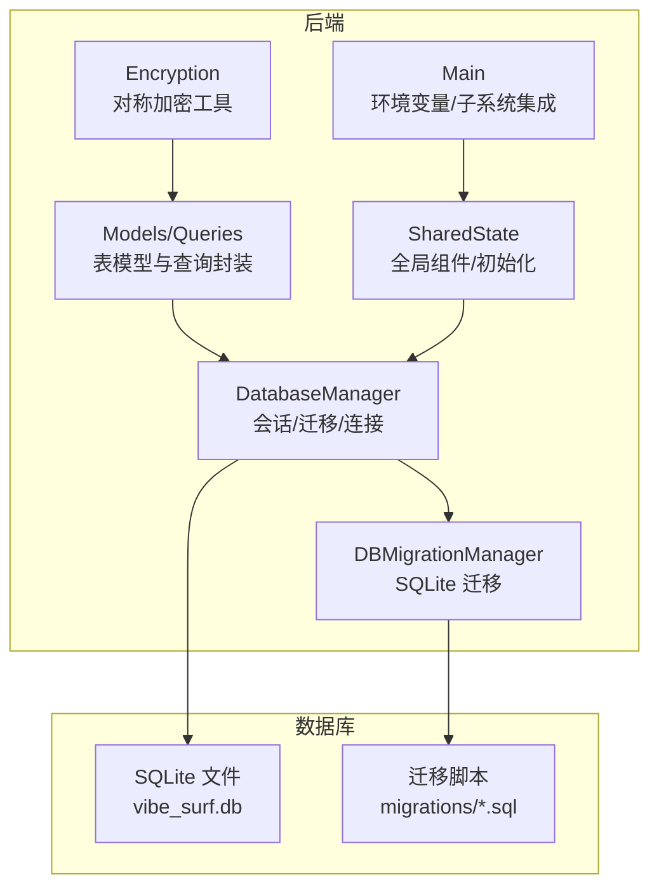
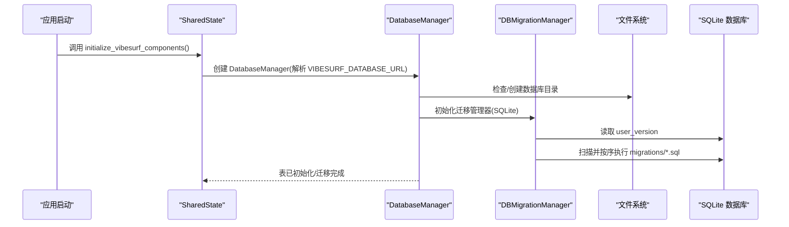
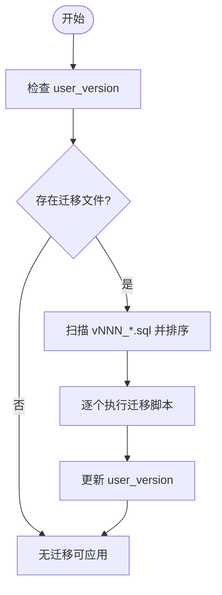
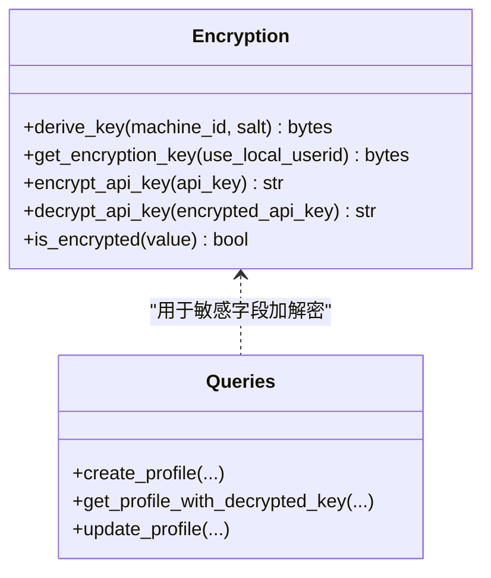
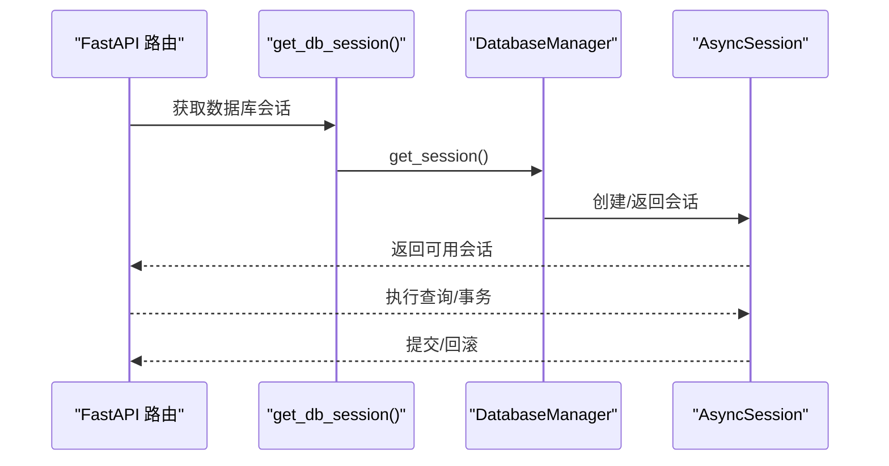
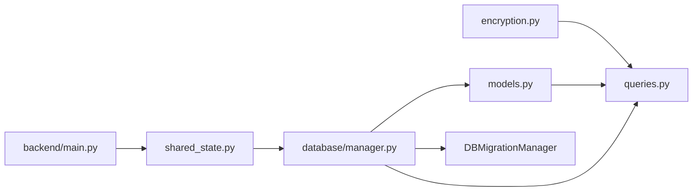

# 备份与恢复

<cite>
**本文引用的文件**
- [vibe_surf/backend/database/manager.py](file://vibe_surf/backend/database/manager.py)
- [vibe_surf/backend/database/models.py](file://vibe_surf/backend/database/models.py)
- [vibe_surf/backend/database/queries.py](file://vibe_surf/backend/database/queries.py)
- [vibe_surf/backend/database/migrations/v001_initial_schema.sql](file://vibe_surf/backend/database/migrations/v001_initial_schema.sql)
- [vibe_surf/backend/database/migrations/v006_add_credentials_table.sql](file://vibe_surf/backend/database/migrations/v006_add_credentials_table.sql)
- [vibe_surf/backend/database/migrations/v007_add_schedule_table.sql](file://vibe_surf/backend/database/migrations/v007_add_schedule_table.sql)
- [vibe_surf/backend/utils/encryption.py](file://vibe_surf/backend/utils/encryption.py)
- [vibe_surf/backend/shared_state.py](file://vibe_surf/backend/shared_state.py)
- [vibe_surf/backend/main.py](file://vibe_surf/backend/main.py)
</cite>

## 目录
1. [简介](#简介)
2. [项目结构](#项目结构)
3. [核心组件](#核心组件)
4. [架构总览](#架构总览)
5. [详细组件分析](#详细组件分析)
6. [依赖关系分析](#依赖关系分析)
7. [性能考量](#性能考量)
8. [故障排查指南](#故障排查指南)
9. [结论](#结论)
10. [附录：备份与恢复操作指南](#附录备份与恢复操作指南)

## 简介
本文件面向 VibeSurf 数据库的备份与恢复机制，结合现有代码实现，给出可落地的备份策略、加密与完整性保护、灾难恢复流程（RPO/RTO）、不同场景下的恢复操作步骤，以及监控与验证测试思路与成本优化建议。需要特别说明的是：当前仓库中未发现内置的自动化备份/恢复脚本或增量备份实现；数据库迁移与模式演进通过 SQLite PRAGMA user_version 与迁移脚本完成，敏感数据通过本地机器特征派生密钥进行对称加密存储。因此，本文在“备份与恢复”主题下，基于现有能力提出工程化的实践方案，并明确当前实现的边界。

## 项目结构
VibeSurf 后端使用 SQLAlchemy 异步引擎连接数据库，默认为 SQLite 文件型数据库，位于工作空间目录下的 vibe_surf.db。数据库初始化、迁移与会话管理由 DatabaseManager 统一负责；敏感信息（如 API Key）通过 encryption 工具以本地机器特征派生密钥进行对称加密存储；共享状态 shared_state 负责全局组件初始化与数据库连接注入。

图表来源
- [vibe_surf/backend/database/manager.py](file://vibe_surf/backend/database/manager.py#L148-L201)
- [vibe_surf/backend/database/migrations/v001_initial_schema.sql](file://vibe_surf/backend/database/migrations/v001_initial_schema.sql#L1-L118)
- [vibe_surf/backend/utils/encryption.py](file://vibe_surf/backend/utils/encryption.py#L65-L127)
- [vibe_surf/backend/shared_state.py](file://vibe_surf/backend/shared_state.py#L518-L538)
- [vibe_surf/backend/main.py](file://vibe_surf/backend/main.py#L66-L83)

章节来源
- [vibe_surf/backend/database/manager.py](file://vibe_surf/backend/database/manager.py#L148-L201)
- [vibe_surf/backend/database/migrations/v001_initial_schema.sql](file://vibe_surf/backend/database/migrations/v001_initial_schema.sql#L1-L118)
- [vibe_surf/backend/utils/encryption.py](file://vibe_surf/backend/utils/encryption.py#L65-L127)
- [vibe_surf/backend/shared_state.py](file://vibe_surf/backend/shared_state.py#L518-L538)
- [vibe_surf/backend/main.py](file://vibe_surf/backend/main.py#L66-L83)

## 核心组件
- DatabaseManager：负责数据库连接、会话管理、迁移应用（仅 SQLite），以及表初始化。
- DBMigrationManager：SQLite 专用迁移管理器，读取 migrations 目录中的 SQL 脚本，按版本号顺序执行，维护 user_version 版本。
- Models/Queries：定义业务表结构与常用查询封装，涉及敏感字段的加解密处理。
- Encryption：基于本地机器特征（MAC 或用户标识）派生对称密钥，对 API Key 等敏感数据进行加密/解密。
- SharedState/Backend Main：负责初始化数据库连接、加载环境变量、设置 Langflow 数据库路径等。

章节来源
- [vibe_surf/backend/database/manager.py](file://vibe_surf/backend/database/manager.py#L27-L146)
- [vibe_surf/backend/database/manager.py](file://vibe_surf/backend/database/manager.py#L148-L201)
- [vibe_surf/backend/database/models.py](file://vibe_surf/backend/database/models.py#L1-L289)
- [vibe_surf/backend/database/queries.py](file://vibe_surf/backend/database/queries.py#L1-L264)
- [vibe_surf/backend/utils/encryption.py](file://vibe_surf/backend/utils/encryption.py#L65-L127)
- [vibe_surf/backend/shared_state.py](file://vibe_surf/backend/shared_state.py#L518-L538)
- [vibe_surf/backend/main.py](file://vibe_surf/backend/main.py#L66-L83)

## 架构总览
数据库层采用 SQLite 文件存储，迁移通过 DBMigrationManager 与 SQL 脚本驱动；敏感数据在写入前加密，在读取时解密；应用启动时通过 shared_state 初始化数据库连接并应用迁移；Langflow 子系统使用独立的 SQLite 数据库（langflow.db），其路径由 backend/main.py 注入环境变量。

图表来源
- [vibe_surf/backend/shared_state.py](file://vibe_surf/backend/shared_state.py#L518-L538)
- [vibe_surf/backend/database/manager.py](file://vibe_surf/backend/database/manager.py#L27-L146)
- [vibe_surf/backend/database/migrations/v001_initial_schema.sql](file://vibe_surf/backend/database/migrations/v001_initial_schema.sql#L1-L118)

## 详细组件分析

### 数据库迁移与版本控制
- 迁移管理器仅支持 SQLite，通过 PRAGMA user_version 记录当前版本，按 vNNN_*.sql 的命名规则扫描并顺序执行。
- 迁移脚本包含建表、索引、触发器等，确保模式演进与性能优化。
- 应用启动时自动调用 create_tables(use_migrations=True)，若迁移失败则回退到直接建表。

图表来源
- [vibe_surf/backend/database/manager.py](file://vibe_surf/backend/database/manager.py#L27-L146)
- [vibe_surf/backend/database/migrations/v001_initial_schema.sql](file://vibe_surf/backend/database/migrations/v001_initial_schema.sql#L1-L118)

章节来源
- [vibe_surf/backend/database/manager.py](file://vibe_surf/backend/database/manager.py#L27-L146)
- [vibe_surf/backend/database/migrations/v001_initial_schema.sql](file://vibe_surf/backend/database/migrations/v001_initial_schema.sql#L1-L118)
- [vibe_surf/backend/database/migrations/v006_add_credentials_table.sql](file://vibe_surf/backend/database/migrations/v006_add_credentials_table.sql#L1-L26)
- [vibe_surf/backend/database/migrations/v007_add_schedule_table.sql](file://vibe_surf/backend/database/migrations/v007_add_schedule_table.sql#L1-L29)

### 敏感数据加密与完整性
- 加密：基于本地机器特征（MAC 地址或用户标识）派生对称密钥，使用 Fernet 对 API Key 等敏感字段进行加密存储。
- 解密：读取时根据相同密钥派生并解密，支持回退到本地用户标识派生密钥。
- 完整性：加密值为 base64 编码字符串，可通过 is_encrypted 判断是否为加密格式。

图表来源
- [vibe_surf/backend/utils/encryption.py](file://vibe_surf/backend/utils/encryption.py#L65-L127)
- [vibe_surf/backend/database/queries.py](file://vibe_surf/backend/database/queries.py#L21-L140)

章节来源
- [vibe_surf/backend/utils/encryption.py](file://vibe_surf/backend/utils/encryption.py#L65-L127)
- [vibe_surf/backend/database/queries.py](file://vibe_surf/backend/database/queries.py#L21-L140)
- [vibe_surf/backend/database/models.py](file://vibe_surf/backend/database/models.py#L29-L90)

### 数据库连接与会话管理
- DatabaseManager 支持 SQLite 与非 SQLite（生产环境）两种模式，异步会话工厂与回滚/关闭逻辑完善。
- 仅 SQLite 支持迁移管理器；非 SQLite 不启用迁移管理器。
- 提供 get_db_session FastAPI 依赖，供路由层注入。

图表来源
- [vibe_surf/backend/database/manager.py](file://vibe_surf/backend/database/manager.py#L276-L285)
- [vibe_surf/backend/database/manager.py](file://vibe_surf/backend/database/manager.py#L229-L239)

章节来源
- [vibe_surf/backend/database/manager.py](file://vibe_surf/backend/database/manager.py#L148-L201)
- [vibe_surf/backend/database/manager.py](file://vibe_surf/backend/database/manager.py#L229-L239)
- [vibe_surf/backend/database/manager.py](file://vibe_surf/backend/database/manager.py#L276-L285)

### 启动与环境集成
- backend/main.py 在启动时为 Langflow 设置 SQLite 数据库路径（langflow.db），并注入日志与调试级别。
- shared_state.initialize_vibesurf_components() 中解析 VIBESURF_DATABASE_URL，若为空则默认使用工作空间目录下的 vibe_surf.db，并初始化数据库与迁移。

章节来源
- [vibe_surf/backend/main.py](file://vibe_surf/backend/main.py#L66-L83)
- [vibe_surf/backend/shared_state.py](file://vibe_surf/backend/shared_state.py#L518-L538)

## 依赖关系分析
- DatabaseManager 依赖 DBMigrationManager（仅 SQLite）与 SQLAlchemy 异步引擎。
- Models/Queries 依赖 Base 元数据与枚举类型，查询层对敏感字段使用 encryption 工具。
- Encryption 依赖本地机器特征与 Fernet 对称加密库。
- SharedState 依赖 DatabaseManager 进行初始化，并向其他模块提供全局状态。
- Backend Main 依赖 SharedState 并为 Langflow 设置数据库路径。

图表来源
- [vibe_surf/backend/database/manager.py](file://vibe_surf/backend/database/manager.py#L27-L146)
- [vibe_surf/backend/database/queries.py](file://vibe_surf/backend/database/queries.py#L1-L264)
- [vibe_surf/backend/database/models.py](file://vibe_surf/backend/database/models.py#L1-L289)
- [vibe_surf/backend/utils/encryption.py](file://vibe_surf/backend/utils/encryption.py#L65-L127)
- [vibe_surf/backend/shared_state.py](file://vibe_surf/backend/shared_state.py#L518-L538)
- [vibe_surf/backend/main.py](file://vibe_surf/backend/main.py#L66-L83)

章节来源
- [vibe_surf/backend/database/manager.py](file://vibe_surf/backend/database/manager.py#L27-L146)
- [vibe_surf/backend/database/queries.py](file://vibe_surf/backend/database/queries.py#L1-L264)
- [vibe_surf/backend/database/models.py](file://vibe_surf/backend/database/models.py#L1-L289)
- [vibe_surf/backend/utils/encryption.py](file://vibe_surf/backend/utils/encryption.py#L65-L127)
- [vibe_surf/backend/shared_state.py](file://vibe_surf/backend/shared_state.py#L518-L538)
- [vibe_surf/backend/main.py](file://vibe_surf/backend/main.py#L66-L83)

## 性能考量
- SQLite 连接池：开发模式使用 StaticPool，生产环境建议使用非静态池并配置连接参数（见 DatabaseManager 非 SQLite 分支）。
- 迁移执行：按版本顺序执行，避免重复与冲突；建议在变更频繁阶段谨慎推进版本号。
- 查询索引：迁移脚本中已为高频查询列建立索引，有助于提升查询性能。
- 加密开销：敏感字段在入库前加密/解密，建议批量写入时减少往返，避免不必要的解密。

[本节为通用指导，不直接分析具体文件]

## 故障排查指南
- 迁移失败：检查 migrations 目录是否存在匹配命名的 SQL 文件，确认 user_version 是否正确更新；查看异常日志定位失败版本。
- 连接问题：确认 VIBESURF_DATABASE_URL 是否有效，SQLite 路径是否存在且可写；生产环境检查网络连通性与认证信息。
- 加密异常：确认本地机器特征是否可获取，必要时回退到本地用户标识派生密钥；检查 is_encrypted 判定逻辑。
- 会话异常：确认 get_db_session 依赖是否正确注入，事务提交/回滚是否正常执行。

章节来源
- [vibe_surf/backend/database/manager.py](file://vibe_surf/backend/database/manager.py#L27-L146)
- [vibe_surf/backend/utils/encryption.py](file://vibe_surf/backend/utils/encryption.py#L98-L127)
- [vibe_surf/backend/database/manager.py](file://vibe_surf/backend/database/manager.py#L229-L239)

## 结论
- 当前实现以 SQLite 为主，具备完善的迁移与版本控制能力，敏感数据采用本地派生密钥加密。
- 未发现内置的自动化备份/恢复脚本与增量备份机制；RPO/RTO 由 SQLite 文件与迁移脚本决定。
- 建议在现有基础上补充外部备份策略（如定期复制 SQLite 文件、归档迁移脚本、加密备份介质）与恢复演练，以满足生产级可靠性要求。

[本节为总结性内容，不直接分析具体文件]

## 附录：备份与恢复操作指南

### 1. 备份策略设计
- 全量备份
  - 频率：每日一次（建议在业务低峰期执行）
  - 存储位置：本地磁盘与远端对象存储（如 S3/云盘）双写，保留至少 7 天全量备份
  - 备份内容：vibe_surf.db 文件与其所在目录（含迁移脚本目录）
- 增量备份
  - 当前代码未实现增量备份；可在外部通过文件系统层面的差异同步（如 rsync 差分）或数据库层面的 WAL 日志导出（SQLite）进行补充
- 加密保护
  - 建议对备份文件进行二次加密（如 AES-GCM），密钥与备份分离存放
- 完整性验证
  - 生成校验和（如 SHA-256）并随备份一同归档
  - 定期抽样恢复验证（见“验证测试”）

[本节为概念性方案，不直接分析具体文件]

### 2. 灾难恢复流程（RPO/RTO）
- RPO：由备份频率决定，建议 RPO ≤ 1 天
- RTO：取决于恢复验证与数据重建时间，建议 RTO ≤ 2 小时
- 关键步骤
  - 识别最近可用备份（按时间戳与校验和）
  - 在隔离环境中进行恢复验证（新建临时数据库目录）
  - 验证 user_version 与关键表结构一致性
  - 验证敏感字段解密可用性（API Key 等）
  - 逐步切换流量并持续监控

[本节为概念性方案，不直接分析具体文件]

### 3. 不同场景下的恢复操作
- 单表恢复
  - 从最近全量备份还原 vibe_surf.db
  - 使用 SQLite 工具导出目标表数据，再导入到新数据库对应表中（注意主键与外键约束）
  - 验证目标表数据完整性与索引有效性
- 时间点恢复（SQLite）
  - 若启用 WAL 模式，可利用 SQLite 的备份接口或 WAL 日志进行近似时间点恢复
  - 建议在生产环境开启 WAL 并定期归档 WAL 文件
- 完整系统恢复
  - 还原 vibe_surf.db 与迁移脚本目录
  - 启动应用，自动执行迁移至最新版本
  - 验证各表 user_version 与索引状态
  - 验证敏感字段解密可用性

[本节为概念性方案，不直接分析具体文件]

### 4. 备份监控与验证测试
- 自动化脚本建议
  - 备份脚本：定时执行 vibe_surf.db 复制、生成校验和、上传到对象存储
  - 验证脚本：随机抽取最近 N 份备份，恢复到临时目录，执行以下验证：
    - 迁移应用成功且 user_version 达到目标版本
    - 关键表存在且索引完整
    - 敏感字段解密成功（API Key 等）
    - 代表性查询返回一致结果
- 成本优化策略
  - 本地缓存近期备份，远端长期归档
  - 使用压缩与去重技术降低存储成本
  - 采用冷/热分层存储，平衡访问延迟与成本

[本节为概念性方案，不直接分析具体文件]