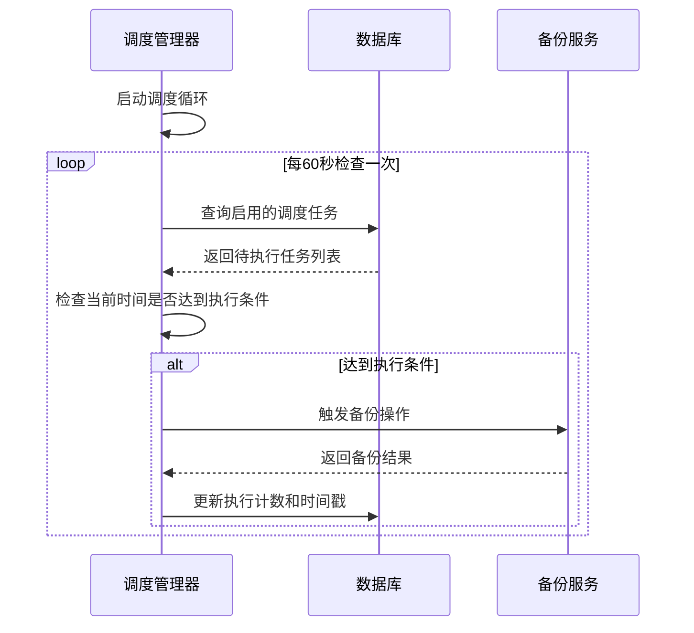
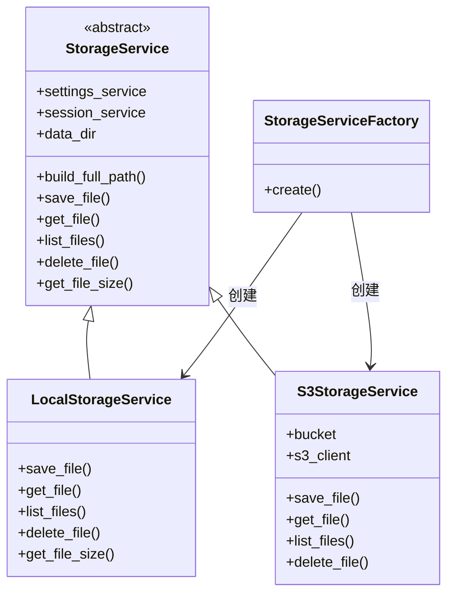
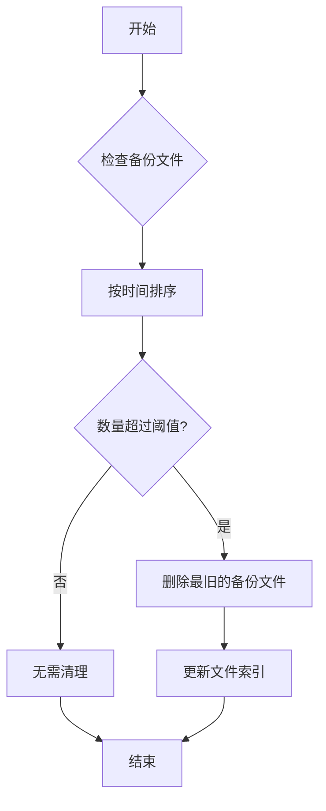

# 备份策略

<cite>
**本文档中引用的文件**  
- [manager.py](file://vibe_surf/backend/database/manager.py)
- [local.py](file://vibe_surf/langflow/services/storage/local.py)
- [s3.py](file://vibe_surf/langflow/services/storage/s3.py)
- [settings.py](file://vibe_surf/langflow/settings.py)
- [v007_add_schedule_table.sql](file://vibe_surf/backend/database/migrations/v007_add_schedule_table.sql)
- [settings-workflow.js](file://vibe_surf/chrome_extension/scripts/settings-workflow.js)
- [shared_state.py](file://vibe_surf/backend/shared_state.py)
- [compression.py](file://vibe_surf/langflow/utils/compression.py)
</cite>

## 目录
1. [引言](#引言)
2. [备份执行频率与调度机制](#备份执行频率与调度机制)
3. [存储位置配置](#存储位置配置)
4. [备份文件命名与生命周期管理](#备份文件命名与生命周期管理)
5. [性能优化措施](#性能优化措施)
6. [配置示例与最佳实践](#配置示例与最佳实践)
7. [结论](#结论)

## 引言
VibeSurf的数据库备份策略旨在确保数据的持久性、可恢复性和高可用性。该策略通过自动化调度机制实现全量和增量备份，并支持本地与云存储的灵活配置。本文件详细说明了备份的执行频率、触发条件、存储选项、文件命名规范、生命周期管理以及性能优化措施，为系统管理员提供完整的配置指导和最佳实践建议。

## 备份执行频率与调度机制
VibeSurf的备份调度机制基于cron表达式实现，支持多种频率配置。系统通过`ScheduleManager`类管理所有调度任务，定期检查并执行符合条件的备份操作。

备份调度支持以下频率选项：
- **每X分钟**：使用`*/X * * * *`格式的cron表达式，适用于高频数据变化场景
- **每X小时**：使用`0 */X * * *`格式的cron表达式，适合中等频率的数据更新
- **每日**：使用`分钟 小时 * * *`格式的cron表达式，如`0 8 * * *`表示每天8点执行
- **每周**：使用`分钟 小时 * * 周几`格式的cron表达式，如`0 8 * * 1`表示每周一8点执行
- **每月**：使用`分钟 小时 日期 * *`格式的cron表达式，如`0 8 1 * *`表示每月1号8点执行

调度机制通过`ScheduleManager._schedule_loop()`方法实现，每60秒检查一次待执行的备份任务。当系统时间达到或超过`next_execution_at`字段指定的时间戳时，触发相应的备份操作，并自动更新下次执行时间。



**Diagram sources**
- [shared_state.py](file://vibe_surf/backend/shared_state.py#L740-L899)
- [v007_add_schedule_table.sql](file://vibe_surf/backend/database/migrations/v007_add_schedule_table.sql#L4-L29)

**Section sources**
- [shared_state.py](file://vibe_surf/backend/shared_state.py#L740-L899)
- [settings-workflow.js](file://vibe_surf/chrome_extension/scripts/settings-workflow.js#L2234-L2480)

## 存储位置配置
VibeSurf支持两种主要的备份存储位置：本地存储和云存储（AWS S3）。存储类型通过配置文件中的`storage_type`参数进行设置，系统根据该配置动态加载相应的存储服务。

### 本地存储配置
本地存储服务由`LocalStorageService`类实现，将备份文件存储在本地文件系统中。配置时需要指定`config_dir`参数，该参数定义了备份文件的根目录。系统会为每个备份任务创建独立的子目录，确保文件组织的清晰性。

### 云存储配置
云存储服务由`S3StorageService`类实现，支持将备份文件上传至AWS S3存储桶。配置时需要提供以下参数：
- `storage_type`: 设置为"s3"
- AWS凭证信息（通过环境变量或配置文件提供）
- S3存储桶名称（默认为"langflow"）
- 区域配置

存储服务的工厂模式实现确保了存储类型的灵活切换。`StorageServiceFactory`根据`storage_type`的值动态创建相应的存储服务实例。



**Diagram sources**
- [local.py](file://vibe_surf/langflow/services/storage/local.py#L9-L128)
- [s3.py](file://vibe_surf/langflow/services/storage/s3.py#L9-L106)
- [factory.py](file://vibe_surf/langflow/services/storage/factory.py#L10-L30)

**Section sources**
- [local.py](file://vibe_surf/langflow/services/storage/local.py#L9-L128)
- [s3.py](file://vibe_surf/langflow/services/storage/s3.py#L9-L106)
- [factory.py](file://vibe_surf/langflow/services/storage/factory.py#L10-L30)

## 备份文件命名与生命周期管理
VibeSurf的备份文件命名遵循严格的规范，确保文件的可识别性和版本控制。文件名包含时间戳、备份类型和唯一标识符等信息，便于管理和恢复。

### 命名规范
备份文件采用以下命名格式：
```
backup_{type}_{timestamp}_{flow_id}.sql
```
其中：
- `{type}`: 备份类型（full表示全量，incremental表示增量）
- `{timestamp}`: ISO 8601格式的时间戳（YYYYMMDDHHMMSS）
- `{flow_id}`: 关联的工作流ID

### 生命周期管理
系统通过以下机制管理备份文件的生命周期：
1. **保留周期配置**：通过`max_backups_to_keep`参数控制每个工作流保留的备份文件数量
2. **自动清理**：定期清理超出保留周期的旧备份文件
3. **空间监控**：监控存储空间使用情况，当达到阈值时触发清理操作

生命周期管理策略在`temp_flow_cleanup.py`中实现，通过后台任务定期执行清理操作，确保存储空间的有效利用。



**Diagram sources**
- [temp_flow_cleanup.py](file://vibe_surf/langflow/services/task/temp_flow_cleanup.py#L49-L108)
- [local.py](file://vibe_surf/langflow/services/storage/local.py#L100-L112)

**Section sources**
- [temp_flow_cleanup.py](file://vibe_surf/langflow/services/task/temp_flow_cleanup.py#L49-L108)
- [local.py](file://vibe_surf/langflow/services/storage/local.py#L100-L112)

## 性能优化措施
VibeSurf在备份过程中实施了多项性能优化措施，确保备份操作对系统性能的影响最小化。

### 压缩算法选择
系统采用GZIP压缩算法对备份文件进行压缩，压缩级别设置为6，在压缩比和性能之间取得平衡。压缩操作在`compression.py`文件中实现，使用Python标准库的`gzip`模块。

```python
compressed_data = gzip.compress(json_data, compresslevel=6)
```

### I/O调度优化
I/O调度优化通过以下方式实现：
1. **异步I/O操作**：使用`asyncio`和`aiofile`库实现非阻塞文件操作
2. **批量处理**：将多个小文件操作合并为批量操作，减少I/O开销
3. **连接池管理**：对数据库连接进行池化管理，避免频繁创建和销毁连接

### 资源限制
系统通过以下参数控制备份操作的资源使用：
- `max_concurrent_backups`: 限制同时执行的备份任务数量
- `backup_chunk_size`: 控制每次读取和写入的数据块大小
- `io_priority`: 设置备份操作的I/O优先级

这些优化措施确保了备份操作在高负载环境下仍能稳定运行，同时最小化对主业务流程的影响。

**Section sources**
- [compression.py](file://vibe_surf/langflow/utils/compression.py#L1-L19)
- [local.py](file://vibe_surf/langflow/services/storage/local.py#L21-L44)
- [manager.py](file://vibe_surf/backend/database/manager.py#L163-L184)

## 配置示例与最佳实践
本节提供VibeSurf备份策略的配置示例和最佳实践建议，帮助用户根据业务需求调整备份参数。

### 配置示例
```json
{
  "storage_type": "s3",
  "config_dir": "/var/lib/vibesurf/backups",
  "max_backups_to_keep": 30,
  "backup_compression_level": 6,
  "max_concurrent_backups": 3,
  "schedules": [
    {
      "flow_id": "daily-backup",
      "cron_expression": "0 2 * * *",
      "description": "每日凌晨2点执行全量备份",
      "backup_type": "full"
    },
    {
      "flow_id": "hourly-incremental",
      "cron_expression": "0 * * * *",
      "description": "每小时执行增量备份",
      "backup_type": "incremental"
    }
  ]
}
```

### 最佳实践
1. **根据业务需求调整频率**：
   - 高频交易系统：建议每小时增量备份，每日全量备份
   - 一般业务系统：建议每日增量备份，每周全量备份
   - 低频系统：建议每周增量备份，每月全量备份

2. **存储位置选择**：
   - 本地存储：适合对恢复速度要求高的场景
   - 云存储：适合需要异地容灾的场景
   - 混合存储：本地保留近期备份，云存储保留历史备份

3. **保留周期建议**：
   - 生产环境：至少保留30天的备份
   - 关键业务：建议保留90天或更长时间
   - 法规要求：根据行业法规确定保留周期

4. **监控与告警**：
   - 监控备份任务的执行状态
   - 设置备份失败告警
   - 定期验证备份文件的可恢复性

**Section sources**
- [settings.py](file://vibe_surf/langflow/settings.py)
- [shared_state.py](file://vibe_surf/backend/shared_state.py#L700-L738)
- [v007_add_schedule_table.sql](file://vibe_surf/backend/database/migrations/v007_add_schedule_table.sql#L4-L29)

## 结论
VibeSurf的数据库备份策略提供了一套完整、灵活且高性能的数据保护解决方案。通过基于cron的调度机制、多存储位置支持、标准化的文件命名和生命周期管理，以及多项性能优化措施，系统能够满足不同业务场景下的备份需求。管理员可以根据具体业务特点，通过配置文件灵活调整备份频率、存储位置和保留周期，确保数据安全的同时优化资源利用。建议定期审查和测试备份策略，确保在发生数据丢失或系统故障时能够快速恢复业务运行。