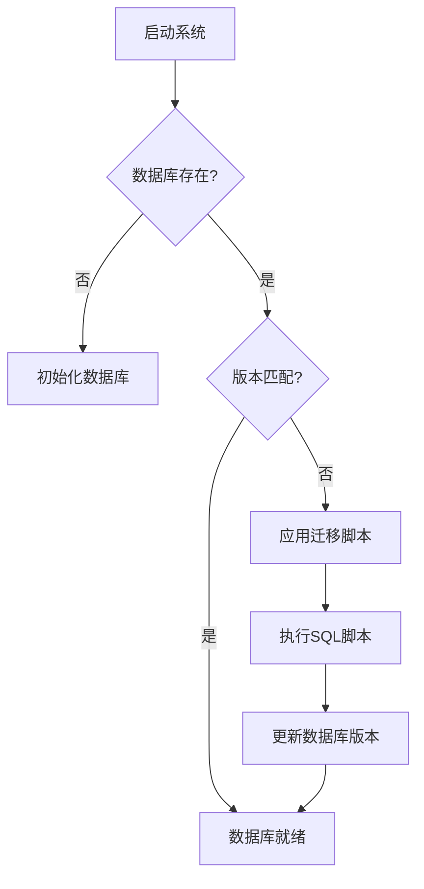
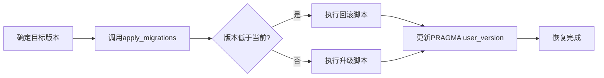
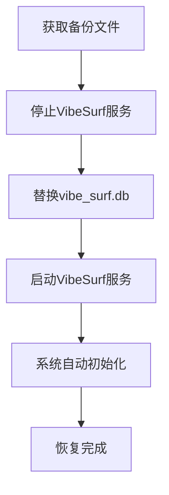
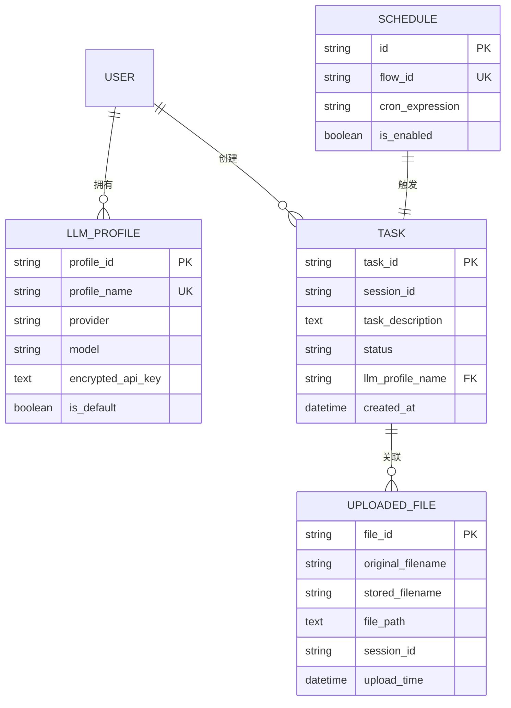

# 恢复流程

<cite>
**本文档引用的文件**
- [manager.py](file://vibe_surf/backend/database/manager.py)
- [models.py](file://vibe_surf/backend/database/models.py)
- [queries.py](file://vibe_surf/backend/database/queries.py)
- [encryption.py](file://vibe_surf/backend/utils/encryption.py)
- [shared_state.py](file://vibe_surf/backend/shared_state.py)
- [v001_initial_schema.sql](file://vibe_surf/backend/database/migrations/v001_initial_schema.sql)
- [v006_add_credentials_table.sql](file://vibe_surf/backend/database/migrations/v006_add_credentials_table.sql)
- [v007_add_schedule_table.sql](file://vibe_surf/backend/database/migrations/v007_add_schedule_table.sql)
</cite>

## 目录
1. [引言](#引言)
2. [恢复场景与流程](#恢复场景与流程)
3. [灾难恢复启动条件](#灾难恢复启动条件)
4. [恢复过程监控与进度跟踪](#恢复过程监控与进度跟踪)
5. [RPO与RTO实现机制](#rpo与rto实现机制)
6. [数据完整性验证](#数据完整性验证)
7. [命令行工具与自动化脚本](#命令行工具与自动化脚本)
8. [结论](#结论)

## 引言

VibeSurf是一个浏览器自动化工具，其后端系统使用SQLite数据库存储任务、配置文件、上传文件和调度信息。本指南详细说明了VibeSurf数据库的恢复流程，涵盖单表恢复、时间点恢复和完整系统恢复等不同场景。文档还介绍了灾难恢复的启动条件、恢复过程中的状态监控、恢复点目标（RPO）和恢复时间目标（RTO）的实现机制，以及如何验证恢复数据的完整性和一致性。

**Section sources**
- [manager.py](file://vibe_surf/backend/database/manager.py#L1-L319)
- [models.py](file://vibe_surf/backend/database/models.py#L1-L289)

## 恢复场景与流程

VibeSurf的数据库恢复主要依赖于其内置的迁移系统和数据备份机制。恢复流程根据不同的场景分为单表恢复、时间点恢复和完整系统恢复。

### 单表恢复

单表恢复是指在数据库整体正常的情况下，对特定数据表进行数据修复或重建。VibeSurf通过数据库迁移（Migration）机制实现单表恢复。

**流程：**
1.  **识别问题表**：确定需要恢复的表，如`llm_profiles`、`tasks`、`uploaded_files`等。
2.  **应用迁移脚本**：系统通过`DBMigrationManager`类应用相应的SQL迁移脚本。
3.  **执行恢复**：迁移脚本会执行`CREATE TABLE IF NOT EXISTS`语句，如果表不存在则创建，如果存在则跳过，从而确保表结构的完整性。

例如，`v001_initial_schema.sql`迁移脚本定义了`llm_profiles`表的创建语句：
```sql
CREATE TABLE IF NOT EXISTS llm_profiles (
    profile_id VARCHAR(36) NOT NULL PRIMARY KEY,
    profile_name VARCHAR(100) NOT NULL UNIQUE,
    provider VARCHAR(50) NOT NULL,
    model VARCHAR(100) NOT NULL,
    ...
);
```
当系统启动时，如果检测到`llm_profiles`表不存在，该脚本将自动创建它。



**Diagram sources**
- [v001_initial_schema.sql](file://vibe_surf/backend/database/migrations/v001_initial_schema.sql#L1-L118)
- [manager.py](file://vibe_surf/backend/database/manager.py#L27-L145)

**Section sources**
- [manager.py](file://vibe_surf/backend/database/manager.py#L27-L145)
- [v001_initial_schema.sql](file://vibe_surf/backend/database/migrations/v001_initial_schema.sql#L1-L118)

### 时间点恢复

时间点恢复（Point-in-Time Recovery, PITR）是指将数据库恢复到某个特定时间点的状态。VibeSurf目前没有实现传统意义上的WAL（Write-Ahead Logging）日志备份，因此不支持精确到秒的时间点恢复。其恢复能力主要体现在通过版本化的迁移脚本来回滚到某个“版本点”。

**流程：**
1.  **确定目标版本**：根据业务需求，确定要恢复到的数据库版本（如v001, v002）。
2.  **执行回滚操作**：调用`apply_migrations`方法，并指定`target_version`参数。
3.  **验证状态**：检查数据库版本是否已成功回滚。



**Diagram sources**
- [manager.py](file://vibe_surf/backend/database/manager.py#L99-L145)

**Section sources**
- [manager.py](file://vibe_surf/backend/database/manager.py#L99-L145)

### 完整系统恢复

完整系统恢复是指在数据库文件丢失或损坏的情况下，从备份中恢复整个数据库系统。

**流程：**
1.  **准备备份文件**：获取最新的`vibe_surf.db`数据库备份文件。
2.  **停止服务**：关闭VibeSurf后端服务，确保没有进程占用数据库文件。
3.  **替换文件**：将备份的`vibe_surf.db`文件复制到工作目录（`workspace_dir`）下，覆盖损坏的文件。
4.  **启动服务**：重新启动VibeSurf后端服务。系统会自动检测数据库版本，并应用任何缺失的迁移脚本以确保兼容性。



**Diagram sources**
- [shared_state.py](file://vibe_surf/backend/shared_state.py#L453-L602)

**Section sources**
- [shared_state.py](file://vibe_surf/backend/shared_state.py#L453-L602)

## 灾难恢复启动条件

灾难恢复的启动条件通常由以下情况触发：

- **数据库文件损坏**：系统启动时无法连接到数据库，或在运行时出现`sqlite3.DatabaseError`。
- **数据丢失**：关键数据表（如`tasks`、`llm_profiles`）中的数据意外被删除或清空。
- **系统崩溃**：VibeSurf服务异常终止，导致数据库处于不一致状态。
- **安全事件**：怀疑数据库被未授权访问或篡改。

当满足以上任一条件时，应立即启动灾难恢复流程。

## 恢复过程监控与进度跟踪

在恢复过程中，可以通过以下方式监控和跟踪进度：

- **日志监控**：查看VibeSurf的日志文件（通常位于`workspace_dir/logs/`目录下），关注`DatabaseManager`和`DBMigrationManager`输出的日志信息。例如，`Applying migration v001...`表示正在应用迁移。
- **数据库版本检查**：通过`get_db_version()`方法查询当前数据库版本，与目标版本进行对比，以判断恢复进度。
- **系统状态API**：调用`/api/status`端点获取系统状态，其中包含数据库初始化状态。

```mermaid
flowchart TD
A[开始恢复] --> B[检查日志]
B --> C[查找迁移信息]
C --> D{找到"Applying migration"?}
D --> |是| E[获取当前版本]
D --> |否| F[检查"Database ready"]
E --> G[与目标版本对比]
G --> H[计算剩余进度]
F --> I[恢复完成]
```

**Diagram sources**
- [manager.py](file://vibe_surf/backend/database/manager.py#L55-L63)
- [shared_state.py](file://vibe_surf/backend/shared_state.py#L671-L693)

**Section sources**
- [manager.py](file://vibe_surf/backend/database/manager.py#L55-L63)
- [shared_state.py](file://vibe_surf/backend/shared_state.py#L671-L693)

## RPO与RTO实现机制

### 恢复点目标（RPO）

RPO是指系统发生故障时可能丢失的数据量。VibeSurf的RPO主要由其数据持久化策略决定。

- **机制**：VibeSurf使用SQLite数据库，所有数据变更在事务提交后立即写入磁盘。这意味着在正常操作下，RPO接近于0，即最多丢失最后一次未提交的事务。
- **影响因素**：如果用户没有定期备份数据库文件，那么RPO将取决于上次备份的时间点。例如，如果每天备份一次，那么最坏情况下可能丢失24小时的数据。

### 恢复时间目标（RTO）

RTO是指系统从故障中恢复到正常运行状态所需的时间。

- **机制**：VibeSurf的RTO主要取决于数据库文件的大小和迁移脚本的数量。系统启动时会自动执行必要的迁移，这个过程是自动化的。
- **优化**：通过保持数据库文件较小（如定期清理旧任务）和减少迁移脚本的复杂度，可以有效缩短RTO。



**Diagram sources**
- [models.py](file://vibe_surf/backend/database/models.py#L1-L289)

**Section sources**
- [models.py](file://vibe_surf/backend/database/models.py#L1-L289)

## 数据完整性验证

恢复完成后，必须验证数据的完整性和一致性。

### 验证方法

1.  **结构验证**：检查所有数据表和索引是否按预期存在。
2.  **数据验证**：查询关键表（如`llm_profiles`）的记录数，确认数据已恢复。
3.  **加密数据验证**：对于存储加密数据的表（如`credentials`），验证解密功能是否正常。

例如，`credentials`表的创建脚本如下：
```sql
CREATE TABLE IF NOT EXISTS credentials (
    id VARCHAR(36) PRIMARY KEY,
    key_name VARCHAR(100) NOT NULL UNIQUE,
    encrypted_value TEXT,
    description TEXT,
    created_at DATETIME NOT NULL DEFAULT CURRENT_TIMESTAMP,
    updated_at DATETIME NOT NULL DEFAULT CURRENT_TIMESTAMP
);
```
恢复后，应确保`key_name`的唯一性约束仍然有效。

### 加密机制

VibeSurf使用机器的MAC地址作为密钥来加密敏感数据（如API密钥），通过`encryption.py`中的`encrypt_api_key`和`decrypt_api_key`函数实现。这确保了即使数据库文件被窃取，数据也无法在其他机器上解密。


**Diagram sources**
- [v006_add_credentials_table.sql](file://vibe_surf/backend/database/migrations/v006_add_credentials_table.sql#L1-L26)
- [encryption.py](file://vibe_surf/backend/utils/encryption.py#L76-L127)

**Section sources**
- [v006_add_credentials_table.sql](file://vibe_surf/backend/database/migrations/v006_add_credentials_table.sql#L1-L26)
- [encryption.py](file://vibe_surf/backend/utils/encryption.py#L76-L127)

## 命令行工具与自动化脚本

VibeSurf提供了`cli.py`作为命令行接口，可用于启动服务和进行系统管理。

### 命令行工具使用示例

- **启动服务**：
  ```bash
  python -m vibe_surf.cli
  ```
- **跳过浏览器选择**：
  ```bash
  python -m vibe_surf.cli --no_select_browser
  ```

### 自动化恢复脚本示例

以下是一个简单的Bash脚本，用于执行完整系统恢复：

```bash
#!/bin/bash
# restore_db.sh

BACKUP_DIR="/path/to/backups"
WORKSPACE_DIR="./vibesurf_workspace"
DB_NAME="vibe_surf.db"

echo "停止VibeSurf服务..."
# 停止服务的命令，例如 pkill -f "uvicorn"

echo "从备份中恢复数据库..."
cp "$BACKUP_DIR/$DB_NAME" "$WORKSPACE_DIR/$DB_NAME"

echo "启动VibeSurf服务..."
# 启动服务的命令，例如 python -m vibe_surf.cli --no_select_browser

echo "恢复完成。"
```

**Section sources**
- [cli.py](file://vibe_surf/cli.py#L1-L562)

## 结论

VibeSurf的数据库恢复流程主要依赖于其健壮的迁移系统和基于文件的备份策略。通过理解其数据库结构、迁移机制和加密方案，可以有效地执行单表恢复、时间点恢复和完整系统恢复。为了确保数据安全，建议用户定期备份`vibe_surf.db`文件，并熟悉本指南中的恢复流程。