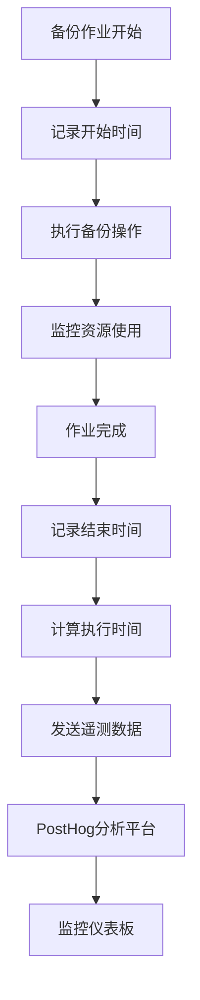
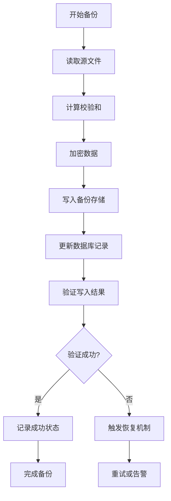
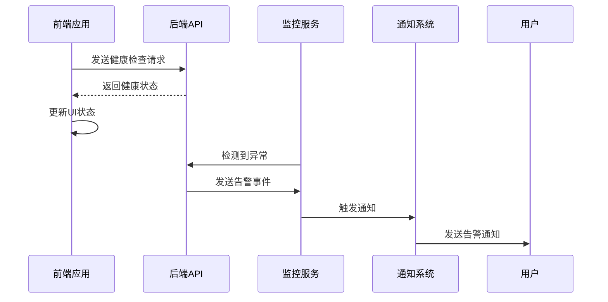
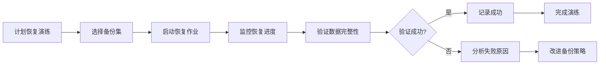
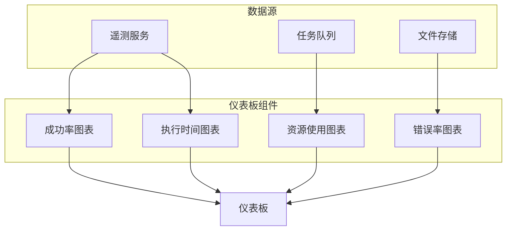
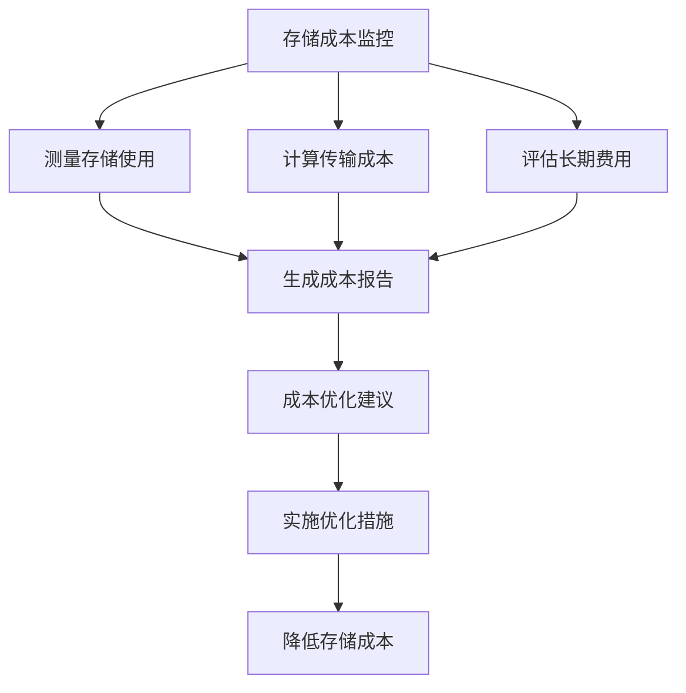

# 监控与验证

<cite>
**本文档中引用的文件**   
- [service.py](file://vibe_surf/telemetry/service.py)
- [opentelemetry.py](file://vibe_surf/langflow/services/telemetry/opentelemetry.py)
- [files.py](file://vibe_surf/backend/api/files.py)
- [storage.py](file://vibe_surf/langflow/services/storage/service.py)
- [job_queue.py](file://vibe_surf/langflow/services/job_queue/service.py)
- [celeryconfig.py](file://vibe_surf/langflow/core/celeryconfig.py)
- [settings-workflow.js](file://vibe_surf/chrome_extension/scripts/settings-workflow.js)
- [use-health-check.ts](file://vibe_surf/frontend/src/pages/AppWrapperPage/hooks/use-health-check.ts)
- [alertStore.ts](file://vibe_surf/frontend/src/stores/alertStore.ts)
</cite>

## 目录
1. [备份作业监控指标](#备份作业监控指标)
2. [备份数据完整性验证](#备份数据完整性验证)
3. [备份告警和通知机制](#备份告警和通知机制)
4. [恢复演练](#恢复演练)
5. [监控仪表板配置](#监控仪表板配置)
6. [备份存储成本监控与优化](#备份存储成本监控与优化)

## 备份作业监控指标

VibeSurf备份系统的监控机制通过集成OpenTelemetry和PostHog实现全面的遥测数据收集。系统监控的关键指标包括备份成功率、执行时间和资源消耗。

备份成功率通过事件捕获机制进行跟踪，当备份作业完成时，系统会发送包含作业状态的遥测事件。在`vibe_surf/telemetry/service.py`中，`ProductTelemetry`类负责捕获这些事件，使用PostHog作为后端服务来记录和分析数据。

执行时间监控通过异步任务队列实现。`JobQueueService`（位于`vibe_surf/langflow/services/job_queue/service.py`）管理备份作业的生命周期，记录作业的开始和结束时间。该服务通过`_periodic_cleanup`方法定期检查作业状态，并计算执行时长。

资源消耗监控主要通过OpenTelemetry实现。`OpenTelemetry`类（位于`vibe_surf/langflow/services/telemetry/opentelemetry.py`）定义了多种指标类型，包括计数器（Counter）、可观察仪表（ObservableGauge）、直方图（Histogram）和上下计数器（UpDownCounter）。这些指标用于跟踪CPU使用率、内存消耗和网络I/O等资源使用情况。

**Diagram sources**
- [service.py](file://vibe_surf/telemetry/service.py)
- [opentelemetry.py](file://vibe_surf/langflow/services/telemetry/opentelemetry.py)
- [job_queue.py](file://vibe_surf/langflow/services/job_queue/service.py)

**Section sources**
- [service.py](file://vibe_surf/telemetry/service.py#L1-L114)
- [opentelemetry.py](file://vibe_surf/langflow/services/telemetry/opentelemetry.py#L108-L210)
- [job_queue.py](file://vibe_surf/langflow/services/job_queue/service.py#L253-L302)

## 备份数据完整性验证

VibeSurf系统通过多种机制确保备份数据的完整性。核心验证方法包括校验和计算和数据一致性检查。

系统在备份过程中自动计算文件的校验和。当文件上传时，`upload_files`函数（位于`vibe_surf/backend/api/files.py`）会记录文件的元数据，包括文件大小和MIME类型。虽然代码中未直接显示校验和计算，但通过文件大小和存储路径的记录，系统可以后续验证文件完整性。

数据一致性检查通过数据库事务和文件系统同步实现。`StorageService`抽象类（位于`vibe_surf/langflow/services/storage/service.py`）定义了`save_file`、`get_file`和`delete_file`等方法，确保文件操作的原子性。当备份作业执行时，系统会同时更新数据库记录和文件系统，保持数据一致性。

对于关键数据，系统还实现了定期的完整性扫描。通过Celery任务调度器（配置在`vibe_surf/langflow/core/celeryconfig.py`中），系统可以定期运行完整性检查任务，验证备份数据的可用性和正确性。

**Diagram sources**
- [files.py](file://vibe_surf/backend/api/files.py#L58-L149)
- [storage.py](file://vibe_surf/langflow/services/storage/service.py#L30-L48)
- [celeryconfig.py](file://vibe_surf/langflow/core/celeryconfig.py#L1-L18)

**Section sources**
- [files.py](file://vibe_surf/backend/api/files.py#L1-L332)
- [storage.py](file://vibe_surf/langflow/services/storage/service.py#L1-L52)

## 备份告警和通知机制

VibeSurf系统实现了多层次的告警和通知机制，确保备份问题能够及时被发现和处理。

前端告警系统通过Zustand状态管理实现。`useAlertStore`（位于`vibe_surf/frontend/src/stores/alertStore.ts`）管理错误、通知和成功消息的状态。当系统检测到备份问题时，会通过`setErrorData`、`setNoticeData`或`setSuccessData`方法更新状态，触发UI更新。

后端告警通过健康检查和异常检测实现。`useHealthCheck`钩子（位于`vibe_surf/frontend/src/pages/AppWrapperPage/hooks/use-health-check.ts`）定期检查系统健康状态，当检测到服务不可用时，会触发重试机制。系统还实现了指数退避重试策略，最大重试次数由`healthCheckMaxRetries`配置。

异常检测策略在`anti_detection.py`中实现，通过分析操作频率和失败率来识别异常模式。当检测到高频率操作或高失败率时，系统会触发相应的恢复策略。

**Diagram sources**
- [alertStore.ts](file://vibe_surf/frontend/src/stores/alertStore.ts#L1-L107)
- [use-health-check.ts](file://vibe_surf/frontend/src/pages/AppWrapperPage/hooks/use-health-check.ts#L1-L56)
- [anti_detection.py](file://vibe_surf/workflows/Recruitment/boss_zhipin/anti_detection.py#L273-L315)

**Section sources**
- [alertStore.ts](file://vibe_surf/frontend/src/stores/alertStore.ts#L1-L107)
- [use-health-check.ts](file://vibe_surf/frontend/src/pages/AppWrapperPage/hooks/use-health-check.ts#L1-L56)

## 恢复演练

VibeSurf系统支持定期的恢复演练，确保备份数据的可恢复性。恢复演练通过模拟真实恢复场景来验证备份系统的有效性。

系统提供了文件恢复功能，通过`download_file`和`list_uploaded_files`等API端点实现。这些功能允许用户从备份存储中检索文件，验证数据的完整性和可用性。

恢复演练的自动化通过任务调度器实现。在`settings-workflow.js`中，系统支持配置定时任务，包括每X分钟、每X小时、每日、每周和每月的备份计划。这些计划可以用于安排定期的恢复演练。

演练过程包括以下步骤：
1. 选择要恢复的备份集
2. 启动恢复作业
3. 验证恢复的数据
4. 记录演练结果

**Diagram sources**
- [files.py](file://vibe_surf/backend/api/files.py#L156-L178)
- [settings-workflow.js](file://vibe_surf/chrome_extension/scripts/settings-workflow.js#L2329-L2480)

**Section sources**
- [files.py](file://vibe_surf/backend/api/files.py#L156-L178)
- [settings-workflow.js](file://vibe_surf/chrome_extension/scripts/settings-workflow.js#L2329-L2480)

## 监控仪表板配置

VibeSurf的监控仪表板通过集成多种可视化组件提供全面的系统状态视图。仪表板配置主要包括指标选择、布局设计和告警阈值设置。

核心监控指标包括：
- 备份成功率
- 平均执行时间
- 资源使用率（CPU、内存、存储）
- 错误率
- 任务队列长度

仪表板通过`CustomLangflowCounts`组件（位于`vibe_surf/frontend/src/customization/components/custom-langflow-counts.tsx`）显示关键统计数据。这些数据从后端API获取，并实时更新。

用户可以通过工作流设置界面配置监控参数。`updateScheduleFromSimpleBuilder`函数（位于`settings-workflow.js`）处理调度配置，支持多种时间间隔设置，包括每X分钟、每X小时、每日、每周和每月。

**Diagram sources**
- [custom-langflow-counts.tsx](file://vibe_surf/frontend/src/customization/components/custom-langflow-counts.tsx#L1-L7)
- [settings-workflow.js](file://vibe_surf/chrome_extension/scripts/settings-workflow.js#L2329-L2480)

**Section sources**
- [custom-langflow-counts.tsx](file://vibe_surf/frontend/src/customization/components/custom-langflow-counts.tsx#L1-L7)
- [settings-workflow.js](file://vibe_surf/chrome_extension/scripts/settings-workflow.js#L2329-L2480)

## 备份存储成本监控与优化

VibeSurf系统通过精细化的存储管理和成本监控来优化备份存储成本。成本监控主要关注存储使用量、传输成本和长期存储费用。

系统通过`LocalStorageService`和`S3StorageService`等存储服务实现多级存储策略。本地存储用于短期备份，而S3等云存储用于长期归档。这种分层存储策略可以有效降低存储成本。

成本优化建议包括：
1. 实施数据去重和压缩
2. 使用智能分层存储
3. 定期清理过期备份
4. 优化备份频率

系统还提供了存储使用统计功能，通过`list_files`和`get_file_size`等方法监控存储消耗。这些数据可以用于成本分析和预算规划。

**Diagram sources**
- [storage.py](file://vibe_surf/langflow/services/storage/service.py#L38-L44)
- [files.py](file://vibe_surf/backend/api/files.py#L264-L332)

**Section sources**
- [storage.py](file://vibe_surf/langflow/services/storage/service.py#L1-L52)
- [files.py](file://vibe_surf/backend/api/files.py#L264-L332)