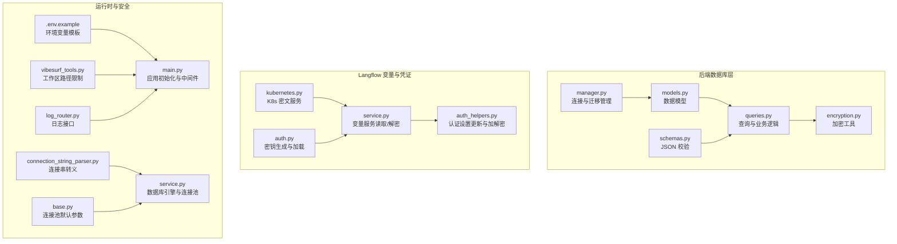
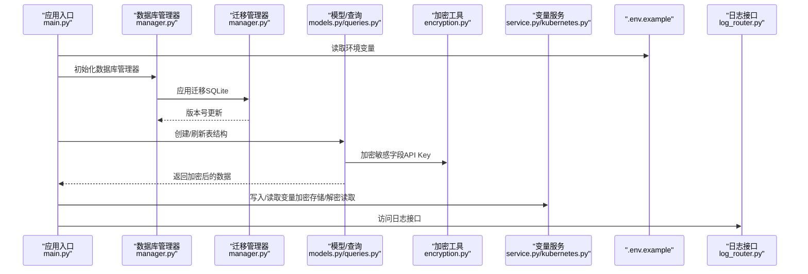
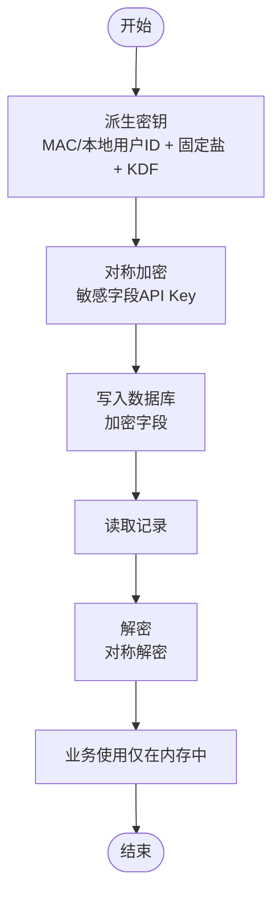
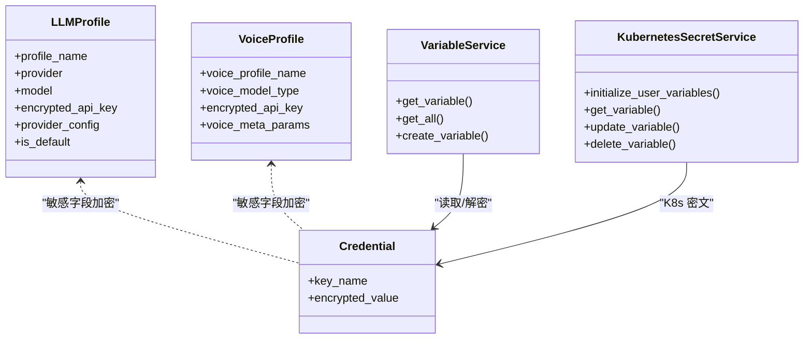
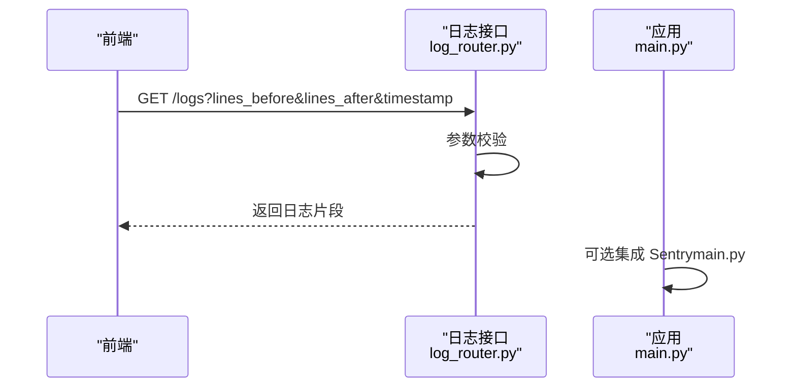
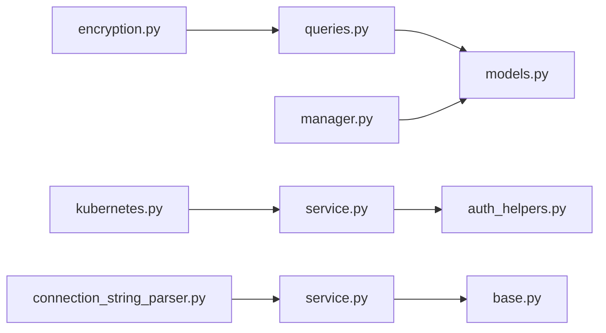

# 安全机制

<cite>
**本文引用的文件**
- [encryption.py](file://vibe_surf/backend/utils/encryption.py)
- [models.py](file://vibe_surf/backend/database/models.py)
- [schemas.py](file://vibe_surf/backend/database/schemas.py)
- [manager.py](file://vibe_surf/backend/database/manager.py)
- [queries.py](file://vibe_surf/backend/database/queries.py)
- [v006_add_credentials_table.sql](file://vibe_surf/backend/database/migrations/v006_add_credentials_table.sql)
- [v007_add_schedule_table.sql](file://vibe_surf/backend/database/migrations/v007_add_schedule_table.sql)
- [.env.example](file://.env.example)
- [vibesurf_tools.py](file://vibe_surf/tools/vibesurf_tools.py)
- [main.py](file://vibe_surf/backend/main.py)
- [auth_helpers.py](file://vibe_surf/langflow/api/v1/auth_helpers.py)
- [service.py](file://vibe_surf/langflow/services/variable/service.py)
- [kubernetes.py](file://vibe_surf/langflow/services/variable/kubernetes.py)
- [auth.py](file://vibe_surf/langflow/services/settings/auth.py)
- [log_router.py](file://vibe_surf/langflow/api/log_router.py)
- [connection_string_parser.py](file://vibe_surf/langflow/utils/connection_string_parser.py)
- [service.py](file://vibe_surf/langflow/services/database/service.py)
- [base.py](file://vibe_surf/langflow/services/settings/base.py)
</cite>

## 目录
1. [简介](#简介)
2. [项目结构与安全相关模块](#项目结构与安全相关模块)
3. [核心组件](#核心组件)
4. [架构总览](#架构总览)
5. [详细组件分析](#详细组件分析)
6. [依赖关系分析](#依赖关系分析)
7. [性能与安全特性](#性能与安全特性)
8. [故障排查指南](#故障排查指南)
9. [结论](#结论)
10. [附录：合规与隐私](#附录合规与隐私)

## 简介
本文件系统化梳理 VibeSurf 的数据库安全机制，覆盖静态数据加密、传输中数据保护、敏感信息（凭证、API 密钥）的加密存储与访问控制、数据库访问权限管理、备份与恢复流程、安全监控与告警、定期安全审计流程，以及合规与数据隐私保护要求。文档以仓库现有实现为依据，结合架构图与流程图帮助读者快速理解与落地。

## 项目结构与安全相关模块
- 后端数据库层：模型、查询、迁移、连接管理与会话管理
- 加密工具：基于机器 MAC 地址派生密钥，使用对称加密保护敏感字段
- 凭证与变量服务：在 Langflow 中对变量进行加密存储与解密读取
- 配置与环境：示例环境变量模板，用于注入外部服务凭据
- 工具与边界：工作区路径限制与文件操作安全
- 日志与监控：日志接口与错误处理，Sentry 集成可选

图表来源
- [models.py](file://vibe_surf/backend/database/models.py#L1-L289)
- [queries.py](file://vibe_surf/backend/database/queries.py#L1-L200)
- [manager.py](file://vibe_surf/backend/database/manager.py#L1-L200)
- [schemas.py](file://vibe_surf/backend/database/schemas.py#L1-L100)
- [encryption.py](file://vibe_surf/backend/utils/encryption.py#L1-L172)
- [auth_helpers.py](file://vibe_surf/langflow/api/v1/auth_helpers.py#L1-L75)
- [service.py](file://vibe_surf/langflow/services/variable/service.py#L79-L105)
- [kubernetes.py](file://vibe_surf/langflow/services/variable/kubernetes.py#L1-L204)
- [auth.py](file://vibe_surf/langflow/services/settings/auth.py#L82-L133)
- [.env.example](file://.env.example#L1-L55)
- [vibesurf_tools.py](file://vibe_surf/tools/vibesurf_tools.py#L1030-L1054)
- [main.py](file://vibe_surf/backend/main.py#L1-L200)
- [log_router.py](file://vibe_surf/langflow/api/log_router.py#L73-L103)
- [connection_string_parser.py](file://vibe_surf/langflow/utils/connection_string_parser.py#L1-L8)
- [service.py](file://vibe_surf/langflow/services/database/service.py#L113-L184)
- [base.py](file://vibe_surf/langflow/services/settings/base.py#L117-L141)

章节来源
- [models.py](file://vibe_surf/backend/database/models.py#L1-L289)
- [queries.py](file://vibe_surf/backend/database/queries.py#L1-L200)
- [manager.py](file://vibe_surf/backend/database/manager.py#L1-L200)
- [encryption.py](file://vibe_surf/backend/utils/encryption.py#L1-L172)
- [auth_helpers.py](file://vibe_surf/langflow/api/v1/auth_helpers.py#L1-L75)
- [service.py](file://vibe_surf/langflow/services/variable/service.py#L79-L105)
- [kubernetes.py](file://vibe_surf/langflow/services/variable/kubernetes.py#L1-L204)
- [auth.py](file://vibe_surf/langflow/services/settings/auth.py#L82-L133)
- [.env.example](file://.env.example#L1-L55)
- [vibesurf_tools.py](file://vibe_surf/tools/vibesurf_tools.py#L1030-L1054)
- [main.py](file://vibe_surf/backend/main.py#L1-L200)
- [log_router.py](file://vibe_surf/langflow/api/log_router.py#L73-L103)
- [connection_string_parser.py](file://vibe_surf/langflow/utils/connection_string_parser.py#L1-L8)
- [service.py](file://vibe_surf/langflow/services/database/service.py#L113-L184)
- [base.py](file://vibe_surf/langflow/services/settings/base.py#L117-L141)

## 核心组件
- 数据加密工具：基于机器 MAC 地址或本地用户 ID 派生对称密钥，使用对称加密算法保护敏感字段（如 API Key）
- 数据库模型与查询：LLM/Voice/Credentials 等模型均包含加密字段；查询层负责加密入库与解密出库
- 迁移与版本控制：SQLite 使用迁移脚本维护表结构与索引，支持版本号记录
- 变量与凭证服务：Langflow 层对变量进行加密存储，并在读取时解密
- 环境与配置：通过 .env.example 提供外部服务凭据注入点
- 文件与路径安全：工具层限制文件操作仅限于工作区目录
- 日志与监控：提供日志接口与可选的 Sentry 集成

章节来源
- [encryption.py](file://vibe_surf/backend/utils/encryption.py#L1-L172)
- [models.py](file://vibe_surf/backend/database/models.py#L1-L289)
- [queries.py](file://vibe_surf/backend/database/queries.py#L1-L200)
- [v006_add_credentials_table.sql](file://vibe_surf/backend/database/migrations/v006_add_credentials_table.sql#L1-L26)
- [v007_add_schedule_table.sql](file://vibe_surf/backend/database/migrations/v007_add_schedule_table.sql#L1-L29)
- [auth_helpers.py](file://vibe_surf/langflow/api/v1/auth_helpers.py#L1-L75)
- [service.py](file://vibe_surf/langflow/services/variable/service.py#L79-L105)
- [.env.example](file://.env.example#L1-L55)
- [vibesurf_tools.py](file://vibe_surf/tools/vibesurf_tools.py#L1030-L1054)
- [log_router.py](file://vibe_surf/langflow/api/log_router.py#L73-L103)

## 架构总览
下图展示从应用启动到数据库访问、凭证存储与日志输出的关键路径，以及加密工具在其中的位置。

图表来源
- [main.py](file://vibe_surf/backend/main.py#L1-L200)
- [manager.py](file://vibe_surf/backend/database/manager.py#L1-L200)
- [models.py](file://vibe_surf/backend/database/models.py#L1-L289)
- [queries.py](file://vibe_surf/backend/database/queries.py#L1-L200)
- [encryption.py](file://vibe_surf/backend/utils/encryption.py#L1-L172)
- [service.py](file://vibe_surf/langflow/services/variable/service.py#L79-L105)
- [kubernetes.py](file://vibe_surf/langflow/services/variable/kubernetes.py#L1-L204)
- [.env.example](file://.env.example#L1-L55)
- [log_router.py](file://vibe_surf/langflow/api/log_router.py#L73-L103)

## 详细组件分析

### 数据加密策略（静态与传输）
- 静态数据加密
  - 机密字段采用对称加密存储：LLM/Voice/Credentials 模型中的敏感字段（如 API Key）在入库前由加密工具进行加密，出库时再解密
  - 密钥派生：优先使用本机 MAC 地址，若不可用则回退到本地用户标识；固定盐值与高迭代次数 KDF 增强抗暴力破解能力
  - 存储介质：SQLite（开发/单机）或生产数据库（通过连接池与迁移管理器支持），迁移脚本确保表结构与索引一致
- 传输中数据加密
  - 应用未显式启用 TLS/SSL 中间件；建议在部署层（反向代理/Nginx/Ingress）开启 HTTPS，确保 API 流量加密
  - 数据库连接字符串解析与转义：连接串中的密码部分进行 URL 转义，降低注入风险

图表来源
- [encryption.py](file://vibe_surf/backend/utils/encryption.py#L1-L172)
- [models.py](file://vibe_surf/backend/database/models.py#L1-L289)
- [queries.py](file://vibe_surf/backend/database/queries.py#L1-L200)
- [connection_string_parser.py](file://vibe_surf/langflow/utils/connection_string_parser.py#L1-L8)

章节来源
- [encryption.py](file://vibe_surf/backend/utils/encryption.py#L1-L172)
- [models.py](file://vibe_surf/backend/database/models.py#L1-L289)
- [queries.py](file://vibe_surf/backend/database/queries.py#L1-L200)
- [connection_string_parser.py](file://vibe_surf/langflow/utils/connection_string_parser.py#L1-L8)

### 敏感数据保护（凭证与 API 密钥）
- 存储策略
  - LLM/Voice/Credentials 模型均提供加密字段，避免明文落盘
  - Langflow 变量服务支持对变量值进行加密存储，并在读取时尝试解密
  - Kubernetes 密文服务按用户维度创建/更新密文，变量名与类型区分“凭证”与“通用”
- 访问控制
  - 变量服务在读取时进行解密，失败则回退为明文（兼容旧数据）
  - 变量服务禁止将“凭证”类型变量用于会话 ID 字段，防止泄露
- 更新与迁移
  - 认证设置更新时，支持对敏感字段进行加密/解密与保留掩码值（前端传入“******”时保留原值）

图表来源
- [models.py](file://vibe_surf/backend/database/models.py#L1-L289)
- [service.py](file://vibe_surf/langflow/services/variable/service.py#L79-L105)
- [kubernetes.py](file://vibe_surf/langflow/services/variable/kubernetes.py#L1-L204)
- [auth_helpers.py](file://vibe_surf/langflow/api/v1/auth_helpers.py#L1-L75)

章节来源
- [models.py](file://vibe_surf/backend/database/models.py#L1-L289)
- [service.py](file://vibe_surf/langflow/services/variable/service.py#L79-L105)
- [kubernetes.py](file://vibe_surf/langflow/services/variable/kubernetes.py#L1-L204)
- [auth_helpers.py](file://vibe_surf/langflow/api/v1/auth_helpers.py#L1-L75)

### 数据库访问权限管理与审计
- 角色与权限
  - 当前代码未定义显式的数据库角色/权限模型；访问控制主要通过应用层（Langflow 变量服务）与前端界面约束
- 审计日志
  - 日志接口提供日志检索能力，但需注意默认禁用与参数校验（不能同时请求前后日志）
  - 建议在部署层启用持久化日志与集中化收集（如 ELK/Fluentd），并结合 Sentry 进行错误追踪

图表来源
- [log_router.py](file://vibe_surf/langflow/api/log_router.py#L73-L103)
- [main.py](file://vibe_surf/backend/main.py#L1-L200)

章节来源
- [log_router.py](file://vibe_surf/langflow/api/log_router.py#L73-L103)
- [main.py](file://vibe_surf/backend/main.py#L1-L200)

### 备份与恢复流程
- 备份策略
  - SQLite：通过迁移脚本维护版本与结构；建议定期复制数据库文件（vibe_surf.db）作为备份
  - Langflow 数据库：通过环境变量指定 SQLite 路径，同样可按文件级备份
- 恢复测试
  - 停止服务后替换数据库文件，启动后检查迁移版本与表结构是否一致
- 灾难恢复
  - 建议在部署层配置自动快照与异地备份；恢复时先验证迁移版本，再启动服务

章节来源
- [manager.py](file://vibe_surf/backend/database/manager.py#L1-L200)
- [v006_add_credentials_table.sql](file://vibe_surf/backend/database/migrations/v006_add_credentials_table.sql#L1-L26)
- [v007_add_schedule_table.sql](file://vibe_surf/backend/database/migrations/v007_add_schedule_table.sql#L1-L29)
- [main.py](file://vibe_surf/backend/main.py#L1-L200)

### 安全监控与告警
- 错误与异常
  - 查询层与数据库层广泛使用 try/except 并记录错误日志
  - 日志接口对非法参数进行明确拒绝（如同时请求前后日志）
- 可观测性
  - 可选集成 Sentry（通过 DSN 与采样率配置），用于错误追踪与性能分析
  - 建议结合外部 APM/日志平台实现统一告警

章节来源
- [queries.py](file://vibe_surf/backend/database/queries.py#L1-L200)
- [log_router.py](file://vibe_surf/langflow/api/log_router.py#L73-L103)
- [auth.py](file://vibe_surf/langflow/services/settings/auth.py#L82-L133)
- [main.py](file://vibe_surf/backend/main.py#L1-L200)

### 环境变量与外部服务凭据
- 环境变量模板提供各服务商 API Key 注入点，建议：
  - 在生产环境通过密钥管理服务（如 KMS/云厂商密钥服务）注入
  - 避免将明文凭据提交至版本库
- 连接串转义
  - 对数据库连接串中的密码进行 URL 转义，降低注入风险

章节来源
- [.env.example](file://.env.example#L1-L55)
- [connection_string_parser.py](file://vibe_surf/langflow/utils/connection_string_parser.py#L1-L8)

### 文件与路径安全
- 工作区路径限制
  - 工具层对文件打开与路径拼接进行严格限制，仅允许相对路径且必须位于工作区根目录内
  - 绝对路径与越界访问将被拒绝

章节来源
- [vibesurf_tools.py](file://vibe_surf/tools/vibesurf_tools.py#L1030-L1054)

## 依赖关系分析
- 组件耦合
  - 查询层依赖加密工具进行敏感字段的加解密
  - 数据库管理器负责迁移与连接池配置，影响整体可用性与性能
  - Langflow 变量服务与 Kubernetes 密文服务共同构成凭证存储与访问控制
- 外部依赖
  - 数据库驱动与连接池参数由配置层决定，SQLite 与生产数据库采用不同策略
  - 环境变量与密钥文件用于密钥生成与加载

图表来源
- [encryption.py](file://vibe_surf/backend/utils/encryption.py#L1-L172)
- [queries.py](file://vibe_surf/backend/database/queries.py#L1-L200)
- [models.py](file://vibe_surf/backend/database/models.py#L1-L289)
- [manager.py](file://vibe_surf/backend/database/manager.py#L1-L200)
- [service.py](file://vibe_surf/langflow/services/variable/service.py#L79-L105)
- [auth_helpers.py](file://vibe_surf/langflow/api/v1/auth_helpers.py#L1-L75)
- [kubernetes.py](file://vibe_surf/langflow/services/variable/kubernetes.py#L1-L204)
- [service.py](file://vibe_surf/langflow/services/database/service.py#L113-L184)
- [base.py](file://vibe_surf/langflow/services/settings/base.py#L117-L141)
- [connection_string_parser.py](file://vibe_surf/langflow/utils/connection_string_parser.py#L1-L8)

章节来源
- [queries.py](file://vibe_surf/backend/database/queries.py#L1-L200)
- [models.py](file://vibe_surf/backend/database/models.py#L1-L289)
- [manager.py](file://vibe_surf/backend/database/manager.py#L1-L200)
- [service.py](file://vibe_surf/langflow/services/variable/service.py#L79-L105)
- [kubernetes.py](file://vibe_surf/langflow/services/variable/kubernetes.py#L1-L204)
- [service.py](file://vibe_surf/langflow/services/database/service.py#L113-L184)
- [base.py](file://vibe_surf/langflow/services/settings/base.py#L117-L141)
- [connection_string_parser.py](file://vibe_surf/langflow/utils/connection_string_parser.py#L1-L8)

## 性能与安全特性
- 连接池与并发
  - 生产数据库采用较大的连接池与超时/回收策略，预检连接有效性
  - SQLite 使用静态连接池，适合轻量场景；高并发写入建议评估 WAL 模式与锁竞争
- 加密开销
  - KDF 迭代次数较高，提升安全性的同时增加 CPU 开销；建议在批量导入时分批处理
- 日志与调试
  - SQL 输出默认关闭，避免泄露敏感信息；仅在开发环境谨慎开启

章节来源
- [service.py](file://vibe_surf/langflow/services/database/service.py#L113-L184)
- [base.py](file://vibe_surf/langflow/services/settings/base.py#L117-L141)
- [manager.py](file://vibe_surf/backend/database/manager.py#L1-L200)
- [encryption.py](file://vibe_surf/backend/utils/encryption.py#L1-L172)

## 故障排查指南
- 加密/解密失败
  - 检查密钥派生来源（MAC/本地用户 ID）是否可用；必要时切换回退方案
  - 确认加密字段非空且格式正确
- 数据库迁移失败
  - 查看迁移脚本与版本号；确认 SQLite 权限与路径存在
- 日志接口报错
  - 确保只使用一种日志检索方式（前后日志互斥）
- 变量读取异常
  - 若解密失败，系统回退为明文；检查变量类型与存储状态

章节来源
- [encryption.py](file://vibe_surf/backend/utils/encryption.py#L1-L172)
- [manager.py](file://vibe_surf/backend/database/manager.py#L1-L200)
- [log_router.py](file://vibe_surf/langflow/api/log_router.py#L73-L103)
- [service.py](file://vibe_surf/langflow/services/variable/service.py#L79-L105)

## 结论
VibeSurf 在数据库侧实现了敏感字段的静态加密与访问控制，结合 Langflow 的变量与密文服务形成较为完整的凭证管理体系。部署层面建议补充传输加密（HTTPS）、密钥管理与集中化日志/监控，并完善备份与灾难恢复演练，以满足生产环境的安全与合规要求。

## 附录：合规与隐私
- 数据最小化：仅存储必要的配置与元数据，敏感字段加密存储
- 访问控制：变量服务禁止将凭证用于会话 ID，降低泄露面
- 审计与日志：通过日志接口与可选 Sentry 实现错误追踪与审计线索
- 环境隔离：通过 .env.example 与密钥管理服务分离凭据与代码
- 建议增强：在部署层引入 WAF/防火墙、TLS 终止、密钥轮换与定期渗透测试

章节来源
- [.env.example](file://.env.example#L1-L55)
- [service.py](file://vibe_surf/langflow/services/variable/service.py#L79-L105)
- [log_router.py](file://vibe_surf/langflow/api/log_router.py#L73-L103)
- [main.py](file://vibe_surf/backend/main.py#L1-L200)