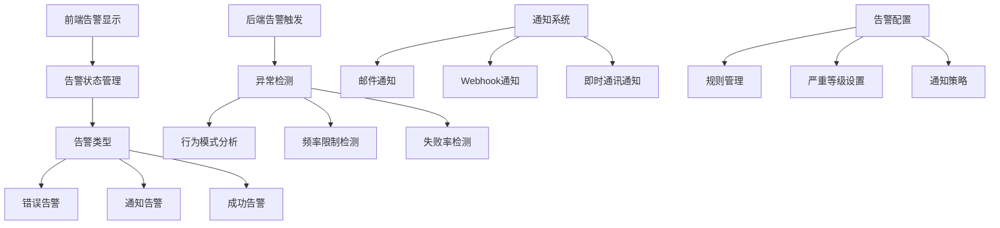
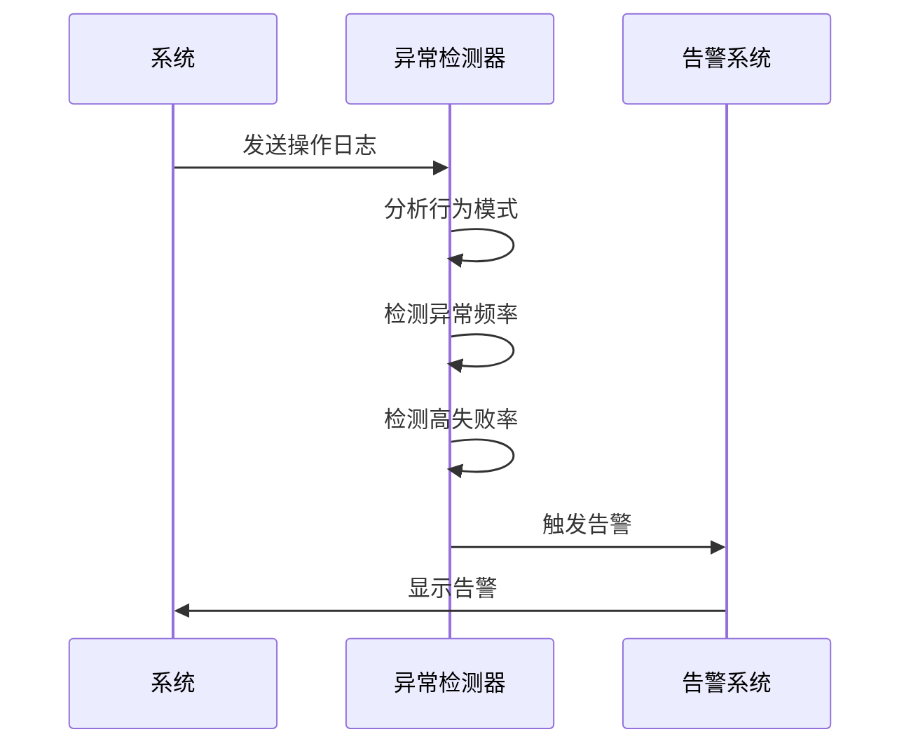

# 告警系统

<cite>
**本文档引用的文件**   
- [alertStore.ts](file://vibe_surf/frontend/src/stores/alertStore.ts)
- [index.ts](file://vibe_surf/frontend/src/types/zustand/alert/index.ts)
- [index.tsx](file://vibe_surf/frontend/src/alerts/displayArea/index.tsx)
- [index.ts](file://vibe_surf/frontend/src/types/alerts/index.ts)
- [anti_detection.py](file://vibe_surf/workflows/Recruitment/boss_zhipin/anti_detection.py)
- [telemetry/views.py](file://vibe_surf/telemetry/views.py)
- [telemetry/service.py](file://vibe_surf/telemetry/service.py)
- [models.py](file://vibe_surf/backend/database/models.py)
- [queries.py](file://vibe_surf/backend/database/queries.py)
- [main.js](file://vibe_surf/chrome_extension/scripts/main.js)
- [background.js](file://vibe_surf/chrome_extension/background.js)
</cite>

## 目录
1. [简介](#简介)
2. [告警系统架构](#告警系统架构)
3. [告警类型与严重等级](#告警类型与严重等级)
4. [告警触发机制](#告警触发机制)
5. [告警配置管理](#告警配置管理)
6. [多渠道通知系统](#多渠道通知系统)
7. [告警去重与抑制](#告警去重与抑制)
8. [告警响应流程](#告警响应流程)
9. [结论](#结论)

## 简介
VibeSurf告警系统是一个全面的监控和通知框架，旨在实时检测和响应系统中的异常情况。该系统支持基于规则的静态阈值告警和基于机器学习的异常检测告警，提供灵活的告警配置管理界面，支持自定义告警规则、严重等级和通知策略。告警系统通过多渠道通知机制，包括邮件、Webhook和即时通讯工具，确保关键告警能够及时传达给相关人员。此外，系统还实现了告警去重和抑制机制，避免告警风暴，确保告警的有效性和可管理性。

**Section sources**
- [telemetry/views.py](file://vibe_surf/telemetry/views.py#L1-L189)

## 告警系统架构

**Diagram sources**
- [alertStore.ts](file://vibe_surf/frontend/src/stores/alertStore.ts#L1-L107)
- [anti_detection.py](file://vibe_surf/workflows/Recruitment/boss_zhipin/anti_detection.py#L201-L387)

## 告警类型与严重等级

VibeSurf告警系统支持三种主要的告警类型：错误告警、通知告警和成功告警。每种告警类型都有其特定的用途和显示方式。

### 错误告警
错误告警用于指示系统中发生的错误或异常情况。这些告警通常具有较高的严重等级，需要立即关注和处理。

### 通知告警
通知告警用于提供系统状态的更新或重要信息。这些告警的严重等级较低，主要用于信息传递。

### 成功告警
成功告警用于确认系统操作的成功完成。这些告警通常用于确认任务的完成或系统的正常运行。

**Section sources**
- [index.ts](file://vibe_surf/frontend/src/types/alerts/index.ts#L1-L34)
- [index.tsx](file://vibe_surf/frontend/src/alerts/displayArea/index.tsx#L1-L51)

## 告警触发机制

VibeSurf告警系统通过多种机制触发告警，包括基于规则的静态阈值告警和基于机器学习的异常检测告警。

### 基于规则的静态阈值告警
基于规则的静态阈值告警通过预定义的阈值来触发告警。例如，当操作频率超过每小时的最大限制时，系统会触发告警。

### 基于机器学习的异常检测告警
基于机器学习的异常检测告警通过分析系统行为模式来检测异常。系统会监控操作频率、失败率等指标，并在检测到异常时触发告警。

**Diagram sources**
- [anti_detection.py](file://vibe_surf/workflows/Recruitment/boss_zhipin/anti_detection.py#L273-L307)
- [telemetry/views.py](file://vibe_surf/telemetry/views.py#L114-L189)

## 告警配置管理

VibeSurf告警系统提供了一个灵活的告警配置管理界面，允许用户自定义告警规则、严重等级和通知策略。

### 告警规则管理
用户可以通过配置界面定义告警规则，包括触发条件、阈值和告警类型。这些规则可以基于系统日志、性能指标或其他监控数据。

### 严重等级设置
用户可以为不同的告警类型设置不同的严重等级，以便优先处理高优先级的告警。

### 通知策略
用户可以配置通知策略，选择告警通知的渠道，如邮件、Webhook或即时通讯工具。

**Section sources**
- [models.py](file://vibe_surf/backend/database/models.py#L1-L289)
- [queries.py](file://vibe_surf/backend/database/queries.py#L1-L800)

## 多渠道通知系统

VibeSurf告警系统支持多渠道通知，确保关键告警能够及时传达给相关人员。

### 邮件通知
系统可以通过邮件通知用户告警信息，包括告警类型、严重等级和详细描述。

### Webhook通知
系统可以通过Webhook将告警信息发送到指定的URL，以便与其他系统集成。

### 即时通讯通知
系统可以通过即时通讯工具（如Slack、微信等）发送告警信息，确保用户能够实时收到通知。

**Section sources**
- [main.js](file://vibe_surf/chrome_extension/scripts/main.js#L129-L168)
- [background.js](file://vibe_surf/chrome_extension/background.js#L437-L486)

## 告警去重与抑制

VibeSurf告警系统实现了告警去重和抑制机制，避免告警风暴，确保告警的有效性和可管理性。

### 告警去重
系统通过唯一标识符（ID）对告警进行去重，确保相同的告警不会重复显示。

### 告警抑制
系统通过设置告警抑制规则，避免在短时间内重复触发相同的告警。例如，当检测到高频率操作时，系统会暂时抑制告警，直到操作频率恢复正常。

**Section sources**
- [alertStore.ts](file://vibe_surf/frontend/src/stores/alertStore.ts#L21-L45)
- [anti_detection.py](file://vibe_surf/workflows/Recruitment/boss_zhipin/anti_detection.py#L308-L325)

## 告警响应流程

VibeSurf告警系统提供了一套完整的告警响应流程，包括告警确认、处理和关闭。

### 告警确认
用户收到告警后，需要确认告警的真实性。系统提供告警详情和相关日志，帮助用户快速判断告警的严重性。

### 告警处理
用户根据告警类型和严重等级采取相应的处理措施，如修复系统错误、调整配置或联系技术支持。

### 告警关闭
处理完成后，用户可以关闭告警，系统会记录告警的处理结果和时间。

**Section sources**
- [telemetry/service.py](file://vibe_surf/telemetry/service.py#L1-L114)
- [telemetry/views.py](file://vibe_surf/telemetry/views.py#L1-L189)

## 结论
VibeSurf告警系统通过全面的监控和通知机制，确保系统中的异常情况能够被及时发现和处理。系统支持多种告警类型和严重等级，提供灵活的告警配置管理界面，支持多渠道通知，实现了告警去重和抑制机制，确保告警的有效性和可管理性。通过这套完整的告警响应流程，用户可以高效地处理告警，保障系统的稳定运行。