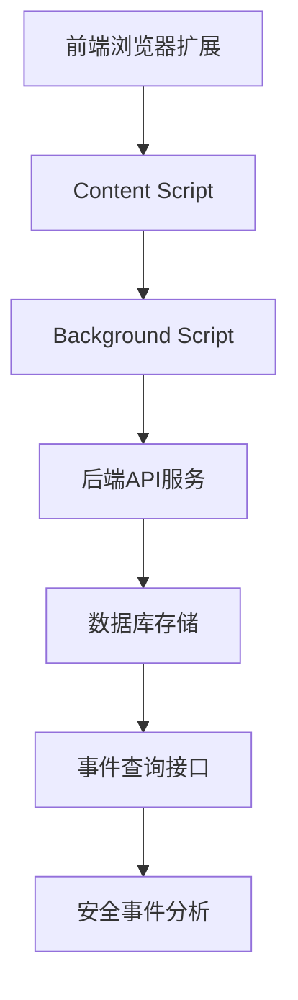
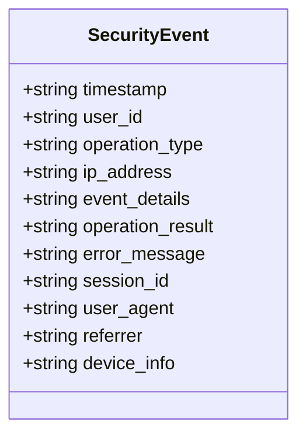
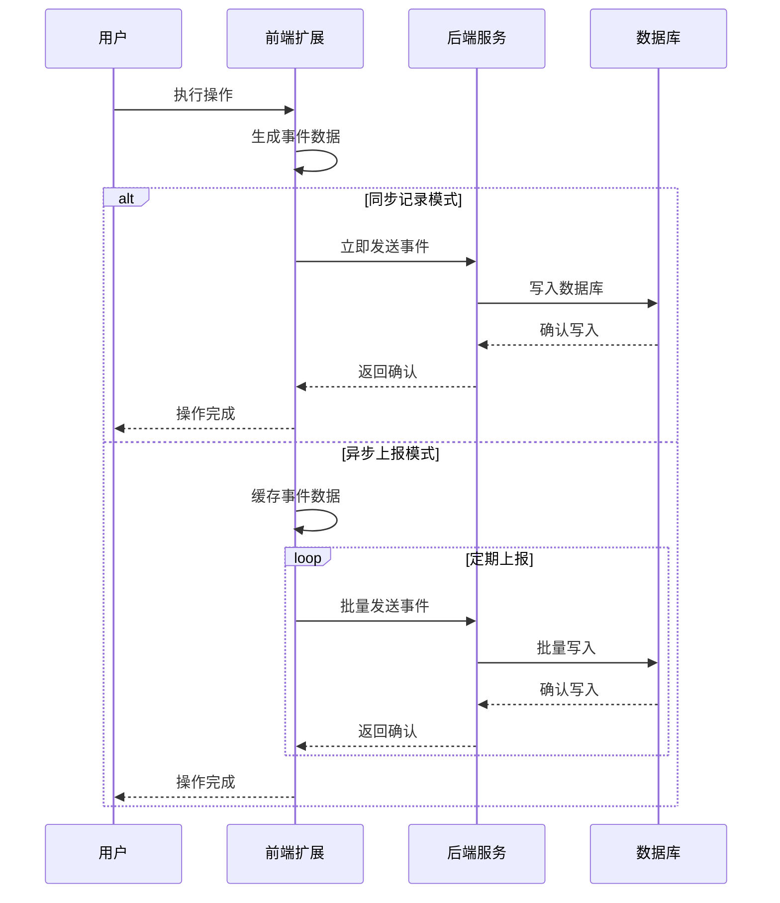
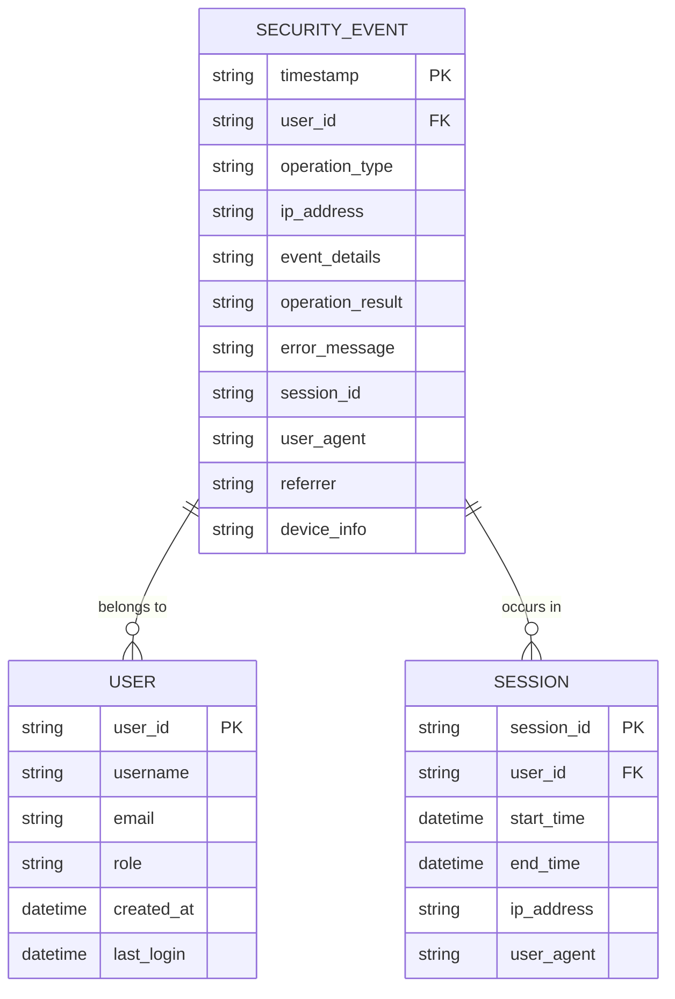
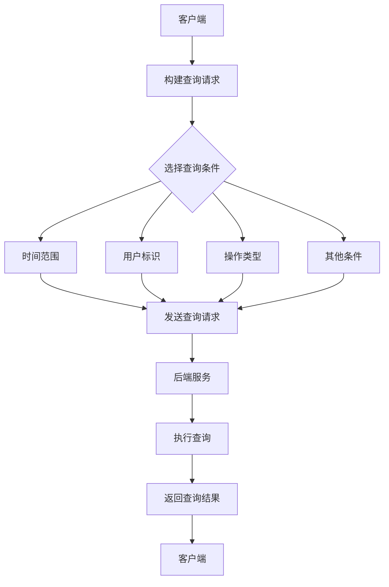
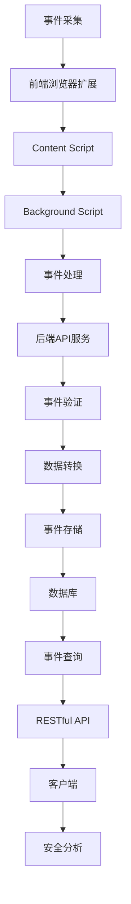

# 安全事件监控

<cite>
**本文档引用的文件**  
- [service.py](file://vibe_surf/telemetry/service.py)
- [views.py](file://vibe_surf/telemetry/views.py)
- [activity.py](file://vibe_surf/backend/api/activity.py)
- [models.py](file://vibe_surf/backend/database/models.py)
- [schemas.py](file://vibe_surf/backend/database/schemas.py)
- [workflow-recorder.js](file://vibe_surf/chrome_extension/scripts/workflow-recorder.js)
- [settings-workflow.js](file://vibe_surf/chrome_extension/scripts/settings-workflow.js)
- [content.js](file://vibe_surf/chrome_extension/content.js)
- [background.js](file://vibe_surf/chrome_extension/background.js)
</cite>

## 目录
1. [简介](#简介)
2. [安全事件监控架构](#安全事件监控架构)
3. [事件数据结构设计](#事件数据结构设计)
4. [事件采集实现机制](#事件采集实现机制)
5. [事件存储数据库设计](#事件存储数据库设计)
6. [事件查询接口使用方法](#事件查询接口使用方法)
7. [安全事件监控流程](#安全事件监控流程)
8. [总结](#总结)

## 简介

VibeSurf安全事件监控系统是一个全面的监控解决方案，用于收集和记录用户的各种安全相关操作。该系统能够监控用户登录尝试、权限变更、敏感数据访问等关键操作，为系统安全提供有力保障。通过详细的事件日志记录和分析，系统能够及时发现潜在的安全威胁，并提供完整的审计追踪功能。

本系统采用分布式架构，结合前端浏览器扩展和后端服务，实现了从事件采集、处理到存储和查询的完整流程。事件数据结构经过精心设计，包含了时间戳、用户标识、操作类型、IP地址等关键字段，确保了事件信息的完整性和可追溯性。系统支持同步记录和异步上报两种模式，能够灵活应对不同的使用场景和性能要求。

**Section sources**
- [service.py](file://vibe_surf/telemetry/service.py#L1-L114)
- [views.py](file://vibe_surf/telemetry/views.py#L1-L189)

## 安全事件监控架构

VibeSurf安全事件监控系统采用分层架构设计，由前端浏览器扩展、后端API服务和数据库存储三大部分组成。这种架构设计确保了系统的可扩展性和可靠性，同时实现了前后端的职责分离。

前端浏览器扩展负责捕获用户在浏览器中的各种操作事件，包括页面导航、点击、输入等。这些事件通过Chrome扩展的content script和background script协同工作，实现了事件的实时捕获和初步处理。后端API服务接收来自前端的事件数据，进行验证、处理和存储。数据库存储层采用SQLite数据库，通过Alembic进行数据库迁移管理，确保了数据结构的一致性和可维护性。

**Diagram sources**
- [content.js](file://vibe_surf/chrome_extension/content.js#L1-L44)
- [background.js](file://vibe_surf/chrome_extension/background.js#L160-L197)
- [activity.py](file://vibe_surf/backend/api/activity.py#L1-L246)

## 事件数据结构设计

VibeSurf安全事件监控系统的事件数据结构经过精心设计，包含了多个关键字段，确保了事件信息的完整性和可追溯性。事件数据结构主要由时间戳、用户标识、操作类型、IP地址等核心字段组成。

时间戳字段记录了事件发生的具体时间，精确到毫秒，为事件的时序分析提供了基础。用户标识字段包含了用户的唯一标识符，用于追踪特定用户的行为。操作类型字段定义了事件的类别，如登录、权限变更、数据访问等，便于后续的分类统计和分析。IP地址字段记录了事件发生的网络位置，有助于识别异常访问模式。

此外，事件数据结构还包括了事件详情、操作结果、错误信息等辅助字段。事件详情字段存储了与特定事件相关的详细信息，如访问的URL、修改的数据等。操作结果字段记录了操作的执行结果，如成功或失败。错误信息字段则在操作失败时记录具体的错误原因，为故障排查提供依据。

**Diagram sources**
- [views.py](file://vibe_surf/telemetry/views.py#L1-L189)
- [models.py](file://vibe_surf/backend/database/models.py#L1-L289)

## 事件采集实现机制

VibeSurf安全事件监控系统实现了同步记录和异步上报两种事件采集模式，以满足不同场景下的性能和可靠性要求。同步记录模式确保了关键事件的即时性和可靠性，而异步上报模式则提高了系统的响应速度和用户体验。

同步记录模式主要用于处理关键安全事件，如用户登录、权限变更等。在这种模式下，事件数据在生成后立即被写入本地存储，并同步发送到后端服务器。这种模式确保了事件数据的完整性和及时性，但可能会对系统性能产生一定影响。

异步上报模式则用于处理大量非关键事件，如页面浏览、点击等。在这种模式下，事件数据首先被缓存在内存中，然后定期批量发送到后端服务器。这种模式显著提高了系统的响应速度，减少了网络延迟对用户体验的影响。系统还实现了事件缓冲区的溢出保护机制，当缓冲区满时，会自动丢弃最旧的事件以确保新事件的记录。

**Diagram sources**
- [workflow-recorder.js](file://vibe_surf/chrome_extension/scripts/workflow-recorder.js#L44-L569)
- [settings-workflow.js](file://vibe_surf/chrome_extension/scripts/settings-workflow.js#L3234-L3337)

## 事件存储数据库设计

VibeSurf安全事件监控系统的数据库设计采用了SQLite作为存储引擎，通过Alembic进行数据库迁移管理。数据库设计注重性能优化和数据完整性，实现了高效的索引策略和数据分区方案。

数据库表结构设计遵循规范化原则，将事件数据存储在专门的表中。主表包含事件的基本信息，如时间戳、用户标识、操作类型等。为了提高查询性能，系统在关键字段上创建了索引，包括用户标识、操作类型和时间戳。这些索引显著提高了基于这些字段的查询效率。

数据分区策略根据时间维度进行划分，将历史数据和近期数据分别存储在不同的表或分区中。这种设计不仅提高了查询性能，还便于数据的归档和清理。系统定期执行数据维护任务，如删除过期数据、重建索引等，确保数据库的长期稳定运行。

**Diagram sources**
- [models.py](file://vibe_surf/backend/database/models.py#L1-L289)
- [schemas.py](file://vibe_surf/backend/database/schemas.py#L1-L100)

## 事件查询接口使用方法

VibeSurf安全事件监控系统提供了丰富的事件查询接口，支持按时间范围、用户、操作类型等条件进行过滤检索。这些接口采用RESTful设计，便于集成和使用。

查询接口支持多种过滤条件的组合，用户可以根据需要灵活构建查询请求。时间范围过滤支持精确到毫秒的时间戳，也可以使用相对时间表达式，如"last 24 hours"。用户过滤支持按用户标识、用户名或用户角色进行筛选。操作类型过滤支持精确匹配和模糊匹配，便于查找特定类型的事件。

接口返回的数据格式为JSON，包含了事件的完整信息。为了提高性能，接口支持分页查询，用户可以通过指定页码和每页大小来控制返回的数据量。系统还提供了聚合查询功能，可以按不同维度统计事件数量，如按用户统计、按操作类型统计等。

**Diagram sources**
- [activity.py](file://vibe_surf/backend/api/activity.py#L1-L246)
- [models.py](file://vibe_surf/backend/database/models.py#L1-L289)

## 安全事件监控流程

VibeSurf安全事件监控系统的完整流程涵盖了从事件采集到分析的各个环节。该流程确保了安全事件的全面覆盖和及时响应，为系统安全提供了有力保障。

事件采集阶段，前端浏览器扩展通过content script捕获用户在页面上的各种操作，如点击、输入、导航等。这些事件被封装成标准化的事件对象，并通过Chrome扩展的message passing机制发送到background script。background script负责事件的初步处理和缓存，然后根据配置决定采用同步或异步模式将事件发送到后端服务。

事件处理阶段，后端API服务接收来自前端的事件数据，进行验证和解析。系统检查事件数据的完整性和合法性，过滤掉无效或恶意的事件。有效的事件数据被转换成数据库记录格式，并通过事务方式写入数据库。为了确保数据一致性，系统采用了数据库事务机制，确保事件记录的原子性。

事件存储阶段，系统将处理后的事件数据持久化到SQLite数据库中。数据库设计考虑了性能和可维护性，通过索引优化和数据分区策略提高了查询效率。系统定期执行数据维护任务，如删除过期数据、重建索引等，确保数据库的长期稳定运行。

事件查询阶段，系统提供了RESTful API接口，支持按多种条件进行事件检索。用户可以通过HTTP请求查询特定时间段、特定用户或特定操作类型的事件。接口支持分页和排序功能，便于处理大量数据。系统还提供了聚合查询功能，可以按不同维度统计事件数量，为安全分析提供数据支持。

**Diagram sources**
- [content.js](file://vibe_surf/chrome_extension/content.js#L1-L44)
- [background.js](file://vibe_surf/chrome_extension/background.js#L160-L197)
- [activity.py](file://vibe_surf/backend/api/activity.py#L1-L246)

## 总结

VibeSurf安全事件监控系统通过全面的事件采集、高效的事件处理和可靠的事件存储，为系统安全提供了强有力的保障。系统采用分层架构设计，结合前端浏览器扩展和后端服务，实现了从事件采集到分析的完整流程。

事件数据结构经过精心设计，包含了时间戳、用户标识、操作类型、IP地址等关键字段，确保了事件信息的完整性和可追溯性。系统支持同步记录和异步上报两种模式，能够灵活应对不同的使用场景和性能要求。数据库设计注重性能优化和数据完整性，实现了高效的索引策略和数据分区方案。

事件查询接口采用RESTful设计，支持按时间范围、用户、操作类型等条件进行过滤检索，便于集成和使用。系统还提供了聚合查询功能，可以按不同维度统计事件数量，为安全分析提供数据支持。

总体而言，VibeSurf安全事件监控系统是一个功能完善、性能优越的安全监控解决方案，能够有效保护系统免受各种安全威胁，为用户提供可靠的安全保障。