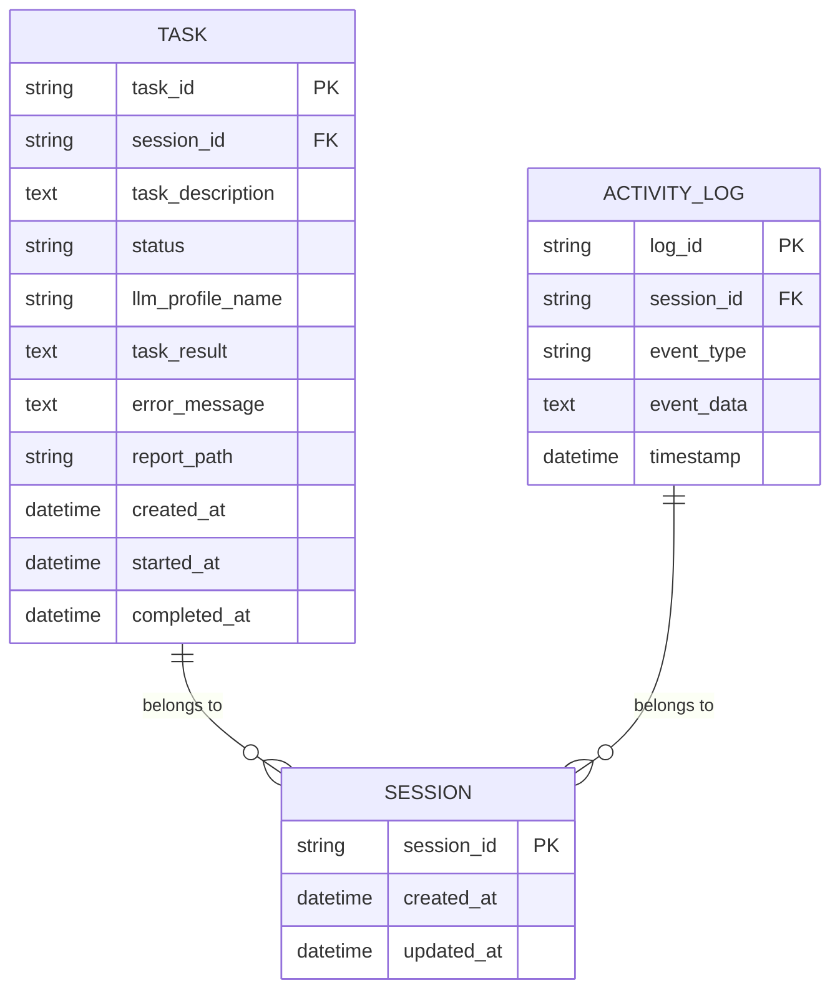

# 安全监控

<cite>
**本文档引用的文件**  
- [main.py](file://vibe_surf/backend/main.py)
- [activity.py](file://vibe_surf/backend/api/activity.py)
- [service.py](file://vibe_surf/telemetry/service.py)
- [views.py](file://vibe_surf/telemetry/views.py)
- [models.py](file://vibe_surf/backend/database/models.py)
- [manager.py](file://vibe_surf/backend/database/manager.py)
- [shared_state.py](file://vibe_surf/backend/shared_state.py)
- [vibe_surf_agent.py](file://vibe_surf/agents/vibe_surf_agent.py)
- [vibe_surf_prompt.py](file://vibe_surf/agents/prompts/vibe_surf_prompt.py)
- [anti_detection.py](file://vibe_surf/workflows/Recruitment/boss_zhipin/anti_detection.py)
</cite>

## 目录
1. [引言](#引言)
2. [安全事件监控机制](#安全事件监控机制)
3. [实时告警系统](#实时告警系统)
4. [安全仪表板与指标分析](#安全仪表板与指标分析)
5. [威胁检测与异常行为分析](#威胁检测与异常行为分析)
6. [安全审计与合规性报告](#安全审计与合规性报告)
7. [结论](#结论)

## 引言

VibeSurf 是一个开源的AI代理浏览器，旨在革新浏览器自动化和研究。本系统通过多层安全机制，确保在执行自动化任务时的数据安全和系统完整性。安全监控系统是VibeSurf的核心组件，负责收集、存储和分析各种安全事件，包括登录尝试、权限变更和敏感操作。系统还提供实时告警、安全仪表板、威胁检测和定期安全审计功能，以确保系统的安全性和合规性。

**安全监控系统的主要功能包括：**
- **安全事件监控**：收集和分析登录尝试、权限变更和敏感操作等安全事件。
- **实时告警**：配置阈值、通知渠道和告警分级，及时发现和响应安全威胁。
- **安全仪表板**：展示关键安全指标和趋势分析，帮助用户了解系统安全状况。
- **威胁检测**：定义威胁检测规则，应用机器学习模型进行异常行为分析。
- **安全审计**：自动化定期安全审计流程，生成合规性报告。

## 安全事件监控机制

### 安全事件的收集与存储

VibeSurf 的安全事件监控机制通过多个组件协同工作，确保所有安全相关事件被有效收集和存储。系统使用数据库模型来记录各种安全事件，包括任务执行、用户活动和系统状态。

#### 数据库模型

VibeSurf 使用 SQLAlchemy 模型来定义数据库表结构，确保数据的一致性和完整性。以下是主要的安全相关模型：



**Diagram sources**
- [models.py](file://vibe_surf/backend/database/models.py#L94-L137)

#### 事件收集

安全事件的收集主要通过 `activity.py` 文件中的 API 路由实现。这些路由负责从 VibeSurf 代理和数据库中获取活动日志和任务历史。

```python
@router.get("/sessions/{session_id}/activity")
async def get_session_activity_logs(
    session_id: str,
    query: SessionActivityQueryRequest = Depends()
):
    """Get real-time VibeSurf agent activity logs for a specific session"""
    from ..shared_state import vibesurf_agent
    
    if not vibesurf_agent:
        logger.error(f"❌ VibeSurf agent not initialized")
        raise HTTPException(status_code=503, detail="VibeSurf agent not initialized")
    
    try:
        # Get activity logs from VibeSurfAgent
        if query.message_index is not None:
            all_logs = vibesurf_agent.get_activity_logs(session_id)
            activity_log = vibesurf_agent.get_activity_logs(session_id, query.message_index)
            if activity_log is None:
                return {
                    "session_id": session_id,
                    "activity_log": None,
                    "message_index": query.message_index,
                    "total_available": len(all_logs) if all_logs else 0,
                    "message": f"No activity log found at index {query.message_index}"
                }
            return {
                "session_id": session_id,
                "activity_log": activity_log,
                "message_index": query.message_index,
                "total_available": len(all_logs) if all_logs else 0
            }
        else:
            activity_logs = vibesurf_agent.get_activity_logs(session_id)
            if activity_logs is None:
                return {
                    "session_id": session_id,
                    "activity_logs": [],
                    "total_count": 0,
                    "message": "No activity logs found for this session"
                }
            original_count = len(activity_logs)
            if query.limit != -1 and query.limit > 0 and len(activity_logs) > query.limit:
                activity_logs = activity_logs[-query.limit:]
            return {
                "session_id": session_id,
                "activity_logs": activity_logs,
                "total_count": len(activity_logs),
                "original_total": original_count
            }
    except Exception as e:
        logger.error(f"❌ Failed to get VibeSurf activity logs for session {session_id}: {e}")
        logger.exception("Full traceback:")
        raise HTTPException(status_code=500, detail=f"Failed to get activity logs: {str(e)}")
```

**Section sources**
- [activity.py](file://vibe_surf/backend/api/activity.py#L154-L217)

### 安全事件的分析

安全事件的分析主要通过 `vibe_surf_agent.py` 文件中的 `VibeSurfAgent` 类实现。该类负责执行任务并记录所有活动日志。

```python
class VibeSurfAgent:
    def __init__(self, llm, browser_manager, tools, workspace_dir):
        self.llm = llm
        self.browser_manager = browser_manager
        self.tools = tools
        self.workspace_dir = workspace_dir
        self.activity_logs = []

    def run(self, task, upload_files=None, session_id=None, agent_mode="thinking"):
        # 执行任务并记录日志
        self.activity_logs.append({
            "session_id": session_id,
            "event_type": "task_start",
            "event_data": {"task": task},
            "timestamp": datetime.now()
        })
        # ... 任务执行逻辑
        self.activity_logs.append({
            "session_id": session_id,
            "event_type": "task_end",
            "event_data": {"result": result},
            "timestamp": datetime.now()
        })
        return result

    def get_activity_logs(self, session_id, message_index=None):
        logs = [log for log in self.activity_logs if log["session_id"] == session_id]
        if message_index is not None:
            return logs[message_index] if message_index < len(logs) else None
        return logs
```

**Section sources**
- [vibe_surf_agent.py](file://vibe_surf/agents/vibe_surf_agent.py#L22-L150)

## 实时告警系统

### 告警配置

实时告警系统通过配置阈值、通知渠道和告警分级，确保在发生安全事件时能够及时通知相关人员。告警配置主要通过 `shared_state.py` 文件中的 `ScheduleManager` 类实现。

```python
class ScheduleManager:
    def __init__(self):
        self.schedules = {}  # Dict[flow_id, schedule_dict]
        self.running = False
        self.check_interval = 60  # Check every minute
        self._task = None

    async def start(self):
        """Start the schedule manager"""
        if self.running:
            return
        self.running = True
        await self.reload_schedules()
        self._task = asyncio.create_task(self._schedule_loop())
        logger.info("✅ Schedule manager started")

    async def stop(self):
        """Stop the schedule manager"""
        self.running = False
        if self._task and not self._task.done():
            self._task.cancel()
            try:
                await self._task
            except asyncio.CancelledError:
                pass
        logger.info("Schedule manager stopped")

    async def reload_schedules(self):
        """Reload schedules from the database"""
        try:
            global db_manager
            if not db_manager:
                logger.warning("Database manager not available for schedule reload")
                return
            logger.debug("Starting schedule reload from database...")
            async for session in db_manager.get_session():
                logger.debug("Successfully obtained database session")
                from .database.models import Schedule
                result = await session.execute(
                    select(Schedule).where(
                        (Schedule.is_enabled == True) &
                        (Schedule.cron_expression.isnot(None))
                    )
                )
                schedules = result.scalars().all()
                logger.debug(f"Found {len(schedules)} enabled schedules in database")
                now = datetime.now(timezone.utc)
                self.schedules = {}
                for schedule in schedules:
                    logger.info(f"Loading flow: {schedule.flow_id} into schedule")
        except Exception as e:
            logger.error(f"Failed to reload schedules: {e}")
```

**Section sources**
- [shared_state.py](file://vibe_surf/backend/shared_state.py#L740-L800)

### 通知渠道

通知渠道的配置通过 `telemetry/service.py` 文件中的 `ProductTelemetry` 类实现。该类负责捕获和发送遥测数据，包括告警信息。

```python
@singleton
class ProductTelemetry:
    WORKSPACE_DIR = common.get_workspace_dir()
    USER_ID_PATH = os.path.join(WORKSPACE_DIR, 'telemetry', 'userid')
    PROJECT_API_KEY = 'phc_lCYnQqFlfNHAlh1TJGqaTvD8EFPCKR7ONsEHbbWuPVr'
    HOST = 'https://us.i.posthog.com'
    UNKNOWN_USER_ID = 'UNKNOWN'

    _curr_user_id = None

    def __init__(self) -> None:
        telemetry_enabled = os.getenv('VIBESURF_ANONYMIZED_TELEMETRY', 'true').lower() in ("true", "1", "yes", "on")
        self.debug_logging = os.getenv("VIBESURF_DEBUG", "false").lower() in ("true", "1", "yes", "on")
        telemetry_disabled = not telemetry_enabled
        if telemetry_disabled:
            self._posthog_client = None
        else:
            self._posthog_client = Posthog(
                project_api_key=self.PROJECT_API_KEY,
                host=self.HOST,
                disable_geoip=False,
                enable_exception_autocapture=True,
            )
            if not self.debug_logging:
                posthog_logger = logging.getLogger('posthog')
                posthog_logger.disabled = True
        if self._posthog_client is None:
            logger.debug('Telemetry disabled')

    def capture(self, event: BaseTelemetryEvent) -> None:
        if self._posthog_client is None:
            return
        self._direct_capture(event)

    def _direct_capture(self, event: BaseTelemetryEvent) -> None:
        if self._posthog_client is None:
            return
        try:
            self._posthog_client.capture(
                distinct_id=self.user_id,
                event=event.name,
                properties={**event.properties, **POSTHOG_EVENT_SETTINGS},
            )
        except Exception as e:
            logger.error(f'Failed to send telemetry event {event.name}: {e}')

    def flush(self) -> None:
        if self._posthog_client:
            try:
                self._posthog_client.flush()
                logger.debug('PostHog client telemetry queue flushed.')
            except Exception as e:
                logger.error(f'Failed to flush PostHog client: {e}')
        else:
            logger.debug('PostHog client not available, skipping flush.')

    @property
    def user_id(self) -> str:
        if self._curr_user_id:
            return self._curr_user_id
        try:
            if not os.path.exists(self.USER_ID_PATH):
                os.makedirs(os.path.dirname(self.USER_ID_PATH), exist_ok=True)
                with open(self.USER_ID_PATH, 'w') as f:
                    new_user_id = uuid7str()
                    f.write(new_user_id)
                self._curr_user_id = new_user_id
            else:
                with open(self.USER_ID_PATH) as f:
                    self._curr_user_id = f.read()
        except Exception:
            self._curr_user_id = 'UNKNOWN_USER_ID'
        return self._curr_user_id
```

**Section sources**
- [service.py](file://vibe_surf/telemetry/service.py#L23-L114)

### 告警分级

告警分级通过 `telemetry/views.py` 文件中的 `BaseTelemetryEvent` 类实现。该类定义了不同类型的告警事件，包括代理事件、MCP客户端事件、MCP服务器事件、Composio事件、CLI事件、VibeSurf代理事件、报告生成器事件、后端事件、VibeSurf代理解析输出事件和VibeSurf代理异常事件。

```python
@dataclass
class BaseTelemetryEvent(ABC):
    @property
    @abstractmethod
    def name(self) -> str:
        pass

    @property
    def properties(self) -> dict[str, Any]:
        props = {k: v for k, v in asdict(self).items() if k != 'name'}
        props['is_docker'] = is_running_in_docker()
        return props

@dataclass
class AgentTelemetryEvent(BaseTelemetryEvent):
    task: str
    model: str
    model_provider: str
    max_steps: int
    max_actions_per_step: int
    use_vision: bool
    version: str
    source: str
    cdp_url: str | None
    action_errors: Sequence[str | None]
    action_history: Sequence[list[dict] | None]
    urls_visited: Sequence[str | None]
    steps: int
    total_input_tokens: int
    total_duration_seconds: float
    success: bool | None
    final_result_response: str | None
    error_message: str | None
    name: str = 'agent_event'

@dataclass
class MCPClientTelemetryEvent(BaseTelemetryEvent):
    server_name: str
    command: str
    tools_discovered: int
    version: str
    action: str
    tool_name: str | None = None
    duration_seconds: float | None = None
    error_message: str | None = None
    name: str = 'mcp_client_event'

@dataclass
class MCPServerTelemetryEvent(BaseTelemetryEvent):
    version: str
    action: str
    tool_name: str | None = None
    duration_seconds: float | None = None
    error_message: str | None = None
    parent_process_cmdline: str | None = None
    name: str = 'mcp_server_event'

@dataclass
class ComposioTelemetryEvent(BaseTelemetryEvent):
    toolkit_slugs: list[str]
    tools_registered: int
    version: str
    action: str
    toolkit_slug: str | None = None
    tool_name: str | None = None
    duration_seconds: float | None = None
    error_message: str | None = None
    name: str = 'composio_client_event'

@dataclass
class CLITelemetryEvent(BaseTelemetryEvent):
    version: str
    action: str
    mode: str
    model: str | None = None
    model_provider: str | None = None
    browser_path: str | None = None
    duration_seconds: float | None = None
    error_message: str | None = None
    name: str = 'cli_event'

@dataclass
class VibeSurfAgentTelemetryEvent(BaseTelemetryEvent):
    version: str
    action: str
    task_description: str | None = None
    model: str | None = None
    model_provider: str | None = None
    duration_seconds: float | None = None
    success: bool | None = None
    error_message: str | None = None
    session_id: str | None = None
    name: str = 'vibesurf_agent_event'

@dataclass
class ReportWriterTelemetryEvent(BaseTelemetryEvent):
    version: str
    action: str
    model: str | None = None
    model_provider: str | None = None
    duration_seconds: float | None = None
    success: bool | None = None
    error_message: str | None = None
    report_type: str | None = None
    name: str = 'report_writer_event'

@dataclass
class BackendTelemetryEvent(BaseTelemetryEvent):
    version: str
    action: str
    api_endpoint: str | None = None
    duration_seconds: float | None = None
    error_message: str | None = None
    name: str = 'backend_event'

@dataclass
class VibeSurfAgentParsedOutputEvent(BaseTelemetryEvent):
    version: str
    parsed_output: str | None = None
    action_count: int | None = None
    action_types: list[str] | None = None
    model: str | None = None
    model_provider: str | None = None
    session_id: str | None = None
    thinking: str | None = None
    name: str = 'vibesurf_agent_parsed_output'

@dataclass
class VibeSurfAgentExceptionEvent(BaseTelemetryEvent):
    version: str
    error_message: str
    error_type: str | None = None
    traceback: str | None = None
    model: str | None = None
    model_provider: str | None = None
    session_id: str | None = None
    function_name: str | None = None
    name: str = 'vibesurf_agent_exception'
```

**Section sources**
- [views.py](file://vibe_surf/telemetry/views.py#L9-L189)

## 安全仪表板与指标分析

### 安全仪表板的构建

安全仪表板通过 `activity.py` 文件中的 API 路由提供关键安全指标和趋势分析。这些路由负责从数据库中获取任务历史和会话信息。

```python
@router.get("/tasks")
async def get_recent_tasks(
    limit: int = -1,
    db: AsyncSession = Depends(get_db_session)
):
    """Get recent tasks across all sessions"""
    try:
        if limit != -1 and (limit < 1 or limit > 1000):
            limit = -1
        tasks = await TaskQueries.get_recent_tasks(db, limit)
        return {
            "tasks": [
                {
                    "task_id": task.task_id,
                    "session_id": task.session_id,
                    "task_description": task.task_description,
                    "status": task.status.value,
                    "task_result": task.task_result,
                    "error_message": task.error_message,
                    "report_path": task.report_path,
                    "created_at": task.created_at.isoformat(),
                    "started_at": task.started_at.isoformat() if task.started_at else None,
                    "completed_at": task.completed_at.isoformat() if task.completed_at else None
                }
                for task in tasks
            ],
            "total_count": len(tasks),
            "limit": limit
        }
    except Exception as e:
        logger.error(f"Failed to get recent tasks: {e}")
        raise HTTPException(status_code=500, detail=f"Failed to get recent tasks: {str(e)}")

@router.get("/sessions")
async def get_all_sessions(
    limit: int = -1,
    offset: int = 0,
    db: AsyncSession = Depends(get_db_session)
):
    """Get all sessions with task counts and metadata"""
    try:
        if limit != -1 and (limit < 1 or limit > 1000):
            limit = -1
        sessions = await TaskQueries.get_all_sessions(db, limit, offset)
        return {
            "sessions": sessions,
            "total_count": len(sessions),
            "limit": limit,
            "offset": offset
        }
    except Exception as e:
        logger.error(f"Failed to get all sessions: {e}")
        raise HTTPException(status_code=500, detail=f"Failed to get all sessions: {str(e)}")

@router.get("/sessions/{session_id}/tasks")
async def get_session_tasks(
    session_id: str,
    db: AsyncSession = Depends(get_db_session)
):
    """Get all tasks for a session from database"""
    try:
        tasks = await TaskQueries.get_tasks_by_session(db, session_id)
        return {
            "session_id": session_id,
            "tasks": [
                {
                    "task_id": task.task_id,
                    "task_description": task.task_description,
                    "status": task.status.value,
                    "task_result": task.task_result,
                    "llm_profile_name": task.llm_profile_name,
                    "workspace_dir": task.workspace_dir,
                    "mcp_server_config": task.mcp_server_config,
                    "error_message": task.error_message,
                    "report_path": task.report_path,
                    "created_at": task.created_at.isoformat(),
                    "started_at": task.started_at.isoformat() if task.started_at else None,
                    "completed_at": task.completed_at.isoformat() if task.completed_at else None
                }
                for task in tasks
            ],
            "total_count": len(tasks)
        }
    except Exception as e:
        logger.error(f"Failed to get tasks for session {session_id}: {e}")
        raise HTTPException(status_code=500, detail=f"Failed to get session tasks: {str(e)}")
```

**Section sources**
- [activity.py](file://vibe_surf/backend/api/activity.py#L25-L118)

### 关键安全指标

关键安全指标包括任务状态、会话数量、任务执行时间等。这些指标通过 `models.py` 文件中的 `Task` 模型定义。

```python
class Task(Base):
    """Task model with LLM profile reference and workspace directory"""
    __tablename__ = 'tasks'

    task_id = Column(String(36), primary_key=True, default=lambda: str(uuid4()))
    session_id = Column(String(36), nullable=False)
    task_description = Column(Text, nullable=False)
    status = Column(Enum(TaskStatus, values_callable=lambda obj: [e.value for e in obj]), nullable=False, default=TaskStatus.PENDING)
    llm_profile_name = Column(String(100), nullable=False)
    upload_files_path = Column(String(500), nullable=True)
    workspace_dir = Column(String(500), nullable=True)
    mcp_server_config = Column(Text, nullable=True)
    agent_mode = Column(String(50), nullable=False, default='thinking')
    task_result = Column(Text, nullable=True)
    error_message = Column(Text, nullable=True)
    report_path = Column(String(500), nullable=True)
    created_at = Column(DateTime, nullable=False, default=func.now())
    updated_at = Column(DateTime, nullable=False, default=func.now(), onupdate=func.now())
    started_at = Column(DateTime, nullable=True)
    completed_at = Column(DateTime, nullable=True)
    task_metadata = Column(JSON, nullable=True)

    def __repr__(self):
        return f"<Task(task_id={self.task_id}, status={self.status.value}, llm_profile={self.llm_profile_name})>"
```

**Section sources**
- [models.py](file://vibe_surf/backend/database/models.py#L94-L137)

## 威胁检测与异常行为分析

### 威胁检测规则

威胁检测规则通过 `anti_detection.py` 文件中的 `SecurityStrategies` 类实现。该类定义了多种安全策略，包括频率限制、行为标准化、指纹管理、异常检测和恢复处理。

```python
class SecurityStrategies:
    def __init__(self):
        self.security_strategies = {
            "rate_limiter": self._rate_limiting_strategy,
            "behavior_normalizer": self._behavior_normalization_strategy,
            "fingerprint_manager": self._fingerprint_management_strategy,
            "anomaly_detector": self._anomaly_detection_strategy,
            "recovery_handler": self._recovery_strategy
        }

    async def execute_with_protection(self, action: Callable, action_type: str, *args, **kwargs) -> Tuple[bool, any]:
        try:
            risk_level = self._assess_risk()
            if risk_level == RiskLevel.CRITICAL:
                await self._handle_critical_risk()
                return False, "Risk level too high"
            if not await self._apply_rate_limit(action_type):
                return False, "Rate limit exceeded"
            # ... 其他安全检查
        except Exception as e:
            logger.error(f"Security check failed: {e}")
            return False, str(e)

    async def _apply_rate_limit(self, action_type: str) -> bool:
        return await self.security_strategies["rate_limiter"](action_type)

    async def _normalize_behavior(self, action_type: str):
        await self.security_strategies["behavior_normalizer"](action_type)

    async def _detect_anomalies(self):
        await self.security_strategies["anomaly_detector"]()

    def _assess_risk(self) -> RiskLevel:
        recent_risks = [
            e for e in self.risk_events
            if (datetime.now() - e.timestamp).total_seconds() < 3600
        ]
        if not recent_risks:
            return RiskLevel.LOW
        critical_count = sum(1 for r in recent_risks if r.level == RiskLevel.CRITICAL)
        high_count = sum(1 for r in recent_risks if r.level == RiskLevel.HIGH)
        if critical_count > 0:
            return RiskLevel.CRITICAL
        elif high_count > 2:
            return RiskLevel.HIGH
        elif high_count > 0 or len(recent_risks) > 5:
            return RiskLevel.MEDIUM
        else:
            return RiskLevel.LOW

    def _add_risk_event(self, type: DetectionType, level: RiskLevel, message: str, details: Dict = None):
        event = RiskEvent(
            type=type,
            level=level,
            message=message,
            details=details or {}
        )
        self.risk_events.append(event)
        logger.warning(f"Risk event: {level.name} - {message}")

    async def _handle_critical_risk(self):
        logger.error("Critical risk detected, stopping operations")
        await self._emergency_stop()

    async def _emergency_stop(self):
        await self._save_state()
        await self.session.cleanup()
        raise Exception("Emergency stop triggered due to critical risk")
```

**Section sources**
- [anti_detection.py](file://vibe_surf/workflows/Recruitment/boss_zhipin/anti_detection.py#L122-L653)

### 异常行为分析

异常行为分析通过 `vibe_surf_prompt.py` 文件中的提示词定义实现。这些提示词指导代理在执行任务时避免执行有害代码或操作，确保系统安全。

```python
**CRITICAL SECURITY NOTICE**: With the addition of Python code execution capabilities, strict security measures are in place to protect user systems and data:
- **Restricted Operations**: You are prohibited from performing the following operations:
  - File system operations that could damage or delete user data
  - Network operations that could compromise security
- **Code Review**: You MUST refuse to execute any Python code that could harm the user's computer, delete system files, or compromise security
- **Clear Explanations**: When refusing to execute code, provide clear reasoning about the security concerns
- **Zero Tolerance**: Any attempt to bypass security restrictions will be immediately blocked
- **User Education**: If users request potentially dangerous operations, explain the risks and suggest safer alternatives
- **System Protection**: Always prioritize system security and user data protection over task completion
- **Audit Trail**: All code execution attempts are logged for security monitoring
```

**Section sources**
- [vibe_surf_prompt.py](file://vibe_surf/agents/prompts/vibe_surf_prompt.py#L155-L176)

## 安全审计与合规性报告

### 定期安全审计

定期安全审计通过 `ScheduleManager` 类实现，该类负责从数据库中加载和执行计划任务。这些任务可以包括安全检查、数据备份和系统维护。

```python
async def reload_schedules(self):
    """Reload schedules from the database"""
    try:
        global db_manager
        if not db_manager:
            logger.warning("Database manager not available for schedule reload")
            return
        logger.debug("Starting schedule reload from database...")
        async for session in db_manager.get_session():
            logger.debug("Successfully obtained database session")
            from .database.models import Schedule
            result = await session.execute(
                select(Schedule).where(
                    (Schedule.is_enabled == True) &
                    (Schedule.cron_expression.isnot(None))
                )
            )
            schedules = result.scalars().all()
            logger.debug(f"Found {len(schedules)} enabled schedules in database")
            now = datetime.now(timezone.utc)
            self.schedules = {}
            for schedule in schedules:
                logger.info(f"Loading flow: {schedule.flow_id} into schedule")
    except Exception as e:
        logger.error(f"Failed to reload schedules: {e}")
```

**Section sources**
- [shared_state.py](file://vibe_surf/backend/shared_state.py#L770-L800)

### 合规性报告生成

合规性报告生成通过 `activity.py` 文件中的 API 路由实现。这些路由负责从数据库中获取任务历史和会话信息，并生成报告。

```python
@router.get("/{task_id}")
async def get_task_info(
    task_id: str,
    db: AsyncSession = Depends(get_db_session)
):
    """Get task information and result from database"""
    try:
        task = await TaskQueries.get_task(db, task_id)
        if not task:
            raise HTTPException(status_code=404, detail="Task not found")
        return {
            "task_id": task.task_id,
            "session_id": task.session_id,
            "task_description": task.task_description,
            "status": task.status.value,
            "upload_files_path": task.upload_files_path,
            "mcp_server_config": task.mcp_server_config,
            "llm_profile_name": task.llm_profile_name,
            "task_result": task.task_result,
            "error_message": task.error_message,
            "report_path": task.report_path,
            "created_at": task.created_at.isoformat(),
            "started_at": task.started_at.isoformat() if task.started_at else None,
            "completed_at": task.completed_at.isoformat() if task.completed_at else None,
            "metadata": task.task_metadata
        }
    except HTTPException:
        raise
    except Exception as e:
        logger.error(f"Failed to get task info for {task_id}: {e}")
        raise HTTPException(status_code=500, detail=f"Failed to get task info: {str(e)}")
```

**Section sources**
- [activity.py](file://vibe_surf/backend/api/activity.py#L119-L150)

## 结论

VibeSurf 的安全监控系统通过多层机制确保系统的安全性和合规性。系统通过收集和分析安全事件、配置实时告警、构建安全仪表板、定义威胁检测规则和执行定期安全审计，全面保护用户的数据和系统。这些功能不仅提高了系统的安全性，还帮助用户及时发现和响应潜在的安全威胁，确保系统的稳定运行。