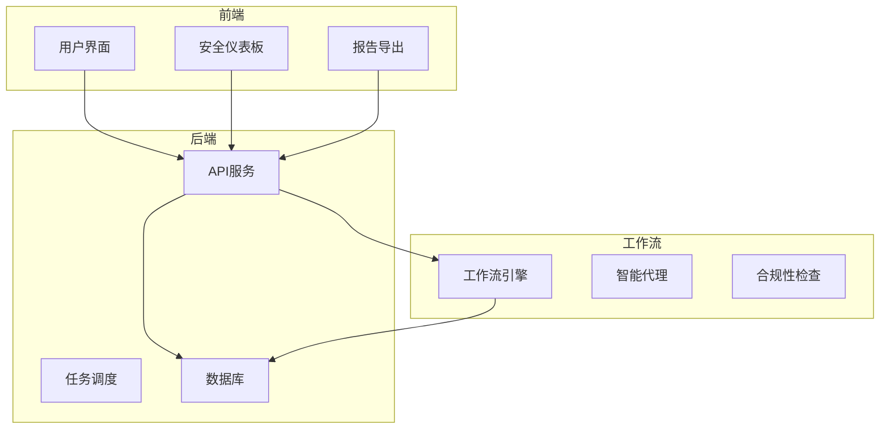
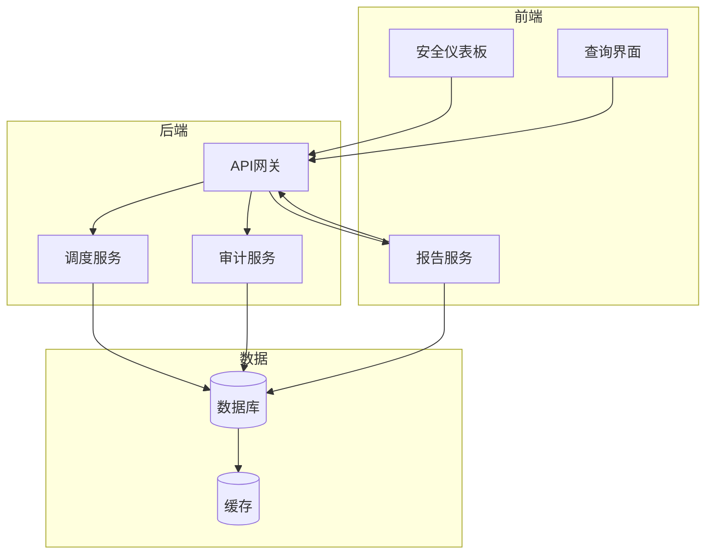
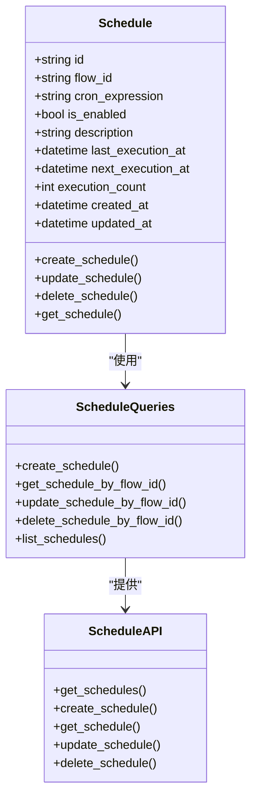
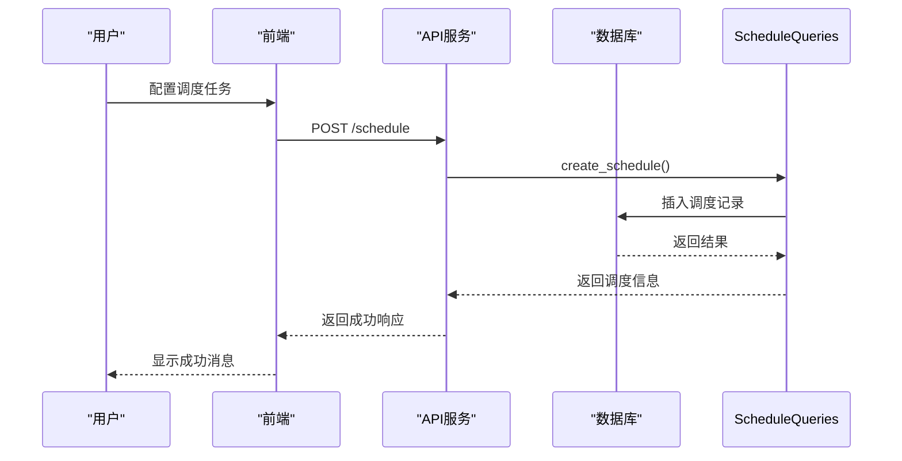
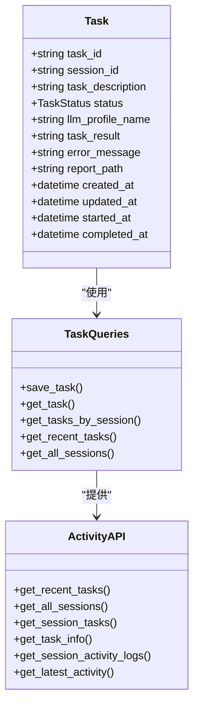
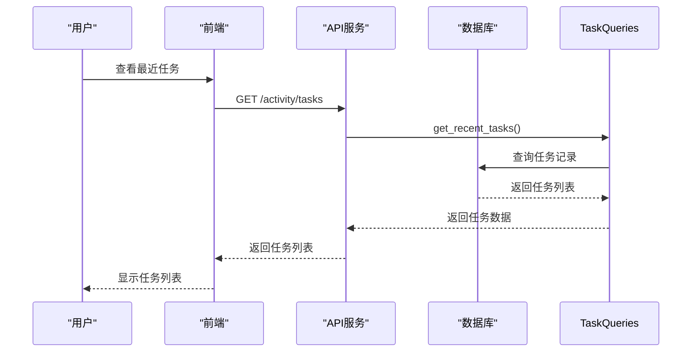
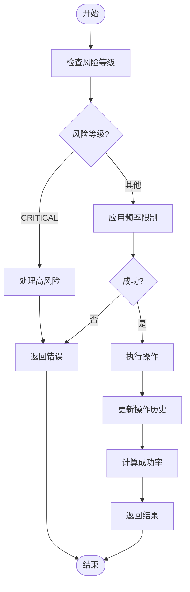
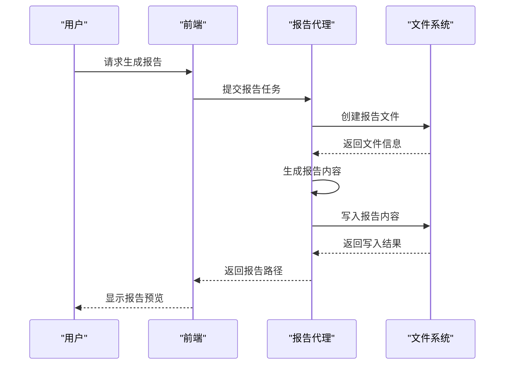
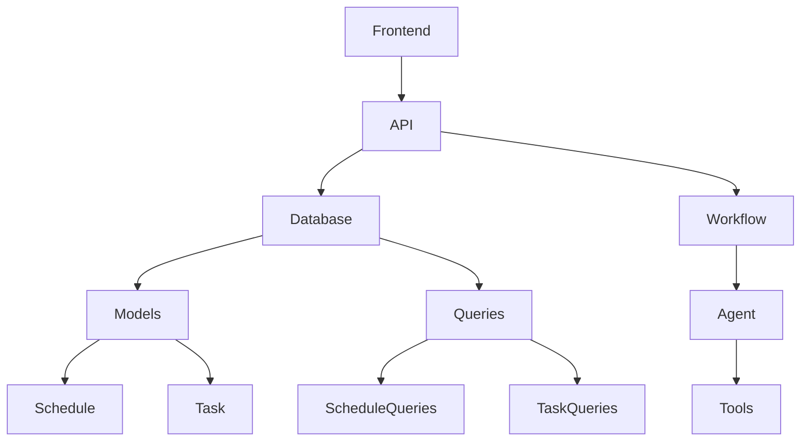

# 审计分析

<cite>
**本文档引用的文件**
- [models.py](file://vibe_surf/backend/database/models.py)
- [activity.py](file://vibe_surf/backend/api/activity.py)
- [schedule.py](file://vibe_surf/backend/api/schedule.py)
- [queries.py](file://vibe_surf/backend/database/queries.py)
- [v007_add_schedule_table.sql](file://vibe_surf/backend/database/migrations/v007_add_schedule_table.sql)
- [anti_detection.py](file://vibe_surf/workflows/Recruitment/boss_zhipin/anti_detection.py)
- [session-manager.js](file://vibe_surf/chrome_extension/scripts/session-manager.js)
- [api-client.js](file://vibe_surf/chrome_extension/scripts/api-client.js)
- [settings-workflow.js](file://vibe_surf/chrome_extension/scripts/settings-workflow.js)
- [report_writer_agent.py](file://vibe_surf/agents/report_writer_agent.py)
- [tools.py](file://vibe_surf/tools/report_writer_tools.py)
</cite>

## 目录
1. [引言](#引言)
2. [项目结构](#项目结构)
3. [核心组件](#核心组件)
4. [架构概述](#架构概述)
5. [详细组件分析](#详细组件分析)
6. [依赖分析](#依赖分析)
7. [性能考虑](#性能考虑)
8. [故障排除指南](#故障排除指南)
9. [结论](#结论)

## 引言
VibeSurf审计分析功能提供了一套全面的安全监控和合规性评估系统。该系统实现了自动化安全审计流程，包括审计任务的调度、执行和结果存储，支持GDPR、HIPAA等不同标准的合规性检查。通过安全仪表板展示登录活动趋势、权限变更历史和异常行为分布等关键指标，并提供审计报告的生成和导出功能，支持PDF、CSV等格式。此外，系统还提供了自定义分析查询的编写指南，帮助安全团队进行深度威胁狩猎。

## 项目结构
VibeSurf的审计分析功能分布在多个模块中，主要包括后端API、数据库模型、前端组件和工作流工具。系统采用分层架构，后端提供REST API接口，数据库存储审计数据，前端实现用户界面和仪表板展示。

**Diagram sources**
- [models.py](file://vibe_surf/backend/database/models.py)
- [activity.py](file://vibe_surf/backend/api/activity.py)
- [schedule.py](file://vibe_surf/backend/api/schedule.py)

**Section sources**
- [models.py](file://vibe_surf/backend/database/models.py)
- [activity.py](file://vibe_surf/backend/api/activity.py)
- [schedule.py](file://vibe_surf/backend/api/schedule.py)

## 核心组件
审计分析功能的核心组件包括任务调度系统、活动日志管理、合规性检查引擎和报告生成器。任务调度系统负责定期执行安全审计任务，活动日志管理记录所有系统操作，合规性检查引擎评估系统是否符合GDPR、HIPAA等标准，报告生成器则负责生成和导出审计报告。

**Section sources**
- [schedule.py](file://vibe_surf/backend/api/schedule.py)
- [activity.py](file://vibe_surf/backend/api/activity.py)
- [anti_detection.py](file://vibe_surf/workflows/Recruitment/boss_zhipin/anti_detection.py)

## 架构概述
VibeSurf审计分析系统采用微服务架构，各组件通过API进行通信。系统架构分为前端展示层、后端服务层和数据存储层。前端展示层负责用户界面和仪表板展示，后端服务层提供业务逻辑和API接口，数据存储层负责持久化存储审计数据。

**Diagram sources**
- [models.py](file://vibe_surf/backend/database/models.py)
- [activity.py](file://vibe_surf/backend/api/activity.py)
- [schedule.py](file://vibe_surf/backend/api/schedule.py)

## 详细组件分析

### 任务调度系统分析
任务调度系统是审计分析功能的核心，负责定期执行安全审计任务。系统使用cron表达式定义调度规则，支持每日、每周、每月等不同频率的调度。

#### 任务调度类图

**Diagram sources**
- [models.py](file://vibe_surf/backend/database/models.py#L258-L289)
- [queries.py](file://vibe_surf/backend/database/queries.py#L1036-L1074)
- [schedule.py](file://vibe_surf/backend/api/schedule.py#L28-L51)

#### 任务调度序列图

**Diagram sources**
- [schedule.py](file://vibe_surf/backend/api/schedule.py#L108-L148)
- [queries.py](file://vibe_surf/backend/database/queries.py#L1036-L1074)

### 活动日志管理分析
活动日志管理系统负责记录和查询系统操作日志，为安全审计提供数据支持。

#### 活动日志类图

**Diagram sources**
- [models.py](file://vibe_surf/backend/database/models.py#L94-L137)
- [queries.py](file://vibe_surf/backend/database/queries.py#L441-L753)
- [activity.py](file://vibe_surf/backend/api/activity.py#L21-L246)

#### 活动日志序列图

**Diagram sources**
- [activity.py](file://vibe_surf/backend/api/activity.py#L25-L59)
- [queries.py](file://vibe_surf/backend/database/queries.py#L555-L569)

### 合规性检查分析
合规性检查系统通过智能代理实现，能够检测和评估系统安全风险。

#### 合规性检查流程图

**Diagram sources**
- [anti_detection.py](file://vibe_surf/workflows/Recruitment/boss_zhipin/anti_detection.py#L150-L154)
- [anti_detection.py](file://vibe_surf/workflows/Recruitment/boss_zhipin/anti_detection.py#L642-L653)

### 报告生成分析
报告生成系统负责创建和导出审计报告，支持多种格式。

#### 报告生成序列图

**Diagram sources**
- [report_writer_agent.py](file://vibe_surf/agents/report_writer_agent.py#L143-L173)
- [tools.py](file://vibe_surf/tools/report_writer_tools.py#L1-L22)

## 依赖分析
审计分析功能的组件之间存在明确的依赖关系。前端组件依赖后端API服务，后端服务依赖数据库模型和查询工具。任务调度系统依赖数据库存储调度配置，活动日志管理系统依赖数据库存储任务记录。

**Diagram sources**
- [models.py](file://vibe_surf/backend/database/models.py)
- [queries.py](file://vibe_surf/backend/database/queries.py)
- [activity.py](file://vibe_surf/backend/api/activity.py)
- [schedule.py](file://vibe_surf/backend/api/schedule.py)

**Section sources**
- [models.py](file://vibe_surf/backend/database/models.py)
- [queries.py](file://vibe_surf/backend/database/queries.py)
- [activity.py](file://vibe_surf/backend/api/activity.py)
- [schedule.py](file://vibe_surf/backend/api/schedule.py)

## 性能考虑
审计分析系统在设计时考虑了性能优化。数据库表建立了适当的索引以提高查询效率，API接口实现了分页和限制功能以避免返回过多数据。任务调度系统使用异步处理，避免阻塞主线程。活动日志管理系统实现了增量查询，只返回新增的日志记录。

## 故障排除指南
当审计分析功能出现问题时，可以按照以下步骤进行排查：

1. 检查数据库连接是否正常
2. 验证调度任务的cron表达式是否正确
3. 确认API服务是否正常运行
4. 检查日志文件是否有错误信息
5. 验证前端与后端的通信是否正常

**Section sources**
- [schedule.py](file://vibe_surf/backend/api/schedule.py)
- [activity.py](file://vibe_surf/backend/api/activity.py)
- [queries.py](file://vibe_surf/backend/database/queries.py)

## 结论
VibeSurf审计分析功能提供了一套完整的安全监控和合规性评估解决方案。系统通过自动化任务调度、详细的活动日志记录、智能的合规性检查和灵活的报告生成功能，帮助组织有效管理安全风险。系统的模块化设计和清晰的架构使得功能扩展和维护变得简单，为安全团队提供了强大的工具支持。