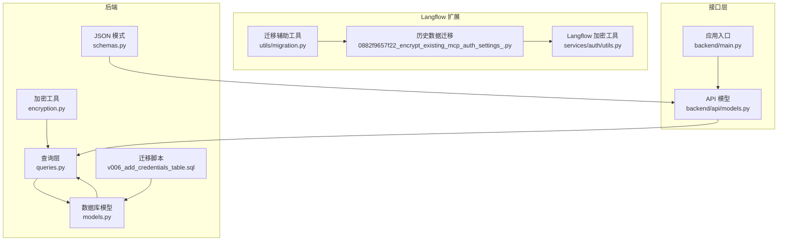
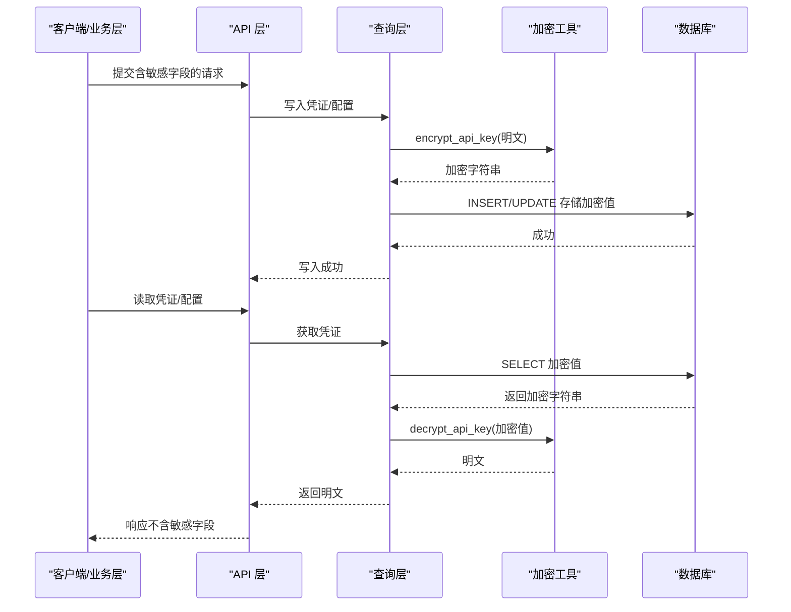
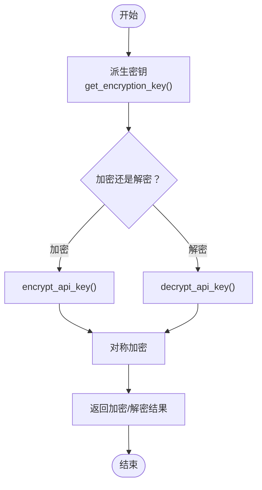
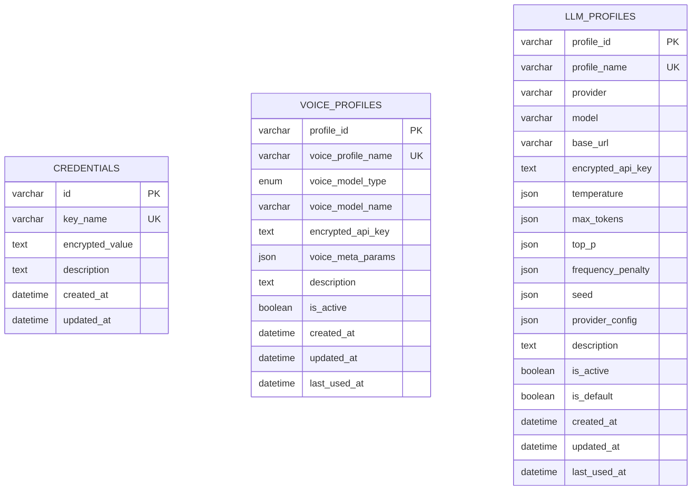
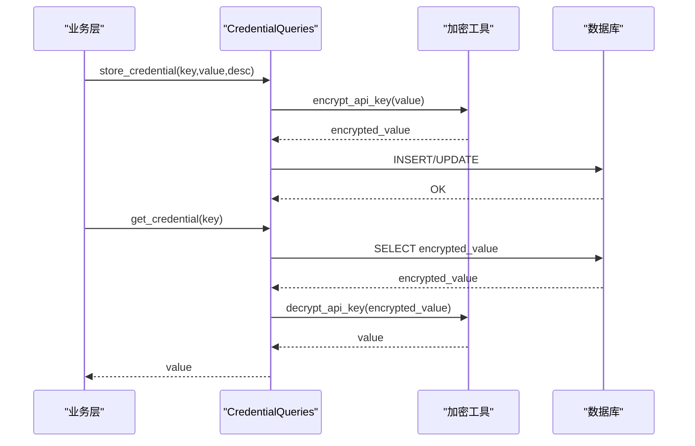
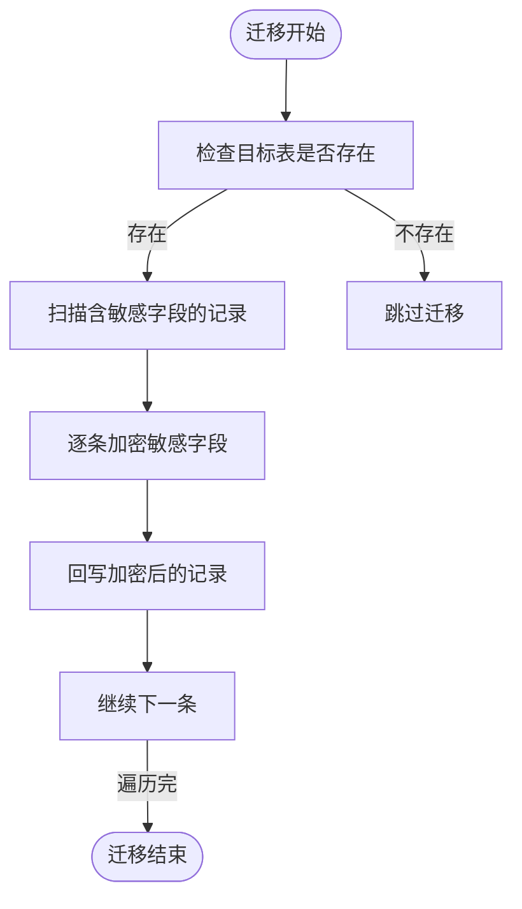
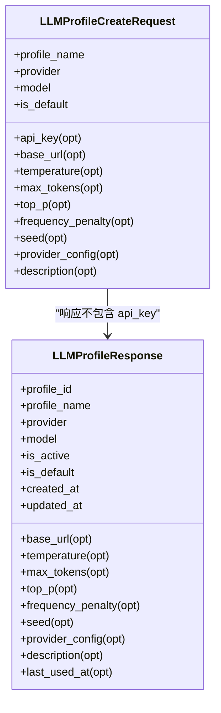
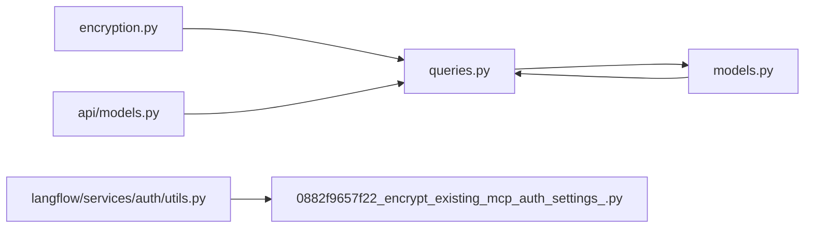

# 加密实现

<cite>
**本文引用的文件**
- [vibe_surf/backend/utils/encryption.py](file://vibe_surf/backend/utils/encryption.py)
- [vibe_surf/backend/database/models.py](file://vibe_surf/backend/database/models.py)
- [vibe_surf/backend/database/queries.py](file://vibe_surf/backend/database/queries.py)
- [vibe_surf/backend/database/schemas.py](file://vibe_surf/backend/database/schemas.py)
- [vibe_surf/backend/database/migrations/v006_add_credentials_table.sql](file://vibe_surf/backend/database/migrations/v006_add_credentials_table.sql)
- [vibe_surf/langflow/alembic/versions/0882f9657f22_encrypt_existing_mcp_auth_settings_.py](file://vibe_surf/langflow/alembic/versions/0882f9657f22_encrypt_existing_mcp_auth_settings_.py)
- [vibe_surf/langflow/services/auth/utils.py](file://vibe_surf/langflow/services/auth/utils.py)
- [vibe_surf/backend/api/models.py](file://vibe_surf/backend/api/models.py)
- [vibe_surf/backend/main.py](file://vibe_surf/backend/main.py)
- [vibe_surf/langflow/utils/migration.py](file://vibe_surf/langflow/utils/migration.py)
</cite>

## 目录
1. [简介](#简介)
2. [项目结构](#项目结构)
3. [核心组件](#核心组件)
4. [架构总览](#架构总览)
5. [详细组件分析](#详细组件分析)
6. [依赖关系分析](#依赖关系分析)
7. [性能考量](#性能考量)
8. [故障排查指南](#故障排查指南)
9. [结论](#结论)
10. [附录](#附录)

## 简介
本文件系统性解析 VibeSurf 的数据加密实现机制，重点覆盖：
- 静态数据加密：基于设备 MAC 地址或本地用户标识派生对称密钥，使用对称加密算法存储敏感字段（如 API 密钥、凭证值）。
- 数据库 ORM 集成：在 SQLAlchemy 模型中以文本字段存储加密后的值，并通过查询层完成加解密。
- 敏感字段处理流程：模型层仅保存加密值；业务层在入库前加密、取数时解密。
- 自定义字段类型与迁移策略：新增凭证表、索引与触发器，以及历史数据迁移脚本。
- 加密 API 调用示例：展示如何在业务逻辑中安全使用加密功能。
- 性能影响与优化：索引设计、缓存与查询优化建议。
- 传输中加密与静态加密协同：传输层采用 HTTPS/TLS，静态层采用对称加密，二者互补。

## 项目结构
围绕“加密实现”的关键目录与文件：
- 后端工具层：加密工具函数与密钥派生逻辑
- 数据库层：模型、查询、模式与迁移
- 前端/接口层：API 请求/响应模型，避免明文泄露
- Langflow 扩展：对历史配置进行迁移加密

图表来源
- [vibe_surf/backend/utils/encryption.py](file://vibe_surf/backend/utils/encryption.py#L1-L172)
- [vibe_surf/backend/database/models.py](file://vibe_surf/backend/database/models.py#L1-L289)
- [vibe_surf/backend/database/queries.py](file://vibe_surf/backend/database/queries.py#L1340-L1539)
- [vibe_surf/backend/database/schemas.py](file://vibe_surf/backend/database/schemas.py#L1-L100)
- [vibe_surf/backend/database/migrations/v006_add_credentials_table.sql](file://vibe_surf/backend/database/migrations/v006_add_credentials_table.sql#L1-L26)
- [vibe_surf/langflow/alembic/versions/0882f9657f22_encrypt_existing_mcp_auth_settings_.py](file://vibe_surf/langflow/alembic/versions/0882f9657f22_encrypt_existing_mcp_auth_settings_.py#L25-L122)
- [vibe_surf/langflow/services/auth/utils.py](file://vibe_surf/langflow/services/auth/utils.py#L472-L505)
- [vibe_surf/backend/api/models.py](file://vibe_surf/backend/api/models.py#L1-L260)
- [vibe_surf/backend/main.py](file://vibe_surf/backend/main.py#L543-L731)
- [vibe_surf/langflow/utils/migration.py](file://vibe_surf/langflow/utils/migration.py#L1-L62)

章节来源
- [vibe_surf/backend/utils/encryption.py](file://vibe_surf/backend/utils/encryption.py#L1-L172)
- [vibe_surf/backend/database/models.py](file://vibe_surf/backend/database/models.py#L1-L289)
- [vibe_surf/backend/database/queries.py](file://vibe_surf/backend/database/queries.py#L1340-L1539)
- [vibe_surf/backend/database/schemas.py](file://vibe_surf/backend/database/schemas.py#L1-L100)
- [vibe_surf/backend/database/migrations/v006_add_credentials_table.sql](file://vibe_surf/backend/database/migrations/v006_add_credentials_table.sql#L1-L26)
- [vibe_surf/langflow/alembic/versions/0882f9657f22_encrypt_existing_mcp_auth_settings_.py](file://vibe_surf/langflow/alembic/versions/0882f9657f22_encrypt_existing_mcp_auth_settings_.py#L25-L122)
- [vibe_surf/langflow/services/auth/utils.py](file://vibe_surf/langflow/services/auth/utils.py#L472-L505)
- [vibe_surf/backend/api/models.py](file://vibe_surf/backend/api/models.py#L1-L260)
- [vibe_surf/backend/main.py](file://vibe_surf/backend/main.py#L543-L731)
- [vibe_surf/langflow/utils/migration.py](file://vibe_surf/langflow/utils/migration.py#L1-L62)

## 核心组件
- 加密工具模块：提供密钥派生、API 密钥加解密、加密状态判断等能力。
- 数据库模型：定义包含敏感字段的模型（如凭证表、语音/大模型配置表），字段类型为文本以容纳加密字符串。
- 查询层：封装存取凭证的加解密逻辑，确保业务层不直接接触明文。
- 迁移脚本：创建凭证表、索引与自动更新时间戳触发器；对历史数据进行加密迁移。
- API 模型：避免在响应体中返回敏感字段，保障传输安全。
- Langflow 扩展：对历史配置中的敏感字段进行批量加密/解密迁移。

章节来源
- [vibe_surf/backend/utils/encryption.py](file://vibe_surf/backend/utils/encryption.py#L1-L172)
- [vibe_surf/backend/database/models.py](file://vibe_surf/backend/database/models.py#L1-L289)
- [vibe_surf/backend/database/queries.py](file://vibe_surf/backend/database/queries.py#L1340-L1539)
- [vibe_surf/backend/database/migrations/v006_add_credentials_table.sql](file://vibe_surf/backend/database/migrations/v006_add_credentials_table.sql#L1-L26)
- [vibe_surf/langflow/alembic/versions/0882f9657f22_encrypt_existing_mcp_auth_settings_.py](file://vibe_surf/langflow/alembic/versions/0882f9657f22_encrypt_existing_mcp_auth_settings_.py#L25-L122)
- [vibe_surf/backend/api/models.py](file://vibe_surf/backend/api/models.py#L1-L260)

## 架构总览
静态数据加密与数据库 ORM 的集成路径如下：
- 存储阶段：业务层调用查询层写入凭证，查询层先对明文进行加密，再持久化到数据库。
- 读取阶段：业务层调用查询层读取凭证，查询层从数据库取出加密值并解密，返回给上层。
- 模型层：敏感字段以文本类型存储，不暴露明文；索引与触发器保证检索效率与一致性。
- 历史迁移：通过迁移脚本对旧数据进行加密，确保系统升级后数据安全。

图表来源
- [vibe_surf/backend/database/queries.py](file://vibe_surf/backend/database/queries.py#L1340-L1539)
- [vibe_surf/backend/utils/encryption.py](file://vibe_surf/backend/utils/encryption.py#L1-L172)
- [vibe_surf/backend/database/models.py](file://vibe_surf/backend/database/models.py#L1-L289)

## 详细组件分析

### 组件A：加密工具模块（对称加密与密钥派生）
- 密钥派生：基于设备 MAC 地址或本地用户标识生成固定盐值，使用 KDF 派生对称密钥。
- API 密钥加解密：使用对称加密算法对字符串进行加解密，输出为可安全存储的文本。
- 失败回退：解密失败时尝试另一种密钥来源，提升兼容性。
- 辅助函数：判断字符串是否为加密格式，便于迁移与校验。

图表来源
- [vibe_surf/backend/utils/encryption.py](file://vibe_surf/backend/utils/encryption.py#L1-L172)

章节来源
- [vibe_surf/backend/utils/encryption.py](file://vibe_surf/backend/utils/encryption.py#L1-L172)

### 组件B：数据库模型与敏感字段
- 凭证模型：包含唯一键名与加密值字段，用于存储各类敏感凭据。
- 配置模型：语音/大模型配置表中包含加密 API 密钥字段，避免明文落盘。
- 索引与触发器：为键名建立索引，自动维护更新时间戳，提升查询与审计效率。

图表来源
- [vibe_surf/backend/database/models.py](file://vibe_surf/backend/database/models.py#L1-L289)

章节来源
- [vibe_surf/backend/database/models.py](file://vibe_surf/backend/database/models.py#L1-L289)

### 组件C：查询层与加解密集成
- 存储凭证：先加密再入库，支持更新与新增。
- 读取凭证：按键名查询，解密后返回。
- 删除与列举：提供删除与列出键名的能力，便于运维与审计。

图表来源
- [vibe_surf/backend/database/queries.py](file://vibe_surf/backend/database/queries.py#L1340-L1539)
- [vibe_surf/backend/utils/encryption.py](file://vibe_surf/backend/utils/encryption.py#L1-L172)

章节来源
- [vibe_surf/backend/database/queries.py](file://vibe_surf/backend/database/queries.py#L1340-L1539)

### 组件D：迁移策略与历史数据处理
- 新增凭证表：创建表结构、索引与自动更新触发器。
- 历史数据迁移：扫描旧表中的敏感字段，逐条加密并回写，失败记录日志但不影响整体迁移。
- Langflow 历史迁移：对特定配置表的 auth_settings 字段进行批量加密/解密。

图表来源
- [vibe_surf/backend/database/migrations/v006_add_credentials_table.sql](file://vibe_surf/backend/database/migrations/v006_add_credentials_table.sql#L1-L26)
- [vibe_surf/langflow/alembic/versions/0882f9657f22_encrypt_existing_mcp_auth_settings_.py](file://vibe_surf/langflow/alembic/versions/0882f9657f22_encrypt_existing_mcp_auth_settings_.py#L25-L122)
- [vibe_surf/langflow/utils/migration.py](file://vibe_surf/langflow/utils/migration.py#L1-L62)

章节来源
- [vibe_surf/backend/database/migrations/v006_add_credentials_table.sql](file://vibe_surf/backend/database/migrations/v006_add_credentials_table.sql#L1-L26)
- [vibe_surf/langflow/alembic/versions/0882f9657f22_encrypt_existing_mcp_auth_settings_.py](file://vibe_surf/langflow/alembic/versions/0882f9657f22_encrypt_existing_mcp_auth_settings_.py#L25-L122)
- [vibe_surf/langflow/utils/migration.py](file://vibe_surf/langflow/utils/migration.py#L1-L62)

### 组件E：API 模型与传输安全
- API 模型：在请求体中允许提交敏感字段，在响应体中排除敏感字段，避免明文泄露。
- 应用入口：启用 CORS、中间件与健康检查，确保服务稳定运行。

图表来源
- [vibe_surf/backend/api/models.py](file://vibe_surf/backend/api/models.py#L1-L260)
- [vibe_surf/backend/main.py](file://vibe_surf/backend/main.py#L543-L731)

章节来源
- [vibe_surf/backend/api/models.py](file://vibe_surf/backend/api/models.py#L1-L260)
- [vibe_surf/backend/main.py](file://vibe_surf/backend/main.py#L543-L731)

### 组件F：Langflow 扩展的加密工具与迁移
- Langflow 加密工具：提供与后端一致的加解密方法，便于跨模块统一处理。
- 历史迁移：对特定表的 auth_settings 字段进行批量加密/解密，失败记录日志。

章节来源
- [vibe_surf/langflow/services/auth/utils.py](file://vibe_surf/langflow/services/auth/utils.py#L472-L505)
- [vibe_surf/langflow/alembic/versions/0882f9657f22_encrypt_existing_mcp_auth_settings_.py](file://vibe_surf/langflow/alembic/versions/0882f9657f22_encrypt_existing_mcp_auth_settings_.py#L25-L122)

## 依赖关系分析
- 模块耦合：查询层依赖加密工具；模型层与查询层双向依赖；API 模型依赖查询层以完成业务操作。
- 外部依赖：对称加密库、KDF、数据库驱动、迁移框架。
- 循环依赖：未发现循环导入；查询层通过函数调用加密工具，避免循环依赖。

图表来源
- [vibe_surf/backend/utils/encryption.py](file://vibe_surf/backend/utils/encryption.py#L1-L172)
- [vibe_surf/backend/database/queries.py](file://vibe_surf/backend/database/queries.py#L1340-L1539)
- [vibe_surf/backend/database/models.py](file://vibe_surf/backend/database/models.py#L1-L289)
- [vibe_surf/backend/api/models.py](file://vibe_surf/backend/api/models.py#L1-L260)
- [vibe_surf/langflow/services/auth/utils.py](file://vibe_surf/langflow/services/auth/utils.py#L472-L505)
- [vibe_surf/langflow/alembic/versions/0882f9657f22_encrypt_existing_mcp_auth_settings_.py](file://vibe_surf/langflow/alembic/versions/0882f9657f22_encrypt_existing_mcp_auth_settings_.py#L25-L122)

章节来源
- [vibe_surf/backend/database/queries.py](file://vibe_surf/backend/database/queries.py#L1340-L1539)
- [vibe_surf/backend/utils/encryption.py](file://vibe_surf/backend/utils/encryption.py#L1-L172)
- [vibe_surf/backend/database/models.py](file://vibe_surf/backend/database/models.py#L1-L289)
- [vibe_surf/backend/api/models.py](file://vibe_surf/backend/api/models.py#L1-L260)
- [vibe_surf/langflow/services/auth/utils.py](file://vibe_surf/langflow/services/auth/utils.py#L472-L505)
- [vibe_surf/langflow/alembic/versions/0882f9657f22_encrypt_existing_mcp_auth_settings_.py](file://vibe_surf/langflow/alembic/versions/0882f9657f22_encrypt_existing_mcp_auth_settings_.py#L25-L122)

## 性能考量
- 加密成本：对称加密与 KDF 计算带来 CPU 开销；建议在批量写入时合并事务，减少往返。
- 查询性能：为键名建立索引，避免全表扫描；对频繁查询的字段增加复合索引。
- 缓存策略：对高频读取的凭证值进行短期缓存，降低数据库压力；注意缓存失效与一致性。
- 数据库优化：使用触发器自动维护更新时间戳，减少应用层重复逻辑；合理分页与限制返回字段。
- 传输安全：生产环境启用 HTTPS/TLS，避免明文传输；结合 API 模型避免在响应中携带敏感信息。

[本节为通用指导，无需代码来源]

## 故障排查指南
- 解密失败：检查密钥来源是否一致（MAC 地址 vs 本地用户标识）；查看错误日志定位异常。
- 迁移失败：确认目标表存在与字段类型正确；查看迁移脚本日志，逐条修正问题记录。
- 查询超时：检查索引是否生效；优化查询条件与分页参数。
- API 响应异常：确认响应模型未包含敏感字段；检查序列化过程中的异常处理。

章节来源
- [vibe_surf/backend/utils/encryption.py](file://vibe_surf/backend/utils/encryption.py#L1-L172)
- [vibe_surf/langflow/alembic/versions/0882f9657f22_encrypt_existing_mcp_auth_settings_.py](file://vibe_surf/langflow/alembic/versions/0882f9657f22_encrypt_existing_mcp_auth_settings_.py#L25-L122)

## 结论
VibeSurf 的加密实现通过“静态数据加密 + 数据库 ORM 集成 + 历史迁移 + 传输安全”的组合，实现了对敏感字段（如 API 密钥、凭证值）的安全管理。模型层仅存储加密值，业务层通过查询层透明加解密，既满足安全要求又保持了良好的开发体验。配合索引、缓存与迁移策略，可在保障安全的同时兼顾性能与可维护性。

[本节为总结，无需代码来源]

## 附录

### 加密 API 调用示例（路径指引）
- 存储凭证
  - 路径：[vibe_surf/backend/database/queries.py](file://vibe_surf/backend/database/queries.py#L1367-L1405)
  - 关键点：先加密，后入库；支持更新与新增
- 读取凭证
  - 路径：[vibe_surf/backend/database/queries.py](file://vibe_surf/backend/database/queries.py#L1345-L1366)
  - 关键点：按键名查询，解密后返回
- 加密工具
  - 路径：[vibe_surf/backend/utils/encryption.py](file://vibe_surf/backend/utils/encryption.py#L65-L127)
  - 关键点：密钥派生、加解密、加密状态判断
- Langflow 加密工具
  - 路径：[vibe_surf/langflow/services/auth/utils.py](file://vibe_surf/langflow/services/auth/utils.py#L472-L505)
  - 关键点：与后端一致的加解密方法
- 历史数据迁移
  - 路径：[vibe_surf/langflow/alembic/versions/0882f9657f22_encrypt_existing_mcp_auth_settings_.py](file://vibe_surf/langflow/alembic/versions/0882f9657f22_encrypt_existing_mcp_auth_settings_.py#L25-L122)
  - 关键点：扫描、加密、回写；失败记录日志

章节来源
- [vibe_surf/backend/database/queries.py](file://vibe_surf/backend/database/queries.py#L1345-L1405)
- [vibe_surf/backend/utils/encryption.py](file://vibe_surf/backend/utils/encryption.py#L65-L127)
- [vibe_surf/langflow/services/auth/utils.py](file://vibe_surf/langflow/services/auth/utils.py#L472-L505)
- [vibe_surf/langflow/alembic/versions/0882f9657f22_encrypt_existing_mcp_auth_settings_.py](file://vibe_surf/langflow/alembic/versions/0882f9657f22_encrypt_existing_mcp_auth_settings_.py#L25-L122)