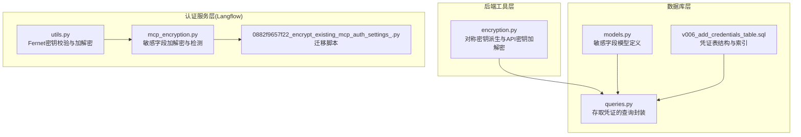
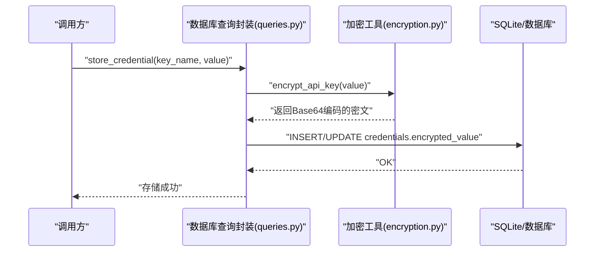
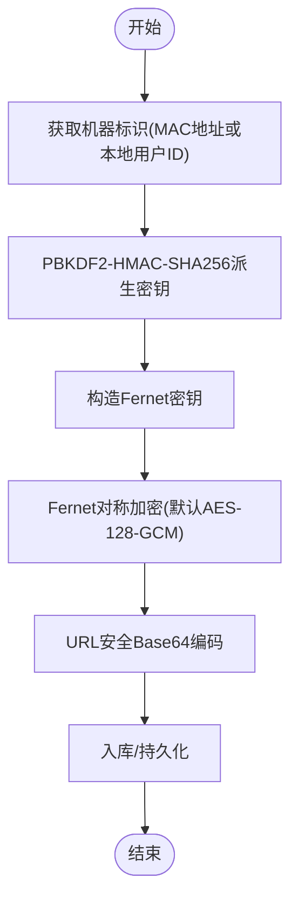
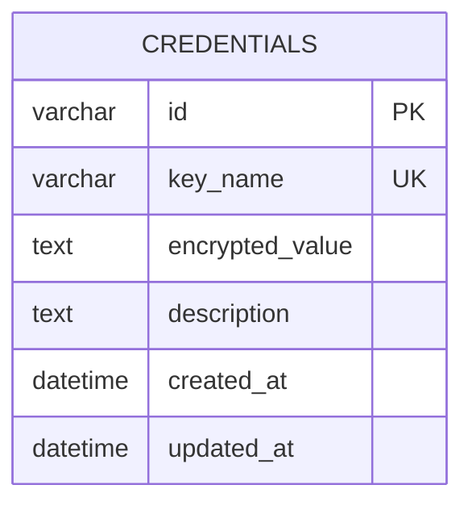
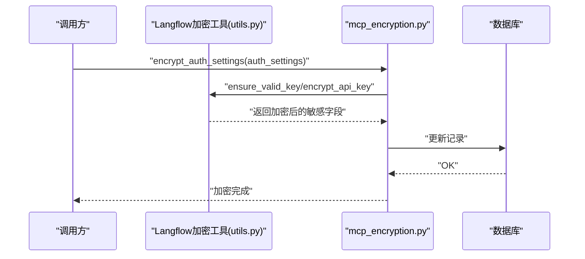

# 加密算法

<cite>
**本文引用的文件**
- [encryption.py](file://vibe_surf/backend/utils/encryption.py)
- [queries.py](file://vibe_surf/backend/database/queries.py)
- [models.py](file://vibe_surf/backend/database/models.py)
- [v006_add_credentials_table.sql](file://vibe_surf/backend/database/migrations/v006_add_credentials_table.sql)
- [utils.py](file://vibe_surf/langflow/services/auth/utils.py)
- [mcp_encryption.py](file://vibe_surf/langflow/services/auth/mcp_encryption.py)
- [0882f9657f22_encrypt_existing_mcp_auth_settings_.py](file://vibe_surf/langflow/alembic/versions/0882f9657f22_encrypt_existing_mcp_auth_settings_.py)
</cite>

## 目录
1. [简介](#简介)
2. [项目结构](#项目结构)
3. [核心组件](#核心组件)
4. [架构总览](#架构总览)
5. [详细组件分析](#详细组件分析)
6. [依赖关系分析](#依赖关系分析)
7. [性能考量](#性能考量)
8. [故障排查指南](#故障排查指南)
9. [结论](#结论)

## 简介
本文件系统性阐述 VibeSurf 中用于静态数据加密的密码学实现，重点围绕对称加密与密钥派生机制，并结合数据库字段映射与存储流程，说明如何将明文敏感数据（如 API 密钥、认证凭据等）安全地转换为可持久化的密文形式。同时给出算法选择依据、安全强度评估、常见攻击防护建议，以及初始化向量（IV）的生成与存储策略说明。

## 项目结构
与加密相关的核心位置如下：
- 后端工具层：提供基于机器标识的对称密钥派生与 API 密钥加解密工具
- 数据库层：模型定义、迁移脚本与查询封装，负责敏感字段的持久化
- 认证服务层：Langflow 侧提供基于 Fernet 的对称加解密与迁移脚本

图表来源
- [encryption.py](file://vibe_surf/backend/utils/encryption.py#L1-L172)
- [queries.py](file://vibe_surf/backend/database/queries.py#L1367-L1405)
- [models.py](file://vibe_surf/backend/database/models.py#L217-L235)
- [v006_add_credentials_table.sql](file://vibe_surf/backend/database/migrations/v006_add_credentials_table.sql#L1-L26)
- [utils.py](file://vibe_surf/langflow/services/auth/utils.py#L433-L505)
- [mcp_encryption.py](file://vibe_surf/langflow/services/auth/mcp_encryption.py#L1-L120)
- [0882f9657f22_encrypt_existing_mcp_auth_settings_.py](file://vibe_surf/langflow/alembic/versions/0882f9657f22_encrypt_existing_mcp_auth_settings_.py#L25-L122)

章节来源
- [encryption.py](file://vibe_surf/backend/utils/encryption.py#L1-L172)
- [queries.py](file://vibe_surf/backend/database/queries.py#L1367-L1405)
- [models.py](file://vibe_surf/backend/database/models.py#L217-L235)
- [v006_add_credentials_table.sql](file://vibe_surf/backend/database/migrations/v006_add_credentials_table.sql#L1-L26)
- [utils.py](file://vibe_surf/langflow/services/auth/utils.py#L433-L505)
- [mcp_encryption.py](file://vibe_surf/langflow/services/auth/mcp_encryption.py#L1-L120)
- [0882f9657f22_encrypt_existing_mcp_auth_settings_.py](file://vibe_surf/langflow/alembic/versions/0882f9657f22_encrypt_existing_mcp_auth_settings_.py#L25-L122)

## 核心组件
- 对称加密与密钥派生（后端工具层）
  - 使用基于机器标识的密钥派生函数，通过 PBKDF2-HMAC-SHA256 从输入派生固定长度密钥，再经 Fernet 实现对称加解密。
  - 提供 API 密钥的加密/解密与“是否已加密”判断工具。
- 数据库存储（数据库层）
  - 定义包含敏感字段的模型与迁移脚本；查询封装统一调用后端工具层进行加密后再入库。
- 认证服务加密（Langflow 层）
  - 提供基于 Fernet 的对称加解密与密钥有效性校验；迁移脚本对既有记录进行批量加密。

章节来源
- [encryption.py](file://vibe_surf/backend/utils/encryption.py#L23-L148)
- [models.py](file://vibe_surf/backend/database/models.py#L217-L235)
- [v006_add_credentials_table.sql](file://vibe_surf/backend/database/migrations/v006_add_credentials_table.sql#L1-L26)
- [queries.py](file://vibe_surf/backend/database/queries.py#L1367-L1405)
- [utils.py](file://vibe_surf/langflow/services/auth/utils.py#L433-L505)
- [mcp_encryption.py](file://vibe_surf/langflow/services/auth/mcp_encryption.py#L1-L120)
- [0882f9657f22_encrypt_existing_mcp_auth_settings_.py](file://vibe_surf/langflow/alembic/versions/0882f9657f22_encrypt_existing_mcp_auth_settings_.py#L25-L122)

## 架构总览
下图展示了从明文到密文入库的关键路径，以及不同模块之间的交互关系。

图表来源
- [queries.py](file://vibe_surf/backend/database/queries.py#L1367-L1405)
- [encryption.py](file://vibe_surf/backend/utils/encryption.py#L76-L126)
- [models.py](file://vibe_surf/backend/database/models.py#L217-L235)
- [v006_add_credentials_table.sql](file://vibe_surf/backend/database/migrations/v006_add_credentials_table.sql#L1-L26)

## 详细组件分析

### 组件A：对称加密与密钥派生（后端工具层）
- 算法选择与实现要点
  - 密钥派生：使用 PBKDF2-HMAC-SHA256，固定盐值与高迭代次数，从机器标识（MAC 地址或本地用户 ID）派生固定长度密钥。
  - 对称加密：采用 Fernet（基于 AES-128-GCM 的封装），提供带认证的对称加密，具备完整性保护。
  - 明文到密文转换：先用 Fernet 加密，再进行 URL 安全 Base64 编码以便安全存储。
- 关键接口
  - derive_key：从机器标识派生密钥
  - get_encryption_key：获取当前机器的密钥（回退到本地用户 ID）
  - encrypt_api_key / decrypt_api_key：对 API 密钥进行加解密
  - is_encrypted：判断字符串是否为已加密的 Fernet 文本
- 安全强度与模式说明
  - Fernet 默认使用 AES-128-GCM 模式，提供机密性与完整性保护；项目中未直接使用 AES-256-GCM，而是使用 Fernet 封装的 AES-128-GCM。
  - 填充方案：Fernet 不使用显式填充，内部以块大小处理并附带认证标签。
  - 初始化向量（IV）：Fernet 内部自动生成并随密文一起存储，无需应用层额外管理。
- 性能特征
  - PBKDF2 迭代次数较高，派生阶段开销显著，但仅在首次获取密钥时发生；后续加解密主要受 Fernet 影响。
- 针对常见攻击的防护
  - 重放攻击：Fernet 令牌包含时间戳与随机性，且默认不支持重复使用同一令牌；若需严格防重放，可在业务层引入一次性令牌或外部计数器。
  - 字典攻击：高迭代次数的 PBKDF2 有效提升抗离线暴力破解能力；建议配合强口令策略与访问控制。

图表来源
- [encryption.py](file://vibe_surf/backend/utils/encryption.py#L23-L148)

章节来源
- [encryption.py](file://vibe_surf/backend/utils/encryption.py#L23-L148)

### 组件B：数据库字段映射与存储流程
- 数据模型
  - 凭证表（credentials）包含 key_name、encrypted_value、description、时间戳等字段；encrypted_value 存储经工具层加密后的密文。
  - 其他模型（如 LLM/Voice Profile）也包含 encrypted_api_key 字段，用于存储对应服务的 API 密钥。
- 迁移脚本
  - 创建凭证表并建立索引，保证按 key_name 查询效率。
- 查询封装
  - 存储：调用工具层加密后写入 encrypted_value。
  - 读取：从数据库读取密文，调用工具层解密后返回明文。

图表来源
- [v006_add_credentials_table.sql](file://vibe_surf/backend/database/migrations/v006_add_credentials_table.sql#L1-L26)
- [models.py](file://vibe_surf/backend/database/models.py#L217-L235)

章节来源
- [models.py](file://vibe_surf/backend/database/models.py#L217-L235)
- [v006_add_credentials_table.sql](file://vibe_surf/backend/database/migrations/v006_add_credentials_table.sql#L1-L26)
- [queries.py](file://vibe_surf/backend/database/queries.py#L1367-L1405)

### 组件C：认证服务加密（Langflow 层）
- 工具函数
  - ensure_valid_key：确保密钥长度满足要求（Fernet 需要 32 字节密钥），不足则生成随机密钥并进行 Base64 编码。
  - get_fernet：基于设置服务提供的密钥生成 Fernet 实例。
  - encrypt_api_key / decrypt_api_key：对字符串进行对称加解密。
- 敏感字段处理
  - 对 oauth_client_secret、api_key 等敏感字段进行加密存储；提供“是否已加密”的检测逻辑，兼容已有明文数据。
- 迁移脚本
  - 对既有记录进行批量加密，升级时自动处理历史数据；降级时可尝试解密恢复。

图表来源
- [utils.py](file://vibe_surf/langflow/services/auth/utils.py#L433-L505)
- [mcp_encryption.py](file://vibe_surf/langflow/services/auth/mcp_encryption.py#L1-L120)
- [0882f9657f22_encrypt_existing_mcp_auth_settings_.py](file://vibe_surf/langflow/alembic/versions/0882f9657f22_encrypt_existing_mcp_auth_settings_.py#L25-L122)

章节来源
- [utils.py](file://vibe_surf/langflow/services/auth/utils.py#L433-L505)
- [mcp_encryption.py](file://vibe_surf/langflow/services/auth/mcp_encryption.py#L1-L120)
- [0882f9657f22_encrypt_existing_mcp_auth_settings_.py](file://vibe_surf/langflow/alembic/versions/0882f9657f22_encrypt_existing_mcp_auth_settings_.py#L25-L122)

## 依赖关系分析
- 后端工具层依赖
  - cryptography.fernet：提供对称加解密与令牌格式
  - cryptography.hazmat.primitives.kdf.pbkdf2：提供 PBKDF2 密钥派生
  - getmac：获取机器 MAC 地址
- 数据库层依赖
  - SQLAlchemy 模型与查询封装，统一调用后端工具层进行加密
- 认证服务层依赖
  - Fernet 与密钥校验逻辑，迁移脚本对历史数据进行批量处理

图表来源
- [encryption.py](file://vibe_surf/backend/utils/encryption.py#L23-L148)
- [queries.py](file://vibe_surf/backend/database/queries.py#L1367-L1405)

章节来源
- [encryption.py](file://vibe_surf/backend/utils/encryption.py#L23-L148)
- [queries.py](file://vibe_surf/backend/database/queries.py#L1367-L1405)

## 性能考量
- 密钥派生成本
  - PBKDF2 迭代次数较高，派生阶段 CPU 开销较大；建议在进程启动或首次使用时完成派生，避免频繁重复计算。
- 加解密吞吐
  - Fernet 加解密为轻量级操作，通常不会成为瓶颈；批量写入时可考虑异步与连接池优化。
- 存储与索引
  - 凭证表按 key_name 建立索引，查询效率较高；注意密文长度较原明文略长，但便于统一存储。

## 故障排查指南
- 解密失败
  - 若出现 InvalidToken 或解密异常，检查密钥来源是否一致（机器标识变化或回退策略）；确认 Base64 编码正确。
- “是否已加密”误判
  - is_encrypted 依赖 Base64 解码与令牌前缀判断，若非标准格式可能误判；可通过业务层补充更严格的校验。
- 迁移与历史数据
  - 认证服务迁移脚本会尝试对既有记录进行加密；若解密失败，需检查密钥配置与令牌格式。

章节来源
- [encryption.py](file://vibe_surf/backend/utils/encryption.py#L128-L148)
- [mcp_encryption.py](file://vibe_surf/langflow/services/auth/mcp_encryption.py#L1-L120)
- [0882f9657f22_encrypt_existing_mcp_auth_settings_.py](file://vibe_surf/langflow/alembic/versions/0882f9657f22_encrypt_existing_mcp_auth_settings_.py#L25-L122)

## 结论
- 算法选择
  - 项目采用 PBKDF2-HMAC-SHA256 + Fernet（AES-128-GCM）实现静态数据加密，兼顾易用性与安全性。
- 模式与填充
  - 默认使用 AES-128-GCM 模式，Fernet 内部处理填充与认证标签；无需应用层手动指定模式或填充。
- IV 与随机性
  - Fernet 内部自动生成并随密文存储，确保随机性与唯一性；应用层无需额外生成或存储 IV。
- 安全强度
  - PBKDF2 高迭代次数有效提升抗离线暴力破解能力；Fernet 提供完整性保护；建议结合访问控制与最小权限原则进一步强化安全。
- 针对常见攻击
  - 重放攻击：Fernet 令牌具备时间与随机性，业务层可引入一次性令牌或外部计数器加强；字典攻击：高迭代 PBKDF2 已提供较强防护，建议配合强口令策略。