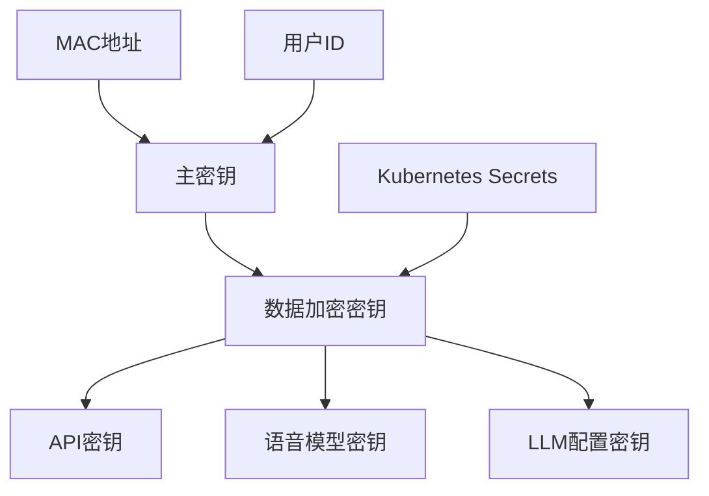
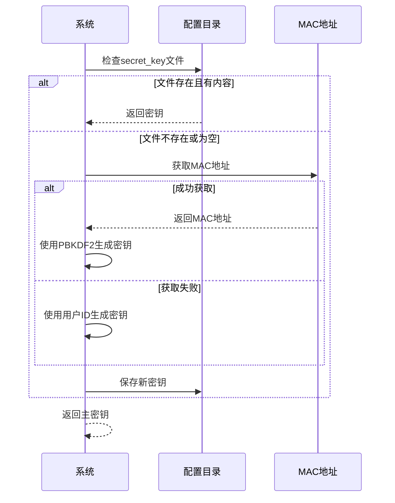
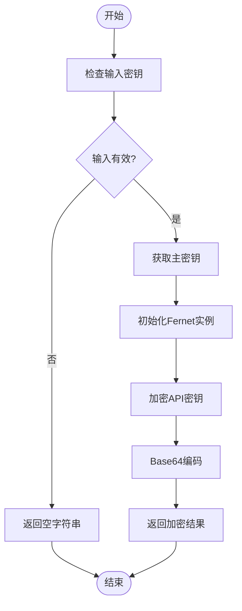
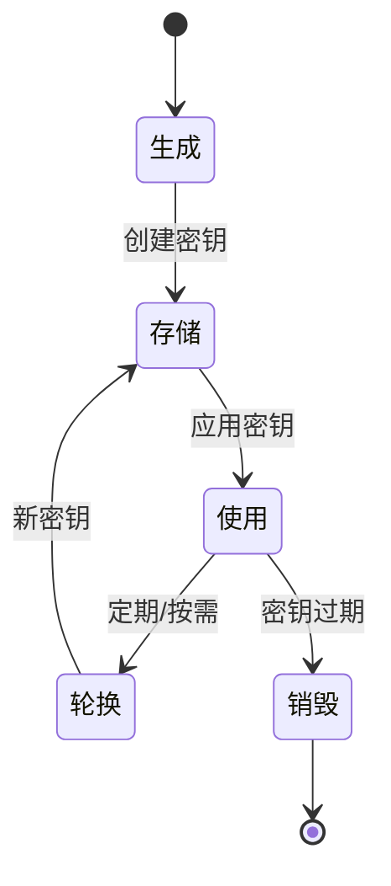
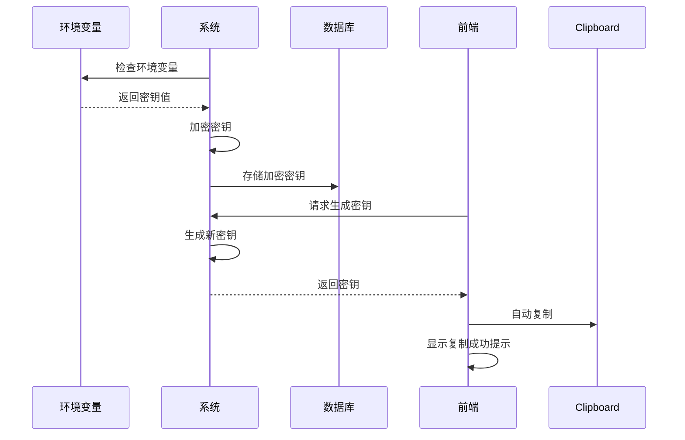
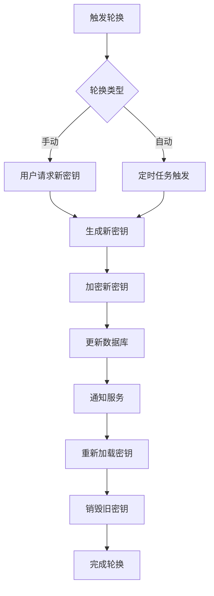
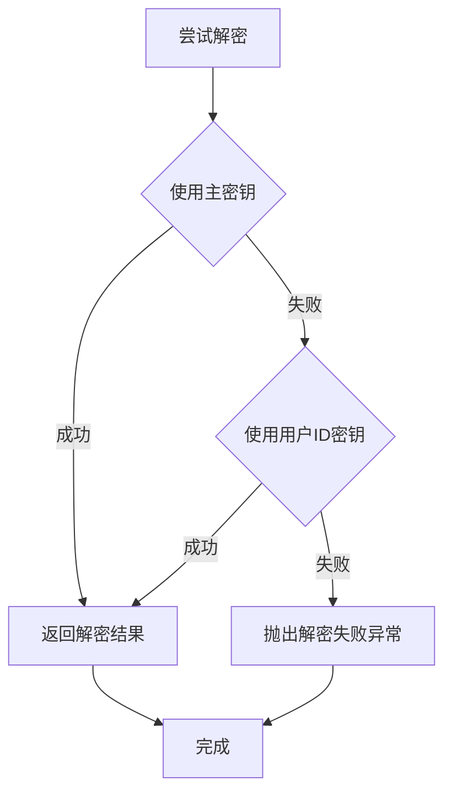
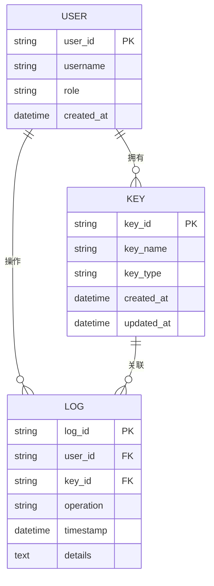
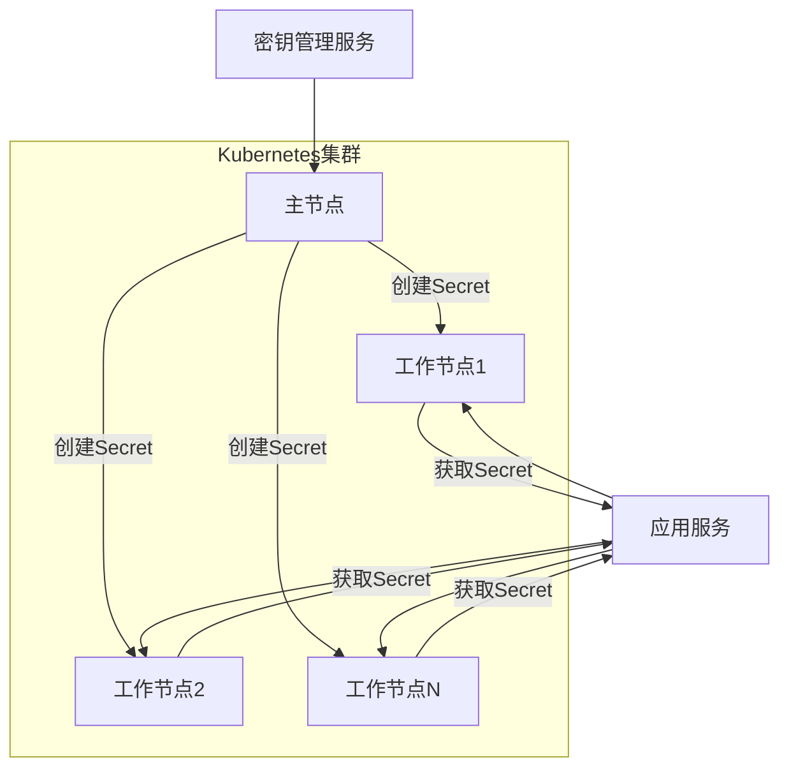
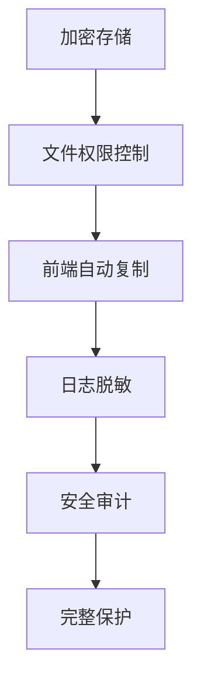

# 密钥管理

<cite>
**本文档引用的文件**   
- [encryption.py](file://vibe_surf/backend/utils/encryption.py)
- [auth.py](file://vibe_surf/langflow/services/settings/auth.py)
- [utils.py](file://vibe_surf/langflow/services/settings/utils.py)
- [kubernetes.py](file://vibe_surf/langflow/services/variable/kubernetes.py)
- [auth_utils.py](file://vibe_surf/langflow/services/auth/utils.py)
- [mcp_encryption.py](file://vibe_surf/langflow/services/auth/mcp_encryption.py)
- [models.py](file://vibe_surf/backend/database/models.py)
- [queries.py](file://vibe_surf/backend/database/queries.py)
- [secretKeyModal](file://vibe_surf/frontend/src/modals/secretKeyModal/index.tsx)
- [.env.example](file://.env.example)
</cite>

## 目录
1. [引言](#引言)
2. [密钥分层结构](#密钥分层结构)
3. [主密钥管理](#主密钥管理)
4. [数据加密密钥管理](#数据加密密钥管理)
5. [密钥生命周期管理](#密钥生命周期管理)
6. [环境变量中的密钥加载机制](#环境变量中的密钥加载机制)
7. [密钥轮换操作](#密钥轮换操作)
8. [密钥版本控制与向后兼容性](#密钥版本控制与向后兼容性)
9. [密钥访问控制与审计](#密钥访问控制与审计)
10. [分布式环境中的密钥同步](#分布式环境中的密钥同步)
11. [安全保护措施](#安全保护措施)

## 引言

VibeSurf平台实施了全面的密钥管理策略，以确保敏感信息的安全性。该策略涵盖了从密钥生成、存储、轮换到销毁的完整生命周期管理。系统采用分层密钥结构，包括主密钥和数据加密密钥，通过机器特定的加密机制保护API密钥等敏感数据。密钥管理不仅涉及加密算法的实现，还包括环境变量的处理、访问控制策略以及审计日志记录等多个方面。本文档详细阐述了VibeSurf的密钥管理架构和具体实现，为开发者和安全人员提供全面的参考。

**Section sources**
- [encryption.py](file://vibe_surf/backend/utils/encryption.py#L1-L172)
- [auth.py](file://vibe_surf/langflow/services/settings/auth.py#L1-L134)

## 密钥分层结构

VibeSurf采用分层的密钥管理体系，主要包括主密钥（Master Key）和数据加密密钥（Data Encryption Key）两个层级。主密钥用于保护数据加密密钥，而数据加密密钥则直接用于加密敏感数据如API密钥。这种分层结构提供了额外的安全层，即使数据加密密钥被泄露，攻击者仍需要获取主密钥才能解密数据。

主密钥基于机器的MAC地址或用户ID生成，确保了密钥的机器特定性。数据加密密钥则通过Fernet对称加密算法实现，使用主密钥进行保护。系统还支持在Kubernetes环境中存储密钥，通过Secrets机制提供额外的安全保障。

**Diagram sources **
- [encryption.py](file://vibe_surf/backend/utils/encryption.py#L23-L40)
- [kubernetes.py](file://vibe_surf/langflow/services/variable/kubernetes.py#L26-L31)

**Section sources**
- [encryption.py](file://vibe_surf/backend/utils/encryption.py#L23-L75)
- [kubernetes.py](file://vibe_surf/langflow/services/variable/kubernetes.py#L26-L31)

## 主密钥管理

主密钥是VibeSurf密钥管理体系的核心，负责保护所有数据加密密钥。系统通过`get_encryption_key`函数生成主密钥，该函数优先使用机器的MAC地址作为基础，若无法获取则回退到用户ID。主密钥的生成使用PBKDF2-HMAC-SHA256算法，配合固定的盐值`vibesurf_warmshao_2025`和100,000次迭代，确保了密钥的强度。

主密钥存储在配置目录下的`secret_key`文件中，系统在启动时会检查该文件是否存在。如果文件不存在或内容为空，系统会生成一个32字节的随机密钥并保存。为确保文件安全，系统会设置适当的文件权限：在Unix/Linux/Mac系统上设置为600模式，在Windows系统上通过ACL限制访问权限。

**Diagram sources **
- [auth.py](file://vibe_surf/langflow/services/settings/auth.py#L112-L133)
- [utils.py](file://vibe_surf/langflow/services/settings/utils.py#L7-L27)

**Section sources**
- [auth.py](file://vibe_surf/langflow/services/settings/auth.py#L112-L133)
- [utils.py](file://vibe_surf/langflow/services/settings/utils.py#L7-L27)

## 数据加密密钥管理

数据加密密钥用于直接加密敏感数据，如API密钥、语音模型密钥等。VibeSurf使用Fernet对称加密算法实现数据加密，该算法基于AES-128-CBC模式，提供认证加密功能。数据加密密钥本身受到主密钥的保护，形成双重安全机制。

系统通过`encrypt_api_key`和`decrypt_api_key`函数实现数据的加密和解密操作。加密过程首先获取主密钥，然后使用该密钥初始化Fernet实例，对API密钥进行加密，并将结果编码为URL安全的Base64字符串。解密过程则相反，先解码Base64字符串，然后使用Fernet实例进行解密。

**Diagram sources **
- [encryption.py](file://vibe_surf/backend/utils/encryption.py#L76-L94)
- [encryption.py](file://vibe_surf/backend/utils/encryption.py#L98-L116)

**Section sources**
- [encryption.py](file://vibe_surf/backend/utils/encryption.py#L76-L126)

## 密钥生命周期管理

VibeSurf实现了完整的密钥生命周期管理，涵盖生成、存储、轮换和销毁四个阶段。密钥生成阶段，系统使用密码学安全的随机数生成器创建密钥；存储阶段，密钥被加密后保存在安全位置；轮换阶段，系统支持定期或按需更换密钥；销毁阶段，旧密钥被安全地从系统中移除。

密钥的存储主要通过数据库和文件系统两种方式实现。在数据库中，API密钥等敏感数据以加密形式存储在`encrypted_api_key`字段中。在文件系统中，主密钥保存在配置目录的`secret_key`文件中，并设置了严格的访问权限。

**Diagram sources **
- [queries.py](file://vibe_surf/backend/database/queries.py#L1367-L1405)
- [models.py](file://vibe_surf/backend/database/models.py#L40-L70)

**Section sources**
- [queries.py](file://vibe_surf/backend/database/queries.py#L1367-L1405)
- [models.py](file://vibe_surf/backend/database/models.py#L40-L70)

## 环境变量中的密钥加载机制

VibeSurf支持从环境变量中加载密钥，提供了灵活的配置方式。系统通过`variables_to_get_from_environment`设置项定义需要从环境变量获取的密钥名称列表。当系统初始化时，会检查这些环境变量是否存在，如果存在则将其值作为密钥使用。

为了防止密钥泄露，系统不会直接在日志或界面中显示完整的密钥值。前端通过`secretKeyModal`组件提供密钥管理界面，允许用户生成和查看密钥，但会自动复制到剪贴板而非直接显示。后端在处理包含密钥的命令时，会使用`_obfuscate_command_secrets`方法将密钥替换为`***REDACTED***`，确保日志安全。

**Diagram sources **
- [kubernetes.py](file://vibe_surf/langflow/services/variable/kubernetes.py#L37-L47)
- [secretKeyModal](file://vibe_surf/frontend/src/modals/secretKeyModal/index.tsx#L76-L81)

**Section sources**
- [kubernetes.py](file://vibe_surf/langflow/services/variable/kubernetes.py#L37-L47)
- [secretKeyModal](file://vibe_surf/frontend/src/modals/secretKeyModal/index.tsx#L76-L81)

## 密钥轮换操作

密钥轮换是VibeSurf安全策略的重要组成部分，系统支持手动和自动两种轮换方式。手动轮换通过前端界面触发，用户可以生成新的API密钥并立即生效。自动轮换则基于配置的策略定期执行，确保密钥的时效性。

密钥轮换的具体步骤包括：生成新密钥、更新数据库中的加密密钥、通知相关服务重新加载密钥、以及安全地销毁旧密钥。系统在轮换过程中保持向后兼容性，允许新旧密钥在一段时间内共存，确保服务的连续性。

**Diagram sources **
- [mcp_encryption.py](file://vibe_surf/langflow/services/auth/mcp_encryption.py#L18-L55)
- [mcp_encryption.py](file://vibe_surf/langflow/services/auth/mcp_encryption.py#L58-L97)

**Section sources**
- [mcp_encryption.py](file://vibe_surf/langflow/services/auth/mcp_encryption.py#L18-L97)

## 密钥版本控制与向后兼容性

VibeSurf实现了密钥版本控制机制，确保在密钥轮换过程中系统的稳定运行。系统通过`is_encrypted`函数检测密钥是否已加密，从而判断密钥的版本。对于未加密的旧密钥，系统会自动进行加密处理，实现平滑升级。

向后兼容性通过双重解密机制实现：系统首先尝试使用当前主密钥解密，如果失败则尝试使用用户ID生成的密钥进行解密。这种机制确保了在机器更换或重装系统后，仍能访问之前加密的数据。

**Diagram sources **
- [encryption.py](file://vibe_surf/backend/utils/encryption.py#L111-L124)
- [auth_utils.py](file://vibe_surf/langflow/services/auth/utils.py#L494-L504)

**Section sources**
- [encryption.py](file://vibe_surf/backend/utils/encryption.py#L111-L124)
- [auth_utils.py](file://vibe_surf/langflow/services/auth/utils.py#L494-L504)

## 密钥访问控制与审计

VibeSurf实施严格的密钥访问控制策略，确保只有授权用户和服务才能访问密钥。系统通过角色基础的访问控制（RBAC）机制，定义不同用户角色的密钥访问权限。超级用户可以管理所有密钥，普通用户只能访问自己创建的密钥。

审计日志记录了所有密钥相关的操作，包括创建、读取、更新和删除。这些日志包含操作时间、操作者、操作类型和目标密钥等信息，为安全审计和问题排查提供依据。系统还支持将审计日志发送到集中式日志管理系统，便于统一监控和分析。

**Diagram sources **
- [kubernetes.py](file://vibe_surf/langflow/services/variable/kubernetes.py#L82-L91)
- [kubernetes.py](file://vibe_surf/langflow/services/variable/kubernetes.py#L145-L172)

**Section sources**
- [kubernetes.py](file://vibe_surf/langflow/services/variable/kubernetes.py#L82-L91)
- [kubernetes.py](file://vibe_surf/langflow/services/variable/kubernetes.py#L145-L172)

## 分布式环境中的密钥同步

在分布式环境中，VibeSurf通过Kubernetes Secrets机制实现密钥的同步和管理。每个用户的密钥存储在独立的Secret中，通过用户ID进行编码命名。当服务在不同节点上运行时，可以通过Kubernetes API获取相应的Secret，确保密钥的一致性。

系统还支持环境变量同步，将指定的环境变量自动同步到数据库或Kubernetes Secrets中。这种机制确保了配置的一致性，避免了因环境变量缺失导致的服务故障。

**Diagram sources **
- [kubernetes.py](file://vibe_surf/langflow/services/variable/kubernetes.py#L48-L54)
- [kubernetes.py](file://vibe_surf/langflow/services/variable/kubernetes.py#L162-L164)

**Section sources**
- [kubernetes.py](file://vibe_surf/langflow/services/variable/kubernetes.py#L48-L54)
- [kubernetes.py](file://vibe_surf/langflow/services/variable/kubernetes.py#L162-L164)

## 安全保护措施

VibeSurf实施了多层次的安全保护措施，防止密钥泄露。首先，所有敏感数据在存储前都经过加密处理，即使数据库被泄露，攻击者也无法直接获取明文密钥。其次，系统设置了严格的文件权限，确保密钥文件只能被授权用户访问。

前端界面通过自动复制机制避免密钥在屏幕上长时间显示，减少被截屏或偷窥的风险。日志系统对包含密钥的信息进行脱敏处理，防止密钥意外记录到日志文件中。此外，系统还支持定期的安全审计，检查密钥管理策略的执行情况。

**Diagram sources **
- [utils.py](file://vibe_surf/langflow/services/settings/utils.py#L7-L27)
- [mcp_encryption.py](file://vibe_surf/langflow/services/auth/mcp_encryption.py#L244-L253)

**Section sources**
- [utils.py](file://vibe_surf/langflow/services/settings/utils.py#L7-L27)
- [mcp_encryption.py](file://vibe_surf/langflow/services/auth/mcp_encryption.py#L244-L253)