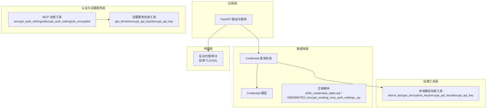
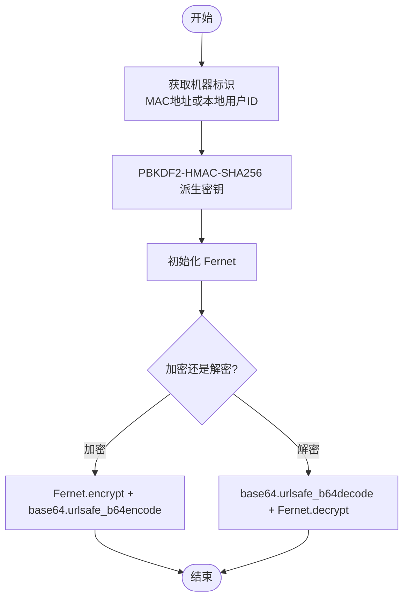
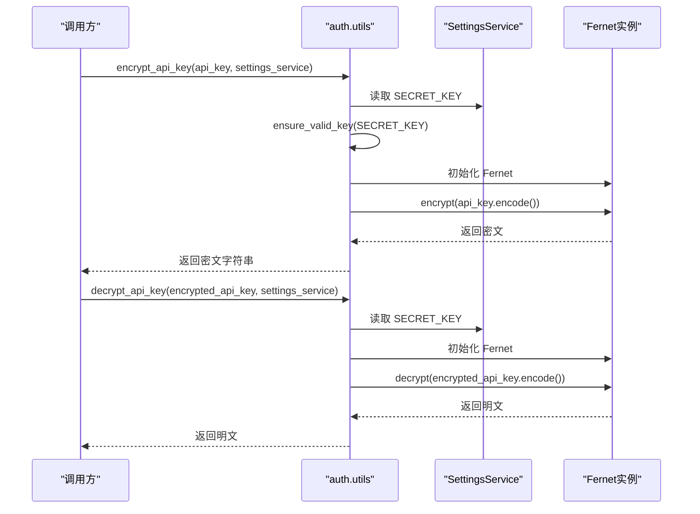
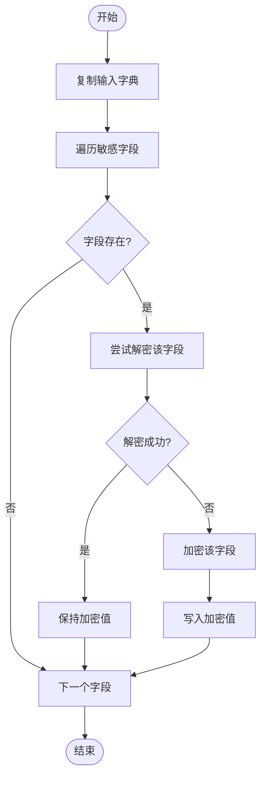
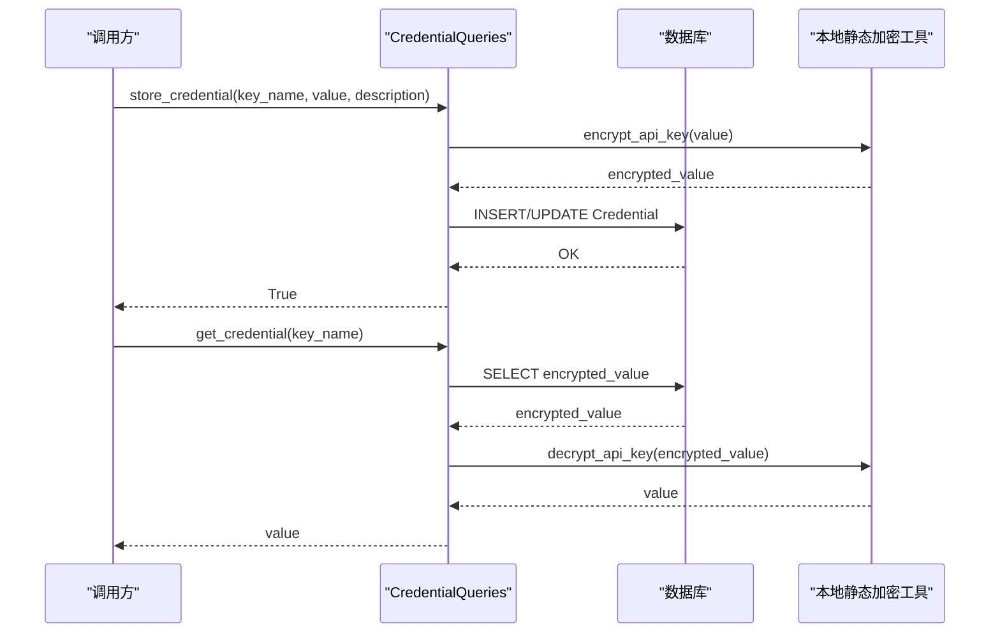
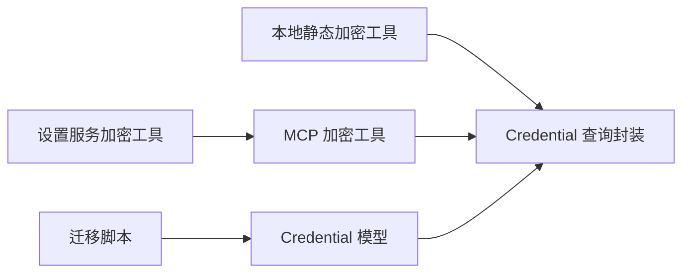

# 数据加密

<cite>
**本文引用的文件列表**
- [vibe_surf/backend/utils/encryption.py](file://vibe_surf/backend/utils/encryption.py)
- [vibe_surf/backend/database/queries.py](file://vibe_surf/backend/database/queries.py)
- [vibe_surf/backend/database/models.py](file://vibe_surf/backend/database/models.py)
- [vibe_surf/backend/database/migrations/v006_add_credentials_table.sql](file://vibe_surf/backend/database/migrations/v006_add_credentials_table.sql)
- [vibe_surf/langflow/services/auth/utils.py](file://vibe_surf/langflow/services/auth/utils.py)
- [vibe_surf/langflow/services/auth/mcp_encryption.py](file://vibe_surf/langflow/services/auth/mcp_encryption.py)
- [vibe_surf/langflow/alembic/versions/0882f9657f22_encrypt_existing_mcp_auth_settings_.py](file://vibe_surf/langflow/alembic/versions/0882f9657f22_encrypt_existing_mcp_auth_settings_.py)
- [vibe_surf/backend/main.py](file://vibe_surf/backend/main.py)
</cite>

## 目录
1. [简介](#简介)
2. [项目结构与职责划分](#项目结构与职责划分)
3. [核心组件](#核心组件)
4. [架构总览](#架构总览)
5. [详细组件分析](#详细组件分析)
6. [依赖关系分析](#依赖关系分析)
7. [性能与查询影响](#性能与查询影响)
8. [故障排查指南](#故障排查指南)
9. [结论](#结论)
10. [附录：最佳实践与密钥轮换](#附录：最佳实践与密钥轮换)

## 简介
本文件系统性梳理 VibeSurf 的数据加密机制，覆盖静态数据加密（本地存储）、传输中数据加密（TLS/SSL 配置建议）、敏感字段处理流程（凭证、API 密钥、用户数据），并说明与数据库 ORM 的集成方式及性能影响与优化策略。同时提供调用路径指引与密钥轮换、安全管理的最佳实践。

## 项目结构与职责划分
- 后端工具层：提供基于机器标识或本地用户标识派生的对称加密能力，用于本地静态数据加密与解密。
- 认证与设置服务层：提供基于 SettingsService 的 Fernet 对称加密能力，用于 MCP/OAuth 等场景的敏感字段存储与读取。
- 数据库层：定义 Credential 模型与迁移脚本，负责敏感字段的持久化与索引；查询层封装加密/解密逻辑。
- 迁移与兼容：提供 Alembic 迁移脚本，对既有数据进行加密升级与降级回滚。
- 应用入口：FastAPI 应用未直接内置 TLS 配置，建议通过反向代理或外部网关启用 TLS。

章节来源
- file://vibe_surf/backend/utils/encryption.py#L1-L172
- file://vibe_surf/langflow/services/auth/utils.py#L433-L505
- file://vibe_surf/langflow/services/auth/mcp_encryption.py#L1-L120
- file://vibe_surf/backend/database/models.py#L217-L235
- file://vibe_surf/backend/database/migrations/v006_add_credentials_table.sql#L1-L26
- file://vibe_surf/langflow/alembic/versions/0882f9657f22_encrypt_existing_mcp_auth_settings_.py#L25-L110
- file://vibe_surf/backend/main.py#L543-L794

## 核心组件
- 本地静态加密工具（后端工具层）
  - 基于机器 MAC 地址或本地用户 ID 派生密钥，使用 Fernet 实现对称加解密。
  - 提供加密、解密、是否已加密检测等接口。
- 设置服务加密工具（认证与设置服务层）
  - 基于 SettingsService 中的 SECRET_KEY，构造 Fernet 密钥，实现对称加解密。
  - 提供 MCP/OAuth 敏感字段的自动加密/解密与兼容判断。
- 数据库模型与查询
  - Credential 表用于存储键名与加密后的值，并提供增删改查与按名称检索。
  - 查询层在入库前加密、出库时解密，保证透明的 ORM 使用体验。
- 迁移与兼容
  - Alembic 迁移脚本对既有 auth_settings 字段进行加密升级与降级回滚。
- 应用入口与传输安全
  - FastAPI 应用未内置 TLS 配置，建议通过反向代理启用 TLS/SSL。

章节来源
- file://vibe_surf/backend/utils/encryption.py#L23-L126
- file://vibe_surf/langflow/services/auth/utils.py#L466-L505
- file://vibe_surf/langflow/services/auth/mcp_encryption.py#L1-L98
- file://vibe_surf/backend/database/models.py#L217-L235
- file://vibe_surf/backend/database/queries.py#L1345-L1405
- file://vibe_surf/langflow/alembic/versions/0882f9657f22_encrypt_existing_mcp_auth_settings_.py#L25-L110
- file://vibe_surf/backend/main.py#L543-L794

## 架构总览
下图展示了“静态数据加密”与“传输中加密”的整体交互关系与数据流。

图表来源
- [vibe_surf/backend/utils/encryption.py](file://vibe_surf/backend/utils/encryption.py#L23-L126)
- [vibe_surf/langflow/services/auth/utils.py](file://vibe_surf/langflow/services/auth/utils.py#L466-L505)
- [vibe_surf/langflow/services/auth/mcp_encryption.py](file://vibe_surf/langflow/services/auth/mcp_encryption.py#L1-L98)
- [vibe_surf/backend/database/models.py](file://vibe_surf/backend/database/models.py#L217-L235)
- [vibe_surf/backend/database/queries.py](file://vibe_surf/backend/database/queries.py#L1345-L1405)
- [vibe_surf/backend/database/migrations/v006_add_credentials_table.sql](file://vibe_surf/backend/database/migrations/v006_add_credentials_table.sql#L1-L26)
- [vibe_surf/langflow/alembic/versions/0882f9657f22_encrypt_existing_mcp_auth_settings_.py](file://vibe_surf/langflow/alembic/versions/0882f9657f22_encrypt_existing_mcp_auth_settings_.py#L25-L110)
- [vibe_surf/backend/main.py](file://vibe_surf/backend/main.py#L543-L794)

## 详细组件分析

### 组件A：本地静态加密工具（后端工具层）
- 算法与密钥派生
  - 使用 PBKDF2-HMAC-SHA256 从机器标识（MAC 地址或本地用户 ID）派生密钥，固定盐值与迭代次数。
  - 采用 Fernet 对称加密，支持 base64 安全 URL 编码。
- 关键函数
  - derive_key：从机器标识派生密钥。
  - get_encryption_key：优先使用 MAC 地址，失败则回退到本地用户 ID。
  - encrypt_api_key/decrypt_api_key：对 API 密钥进行加解密。
  - is_encrypted：快速判断字符串是否为加密格式。
- 性能与复杂度
  - KDF 迭代次数较高，确保安全性但会带来 CPU 开销；适合本地静态数据保护。
- 错误处理
  - 失败时记录日志并抛出异常，便于上层捕获与提示。

图表来源
- [vibe_surf/backend/utils/encryption.py](file://vibe_surf/backend/utils/encryption.py#L23-L126)

章节来源
- file://vibe_surf/backend/utils/encryption.py#L23-L126

### 组件B：设置服务加密工具（认证与设置服务层）
- 算法与密钥来源
  - 从 SettingsService.auth_settings.SECRET_KEY 获取密钥，必要时进行填充以满足 Fernet 长度要求。
  - 使用 Fernet 实现对称加解密。
- 关键函数
  - get_fernet：生成 Fernet 实例。
  - encrypt_api_key/decrypt_api_key：对 API 密钥进行加解密。
- 兼容性
  - 支持字符串编码与原始字节两种输入形式的解密尝试，提升兼容性。

图表来源
- [vibe_surf/langflow/services/auth/utils.py](file://vibe_surf/langflow/services/auth/utils.py#L466-L505)

章节来源
- file://vibe_surf/langflow/services/auth/utils.py#L466-L505

### 组件C：MCP/OAuth 敏感字段加密工具
- 目标字段
  - oauth_client_secret、api_key 等敏感字段。
- 功能
  - encrypt_auth_settings：对字典中的敏感字段进行加密（若尚未加密）。
  - decrypt_auth_settings：对字典中的敏感字段进行解密（若加密）。
  - is_encrypted：判断字符串是否为加密格式。
- 兼容性
  - 若解密失败且值以特定前缀开头，则视为加密但配置错误；否则视为明文。

图表来源
- [vibe_surf/langflow/services/auth/mcp_encryption.py](file://vibe_surf/langflow/services/auth/mcp_encryption.py#L1-L98)

章节来源
- file://vibe_surf/langflow/services/auth/mcp_encryption.py#L1-L98

### 组件D：数据库模型与查询（Credential）
- 模型设计
  - key_name 唯一索引，encrypted_value 存储加密后的敏感值。
- 查询封装
  - get_credential：按 key_name 查询并解密返回。
  - store_credential：入库前加密，支持更新与新增。
  - delete_credential/list_credential_names：删除与枚举。
- 迁移脚本
  - v006：创建 credentials 表与索引。
  - 0882f9657f22：对既有 auth_settings 进行加密升级与降级回滚。

图表来源
- [vibe_surf/backend/database/queries.py](file://vibe_surf/backend/database/queries.py#L1345-L1405)
- [vibe_surf/backend/database/models.py](file://vibe_surf/backend/database/models.py#L217-L235)
- [vibe_surf/backend/utils/encryption.py](file://vibe_surf/backend/utils/encryption.py#L76-L126)

章节来源
- file://vibe_surf/backend/database/models.py#L217-L235
- file://vibe_surf/backend/database/queries.py#L1345-L1405
- file://vibe_surf/backend/database/migrations/v006_add_credentials_table.sql#L1-L26
- file://vibe_surf/langflow/alembic/versions/0882f9657f22_encrypt_existing_mcp_auth_settings_.py#L25-L110

### 组件E：传输中数据加密（TLS/SSL）
- 当前状态
  - FastAPI 应用未内置 TLS 配置；建议通过反向代理（Nginx、Traefik）或云网关启用 HTTPS/TLS。
- 建议
  - 在反向代理层启用 TLS 1.2+/TLS 1.3，配置强密码套件与证书链校验。
  - 对内网访问可使用自签证书，对外暴露需使用受信 CA 签发证书。
  - 配置 HSTS、OCSP Stapling 等增强安全与性能。

章节来源
- file://vibe_surf/backend/main.py#L543-L794

## 依赖关系分析
- 后端工具层依赖 cryptography.Fernet 与 PBKDF2，密钥来源为机器标识。
- 认证与设置服务层依赖 SettingsService，密钥来源为 SECRET_KEY。
- 数据库层依赖 SQLAlchemy ORM 与 Alembic 迁移。
- 查询层在入库/出库时分别调用本地静态加密工具完成加解密。

图表来源
- [vibe_surf/backend/utils/encryption.py](file://vibe_surf/backend/utils/encryption.py#L23-L126)
- [vibe_surf/langflow/services/auth/utils.py](file://vibe_surf/langflow/services/auth/utils.py#L466-L505)
- [vibe_surf/langflow/services/auth/mcp_encryption.py](file://vibe_surf/langflow/services/auth/mcp_encryption.py#L1-L98)
- [vibe_surf/backend/database/models.py](file://vibe_surf/backend/database/models.py#L217-L235)
- [vibe_surf/backend/database/queries.py](file://vibe_surf/backend/database/queries.py#L1345-L1405)
- [vibe_surf/backend/database/migrations/v006_add_credentials_table.sql](file://vibe_surf/backend/database/migrations/v006_add_credentials_table.sql#L1-L26)
- [vibe_surf/langflow/alembic/versions/0882f9657f22_encrypt_existing_mcp_auth_settings_.py](file://vibe_surf/langflow/alembic/versions/0882f9657f22_encrypt_existing_mcp_auth_settings_.py#L25-L110)

章节来源
- file://vibe_surf/backend/utils/encryption.py#L23-L126
- file://vibe_surf/langflow/services/auth/utils.py#L466-L505
- file://vibe_surf/langflow/services/auth/mcp_encryption.py#L1-L98
- file://vibe_surf/backend/database/models.py#L217-L235
- file://vibe_surf/backend/database/queries.py#L1345-L1405
- file://vibe_surf/backend/database/migrations/v006_add_credentials_table.sql#L1-L26
- file://vibe_surf/langflow/alembic/versions/0882f9657f22_encrypt_existing_mcp_auth_settings_.py#L25-L110

## 性能与查询影响
- 加密开销
  - 本地静态加密使用 PBKDF2-HMAC-SHA256，迭代次数较高，适合本地静态数据保护；频繁加解密会增加 CPU 开销。
- 数据库性能
  - Credential 表包含 key_name 唯一索引，查询按名称检索具备良好性能。
  - 加密/解密发生在应用层，对 SQL 查询无直接影响；但会增加应用层 CPU 占用。
- 优化建议
  - 尽量批量处理敏感字段，减少重复加解密。
  - 对高频读取的敏感字段，可在进程内存中缓存解密后的明文（注意生命周期与安全边界）。
  - 控制加密字段数量，避免在热路径中频繁加解密。

章节来源
- file://vibe_surf/backend/database/models.py#L217-L235
- file://vibe_surf/backend/database/queries.py#L1345-L1405
- file://vibe_surf/backend/utils/encryption.py#L23-L126

## 故障排查指南
- 解密失败
  - 检查密钥来源是否一致（机器标识 vs 本地用户 ID）；本地静态加密工具在首次解密失败时会尝试回退到本地用户 ID。
  - 认证与设置服务层的解密失败通常意味着 SECRET_KEY 不正确或被修改。
- 加密/解密异常
  - 查看日志输出，确认输入参数非空且格式正确。
  - 对于 MCP/OAuth 场景，若值以特定前缀开头但仍无法解密，检查 SettingsService 的 SECRET_KEY 配置。
- 数据库操作失败
  - 确认 credentials 表已创建且索引存在；检查迁移脚本执行情况。

章节来源
- file://vibe_surf/backend/utils/encryption.py#L98-L126
- file://vibe_surf/langflow/services/auth/mcp_encryption.py#L58-L98
- file://vibe_surf/backend/database/migrations/v006_add_credentials_table.sql#L1-L26

## 结论
VibeSurf 的数据加密机制采用“本地静态加密 + 设置服务加密”的双通道策略：
- 本地静态加密用于本地敏感数据保护，基于机器标识派生密钥，适合本地存储与跨会话一致性。
- 设置服务加密用于 MCP/OAuth 等场景，基于 SECRET_KEY，便于集中管理与轮换。
- 数据库层通过 ORM 与迁移脚本实现透明的加密存储与读取。
- 传输中加密建议通过反向代理启用 TLS/SSL，确保网络传输安全。

## 附录：最佳实践与密钥轮换

- 最佳实践
  - 本地静态加密
    - 仅在本地使用，不跨设备共享；避免将加密密钥与应用部署在同一主机。
    - 对高频加解密场景进行缓存与批处理。
  - 设置服务加密
    - SECRET_KEY 必须妥善保管，定期轮换；轮换后需重新加密既有数据。
    - 限制密钥长度与字符集，确保满足 Fernet 长度要求。
  - 数据库安全
    - 严格控制 credentials 表访问权限；备份时对备份介质进行加密。
    - 对外暴露的 API 不应返回明文敏感字段。
  - 传输安全
    - 通过反向代理启用 TLS/SSL；配置强密码套件与证书链校验。
    - 启用 HSTS、OCSP Stapling 等安全增强措施。

- 密钥轮换流程（建议）
  - 生成新 SECRET_KEY 并更新 SettingsService。
  - 执行迁移脚本对既有 auth_settings 进行重新加密（升级）。
  - 验证所有敏感字段解密正常后，清理旧密钥材料。
  - 回滚时执行降级脚本，恢复为明文或旧密钥可解密的状态。

章节来源
- file://vibe_surf/langflow/services/auth/utils.py#L466-L505
- file://vibe_surf/langflow/alembic/versions/0882f9657f22_encrypt_existing_mcp_auth_settings_.py#L25-L110