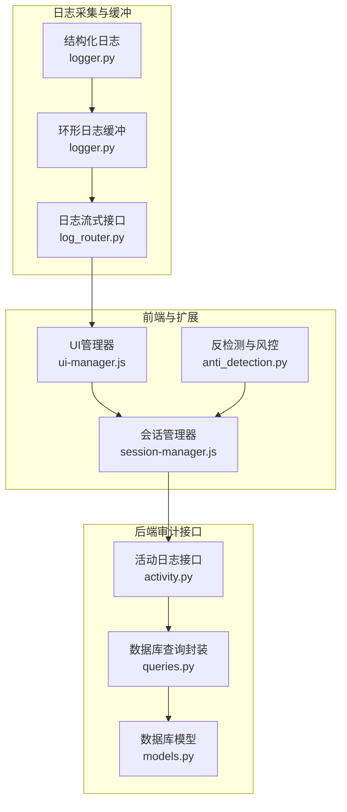
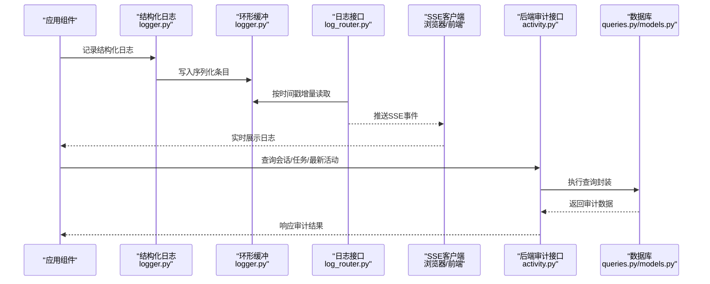
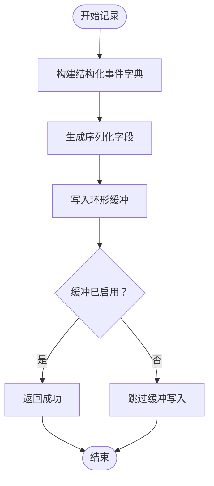
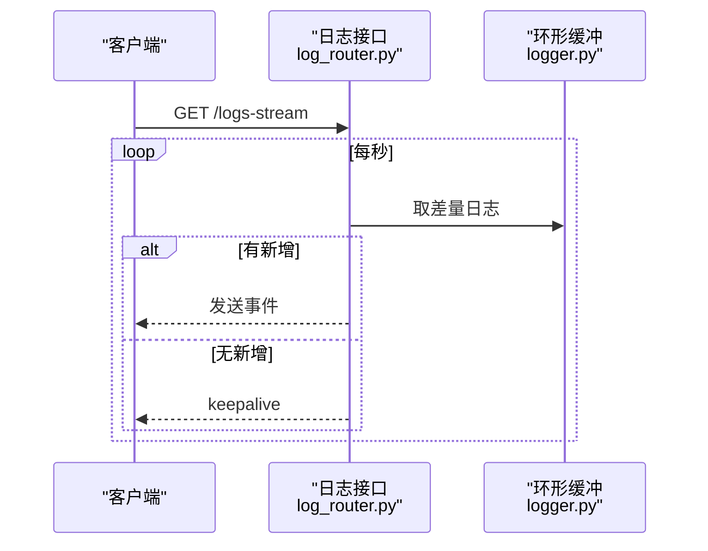
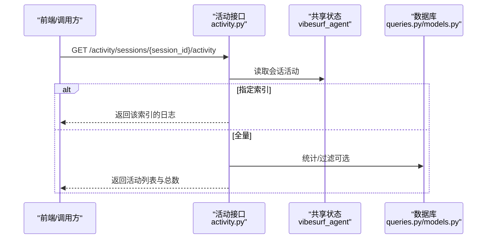
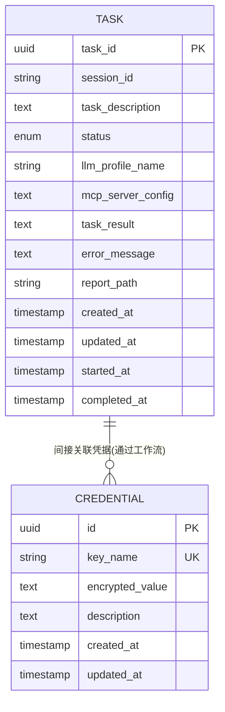
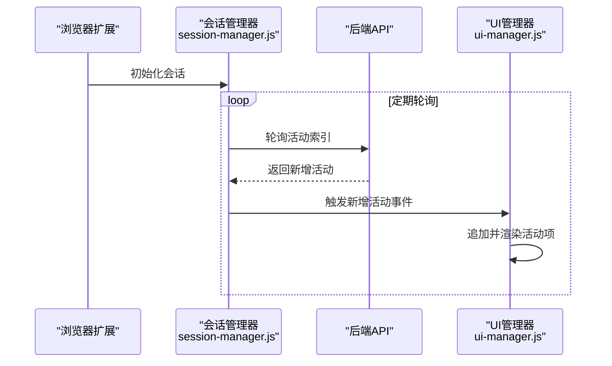
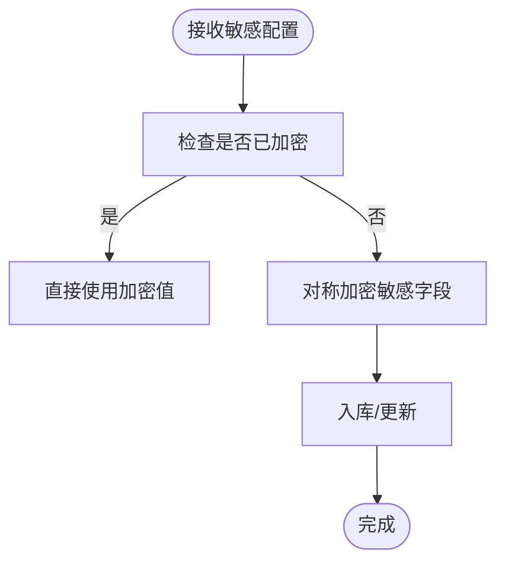
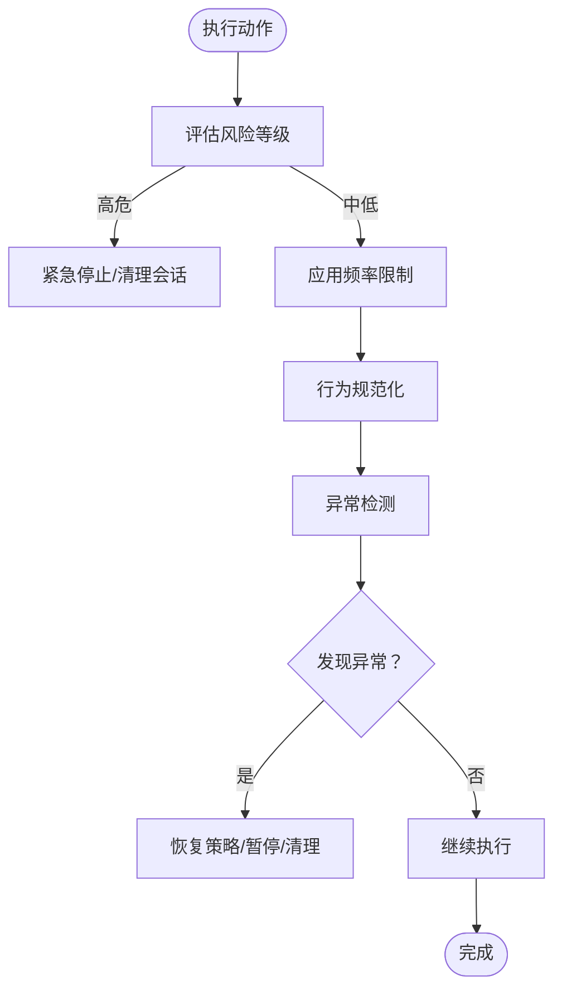
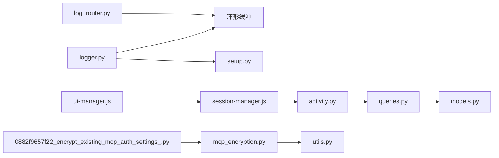

# 审计日志

<cite>
**本文引用的文件**
- [logger.py](file://vibe_surf/langflow/logging/logger.py)
- [log_router.py](file://vibe_surf/langflow/api/log_router.py)
- [setup.py](file://vibe_surf/langflow/logging/setup.py)
- [service.py](file://vibe_surf/telemetry/service.py)
- [activity.py](file://vibe_surf/backend/api/activity.py)
- [queries.py](file://vibe_surf/backend/database/queries.py)
- [models.py](file://vibe_surf/backend/database/models.py)
- [mcp_encryption.py](file://vibe_surf/langflow/services/auth/mcp_encryption.py)
- [utils.py](file://vibe_surf/langflow/services/auth/utils.py)
- [session-manager.js](file://vibe_surf/chrome_extension/scripts/session-manager.js)
- [ui-manager.js](file://vibe_surf/chrome_extension/scripts/ui-manager.js)
- [anti_detection.py](file://vibe_surf/workflows/Recruitment/boss_zhipin/anti_detection.py)
- [0882f9657f22_encrypt_existing_mcp_auth_settings_.py](file://vibe_surf/langflow/alembic/versions/0882f9657f22_encrypt_existing_mcp_auth_settings_.py)
- [2ac71eb9c3ae_adds_credential_table.py](file://vibe_surf/langflow/alembic/versions/2ac71eb9c3ae_adds_credential_table.py)
- [fd531f8868b1_fix_credential_table.py](file://vibe_surf/langflow/alembic/versions/fd531f8868b1_fix_credential_table.py)
</cite>

## 目录
1. [引言](#引言)
2. [项目结构](#项目结构)
3. [核心组件](#核心组件)
4. [架构总览](#架构总览)
5. [详细组件分析](#详细组件分析)
6. [依赖关系分析](#依赖关系分析)
7. [性能考量](#性能考量)
8. [故障排查指南](#故障排查指南)
9. [结论](#结论)
10. [附录](#附录)

## 引言
本文件面向VibeSurf审计日志系统的开发与运维，系统性阐述安全审计日志的架构与实现，覆盖日志采集、格式与存储策略；关键操作（用户登录、权限变更、敏感数据访问）的审计跟踪机制；日志收集、分析与监控（含实时告警与异常行为检测）的实现细节；以及审计日志的查询接口与可视化方法，并给出满足合规性的配置选项与性能优化建议。文档同时兼顾非技术读者的理解需求，通过图示与分层说明帮助快速掌握系统能力。

## 项目结构
VibeSurf的审计日志体系由三层构成：
- 日志采集与缓冲：基于结构化日志框架与内存环形缓冲，支持流式与批量检索。
- 后端审计接口：提供活动日志、任务历史、会话活动等审计视图。
- 前端可视化与扩展：浏览器扩展与前端界面展示实时活动与日志。

图表来源
- [logger.py](file://vibe_surf/langflow/logging/logger.py#L1-L200)
- [log_router.py](file://vibe_surf/langflow/api/log_router.py#L1-L104)
- [activity.py](file://vibe_surf/backend/api/activity.py#L1-L246)
- [queries.py](file://vibe_surf/backend/database/queries.py#L1-L200)
- [models.py](file://vibe_surf/backend/database/models.py#L1-L120)
- [ui-manager.js](file://vibe_surf/chrome_extension/scripts/ui-manager.js#L1612-L1815)
- [session-manager.js](file://vibe_surf/chrome_extension/scripts/session-manager.js#L1-L200)
- [anti_detection.py](file://vibe_surf/workflows/Recruitment/boss_zhipin/anti_detection.py#L122-L383)

章节来源
- [logger.py](file://vibe_surf/langflow/logging/logger.py#L1-L200)
- [log_router.py](file://vibe_surf/langflow/api/log_router.py#L1-L104)
- [activity.py](file://vibe_surf/backend/api/activity.py#L1-L246)
- [queries.py](file://vibe_surf/backend/database/queries.py#L1-L200)
- [models.py](file://vibe_surf/backend/database/models.py#L1-L120)
- [ui-manager.js](file://vibe_surf/chrome_extension/scripts/ui-manager.js#L1612-L1815)
- [session-manager.js](file://vibe_surf/chrome_extension/scripts/session-manager.js#L1-L200)
- [anti_detection.py](file://vibe_surf/workflows/Recruitment/boss_zhipin/anti_detection.py#L122-L383)

## 核心组件
- 结构化日志与缓冲：采用结构化日志库，统一输出格式并写入环形缓冲，支持按时间戳增量拉取与SSE流式推送。
- 日志检索与流式接口：提供REST接口与SSE端点，支持按时间窗口与前后偏移量获取日志。
- 审计接口：后端提供会话活动、任务历史、最新活动等审计视图，便于合规与问题定位。
- 数据库模型与查询：围绕任务、会话、凭证等实体建立索引与查询封装，支撑审计数据持久化与统计。
- 前端与扩展：浏览器扩展负责会话生命周期与活动轮询，前端UI负责展示与交互。
- 安全与合规：敏感字段加密存储（API密钥、OAuth密钥），迁移脚本自动加密存量数据；提供审计级日志开关与生产环境脱敏。

章节来源
- [logger.py](file://vibe_surf/langflow/logging/logger.py#L1-L200)
- [log_router.py](file://vibe_surf/langflow/api/log_router.py#L1-L104)
- [activity.py](file://vibe_surf/backend/api/activity.py#L1-L246)
- [queries.py](file://vibe_surf/backend/database/queries.py#L1-L200)
- [models.py](file://vibe_surf/backend/database/models.py#L1-L120)
- [mcp_encryption.py](file://vibe_surf/langflow/services/auth/mcp_encryption.py#L1-L121)
- [utils.py](file://vibe_surf/langflow/services/auth/utils.py#L472-L506)

## 架构总览
下图展示从日志产生到前端可视化的完整链路，以及审计接口与数据库的关系。

图表来源
- [logger.py](file://vibe_surf/langflow/logging/logger.py#L150-L220)
- [log_router.py](file://vibe_surf/langflow/api/log_router.py#L1-L104)
- [activity.py](file://vibe_surf/backend/api/activity.py#L1-L246)
- [queries.py](file://vibe_surf/backend/database/queries.py#L440-L760)
- [models.py](file://vibe_surf/backend/database/models.py#L90-L170)

## 详细组件分析

### 日志采集与缓冲（结构化日志）
- 结构化输出：在开发与生产环境下分别输出不同格式，生产环境移除异常详情，避免敏感信息泄露。
- 环形缓冲：维护固定容量的双端队列，写入时丢弃最早条目，保证内存占用可控；并发读写通过锁与信号量控制。
- 缓冲启用：通过环境变量控制缓冲大小与启用状态，支持运行时调整。
- 文件落盘：可选文件输出与轮转，便于离线归档与分析。

图表来源
- [logger.py](file://vibe_surf/langflow/logging/logger.py#L150-L220)

章节来源
- [logger.py](file://vibe_surf/langflow/logging/logger.py#L1-L200)
- [setup.py](file://vibe_surf/langflow/logging/setup.py#L1-L17)

### 日志检索与流式接口（SSE）
- SSE端点：长连接推送，未有新消息时发送心跳，降低空闲开销。
- REST端点：支持按时间戳前/后窗口获取日志，或获取最后N条。
- 并发控制：读取侧使用信号量限制并发消费者，避免阻塞写入。

图表来源
- [log_router.py](file://vibe_surf/langflow/api/log_router.py#L1-L104)
- [logger.py](file://vibe_surf/langflow/logging/logger.py#L1-L120)

章节来源
- [log_router.py](file://vibe_surf/langflow/api/log_router.py#L1-L104)

### 审计接口（活动日志与任务历史）
- 会话活动：按会话ID获取活动日志，支持指定索引与限制数量。
- 任务历史：获取最近任务、某会话的任务列表、单任务详情。
- 最新活动：返回最新VibeSurf日志与最新任务摘要。
- 数据一致性：通过查询封装与数据库模型索引，保障查询性能与稳定性。

图表来源
- [activity.py](file://vibe_surf/backend/api/activity.py#L150-L246)
- [queries.py](file://vibe_surf/backend/database/queries.py#L440-L760)
- [models.py](file://vibe_surf/backend/database/models.py#L90-L170)

章节来源
- [activity.py](file://vibe_surf/backend/api/activity.py#L1-L246)

### 数据库模型与查询（审计数据持久化）
- 模型设计：围绕任务、会话、凭证等实体建立主键、索引与时间戳字段，便于审计追踪与统计。
- 查询封装：提供任务创建/更新、会话聚合、任务按状态统计等常用查询，屏蔽SQL细节。
- 凭证表：独立的凭证表用于存储加密后的敏感值，配合迁移脚本完成存量数据加密。

图表来源
- [models.py](file://vibe_surf/backend/database/models.py#L90-L170)
- [2ac71eb9c3ae_adds_credential_table.py](file://vibe_surf/langflow/alembic/versions/2ac71eb9c3ae_adds_credential_table.py#L1-L55)
- [fd531f8868b1_fix_credential_table.py](file://vibe_surf/langflow/alembic/versions/fd531f8868b1_fix_credential_table.py#L1-L40)

章节来源
- [models.py](file://vibe_surf/backend/database/models.py#L1-L289)
- [queries.py](file://vibe_surf/backend/database/queries.py#L1-L200)
- [2ac71eb9c3ae_adds_credential_table.py](file://vibe_surf/langflow/alembic/versions/2ac71eb9c3ae_adds_credential_table.py#L1-L55)
- [fd531f8868b1_fix_credential_table.py](file://vibe_surf/langflow/alembic/versions/fd531f8868b1_fix_credential_table.py#L1-L40)

### 前端与扩展（活动展示与会话管理）
- 会话管理器：负责会话生命周期、活动轮询、与服务端同步，维护本地活动日志并触发UI事件。
- UI管理器：渲染活动日志列表，过滤“完成”状态消息，展示时间戳、令牌消耗等元信息。
- 浏览器扩展：与后端API协作，提供活动流式展示与会话数据持久化。

图表来源
- [session-manager.js](file://vibe_surf/chrome_extension/scripts/session-manager.js#L453-L590)
- [ui-manager.js](file://vibe_surf/chrome_extension/scripts/ui-manager.js#L1612-L1815)

章节来源
- [session-manager.js](file://vibe_surf/chrome_extension/scripts/session-manager.js#L1-L200)
- [ui-manager.js](file://vibe_surf/chrome_extension/scripts/ui-manager.js#L1612-L1815)

### 安全与合规（敏感数据与加密）
- 敏感字段加密：API密钥、OAuth密钥等敏感字段在入库前进行对称加密，解密仅在必要时进行。
- 存量数据迁移：通过Alembic迁移脚本扫描并加密历史数据，降级时可逆向解密。
- 认证与授权：提供JWT与API Key两种认证方式，支持WebSocket认证，严格校验令牌有效性与用户状态。
- 生产脱敏：生产环境默认移除异常详情，避免敏感信息泄露。

图表来源
- [mcp_encryption.py](file://vibe_surf/langflow/services/auth/mcp_encryption.py#L1-L121)
- [utils.py](file://vibe_surf/langflow/services/auth/utils.py#L472-L506)
- [0882f9657f22_encrypt_existing_mcp_auth_settings_.py](file://vibe_surf/langflow/alembic/versions/0882f9657f22_encrypt_existing_mcp_auth_settings_.py#L25-L110)

章节来源
- [mcp_encryption.py](file://vibe_surf/langflow/services/auth/mcp_encryption.py#L1-L121)
- [utils.py](file://vibe_surf/langflow/services/auth/utils.py#L472-L506)
- [0882f9657f22_encrypt_existing_mcp_auth_settings_.py](file://vibe_surf/langflow/alembic/versions/0882f9657f22_encrypt_existing_mcp_auth_settings_.py#L25-L110)

### 异常行为检测与风控（审计辅助）
- 行为风控：在执行外部动作前评估风险等级，实施频率限制、行为规范化、异常检测与恢复策略。
- 风险事件：记录CAPTCHA触发、限流、高失败率等风险事件，支持统计与可视化。
- 会话指纹与成功率：统计24小时操作次数与成功率，辅助风险评估。

图表来源
- [anti_detection.py](file://vibe_surf/workflows/Recruitment/boss_zhipin/anti_detection.py#L122-L383)
- [anti_detection.py](file://vibe_surf/workflows/Recruitment/boss_zhipin/anti_detection.py#L317-L383)

章节来源
- [anti_detection.py](file://vibe_surf/workflows/Recruitment/boss_zhipin/anti_detection.py#L122-L383)

## 依赖关系分析
- 日志子系统内部依赖：结构化日志处理器依赖缓冲模块；日志接口依赖缓冲模块；缓冲模块依赖锁与信号量以保证并发安全。
- 审计接口依赖：活动接口依赖共享状态中的代理对象与数据库查询封装；查询封装依赖数据库模型与索引。
- 前端依赖：会话管理器依赖API客户端；UI管理器依赖DOM与事件系统。
- 安全依赖：加密工具依赖设置服务提供的密钥；迁移脚本依赖加密工具与数据库元信息。

图表来源
- [logger.py](file://vibe_surf/langflow/logging/logger.py#L1-L200)
- [log_router.py](file://vibe_surf/langflow/api/log_router.py#L1-L104)
- [setup.py](file://vibe_surf/langflow/logging/setup.py#L1-L17)
- [activity.py](file://vibe_surf/backend/api/activity.py#L1-L246)
- [queries.py](file://vibe_surf/backend/database/queries.py#L1-L200)
- [models.py](file://vibe_surf/backend/database/models.py#L1-L120)
- [session-manager.js](file://vibe_surf/chrome_extension/scripts/session-manager.js#L1-L200)
- [ui-manager.js](file://vibe_surf/chrome_extension/scripts/ui-manager.js#L1612-L1815)
- [mcp_encryption.py](file://vibe_surf/langflow/services/auth/mcp_encryption.py#L1-L121)
- [utils.py](file://vibe_surf/langflow/services/auth/utils.py#L472-L506)
- [0882f9657f22_encrypt_existing_mcp_auth_settings_.py](file://vibe_surf/langflow/alembic/versions/0882f9657f22_encrypt_existing_mcp_auth_settings_.py#L25-L110)

章节来源
- [logger.py](file://vibe_surf/langflow/logging/logger.py#L1-L200)
- [log_router.py](file://vibe_surf/langflow/api/log_router.py#L1-L104)
- [activity.py](file://vibe_surf/backend/api/activity.py#L1-L246)
- [queries.py](file://vibe_surf/backend/database/queries.py#L1-L200)
- [models.py](file://vibe_surf/backend/database/models.py#L1-L120)
- [session-manager.js](file://vibe_surf/chrome_extension/scripts/session-manager.js#L1-L200)
- [ui-manager.js](file://vibe_surf/chrome_extension/scripts/ui-manager.js#L1612-L1815)
- [mcp_encryption.py](file://vibe_surf/langflow/services/auth/mcp_encryption.py#L1-L121)
- [utils.py](file://vibe_surf/langflow/services/auth/utils.py#L472-L506)
- [0882f9657f22_encrypt_existing_mcp_auth_settings_.py](file://vibe_surf/langflow/alembic/versions/0882f9657f22_encrypt_existing_mcp_auth_settings_.py#L25-L110)

## 性能考量
- 日志缓冲容量：通过环境变量动态控制缓冲大小，避免内存膨胀；默认容量可在运行时调整。
- 并发读写：写入侧使用互斥锁，读取侧使用信号量限制并发消费者，减少竞争与阻塞。
- SSE心跳：空闲时发送keepalive，降低无效连接成本。
- 数据库索引：针对高频查询字段建立索引，提升审计查询性能。
- 加密成本：加密/解密发生在必要路径（如读取敏感配置时），避免对常规日志路径造成额外开销。
- 前端轮询：轮询间隔与增量同步策略降低网络与渲染压力。

章节来源
- [logger.py](file://vibe_surf/langflow/logging/logger.py#L1-L120)
- [log_router.py](file://vibe_surf/langflow/api/log_router.py#L1-L104)
- [queries.py](file://vibe_surf/backend/database/queries.py#L1-L200)
- [models.py](file://vibe_surf/backend/database/models.py#L150-L200)

## 故障排查指南
- 日志不可用：确认日志缓冲启用状态与环境变量；检查SSE端点是否被禁用。
- 查询异常：核对请求参数（时间戳、前后窗口、限制数量）；查看后端异常日志与HTTP状态码。
- 权限问题：确认认证方式（JWT或API Key）有效；检查令牌有效期与用户状态。
- 加密异常：若解密失败，检查密钥配置与迁移脚本执行情况；必要时回滚至降级流程。
- 前端不显示：检查会话管理器轮询逻辑与UI事件绑定；确认浏览器扩展与后端API连通性。

章节来源
- [log_router.py](file://vibe_surf/langflow/api/log_router.py#L1-L104)
- [activity.py](file://vibe_surf/backend/api/activity.py#L1-L246)
- [utils.py](file://vibe_surf/langflow/services/auth/utils.py#L143-L220)
- [mcp_encryption.py](file://vibe_surf/langflow/services/auth/mcp_encryption.py#L58-L98)
- [0882f9657f22_encrypt_existing_mcp_auth_settings_.py](file://vibe_surf/langflow/alembic/versions/0882f9657f22_encrypt_existing_mcp_auth_settings_.py#L75-L110)
- [session-manager.js](file://vibe_surf/chrome_extension/scripts/session-manager.js#L453-L590)
- [ui-manager.js](file://vibe_surf/chrome_extension/scripts/ui-manager.js#L1612-L1815)

## 结论
VibeSurf的审计日志体系以结构化日志为核心，结合环形缓冲与SSE流式接口，实现了高效、可扩展的日志采集与实时展示；后端审计接口与数据库模型为合规审计提供了坚实的数据基础；前端与扩展组件确保了用户体验与可观测性。通过敏感数据加密、生产脱敏与风控策略，系统在满足安全合规的同时，兼顾性能与可用性。建议在生产环境中合理配置缓冲大小、索引与轮转策略，并持续监控异常行为与日志质量，以保障审计系统的长期稳定运行。

## 附录
- 关键接口与路径
  - 日志流式接口：GET /logs-stream
  - 日志检索接口：GET /logs
  - 活动日志接口：GET /activity/sessions/{session_id}/activity
  - 最新活动接口：GET /activity/sessions/{session_id}/latest_activity
  - 任务历史接口：GET /activity/tasks, GET /activity/sessions, GET /activity/sessions/{session_id}/tasks, GET /activity/{task_id}
- 环境变量与配置要点
  - 日志级别：LANGFLOW_LOG_LEVEL
  - 日志格式：LANGFLOW_LOG_FORMAT
  - 日志文件：LANGFLOW_LOG_FILE
  - 日志缓冲大小：LANGFLOW_LOG_RETRIEVER_BUFFER_SIZE
  - 日志美化：LANGFLOW_PRETTY_LOGS
  - 匿名遥测：VIBESURF_ANONYMIZED_TELEMETRY
  - 调试模式：VIBESURF_DEBUG
- 合规与安全建议
  - 定期审查日志保留策略与轮转配置
  - 对敏感字段进行最小化暴露与加密存储
  - 使用只读账号访问审计数据，限制导出权限
  - 建立异常行为检测规则与告警阈值