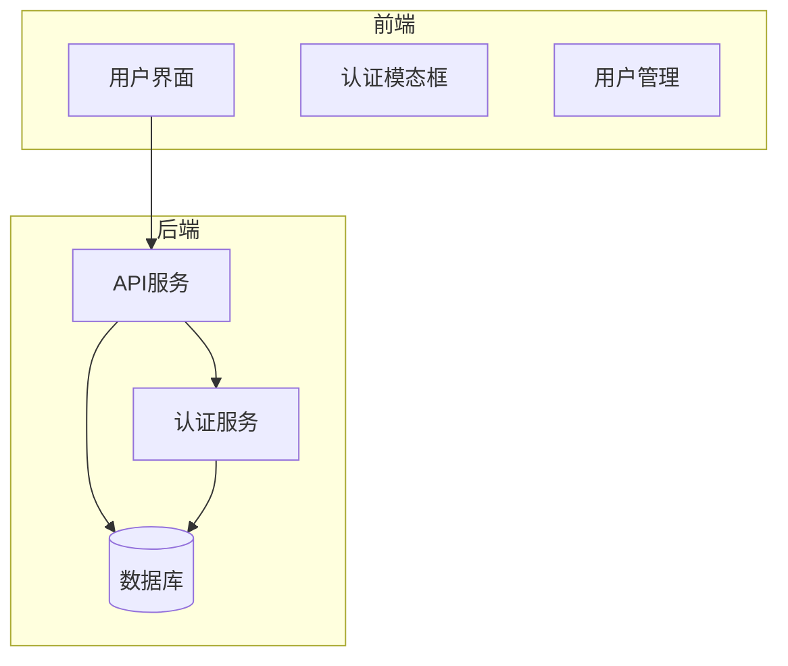
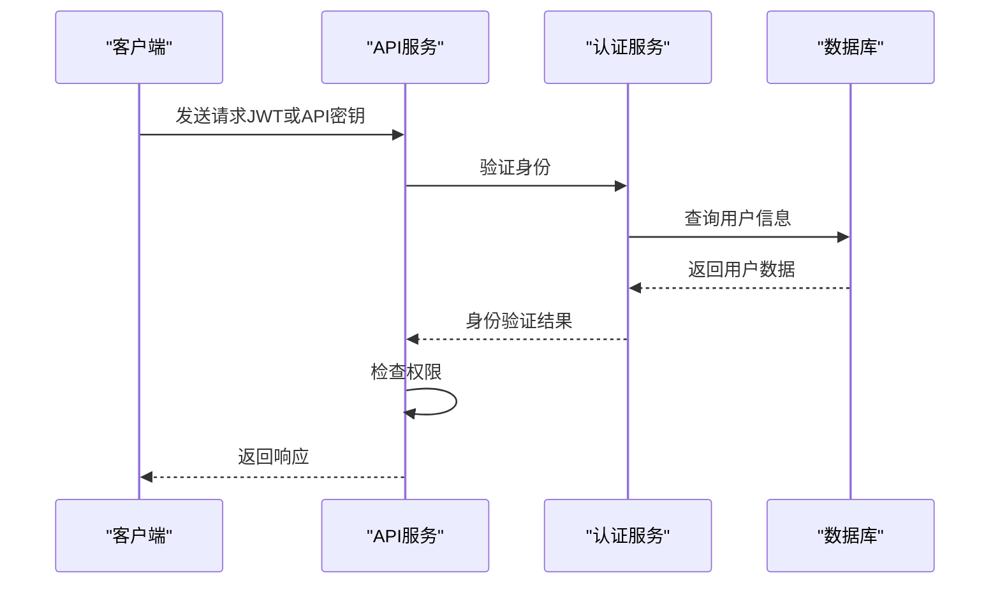
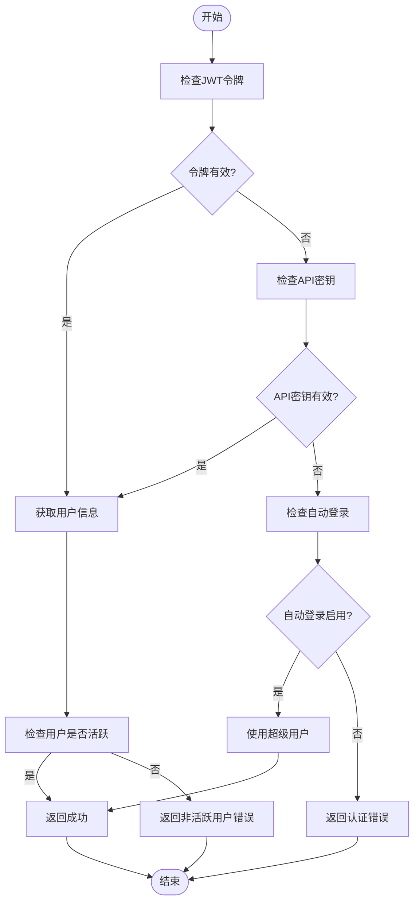
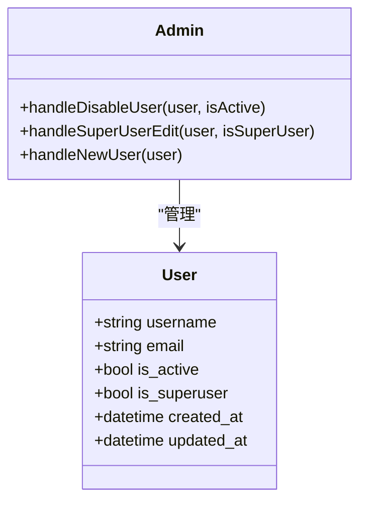
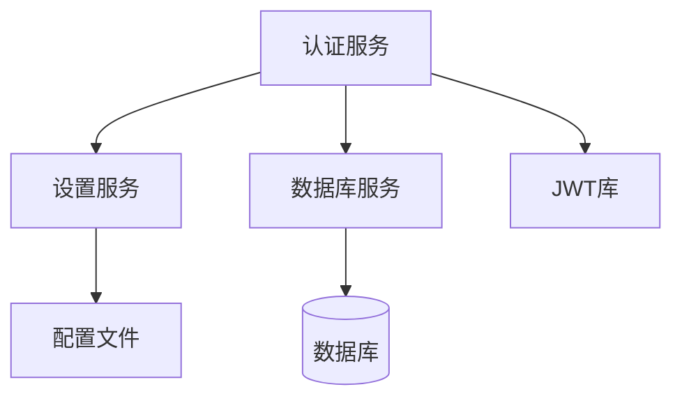

# 权限管理

<cite>
**本文档中引用的文件**  
- [auth_helpers.py](file://vibe_surf/langflow/api/v1/auth_helpers.py)
- [authModal.tsx](file://vibe_surf/frontend/src/modals/authModal/index.tsx)
- [vibe_surf_prompt.py](file://vibe_surf/agents/prompts/vibe_surf_prompt.py)
- [factory.py](file://vibe_surf/langflow/services/auth/factory.py)
- [utils.py](file://vibe_surf/langflow/services/auth/utils.py)
- [AdminPage.tsx](file://vibe_surf/frontend/src/pages/AdminPage/index.tsx)
- [userManagementModal.tsx](file://vibe_surf/frontend/src/modals/userManagementModal/index.tsx)
- [models.py](file://vibe_surf/backend/database/models.py)
- [schemas.py](file://vibe_surf/backend/database/schemas.py)
- [service.py](file://vibe_surf/langflow/services/auth/service.py)
- [manager.py](file://vibe_surf/backend/database/manager.py)
- [models.py](file://vibe_surf/langflow/services/database/models/flow/model.py)
- [model.py](file://vibe_surf/langflow/services/database/models/api_key/model.py)
</cite>

## 目录
1. [简介](#简介)
2. [项目结构](#项目结构)
3. [核心组件](#核心组件)
4. [架构概述](#架构概述)
5. [详细组件分析](#详细组件分析)
6. [依赖分析](#依赖分析)
7. [性能考虑](#性能考虑)
8. [故障排除指南](#故障排除指南)
9. [结论](#结论)
10. [附录](#附录)（如有必要）

## 简介
本文档详细描述了VibeSurf权限管理系统的实现，重点介绍基于角色的访问控制（RBAC）架构。系统实现了角色定义、权限分配和继承关系，以及资源级别的权限控制机制。文档涵盖了API端点和数据库操作中的权限检查实施，权限策略的配置方法，包括默认权限设置和自定义权限规则。此外，还提供了管理用户权限的API接口说明，以及处理权限冲突和边界情况的策略。

## 项目结构
VibeSurf权限管理系统采用分层架构，主要组件包括前端界面、后端API、数据库模型和认证服务。系统通过JWT令牌和API密钥实现身份验证，支持OAuth 2.0认证流程。权限管理功能分布在多个模块中，包括用户管理、角色分配和资源访问控制。

**图表来源**
- [authModal.tsx](file://vibe_surf/frontend/src/modals/authModal/index.tsx#L22-L346)
- [utils.py](file://vibe_surf/langflow/services/auth/utils.py#L85-L583)

**章节来源**
- [authModal.tsx](file://vibe_surf/frontend/src/modals/authModal/index.tsx#L1-L346)
- [utils.py](file://vibe_surf/langflow/services/auth/utils.py#L1-L583)

## 核心组件
权限管理系统的核心组件包括用户认证、角色管理和权限检查。系统通过JWT令牌实现用户身份验证，支持API密钥和OAuth 2.0认证方式。角色管理功能允许管理员分配和修改用户权限，包括超级用户权限和活动状态。

**章节来源**
- [utils.py](file://vibe_surf/langflow/services/auth/utils.py#L143-L583)
- [AdminPage.tsx](file://vibe_surf/frontend/src/pages/AdminPage/index.tsx#L190-L247)

## 架构概述
VibeSurf权限管理系统采用基于JWT的认证架构，结合API密钥和OAuth 2.0支持。系统实现了多层权限控制，包括用户级别、角色级别和资源级别。认证服务负责验证用户身份，生成访问令牌，并管理会话状态。

**图表来源**
- [utils.py](file://vibe_surf/langflow/services/auth/utils.py#L143-L583)
- [service.py](file://vibe_surf/langflow/services/auth/service.py#L1-L16)

## 详细组件分析
### 用户认证分析
用户认证组件负责处理各种认证方式，包括JWT令牌、API密钥和OAuth 2.0。系统支持自动登录功能，当配置了超级用户凭据时，可以在没有提供API密钥的情况下使用超级用户身份进行认证。

#### 认证流程

**图表来源**
- [utils.py](file://vibe_surf/langflow/services/auth/utils.py#L143-L583)
- [authModal.tsx](file://vibe_surf/frontend/src/modals/authModal/index.tsx#L22-L346)

**章节来源**
- [utils.py](file://vibe_surf/langflow/services/auth/utils.py#L1-L583)
- [authModal.tsx](file://vibe_surf/frontend/src/modals/authModal/index.tsx#L1-L346)

### 角色管理分析
角色管理组件允许管理员管理用户权限，包括设置超级用户权限和激活/停用用户账户。系统通过布尔字段`is_superuser`和`is_active`来控制用户权限级别。

#### 用户权限管理

**图表来源**
- [AdminPage.tsx](file://vibe_surf/frontend/src/pages/AdminPage/index.tsx#L147-L421)
- [userManagementModal.tsx](file://vibe_surf/frontend/src/modals/userManagementModal/index.tsx#L1-L37)

**章节来源**
- [AdminPage.tsx](file://vibe_surf/frontend/src/pages/AdminPage/index.tsx#L1-L421)
- [userManagementModal.tsx](file://vibe_surf/frontend/src/modals/userManagementModal/index.tsx#L1-L37)

## 依赖分析
权限管理系统依赖于多个核心组件，包括数据库服务、设置服务和JWT库。认证服务依赖于设置服务来获取认证配置，如秘密密钥和过期时间。数据库服务用于存储和检索用户信息及API密钥。

**图表来源**
- [service.py](file://vibe_surf/langflow/services/auth/service.py#L1-L16)
- [utils.py](file://vibe_surf/langflow/services/auth/utils.py#L370-L393)

**章节来源**
- [service.py](file://vibe_surf/langflow/services/auth/service.py#L1-L16)
- [utils.py](file://vibe_surf/langflow/services/auth/utils.py#L1-L583)

## 性能考虑
权限管理系统在设计时考虑了性能优化。JWT令牌验证是无状态的，减少了数据库查询的需要。API密钥缓存可以提高重复请求的处理速度。对于高并发场景，建议使用Redis等内存数据库来缓存认证信息。

## 故障排除指南
### 常见认证问题
- **令牌过期**：返回401错误，提示"Token has expired"。解决方案是刷新令牌或重新登录。
- **无效API密钥**：返回403错误，提示"Invalid or missing API key"。检查API密钥是否正确。
- **用户非活跃**：返回401错误，提示"Inactive user"。管理员需要激活用户账户。

**章节来源**
- [utils.py](file://vibe_surf/langflow/services/auth/utils.py#L189-L194)
- [vibe_surf_prompt.py](file://vibe_surf/agents/prompts/vibe_surf_prompt.py#L139-L143)

## 结论
VibeSurf权限管理系统实现了完整的基于角色的访问控制架构，支持多种认证方式和细粒度的权限管理。系统设计考虑了安全性和性能，提供了灵活的配置选项。通过JWT令牌和API密钥的结合使用，系统能够在保证安全性的同时提供良好的用户体验。