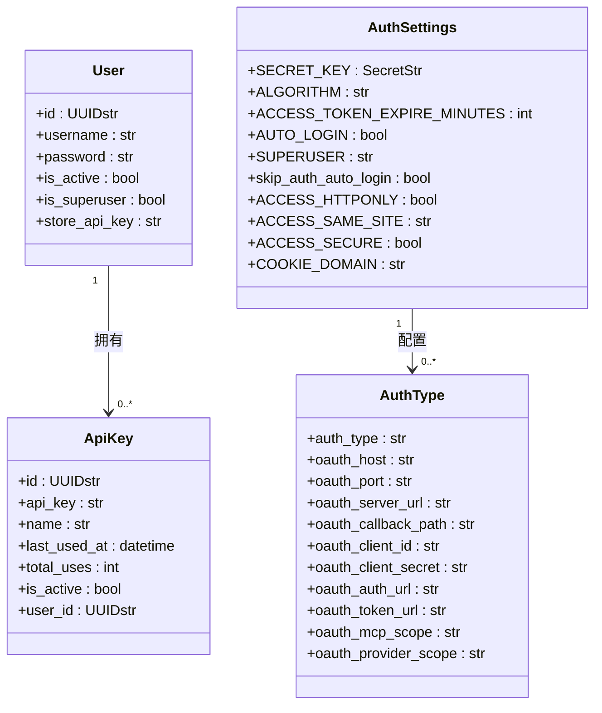
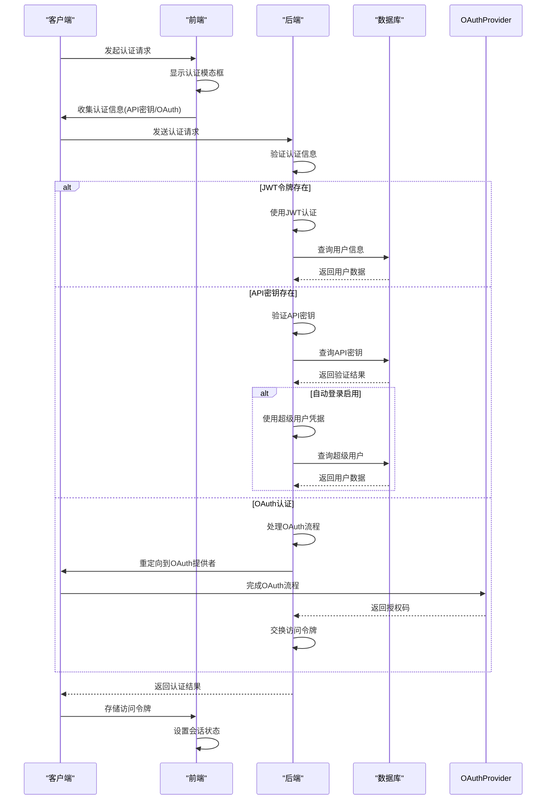
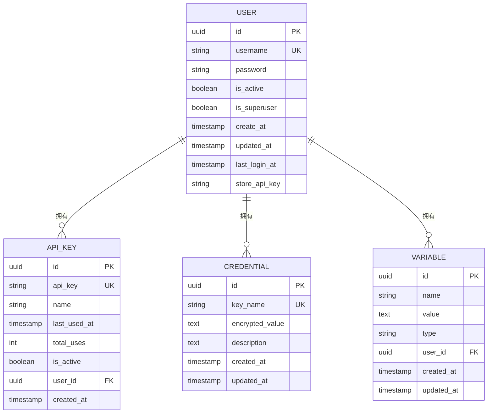
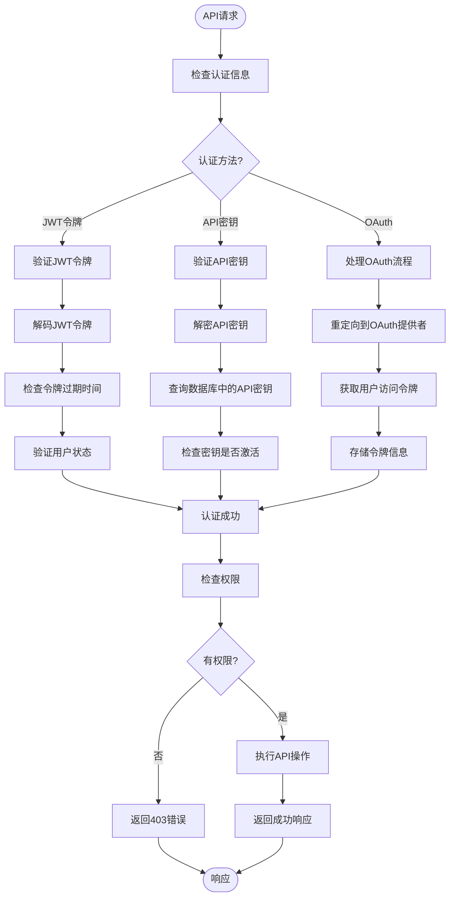
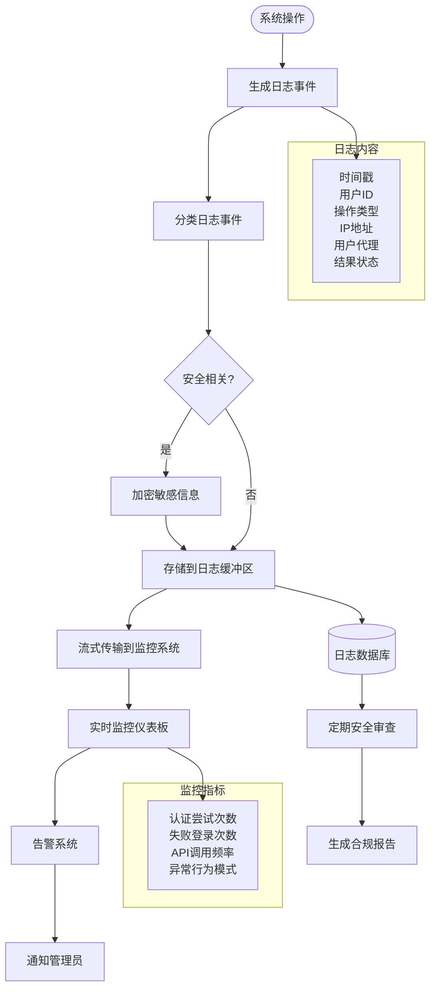
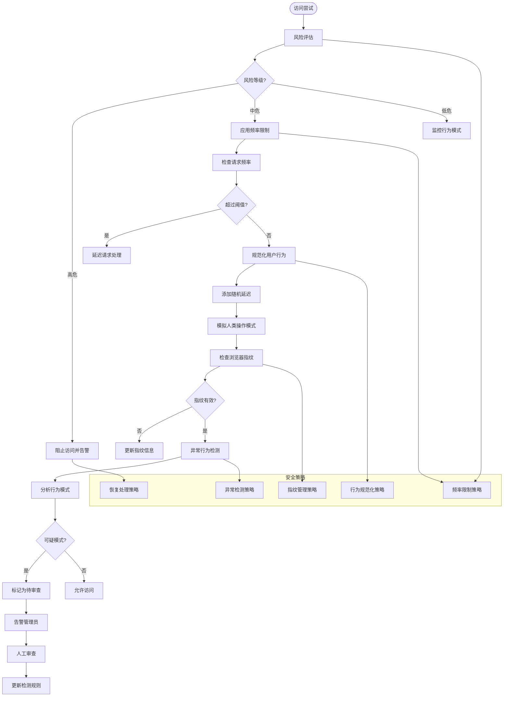

# 访问控制

<cite>
**本文档中引用的文件**   
- [auth_helpers.py](file://vibe_surf/langflow/api/v1/auth_helpers.py)
- [service.py](file://vibe_surf/langflow/services/mcp_composer/service.py)
- [auth.py](file://vibe_surf/langflow/services/settings/auth.py)
- [utils.py](file://vibe_surf/langflow/services/auth/utils.py)
- [model.py](file://vibe_surf/langflow/services/database/models/user/model.py)
- [model.py](file://vibe_surf/langflow/services/database/models/api_key/model.py)
- [vibe_surf_prompt.py](file://vibe_surf/agents/prompts/vibe_surf_prompt.py)
- [anti_detection.py](file://vibe_surf/workflows/Recruitment/boss_zhipin/anti_detection.py)
- [encryption.py](file://vibe_surf/backend/utils/encryption.py)
- [authModal](file://vibe_surf/frontend/src/modals/authModal/index.tsx)
- [auth.ts](file://vibe_surf/frontend/src/types/contexts/auth.ts)
</cite>

## 目录
1. [引言](#引言)
2. [基于角色的访问控制模型](#基于角色的访问控制模型)
3. [用户认证流程](#用户认证流程)
4. [数据库级别的访问控制](#数据库级别的访问控制)
5. [API端点权限控制](#api端点权限控制)
6. [安全审计日志与监控](#安全审计日志与监控)
7. [异常访问行为检测与告警](#异常访问行为检测与告警)
8. [最佳实践](#最佳实践)

## 引言

VibeSurf访问控制系统为平台提供了全面的安全保障机制，涵盖了从用户认证、权限管理到安全监控的各个方面。该系统实现了基于角色的访问控制（RBAC）模型，支持多种身份验证方法，并在数据库和API层面实施了细粒度的访问控制策略。本文档详细描述了VibeSurf访问控制系统的架构和实现细节，包括角色定义、权限分配、继承机制、用户认证流程、数据库安全策略、API权限配置以及安全审计和异常检测机制。

**Section sources**
- [auth_helpers.py](file://vibe_surf/langflow/api/v1/auth_helpers.py#L1-L75)
- [service.py](file://vibe_surf/langflow/services/mcp_composer/service.py#L216-L253)

## 基于角色的访问控制模型

VibeSurf的访问控制系统基于角色的访问控制（RBAC）模型，通过用户、角色和权限的层级关系实现细粒度的权限管理。系统中的核心用户模型定义了用户的基本属性和权限级别。

**Diagram sources**
- [model.py](file://vibe_surf/langflow/services/database/models/user/model.py#L25-L83)
- [model.py](file://vibe_surf/langflow/services/database/models/api_key/model.py#L25-L67)
- [auth.py](file://vibe_surf/langflow/services/settings/auth.py)

**Section sources**
- [model.py](file://vibe_surf/langflow/services/database/models/user/model.py#L25-L83)
- [model.py](file://vibe_surf/langflow/services/database/models/api_key/model.py#L25-L67)

## 用户认证流程

VibeSurf系统支持多种身份验证方法，包括API密钥和OAuth认证，并实现了会话管理机制。认证流程根据不同的认证类型和配置进行处理。

**Diagram sources**
- [utils.py](file://vibe_surf/langflow/services/auth/utils.py#L143-L158)
- [authModal](file://vibe_surf/frontend/src/modals/authModal/index.tsx)
- [auth.ts](file://vibe_surf/frontend/src/types/contexts/auth.ts)

**Section sources**
- [utils.py](file://vibe_surf/langflow/services/auth/utils.py#L143-L158)
- [authModal](file://vibe_surf/frontend/src/modals/authModal/index.tsx)
- [auth.ts](file://vibe_surf/frontend/src/types/contexts/auth.ts)

## 数据库级别的访问控制

VibeSurf系统在数据库层面实施了严格的访问控制策略，包括表级和行级安全措施。系统使用加密技术保护敏感数据，并通过数据库迁移脚本管理表结构。

系统通过Alembic进行数据库迁移管理，确保数据库结构的版本控制和一致性。凭证表（Credential）用于存储加密的API密钥和其他敏感数据，后来被变量表（Variable）取代，以提供更灵活的配置管理。

**Diagram sources**
- [models.py](file://vibe_surf/backend/database/models.py)
- [2ac71eb9c3ae_adds_credential_table.py](file://vibe_surf/langflow/alembic/versions/2ac71eb9c3ae_adds_credential_table.py)
- [1a110b568907_replace_credential_table_with_variable.py](file://vibe_surf/langflow/alembic/versions/1a110b568907_replace_credential_table_with_variable.py)

**Section sources**
- [models.py](file://vibe_surf/backend/database/models.py)
- [2ac71eb9c3ae_adds_credential_table.py](file://vibe_surf/langflow/alembic/versions/2ac71eb9c3ae_adds_credential_table.py)

## API端点权限控制

VibeSurf系统通过依赖注入和装饰器模式实现API端点的权限控制。每个API端点都配置了相应的权限要求，确保只有经过授权的用户才能访问特定资源。

API密钥的存储和验证过程包括加密和解密步骤，确保敏感信息的安全性。系统使用Fernet对称加密算法对API密钥进行加密，并在需要时进行解密验证。

**Diagram sources**
- [utils.py](file://vibe_surf/langflow/services/auth/utils.py#L472-L505)
- [encryption.py](file://vibe_surf/backend/utils/encryption.py#L98-L172)
- [api_key.py](file://vibe_surf/langflow/api/v1/api_key.py#L44-L88)

**Section sources**
- [utils.py](file://vibe_surf/langflow/services/auth/utils.py#L472-L505)
- [encryption.py](file://vibe_surf/backend/utils/encryption.py#L98-L172)

## 安全审计日志与监控

VibeSurf系统实现了全面的安全审计日志机制，记录所有关键操作和安全事件。系统通过日志流服务提供实时监控能力，便于及时发现和响应安全威胁。

系统还实现了WebSocket级别的安全审计，确保实时通信的安全性。所有WebSocket连接都必须通过API密钥或JWT令牌进行认证，防止未经授权的访问。

**Diagram sources**
- [log_router.py](file://vibe_surf/langflow/api/log_router.py#L37-L70)
- [utils.py](file://vibe_surf/langflow/services/auth/utils.py#L92-L140)
- [vibe_surf_prompt.py](file://vibe_surf/agents/prompts/vibe_surf_prompt.py#L139-L143)

**Section sources**
- [log_router.py](file://vibe_surf/langflow/api/log_router.py#L37-L70)
- [utils.py](file://vibe_surf/langflow/services/auth/utils.py#L92-L140)

## 异常访问行为检测与告警

VibeSurf系统集成了先进的异常访问行为检测机制，通过多维度的安全策略识别潜在威胁。系统实现了频率限制、行为规范化、指纹管理和异常检测等保护措施。

系统通过`execute_with_protection`方法在执行敏感操作时应用保护机制，确保在高风险情况下能够及时响应。风险等级评估基于历史行为、请求频率和操作类型等多个因素进行综合判断。

**Diagram sources**
- [anti_detection.py](file://vibe_surf/workflows/Recruitment/boss_zhipin/anti_detection.py#L122-L158)
- [anti_detection.py](file://vibe_surf/workflows/Recruitment/boss_zhipin/anti_detection.py#L612-L653)

**Section sources**
- [anti_detection.py](file://vibe_surf/workflows/Recruitment/boss_zhipin/anti_detection.py#L122-L158)

## 最佳实践

为了确保VibeSurf访问控制系统的安全性和有效性，建议遵循以下最佳实践：

1. **认证安全**：
   - 始终使用HTTPS加密所有通信
   - 定期轮换API密钥和JWT密钥
   - 实施多因素认证（MFA）增强安全性
   - 避免在客户端代码中硬编码敏感信息

2. **权限管理**：
   - 遵循最小权限原则，只授予必要的权限
   - 定期审查和清理不再需要的API密钥
   - 使用角色继承机制简化权限管理
   - 实施权限变更的审批流程

3. **会话管理**：
   - 设置合理的会话超时时间
   - 实施安全的会话固定防护
   - 使用HttpOnly和Secure标志保护会话Cookie
   - 定期清理过期的会话

4. **安全监控**：
   - 实时监控异常登录尝试
   - 设置基于行为的告警阈值
   - 定期审查安全审计日志
   - 实施自动化威胁检测和响应

5. **数据保护**：
   - 对所有敏感数据进行加密存储
   - 使用强加密算法（如Fernet）保护API密钥
   - 实施数据访问的细粒度控制
   - 定期备份和测试恢复流程

通过遵循这些最佳实践，可以最大限度地提高VibeSurf系统的安全性，保护用户数据和系统资源免受未经授权的访问和潜在威胁。

**Section sources**
- [auth_helpers.py](file://vibe_surf/langflow/api/v1/auth_helpers.py#L9-L75)
- [utils.py](file://vibe_surf/langflow/services/auth/utils.py)
- [anti_detection.py](file://vibe_surf/workflows/Recruitment/boss_zhipin/anti_detection.py)