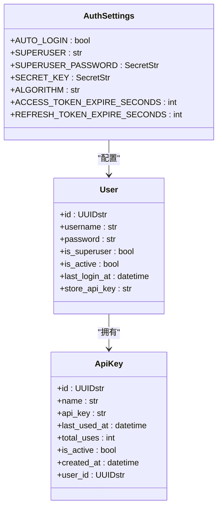
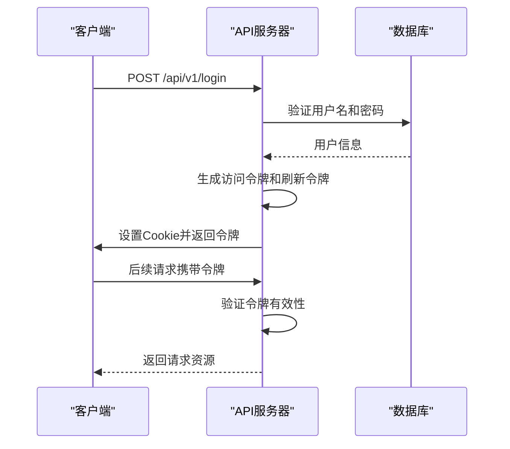
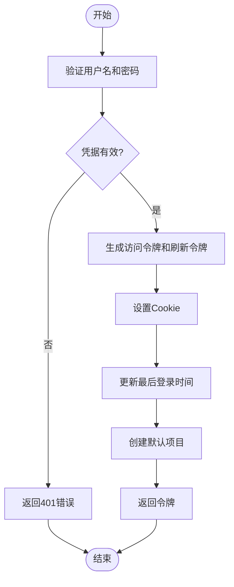
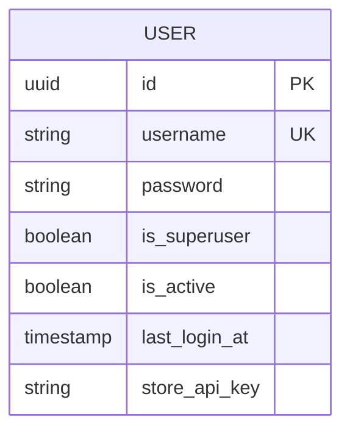
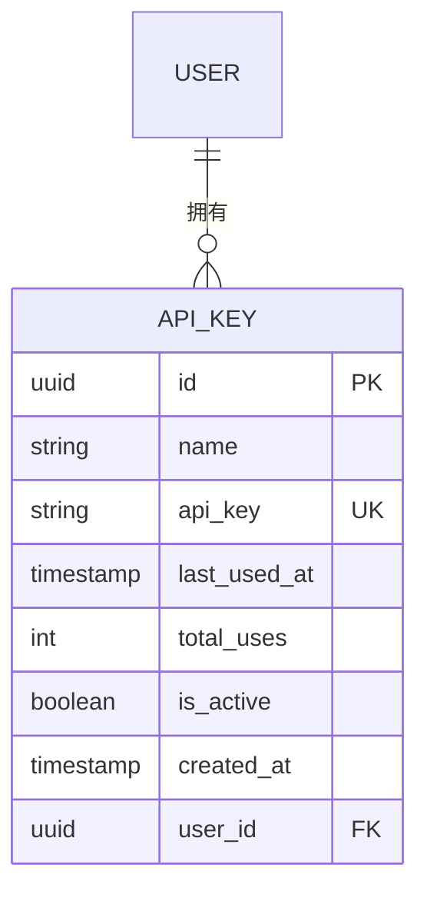
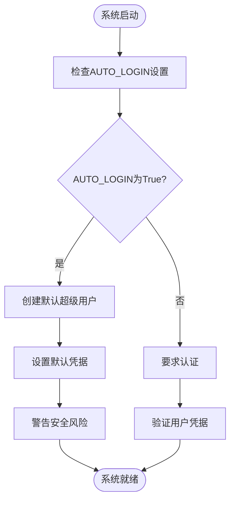
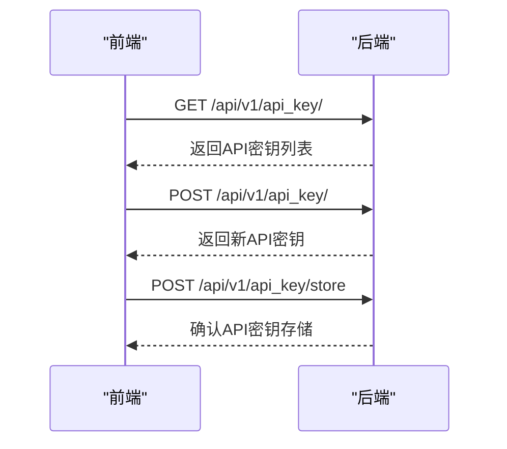
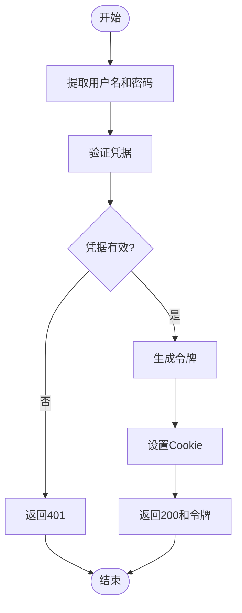

# 身份认证

<cite>
**本文档中引用的文件**   
- [auth.py](file://vibe_surf/frontend/src/types/zustand/auth/index.ts)
- [auth_context.ts](file://vibe_surf/frontend/src/types/contexts/auth.ts)
- [utils.py](file://vibe_surf/langflow/services/auth/utils.py)
- [auth.py](file://vibe_surf/langflow/services/settings/auth.py)
- [service.py](file://vibe_surf/langflow/services/auth/service.py)
- [login.py](file://vibe_surf/langflow/api/v1/login.py)
- [api_key.py](file://vibe_surf/langflow/api/v1/api_key.py)
- [model.py](file://vibe_surf/langflow/services/database/models/api_key/model.py)
- [crud.py](file://vibe_surf/langflow/services/database/models/api_key/crud.py)
- [use-get-api-keys.ts](file://vibe_surf/frontend/src/controllers/API/queries/api-keys/use-get-api-keys.ts)
- [use-post-add-api-key.ts](file://vibe_surf/frontend/src/controllers/API/queries/api-keys/use-post-add-api-key.ts)
- [StoreApiKeyPage.tsx](file://vibe_surf/frontend/src/pages/SettingsPage/pages/StoreApiKeyPage/index.tsx)
- [secretKeyModal.tsx](file://vibe_surf/frontend/src/modals/secretKeyModal/index.tsx)
</cite>

## 目录
1. [简介](#简介)
2. [认证机制](#认证机制)
3. [认证流程](#认证流程)
4. [数据库模型](#数据库模型)
5. [API端点](#api端点)
6. [安全考虑](#安全考虑)
7. [配置自定义认证提供商](#配置自定义认证提供商)
8. [异常处理](#异常处理)
9. [代码示例](#代码示例)

## 简介
VibeSurf身份认证系统提供了一套完整的安全机制，支持多种认证方式，包括API密钥认证、OAuth2.0集成和会话令牌管理。该系统设计用于确保用户访问的安全性，同时提供灵活的配置选项以适应不同的部署环境和安全需求。

**Section sources**
- [auth.py](file://vibe_surf/frontend/src/types/zustand/auth/index.ts)
- [auth_context.ts](file://vibe_surf/frontend/src/types/contexts/auth.ts)

## 认证机制
VibeSurf支持多种认证机制，包括API密钥认证、OAuth2.0集成和会话令牌管理。系统通过JWT（JSON Web Token）实现基于令牌的认证，同时支持传统的API密钥认证方式。

### API密钥认证
API密钥认证是VibeSurf系统中最基本的认证方式。用户可以通过查询参数或HTTP头传递API密钥进行认证。系统支持两种类型的API密钥：执行密钥和存储密钥。

**Diagram sources**
- [auth.py](file://vibe_surf/langflow/services/settings/auth.py#L18-L134)
- [model.py](file://vibe_surf/langflow/services/database/models/user/model.py)
- [model.py](file://vibe_surf/langflow/services/database/models/api_key/model.py)

### OAuth2.0集成
VibeSurf系统集成了OAuth2.0协议，支持标准的密码授权流程。用户可以通过用户名和密码获取访问令牌和刷新令牌，实现安全的会话管理。

### 会话令牌管理
系统使用JWT实现会话令牌管理，包含访问令牌和刷新令牌两种类型。访问令牌用于短期认证，刷新令牌用于在访问令牌过期后获取新的访问令牌。

**Section sources**
- [utils.py](file://vibe_surf/langflow/services/auth/utils.py#L27-L40)
- [login.py](file://vibe_surf/langflow/api/v1/login.py)

## 认证流程
VibeSurf的认证流程从用户登录请求开始，经过验证、令牌生成和响应返回等步骤，最终完成用户认证。

### 用户登录流程
用户登录流程包括验证凭据、生成令牌和设置Cookie等步骤。

**Diagram sources**
- [login.py](file://vibe_surf/langflow/api/v1/login.py#L23-L77)
- [utils.py](file://vibe_surf/langflow/services/auth/utils.py#L433-L445)

### 令牌生成与验证流程
系统使用JWT标准生成和验证令牌，确保令牌的安全性和有效性。

**Diagram sources**
- [login.py](file://vibe_surf/langflow/api/v1/login.py#L23-L77)
- [utils.py](file://vibe_surf/langflow/services/auth/utils.py#L272-L283)

**Section sources**
- [login.py](file://vibe_surf/langflow/api/v1/login.py#L23-L77)
- [utils.py](file://vibe_surf/langflow/services/auth/utils.py#L272-L283)

## 数据库模型
VibeSurf的认证系统包含多个数据库模型，用于存储用户信息、API密钥和其他认证相关数据。

### 用户模型
用户模型存储系统用户的基本信息，包括用户名、密码哈希、超级用户状态等。

**Diagram sources**
- [model.py](file://vibe_surf/langflow/services/database/models/user/model.py)

### API密钥模型
API密钥模型存储用户的API密钥信息，包括密钥名称、密钥值、使用统计等。

**Diagram sources**
- [model.py](file://vibe_surf/langflow/services/database/models/api_key/model.py#L18-L36)

**Section sources**
- [model.py](file://vibe_surf/langflow/services/database/models/user/model.py)
- [model.py](file://vibe_surf/langflow/services/database/models/api_key/model.py)

## API端点
VibeSurf提供了多个API端点用于处理认证相关的操作。

### 认证相关API端点
系统提供了登录、刷新令牌、登出和API密钥管理等API端点。

| 端点 | HTTP方法 | 描述 | 请求体 | 响应 |
|------|---------|------|--------|------|
| /api/v1/login | POST | 用户登录 | OAuth2PasswordRequestForm | 访问令牌和刷新令牌 |
| /api/v1/refresh | POST | 刷新访问令牌 | 无 | 新的访问令牌和刷新令牌 |
| /api/v1/logout | POST | 用户登出 | 无 | 登出成功消息 |
| /api/v1/api_key/ | GET | 获取用户API密钥列表 | 无 | API密钥列表 |
| /api/v1/api_key/ | POST | 创建新的API密钥 | ApiKeyCreate | 新的API密钥 |
| /api/v1/api_key/{api_key_id} | DELETE | 删除API密钥 | 无 | 删除成功消息 |
| /api/v1/api_key/store | POST | 存储API密钥 | ApiKeyCreateRequest | 存储成功消息 |

**Section sources**
- [login.py](file://vibe_surf/langflow/api/v1/login.py)
- [api_key.py](file://vibe_surf/langflow/api/v1/api_key.py)

## 安全考虑
VibeSurf认证系统在设计时考虑了多种安全因素，确保用户数据和系统安全。

### 安全最佳实践
系统实施了多项安全措施，包括：

- **密码哈希**：使用bcrypt算法对用户密码进行哈希存储
- **令牌过期**：访问令牌和刷新令牌都有明确的过期时间
- **HTTPS**：建议在生产环境中使用HTTPS加密通信
- **Cookie安全**：Cookie设置HttpOnly和Secure标志防止XSS攻击
- **API密钥加密**：存储的API密钥使用Fernet对称加密

### 配置安全设置
通过环境变量可以配置系统的安全设置，如自动登录、超级用户凭据等。

**Diagram sources**
- [auth.py](file://vibe_surf/langflow/services/settings/auth.py#L34-L41)
- [utils.py](file://vibe_surf/langflow/services/auth/utils.py#L51-L67)

**Section sources**
- [auth.py](file://vibe_surf/langflow/services/settings/auth.py)
- [utils.py](file://vibe_surf/langflow/services/auth/utils.py)

## 配置自定义认证提供商
VibeSurf系统支持通过配置文件和环境变量自定义认证提供商。

### 环境变量配置
系统支持通过环境变量配置认证相关设置：

- `LANGFLOW_AUTO_LOGIN`：启用自动登录
- `LANGFLOW_SKIP_AUTH_AUTO_LOGIN`：跳过自动登录认证检查
- `LANGFLOW_SUPERUSER`：设置超级用户名
- `LANGFLOW_SUPERUSER_PASSWORD`：设置超级用户密码
- `LANGFLOW_SECRET_KEY`：设置JWT密钥

### 配置文件设置
认证设置通过`AuthSettings`类管理，可以在配置文件中进行详细设置。

**Section sources**
- [auth.py](file://vibe_surf/langflow/services/settings/auth.py)
- [main.py](file://vibe_surf/backend/main.py#L66-L81)

## 异常处理
系统实现了完善的异常处理机制，确保认证过程中的各种异常情况都能得到妥善处理。

### 认证失败处理
当认证失败时，系统会返回相应的HTTP状态码和错误信息：

- **401 Unauthorized**：用户名或密码错误
- **403 Forbidden**：API密钥无效或缺失
- **400 Bad Request**：请求格式错误
- **422 Unprocessable Entity**：无法处理的实体

### 异常情况策略
系统对各种异常情况有明确的处理策略：

- **令牌过期**：返回401状态码，客户端应使用刷新令牌获取新令牌
- **API密钥无效**：返回403状态码，提示用户检查API密钥
- **数据库连接失败**：返回500状态码，记录错误日志
- **JWT解码失败**：返回401状态码，提示认证失败

**Section sources**
- [utils.py](file://vibe_surf/langflow/services/auth/utils.py#L170-L209)
- [login.py](file://vibe_surf/langflow/api/v1/login.py#L73-L77)

## 代码示例
以下是一些展示认证流程实现的代码示例。

### 前端API密钥管理
前端代码示例展示了如何管理API密钥：

**Diagram sources**
- [use-get-api-keys.ts](file://vibe_surf/frontend/src/controllers/API/queries/api-keys/use-get-api-keys.ts)
- [use-post-add-api-key.ts](file://vibe_surf/frontend/src/controllers/API/queries/api-keys/use-post-add-api-key.ts)
- [StoreApiKeyPage.tsx](file://vibe_surf/frontend/src/pages/SettingsPage/pages/StoreApiKeyPage/index.tsx)

### 后端认证逻辑
后端认证逻辑示例展示了如何验证用户凭据：

**Diagram sources**
- [login.py](file://vibe_surf/langflow/api/v1/login.py#L23-L77)
- [utils.py](file://vibe_surf/langflow/services/auth/utils.py#L433-L445)

**Section sources**
- [use-get-api-keys.ts](file://vibe_surf/frontend/src/controllers/API/queries/api-keys/use-get-api-keys.ts)
- [use-post-add-api-key.ts](file://vibe_surf/frontend/src/controllers/API/queries/api-keys/use-post-add-api-key.ts)
- [StoreApiKeyPage.tsx](file://vibe_surf/frontend/src/pages/SettingsPage/pages/StoreApiKeyPage/index.tsx)
- [secretKeyModal.tsx](file://vibe_surf/frontend/src/modals/secretKeyModal/index.tsx)