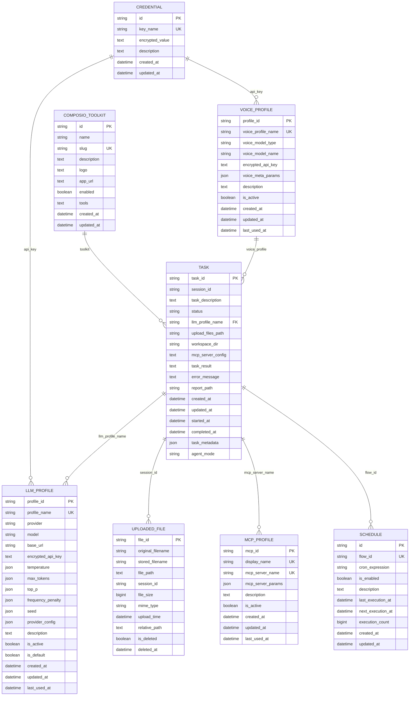

# 数据库设计

<cite>
**本文档中引用的文件**   
- [models.py](file://vibe_surf/backend/database/models.py)
- [schemas.py](file://vibe_surf/backend/database/schemas.py)
- [queries.py](file://vibe_surf/backend/database/queries.py)
- [manager.py](file://vibe_surf/backend/database/manager.py)
- [v001_initial_schema.sql](file://vibe_surf/backend/database/migrations/v001_initial_schema.sql)
- [v002_add_agent_mode.sql](file://vibe_surf/backend/database/migrations/v002_add_agent_mode.sql)
- [v003_fix_task_status_case.sql](file://vibe_surf/backend/database/migrations/v003_fix_task_status_case.sql)
- [v004_add_voice_profiles.sql](file://vibe_surf/backend/database/migrations/v004_add_voice_profiles.sql)
- [v005_add_composio_integration.sql](file://vibe_surf/backend/database/migrations/v005_add_composio_integration.sql)
- [v006_add_credentials_table.sql](file://vibe_surf/backend/database/migrations/v006_add_credentials_table.sql)
- [v007_add_schedule_table.sql](file://vibe_surf/backend/database/migrations/v007_add_schedule_table.sql)
- [encryption.py](file://vibe_surf/backend/utils/encryption.py)
- [task.py](file://vibe_surf/backend/api/task.py)
- [config.py](file://vibe_surf/backend/api/config.py)
</cite>

## 目录
1. [简介](#简介)
2. [数据库模式](#数据库模式)
3. [实体关系图](#实体关系图)
4. [表结构详解](#表结构详解)
5. [数据库迁移管理](#数据库迁移管理)
6. [数据访问模式](#数据访问模式)
7. [数据生命周期管理](#数据生命周期管理)
8. [数据库安全考虑](#数据库安全考虑)
9. [数据库性能监控](#数据库性能监控)
10. [附录](#附录)

## 简介

VibeSurf数据库设计旨在支持一个复杂的任务执行系统，该系统集成了LLM（大型语言模型）配置管理、任务执行跟踪、文件上传管理、MCP（模型控制协议）服务器配置、语音模型配置、Composio工具集成、凭证管理和工作流调度等功能。数据库采用SQLite作为默认存储，支持通过Alembic风格的迁移脚本进行版本控制，并使用机器特定的加密密钥保护敏感信息。

**Section sources**
- [models.py](file://vibe_surf/backend/database/models.py#L1-L289)
- [manager.py](file://vibe_surf/backend/database/manager.py#L1-L319)

## 数据库模式

VibeSurf数据库模式包含多个核心实体，这些实体通过外键和引用关系相互关联。主要实体包括：

- **任务 (Task)**: 表示一个执行单元，包含任务描述、状态、LLM配置引用、文件上传路径、工作区目录、MCP服务器配置、执行结果、错误信息、报告路径、时间戳和元数据。
- **LLM配置 (LLMProfile)**: 存储LLM提供商、模型、基础URL、加密的API密钥、LLM参数（温度、最大令牌数、top_p、频率惩罚、种子）、提供商特定配置、描述、是否激活、是否默认、创建时间、更新时间、最后使用时间。
- **上传文件 (UploadedFile)**: 跟踪上传的文件，包括文件ID、原始文件名、存储文件名、文件路径、会话ID、文件大小、MIME类型、上传时间、相对路径、是否已删除、删除时间。
- **MCP配置 (McpProfile)**: 管理MCP服务器配置，包括MCP ID、显示名称、服务器名称、服务器参数（JSON）、描述、是否激活、创建时间、更新时间、最后使用时间。
- **语音配置 (VoiceProfile)**: 管理语音模型配置，包括配置ID、配置名称、模型类型（ASR/TTS）、模型名称、加密的API密钥、元参数（JSON）、描述、是否激活、创建时间、更新时间、最后使用时间。
- **Composio工具包 (ComposioToolkit)**: 管理Composio应用集成，包括ID、名称、slug、描述、logo URL、应用URL、是否启用、工具（JSON字符串）、创建时间、更新时间。
- **凭证 (Credential)**: 存储加密的API密钥和其他敏感数据，包括ID、键名、加密值、描述、创建时间、更新时间。
- **调度 (Schedule)**: 管理工作流调度，包括ID、流程ID、cron表达式、是否启用、描述、上次执行时间、下次执行时间、执行次数、创建时间、更新时间。

**Section sources**
- [models.py](file://vibe_surf/backend/database/models.py#L1-L289)

## 实体关系图



**Diagram sources **
- [models.py](file://vibe_surf/backend/database/models.py#L1-L289)

## 表结构详解

### 任务表 (tasks)

任务表是系统的核心，用于跟踪每个任务的执行状态和相关信息。

| 字段名 | 数据类型 | 是否为空 | 主键 | 外键 | 默认值 | 描述 |
| :--- | :--- | :--- | :--- | :--- | :--- | :--- |
| task_id | VARCHAR(36) | 否 | 是 | 否 | UUID7字符串 | 任务的唯一标识符 |
| session_id | VARCHAR(36) | 否 | 否 | 否 | 无 | 关联的会话ID |
| task_description | TEXT | 否 | 否 | 否 | 无 | 任务的描述 |
| status | VARCHAR(9) | 否 | 否 | 否 | 'pending' | 任务状态（pending, running, paused, completed, failed, stopped） |
| llm_profile_name | VARCHAR(100) | 否 | 否 | 是 | 无 | 引用LLM配置的名称 |
| upload_files_path | VARCHAR(500) | 是 | 否 | 否 | 无 | 上传文件的路径 |
| workspace_dir | VARCHAR(500) | 是 | 否 | 否 | 无 | 任务的工作区目录 |
| mcp_server_config | TEXT | 是 | 否 | 否 | 无 | MCP服务器配置（JSON字符串） |
| task_result | TEXT | 是 | 否 | 否 | 无 | 任务的最终结果（Markdown格式） |
| error_message | TEXT | 是 | 否 | 否 | 无 | 错误信息 |
| report_path | VARCHAR(500) | 是 | 否 | 否 | 无 | 生成的报告文件路径 |
| created_at | DATETIME | 否 | 否 | 否 | CURRENT_TIMESTAMP | 创建时间 |
| updated_at | DATETIME | 否 | 否 | 否 | CURRENT_TIMESTAMP | 更新时间 |
| started_at | DATETIME | 是 | 否 | 否 | 无 | 开始时间 |
| completed_at | DATETIME | 是 | 否 | 否 | 无 | 完成时间 |
| task_metadata | JSON | 是 | 否 | 否 | 无 | 任务的元数据（JSON） |
| agent_mode | VARCHAR(50) | 否 | 否 | 否 | 'thinking' | 代理执行模式（'thinking'或'direct'） |

**索引：**
- `idx_tasks_status`: 按状态索引，用于快速查询任务状态。
- `idx_tasks_session`: 按会话ID索引，用于快速查询会话中的任务。
- `idx_tasks_llm_profile`: 按LLM配置名称索引，用于快速查询使用特定LLM配置的任务。
- `idx_tasks_created`: 按创建时间索引，用于按时间顺序查询任务。

**约束：**
- `CHECK (status IN ('pending', 'running', 'paused', 'completed', 'failed', 'stopped'))`: 确保状态值在有效范围内。

**Section sources**
- [models.py](file://vibe_surf/backend/database/models.py#L94-L136)
- [v001_initial_schema.sql](file://vibe_surf/backend/database/migrations/v001_initial_schema.sql#L30-L49)
- [v002_add_agent_mode.sql](file://vibe_surf/backend/database/migrations/v002_add_agent_mode.sql#L5)

### LLM配置表 (llm_profiles)

LLM配置表用于管理LLM提供商、模型、API密钥等配置。

| 字段名 | 数据类型 | 是否为空 | 主键 | 外键 | 默认值 | 描述 |
| :--- | :--- | :--- | :--- | :--- | :--- | :--- |
| profile_id | VARCHAR(36) | 否 | 是 | 否 | UUID7字符串 | 配置的唯一标识符 |
| profile_name | VARCHAR(100) | 否 | 否 | 否 | 无 | 用户定义的唯一名称 |
| provider | VARCHAR(50) | 否 | 否 | 否 | 无 | LLM提供商（如openai, anthropic, google等） |
| model | VARCHAR(100) | 否 | 否 | 否 | 无 | LLM模型名称 |
| base_url | VARCHAR(500) | 是 | 否 | 否 | 无 | LLM API的基础URL |
| encrypted_api_key | TEXT | 是 | 否 | 否 | 无 | 使用MAC地址加密的API密钥 |
| temperature | JSON | 是 | 否 | 否 | 无 | LLM参数 - 温度 |
| max_tokens | JSON | 是 | 否 | 否 | 无 | LLM参数 - 最大令牌数 |
| top_p | JSON | 是 | 否 | 否 | 无 | LLM参数 - top_p |
| frequency_penalty | JSON | 是 | 否 | 否 | 无 | LLM参数 - 频率惩罚 |
| seed | JSON | 是 | 否 | 否 | 无 | LLM参数 - 随机种子 |
| provider_config | JSON | 是 | 否 | 否 | 无 | 供应商特定配置 |
| description | TEXT | 是 | 否 | 否 | 无 | 描述 |
| is_active | BOOLEAN | 否 | 否 | 否 | 1 | 是否激活 |
| is_default | BOOLEAN | 否 | 否 | 否 | 0 | 是否为默认配置 |
| created_at | DATETIME | 否 | 否 | 否 | CURRENT_TIMESTAMP | 创建时间 |
| updated_at | DATETIME | 否 | 否 | 否 | CURRENT_TIMESTAMP | 更新时间 |
| last_used_at | DATETIME | 是 | 否 | 否 | 无 | 最后使用时间 |

**索引：**
- `idx_llm_profiles_name`: 按配置名称索引。
- `idx_llm_profiles_active`: 按是否激活索引。
- `idx_llm_profiles_default`: 按是否默认索引。
- `idx_llm_profiles_provider`: 按提供商索引。

**Section sources**
- [models.py](file://vibe_surf/backend/database/models.py#L57-L92)
- [v001_initial_schema.sql](file://vibe_surf/backend/database/migrations/v001_initial_schema.sql#L9-L28)

### 上传文件表 (uploaded_files)

上传文件表用于跟踪用户上传的文件。

| 字段名 | 数据类型 | 是否为空 | 主键 | 外键 | 默认值 | 描述 |
| :--- | :--- | :--- | :--- | :--- | :--- | :--- |
| file_id | VARCHAR(36) | 否 | 是 | 否 | UUID7字符串 | 文件的唯一标识符 |
| original_filename | VARCHAR(255) | 否 | 否 | 否 | 无 | 原始文件名 |
| stored_filename | VARCHAR(255) | 否 | 否 | 否 | 无 | 存储的文件名 |
| file_path | TEXT | 否 | 否 | 否 | 无 | 文件的完整路径 |
| session_id | VARCHAR(255) | 是 | 否 | 否 | 无 | 关联的会话ID |
| file_size | BIGINT | 否 | 否 | 否 | 无 | 文件大小（字节） |
| mime_type | VARCHAR(100) | 否 | 否 | 否 | 无 | MIME类型 |
| upload_time | DATETIME | 否 | 否 | 否 | CURRENT_TIMESTAMP | 上传时间 |
| relative_path | TEXT | 否 | 否 | 否 | 无 | 相对于工作区目录的路径 |
| is_deleted | BOOLEAN | 否 | 否 | 否 | 0 | 是否已删除 |
| deleted_at | DATETIME | 是 | 否 | 否 | 无 | 删除时间 |

**索引：**
- `idx_uploaded_files_session_time`: 按会话ID和上传时间索引。
- `idx_uploaded_files_active`: 按是否已删除和上传时间索引。
- `idx_uploaded_files_filename`: 按原始文件名索引。

**Section sources**
- [models.py](file://vibe_surf/backend/database/models.py#L138-L155)
- [v001_initial_schema.sql](file://vibe_surf/backend/database/migrations/v001_initial_schema.sql#L51-L64)

### MCP配置表 (mcp_profiles)

MCP配置表用于管理MCP服务器的配置。

| 字段名 | 数据类型 | 是否为空 | 主键 | 外键 | 默认值 | 描述 |
| :--- | :--- | :--- | :--- | :--- | :--- | :--- |
| mcp_id | VARCHAR(36) | 否 | 是 | 否 | UUID7字符串 | MCP配置的唯一标识符 |
| display_name | VARCHAR(100) | 否 | 否 | 否 | 无 | 用户友好的名称 |
| mcp_server_name | VARCHAR(100) | 否 | 否 | 否 | 无 | 服务器标识符（如"filesystem", "markitdown"） |
| mcp_server_params | JSON | 否 | 否 | 否 | 无 | MCP服务器参数（JSON对象） |
| description | TEXT | 是 | 否 | 否 | 无 | 描述 |
| is_active | BOOLEAN | 否 | 否 | 否 | 1 | 是否激活 |
| created_at | DATETIME | 否 | 否 | 否 | CURRENT_TIMESTAMP | 创建时间 |
| updated_at | DATETIME | 否 | 否 | 否 | CURRENT_TIMESTAMP | 更新时间 |
| last_used_at | DATETIME | 是 | 否 | 否 | 无 | 最后使用时间 |

**索引：**
- `idx_mcp_profiles_display_name`: 按显示名称索引。
- `idx_mcp_profiles_server_name`: 按服务器名称索引。
- `idx_mcp_profiles_active`: 按是否激活索引。

**Section sources**
- [models.py](file://vibe_surf/backend/database/models.py#L168-L189)
- [v001_initial_schema.sql](file://vibe_surf/backend/database/migrations/v001_initial_schema.sql#L66-L77)

### 语音配置表 (voice_profiles)

语音配置表用于管理语音模型的配置。

| 字段名 | 数据类型 | 是否为空 | 主键 | 外键 | 默认值 | 描述 |
| :--- | :--- | :--- | :--- | :--- | :--- | :--- |
| profile_id | VARCHAR(36) | 否 | 是 | 否 | UUID7字符串 | 配置的唯一标识符 |
| voice_profile_name | VARCHAR(100) | 否 | 否 | 否 | 无 | 用户定义的唯一名称 |
| voice_model_type | VARCHAR(3) | 否 | 否 | 否 | 无 | 语音模型类型（'asr'或'tts'） |
| voice_model_name | VARCHAR(100) | 否 | 否 | 否 | 无 | 语音模型名称 |
| encrypted_api_key | TEXT | 是 | 否 | 否 | 无 | 使用MAC地址加密的API密钥 |
| voice_meta_params | JSON | 是 | 否 | 否 | 无 | 模型特定参数（JSON） |
| description | TEXT | 是 | 否 | 否 | 无 | 描述 |
| is_active | BOOLEAN | 否 | 否 | 否 | 1 | 是否激活 |
| created_at | DATETIME | 否 | 否 | 否 | CURRENT_TIMESTAMP | 创建时间 |
| updated_at | DATETIME | 否 | 否 | 否 | CURRENT_TIMESTAMP | 更新时间 |
| last_used_at | DATETIME | 是 | 否 | 否 | 无 | 最后使用时间 |

**索引：**
- `idx_voice_profiles_name`: 按配置名称索引。
- `idx_voice_profiles_type`: 按模型类型索引。
- `idx_voice_profiles_active`: 按是否激活索引。

**约束：**
- `CHECK (voice_model_type IN ('asr', 'tts'))`: 确保模型类型在有效范围内。

**Section sources**
- [models.py](file://vibe_surf/backend/database/models.py#L29-L55)
- [v004_add_voice_profiles.sql](file://vibe_surf/backend/database/migrations/v004_add_voice_profiles.sql#L9-L22)

### Composio工具包表 (composio_toolkits)

Composio工具包表用于管理Composio应用集成。

| 字段名 | 数据类型 | 是否为空 | 主键 | 外键 | 默认值 | 描述 |
| :--- | :--- | :--- | :--- | :--- | :--- | :--- |
| id | VARCHAR(36) | 否 | 是 | 否 | UUID7字符串 | 工具包的唯一标识符 |
| name | VARCHAR(100) | 否 | 否 | 否 | 无 | 工具包名称 |
| slug | VARCHAR(100) | 否 | 否 | 否 | 无 | 唯一标识符（如"google", "github"） |
| description | TEXT | 是 | 否 | 否 | 无 | 描述 |
| logo | TEXT | 是 | 否 | 否 | 无 | Logo的URL |
| app_url | TEXT | 是 | 否 | 否 | 无 | 应用URL |
| enabled | BOOLEAN | 否 | 否 | 否 | 0 | 是否启用 |
| tools | TEXT | 是 | 否 | 否 | 无 | 工具名称到启用状态的映射（JSON字符串） |
| created_at | DATETIME | 否 | 否 | 否 | CURRENT_TIMESTAMP | 创建时间 |
| updated_at | DATETIME | 否 | 否 | 否 | CURRENT_TIMESTAMP | 更新时间 |

**索引：**
- `idx_composio_toolkits_name`: 按名称索引。
- `idx_composio_toolkits_slug`: 按slug索引。
- `idx_composio_toolkits_enabled`: 按是否启用索引。

**Section sources**
- [models.py](file://vibe_surf/backend/database/models.py#L192-L215)
- [v005_add_composio_integration.sql](file://vibe_surf/backend/database/migrations/v005_add_composio_integration.sql#L9-L20)

### 凭证表 (credentials)

凭证表用于存储加密的API密钥和其他敏感数据。

| 字段名 | 数据类型 | 是否为空 | 主键 | 外键 | 默认值 | 描述 |
| :--- | :--- | :--- | :--- | :--- | :--- | :--- |
| id | VARCHAR(36) | 否 | 是 | 否 | UUID7字符串 | 凭证的唯一标识符 |
| key_name | VARCHAR(100) | 否 | 否 | 否 | 无 | 键名（如"COMPOSIO_API_KEY"） |
| encrypted_value | TEXT | 是 | 否 | 否 | 无 | 使用MAC地址加密的值 |
| description | TEXT | 是 | 否 | 否 | 无 | 描述 |
| created_at | DATETIME | 否 | 否 | 否 | CURRENT_TIMESTAMP | 创建时间 |
| updated_at | DATETIME | 否 | 否 | 否 | CURRENT_TIMESTAMP | 更新时间 |

**索引：**
- `idx_credentials_key_name`: 按键名索引。

**Section sources**
- [models.py](file://vibe_surf/backend/database/models.py#L217-L234)
- [v006_add_credentials_table.sql](file://vibe_surf/backend/database/migrations/v006_add_credentials_table.sql#L8-L15)

### 调度表 (schedules)

调度表用于管理工作流的调度。

| 字段名 | 数据类型 | 是否为空 | 主键 | 外键 | 默认值 | 描述 |
| :--- | :--- | :--- | :--- | :--- | :--- | :--- |
| id | VARCHAR(36) | 否 | 是 | 否 | UUID7字符串 | 调度的唯一标识符 |
| flow_id | VARCHAR(36) | 否 | 否 | 否 | 无 | 关联的流程ID（唯一） |
| cron_expression | VARCHAR(100) | 是 | 否 | 否 | 无 | 标准cron格式 |
| is_enabled | BOOLEAN | 否 | 否 | 否 | 1 | 是否启用 |
| description | TEXT | 是 | 否 | 否 | 无 | 描述 |
| last_execution_at | DATETIME | 是 | 否 | 否 | 无 | 上次执行时间 |
| next_execution_at | DATETIME | 是 | 否 | 否 | 无 | 下次执行时间 |
| execution_count | BIGINT | 否 | 否 | 否 | 0 | 执行次数 |
| created_at | DATETIME | 否 | 否 | 否 | CURRENT_TIMESTAMP | 创建时间 |
| updated_at | DATETIME | 否 | 否 | 否 | CURRENT_TIMESTAMP | 更新时间 |

**索引：**
- `idx_schedules_flow_id`: 按流程ID索引。
- `idx_schedules_enabled`: 按是否启用索引。
- `idx_schedules_next_execution`: 按下次执行时间索引。
- `idx_schedules_cron`: 按cron表达式索引。

**Section sources**
- [models.py](file://vibe_surf/backend/database/models.py#L258-L283)
- [v007_add_schedule_table.sql](file://vibe_surf/backend/database/migrations/v007_add_schedule_table.sql#L4-L15)

## 数据库迁移管理

VibeSurf使用一个简化的迁移管理系统来管理数据库模式的演进。该系统基于SQLite的`PRAGMA user_version`来跟踪数据库版本，并通过执行SQL迁移脚本来应用更改。

### 迁移脚本编写规范

迁移脚本位于`vibe_surf/backend/database/migrations/`目录下，遵循以下命名和格式规范：

- **文件命名**: `v{版本号}_{描述}.sql`，例如`v001_initial_schema.sql`。
- **版本号**: 三位数字，从`001`开始递增。
- **描述**: 简短描述迁移的目的。
- **内容结构**:
  1. 注释头：包含迁移名称、描述和版本。
  2. `PRAGMA foreign_keys = ON;`: 启用外键约束。
  3. DDL语句：`CREATE TABLE`, `ALTER TABLE`, `DROP TABLE`等。
  4. 索引创建：`CREATE INDEX`。
  5. 触发器创建：`CREATE TRIGGER`（用于自动更新时间戳）。

### 迁移管理器

`DBMigrationManager`类负责管理迁移过程：

- **`get_db_version()`**: 从`PRAGMA user_version`读取当前数据库版本。
- **`set_db_version(version)`**: 设置数据库版本。
- **`get_migration_files()`**: 扫描迁移目录，按版本号排序返回迁移文件列表。
- **`apply_migrations(target_version)`**: 应用从当前版本到目标版本的所有迁移脚本。

迁移过程是原子的，如果某个迁移失败，整个过程会回滚并抛出异常。

**Section sources**
- [manager.py](file://vibe_surf/backend/database/manager.py#L27-L145)
- [v001_initial_schema.sql](file://vibe_surf/backend/database/migrations/v001_initial_schema.sql)
- [v002_add_agent_mode.sql](file://vibe_surf/backend/database/migrations/v002_add_agent_mode.sql)
- [v003_fix_task_status_case.sql](file://vibe_surf/backend/database/migrations/v003_fix_task_status_case.sql)
- [v004_add_voice_profiles.sql](file://vibe_surf/backend/database/migrations/v004_add_voice_profiles.sql)
- [v005_add_composio_integration.sql](file://vibe_surf/backend/database/migrations/v005_add_composio_integration.sql)
- [v006_add_credentials_table.sql](file://vibe_surf/backend/database/migrations/v006_add_credentials_table.sql)
- [v007_add_schedule_table.sql](file://vibe_surf/backend/database/migrations/v007_add_schedule_table.sql)

## 数据访问模式

VibeSurf通过`queries.py`文件中的查询类提供了一套完整的数据访问模式。

### 常用查询

#### LLM配置查询 (LLMProfileQueries)
- `create_profile()`: 创建新的LLM配置，自动加密API密钥。
- `get_profile()`: 通过名称获取LLM配置。
- `get_profile_with_decrypted_key()`: 获取LLM配置并解密API密钥。
- `list_profiles()`: 列出所有（或仅激活的）LLM配置。
- `update_profile()`: 更新LLM配置，处理API密钥的加密。
- `delete_profile()`: 删除LLM配置。
- `get_default_profile()`: 获取默认的LLM配置。
- `set_default_profile()`: 设置默认的LLM配置。
- `update_last_used()`: 更新配置的最后使用时间。

#### 任务查询 (TaskQueries)
- `save_task()`: 创建或更新任务记录。
- `get_task()`: 通过ID获取任务。
- `get_tasks_by_session()`: 获取会话中的所有任务。
- `get_recent_tasks()`: 获取最近的任务。
- `get_all_sessions()`: 获取所有唯一会话及其元数据。
- `update_task_status()`: 更新任务状态。
- `delete_task()`: 删除任务。
- `get_running_tasks()`: 获取所有正在运行的任务。
- `get_active_task()`: 获取当前正在运行的任务（单任务模型）。
- `get_tasks_by_llm_profile()`: 获取使用特定LLM配置的任务。
- `update_task_completion()`: 更新任务完成状态和结果。
- `get_task_counts_by_status()`: 按状态获取任务计数。

#### MCP配置查询 (McpProfileQueries)
- `create_profile()`: 创建新的MCP配置。
- `get_profile()`: 通过ID获取MCP配置。
- `get_profile_by_display_name()`: 通过显示名称获取MCP配置。
- `list_profiles()`: 列出所有（或仅激活的）MCP配置。
- `get_active_profiles()`: 获取所有激活的MCP配置。
- `update_profile()`: 更新MCP配置。
- `delete_profile()`: 删除MCP配置。
- `update_last_used()`: 更新配置的最后使用时间。

#### 上传文件查询 (UploadedFileQueries)
- `create_file_record()`: 创建上传文件记录。
- `get_file()`: 通过ID获取上传文件。

### 性能优化策略

- **索引**: 为频繁查询的字段（如`status`, `session_id`, `llm_profile_name`, `created_at`）创建了索引。
- **批量操作**: 查询方法支持`limit`和`offset`参数，避免一次性加载过多数据。
- **连接管理**: 使用`DatabaseManager`管理数据库连接池，优化连接复用。
- **异步操作**: 所有数据库操作都是异步的，避免阻塞主线程。

**Section sources**
- [queries.py](file://vibe_surf/backend/database/queries.py#L21-L800)
- [task.py](file://vibe_surf/backend/api/task.py#L43-L379)
- [config.py](file://vibe_surf/backend/api/config.py#L78-L762)

## 数据生命周期管理

### 数据保留策略

- **任务数据**: 任务记录在完成后长期保留，除非用户手动删除。
- **上传文件**: 文件在任务完成后保留在工作区目录中，直到用户手动清理或系统执行归档。
- **日志数据**: 系统日志（如`telemetry`）根据配置的保留策略进行轮转和清理。

### 归档和清理机制

- **手动清理**: 用户可以通过API或前端界面删除任务、文件和配置。
- **自动归档**: 系统可以配置为定期将旧的任务数据归档到外部存储（如云存储）。
- **软删除**: `uploaded_files`表中的`is_deleted`字段支持软删除，文件在标记为删除后仍可恢复。

**Section sources**
- [models.py](file://vibe_surf/backend/database/models.py#L151)
- [queries.py](file://vibe_surf/backend/database/queries.py#L650-L657)

## 数据库安全考虑

### 加密

敏感数据（如API密钥）使用机器特定的密钥进行加密。加密密钥基于机器的MAC地址或本地用户ID派生。

- **`derive_key(machine_id, salt)`**: 使用PBKDF2HMAC算法从机器ID派生加密密钥。
- **`get_encryption_key()`**: 获取当前机器的加密密钥。
- **`encrypt_api_key(api_key)`**: 使用Fernet加密API密钥。
- **`decrypt_api_key(encrypted_api_key)`**: 解密API密钥。

加密后的数据以Base64编码存储在数据库中。

### 备份和恢复流程

- **备份**: 由于使用SQLite，备份整个数据库文件（`vibe_surf.db`）即可。建议定期将此文件复制到安全位置。
- **恢复**: 将备份的数据库文件复制回工作区目录，替换现有文件。

**Section sources**
- [encryption.py](file://vibe_surf/backend/utils/encryption.py#L1-L172)
- [manager.py](file://vibe_surf/backend/database/manager.py#L157-L161)

## 数据库性能监控

### 关键指标

- **数据库版本**: 通过`get_db_version()`监控数据库模式版本。
- **任务状态计数**: 通过`get_task_counts_by_status()`监控不同状态的任务数量。
- **连接池状态**: 监控数据库连接池的使用情况（生产环境中使用PostgreSQL时）。
- **查询性能**: 通过日志记录慢查询。

### 告警设置

- **模式不一致**: 如果数据库版本与预期版本不匹配，应发出告警。
- **任务积压**: 如果`running`或`pending`状态的任务数量超过阈值，应发出告警。
- **连接失败**: 如果数据库连接失败，应发出严重告警。

**Section sources**
- [manager.py](file://vibe_surf/backend/database/manager.py#L258-L268)
- [queries.py](file://vibe_surf/backend/database/queries.py#L736-L752)

## 附录

### 数据库初始化

数据库通过`init_database()`函数初始化。该函数会检查数据库版本，如果为0，则应用所有迁移脚本；否则，使用直接表创建。

```python
async def init_database():
    """Initialize database with tables"""
    from .. import shared_state

    logger.info("🗄️ Initializing VibeSurf database...")

    try:
        if not shared_state.db_manager:
            raise RuntimeError("Database manager not initialized. Call initialize_vibesurf_components() first.")

        await shared_state.db_manager.create_tables()
        logger.info("✅ Database tables created successfully")
        logger.info("✅ VibeSurf database ready for single-task execution")

    except Exception as e:
        logger.error(f"❌ Database initialization failed: {e}")
        raise
```

**Section sources**
- [manager.py](file://vibe_surf/backend/database/manager.py#L287-L304)