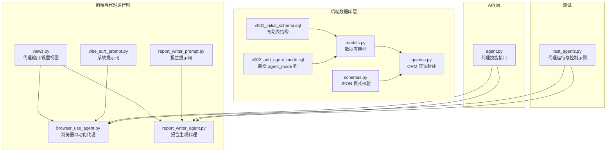
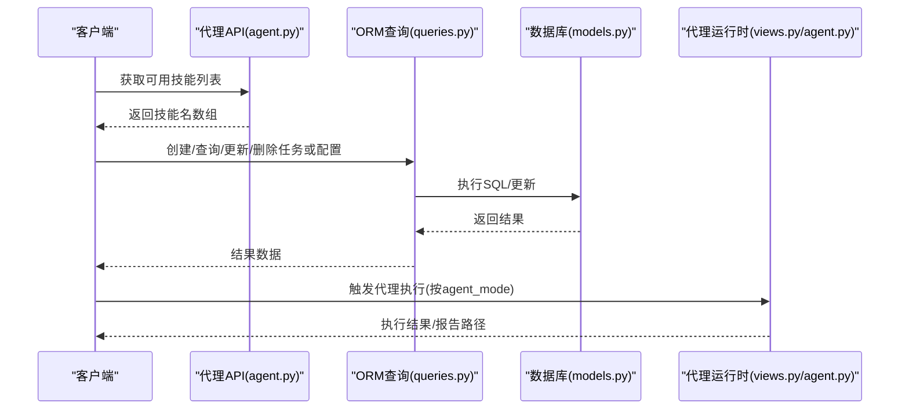
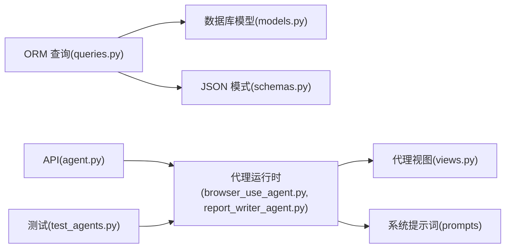

# 代理模型

<cite>
**本文引用的文件**
- [models.py](file://vibe_surf/backend/database/models.py)
- [schemas.py](file://vibe_surf/backend/database/schemas.py)
- [queries.py](file://vibe_surf/backend/database/queries.py)
- [v001_initial_schema.sql](file://vibe_surf/backend/database/migrations/v001_initial_schema.sql)
- [v002_add_agent_mode.sql](file://vibe_surf/backend/database/migrations/v002_add_agent_mode.sql)
- [views.py](file://vibe_surf/agents/views.py)
- [browser_use_agent.py](file://vibe_surf/agents/browser_use_agent.py)
- [report_writer_agent.py](file://vibe_surf/agents/report_writer_agent.py)
- [vibe_surf_prompt.py](file://vibe_surf/agents/prompts/vibe_surf_prompt.py)
- [report_writer_prompt.py](file://vibe_surf/agents/prompts/report_writer_prompt.py)
- [agent.py](file://vibe_surf/backend/api/agent.py)
- [test_agents.py](file://tests/test_agents.py)
</cite>

## 目录
1. [简介](#简介)
2. [项目结构](#项目结构)
3. [核心组件](#核心组件)
4. [架构总览](#架构总览)
5. [详细组件分析](#详细组件分析)
6. [依赖关系分析](#依赖关系分析)
7. [性能考量](#性能考量)
8. [故障排查指南](#故障排查指南)
9. [结论](#结论)
10. [附录](#附录)

## 简介
本文件系统性地文档化 VibeSurf 的“代理模型”，聚焦于代理实体的字段定义、业务规则、代理模式（如 browser_use、report_writer）的含义与使用场景，并阐明代理与任务、凭证、计划等其他实体的关系。同时提供基于 ORM 的创建、查询、更新、删除示例路径，以及不同模式下的配置差异说明与实际配置数据示例。

## 项目结构
围绕代理模型的关键目录与文件：
- 后端数据库层：模型定义、JSON 校验模式、查询封装、迁移脚本
- 前端与代理运行时：代理视图与设置、浏览器自动化代理、报告生成代理、系统提示词
- API 层：代理相关接口
- 测试：代理运行与控制流程示例

图表来源
- [models.py](file://vibe_surf/backend/database/models.py#L94-L137)
- [schemas.py](file://vibe_surf/backend/database/schemas.py#L1-L100)
- [queries.py](file://vibe_surf/backend/database/queries.py#L441-L753)
- [v001_initial_schema.sql](file://vibe_surf/backend/database/migrations/v001_initial_schema.sql#L30-L49)
- [v002_add_agent_mode.sql](file://vibe_surf/backend/database/migrations/v002_add_agent_mode.sql#L1-L6)
- [views.py](file://vibe_surf/agents/views.py#L1-L124)
- [browser_use_agent.py](file://vibe_surf/agents/browser_use_agent.py#L83-L240)
- [report_writer_agent.py](file://vibe_surf/agents/report_writer_agent.py#L1-L120)
- [vibe_surf_prompt.py](file://vibe_surf/agents/prompts/vibe_surf_prompt.py#L1-L195)
- [report_writer_prompt.py](file://vibe_surf/agents/prompts/report_writer_prompt.py#L1-L74)
- [agent.py](file://vibe_surf/backend/api/agent.py#L1-L38)
- [test_agents.py](file://tests/test_agents.py#L1-L120)

章节来源
- [models.py](file://vibe_surf/backend/database/models.py#L94-L137)
- [schemas.py](file://vibe_surf/backend/database/schemas.py#L1-L100)
- [queries.py](file://vibe_surf/backend/database/queries.py#L441-L753)
- [v001_initial_schema.sql](file://vibe_surf/backend/database/migrations/v001_initial_schema.sql#L30-L49)
- [v002_add_agent_mode.sql](file://vibe_surf/backend/database/migrations/v002_add_agent_mode.sql#L1-L6)
- [views.py](file://vibe_surf/agents/views.py#L1-L124)
- [browser_use_agent.py](file://vibe_surf/agents/browser_use_agent.py#L83-L240)
- [report_writer_agent.py](file://vibe_surf/agents/report_writer_agent.py#L1-L120)
- [vibe_surf_prompt.py](file://vibe_surf/agents/prompts/vibe_surf_prompt.py#L1-L195)
- [report_writer_prompt.py](file://vibe_surf/agents/prompts/report_writer_prompt.py#L1-L74)
- [agent.py](file://vibe_surf/backend/api/agent.py#L1-L38)
- [test_agents.py](file://tests/test_agents.py#L1-L120)

## 核心组件
- 数据库模型（Task 表）：承载代理执行任务的元数据与状态，包含代理模式字段 agent_mode
- JSON 模式（schemas.py）：对任务元数据、LLM 配置、MCP 服务器配置进行结构化校验
- ORM 查询封装（queries.py）：提供 LLMProfile、McpProfile、Task 的创建、查询、更新、删除等操作
- 代理运行时（views.py、browser_use_agent.py、report_writer_agent.py）：定义代理输出结构、设置参数、执行逻辑
- 提示词（prompts）：为代理提供系统级行为指导与工作流约束
- API 接口（agent.py）：暴露代理技能列表等能力

章节来源
- [models.py](file://vibe_surf/backend/database/models.py#L94-L137)
- [schemas.py](file://vibe_surf/backend/database/schemas.py#L1-L100)
- [queries.py](file://vibe_surf/backend/database/queries.py#L441-L753)
- [views.py](file://vibe_surf/agents/views.py#L1-L124)
- [browser_use_agent.py](file://vibe_surf/agents/browser_use_agent.py#L83-L240)
- [report_writer_agent.py](file://vibe_surf/agents/report_writer_agent.py#L1-L120)
- [vibe_surf_prompt.py](file://vibe_surf/agents/prompts/vibe_surf_prompt.py#L1-L195)
- [report_writer_prompt.py](file://vibe_surf/agents/prompts/report_writer_prompt.py#L1-L74)
- [agent.py](file://vibe_surf/backend/api/agent.py#L1-L38)

## 架构总览
代理模型贯穿“数据库层—ORM—代理运行时—提示词—API”的全链路，其中：
- 数据库层通过 Task 表记录任务与代理模式
- ORM 层负责 LLMProfile、McpProfile、Task 的持久化与检索
- 代理运行时根据 agent_mode 决定思考/无思考/闪速模式
- 提示词规范代理行为与输出格式
- API 层提供技能发现等能力

图表来源
- [agent.py](file://vibe_surf/backend/api/agent.py#L1-L38)
- [queries.py](file://vibe_surf/backend/database/queries.py#L441-L753)
- [models.py](file://vibe_surf/backend/database/models.py#L94-L137)
- [views.py](file://vibe_surf/agents/views.py#L1-L124)
- [browser_use_agent.py](file://vibe_surf/agents/browser_use_agent.py#L83-L240)
- [report_writer_agent.py](file://vibe_surf/agents/report_writer_agent.py#L1-L120)

## 详细组件分析

### 数据库模型：Task 表与代理模式
- 字段概览（关键字段）
  - task_id：主键，UUID 字符串
  - session_id：会话标识
  - task_description：任务描述
  - status：任务状态枚举（pending/running/paused/completed/failed/stopped）
  - llm_profile_name：引用 LLMProfile 的 profile_name
  - upload_files_path/workspace_dir：上传文件路径与工作空间目录
  - mcp_server_config：MCP 服务器配置（JSON 字符串）
  - agent_mode：代理模式，默认值为 "thinking"
  - task_result/error_message/report_path：结果、错误信息、报告路径
  - created_at/updated_at/started_at/completed_at：时间戳
  - task_metadata：任务元数据（JSON）

- 数据类型与约束
  - 主键：VARCHAR(36) 或 UUID 字符串
  - 状态列：CHECK 约束限定枚举值
  - JSON 列：存储结构化配置，不包含敏感信息
  - 默认值：agent_mode 默认 "thinking"
  - 时间戳：自动维护 created_at/updated_at

- 业务规则
  - 当状态从 running 变为 completed/failed/stopped 时，自动写入 completed_at
  - agent_mode 控制代理思考/无思考/闪速模式
  - llm_profile_name 引用 LLMProfile 的唯一名称，避免直接存储密钥

- 迁移脚本
  - v001_initial_schema.sql：初始表结构
  - v002_add_agent_mode.sql：新增 agent_mode 列并默认 "thinking"

章节来源
- [models.py](file://vibe_surf/backend/database/models.py#L94-L137)
- [v001_initial_schema.sql](file://vibe_surf/backend/database/migrations/v001_initial_schema.sql#L30-L49)
- [v002_add_agent_mode.sql](file://vibe_surf/backend/database/migrations/v002_add_agent_mode.sql#L1-L6)

### JSON 模式：LLM 配置、控制器配置、MCP 服务器配置
- LLMConfiguration
  - 字段：model、base_url、provider、provider_config；温度、最大令牌、采样策略、惩罚项、种子等可选
  - 说明：API 密钥不存储在此处，避免泄露

- ControllerConfiguration（旧版工具配置）
  - 功能：动作排除、每任务最大动作数、是否显示文件、截图保存、错误处理策略等

- McpServerConfig/McpServerParams
  - 功能：以字典形式描述 MCP 服务器命令、参数、环境变量、工作目录、超时等

- TaskMetadata
  - 功能：记录执行时长、动作总数、报告路径、最终摘要、控制历史、错误上下文、创建来源等

章节来源
- [schemas.py](file://vibe_surf/backend/database/schemas.py#L1-L100)

### ORM 查询封装：Task、LLMProfile、McpProfile
- TaskQueries
  - save_task：创建或更新任务，支持状态变更与时间戳自动更新
  - get_task/get_tasks_by_session/get_recent_tasks：查询任务
  - update_task_status/update_task_completion/delete_task：状态更新、完成标记、删除
  - get_running_tasks/get_active_task：运行中任务查询
  - get_tasks_by_llm_profile：按 LLM 配置名筛选任务
  - get_task_counts_by_status：按状态统计任务数量

- LLMProfileQueries
  - create_profile/get_profile/get_profile_with_decrypted_key/list_profiles/update_profile/delete_profile
  - get_default_profile/set_default_profile/update_last_used：默认配置管理与使用追踪

- McpProfileQueries
  - create_profile/get_profile/get_profile_by_display_name/list_profiles/get_active_profiles/update_profile/delete_profile/update_last_used

章节来源
- [queries.py](file://vibe_surf/backend/database/queries.py#L441-L753)

### 代理运行时：浏览器自动化代理与报告生成代理
- 代理输出与设置（views.py）
  - VibeSurfAgentOutput：包含 thinking 与 action 列表
  - VibeSurfAgentSettings：use_vision、max_failures、系统消息扩展/覆盖、include_attributes、max_actions_per_step、llm_timeout、step_timeout、agent_mode
  - CustomAgentOutput：自定义动作输出模型

- 浏览器自动化代理（browser_use_agent.py）
  - 初始化：接收 LLM、浏览器会话、工具集、文件系统、token 成本服务等
  - 设置：use_vision、max_actions_per_step、use_thinking、flash_mode、llm_timeout、step_timeout 等
  - 执行：多步动作执行、历史记录、事件上报、信号处理、暂停/恢复/停止
  - 输出：AgentHistoryList，包含 token 使用汇总

- 报告生成代理（report_writer_agent.py）
  - 初始化：LLM、工作空间、工具集、消息历史、遥测
  - 执行：LLM 循环生成 HTML 报告，支持暂停/恢复/停止
  - 输出：ReportTaskResult，包含成功标志、消息与报告路径

章节来源
- [views.py](file://vibe_surf/agents/views.py#L1-L124)
- [browser_use_agent.py](file://vibe_surf/agents/browser_use_agent.py#L83-L240)
- [report_writer_agent.py](file://vibe_surf/agents/report_writer_agent.py#L1-L120)

### 代理模式与业务含义
- agent_mode 取值与含义
  - thinking：启用思考阶段，适合复杂任务规划与多步骤推理
  - no-thinking：跳过思考阶段，直接执行动作，适合简单任务
  - flash：快速模式，强调低延迟与高吞吐

- 与 Task 表的关系
  - Task 表新增 agent_mode 列，用于记录任务执行时的代理模式
  - 代理运行时（如 ReportWriterAgent）读取 agent_mode 并据此调整输出结构

- 与提示词的关系
  - 浏览器自动化代理遵循系统提示词，明确并发任务、文件操作、安全边界等
  - 报告生成代理遵循报告提示词，确保输出为专业 HTML 文档

章节来源
- [v002_add_agent_mode.sql](file://vibe_surf/backend/database/migrations/v002_add_agent_mode.sql#L1-L6)
- [views.py](file://vibe_surf/agents/views.py#L59-L124)
- [vibe_surf_prompt.py](file://vibe_surf/agents/prompts/vibe_surf_prompt.py#L1-L195)
- [report_writer_prompt.py](file://vibe_surf/agents/prompts/report_writer_prompt.py#L1-L74)

### 代理与任务、凭证、计划的关系
- 与任务（Task）的关系
  - Task 表记录任务描述、状态、LLM 配置引用、MCP 配置、报告路径、代理模式等
  - ORM 支持按 session、LLM 配置、状态等维度查询任务

- 与凭证（Credential）的关系
  - 凭证表存储加密后的敏感值，LLMProfile 中的 API Key 也采用加密存储
  - ORM 提供解密 API Key 的方法，仅在需要时返回明文

- 与计划（Schedule）的关系
  - 计划表记录 Cron 表达式与执行计数等，与任务生命周期配合使用

章节来源
- [models.py](file://vibe_surf/backend/database/models.py#L217-L235)
- [models.py](file://vibe_surf/backend/database/models.py#L258-L284)
- [queries.py](file://vibe_surf/backend/database/queries.py#L110-L142)

### ORM 操作示例（路径指引）
- 创建 LLM 配置
  - 路径：[LLMProfileQueries.create_profile](file://vibe_surf/backend/database/queries.py#L21-L110)
- 查询 LLM 配置（含解密 API Key）
  - 路径：[LLMProfileQueries.get_profile_with_decrypted_key](file://vibe_surf/backend/database/queries.py#L110-L142)
- 更新 LLM 配置
  - 路径：[LLMProfileQueries.update_profile](file://vibe_surf/backend/database/queries.py#L175-L209)
- 删除 LLM 配置
  - 路径：[LLMProfileQueries.delete_profile](file://vibe_surf/backend/database/queries.py#L201-L212)
- 设置默认 LLM 配置
  - 路径：[LLMProfileQueries.set_default_profile](file://vibe_surf/backend/database/queries.py#L231-L249)
- 保存任务（含 agent_mode）
  - 路径：[TaskQueries.save_task](file://vibe_surf/backend/database/queries.py#L445-L519)
- 查询任务
  - 路径：[TaskQueries.get_task](file://vibe_surf/backend/database/queries.py#L525-L533)
- 更新任务状态
  - 路径：[TaskQueries.update_task_status](file://vibe_surf/backend/database/queries.py#L614-L648)
- 完成任务并写入结果
  - 路径：[TaskQueries.update_task_completion](file://vibe_surf/backend/database/queries.py#L705-L734)
- 删除任务
  - 路径：[TaskQueries.delete_task](file://vibe_surf/backend/database/queries.py#L650-L658)

章节来源
- [queries.py](file://vibe_surf/backend/database/queries.py#L21-L249)
- [queries.py](file://vibe_surf/backend/database/queries.py#L445-L734)

### 实际配置数据示例（路径指引）
- LLM 配置（LLMConfiguration）
  - 路径：[LLMConfiguration](file://vibe_surf/backend/database/schemas.py#L32-L47)
- 控制器配置（ControllerConfiguration，旧版）
  - 路径：[ControllerConfiguration](file://vibe_surf/backend/database/schemas.py#L60-L74)
- MCP 服务器配置（McpServerConfig/McpServerParams）
  - 路径：[McpServerConfig](file://vibe_surf/backend/database/schemas.py#L56-L59)、[McpServerParams](file://vibe_surf/backend/database/schemas.py#L48-L55)
- 任务元数据（TaskMetadata）
  - 路径：[TaskMetadata](file://vibe_surf/backend/database/schemas.py#L11-L31)
- 代理设置（VibeSurfAgentSettings）
  - 路径：[VibeSurfAgentSettings](file://vibe_surf/agents/views.py#L59-L74)

章节来源
- [schemas.py](file://vibe_surf/backend/database/schemas.py#L11-L74)
- [views.py](file://vibe_surf/agents/views.py#L59-L74)

## 依赖关系分析
- 组件耦合
  - ORM 查询封装依赖 SQLAlchemy 模型与加密工具
  - 代理运行时依赖浏览器自动化框架、工具注册中心、文件系统
  - 提示词为代理行为提供约束，影响输出结构与执行策略

- 外部依赖
  - 浏览器自动化框架（browser_use）、工具注册中心（VibeSurfTools）
  - 文件系统抽象（CustomFileSystem）
  - 遥测服务（ProductTelemetry）

图表来源
- [queries.py](file://vibe_surf/backend/database/queries.py#L1-L120)
- [models.py](file://vibe_surf/backend/database/models.py#L94-L137)
- [schemas.py](file://vibe_surf/backend/database/schemas.py#L1-L100)
- [browser_use_agent.py](file://vibe_surf/agents/browser_use_agent.py#L83-L240)
- [report_writer_agent.py](file://vibe_surf/agents/report_writer_agent.py#L1-L120)
- [views.py](file://vibe_surf/agents/views.py#L1-L124)
- [vibe_surf_prompt.py](file://vibe_surf/agents/prompts/vibe_surf_prompt.py#L1-L195)
- [report_writer_prompt.py](file://vibe_surf/agents/prompts/report_writer_prompt.py#L1-L74)
- [agent.py](file://vibe_surf/backend/api/agent.py#L1-L38)
- [test_agents.py](file://tests/test_agents.py#L1-L120)

## 性能考量
- 数据库索引
  - 对 LLMProfile、Task、UploadedFile、McpProfile、Schedule 等表建立常用查询索引，提升查询性能
- 任务状态更新
  - 状态变更时自动写入时间戳，便于统计与监控
- 代理模式选择
  - thinking 模式适合复杂任务，no-thinking/flash 模式适合快速执行
- 文件系统与截图
  - 代理运行时将中间产物写入工作空间，便于后续报告生成与调试

[本节为通用指导，无需具体文件分析]

## 故障排查指南
- 任务状态异常
  - 检查状态枚举是否符合约束，确认 completed_at 是否正确写入
  - 参考：[Task 表状态约束](file://vibe_surf/backend/database/migrations/v001_initial_schema.sql#L43-L49)
- LLM 配置密钥问题
  - 使用 get_profile_with_decrypted_key 获取解密后的 API Key
  - 参考：[LLMProfileQueries.get_profile_with_decrypted_key](file://vibe_surf/backend/database/queries.py#L110-L142)
- 代理执行中断
  - 检查暂停/恢复/停止控制逻辑与信号处理
  - 参考：[BrowserUseAgent 控制流程](file://vibe_surf/agents/browser_use_agent.py#L658-L800)
- 报告生成失败
  - 检查 ReportWriterAgent 的错误事件捕获与回退报告生成
  - 参考：[ReportWriterAgent 错误处理](file://vibe_surf/agents/report_writer_agent.py#L317-L347)

章节来源
- [v001_initial_schema.sql](file://vibe_surf/backend/database/migrations/v001_initial_schema.sql#L43-L49)
- [queries.py](file://vibe_surf/backend/database/queries.py#L110-L142)
- [browser_use_agent.py](file://vibe_surf/agents/browser_use_agent.py#L658-L800)
- [report_writer_agent.py](file://vibe_surf/agents/report_writer_agent.py#L317-L347)

## 结论
代理模型通过数据库层的任务记录、ORM 层的配置与任务管理、运行时代理的模式控制与提示词约束，形成完整的代理生命周期管理。agent_mode 字段为不同任务场景提供了灵活的执行策略；JSON 模式保证了配置结构的一致性与安全性；测试用例展示了代理的运行与控制流程。建议在生产环境中结合索引优化、默认配置管理与遥测监控，持续提升稳定性与可观测性。

[本节为总结性内容，无需具体文件分析]

## 附录
- 代理技能接口
  - 路径：[agent.py](file://vibe_surf/backend/api/agent.py#L1-L38)
- 代理运行与控制示例
  - 路径：[test_agents.py](file://tests/test_agents.py#L1-L120)

章节来源
- [agent.py](file://vibe_surf/backend/api/agent.py#L1-L38)
- [test_agents.py](file://tests/test_agents.py#L1-L120)