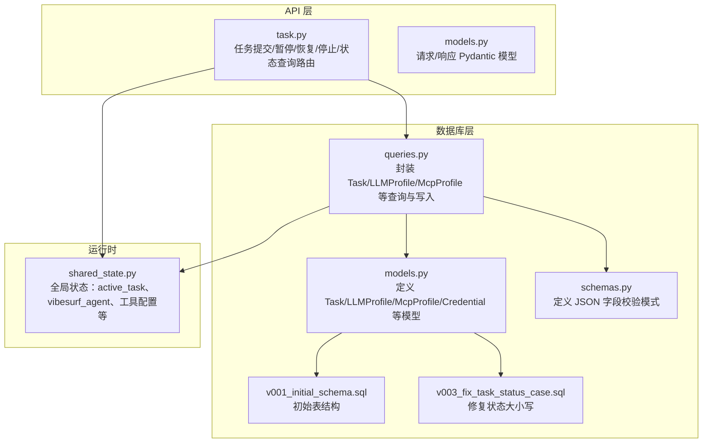
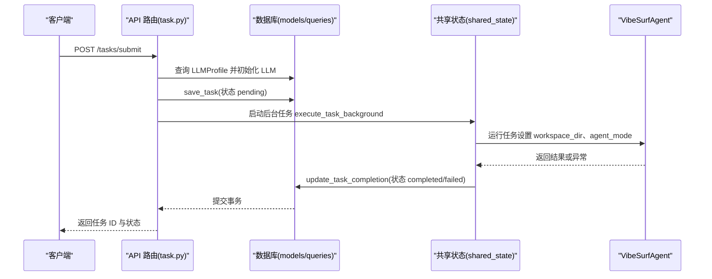
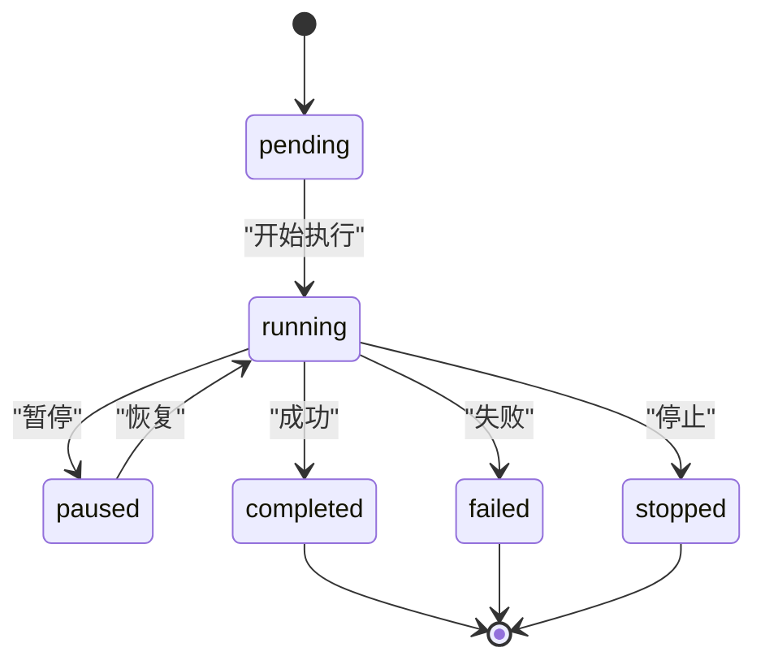
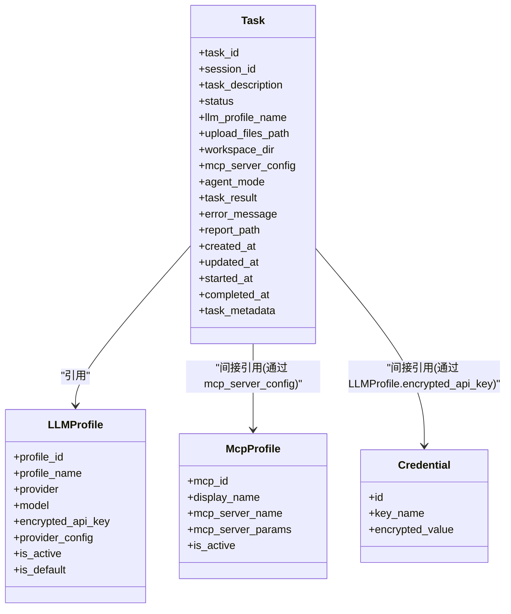
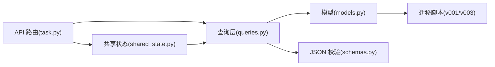

# 任务模型

<cite>
**本文引用的文件**
- [models.py](file://vibe_surf/backend/database/models.py)
- [schemas.py](file://vibe_surf/backend/database/schemas.py)
- [queries.py](file://vibe_surf/backend/database/queries.py)
- [task.py](file://vibe_surf/backend/api/task.py)
- [models.py](file://vibe_surf/backend/api/models.py)
- [v001_initial_schema.sql](file://vibe_surf/backend/database/migrations/v001_initial_schema.sql)
- [v003_fix_task_status_case.sql](file://vibe_surf/backend/database/migrations/v003_fix_task_status_case.sql)
- [shared_state.py](file://vibe_surf/backend/shared_state.py)
</cite>

## 目录
1. [简介](#简介)
2. [项目结构](#项目结构)
3. [核心组件](#核心组件)
4. [架构总览](#架构总览)
5. [详细组件分析](#详细组件分析)
6. [依赖关系分析](#依赖关系分析)
7. [性能考量](#性能考量)
8. [故障排查指南](#故障排查指南)
9. [结论](#结论)
10. [附录](#附录)

## 简介
本文件系统性地文档化 VibeSurf 的“任务模型”，聚焦于任务实体的字段定义、约束、默认值与业务规则；任务状态生命周期（pending、running、paused、completed、failed、stopped）；以及任务与 LLM 配置、MCP 工具链、Composio 工具集、浏览器会话、上传文件等其他实体的关系。同时提供 ORM 操作示例路径与典型任务数据记录示例，帮助开发者快速理解并正确使用任务模型。

## 项目结构
任务模型位于后端数据库层，配合 API 路由与共享状态模块共同完成任务提交、执行、控制与持久化。

图表来源
- [models.py](file://vibe_surf/backend/database/models.py#L94-L137)
- [schemas.py](file://vibe_surf/backend/database/schemas.py#L1-L100)
- [queries.py](file://vibe_surf/backend/database/queries.py#L441-L754)
- [task.py](file://vibe_surf/backend/api/task.py#L1-L379)
- [v001_initial_schema.sql](file://vibe_surf/backend/database/migrations/v001_initial_schema.sql#L30-L49)
- [v003_fix_task_status_case.sql](file://vibe_surf/backend/database/migrations/v003_fix_task_status_case.sql#L1-L11)
- [shared_state.py](file://vibe_surf/backend/shared_state.py#L118-L233)

章节来源
- [models.py](file://vibe_surf/backend/database/models.py#L94-L137)
- [queries.py](file://vibe_surf/backend/database/queries.py#L441-L754)
- [task.py](file://vibe_surf/backend/api/task.py#L1-L379)
- [v001_initial_schema.sql](file://vibe_surf/backend/database/migrations/v001_initial_schema.sql#L30-L49)
- [v003_fix_task_status_case.sql](file://vibe_surf/backend/database/migrations/v003_fix_task_status_case.sql#L1-L11)
- [shared_state.py](file://vibe_surf/backend/shared_state.py#L118-L233)

## 核心组件
- 任务模型（Task）
  - 表名：tasks
  - 主键：task_id（UUID 字符串）
  - 关键字段与约束：
    - session_id：非空字符串，用于标识会话
    - task_description：非空文本，任务描述
    - status：枚举，取值为 pending、running、paused、completed、failed、stopped，默认 pending
    - llm_profile_name：非空字符串，引用 LLMProfile.profile_name
    - upload_files_path/workspace_dir：可选字符串，分别指向上传文件路径与工作区目录
    - mcp_server_config：可选文本，存储 MCP 服务器配置（JSON 字符串）
    - agent_mode：字符串，默认 thinking
    - task_result/error_message/report_path：可选结果字段
    - created_at/updated_at/started_at/completed_at：时间戳，部分字段可为空
    - task_metadata：JSON 字段，用于扩展元数据
  - 索引：status、session_id、llm_profile_name、created_at
- LLM 配置模型（LLMProfile）
  - 用于管理 LLM 提供商、模型、参数与加密 API Key
- MCP 配置模型（McpProfile）
  - 用于管理 MCP 服务器配置（命令、参数、环境变量等）
- 凭证模型（Credential）
  - 存储加密后的敏感信息（如 Composio API Key）

章节来源
- [models.py](file://vibe_surf/backend/database/models.py#L94-L137)
- [v001_initial_schema.sql](file://vibe_surf/backend/database/migrations/v001_initial_schema.sql#L30-L49)
- [v003_fix_task_status_case.sql](file://vibe_surf/backend/database/migrations/v003_fix_task_status_case.sql#L1-L11)

## 架构总览
任务从 API 提交到后台执行，期间通过共享状态维护当前任务状态，并在完成后将结果写回数据库。

图表来源
- [task.py](file://vibe_surf/backend/api/task.py#L43-L146)
- [queries.py](file://vibe_surf/backend/database/queries.py#L441-L519)
- [shared_state.py](file://vibe_surf/backend/shared_state.py#L118-L233)

## 详细组件分析

### 任务实体字段定义与业务规则
- 字段清单与约束
  - task_id：主键，UUID 字符串
  - session_id：非空，用于分组同一会话内的任务
  - task_description：非空文本
  - status：枚举，取值限定为小写字符串：pending、running、paused、completed、failed、stopped；默认 pending
  - llm_profile_name：非空，引用 LLMProfile.profile_name
  - upload_files_path/workspace_dir：可选，分别指向上传文件路径与工作区目录
  - mcp_server_config：可选，JSON 字符串，存储 MCP 服务器配置
  - agent_mode：字符串，默认 thinking
  - task_result/error_message/report_path：可选，分别保存最终结果、错误信息与报告文件路径
  - created_at/updated_at：非空，默认当前时间；updated_at 由 ORM 触发器自动更新
  - started_at/completed_at：可空，首次进入 running 时写入 started_at，结束时写入 completed_at
  - task_metadata：JSON 字段，允许扩展元数据（如执行耗时、动作数、控制历史、错误恢复次数等）
- 业务规则
  - 状态流转：pending → running → completed/failed/stopped/paused；paused 可恢复为 running
  - 时间戳：running 时写 started_at；completed/failed/stopped 写 completed_at
  - 会话维度：按 session_id 聚合统计与查询
  - JSON 校验：task_metadata、mcp_server_config 等字段通过 schemas.py 中的模式进行校验与规范化

章节来源
- [models.py](file://vibe_surf/backend/database/models.py#L94-L137)
- [v001_initial_schema.sql](file://vibe_surf/backend/database/migrations/v001_initial_schema.sql#L30-L49)
- [v003_fix_task_status_case.sql](file://vibe_surf/backend/database/migrations/v003_fix_task_status_case.sql#L1-L11)
- [schemas.py](file://vibe_surf/backend/database/schemas.py#L1-L100)

### 任务状态生命周期
- pending：任务已创建但尚未开始执行
- running：任务正在执行中
- paused：任务被暂停（可恢复）
- completed：任务成功完成
- failed：任务执行失败
- stopped：任务被强制停止

图表来源
- [models.py](file://vibe_surf/backend/database/models.py#L16-L24)
- [queries.py](file://vibe_surf/backend/database/queries.py#L614-L648)

### 任务与相关实体的关系
- 与 LLM 配置（LLMProfile）
  - 通过 llm_profile_name 引用 LLMProfile.profile_name
  - 提交任务前需验证并初始化对应 LLM 实例
- 与 MCP 工具链（McpProfile）
  - 通过 mcp_server_config（JSON 字符串）传递 MCP 服务器配置
  - 执行前会检查数据库中活动 MCP 配置并同步到工具
- 与 Composio 工具集
  - 执行前会加载启用的 Composio 工具集并注册到工具
- 与浏览器会话
  - 通过共享状态设置 workspace_dir、agent_mode 等
- 与上传文件（UploadedFile）
  - 通过 upload_files_path 关联上传文件路径（与文件记录表存在外键关联）

图表来源
- [models.py](file://vibe_surf/backend/database/models.py#L94-L137)
- [models.py](file://vibe_surf/backend/database/models.py#L57-L90)
- [models.py](file://vibe_surf/backend/database/models.py#L168-L191)
- [models.py](file://vibe_surf/backend/database/models.py#L217-L235)

### ORM 操作示例（路径）
以下为常用 ORM 操作的调用路径，便于直接定位实现位置：
- 创建/更新任务
  - save_task：[save_task](file://vibe_surf/backend/database/queries.py#L445-L519)
- 查询任务
  - get_task：[get_task](file://vibe_surf/backend/database/queries.py#L525-L529)
  - get_tasks_by_session：[get_tasks_by_session](file://vibe_surf/backend/database/queries.py#L535-L551)
  - get_recent_tasks：[get_recent_tasks](file://vibe_surf/backend/database/queries.py#L556-L567)
  - get_running_tasks：[get_running_tasks](file://vibe_surf/backend/database/queries.py#L660-L669)
  - get_active_task：[get_active_task](file://vibe_surf/backend/database/queries.py#L672-L682)
  - get_tasks_by_llm_profile：[get_tasks_by_llm_profile](file://vibe_surf/backend/database/queries.py#L684-L700)
- 更新任务状态
  - update_task_status：[update_task_status](file://vibe_surf/backend/database/queries.py#L614-L648)
  - update_task_completion：[update_task_completion](file://vibe_surf/backend/database/queries.py#L705-L731)
- 删除任务
  - delete_task：[delete_task](file://vibe_surf/backend/database/queries.py#L650-L655)

章节来源
- [queries.py](file://vibe_surf/backend/database/queries.py#L441-L754)

### API 使用示例（路径）
- 提交任务
  - submit_task：[submit_task](file://vibe_surf/backend/api/task.py#L43-L146)
- 控制任务
  - pause_task/resume_task/stop_task：[pause_task](file://vibe_surf/backend/api/task.py#L197-L230)、[resume_task](file://vibe_surf/backend/api/task.py#L232-L264)、[stop_task](file://vibe_surf/backend/api/task.py#L266-L303)
- 获取状态
  - check_task_status/get_detailed_task_status：[check_task_status](file://vibe_surf/backend/api/task.py#L34-L41)、[get_detailed_task_status](file://vibe_surf/backend/api/task.py#L335-L379)

章节来源
- [task.py](file://vibe_surf/backend/api/task.py#L1-L379)

### 数据记录示例（结构变化）
- pending 状态
  - 字段：task_id、session_id、task_description、status=pending、llm_profile_name、agent_mode、created_at/updated_at
  - 典型字段：upload_files_path、workspace_dir、mcp_server_config、task_result、error_message、report_path、started_at、completed_at、task_metadata 均为空或未设置
- running 状态
  - 在 pending 基础上新增 started_at（首次进入 running 时写入）
- completed/failed/stopped 状态
  - 在 running 基础上新增 completed_at（结束时写入）
  - completed：task_result、report_path 可能有值
  - failed：error_message 可能有值
  - stopped：通常由外部控制导致，error_message 可能为空
- task_metadata（JSON）
  - 可包含执行耗时、动作数、控制历史、错误恢复次数、最后错误、创建来源等

章节来源
- [queries.py](file://vibe_surf/backend/database/queries.py#L477-L481)
- [queries.py](file://vibe_surf/backend/database/queries.py#L628-L632)
- [schemas.py](file://vibe_surf/backend/database/schemas.py#L1-L100)

## 依赖关系分析
- 组件耦合
  - API 路由依赖数据库查询层（queries），查询层依赖模型层（models）
  - 执行流程依赖共享状态（shared_state）维护 active_task 与工具配置
- 外部依赖
  - LLM 配置通过 LLMProfile 管理，API 提交时需校验并初始化
  - MCP 工具链通过 McpProfile 管理，执行前动态加载并注册
  - Composio 工具集通过 Credential 与数据库集成
- 索引与性能
  - 对 status/session_id/llm_profile_name/created_at 建立索引，支持高频查询与聚合

图表来源
- [task.py](file://vibe_surf/backend/api/task.py#L1-L379)
- [queries.py](file://vibe_surf/backend/database/queries.py#L441-L754)
- [models.py](file://vibe_surf/backend/database/models.py#L94-L137)
- [schemas.py](file://vibe_surf/backend/database/schemas.py#L76-L100)
- [shared_state.py](file://vibe_surf/backend/shared_state.py#L118-L233)
- [v001_initial_schema.sql](file://vibe_surf/backend/database/migrations/v001_initial_schema.sql#L80-L97)

## 性能考量
- 索引优化
  - 为 tasks.status、tasks.session_id、tasks.llm_profile_name、tasks.created_at 建立索引，提升筛选与排序效率
- 时间戳更新
  - 使用触发器自动更新 updated_at，避免应用层重复逻辑
- JSON 字段
  - 使用 schemas.validate_json_field 对 JSON 字段进行校验与规范化，减少无效数据写入
- 会话聚合
  - 通过 group by session_id 聚合任务计数与最新状态，便于前端展示

章节来源
- [v001_initial_schema.sql](file://vibe_surf/backend/database/migrations/v001_initial_schema.sql#L80-L97)
- [models.py](file://vibe_surf/backend/database/models.py#L158-L167)
- [schemas.py](file://vibe_surf/backend/database/schemas.py#L84-L100)

## 故障排查指南
- 提交任务失败
  - 检查是否已有活跃任务（单任务模式限制）：[check_task_status](file://vibe_surf/backend/api/task.py#L34-L41)
  - 检查 LLM 配置可用性与连接测试：[submit_task 初始化 LLM](file://vibe_surf/backend/api/task.py#L80-L92)
- 状态不一致
  - 确认状态大小写一致性（迁移脚本已修复为小写）：[v003_fix_task_status_case.sql](file://vibe_surf/backend/database/migrations/v003_fix_task_status_case.sql#L1-L11)
- 执行中断
  - 暂停/恢复/停止接口返回错误时，检查共享状态 active_task 是否存在且状态匹配：[pause/resume/stop](file://vibe_surf/backend/api/task.py#L197-L303)
- 结果未落库
  - 查看后台执行函数是否调用 update_task_completion 并提交事务：[execute_task_background](file://vibe_surf/backend/shared_state.py#L118-L233)

章节来源
- [task.py](file://vibe_surf/backend/api/task.py#L34-L146)
- [v003_fix_task_status_case.sql](file://vibe_surf/backend/database/migrations/v003_fix_task_status_case.sql#L1-L11)
- [shared_state.py](file://vibe_surf/backend/shared_state.py#L118-L233)

## 结论
任务模型围绕“单任务执行”设计，通过枚举状态、时间戳与 JSON 扩展字段实现清晰的状态流转与可扩展元数据。API 层负责提交与控制，数据库层负责持久化，共享状态层负责运行时上下文与工具配置同步。遵循本文档的字段定义、状态规则与 ORM 示例，可稳定地构建与维护任务生命周期管理。

## 附录
- JSON 字段校验模式
  - task_metadata：[TaskMetadata](file://vibe_surf/backend/database/schemas.py#L11-L31)
  - llm_configuration：[LLMConfiguration](file://vibe_surf/backend/database/schemas.py#L32-L47)
  - mcp_server_config：[McpServerConfig](file://vibe_surf/backend/database/schemas.py#L56-L59)
  - controller_configuration（兼容旧版）：[ControllerConfiguration](file://vibe_surf/backend/database/schemas.py#L60-L74)
- API 请求/响应模型
  - 任务创建请求：[TaskCreateRequest](file://vibe_surf/backend/api/models.py#L101-L110)
  - 任务控制请求：[TaskControlRequest](file://vibe_surf/backend/api/models.py#L111-L114)
  - 任务响应模型：[TaskResponse](file://vibe_surf/backend/api/models.py#L115-L159)

章节来源
- [schemas.py](file://vibe_surf/backend/database/schemas.py#L1-L100)
- [models.py](file://vibe_surf/backend/api/models.py#L101-L159)