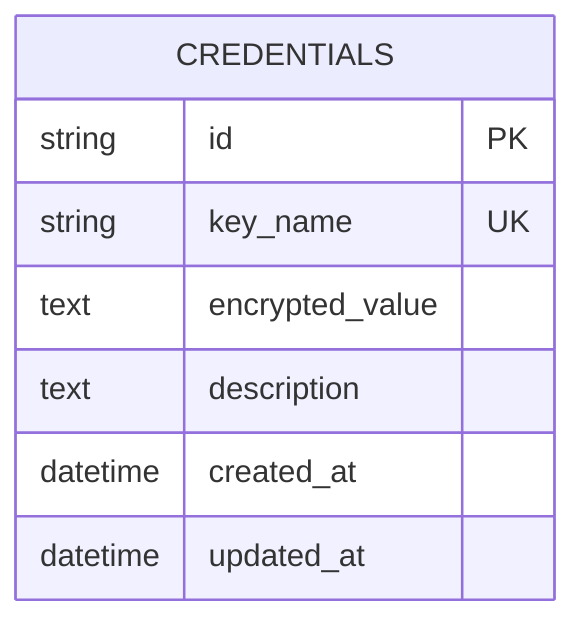
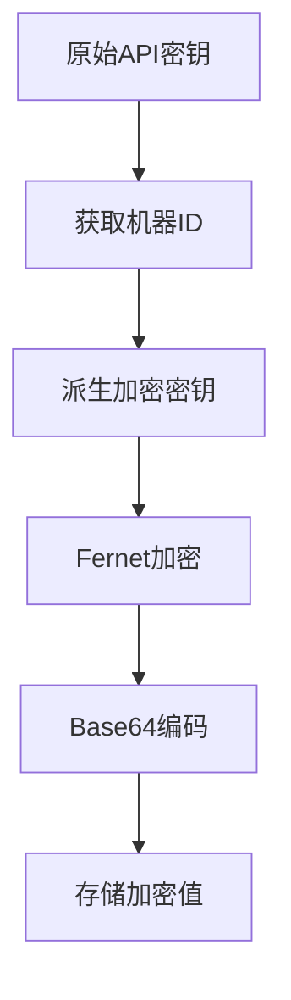
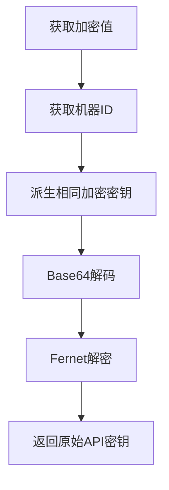
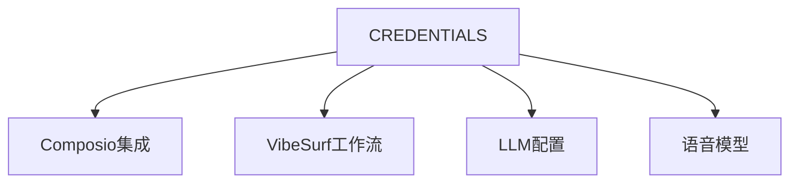
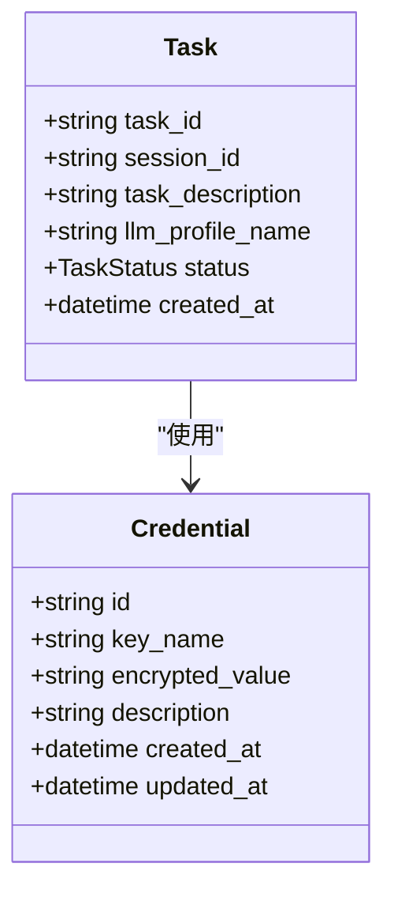

# 凭证模型

<cite>
**本文档引用的文件**   
- [credentials.py](file://vibe_surf/backend/database/models.py#L217-L234)
- [encryption.py](file://vibe_surf/backend/utils/encryption.py#L76-L127)
- [queries.py](file://vibe_surf/backend/database/queries.py#L1348-L1430)
- [v006_add_credentials_table.sql](file://vibe_surf/backend/database/migrations/v006_add_credentials_table.sql#L1-L26)
- [composio.py](file://vibe_surf/backend/api/composio.py#L148-L194)
- [vibesurf.py](file://vibe_surf/backend/api/vibesurf.py#L111-L183)
</cite>

## 目录
1. [引言](#引言)
2. [凭证模型字段定义](#凭证模型字段定义)
3. [加密存储机制](#加密存储机制)
4. [实体关系](#实体关系)
5. [ORM操作示例](#orm操作示例)
6. [数据记录示例](#数据记录示例)
7. [结论](#结论)

## 引言
VibeSurf凭证模型是系统安全架构的核心组件，负责安全存储和管理敏感信息，如API密钥和其他认证凭据。该模型通过加密机制确保敏感数据在存储过程中的安全性，并为系统中的各种服务提供安全的凭据访问。凭证模型的设计遵循最小权限原则，确保只有授权组件才能访问特定的凭据。

**凭证模型的主要特点包括：**
- 使用机器特定密钥进行数据加密
- 支持多种服务类型的凭据存储
- 提供完整的创建、读取、更新和删除(CRUD)操作
- 与LLM配置文件、代理和任务等其他实体建立明确的关系

本文档将深入分析凭证模型的完整实现，包括字段定义、加密机制、实体关系和实际操作示例。

**Section sources**
- [models.py](file://vibe_surf/backend/database/models.py#L217-L234)

## 凭证模型字段定义
凭证模型包含多个关键字段，每个字段都有特定的数据类型、约束条件和业务规则。这些字段共同构成了凭证实体的完整数据结构。

### 字段详细说明
凭证模型包含以下核心字段：



**Diagram sources**
- [models.py](file://vibe_surf/backend/database/models.py#L217-L234)
- [v006_add_credentials_table.sql](file://vibe_surf/backend/database/migrations/v006_add_credentials_table.sql#L1-L26)

#### id 字段
- **数据类型**: VARCHAR(36)
- **约束条件**: 主键，非空
- **默认值**: 自动生成的UUID
- **业务规则**: 唯一标识每个凭证记录，使用UUID确保全局唯一性

#### key_name 字段
- **数据类型**: VARCHAR(100)
- **约束条件**: 非空，唯一
- **默认值**: 无
- **业务规则**: 凭证的逻辑名称，用于标识特定服务的凭据，如"COMPOSIO_API_KEY"或"VIBESURF_API_KEY"

#### encrypted_value 字段
- **数据类型**: TEXT
- **约束条件**: 可为空
- **默认值**: 无
- **业务规则**: 存储经过加密的凭据值，使用机器特定密钥进行加密，确保数据安全性

#### description 字段
- **数据类型**: TEXT
- **约束条件**: 可为空
- **默认值**: 无
- **业务规则**: 提供凭据的描述信息，帮助用户理解凭据的用途

#### created_at 字段
- **数据类型**: DATETIME
- **约束条件**: 非空
- **默认值**: CURRENT_TIMESTAMP
- **业务规则**: 记录凭据创建的时间戳，用于审计和跟踪

#### updated_at 字段
- **数据类型**: DATETIME
- **约束条件**: 非空
- **默认值**: CURRENT_TIMESTAMP
- **业务规则**: 记录凭据最后更新的时间戳，通过数据库触发器自动更新

**Section sources**
- [models.py](file://vibe_surf/backend/database/models.py#L217-L234)
- [v006_add_credentials_table.sql](file://vibe_surf/backend/database/migrations/v006_add_credentials_table.sql#L1-L26)

## 加密存储机制
凭证模型的加密存储机制是系统安全性的关键组成部分，确保敏感信息在存储过程中不会被未授权访问。

### 加密算法
系统使用Fernet对称加密算法进行数据加密，该算法基于AES-128-CBC模式，提供强大的数据保护。



**Diagram sources**
- [encryption.py](file://vibe_surf/backend/utils/encryption.py#L76-L96)

### 密钥管理策略
加密密钥的生成和管理遵循严格的安全策略：

1. **密钥派生**: 使用PBKDF2-HMAC-SHA256算法从机器MAC地址派生加密密钥
2. **盐值**: 使用固定盐值"vibesurf_warmshao_2025"确保密钥派生的一致性
3. **迭代次数**: 100,000次迭代，增加暴力破解的难度
4. **备用机制**: 如果无法获取MAC地址，则使用本地用户ID作为密钥源

```python
def derive_key(machine_id: str, salt: bytes = None) -> bytes:
    """从机器ID派生加密密钥。"""
    if salt is None:
        salt = b'vibesurf_warmshao_2025'
    
    password = machine_id.encode('utf-8')
    kdf = PBKDF2HMAC(
        algorithm=hashes.SHA256(),
        length=32,
        salt=salt,
        iterations=100000,
    )
    key = base64.urlsafe_b64encode(kdf.derive(password))
    return key
```

### 解密流程
解密流程与加密流程相对应，确保只有在同一机器上才能成功解密数据：



**Diagram sources**
- [encryption.py](file://vibe_surf/backend/utils/encryption.py#L98-L127)

解密流程具有容错机制，如果使用MAC地址派生的密钥失败，系统会尝试使用本地用户ID作为备用密钥源，确保在机器配置变化时仍能访问历史数据。

**Section sources**
- [encryption.py](file://vibe_surf/backend/utils/encryption.py#L23-L127)

## 实体关系
凭证模型与其他核心实体存在明确的关系，这些关系支持系统的整体功能。

### 与服务的关联
凭证模型通过key_name字段与各种服务建立关联：



**Diagram sources**
- [composio.py](file://vibe_surf/backend/api/composio.py#L148-L194)
- [vibesurf.py](file://vibe_surf/backend/api/vibesurf.py#L111-L183)

### 与任务的关系
凭证为任务执行提供必要的认证信息，确保任务能够访问所需的外部服务。



**Diagram sources**
- [models.py](file://vibe_surf/backend/database/models.py#L94-L135)
- [models.py](file://vibe_surf/backend/database/models.py#L217-L234)

**Section sources**
- [models.py](file://vibe_surf/backend/database/models.py#L94-L135)
- [models.py](file://vibe_surf/backend/database/models.py#L217-L234)

## ORM操作示例
以下示例展示了凭证模型的常见ORM操作，包括创建、查询、更新和删除。

### 创建凭证
```python
async def store_credential(db: AsyncSession, key_name: str, value: str, description: Optional[str] = None) -> bool:
    """存储加密凭证"""
    try:
        # 加密值
        encrypted_value = encrypt_api_key(value)
        
        # 检查凭证是否存在
        result = await db.execute(
            select(Credential).where(Credential.key_name == key_name)
        )
        existing_credential = result.scalar_one_or_none()
        
        if existing_credential:
            # 更新现有凭证
            await db.execute(
                update(Credential)
                .where(Credential.key_name == key_name)
                .values(
                    encrypted_value=encrypted_value,
                    description=description,
                    updated_at=func.now()
                )
            )
        else:
            # 创建新凭证
            credential = Credential(
                key_name=key_name,
                encrypted_value=encrypted_value,
                description=description
            )
            db.add(credential)
        
        await db.flush()
        return True
        
    except Exception as e:
        logger.error(f"存储凭证失败 {key_name}: {e}")
        return False
```

### 查询凭证
```python
async def get_credential(db: AsyncSession, key_name: str) -> Optional[str]:
    """获取解密的凭证值"""
    try:
        result = await db.execute(
            select(Credential).where(Credential.key_name == key_name)
        )
        credential = result.scalar_one_or_none()
        
        if not credential:
            return None
            
        decrypted_value = decrypt_api_key(credential.encrypted_value)
        return decrypted_value
        
    except Exception as e:
        logger.error(f"获取凭证失败 {key_name}: {e}")
        return None
```

### 删除凭证
```python
async def delete_credential(db: AsyncSession, key_name: str) -> bool:
    """删除凭证"""
    try:
        result = await db.execute(
            delete(Credential).where(Credential.key_name == key_name)
        )
        return result.rowcount > 0
    except Exception as e:
        logger.error(f"删除凭证失败 {key_name}: {e}")
        return False
```

**Section sources**
- [queries.py](file://vibe_surf/backend/database/queries.py#L1348-L1430)

## 数据记录示例
以下示例展示了凭证在加密前后的数据结构变化。

### 加密前数据
```json
{
  "id": "a1b2c3d4-e5f6-7890-g1h2-i3j4k5l6m7n8",
  "key_name": "COMPOSIO_API_KEY",
  "value": "csk_1234567890abcdefghijklmnopqrstuvwxyz",
  "description": "Composio API密钥用于工具集成",
  "created_at": "2025-01-15T10:30:00Z",
  "updated_at": "2025-01-15T10:30:00Z"
}
```

### 加密后数据
```json
{
  "id": "a1b2c3d4-e5f6-7890-g1h2-i3j4k5l6m7n8",
  "key_name": "COMPOSIO_API_KEY",
  "encrypted_value": "gAAAAABm7XqYAAaXJt9vZ3Q2W5R8sT1uV4wX7zA0cD3fG6iJ9lM2oP5sR8uV1xY4A7dG0jK3nQ6tW9yB2eE5hH8kL1nO4rU7wZ0cD3fG6iJ9lM2oP5sR8uV1xY4A7dG0jK3nQ6tW9yB2eE5hH8kL1nO4rU7wZ",
  "description": "Composio API密钥用于工具集成",
  "created_at": "2025-01-15T10:30:00Z",
  "updated_at": "2025-01-15T10:30:00Z"
}
```

### 数据结构变化说明
1. **value字段**: 原始API密钥被替换为`encrypted_value`字段
2. **数据格式**: 明文字符串转换为Base64编码的加密数据
3. **数据长度**: 从约40-50个字符增加到约300个字符
4. **字符集**: 从字母数字字符扩展到包含特殊字符的Base64字符集

这种转换确保了敏感信息在数据库中的安全性，即使数据库被未授权访问，攻击者也无法直接获取API密钥。

**Section sources**
- [encryption.py](file://vibe_surf/backend/utils/encryption.py#L76-L127)
- [models.py](file://vibe_surf/backend/database/models.py#L217-L234)

## 结论
VibeSurf凭证模型通过精心设计的字段结构和强大的加密机制，为系统提供了安全可靠的凭据管理解决方案。模型的核心优势在于：

1. **安全性**: 使用机器特定密钥和强加密算法保护敏感数据
2. **灵活性**: 支持多种服务类型的凭据存储
3. **可维护性**: 清晰的字段定义和约束条件确保数据完整性
4. **可扩展性**: 简单的实体关系支持未来功能扩展

凭证模型与系统其他组件的集成确保了安全凭据访问，同时保持了良好的性能和可用性。通过遵循最佳安全实践，该模型为VibeSurf平台的整体安全性奠定了坚实基础。