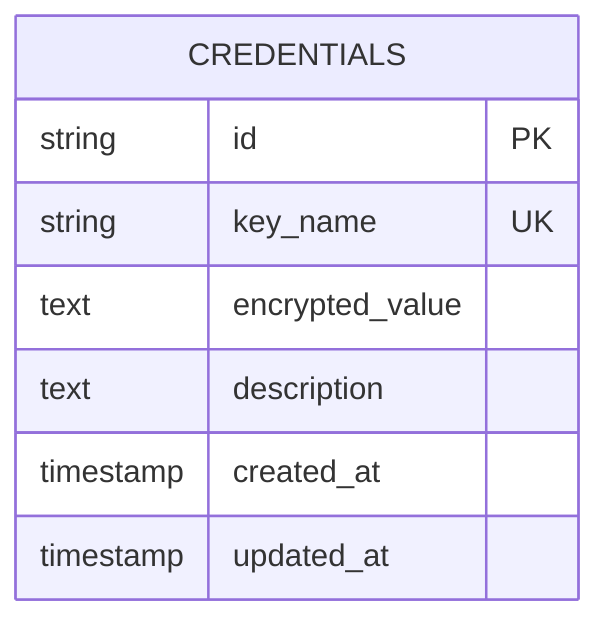
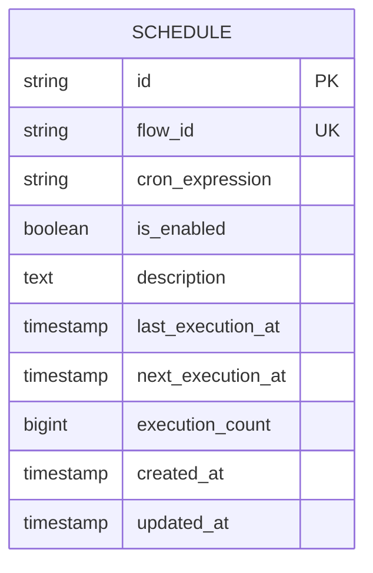
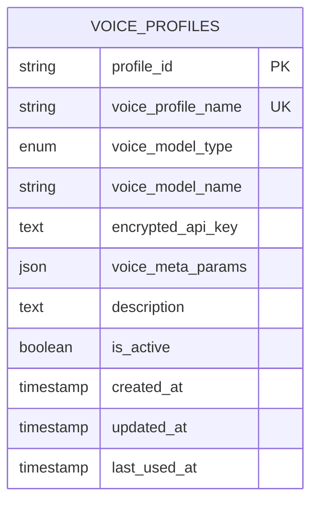
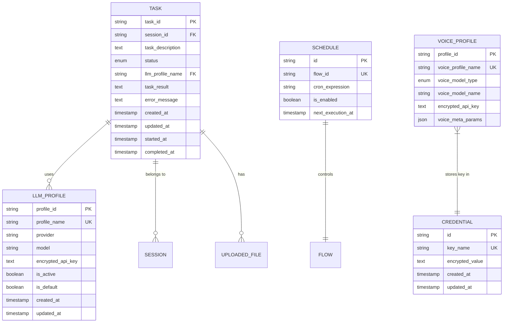

# 数据模型

<cite>
**本文档引用的文件**
- [models.py](file://vibe_surf/backend/database/models.py)
- [schemas.py](file://vibe_surf/backend/database/schemas.py)
- [queries.py](file://vibe_surf/backend/database/queries.py)
- [v001_initial_schema.sql](file://vibe_surf/backend/database/migrations/v001_initial_schema.sql)
- [v004_add_voice_profiles.sql](file://vibe_surf/backend/database/migrations/v004_add_voice_profiles.sql)
- [v006_add_credentials_table.sql](file://vibe_surf/backend/database/migrations/v006_add_credentials_table.sql)
- [v007_add_schedule_table.sql](file://vibe_surf/backend/database/migrations/v007_add_schedule_table.sql)
- [manager.py](file://vibe_surf/backend/database/manager.py)
- [task.py](file://vibe_surf/backend/api/task.py)
- [voices.py](file://vibe_surf/backend/api/voices.py)
- [api-client.js](file://vibe_surf/chrome_extension/scripts/api-client.js)
- [settings-profiles.js](file://vibe_surf/chrome_extension/scripts/settings-profiles.js)
</cite>

## 目录
1. [引言](#引言)
2. [核心实体分析](#核心实体分析)
   1. [任务 (Task)](#任务-task)
   2. [代理 (Agent)](#代理-agent)
   3. [浏览器会话 (BrowserSession)](#浏览器会话-browsersession)
   4. [凭证 (Credentials)](#凭证-credentials)
   5. [计划 (Schedule)](#计划-schedule)
   6. [语音配置文件 (VoiceProfiles)](#语音配置文件-voiceprofiles)
3. [实体关系与ER图](#实体关系与er图)
4. [数据验证与业务规则](#数据验证与业务规则)
5. [ORM映射与数据访问](#orm映射与数据访问)
6. [示例数据](#示例数据)

## 引言
本文档详细描述了VibeSurf项目的数据模型，重点关注数据库中的核心实体。该模型基于SQLAlchemy ORM实现，采用SQLite作为默认数据库，并通过迁移脚本进行版本管理。核心实体包括任务（Task）、凭证（Credentials）、计划（Schedule）和语音配置文件（VoiceProfiles），它们共同支持VibeSurf的自动化代理执行、工作流调度和语音交互功能。模型设计强调安全性，对API密钥等敏感信息进行加密存储，并通过索引优化查询性能。

**Section sources**
- [models.py](file://vibe_surf/backend/database/models.py#L1-L289)
- [manager.py](file://vibe_surf/backend/database/manager.py#L1-L319)

## 核心实体分析

### 任务 (Task)
`Task` 实体是VibeSurf系统的核心，代表一个待执行或正在执行的代理任务。

**字段定义:**
- `task_id`: (String, 36) 主键，使用UUID7生成的唯一任务ID。
- `session_id`: (String, 36) 外键，关联到用户会话，用于组织任务。
- `task_description`: (Text) 任务的详细描述或指令。
- `status`: (Enum) 任务状态，枚举值包括 `pending`, `running`, `paused`, `completed`, `failed`, `stopped`。
- `llm_profile_name`: (String, 100) 外键，引用 `LLMProfile.profile_name`，指定执行此任务所用的语言模型配置。
- `upload_files_path`: (String, 500) 可选，上传文件的存储路径。
- `workspace_dir`: (String, 500) 可选，任务的工作目录路径。
- `mcp_server_config`: (Text) 可选，MCP（Model Context Protocol）服务器的配置，以JSON字符串形式存储。
- `task_result`: (Text) 可选，任务执行完成后的结果，通常为Markdown格式。
- `error_message`: (Text) 可选，任务执行失败时的错误信息。
- `report_path`: (String, 500) 可选，生成报告文件的路径。
- `agent_mode`: (String, 50) 代理执行模式，如 `thinking` 或 `direct`。
- `task_metadata`: (JSON) 可选，存储任务的元数据，如执行时长、动作计数等。
- `created_at`: (DateTime) 任务创建时间。
- `updated_at`: (DateTime) 任务最后更新时间，由触发器自动维护。
- `started_at`: (DateTime) 可选，任务开始执行的时间。
- `completed_at`: (DateTime) 可选，任务完成或失败的时间。

**业务规则:**
- `status` 字段的更新会触发时间戳的自动更新（`started_at` 和 `completed_at`）。
- `llm_profile_name` 字段确保了任务与特定的LLM配置文件的关联，而不是直接存储API密钥。
- 通过 `session_id` 可以查询一个会话下的所有任务历史。

**Section sources**
- [models.py](file://vibe_surf/backend/database/models.py#L94-L137)
- [v001_initial_schema.sql](file://vibe_surf/backend/database/migrations/v001_initial_schema.sql#L30-L49)
- [task.py](file://vibe_surf/backend/api/task.py#L43-L146)

### 代理 (Agent)
在VibeSurf的数据模型中，“代理”(Agent) 的概念主要通过 `Task` 实体和 `LLMProfile` 实体来体现，而不是一个独立的数据库表。代理的行为和配置是任务执行上下文的一部分。

**核心关联:**
- **LLM配置**: 代理使用的语言模型由 `LLMProfile` 实体管理。`Task` 实体通过 `llm_profile_name` 字段引用 `LLMProfile`，从而继承其 `provider` (如OpenAI, Anthropic), `model`, `temperature`, `max_tokens` 等参数。
- **执行模式**: `Task` 实体的 `agent_mode` 字段定义了代理的执行策略，例如是进行深度思考还是直接执行。
- **技能**: 代理的技能（skills）由后端的 `vibesurf_tools` 注册表动态管理，这些信息不直接存储在数据库中，而是通过API端点（如 `/agent/get_all_skills`）提供。

**Section sources**
- [models.py](file://vibe_surf/backend/database/models.py#L57-L93)
- [task.py](file://vibe_surf/backend/api/task.py#L69-L77)
- [agent.py](file://vibe_surf/backend/api/agent.py#L14-L38)

### 浏览器会话 (BrowserSession)
“浏览器会话”(BrowserSession) 在数据模型中主要通过 `Task` 实体的 `session_id` 来关联。一个 `session_id` 可以关联多个 `Task`，形成一个会话内的任务序列。

**关键点:**
- `session_id` 是连接所有与特定用户交互相关的任务的纽带。
- 虽然没有独立的 `BrowserSession` 表，但 `session_id` 的存在使得系统可以追踪和管理一个完整会话的生命周期。
- 上传的文件通过 `UploadedFile` 表的 `session_id` 字段与会话关联。

**Section sources**
- [models.py](file://vibe_surf/backend/database/models.py#L102)
- [task.py](file://vibe_surf/backend/api/task.py#L45)
- [main.py](file://vibe_surf/backend/main.py#L661-L669)

### 凭证 (Credentials)
`Credential` 实体用于安全地存储加密的API密钥和其他敏感凭证。

**字段定义:**
- `id`: (String, 36) 主键，唯一标识符。
- `key_name`: (String, 100) 凭证的名称，必须唯一，例如 `COMPOSIO_API_KEY`。
- `encrypted_value`: (Text) 经过加密的凭证值。系统使用基于MAC地址的密钥进行加密，确保凭证的安全性。
- `description`: (Text) 可选，凭证的描述信息。
- `created_at`: (DateTime) 凭证创建时间。
- `updated_at`: (DateTime) 凭证最后更新时间，由触发器自动维护。

**业务规则:**
- 所有敏感值在存储前都必须经过 `encrypt_api_key` 函数加密。
- 当需要使用凭证时，通过 `decrypt_api_key` 函数解密。
- 该表的设计避免了在 `LLMProfile` 或 `VoiceProfile` 中直接存储明文API密钥，提高了安全性。



**Diagram sources**
- [models.py](file://vibe_surf/backend/database/models.py#L217-L234)
- [v006_add_credentials_table.sql](file://vibe_surf/backend/database/migrations/v006_add_credentials_table.sql#L8-L15)

**Section sources**
- [models.py](file://vibe_surf/backend/database/models.py#L217-L234)
- [queries.py](file://vibe_surf/backend/database/queries.py#L1345-L1430)
- [encryption.py](file://vibe_surf/backend/utils/encryption.py#L98-L126)

### 计划 (Schedule)
`Schedule` 实体用于管理工作流的自动化调度。

**字段定义:**
- `id`: (String, 36) 主键，唯一标识符。
- `flow_id`: (String, 36) 外键，关联到特定的工作流（flow），且必须唯一，即一个工作流只能有一个计划。
- `cron_expression`: (String, 100) 可选，标准的cron表达式，用于定义调度计划。
- `is_enabled`: (Boolean) 调度是否启用。
- `description`: (Text) 可选，计划的描述。
- `last_execution_at`: (DateTime) 可选，上一次执行的时间。
- `next_execution_at`: (DateTime) 可选，下一次计划执行的时间。
- `execution_count`: (BigInteger) 执行次数计数器。
- `created_at`: (DateTime) 计划创建时间。
- `updated_at`: (DateTime) 计划最后更新时间。

**业务规则:**
- `flow_id` 的唯一性约束确保了每个工作流最多只能有一个调度计划。
- 当 `cron_expression` 更新时，系统会自动计算并更新 `next_execution_at`。
- `execution_count` 在每次成功执行后递增。



**Diagram sources**
- [models.py](file://vibe_surf/backend/database/models.py#L258-L283)
- [v007_add_schedule_table.sql](file://vibe_surf/backend/database/migrations/v007_add_schedule_table.sql#L4-L15)

**Section sources**
- [models.py](file://vibe_surf/backend/database/models.py#L258-L283)
- [queries.py](file://vibe_surf/backend/database/queries.py#L1432-L1599)
- [settings-workflow.js](file://vibe_surf/chrome_extension/scripts/settings-workflow.js#L2234-L2358)

### 语音配置文件 (VoiceProfiles)
`VoiceProfile` 实体用于管理语音识别（ASR）和语音合成（TTS）模型的配置。

**字段定义:**
- `profile_id`: (String, 36) 主键，唯一标识符。
- `voice_profile_name`: (String, 100) 配置文件的名称，必须唯一。
- `voice_model_type`: (Enum) 模型类型，枚举值为 `asr` (语音识别) 或 `tts` (语音合成)。
- `voice_model_name`: (String, 100) 具体的语音模型名称，如 `openai-asr`, `qwen-asr`。
- `encrypted_api_key`: (Text) 可选，加密存储的API密钥。
- `voice_meta_params`: (JSON) 可选，模型特定的元参数，如 `base_url`。
- `description`: (Text) 可选，配置文件的描述。
- `is_active`: (Boolean) 配置文件是否激活。
- `created_at`: (DateTime) 配置文件创建时间。
- `updated_at`: (DateTime) 配置文件最后更新时间，由触发器自动维护。
- `last_used_at`: (DateTime) 可选，最后使用时间。

**业务规则:**
- `voice_model_type` 的值被限制为 `asr` 或 `tts`。
- API密钥在存储前会被加密，使用时再解密。
- `voice_meta_params` 字段的灵活性允许支持不同语音模型的特定配置。



**Diagram sources**
- [models.py](file://vibe_surf/backend/database/models.py#L29-L55)
- [v004_add_voice_profiles.sql](file://vibe_surf/backend/database/migrations/v004_add_voice_profiles.sql#L9-L22)

**Section sources**
- [models.py](file://vibe_surf/backend/database/models.py#L29-L55)
- [queries.py](file://vibe_surf/backend/database/queries.py#L934-L1120)
- [voices.py](file://vibe_surf/backend/api/voices.py#L49-L481)
- [settings-profiles.js](file://vibe_surf/chrome_extension/scripts/settings-profiles.js#L130-L330)

## 实体关系与ER图
VibeSurf的数据模型实体之间主要通过外键和引用关系进行关联，而非传统的外键约束。以下是核心实体之间的关系：

- **任务 (Task)** 与 **LLM配置文件 (LLMProfile)**: 一个任务引用一个LLM配置文件（通过 `llm_profile_name` 字段），而一个LLM配置文件可以被多个任务引用。这是一对多关系。
- **任务 (Task)** 与 **会话 (Session)**: 一个会话可以包含多个任务（通过 `session_id` 字段），而一个任务只属于一个会话。这是一对多关系。
- **任务 (Task)** 与 **上传文件 (UploadedFile)**: 一个任务可以关联多个上传文件（通过 `session_id` 字段），而一个文件属于一个会话（进而属于一个任务序列）。这是一对多关系。
- **语音配置文件 (VoiceProfile)** 与 **凭证 (Credential)**: 语音配置文件不直接引用凭证表，而是直接在 `encrypted_api_key` 字段中存储加密后的密钥。这是一种松耦合的设计。
- **计划 (Schedule)** 与 **工作流 (Flow)**: 一个计划对应一个工作流（通过 `flow_id` 字段），且一个工作流最多只能有一个计划。这是一对一关系。



**Diagram sources**
- [models.py](file://vibe_surf/backend/database/models.py#L29-L289)

## 数据验证与业务规则
VibeSurf的数据模型通过多种机制确保数据的完整性和业务逻辑的正确性。

**数据验证:**
- **唯一性约束**: `LLMProfile.profile_name`, `VoiceProfile.voice_profile_name`, `Credential.key_name`, `Schedule.flow_id` 等字段都设置了唯一性约束，防止重复创建。
- **非空约束**: 关键字段如 `Task.task_description`, `Task.status`, `Task.llm_profile_name` 等都标记为 `nullable=False`。
- **枚举约束**: `Task.status` 和 `VoiceProfile.voice_model_type` 使用 `Enum` 类型，确保值只能是预定义的选项。
- **JSON Schema验证**: `schemas.py` 文件定义了 `TaskMetadata` 等Pydantic模型，用于在应用层对JSON字段进行结构和类型验证。

**业务规则:**
- **时间戳自动更新**: 通过数据库触发器（Triggers）自动维护 `updated_at` 字段，确保每次记录更新时该字段都会被刷新。
- **状态机**: `Task` 的状态转换（如从 `pending` 到 `running`）由业务逻辑控制，并在状态改变时自动更新 `started_at` 和 `completed_at` 时间戳。
- **加密存储**: 所有API密钥等敏感信息在存储前都通过 `encrypt_api_key` 函数进行加密，读取时再通过 `decrypt_api_key` 解密，密钥与机器的MAC地址绑定。
- **软删除**: `UploadedFile` 表使用 `is_deleted` 标志位实现软删除，而不是直接从数据库中移除记录。

**Section sources**
- [models.py](file://vibe_surf/backend/database/models.py#L17-L24)
- [v001_initial_schema.sql](file://vibe_surf/backend/database/migrations/v001_initial_schema.sql#L48)
- [v004_add_voice_profiles.sql](file://vibe_surf/backend/database/migrations/v004_add_voice_profiles.sql#L21)
- [schemas.py](file://vibe_surf/backend/database/schemas.py#L11-L31)
- [manager.py](file://vibe_surf/backend/database/manager.py#L99-L118)

## ORM映射与数据访问
VibeSurf使用SQLAlchemy ORM进行数据库操作，提供了清晰的Python对象与数据库表的映射。

**ORM映射:**
- 每个核心实体（如 `Task`, `VoiceProfile`）都定义为一个继承自 `Base` 的Python类。
- 类中的每个属性（如 `task_id`, `task_description`）都通过 `Column` 映射到数据库表的相应字段，并指定数据类型和约束。
- 使用 `declarative_base()` 创建基类，简化了模型定义。

**数据访问:**
- **查询操作**: 通过 `queries.py` 文件中的 `TaskQueries`, `VoiceProfileQueries` 等类封装了CRUD操作。例如，`TaskQueries.get_task()` 用于根据ID获取任务。
- **依赖注入**: FastAPI使用 `get_db_session()` 依赖项为每个请求提供一个数据库会话，确保了会话的正确管理和事务的完整性。
- **异步支持**: 系统使用 `asyncio` 和 `async_session`，所有数据库操作都是异步的，提高了I/O密集型操作的性能。
- **API端点**: 后端API（如 `task.py`, `voices.py`）调用 `queries.py` 中的方法来与数据库交互。例如，`POST /tasks/submit` 端点会调用 `TaskQueries.save_task()` 来创建新任务。

**Section sources**
- [models.py](file://vibe_surf/backend/database/models.py#L8-L14)
- [queries.py](file://vibe_surf/backend/database/queries.py#L8-L1599)
- [manager.py](file://vibe_surf/backend/database/manager.py#L186-L190)
- [task.py](file://vibe_surf/backend/api/task.py#L47)

## 示例数据
以下是 `VoiceProfile` 实体的一个示例数据记录：

```json
{
  "profile_id": "a1b2c3d4-e5f6-7890-g1h2-i3j4k5l6m7n8",
  "voice_profile_name": "My OpenAI Voice",
  "voice_model_type": "tts",
  "voice_model_name": "openai-tts",
  "voice_meta_params": {
    "model": "tts-1",
    "voice": "alloy"
  },
  "description": "用于文本转语音的OpenAI配置",
  "is_active": true,
  "created_at": "2025-01-15T10:30:00Z",
  "updated_at": "2025-01-15T10:30:00Z",
  "last_used_at": null
}
```

以及 `Task` 实体的一个示例：

```json
{
  "task_id": "x9y8z7w6-v5u4-3210-t9s8-r7q6p5o4n3m2",
  "session_id": "s1e2s3s4-i5o6-n789-a0b1-c2d3e4f5g6h7",
  "task_description": "在维基百科上搜索量子计算，并总结关键点。",
  "status": "completed",
  "llm_profile_name": "My Anthropic Profile",
  "task_result": "## 量子计算摘要\n量子计算利用量子比特...",
  "error_message": null,
  "report_path": "/workspace/reports/quantum_summary.md",
  "created_at": "2025-01-15T10:35:00Z",
  "started_at": "2025-01-15T10:35:05Z",
  "completed_at": "2025-01-15T10:42:15Z"
}
```

**Section sources**
- [models.py](file://vibe_surf/backend/database/models.py#L29-L55)
- [models.py](file://vibe_surf/backend/database/models.py#L94-L137)