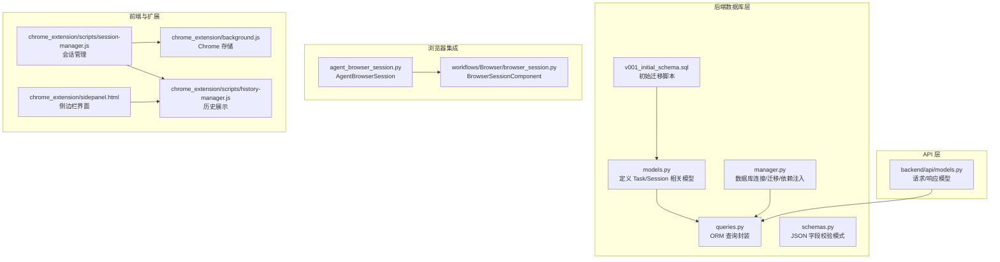
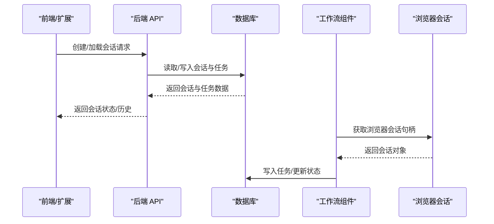
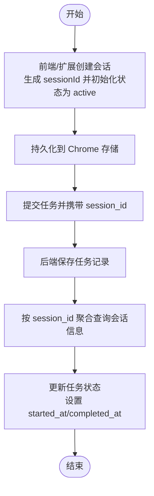
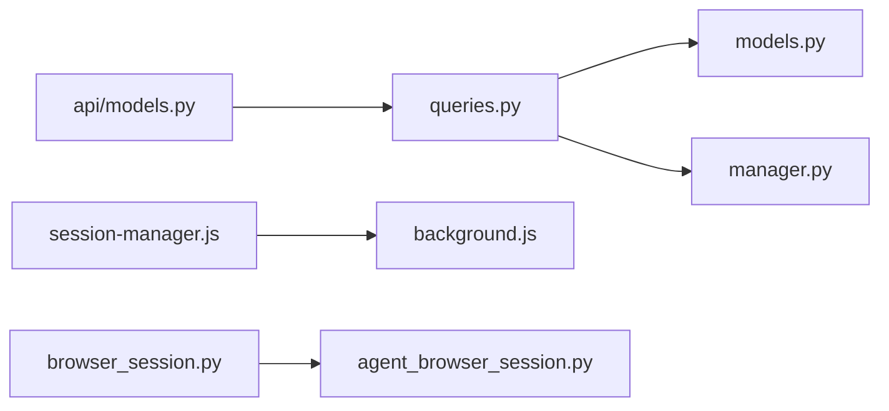

# 浏览器会话模型

<cite>
**本文引用的文件列表**
- [models.py](file://vibe_surf/backend/database/models.py)
- [v001_initial_schema.sql](file://vibe_surf/backend/database/migrations/v001_initial_schema.sql)
- [queries.py](file://vibe_surf/backend/database/queries.py)
- [manager.py](file://vibe_surf/backend/database/manager.py)
- [schemas.py](file://vibe_surf/backend/database/schemas.py)
- [agent_browser_session.py](file://vibe_surf/browser/agent_browser_session.py)
- [browser_session.py](file://vibe_surf/workflows/Browser/browser_session.py)
- [session-manager.js](file://vibe_surf/chrome_extension/scripts/session-manager.js)
- [background.js](file://vibe_surf/chrome_extension/background.js)
- [history-manager.js](file://vibe_surf/chrome_extension/scripts/history-manager.js)
- [sidepanel.html](file://vibe_surf/chrome_extension/sidepanel.html)
- [api/models.py](file://vibe_surf/backend/api/models.py)
</cite>

## 目录
1. [简介](#简介)
2. [项目结构](#项目结构)
3. [核心组件](#核心组件)
4. [架构总览](#架构总览)
5. [详细组件分析](#详细组件分析)
6. [依赖关系分析](#依赖关系分析)
7. [性能考量](#性能考量)
8. [故障排查指南](#故障排查指南)
9. [结论](#结论)
10. [附录](#附录)

## 简介
本文件系统性梳理 VibeSurf 的“浏览器会话”模型，聚焦于会话实体的字段定义、约束、默认值、业务规则，以及与任务、代理等实体的关系；并给出基于 SQLAlchemy 的 ORM 操作示例路径、会话生命周期（状态流转）、以及典型数据记录样例，帮助开发者快速理解与使用会话模型。

## 项目结构
围绕“浏览器会话”的关键代码分布在以下模块：
- 后端数据库层：模型定义、迁移脚本、查询封装、数据库连接管理
- 前端与扩展：会话生命周期管理、历史展示、存储与缓存
- 工作流与浏览器集成：会话组件与浏览器会话对象

图表来源
- [models.py](file://vibe_surf/backend/database/models.py#L94-L137)
- [v001_initial_schema.sql](file://vibe_surf/backend/database/migrations/v001_initial_schema.sql#L30-L49)
- [queries.py](file://vibe_surf/backend/database/queries.py#L441-L754)
- [manager.py](file://vibe_surf/backend/database/manager.py#L148-L240)
- [schemas.py](file://vibe_surf/backend/database/schemas.py#L1-L100)
- [agent_browser_session.py](file://vibe_surf/browser/agent_browser_session.py#L51-L170)
- [browser_session.py](file://vibe_surf/workflows/Browser/browser_session.py#L1-L55)
- [session-manager.js](file://vibe_surf/chrome_extension/scripts/session-manager.js#L52-L160)
- [background.js](file://vibe_surf/chrome_extension/background.js#L488-L519)
- [history-manager.js](file://vibe_surf/chrome_extension/scripts/history-manager.js#L468-L507)
- [sidepanel.html](file://vibe_surf/chrome_extension/sidepanel.html#L279-L310)
- [api/models.py](file://vibe_surf/backend/api/models.py#L200-L260)

章节来源
- [models.py](file://vibe_surf/backend/database/models.py#L94-L137)
- [v001_initial_schema.sql](file://vibe_surf/backend/database/migrations/v001_initial_schema.sql#L30-L49)
- [queries.py](file://vibe_surf/backend/database/queries.py#L441-L754)
- [manager.py](file://vibe_surf/backend/database/manager.py#L148-L240)
- [agent_browser_session.py](file://vibe_surf/browser/agent_browser_session.py#L51-L170)
- [browser_session.py](file://vibe_surf/workflows/Browser/browser_session.py#L1-L55)
- [session-manager.js](file://vibe_surf/chrome_extension/scripts/session-manager.js#L52-L160)
- [background.js](file://vibe_surf/chrome_extension/background.js#L488-L519)
- [history-manager.js](file://vibe_surf/chrome_extension/scripts/history-manager.js#L468-L507)
- [sidepanel.html](file://vibe_surf/chrome_extension/sidepanel.html#L279-L310)
- [api/models.py](file://vibe_surf/backend/api/models.py#L200-L260)

## 核心组件
- 数据库模型与迁移
  - 任务模型包含会话标识字段，用于将任务与会话关联
  - 初始迁移脚本定义了任务表及索引，确保按会话检索高效
- ORM 查询封装
  - 提供按会话获取任务、聚合会话统计、更新任务状态等方法
- 前端会话管理
  - 扩展侧会话管理器负责创建/加载会话、维护状态、持久化到 Chrome 存储
- 浏览器会话对象
  - AgentBrowserSession 作为浏览器会话载体，支持连接、断开、事件处理等
- 工作流组件
  - BrowserSessionComponent 将会话注入到工作流执行链路中

章节来源
- [models.py](file://vibe_surf/backend/database/models.py#L94-L137)
- [v001_initial_schema.sql](file://vibe_surf/backend/database/migrations/v001_initial_schema.sql#L30-L49)
- [queries.py](file://vibe_surf/backend/database/queries.py#L535-L609)
- [session-manager.js](file://vibe_surf/chrome_extension/scripts/session-manager.js#L52-L160)
- [agent_browser_session.py](file://vibe_surf/browser/agent_browser_session.py#L51-L170)
- [browser_session.py](file://vibe_surf/workflows/Browser/browser_session.py#L1-L55)

## 架构总览
浏览器会话贯穿“前端/扩展—后端数据库—工作流/浏览器集成”的全链路：

图表来源
- [session-manager.js](file://vibe_surf/chrome_extension/scripts/session-manager.js#L52-L160)
- [queries.py](file://vibe_surf/backend/database/queries.py#L535-L609)
- [browser_session.py](file://vibe_surf/workflows/Browser/browser_session.py#L42-L55)
- [agent_browser_session.py](file://vibe_surf/browser/agent_browser_session.py#L171-L210)

## 详细组件分析

### 1) 会话实体与字段定义
- 会话概念在本仓库中通过“任务-会话”关系体现：每个任务记录包含会话标识字段，从而实现“会话”维度的聚合与查询。
- 关键字段（来自任务模型）：
  - 会话标识：session_id（字符串，非空）
  - 任务标识：task_id（字符串，主键）
  - 任务描述：task_description（文本，非空）
  - 状态：status（枚举，默认 pending）
  - LLM 配置引用：llm_profile_name（字符串，非空）
  - 文件上传与工作区：upload_files_path、workspace_dir（可选）
  - MCP 配置：mcp_server_config（文本，可选）
  - 代理执行模式：agent_mode（字符串，默认 thinking）
  - 结果与错误：task_result、error_message、report_path（可选）
  - 时间戳：created_at、updated_at、started_at、completed_at（可选）
  - 元数据：task_metadata（JSON，可选）

- 字段约束与默认值
  - session_id 非空，用于按会话聚合任务
  - status 默认 pending，枚举值包括 pending、running、paused、completed、failed、stopped
  - agent_mode 默认 thinking
  - created_at/updated_at 默认当前时间，updated_at 由触发器自动更新
  - started_at/completed_at 在状态变更时按需填充

- 业务规则
  - 当任务状态从 pending 变为 running 时，设置 started_at
  - 当任务状态变为 completed/failed/stopped 时，设置 completed_at
  - 会话聚合通过 group by session_id 聚合任务计数、创建时间、最后活动时间与最新状态

章节来源
- [models.py](file://vibe_surf/backend/database/models.py#L94-L137)
- [v001_initial_schema.sql](file://vibe_surf/backend/database/migrations/v001_initial_schema.sql#L30-L49)
- [queries.py](file://vibe_surf/backend/database/queries.py#L441-L754)

### 2) 会话状态生命周期
- 状态枚举：pending → running → paused → completed/failed/stopped
- 生命周期要点
  - pending：任务已提交，尚未开始执行
  - running：任务正在执行，首次进入时设置 started_at
  - paused：任务暂停
  - completed/failed/stopped：任务完成或失败，进入时设置 completed_at
- 前端会话状态
  - 扩展侧会话对象包含 status 字段（例如 active），用于 UI 展示与交互
  - 历史页面支持按状态筛选（active/completed/error 等）

章节来源
- [models.py](file://vibe_surf/backend/database/models.py#L16-L24)
- [queries.py](file://vibe_surf/backend/database/queries.py#L614-L648)
- [session-manager.js](file://vibe_surf/chrome_extension/scripts/session-manager.js#L52-L160)
- [history-manager.js](file://vibe_surf/chrome_extension/scripts/history-manager.js#L468-L507)
- [sidepanel.html](file://vibe_surf/chrome_extension/sidepanel.html#L279-L310)

### 3) 会话与任务、代理的关系
- 会话与任务
  - 通过 session_id 关联，支持按会话查询任务、统计任务数量、聚合最近活动时间
- 会话与代理
  - 工作流组件 BrowserSessionComponent 从共享状态获取浏览器管理器，并返回 AgentBrowserSession 实例，用于具体页面操作
  - AgentBrowserSession 支持连接远程/本地浏览器、事件分发、会话池管理等

章节来源
- [browser_session.py](file://vibe_surf/workflows/Browser/browser_session.py#L42-L55)
- [agent_browser_session.py](file://vibe_surf/browser/agent_browser_session.py#L51-L170)
- [queries.py](file://vibe_surf/backend/database/queries.py#L535-L609)

### 4) ORM 操作示例（路径）
以下为常用 ORM 操作的调用路径（不直接展示代码内容）：
- 创建/保存任务（含会话标识）
  - 路径参考：[save_task](file://vibe_surf/backend/database/queries.py#L445-L523)
- 按会话查询任务
  - 路径参考：[get_tasks_by_session](file://vibe_surf/backend/database/queries.py#L535-L554)
- 获取所有会话聚合信息
  - 路径参考：[get_all_sessions](file://vibe_surf/backend/database/queries.py#L571-L609)
- 更新任务状态（含时间戳）
  - 路径参考：[update_task_status](file://vibe_surf/backend/database/queries.py#L614-L648)
- 删除任务
  - 路径参考：[delete_task](file://vibe_surf/backend/database/queries.py#L649-L658)
- 获取运行中任务
  - 路径参考：[get_running_tasks](file://vibe_surf/backend/database/queries.py#L659-L670)
- 获取活跃任务
  - 路径参考：[get_active_task](file://vibe_surf/backend/database/queries.py#L671-L682)
- 获取任务按状态计数
  - 路径参考：[get_task_counts_by_status](file://vibe_surf/backend/database/queries.py#L736-L754)

章节来源
- [queries.py](file://vibe_surf/backend/database/queries.py#L445-L754)

### 5) 会话创建、查询、更新与删除流程
- 创建会话
  - 前端/扩展侧：生成会话 ID，初始化状态为 active，持久化到 Chrome 存储
  - 后端：后续通过任务记录承载会话标识，无需单独创建会话表
- 查询会话
  - 通过任务表按 session_id 聚合统计与排序，返回会话概要（任务数、创建时间、最后活动、最新状态）
- 更新会话
  - 通过更新任务状态实现会话状态变化（pending/running/paused/completed/failed/stopped）
- 删除会话
  - 通过删除任务记录实现（若无外键约束，也可考虑逻辑删除）

图表来源
- [session-manager.js](file://vibe_surf/chrome_extension/scripts/session-manager.js#L52-L160)
- [background.js](file://vibe_surf/chrome_extension/background.js#L488-L519)
- [queries.py](file://vibe_surf/backend/database/queries.py#L445-L648)

### 6) 实际会话数据记录示例
- 会话概要（来自聚合查询）
  - 字段：session_id、task_count、created_at、last_activity、status
  - 示例字段含义：会话唯一标识、该会话的任务总数、会话创建时间、最近一次任务活动时间、最新任务状态
- 任务记录（来自任务模型）
  - 字段：task_id、session_id、task_description、status、llm_profile_name、agent_mode、created_at、updated_at、started_at、completed_at、task_result、error_message、report_path、task_metadata
  - 示例字段含义：任务唯一标识、所属会话、任务描述、状态、LLM 配置引用、代理模式、时间戳、结果、错误、报告路径、元数据

章节来源
- [queries.py](file://vibe_surf/backend/database/queries.py#L571-L609)
- [models.py](file://vibe_surf/backend/database/models.py#L94-L137)

## 依赖关系分析
- 组件耦合
  - queries.py 依赖 models.py 中的 Task/TaskStatus 等模型
  - manager.py 提供数据库引擎与会话工厂，供 queries.py 使用
  - 前端 session-manager.js 与 background.js 协同维护会话状态与缓存
  - 工作流 browser_session.py 依赖共享状态中的浏览器管理器，返回 AgentBrowserSession
- 外部依赖
  - SQLAlchemy 异步引擎与会话管理
  - Chrome Extension 存储 API

图表来源
- [queries.py](file://vibe_surf/backend/database/queries.py#L1-L20)
- [models.py](file://vibe_surf/backend/database/models.py#L94-L137)
- [manager.py](file://vibe_surf/backend/database/manager.py#L148-L240)
- [session-manager.js](file://vibe_surf/chrome_extension/scripts/session-manager.js#L52-L160)
- [background.js](file://vibe_surf/chrome_extension/background.js#L488-L519)
- [browser_session.py](file://vibe_surf/workflows/Browser/browser_session.py#L1-L55)
- [agent_browser_session.py](file://vibe_surf/browser/agent_browser_session.py#L51-L170)
- [api/models.py](file://vibe_surf/backend/api/models.py#L200-L260)

## 性能考量
- 索引优化
  - 对 tasks 表按 status、session_id、llm_profile_name、created_at 建立索引，提升聚合与过滤效率
- 迁移与版本控制
  - SQLite 使用迁移脚本管理版本，避免重复建表与兼容问题
- 异步数据库访问
  - 使用异步引擎与会话工厂，减少阻塞，提高并发能力
- 前端缓存
  - Chrome 存储限制会话列表大小，避免过多历史导致性能下降

章节来源
- [v001_initial_schema.sql](file://vibe_surf/backend/database/migrations/v001_initial_schema.sql#L80-L97)
- [manager.py](file://vibe_surf/backend/database/manager.py#L164-L201)
- [background.js](file://vibe_surf/chrome_extension/background.js#L488-L519)

## 故障排查指南
- 数据库初始化失败
  - 检查数据库 URL 与工作空间目录权限
  - 查看迁移日志与异常堆栈
  - 参考：[init_database](file://vibe_surf/backend/database/manager.py#L288-L306)
- 会话聚合为空
  - 确认任务表是否包含有效 session_id 记录
  - 检查索引是否存在且生效
  - 参考：[get_all_sessions](file://vibe_surf/backend/database/queries.py#L571-L609)
- 任务状态未正确更新时间戳
  - 确认状态转换逻辑是否覆盖 running/completed/failed/stopped 分支
  - 参考：[update_task_status](file://vibe_surf/backend/database/queries.py#L614-L648)
- 前端会话状态不一致
  - 检查 Chrome 存储是否成功写入与清理
  - 参考：[storeSessionData](file://vibe_surf/chrome_extension/background.js#L488-L519)

章节来源
- [manager.py](file://vibe_surf/backend/database/manager.py#L288-L306)
- [queries.py](file://vibe_surf/backend/database/queries.py#L571-L648)
- [background.js](file://vibe_surf/chrome_extension/background.js#L488-L519)

## 结论
本仓库未单独定义“会话表”，而是通过“任务-会话”关系抽象会话语义：以 session_id 作为会话标识，结合任务状态与时间戳，实现会话生命周期管理与聚合查询。前端扩展负责会话状态与缓存，后端数据库提供高效的 ORM 查询与迁移机制，浏览器会话对象则承载具体的页面操作能力。整体设计简洁清晰，便于扩展与维护。

## 附录
- JSON 字段校验
  - 提供对任务元数据、LLM 配置、MCP 配置等 JSON 字段的校验模式，确保数据一致性
  - 参考：[schemas.py](file://vibe_surf/backend/database/schemas.py#L1-L100)
- API 请求/响应模型
  - 包含会话活动查询、文件查询等请求/响应模型
  - 参考：[api/models.py](file://vibe_surf/backend/api/models.py#L200-L260)

章节来源
- [schemas.py](file://vibe_surf/backend/database/schemas.py#L1-L100)
- [api/models.py](file://vibe_surf/backend/api/models.py#L200-L260)