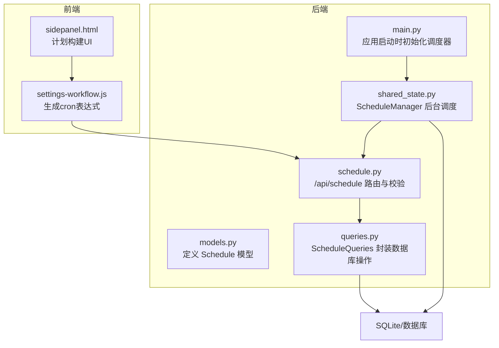
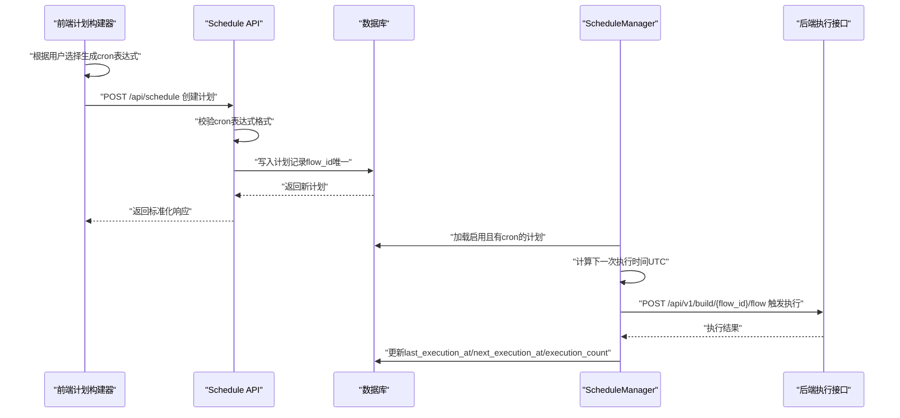
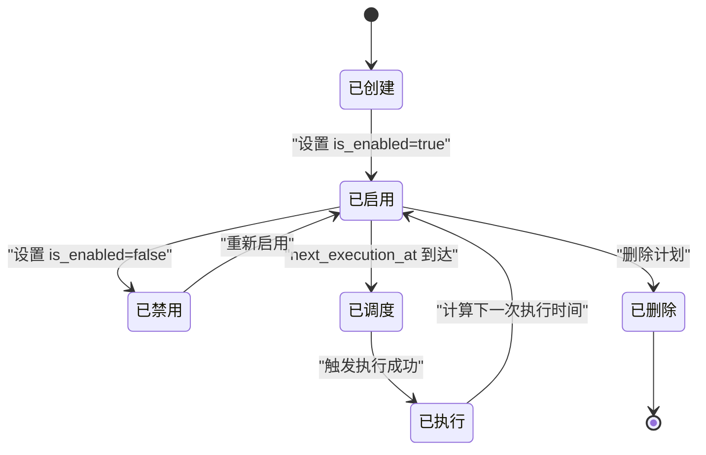
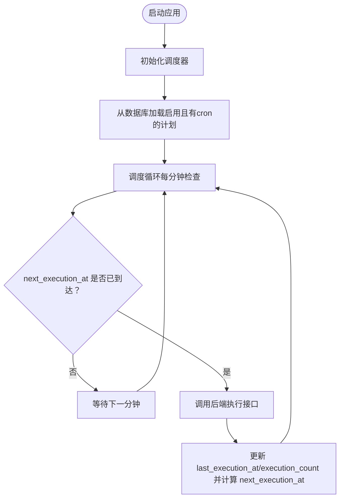
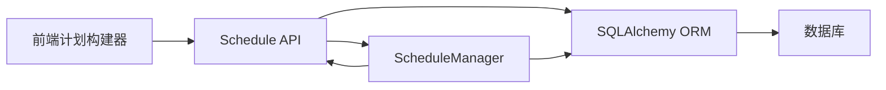

# 计划模型

<cite>
**本文引用的文件**
- [models.py](file://vibe_surf/backend/database/models.py)
- [schemas.py](file://vibe_surf/backend/database/schemas.py)
- [queries.py](file://vibe_surf/backend/database/queries.py)
- [schedule.py](file://vibe_surf/backend/api/schedule.py)
- [v007_add_schedule_table.sql](file://vibe_surf/backend/database/migrations/v007_add_schedule_table.sql)
- [shared_state.py](file://vibe_surf/backend/shared_state.py)
- [main.py](file://vibe_surf/backend/main.py)
- [sidepanel.html](file://vibe_surf/chrome_extension/sidepanel.html)
- [settings-workflow.js](file://vibe_surf/chrome_extension/scripts/settings-workflow.js)
</cite>

## 目录
1. [简介](#简介)
2. [项目结构](#项目结构)
3. [核心组件](#核心组件)
4. [架构总览](#架构总览)
5. [详细组件分析](#详细组件分析)
6. [依赖关系分析](#依赖关系分析)
7. [性能考量](#性能考量)
8. [故障排查指南](#故障排查指南)
9. [结论](#结论)
10. [附录](#附录)

## 简介
本文件系统性地文档化“计划模型”（Schedule），覆盖其字段定义、约束、默认值、业务规则、状态生命周期、与其他实体的关系，以及通过API进行的创建、查询、更新、删除等ORM操作流程，并结合前端交互与调度器实现，说明计划如何与调度服务集成以实现定时任务执行。

## 项目结构
围绕计划模型的关键代码分布在以下模块：
- 数据库模型与迁移：定义计划表结构、索引与触发器
- 查询层：封装对计划表的增删改查
- API层：对外暴露REST接口，校验cron表达式并返回标准化响应
- 调度管理器：在后台周期性检查并触发计划
- 前端：提供可视化构建cron表达式的界面，生成标准cron字符串

图表来源
- [models.py](file://vibe_surf/backend/database/models.py#L258-L289)
- [queries.py](file://vibe_surf/backend/database/queries.py#L1-L200)
- [schedule.py](file://vibe_surf/backend/api/schedule.py#L1-L120)
- [shared_state.py](file://vibe_surf/backend/shared_state.py#L740-L1111)
- [main.py](file://vibe_surf/backend/main.py#L327-L406)
- [sidepanel.html](file://vibe_surf/chrome_extension/sidepanel.html#L788-L901)
- [settings-workflow.js](file://vibe_surf/chrome_extension/scripts/settings-workflow.js#L2234-L2358)

章节来源
- [models.py](file://vibe_surf/backend/database/models.py#L258-L289)
- [queries.py](file://vibe_surf/backend/database/queries.py#L1-L200)
- [schedule.py](file://vibe_surf/backend/api/schedule.py#L1-L120)
- [shared_state.py](file://vibe_surf/backend/shared_state.py#L740-L1111)
- [main.py](file://vibe_surf/backend/main.py#L327-L406)
- [sidepanel.html](file://vibe_surf/chrome_extension/sidepanel.html#L788-L901)
- [settings-workflow.js](file://vibe_surf/chrome_extension/scripts/settings-workflow.js#L2234-L2358)

## 核心组件
- 计划模型（Schedule）：持久化存储工作流的定时执行配置与运行指标
- 计划查询（ScheduleQueries）：封装对计划表的ORM操作
- 计划API（/api/schedule）：提供REST接口，负责校验cron表达式、返回标准化响应
- 调度管理器（ScheduleManager）：后台循环检查并触发计划执行
- 前端计划构建器：将用户选择转换为标准cron表达式

章节来源
- [models.py](file://vibe_surf/backend/database/models.py#L258-L289)
- [queries.py](file://vibe_surf/backend/database/queries.py#L1-L200)
- [schedule.py](file://vibe_surf/backend/api/schedule.py#L1-L120)
- [shared_state.py](file://vibe_surf/backend/shared_state.py#L740-L1111)

## 架构总览
计划模型贯穿“前端构建—API校验—数据库持久化—调度器触发—后端执行”的闭环。前端将用户输入映射为标准cron表达式；API层进行格式校验与唯一性约束；数据库保存计划元数据与执行计数；调度器按UTC时间计算下一次执行并调用后端执行接口；执行完成后更新执行统计。

图表来源
- [schedule.py](file://vibe_surf/backend/api/schedule.py#L108-L149)
- [shared_state.py](file://vibe_surf/backend/shared_state.py#L740-L1111)
- [models.py](file://vibe_surf/backend/database/models.py#L258-L289)

## 详细组件分析

### 字段定义与业务规则
- id：主键，UUID字符串，全局唯一
- flow_id：工作流标识，唯一约束，确保每条计划仅绑定一个flow
- cron_expression：可选的cron表达式字符串，nullable；为空表示禁用或不启用定时
- is_enabled：布尔开关，默认启用
- description：可选描述
- last_execution_at：最近一次执行时间（UTC）
- next_execution_at：下一次计划执行时间（UTC）
- execution_count：累计执行次数，默认0
- created_at/updated_at：时间戳，自动维护

字段约束与默认值
- flow_id 唯一性：保证每个flow仅有一个计划
- cron_expression 可空：允许禁用定时，仅在存在有效cron时参与调度
- is_enabled 默认true：便于快速启用
- execution_count 默认0：从0开始累加
- 时间字段默认值：created_at默认当前时间，updated_at在更新时自动刷新

业务规则
- cron表达式必须可解析为合法cron（API层校验）
- next_execution_at按本地时区计算后转换为UTC存储
- 调度器在reload时若发现过期的next_execution_at会重新计算并更新
- 执行间隔最小阈值：避免过于频繁的重复执行
- 删除计划时同步移除调度缓存并重载

章节来源
- [models.py](file://vibe_surf/backend/database/models.py#L258-L289)
- [v007_add_schedule_table.sql](file://vibe_surf/backend/database/migrations/v007_add_schedule_table.sql#L1-L29)
- [schedule.py](file://vibe_surf/backend/api/schedule.py#L52-L76)
- [shared_state.py](file://vibe_surf/backend/shared_state.py#L800-L1081)

### 计划状态生命周期
计划本身不直接维护“状态枚举”，但其执行行为遵循如下生命周期：
- 创建：写入计划记录，cron为空则视为禁用
- 启用/禁用：通过is_enabled切换
- 调度：调度器周期检查next_execution_at是否到达，若到达则触发执行
- 执行：调用后端执行接口，成功后更新last_execution_at、execution_count，并计算新的next_execution_at
- 更新：当cron变更或过期时，调度器会重新计算并更新next_execution_at
- 删除：清理数据库记录并重载调度缓存

图表来源
- [shared_state.py](file://vibe_surf/backend/shared_state.py#L863-L1081)
- [schedule.py](file://vibe_surf/backend/api/schedule.py#L195-L288)

### 与任务、代理等其他实体的关系
- 与任务（Task）：计划并不直接持有任务ID，而是通过flow_id关联到工作流。执行时由调度器调用后端执行接口触发具体任务的构建与运行。
- 与LLM/工具配置：计划表不直接存储LLM或工具配置；执行时由后端根据flow_id加载相应配置。
- 与浏览器/工具链：计划表不直接引用浏览器或工具实例，执行时由后端组件按需初始化。

章节来源
- [schedule.py](file://vibe_surf/backend/api/schedule.py#L290-L331)
- [shared_state.py](file://vibe_surf/backend/shared_state.py#L932-L961)

### ORM操作示例（路径指引）
- 创建计划
  - API入口：POST /api/schedule
  - 校验逻辑：校验cron表达式格式；检查flow_id唯一性
  - 数据持久化：写入schedules表
  - 参考路径
    - [schedule.py](file://vibe_surf/backend/api/schedule.py#L108-L149)
    - [models.py](file://vibe_surf/backend/database/models.py#L258-L289)
    - [v007_add_schedule_table.sql](file://vibe_surf/backend/database/migrations/v007_add_schedule_table.sql#L1-L29)

- 查询计划
  - 获取全部：GET /api/schedule
  - 按flow_id获取：GET /api/schedule/{flow_id}
  - 参考路径
    - [schedule.py](file://vibe_surf/backend/api/schedule.py#L77-L107)
    - [schedule.py](file://vibe_surf/backend/api/schedule.py#L159-L194)

- 更新计划
  - PUT /api/schedule/{flow_id}
  - 支持更新cron_expression/is_enabled/description
  - 参考路径
    - [schedule.py](file://vibe_surf/backend/api/schedule.py#L195-L288)

- 删除计划
  - DELETE /api/schedule/{flow_id}
  - 参考路径
    - [schedule.py](file://vibe_surf/backend/api/schedule.py#L290-L331)

- 调度器内部查询与更新
  - 加载启用且有cron的计划
  - 计算并更新next_execution_at
  - 执行后更新last_execution_at/execution_count
  - 参考路径
    - [shared_state.py](file://vibe_surf/backend/shared_state.py#L770-L1081)

### 实际计划数据记录示例
以下为典型记录形态（字段名与含义来自模型定义）：
- 计划A：flow_id为某工作流标识，cron_expression为“0 9 * * 1-5”，is_enabled为true，next_execution_at为某UTC时间，execution_count为0
- 计划B：flow_id为另一工作流标识，cron_expression为空，is_enabled为false，表示禁用
- 计划C：flow_id为某工作流标识，cron_expression为“0 0 * * 0”，is_enabled为true，next_execution_at为过去时间，调度器会重新计算并更新

章节来源
- [models.py](file://vibe_surf/backend/database/models.py#L258-L289)
- [shared_state.py](file://vibe_surf/backend/shared_state.py#L800-L1081)

### 不同cron表达式下的执行计划
- 每分钟：*/1 * * * *
- 每小时：0 */1 * * *
- 每日固定时间：例如“0 9 * * *”（每天上午9点）
- 每周固定时间：例如“0 9 * * 1”（每周一上午9点）
- 每月固定日期：例如“0 9 1 * *”（每月1号上午9点）

章节来源
- [settings-workflow.js](file://vibe_surf/chrome_extension/scripts/settings-workflow.js#L2330-L2358)
- [sidepanel.html](file://vibe_surf/chrome_extension/sidepanel.html#L788-L901)

### 与调度服务的集成
- 前端生成cron：前端计划构建器将用户选择映射为标准cron表达式
- API校验与入库：API层校验cron合法性并写入数据库
- 调度器加载：应用启动时初始化调度器，从数据库加载启用且有cron的计划
- 定时触发：调度器周期检查next_execution_at，到达即调用后端执行接口
- 执行后更新：成功后更新last_execution_at、execution_count，并计算新的next_execution_at

图表来源
- [main.py](file://vibe_surf/backend/main.py#L327-L406)
- [shared_state.py](file://vibe_surf/backend/shared_state.py#L740-L1111)

## 依赖关系分析
- 模块耦合
  - schedule.py 依赖 models.py 中的 Schedule 模型与 shared_state 中的 schedule_manager
  - shared_state.py 的 ScheduleManager 依赖 models.py 的 Schedule 与 croniter 库
  - 前端 settings-workflow.js 与 sidepanel.html 生成并展示计划配置
- 外部依赖
  - croniter：用于cron表达式解析与下一次执行时间计算
  - SQLAlchemy：ORM与事务管理
  - FastAPI：路由与请求/响应模型

图表来源
- [schedule.py](file://vibe_surf/backend/api/schedule.py#L1-L120)
- [shared_state.py](file://vibe_surf/backend/shared_state.py#L740-L1111)
- [models.py](file://vibe_surf/backend/database/models.py#L258-L289)

章节来源
- [schedule.py](file://vibe_surf/backend/api/schedule.py#L1-L120)
- [shared_state.py](file://vibe_surf/backend/shared_state.py#L740-L1111)
- [models.py](file://vibe_surf/backend/database/models.py#L258-L289)

## 性能考量
- 索引优化：对flow_id、is_enabled、next_execution_at、cron_expression建立索引，提升查询与调度效率
- 时间精度：统一使用UTC存储next_execution_at，避免跨时区带来的重复执行风险
- 最小执行间隔：调度器内置最小间隔阈值，防止过于频繁的重复执行
- 触发器：数据库层提供updated_at自动更新触发器，减少应用层冗余逻辑

章节来源
- [v007_add_schedule_table.sql](file://vibe_surf/backend/database/migrations/v007_add_schedule_table.sql#L18-L29)
- [shared_state.py](file://vibe_surf/backend/shared_state.py#L928-L961)

## 故障排查指南
- cron表达式无效
  - 现象：创建/更新计划时报错
  - 排查：确认cron表达式符合标准格式；API层会进行格式校验
  - 参考路径
    - [schedule.py](file://vibe_surf/backend/api/schedule.py#L52-L76)

- flow_id冲突
  - 现象：创建计划时报冲突
  - 排查：确保flow_id唯一；每个flow仅能有一条计划
  - 参考路径
    - [schedule.py](file://vibe_surf/backend/api/schedule.py#L121-L128)

- 计划未触发
  - 现象：next_execution_at已过期但未执行
  - 排查：调度器会在reload时重新计算过期的next_execution_at；检查is_enabled与cron_expression是否为空
  - 参考路径
    - [shared_state.py](file://vibe_surf/backend/shared_state.py#L800-L856)

- 执行过于频繁
  - 现象：短时间内多次执行
  - 排查：调度器内置最小间隔阈值；检查cron表达式粒度是否过细
  - 参考路径
    - [shared_state.py](file://vibe_surf/backend/shared_state.py#L928-L961)

- 删除计划后仍被调度
  - 现象：删除后调度器仍尝试执行
  - 排查：确认删除后是否调用了重载调度缓存；检查API层是否正确提交事务
  - 参考路径
    - [schedule.py](file://vibe_surf/backend/api/schedule.py#L290-L331)
    - [shared_state.py](file://vibe_surf/backend/shared_state.py#L770-L856)

## 结论
计划模型通过清晰的字段设计、严格的约束与默认值、完善的API校验与调度器集成，实现了稳定可靠的定时执行能力。前端提供直观的cron构建体验，后端提供一致的时间处理与执行统计，整体形成高可用的自动化执行闭环。

## 附录
- 前端计划构建器
  - 类型选择：每日、每X分钟、每X小时、每周、每月
  - 预设时间：默认每日8:00
  - 生成策略：根据选择动态拼接标准cron表达式
  - 参考路径
    - [sidepanel.html](file://vibe_surf/chrome_extension/sidepanel.html#L788-L901)
    - [settings-workflow.js](file://vibe_surf/chrome_extension/scripts/settings-workflow.js#L2234-L2358)