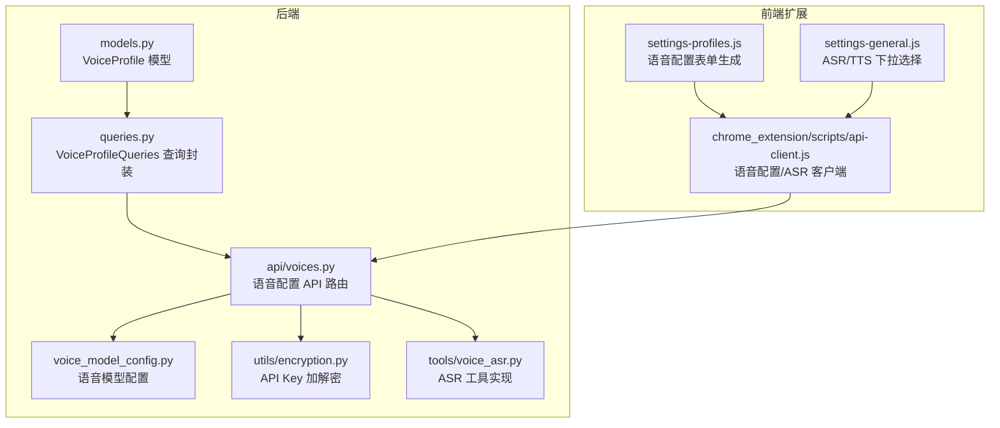
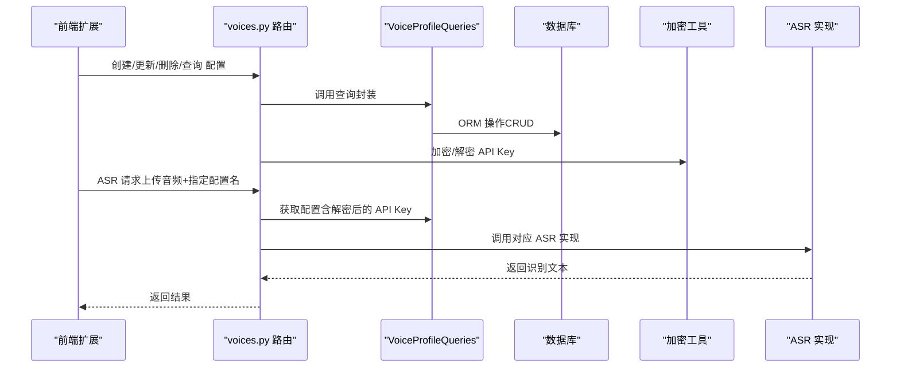
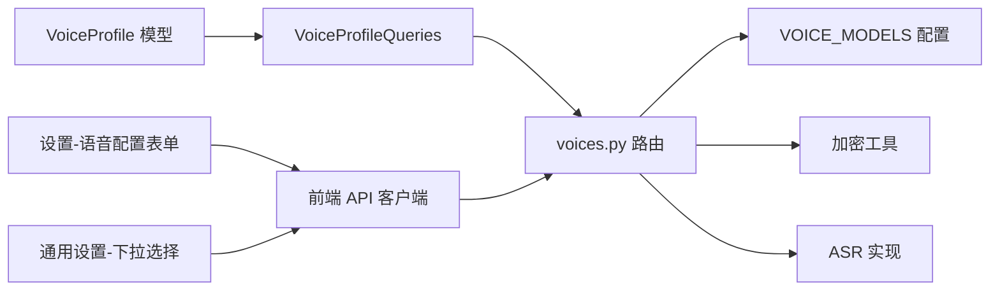

# 语音配置文件模型

<cite>
**本文引用的文件**
- [vibe_surf/backend/database/models.py](file://vibe_surf/backend/database/models.py)
- [vibe_surf/backend/database/migrations/v004_add_voice_profiles.sql](file://vibe_surf/backend/database/migrations/v004_add_voice_profiles.sql)
- [vibe_surf/backend/database/queries.py](file://vibe_surf/backend/database/queries.py)
- [vibe_surf/backend/api/voices.py](file://vibe_surf/backend/api/voices.py)
- [vibe_surf/backend/voice_model_config.py](file://vibe_surf/backend/voice_model_config.py)
- [vibe_surf/tools/voice_asr.py](file://vibe_surf/tools/voice_asr.py)
- [vibe_surf/backend/utils/encryption.py](file://vibe_surf/backend/utils/encryption.py)
- [vibe_surf/chrome_extension/scripts/api-client.js](file://vibe_surf/chrome_extension/scripts/api-client.js)
- [vibe_surf/chrome_extension/scripts/settings-profiles.js](file://vibe_surf/chrome_extension/scripts/settings-profiles.js)
- [vibe_surf/chrome_extension/scripts/settings-general.js](file://vibe_surf/chrome_extension/scripts/settings-general.js)
</cite>

## 目录
1. [简介](#简介)
2. [项目结构](#项目结构)
3. [核心组件](#核心组件)
4. [架构总览](#架构总览)
5. [详细组件分析](#详细组件分析)
6. [依赖关系分析](#依赖关系分析)
7. [性能考量](#性能考量)
8. [故障排查指南](#故障排查指南)
9. [结论](#结论)
10. [附录](#附录)

## 简介
本文件系统性地文档化 VibeSurf 的“语音配置文件”模型，覆盖其数据库表结构、字段定义、约束与默认值、业务规则、与任务/代理等实体的关系，以及通过 ORM 和 API 的增删改查流程。同时，对不同语音提供商（如 Qwen、OpenAI、Gemini）在 ASR 场景下的配置差异进行说明，并给出典型语音配置数据示例，帮助开发者与使用者快速理解并正确使用该模型。

## 项目结构
语音配置文件模型位于后端数据库层，配合 API 路由、查询封装、加密工具与前端脚本共同构成完整的语音配置管理闭环。

图表来源
- [vibe_surf/backend/database/models.py](file://vibe_surf/backend/database/models.py#L25-L55)
- [vibe_surf/backend/database/queries.py](file://vibe_surf/backend/database/queries.py#L934-L1120)
- [vibe_surf/backend/api/voices.py](file://vibe_surf/backend/api/voices.py#L1-L120)
- [vibe_surf/backend/voice_model_config.py](file://vibe_surf/backend/voice_model_config.py#L1-L25)
- [vibe_surf/backend/utils/encryption.py](file://vibe_surf/backend/utils/encryption.py#L65-L126)
- [vibe_surf/tools/voice_asr.py](file://vibe_surf/tools/voice_asr.py#L1-L125)
- [vibe_surf/chrome_extension/scripts/api-client.js](file://vibe_surf/chrome_extension/scripts/api-client.js#L402-L443)
- [vibe_surf/chrome_extension/scripts/settings-profiles.js](file://vibe_surf/chrome_extension/scripts/settings-profiles.js#L297-L393)
- [vibe_surf/chrome_extension/scripts/settings-general.js](file://vibe_surf/chrome_extension/scripts/settings-general.js#L62-L93)

章节来源
- [vibe_surf/backend/database/models.py](file://vibe_surf/backend/database/models.py#L25-L55)
- [vibe_surf/backend/database/migrations/v004_add_voice_profiles.sql](file://vibe_surf/backend/database/migrations/v004_add_voice_profiles.sql#L1-L35)

## 核心组件
- 数据模型：VoiceProfile（语音配置文件）
- 查询封装：VoiceProfileQueries（创建/查询/列表/更新/删除/最后使用时间）
- API 路由：voices.py（创建/更新/删除/查询/列出/ASR 接口）
- 语音模型配置：voice_model_config.py（支持的 ASR 模型清单）
- ASR 实现：voice_asr.py（Qwen/OpenAI/Gemini）
- 加密工具：encryption.py（API Key 加密/解密）
- 前端交互：chrome_extension 脚本（语音配置管理与 ASR 调用）

章节来源
- [vibe_surf/backend/database/models.py](file://vibe_surf/backend/database/models.py#L25-L55)
- [vibe_surf/backend/database/queries.py](file://vibe_surf/backend/database/queries.py#L934-L1120)
- [vibe_surf/backend/api/voices.py](file://vibe_surf/backend/api/voices.py#L1-L120)
- [vibe_surf/backend/voice_model_config.py](file://vibe_surf/backend/voice_model_config.py#L1-L25)
- [vibe_surf/tools/voice_asr.py](file://vibe_surf/tools/voice_asr.py#L1-L125)
- [vibe_surf/backend/utils/encryption.py](file://vibe_surf/backend/utils/encryption.py#L65-L126)
- [vibe_surf/chrome_extension/scripts/api-client.js](file://vibe_surf/chrome_extension/scripts/api-client.js#L402-L443)

## 架构总览
语音配置文件的生命周期从“创建配置文件”到“使用配置文件执行 ASR”，再到“查询/更新/删除”。后端通过 FastAPI 路由暴露 REST 接口，ORM 层负责持久化，加密模块保障敏感信息安全，前端扩展负责配置展示与调用。

图表来源
- [vibe_surf/backend/api/voices.py](file://vibe_surf/backend/api/voices.py#L49-L179)
- [vibe_surf/backend/database/queries.py](file://vibe_surf/backend/database/queries.py#L934-L1120)
- [vibe_surf/backend/utils/encryption.py](file://vibe_surf/backend/utils/encryption.py#L65-L126)
- [vibe_surf/tools/voice_asr.py](file://vibe_surf/tools/voice_asr.py#L1-L125)

## 详细组件分析

### 数据模型：VoiceProfile 字段定义与约束
- 表名：voice_profiles
- 主键：profile_id（字符串，长度 36，主键）
- 名称：voice_profile_name（字符串，最大 100，唯一）
- 类型：voice_model_type（枚举，取值为 asr 或 tts）
- 模型名：voice_model_name（字符串，最大 100）
- 加密 API Key：encrypted_api_key（文本，可空）
- 元参数：voice_meta_params（JSON，可空；用于存放模型特定参数）
- 描述：description（文本，可空）
- 活跃状态：is_active（布尔，默认 true）
- 时间戳：created_at、updated_at（日期时间，默认当前时间；updated_at 自动更新）
- 最后使用时间：last_used_at（日期时间，可空）

索引：
- idx_voice_profiles_name
- idx_voice_profiles_type
- idx_voice_profiles_active

触发器：
- update_voice_profiles_updated_at（自动更新 updated_at）

章节来源
- [vibe_surf/backend/database/models.py](file://vibe_surf/backend/database/models.py#L25-L55)
- [vibe_surf/backend/database/migrations/v004_add_voice_profiles.sql](file://vibe_surf/backend/database/migrations/v004_add_voice_profiles.sql#L1-L35)

### ORM 查询封装：VoiceProfileQueries
- create_profile：创建配置文件，加密传入的 API Key，返回标准化数据
- get_profile：按名称获取配置文件
- get_profile_with_decrypted_key：按名称获取配置文件并解密 API Key
- list_profiles：分页列出配置文件，支持按活跃状态与类型过滤
- update_profile：更新配置文件，处理 API Key 加密与枚举转换
- delete_profile：删除配置文件
- update_last_used：更新 last_used_at

章节来源
- [vibe_surf/backend/database/queries.py](file://vibe_surf/backend/database/queries.py#L934-L1120)

### API 路由：voices.py
- POST /voices/voice-profiles：创建配置文件（校验类型、去重、提交事务）
- PUT /voices/voice-profiles/{name}：更新配置文件（校验类型、排除空值、提交事务）
- DELETE /voices/voice-profiles/{name}：删除配置文件
- GET /voices/voice-profiles：列出配置文件（支持类型、活跃、分页）
- GET /voices/{name}：按名称获取配置文件
- POST /voices/asr：ASR 识别（保存音频、选择模型、调用实现、更新最后使用时间）

章节来源
- [vibe_surf/backend/api/voices.py](file://vibe_surf/backend/api/voices.py#L49-L179)
- [vibe_surf/backend/api/voices.py](file://vibe_surf/backend/api/voices.py#L224-L373)
- [vibe_surf/backend/api/voices.py](file://vibe_surf/backend/api/voices.py#L375-L481)

### 语音模型配置：voice_model_config.py
- 支持的 ASR 模型：qwen-asr、openai-asr、gemini-asr
- 每个模型包含：model_type（asr）、requires_api_key（是否需要密钥）、provider（供应商标识）
- openai-asr 支持自定义 base_url（便于兼容不同服务端点）

章节来源
- [vibe_surf/backend/voice_model_config.py](file://vibe_surf/backend/voice_model_config.py#L1-L25)

### ASR 实现：voice_asr.py
- QwenASR：基于 DashScope 多模态接口，支持本地或 HTTP 文件路径
- OpenAIASR：基于 OpenAI Whisper，仅支持本地文件
- GeminiASR：基于 Google GenAI，仅支持本地文件

章节来源
- [vibe_surf/tools/voice_asr.py](file://vibe_surf/tools/voice_asr.py#L1-L125)

### 加密工具：encryption.py
- encrypt_api_key：使用机器/用户标识派生密钥，Fernet 对称加密
- decrypt_api_key：解密 API Key，支持回退到本地用户 ID 方案

章节来源
- [vibe_surf/backend/utils/encryption.py](file://vibe_surf/backend/utils/encryption.py#L65-L126)

### 前端交互：chrome_extension
- api-client.js：提供语音配置 CRUD 与模型列表查询、ASR 录音转写
- settings-profiles.js：生成语音配置表单，支持元参数 JSON 编辑
- settings-general.js：加载 ASR/TTS 配置，填充下拉框

章节来源
- [vibe_surf/chrome_extension/scripts/api-client.js](file://vibe_surf/chrome_extension/scripts/api-client.js#L402-L443)
- [vibe_surf/chrome_extension/scripts/settings-profiles.js](file://vibe_surf/chrome_extension/scripts/settings-profiles.js#L297-L393)
- [vibe_surf/chrome_extension/scripts/settings-general.js](file://vibe_surf/chrome_extension/scripts/settings-general.js#L62-L93)

### 字段定义与业务规则（逐项说明）
- profile_id
  - 类型：字符串（长度 36）
  - 约束：主键
  - 默认值：无（需显式提供或由 ORM 生成）
  - 业务规则：全局唯一，作为实体标识
- voice_profile_name
  - 类型：字符串（最大 100）
  - 约束：非空且唯一
  - 默认值：无
  - 业务规则：用户可读的配置名称，用于路由与前端选择
- voice_model_type
  - 类型：枚举（asr/tts）
  - 约束：CHECK 约束限制为 asr 或 tts
  - 默认值：无（必填）
  - 业务规则：决定该配置用于语音识别还是语音合成
- voice_model_name
  - 类型：字符串（最大 100）
  - 约束：非空
  - 默认值：无
  - 业务规则：与 VOICE_MODELS 中的键一致（如 qwen-asr/openai-asr/gemini-asr）
- encrypted_api_key
  - 类型：文本（可空）
  - 约束：可空
  - 默认值：无
  - 业务规则：存储经加密的 API Key；查询时可解密供调用方使用
- voice_meta_params
  - 类型：JSON（可空）
  - 约束：可空
  - 默认值：无
  - 业务规则：存放模型特定参数（如 openai-asr 的 base_url、qwen-asr 的具体模型名等）
- description
  - 类型：文本（可空）
  - 约束：可空
  - 默认值：无
  - 业务规则：辅助说明，便于识别用途
- is_active
  - 类型：布尔
  - 约束：非空
  - 默认值：true
  - 业务规则：控制配置是否可用；列表默认仅返回活跃配置
- created_at / updated_at
  - 类型：日期时间
  - 约束：非空，默认当前时间；updated_at 自动更新
  - 默认值：CURRENT_TIMESTAMP
  - 业务规则：审计与排序依据
- last_used_at
  - 类型：日期时间
  - 约束：可空
  - 默认值：无
  - 业务规则：用于排序与统计使用频率

章节来源
- [vibe_surf/backend/database/models.py](file://vibe_surf/backend/database/models.py#L25-L55)
- [vibe_surf/backend/database/migrations/v004_add_voice_profiles.sql](file://vibe_surf/backend/database/migrations/v004_add_voice_profiles.sql#L1-L35)

### 不同语音提供商（ASR）的配置差异
- Qwen（dashscope）
  - 模型键：qwen-asr
  - 特点：多模态 ASR，支持本地/HTTP 文件路径
  - 元参数：可包含具体模型名等
- OpenAI（Whisper）
  - 模型键：openai-asr
  - 特点：仅支持本地文件；支持自定义 base_url（兼容不同端点）
  - 元参数：base_url（可选）
- Gemini（Google）
  - 模型键：gemini-asr
  - 特点：仅支持本地文件；需要 API Key
  - 元参数：可选

章节来源
- [vibe_surf/backend/voice_model_config.py](file://vibe_surf/backend/voice_model_config.py#L1-L25)
- [vibe_surf/tools/voice_asr.py](file://vibe_surf/tools/voice_asr.py#L1-L125)

### 与任务、代理等实体的关系
- 当前模型未直接外键关联任务或代理；但可通过以下方式建立间接关系：
  - 任务/代理在运行时可引用某个 voice_profile_name 来选择 ASR/TTS 配置
  - 前端设置中会加载活跃的 ASR/TTS 配置用于默认选择
- 若未来需要强约束，可在任务/代理模型中增加对 voice_profiles.voice_profile_name 的引用（当前代码未体现该外键）

章节来源
- [vibe_surf/chrome_extension/scripts/settings-general.js](file://vibe_surf/chrome_extension/scripts/settings-general.js#L62-L93)

### ORM 操作示例（路径指引）
- 创建配置文件
  - 路由入口：POST /voices/voice-profiles
  - 查询封装：VoiceProfileQueries.create_profile
  - 参考路径：
    - [vibe_surf/backend/api/voices.py](file://vibe_surf/backend/api/voices.py#L49-L88)
    - [vibe_surf/backend/database/queries.py](file://vibe_surf/backend/database/queries.py#L934-L982)
- 查询配置文件
  - 路由入口：GET /voices/{name}
  - 查询封装：VoiceProfileQueries.get_profile
  - 参考路径：
    - [vibe_surf/backend/api/voices.py](file://vibe_surf/backend/api/voices.py#L447-L481)
    - [vibe_surf/backend/database/queries.py](file://vibe_surf/backend/database/queries.py#L984-L1001)
- 列出配置文件
  - 路由入口：GET /voices/voice-profiles
  - 查询封装：VoiceProfileQueries.list_profiles
  - 参考路径：
    - [vibe_surf/backend/api/voices.py](file://vibe_surf/backend/api/voices.py#L375-L421)
    - [vibe_surf/backend/database/queries.py](file://vibe_surf/backend/database/queries.py#L1030-L1059)
- 更新配置文件
  - 路由入口：PUT /voices/voice-profiles/{name}
  - 查询封装：VoiceProfileQueries.update_profile
  - 参考路径：
    - [vibe_surf/backend/api/voices.py](file://vibe_surf/backend/api/voices.py#L101-L179)
    - [vibe_surf/backend/database/queries.py](file://vibe_surf/backend/database/queries.py#L1063-L1094)
- 删除配置文件
  - 路由入口：DELETE /voices/voice-profiles/{name}
  - 查询封装：VoiceProfileQueries.delete_profile
  - 参考路径：
    - [vibe_surf/backend/api/voices.py](file://vibe_surf/backend/api/voices.py#L182-L221)
    - [vibe_surf/backend/database/queries.py](file://vibe_surf/backend/database/queries.py#L1094-L1104)

### API 调用示例（路径指引）
- 获取可用语音模型列表
  - 路由入口：GET /voices/models
  - 参考路径：
    - [vibe_surf/backend/api/voices.py](file://vibe_surf/backend/api/voices.py#L424-L445)
- ASR 识别
  - 路由入口：POST /voices/asr
  - 参考路径：
    - [vibe_surf/backend/api/voices.py](file://vibe_surf/backend/api/voices.py#L224-L373)
- 前端调用
  - 语音配置 CRUD 与 ASR：
    - [vibe_surf/chrome_extension/scripts/api-client.js](file://vibe_surf/chrome_extension/scripts/api-client.js#L402-L443)
    - [vibe_surf/chrome_extension/scripts/api-client.js](file://vibe_surf/chrome_extension/scripts/api-client.js#L445-L460)

章节来源
- [vibe_surf/backend/api/voices.py](file://vibe_surf/backend/api/voices.py#L224-L445)
- [vibe_surf/chrome_extension/scripts/api-client.js](file://vibe_surf/chrome_extension/scripts/api-client.js#L402-L460)

### 实际语音配置数据记录示例（说明性）
- 示例一（Qwen ASR）
  - voice_profile_name：示例配置-A
  - voice_model_type：asr
  - voice_model_name：qwen-asr
  - voice_meta_params：包含具体模型名（如 qwen3-asr-flash）
  - is_active：true
  - description：用于中文语音识别的 Qwen 配置
- 示例二（OpenAI ASR）
  - voice_profile_name：示例配置-B
  - voice_model_type：asr
  - voice_model_name：openai-asr
  - voice_meta_params：包含 base_url（如自建端点）
  - is_active：true
  - description：用于英文 Whisper 识别的 OpenAI 配置
- 示例三（Gemini ASR）
  - voice_profile_name：示例配置-C
  - voice_model_type：asr
  - voice_model_name：gemini-asr
  - voice_meta_params：无额外参数
  - is_active：true
  - description：用于多语言识别的 Gemini 配置

说明：以上为示例性描述，不包含具体密钥内容。

## 依赖关系分析
- 模型与查询：VoiceProfile 依赖 SQLAlchemy 映射；VoiceProfileQueries 封装 CRUD 与加解密逻辑
- API 与查询：voices.py 路由依赖 VoiceProfileQueries；ASR 流程依赖 VOICE_MODELS 与 ASR 实现
- 加密：API Key 在创建/更新时加密，在 ASR 使用前解密
- 前端：settings-profiles.js 与 settings-general.js 依赖 api-client.js 提供的 REST 接口

图表来源
- [vibe_surf/backend/database/models.py](file://vibe_surf/backend/database/models.py#L25-L55)
- [vibe_surf/backend/database/queries.py](file://vibe_surf/backend/database/queries.py#L934-L1120)
- [vibe_surf/backend/api/voices.py](file://vibe_surf/backend/api/voices.py#L1-L120)
- [vibe_surf/backend/voice_model_config.py](file://vibe_surf/backend/voice_model_config.py#L1-L25)
- [vibe_surf/backend/utils/encryption.py](file://vibe_surf/backend/utils/encryption.py#L65-L126)
- [vibe_surf/tools/voice_asr.py](file://vibe_surf/tools/voice_asr.py#L1-L125)
- [vibe_surf/chrome_extension/scripts/api-client.js](file://vibe_surf/chrome_extension/scripts/api-client.js#L402-L443)
- [vibe_surf/chrome_extension/scripts/settings-profiles.js](file://vibe_surf/chrome_extension/scripts/settings-profiles.js#L297-L393)
- [vibe_surf/chrome_extension/scripts/settings-general.js](file://vibe_surf/chrome_extension/scripts/settings-general.js#L62-L93)

## 性能考量
- 索引优化：已为名称、类型、活跃状态建立索引，有利于高频查询与排序
- 分页与排序：列表接口支持 limit/offset，并按 last_used_at 与 created_at 排序，兼顾使用频率与新旧
- 触发器：updated_at 自动更新减少应用层重复逻辑
- 加密成本：API Key 的加解密在创建/更新/ASR 使用前解密时发生，建议批量处理与缓存解密结果以降低开销

[本节为通用指导，无需具体文件引用]

## 故障排查指南
- 创建失败（重复名称）
  - 现象：返回 400，提示名称已存在
  - 处理：更换唯一名称后重试
  - 参考路径：
    - [vibe_surf/backend/api/voices.py](file://vibe_surf/backend/api/voices.py#L63-L69)
- 更新失败（类型非法）
  - 现象：返回 400，提示类型必须为 asr 或 tts
  - 处理：修正 voice_model_type
  - 参考路径：
    - [vibe_surf/backend/api/voices.py](file://vibe_surf/backend/api/voices.py#L117-L122)
- 删除失败（不存在）
  - 现象：返回 404
  - 处理：确认配置名是否存在
  - 参考路径：
    - [vibe_surf/backend/api/voices.py](file://vibe_surf/backend/api/voices.py#L190-L195)
- ASR 失败（文件/端点问题）
  - 现象：ASR 返回空文本或抛异常
  - 处理：检查音频文件路径、base_url、API Key 是否正确
  - 参考路径：
    - [vibe_surf/backend/api/voices.py](file://vibe_surf/backend/api/voices.py#L224-L373)
    - [vibe_surf/tools/voice_asr.py](file://vibe_surf/tools/voice_asr.py#L1-L125)
- 加密/解密失败
  - 现象：抛出加密/解密失败错误
  - 处理：确认机器标识与密钥派生一致，必要时重置配置
  - 参考路径：
    - [vibe_surf/backend/utils/encryption.py](file://vibe_surf/backend/utils/encryption.py#L65-L126)

章节来源
- [vibe_surf/backend/api/voices.py](file://vibe_surf/backend/api/voices.py#L49-L179)
- [vibe_surf/tools/voice_asr.py](file://vibe_surf/tools/voice_asr.py#L1-L125)
- [vibe_surf/backend/utils/encryption.py](file://vibe_surf/backend/utils/encryption.py#L65-L126)

## 结论
语音配置文件模型通过清晰的字段设计、完善的 ORM 封装与安全的 API Key 加解密机制，实现了对 ASR/TTS 配置的统一管理。结合前端扩展，用户可以便捷地创建、选择与使用语音配置，满足多提供商、多参数的灵活需求。建议在生产环境中：
- 严格遵循字段约束与默认值
- 合理使用元参数以适配不同提供商特性
- 注意 API Key 的安全存储与最小权限原则
- 通过索引与分页提升查询性能

[本节为总结性内容，无需具体文件引用]

## 附录

### 字段与类型对照表
- profile_id：字符串（长度 36，主键）
- voice_profile_name：字符串（最大 100，唯一）
- voice_model_type：枚举（asr/tts）
- voice_model_name：字符串（最大 100）
- encrypted_api_key：文本（可空）
- voice_meta_params：JSON（可空）
- description：文本（可空）
- is_active：布尔（默认 true）
- created_at：日期时间（默认当前时间）
- updated_at：日期时间（默认当前时间，自动更新）
- last_used_at：日期时间（可空）

章节来源
- [vibe_surf/backend/database/models.py](file://vibe_surf/backend/database/models.py#L25-L55)
- [vibe_surf/backend/database/migrations/v004_add_voice_profiles.sql](file://vibe_surf/backend/database/migrations/v004_add_voice_profiles.sql#L1-L35)