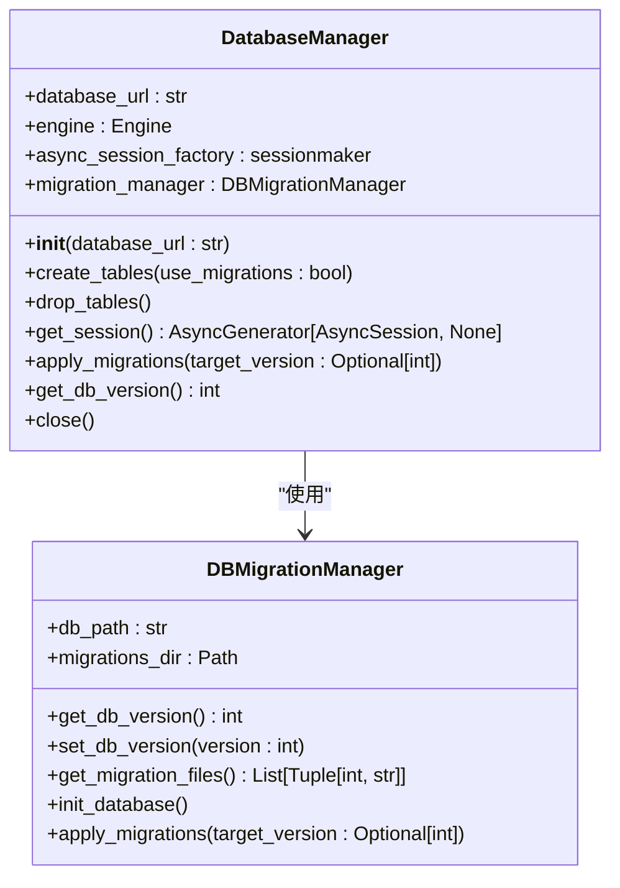
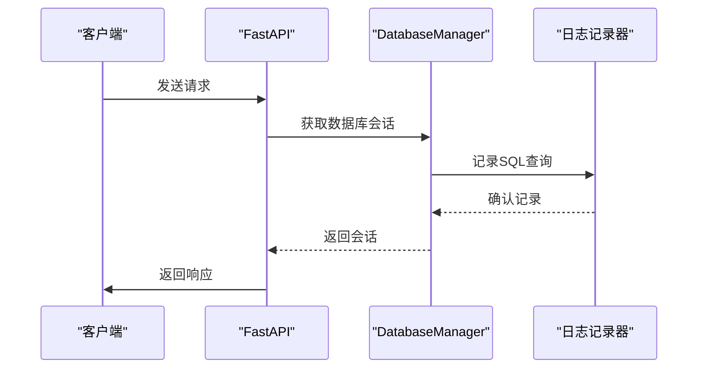
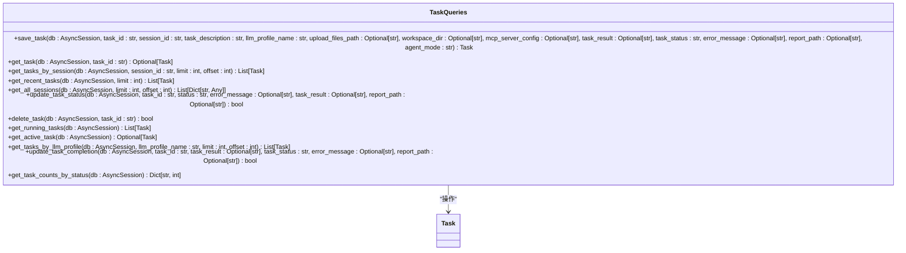
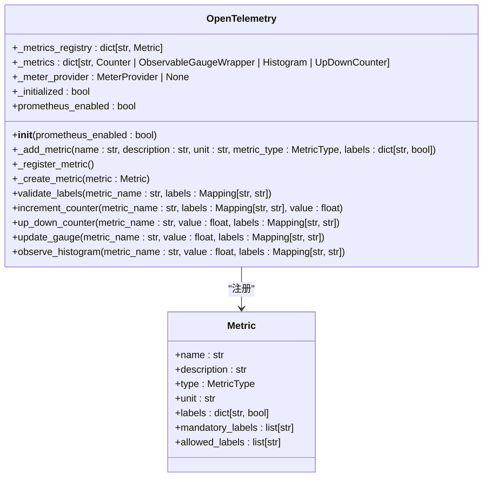
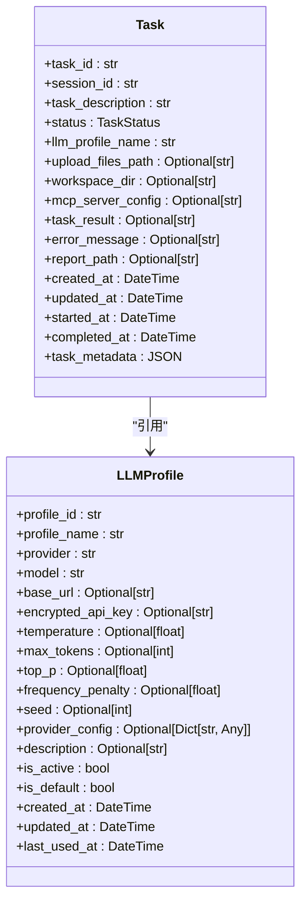
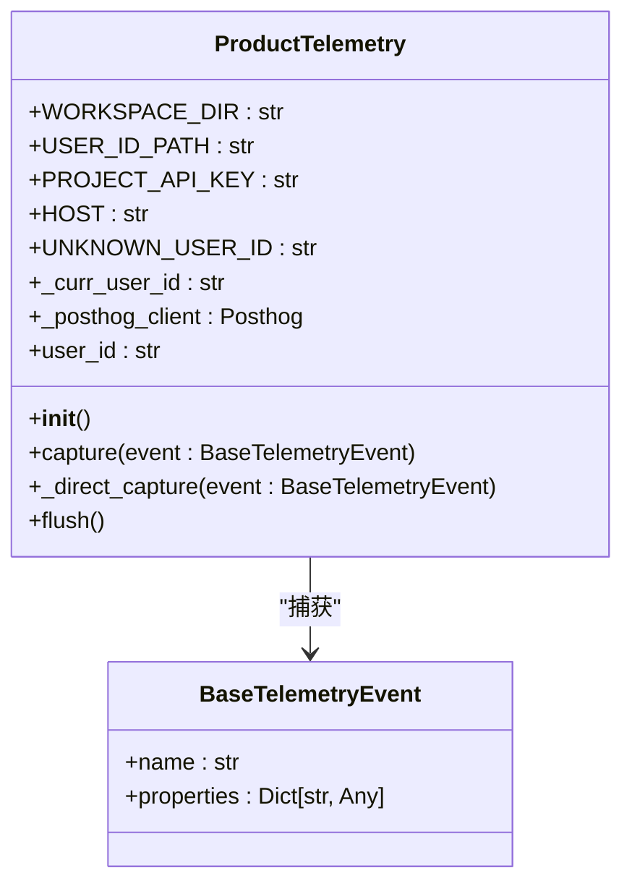
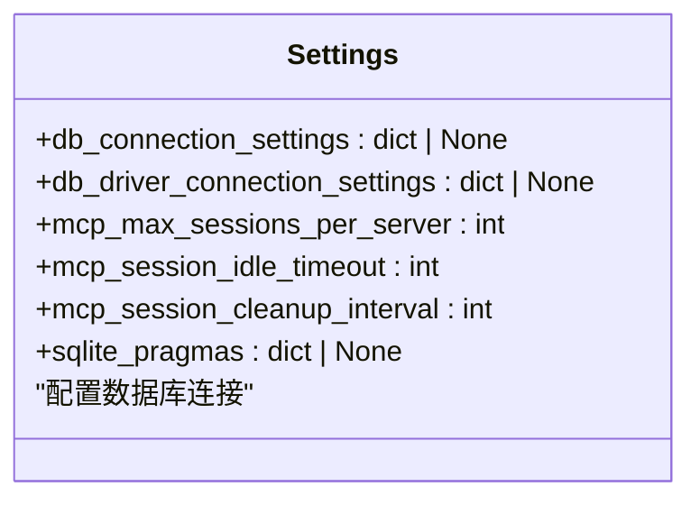

# 性能监控

<cite>
**本文档引用的文件**   
- [manager.py](file://vibe_surf/backend/database/manager.py)
- [models.py](file://vibe_surf/backend/database/models.py)
- [queries.py](file://vibe_surf/backend/database/queries.py)
- [service.py](file://vibe_surf/telemetry/service.py)
- [opentelemetry.py](file://vibe_surf/langflow/services/telemetry/opentelemetry.py)
- [base.py](file://vibe_surf/langflow/services/settings/base.py)
- [v001_initial_schema.sql](file://vibe_surf/backend/database/migrations/v001_initial_schema.sql)
</cite>

## 目录
1. [引言](#引言)
2. [数据库性能监控配置](#数据库性能监控配置)
3. [慢查询日志记录与分析](#慢查询日志记录与分析)
4. [查询执行计划分析](#查询执行计划分析)
5. [性能指标收集与可视化](#性能指标收集与可视化)
6. [性能瓶颈诊断](#性能瓶颈诊断)
7. [监控系统集成](#监控系统集成)
8. [性能阈值与告警机制](#性能阈值与告警机制)
9. [定期性能审查流程](#定期性能审查流程)
10. [性能监控仪表板配置示例](#性能监控仪表板配置示例)

## 引言

VibeSurf平台提供了一套完整的数据库性能监控解决方案，旨在确保系统的高效运行和稳定性。本文档详细介绍了如何配置和使用数据库性能监控工具，包括慢查询日志记录、查询执行计划分析和性能指标收集。通过这些功能，可以有效识别和诊断性能瓶颈，如高CPU使用率、长查询延迟和锁争用等问题。此外，文档还涵盖了监控系统的集成方式，将数据库性能数据与系统遥测服务结合，实现全面的性能可视化。最后，提供了设置查询性能阈值和告警机制的方法，以及定期性能审查的流程。

## 数据库性能监控配置

VibeSurf的数据库性能监控配置主要通过`manager.py`文件中的`DatabaseManager`类来实现。该类负责数据库连接和会话管理，并支持多种数据库类型，包括SQLite和PostgreSQL/MySQL。对于SQLite数据库，配置了静态连接池和超时设置；而对于PostgreSQL/MySQL数据库，则配置了连接池大小、溢出限制、预检查和回收时间等参数，以优化高负载场景下的性能。



**图表来源**
- [manager.py](file://vibe_surf/backend/database/manager.py#L148-L319)

**本节来源**
- [manager.py](file://vibe_surf/backend/database/manager.py#L148-L319)

## 慢查询日志记录与分析

为了记录和分析慢查询，VibeSurf在`manager.py`中配置了SQLAlchemy的`echo`参数。当`echo`设置为`True`时，所有执行的SQL语句都会被记录到日志中，这有助于识别执行时间较长的查询。此外，通过`get_db_session`函数，可以在FastAPI应用中注入数据库会话，从而在请求处理过程中捕获和记录慢查询。



**图表来源**
- [manager.py](file://vibe_surf/backend/database/manager.py#L276-L285)

**本节来源**
- [manager.py](file://vibe_surf/backend/database/manager.py#L276-L285)

## 查询执行计划分析

VibeSurf通过`queries.py`文件中的`TaskQueries`类提供了查询执行计划分析的功能。该类包含多个方法，用于创建、更新和删除任务记录，同时支持获取任务的执行计划。通过这些方法，可以分析查询的执行路径，识别潜在的性能瓶颈。



**图表来源**
- [queries.py](file://vibe_surf/backend/database/queries.py#L441-L753)

**本节来源**
- [queries.py](file://vibe_surf/backend/database/queries.py#L441-L753)

## 性能指标收集与可视化

VibeSurf通过`opentelemetry.py`文件中的`OpenTelemetry`类实现了性能指标的收集和可视化。该类使用OpenTelemetry框架，支持多种指标类型，包括计数器、可观察仪表、直方图和上下计数器。通过这些指标，可以监控文件上传大小、上传文件数量等关键性能指标。



**图表来源**
- [opentelemetry.py](file://vibe_surf/langflow/services/telemetry/opentelemetry.py#L108-L253)

**本节来源**
- [opentelemetry.py](file://vibe_surf/langflow/services/telemetry/opentelemetry.py#L108-L253)

## 性能瓶颈诊断

VibeSurf通过`models.py`文件中的`Task`和`LLMProfile`类提供了性能瓶颈诊断的功能。这些类定义了任务和LLM配置的模型，通过分析这些模型的数据，可以识别高CPU使用率、长查询延迟和锁争用等问题。例如，`Task`类中的`status`字段可以用来跟踪任务的执行状态，而`LLMProfile`类中的`provider`和`model`字段可以用来分析不同LLM提供商和模型的性能差异。



**图表来源**
- [models.py](file://vibe_surf/backend/database/models.py#L94-L137)

**本节来源**
- [models.py](file://vibe_surf/backend/database/models.py#L94-L137)

## 监控系统集成

VibeSurf通过`service.py`文件中的`ProductTelemetry`类实现了监控系统的集成。该类使用PostHog作为后端服务，收集和发送匿名遥测数据。通过这些数据，可以将数据库性能数据与系统遥测服务结合，实现全面的性能可视化。



**图表来源**
- [service.py](file://vibe_surf/telemetry/service.py#L23-L114)

**本节来源**
- [service.py](file://vibe_surf/telemetry/service.py#L23-L114)

## 性能阈值与告警机制

VibeSurf通过`base.py`文件中的`db_connection_settings`配置了数据库连接设置，这些设置可以用来定义性能阈值。例如，`pool_size`和`max_overflow`参数可以用来控制连接池的大小，`pool_timeout`参数可以用来设置等待连接的超时时间。当这些参数超过预设的阈值时，系统会触发告警。



**图表来源**
- [base.py](file://vibe_surf/langflow/services/settings/base.py#L119-L141)

**本节来源**
- [base.py](file://vibe_surf/langflow/services/settings/base.py#L119-L141)

## 定期性能审查流程

VibeSurf建议定期进行性能审查，以确保系统的持续优化。审查流程包括以下几个步骤：
1. **数据收集**：通过`opentelemetry.py`收集性能指标。
2. **数据分析**：分析收集到的数据，识别性能瓶颈。
3. **问题诊断**：使用`queries.py`中的方法诊断具体问题。
4. **优化措施**：根据诊断结果，调整数据库配置或优化查询。
5. **验证效果**：重新运行性能测试，验证优化效果。

## 性能监控仪表板配置示例

以下是一个性能监控仪表板的配置示例，展示了如何配置和使用VibeSurf的性能监控工具：

```yaml
# 性能监控仪表板配置
dashboard:
  title: "VibeSurf 性能监控"
  panels:
    - title: "数据库连接池状态"
      type: "gauge"
      metric: "db_connections"
      labels:
        - "pool_size"
        - "max_overflow"
    - title: "慢查询统计"
      type: "table"
      metric: "slow_queries"
      columns:
        - "query"
        - "execution_time"
        - "timestamp"
    - title: "任务执行状态"
      type: "pie"
      metric: "task_status"
      labels:
        - "pending"
        - "running"
        - "completed"
        - "failed"
    - title: "文件上传统计"
      type: "histogram"
      metric: "file_uploads"
      buckets:
        - 100
        - 500
        - 1000
        - 5000
```

**本节来源**
- [opentelemetry.py](file://vibe_surf/langflow/services/telemetry/opentelemetry.py#L108-L253)
- [base.py](file://vibe_surf/langflow/services/settings/base.py#L119-L141)