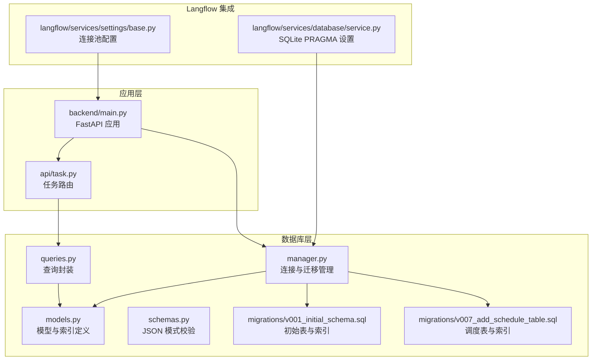
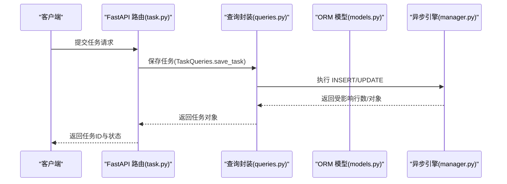
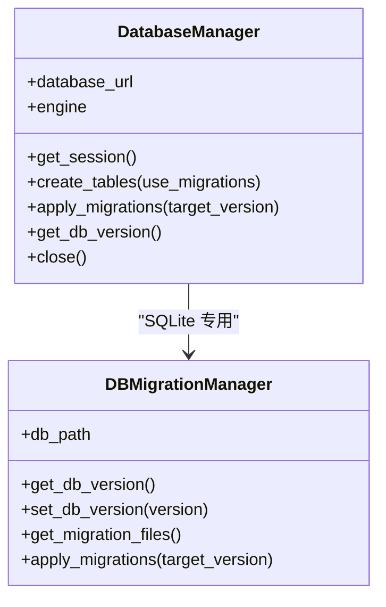
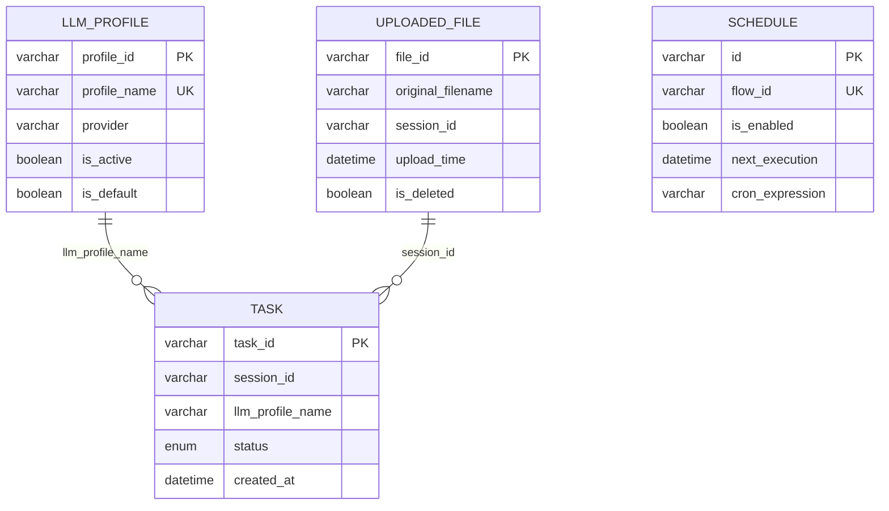
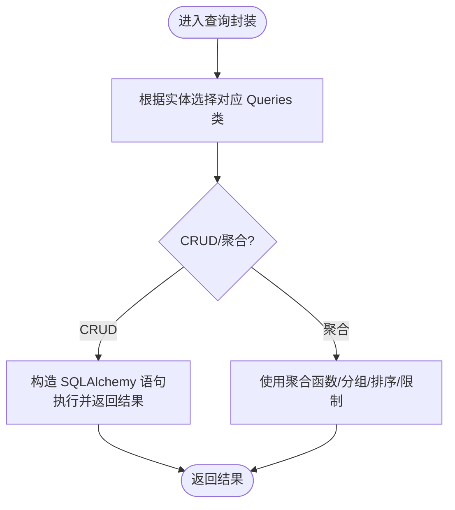
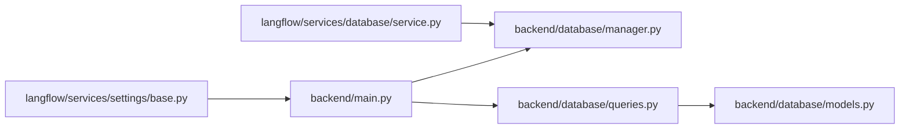

# 查询优化

<cite>
**本文引用的文件**
- [manager.py](file://vibe_surf/backend/database/manager.py)
- [models.py](file://vibe_surf/backend/database/models.py)
- [queries.py](file://vibe_surf/backend/database/queries.py)
- [schemas.py](file://vibe_surf/backend/database/schemas.py)
- [v001_initial_schema.sql](file://vibe_surf/backend/database/migrations/v001_initial_schema.sql)
- [v007_add_schedule_table.sql](file://vibe_surf/backend/database/migrations/v007_add_schedule_table.sql)
- [main.py](file://vibe_surf/backend/main.py)
- [task.py](file://vibe_surf/backend/api/task.py)
- [service.py](file://vibe_surf/langflow/services/settings/base.py)
- [service.py](file://vibe_surf/langflow/services/database/service.py)
</cite>

## 目录
1. [简介](#简介)
2. [项目结构](#项目结构)
3. [核心组件](#核心组件)
4. [架构总览](#架构总览)
5. [详细组件分析](#详细组件分析)
6. [依赖关系分析](#依赖关系分析)
7. [性能考量与优化策略](#性能考量与优化策略)
8. [故障排查指南](#故障排查指南)
9. [结论](#结论)
10. [附录](#附录)

## 简介
本文件聚焦于 VibeSurf 后端数据库查询优化，系统性梳理常见查询模式、潜在性能瓶颈与优化策略，覆盖索引设计原则、查询重写、连接优化、分页策略、性能监控与工具使用，并结合仓库现有实现给出可操作的改进建议与最佳实践。目标是帮助开发人员在不改变业务语义的前提下，编写更高效的数据库访问代码，提升整体响应速度与稳定性。

## 项目结构
后端数据库层由“模型定义 + 查询封装 + 连接管理 + 迁移脚本”构成，配合 FastAPI 路由与共享状态，形成从接口到持久化的完整链路。

图表来源
- [models.py](file://vibe_surf/backend/database/models.py#L1-L289)
- [queries.py](file://vibe_surf/backend/database/queries.py#L1-L1683)
- [manager.py](file://vibe_surf/backend/database/manager.py#L1-L319)
- [v001_initial_schema.sql](file://vibe_surf/backend/database/migrations/v001_initial_schema.sql#L1-L118)
- [v007_add_schedule_table.sql](file://vibe_surf/backend/database/migrations/v007_add_schedule_table.sql#L1-L29)
- [task.py](file://vibe_surf/backend/api/task.py#L1-L379)
- [main.py](file://vibe_surf/backend/main.py#L543-L731)
- [service.py](file://vibe_surf/langflow/services/settings/base.py#L117-L141)
- [service.py](file://vibe_surf/langflow/services/database/service.py#L164-L184)

章节来源
- [models.py](file://vibe_surf/backend/database/models.py#L1-L289)
- [queries.py](file://vibe_surf/backend/database/queries.py#L1-L1683)
- [manager.py](file://vibe_surf/backend/database/manager.py#L1-L319)
- [v001_initial_schema.sql](file://vibe_surf/backend/database/migrations/v001_initial_schema.sql#L1-L118)
- [v007_add_schedule_table.sql](file://vibe_surf/backend/database/migrations/v007_add_schedule_table.sql#L1-L29)
- [task.py](file://vibe_surf/backend/api/task.py#L1-L379)
- [main.py](file://vibe_surf/backend/main.py#L543-L731)
- [service.py](file://vibe_surf/langflow/services/settings/base.py#L117-L141)
- [service.py](file://vibe_surf/langflow/services/database/service.py#L164-L184)

## 核心组件
- 数据库连接与会话管理：异步引擎、静态连接池（SQLite）或生产级连接池参数（PostgreSQL/MySQL），支持迁移与版本控制。
- ORM 模型与索引：通过 SQLAlchemy 声明式基类定义表结构与索引；迁移脚本同步创建索引与触发器。
- 查询封装：围绕各实体提供统一的 CRUD 与聚合查询方法，集中处理分页、排序、过滤与时间戳更新。
- JSON 模式校验：对存储在 JSON 字段中的配置进行结构化校验，减少无效数据带来的查询与解析成本。
- 应用集成：FastAPI 路由在提交任务时调用查询封装，完成任务记录创建与状态流转。

章节来源
- [manager.py](file://vibe_surf/backend/database/manager.py#L148-L319)
- [models.py](file://vibe_surf/backend/database/models.py#L1-L289)
- [queries.py](file://vibe_surf/backend/database/queries.py#L1-L1683)
- [schemas.py](file://vibe_surf/backend/database/schemas.py#L1-L100)
- [task.py](file://vibe_surf/backend/api/task.py#L43-L146)

## 架构总览
下图展示从 API 到数据库的典型调用链，以及查询封装与索引的关系。

图表来源
- [task.py](file://vibe_surf/backend/api/task.py#L43-L146)
- [queries.py](file://vibe_surf/backend/database/queries.py#L441-L533)
- [models.py](file://vibe_surf/backend/database/models.py#L94-L156)
- [manager.py](file://vibe_surf/backend/database/manager.py#L148-L206)

## 详细组件分析

### 数据库连接与迁移管理
- 引擎类型选择：SQLite 使用静态池与较短超时，适合单机与开发环境；非 SQLite 使用生产级连接池参数（池大小、溢出、预检、回收周期等）。
- 迁移管理：支持按版本号应用迁移脚本，自动设置 SQLite 版本号；仅 SQLite 支持迁移管理器。
- 会话生命周期：统一的 get_session 管理事务提交/回滚/关闭，避免资源泄漏。

图表来源
- [manager.py](file://vibe_surf/backend/database/manager.py#L148-L319)

章节来源
- [manager.py](file://vibe_surf/backend/database/manager.py#L148-L319)

### ORM 模型与索引
- 主要实体：LLMProfile、Task、UploadedFile、McpProfile、VoiceProfile、ComposioToolkit、Credential、Schedule。
- 索引策略：
  - 单列索引：用于等值过滤与排序键，如 LLMProfile 的 name、is_active、is_default、provider；Task 的 status、session_id、llm_profile_name、created_at；UploadedFile 的 original_filename、session_id、upload_time、is_deleted；Schedule 的 flow_id、is_enabled、next_execution、cron_expression。
  - 复合索引：UploadedFile 的 (session_id, upload_time)、(is_deleted, upload_time)，可显著降低范围扫描与排序成本。
- 触发器：自动维护 updated_at 字段，减少应用侧重复逻辑。

图表来源
- [models.py](file://vibe_surf/backend/database/models.py#L157-L289)
- [v001_initial_schema.sql](file://vibe_surf/backend/database/migrations/v001_initial_schema.sql#L80-L118)
- [v007_add_schedule_table.sql](file://vibe_surf/backend/database/migrations/v007_add_schedule_table.sql#L17-L29)

章节来源
- [models.py](file://vibe_surf/backend/database/models.py#L157-L289)
- [v001_initial_schema.sql](file://vibe_surf/backend/database/migrations/v001_initial_schema.sql#L80-L118)
- [v007_add_schedule_table.sql](file://vibe_surf/backend/database/migrations/v007_add_schedule_table.sql#L17-L29)

### 查询封装与常见模式
- LLMProfileQueries：创建、查询、列表、更新、删除、默认配置、最后使用时间更新。
- TaskQueries：保存任务、按 ID/会话/LLM 配置查询、最近任务、会话聚合统计、运行中任务、按状态计数、状态更新、删除。
- UploadedFileQueries：文件记录创建、按 ID/会话查询、列表与计数、软删除、硬删除、清理过期已删记录。
- 其他实体：VoiceProfile、ComposioToolkit、Credential、Schedule 的查询封装，均遵循一致的命名与返回结构。

图表来源
- [queries.py](file://vibe_surf/backend/database/queries.py#L1-L1683)

章节来源
- [queries.py](file://vibe_surf/backend/database/queries.py#L1-L1683)

### 分页与排序策略
- 统一采用 limit/offset 或 -1 表示“全部”，并结合 order_by(desc(...)) 实现倒序。
- 对高频查询字段建立索引（如 created_at、upload_time），以减少排序与分页的成本。
- 建议优先使用基于游标/时间戳的“滚动分页”替代 offset，避免深层偏移导致的性能退化。

章节来源
- [queries.py](file://vibe_surf/backend/database/queries.py#L146-L173)
- [queries.py](file://vibe_surf/backend/database/queries.py#L535-L567)
- [queries.py](file://vibe_surf/backend/database/queries.py#L806-L834)
- [queries.py](file://vibe_surf/backend/database/queries.py#L887-L914)

### JSON 字段校验与存储
- schemas.py 定义了 TaskMetadata、LLMConfiguration、McpServerConfig 等 JSON 结构，通过 validate_json_field 进行规范化与校验，减少后续解析与错误处理开销。
- 建议在入库前完成校验与清洗，避免在查询阶段做昂贵的动态解析。

章节来源
- [schemas.py](file://vibe_surf/backend/database/schemas.py#L1-L100)

### API 集成点
- 任务提交流程：路由层在提交任务时调用 TaskQueries.save_task 创建初始记录，随后启动后台任务。
- 该路径涉及多次数据库交互（查询 LLM 配置、写入任务记录、提交事务），应确保事务边界清晰、异常回滚正确。

章节来源
- [task.py](file://vibe_surf/backend/api/task.py#L43-L146)

## 依赖关系分析
- 连接池与 SQLite PRAGMA：Langflow 服务层提供连接池参数建议；SQLite 连接建立时可设置 PRAGMA，影响锁竞争与 WAL 行为。
- FastAPI 生命周期：应用启动时初始化数据库与 Langflow 服务，关闭时释放资源，保证数据库连接安全回收。

图表来源
- [main.py](file://vibe_surf/backend/main.py#L543-L731)
- [manager.py](file://vibe_surf/backend/database/manager.py#L148-L206)
- [queries.py](file://vibe_surf/backend/database/queries.py#L1-L1683)
- [models.py](file://vibe_surf/backend/database/models.py#L1-L289)
- [service.py](file://vibe_surf/langflow/services/settings/base.py#L117-L141)
- [service.py](file://vibe_surf/langflow/services/database/service.py#L164-L184)

章节来源
- [main.py](file://vibe_surf/backend/main.py#L543-L731)
- [service.py](file://vibe_surf/langflow/services/settings/base.py#L117-L141)
- [service.py](file://vibe_surf/langflow/services/database/service.py#L164-L184)

## 性能考量与优化策略

### 1. 索引设计原则
- 等值过滤优先：为 profile_name、session_id、llm_profile_name、file_id 等等值过滤字段建立单列索引。
- 排序与范围：为 created_at、upload_time 等排序键建立索引；对 (session_id, upload_time)、(is_deleted, upload_time) 建立复合索引，减少排序与范围扫描。
- 聚合与分组：对 group by/聚合查询的维度字段（如 Task.session_id）建立索引，降低中间结果集大小。
- 避免冗余索引：同一列上不要重复创建相似索引；定期评估索引使用率，移除低效索引。

章节来源
- [models.py](file://vibe_surf/backend/database/models.py#L157-L289)
- [v001_initial_schema.sql](file://vibe_surf/backend/database/migrations/v001_initial_schema.sql#L80-L118)
- [v007_add_schedule_table.sql](file://vibe_surf/backend/database/migrations/v007_add_schedule_table.sql#L17-L29)

### 2. 查询重写与连接优化
- 使用 selectinload/joinedload 等加载策略，减少 N+1 查询；当前查询封装多为单表操作，注意避免跨表 JOIN 导致的笛卡尔积。
- 将频繁使用的过滤条件前置到 WHERE 子句，尽量利用索引；避免在 WHERE 中对列进行函数计算或隐式转换。
- 对聚合查询（如会话统计、状态计数）使用 group by + having，必要时在应用层缓存热点统计结果。

章节来源
- [queries.py](file://vibe_surf/backend/database/queries.py#L571-L612)
- [queries.py](file://vibe_surf/backend/database/queries.py#L736-L753)

### 3. 分页策略
- 当前实现：limit/offset + -1 表示“全部”。对深层 offset 的查询应谨慎，建议引入基于游标的时间戳/主键分页。
- 复合索引：确保分页字段（如 created_at、upload_time）有合适索引，避免全表扫描。
- 限制每页最大条数：防止一次性返回过多数据导致内存压力。

章节来源
- [queries.py](file://vibe_surf/backend/database/queries.py#L146-L173)
- [queries.py](file://vibe_surf/backend/database/queries.py#L535-L567)
- [queries.py](file://vibe_surf/backend/database/queries.py#L806-L834)
- [queries.py](file://vibe_surf/backend/database/queries.py#L887-L914)

### 4. 连接池与 SQLite 优化
- 连接池参数：生产环境建议使用预检与回收机制，避免长时间空闲连接失效；SQLite 在高并发写入场景下需谨慎调整池大小与溢出。
- SQLite PRAGMA：可通过服务层设置 PRAGMA（如 wal、journal_mode、cache_size 等）以改善并发与性能，但需结合实际工作负载验证效果。
- 事务粒度：批量写入时合并事务，减少提交次数；严格区分只读与写入路径，避免不必要的长事务。

章节来源
- [service.py](file://vibe_surf/langflow/services/settings/base.py#L117-L141)
- [service.py](file://vibe_surf/langflow/services/database/service.py#L164-L184)
- [manager.py](file://vibe_surf/backend/database/manager.py#L163-L184)

### 5. JSON 字段与序列化
- 在入库前完成 JSON 校验与清洗，避免在查询阶段做昂贵的动态解析；对大 JSON 字段考虑拆分或压缩存储。
- 使用 schemas.validate_json_field 统一入口，减少重复校验逻辑。

章节来源
- [schemas.py](file://vibe_surf/backend/database/schemas.py#L76-L100)

### 6. 监控与诊断
- SQL 日志：在开发环境可开启 echo（当前为 False），观察慢查询与执行计划；生产环境谨慎开启，避免日志风暴。
- 慢查询识别：结合数据库自带 EXPLAIN/EXPLAIN QUERY PLAN（SQLite/PostgreSQL）分析执行路径；定位缺失索引或排序瓶颈。
- 性能回归：对关键查询建立基准测试，持续监控延迟与吞吐变化。

章节来源
- [manager.py](file://vibe_surf/backend/database/manager.py#L163-L184)

### 7. 实际测试与对比建议
- 基准场景：模拟不同规模的数据（会话数量、任务数量、文件数量）与查询模式（分页、排序、过滤、聚合）。
- 指标：平均/95 分位延迟、吞吐量、连接池等待时间、锁等待次数。
- 变更对比：在引入新索引或重写查询前后分别采集数据，评估收益与副作用。

（本节为通用指导，不直接引用具体代码）

## 故障排查指南
- 事务失败：检查 get_session 的 try/except/finally 是否正确提交/回滚/关闭；确认异常是否被上抛并记录。
- 迁移失败：查看 DBMigrationManager.apply_migrations 的异常日志，确认目标版本与迁移脚本顺序；SQLite 仅支持迁移管理器。
- 连接问题：核对连接池参数与数据库类型；SQLite 注意 PRAGMA 设置与 WAL 模式。
- 查询缓慢：确认相关字段是否具备索引；检查 ORDER BY/LIMIT 是否命中索引；必要时重写查询或引入复合索引。

章节来源
- [manager.py](file://vibe_surf/backend/database/manager.py#L229-L239)
- [manager.py](file://vibe_surf/backend/database/manager.py#L241-L269)
- [service.py](file://vibe_surf/langflow/services/database/service.py#L164-L184)

## 结论
通过对模型、查询封装、连接管理与迁移脚本的系统性分析，可以发现 VibeSurf 已在关键字段上建立了较为完善的索引体系，并通过统一的查询封装与连接管理降低了复杂度。进一步的优化方向在于：完善复合索引覆盖高频查询、引入游标分页、加强 JSON 校验与序列化、优化连接池参数与 SQLite PRAGMA、并建立持续的性能监控与回归测试机制。这些措施可在不改变业务逻辑的前提下，显著提升查询效率与系统稳定性。

## 附录
- 快速参考
  - 常用查询封装位置：[LLMProfileQueries](file://vibe_surf/backend/database/queries.py#L21-L264)、[TaskQueries](file://vibe_surf/backend/database/queries.py#L441-L753)、[UploadedFileQueries](file://vibe_surf/backend/database/queries.py#L755-L932)、[其他实体查询](file://vibe_surf/backend/database/queries.py#L933-L1683)
  - 索引定义位置：[models.py](file://vibe_surf/backend/database/models.py#L157-L289)、[v001_initial_schema.sql](file://vibe_surf/backend/database/migrations/v001_initial_schema.sql#L80-L118)、[v007_add_schedule_table.sql](file://vibe_surf/backend/database/migrations/v007_add_schedule_table.sql#L17-L29)
  - 连接池与 PRAGMA：[settings/base.py](file://vibe_surf/langflow/services/settings/base.py#L117-L141)、[database/service.py](file://vibe_surf/langflow/services/database/service.py#L164-L184)
  - API 集成点：[task.py](file://vibe_surf/backend/api/task.py#L43-L146)