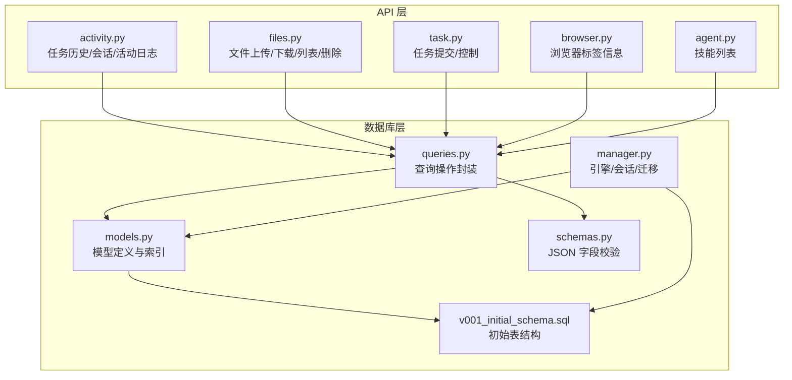
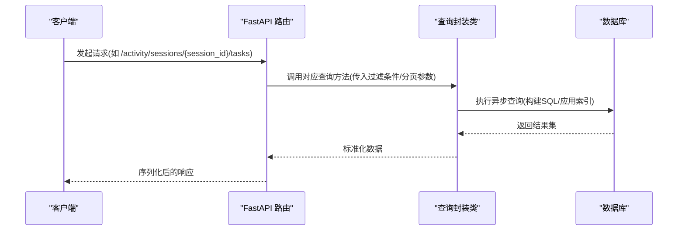
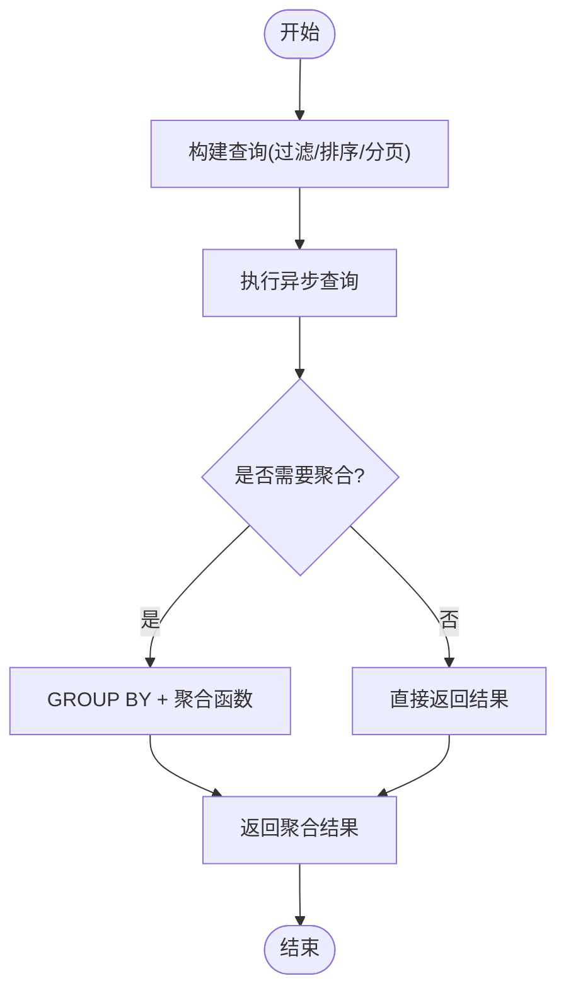
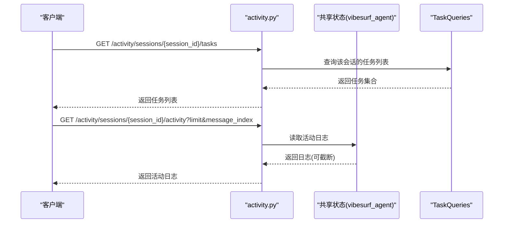
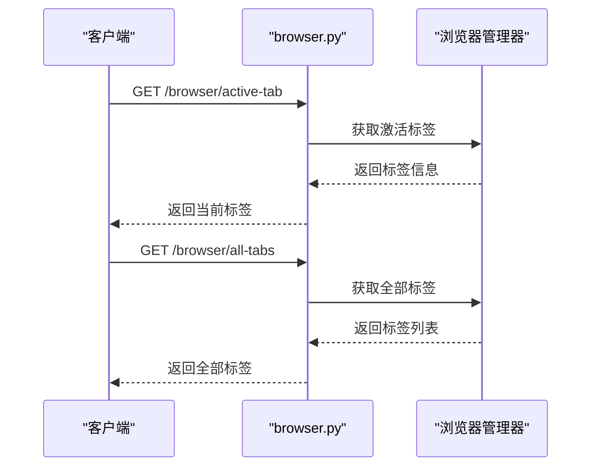
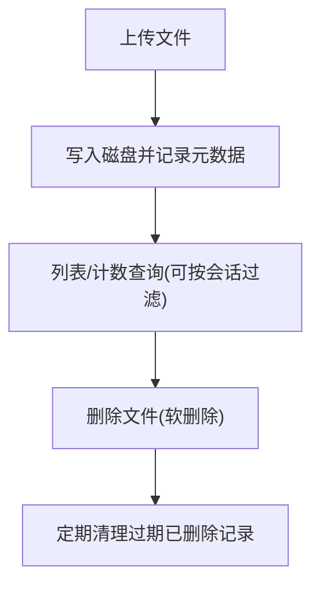
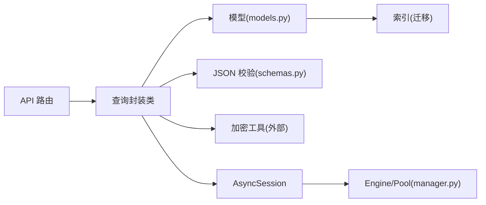

# 查询模式

<cite>
**本文引用的文件**
- [models.py](file://vibe_surf/backend/database/models.py)
- [queries.py](file://vibe_surf/backend/database/queries.py)
- [manager.py](file://vibe_surf/backend/database/manager.py)
- [schemas.py](file://vibe_surf/backend/database/schemas.py)
- [v001_initial_schema.sql](file://vibe_surf/backend/database/migrations/v001_initial_schema.sql)
- [activity.py](file://vibe_surf/backend/api/activity.py)
- [files.py](file://vibe_surf/backend/api/files.py)
- [task.py](file://vibe_surf/backend/api/task.py)
- [models.py（API）](file://vibe_surf/backend/api/models.py)
- [browser.py](file://vibe_surf/backend/api/browser.py)
- [agent.py](file://vibe_surf/backend/api/agent.py)
</cite>

## 目录
1. [简介](#简介)
2. [项目结构](#项目结构)
3. [核心组件](#核心组件)
4. [架构总览](#架构总览)
5. [详细组件分析](#详细组件分析)
6. [依赖关系分析](#依赖关系分析)
7. [性能考量](#性能考量)
8. [故障排查指南](#故障排查指南)
9. [结论](#结论)

## 简介
本文件系统性梳理 VibeSurf 后端数据库查询模式，覆盖常见 CRUD 操作与复杂查询场景，包括：
- 任务查询：按会话、按 LLM 配置、最近任务、运行中任务、按状态计数等
- 代理状态与工作流执行历史：会话聚合、任务详情、实时活动日志
- 浏览器会话检索：当前标签页与全部标签页信息
- 文件管理：上传、列表、软删除、清理过期记录
- 分页策略：基于偏移的分页与基于游标的分页选择建议
- 查询重写与优化：避免 N+1、合理使用索引与连接、子查询改写

目标是帮助开发者在不直接阅读代码的情况下，也能快速理解并正确使用查询模式，同时掌握最佳实践与常见陷阱。

## 项目结构
后端数据库层采用 SQLAlchemy 异步 ORM，查询集中在 queries.py 中，模型定义在 models.py，API 层通过 FastAPI 路由调用查询层并返回标准化响应。

图表来源
- [activity.py](file://vibe_surf/backend/api/activity.py#L1-L246)
- [files.py](file://vibe_surf/backend/api/files.py#L1-L332)
- [task.py](file://vibe_surf/backend/api/task.py#L1-L379)
- [browser.py](file://vibe_surf/backend/api/browser.py#L1-L71)
- [agent.py](file://vibe_surf/backend/api/agent.py#L1-L38)
- [queries.py](file://vibe_surf/backend/database/queries.py#L1-L1683)
- [models.py](file://vibe_surf/backend/database/models.py#L1-L289)
- [manager.py](file://vibe_surf/backend/database/manager.py#L1-L319)
- [schemas.py](file://vibe_surf/backend/database/schemas.py#L1-L100)
- [v001_initial_schema.sql](file://vibe_surf/backend/database/migrations/v001_initial_schema.sql#L1-L118)

章节来源
- [models.py](file://vibe_surf/backend/database/models.py#L1-L289)
- [queries.py](file://vibe_surf/backend/database/queries.py#L1-L1683)
- [manager.py](file://vibe_surf/backend/database/manager.py#L1-L319)
- [schemas.py](file://vibe_surf/backend/database/schemas.py#L1-L100)
- [v001_initial_schema.sql](file://vibe_surf/backend/database/migrations/v001_initial_schema.sql#L1-L118)

## 核心组件
- 数据库模型与索引：定义表结构、枚举类型、索引，确保查询性能与一致性
- 查询封装：集中化 CRUD 与复杂查询逻辑，统一异常处理与日志
- 会话与迁移：异步引擎配置、SQLite 迁移管理、FastAPI 依赖注入
- API 路由：对外暴露任务、文件、活动日志、浏览器、代理等接口

章节来源
- [models.py](file://vibe_surf/backend/database/models.py#L1-L289)
- [queries.py](file://vibe_surf/backend/database/queries.py#L1-L1683)
- [manager.py](file://vibe_surf/backend/database/manager.py#L1-L319)

## 架构总览
查询模式围绕以下关键路径展开：
- API 路由接收请求参数，调用查询封装类执行数据库操作
- 查询封装类使用 SQLAlchemy 异步查询构造器构建 SQL
- 返回结果经 API 层序列化为标准响应模型

图表来源
- [activity.py](file://vibe_surf/backend/api/activity.py#L85-L118)
- [queries.py](file://vibe_surf/backend/database/queries.py#L534-L554)

章节来源
- [activity.py](file://vibe_surf/backend/api/activity.py#L1-L246)
- [queries.py](file://vibe_surf/backend/database/queries.py#L441-L754)

## 详细组件分析

### 任务查询模式
- 单任务查询：按 task_id 获取任务详情
- 会话任务查询：按 session_id 获取该会话下所有任务，并支持分页
- 最近任务查询：按创建时间倒序获取最近任务，支持“全部”或限制数量
- 运行中/暂停任务查询：按状态筛选
- 按 LLM 配置名查询：按 llm_profile_name 过滤任务
- 任务状态计数：按状态分组统计任务数量
- 会话聚合：按 session_id 聚合任务数量、创建时间、最新状态、最后活跃时间

图表来源
- [queries.py](file://vibe_surf/backend/database/queries.py#L534-L612)

章节来源
- [queries.py](file://vibe_surf/backend/database/queries.py#L524-L754)
- [models.py](file://vibe_surf/backend/database/models.py#L94-L137)

### 代理状态与工作流执行历史
- 会话列表：返回每个会话的任务总数、创建时间、最后活跃时间、最新状态
- 任务详情：按 task_id 返回完整任务信息
- 实时活动日志：从共享状态中读取 VibeSurf 代理活动日志，支持按消息索引或限制条数
- 最新活动：返回会话的最新代理日志

图表来源
- [activity.py](file://vibe_surf/backend/api/activity.py#L85-L218)
- [queries.py](file://vibe_surf/backend/database/queries.py#L534-L612)

章节来源
- [activity.py](file://vibe_surf/backend/api/activity.py#L1-L246)
- [queries.py](file://vibe_surf/backend/database/queries.py#L524-L754)

### 浏览器会话检索
- 当前标签页：返回当前激活标签的信息
- 全部标签页：返回所有页面目标的标签信息

图表来源
- [browser.py](file://vibe_surf/backend/api/browser.py#L1-L71)

章节来源
- [browser.py](file://vibe_surf/backend/api/browser.py#L1-L71)

### 文件管理查询模式
- 上传文件：保存文件到工作区目录，记录元数据到 uploaded_files 表
- 下载文件：按 file_id 获取文件记录并安全返回
- 列表文件：支持按 session_id 过滤、分页、仅显示未删除记录
- 计数文件：统计满足条件的文件数量
- 删除文件：软删除(标记 is_deleted)，支持清理过期已删除记录

图表来源
- [files.py](file://vibe_surf/backend/api/files.py#L57-L230)
- [queries.py](file://vibe_surf/backend/database/queries.py#L755-L932)

章节来源
- [files.py](file://vibe_surf/backend/api/files.py#L1-L332)
- [queries.py](file://vibe_surf/backend/database/queries.py#L755-L932)

### 分页查询实现与选择
- 基于偏移的分页
  - 适用场景：小到中等规模数据、简单排序字段稳定
  - 实现要点：limit/offset 参数；当 limit=-1 时表示“全部”
  - 示例：会话列表、最近任务、文件列表
- 基于游标的分页
  - 适用场景：大规模数据、高并发、避免跳页与偏移越界
  - 实现要点：使用时间戳或自增主键作为游标；前端维护 last_cursor
  - 建议：对高频接口(如会话列表、文件列表)逐步引入游标分页

章节来源
- [activity.py](file://vibe_surf/backend/api/activity.py#L61-L84)
- [files.py](file://vibe_surf/backend/api/files.py#L181-L230)
- [queries.py](file://vibe_surf/backend/database/queries.py#L534-L612)

### 查询重写与优化示例
- 避免 N+1 查询
  - 使用 selectinload 或批量预加载，减少多次往返
  - 对于多表关联，优先一次性 JOIN 并投影所需字段
- 合理使用索引
  - 模型与迁移文件已建立常用索引：tasks.status、tasks.session_id、tasks.llm_profile_name、tasks.created_at、uploaded_files.session_id/upload_time、uploaded_files.is_deleted/upload_time 等
  - 在高频过滤字段上保持索引，避免全表扫描
- 子查询改写
  - 将“先查再循环”的模式改写为单次子查询，减少网络往返
  - 使用 exists/any 代替 in 子句，提升可读性与性能
- 聚合查询
  - 使用 group_by + 聚合函数替代应用层聚合，降低内存压力
- 时间范围查询
  - 使用 created_at/updated_at 等时间字段配合索引，避免函数包裹导致索引失效

章节来源
- [models.py](file://vibe_surf/backend/database/models.py#L157-L289)
- [v001_initial_schema.sql](file://vibe_surf/backend/database/migrations/v001_initial_schema.sql#L80-L118)
- [queries.py](file://vibe_surf/backend/database/queries.py#L571-L612)

## 依赖关系分析
- API 路由依赖查询封装类，查询封装类依赖模型与加密工具
- 查询封装类依赖 SQLAlchemy 异步查询构造器与数据库会话
- 数据库会话由数据库管理器提供，支持 SQLite 迁移与生产环境连接池

图表来源
- [queries.py](file://vibe_surf/backend/database/queries.py#L1-L1683)
- [models.py](file://vibe_surf/backend/database/models.py#L1-L289)
- [schemas.py](file://vibe_surf/backend/database/schemas.py#L1-L100)
- [manager.py](file://vibe_surf/backend/database/manager.py#L148-L240)

章节来源
- [queries.py](file://vibe_surf/backend/database/queries.py#L1-L1683)
- [models.py](file://vibe_surf/backend/database/models.py#L1-L289)
- [manager.py](file://vibe_surf/backend/database/manager.py#L148-L240)

## 性能考量
- 异步 I/O：使用异步引擎与会话，避免阻塞
- 连接池：生产环境启用连接池与预检，减少连接开销
- 索引命中：确保过滤/排序字段有索引；避免在索引列上使用函数
- 查询粒度：尽量投影必要字段，避免 SELECT *
- 批量操作：批量插入/更新时减少往返次数
- 缓存：对只读高频数据(如技能列表)考虑短期缓存

## 故障排查指南
- 查询异常：检查查询封装类中的异常捕获与日志输出
- 会话丢失：确认 FastAPI 依赖注入是否正确初始化数据库管理器
- 文件访问：下载时检查路径安全与磁盘存在性
- 任务状态：确认状态枚举与时间戳字段更新逻辑

章节来源
- [queries.py](file://vibe_surf/backend/database/queries.py#L1-L1683)
- [manager.py](file://vibe_surf/backend/database/manager.py#L275-L306)
- [files.py](file://vibe_surf/backend/api/files.py#L156-L179)

## 结论
VibeSurf 的数据库查询模式以 SQLAlchemy 异步 ORM 为核心，通过集中化的查询封装类实现了清晰的职责分离与一致的错误处理。结合合理的索引设计与分页策略，系统能够在中小规模数据下高效运行。建议在高频接口中逐步引入游标分页，并持续关注查询重写与索引优化，以应对未来业务增长带来的性能挑战。