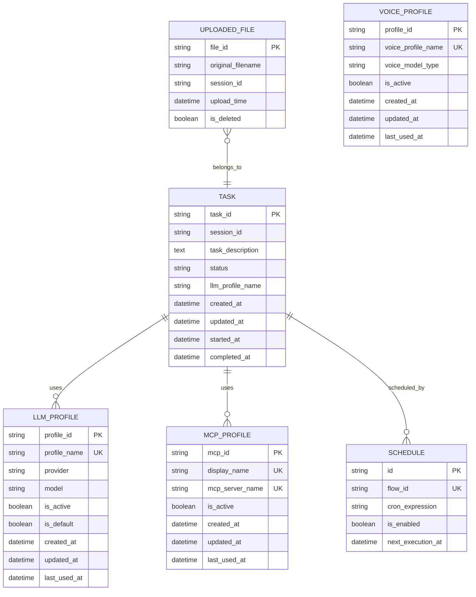
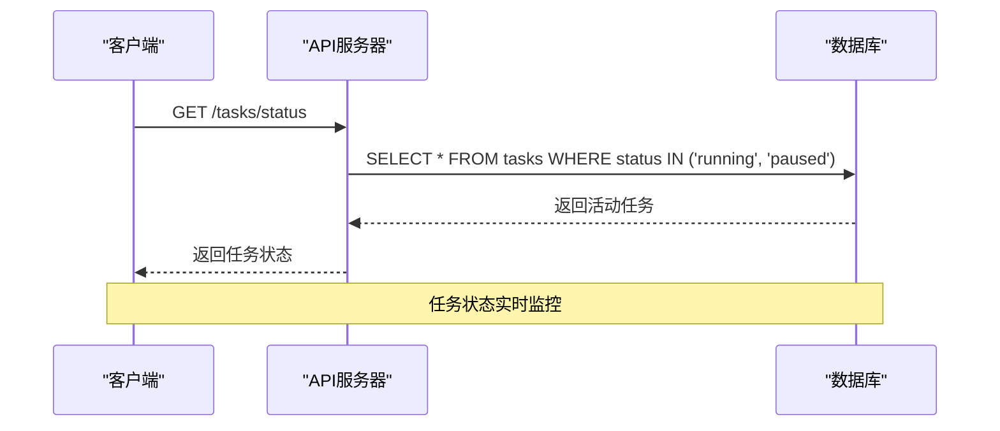
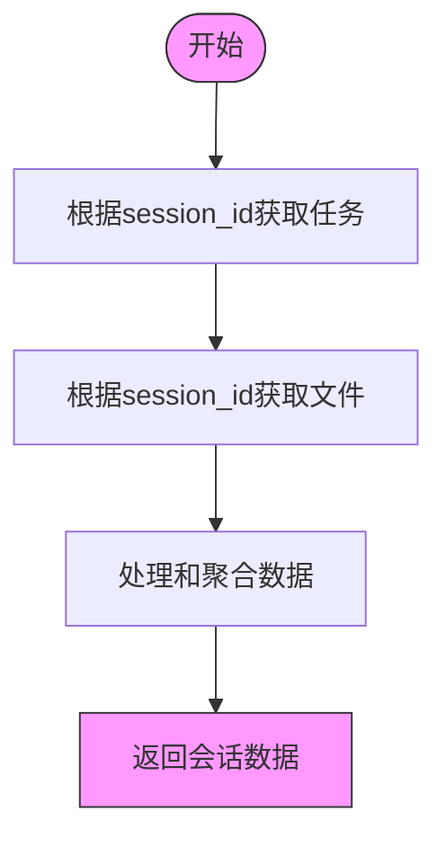
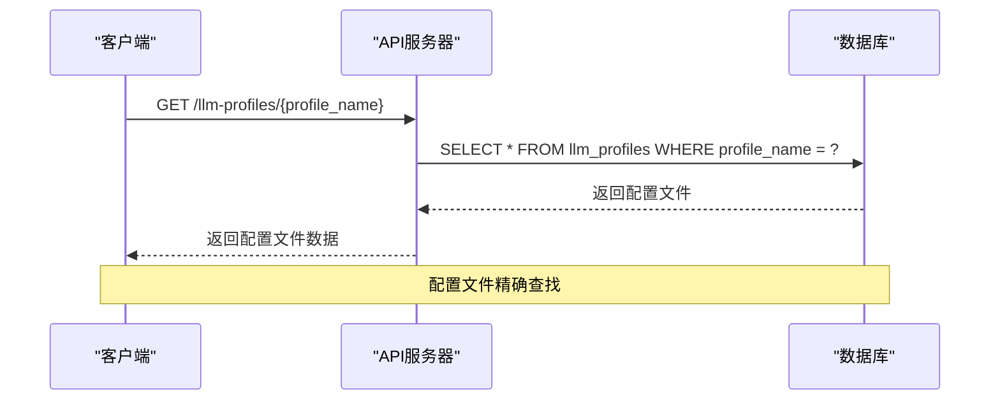

# 索引策略

<cite>
**本文档引用的文件**   
- [models.py](file://vibe_surf/backend/database/models.py)
- [v001_initial_schema.sql](file://vibe_surf/backend/database/migrations/v001_initial_schema.sql)
- [queries.py](file://vibe_surf/backend/database/queries.py)
- [task.py](file://vibe_surf/backend/api/task.py)
- [schemas.py](file://vibe_surf/backend/database/schemas.py)
- [env.py](file://vibe_surf/langflow/alembic/env.py)
</cite>

## 目录
1. [引言](#引言)
2. [核心数据表分析](#核心数据表分析)
3. [查询访问模式分析](#查询访问模式分析)
4. [索引设计方案](#索引设计方案)
5. [索引最佳实践](#索引最佳实践)
6. [Alembic迁移示例](#alembic迁移示例)
7. [性能测试方法](#性能测试方法)
8. [结论](#结论)

## 引言
本文档详细阐述了VibeSurf系统的数据库索引策略。通过对任务表、代理表、浏览器会话表和工作流表等核心实体的查询访问模式进行深入分析，设计了最优的索引方案。文档详细说明了单列索引、复合索引和唯一约束的使用场景，特别是针对任务状态、代理ID、会话ID和时间戳等高频查询字段的索引设计。同时，文档化了索引创建和维护的最佳实践，包括索引命名规范、索引大小监控和碎片整理策略，并提供了使用Alembic进行索引迁移的示例代码以及评估索引效果的性能测试方法。

## 核心数据表分析
VibeSurf系统的核心数据表包括任务表（tasks）、LLM配置文件表（llm_profiles）、上传文件表（uploaded_files）、MCP配置文件表（mcp_profiles）、语音配置文件表（voice_profiles）和计划表（schedules）。这些表通过会话ID、配置文件名称等字段相互关联，构成了系统的核心数据模型。



**Diagram sources**
- [models.py](file://vibe_surf/backend/database/models.py#L94-L289)

**Section sources**
- [models.py](file://vibe_surf/backend/database/models.py#L94-L289)

## 查询访问模式分析
通过对API端点和查询代码的分析，可以识别出系统中的主要查询访问模式。这些模式主要集中在任务状态监控、会话数据检索、配置文件管理和计划执行等方面。

### 任务状态监控
任务状态监控是系统中最频繁的查询模式之一。API端点`/tasks/status`和`/tasks/detailed-status`需要快速检查当前是否有活动任务，并获取任务的详细状态信息。这涉及到对任务表的`status`字段进行查询，特别是查找状态为"running"或"paused"的任务。



**Diagram sources**
- [task.py](file://vibe_surf/backend/api/task.py#L34-L40)
- [queries.py](file://vibe_surf/backend/database/queries.py#L660-L669)

### 会话数据检索
会话数据检索是另一个重要的查询模式。系统需要根据会话ID获取该会话下的所有任务和上传文件。这种查询通常用于前端界面显示会话历史和文件列表，对`session_id`字段的查询频率很高。



**Diagram sources**
- [queries.py](file://vibe_surf/backend/database/queries.py#L535-L554)
- [queries.py](file://vibe_surf/backend/database/queries.py#L759-L790)

### 配置文件管理
配置文件管理涉及LLM配置文件、MCP配置文件和语音配置文件的创建、更新、删除和查询。这些操作需要根据配置文件名称或ID进行精确查找，对`profile_name`、`display_name`等字段的查询非常频繁。



**Diagram sources**
- [queries.py](file://vibe_surf/backend/database/queries.py#L93-L105)
- [queries.py](file://vibe_surf/backend/database/queries.py#L309-L321)

## 索引设计方案
基于对查询访问模式的分析，为VibeSurf系统的核心数据表设计了以下索引方案。这些索引旨在优化高频查询的性能，同时避免不必要的索引开销。

### 任务表索引
任务表是系统中最核心的表，其索引设计对整体性能至关重要。当前已有的索引包括`idx_tasks_status`、`idx_tasks_session`、`idx_tasks_llm_profile`和`idx_tasks_created`，这些索引覆盖了大部分查询场景。

```mermaid
classDiagram
class Task {
+string task_id
+string session_id
+text task_description
+string status
+string llm_profile_name
+datetime created_at
+datetime updated_at
+datetime started_at
+datetime completed_at
+JSON task_metadata
}
class Index {
+create_index(table, columns)
+drop_index(index_name)
+analyze_index(index_name)
}
Task --> Index : "has indexes"
note right of Task
索引 :
- idx_tasks_status (status)
- idx_tasks_session (session_id)
- idx_tasks_llm_profile (llm_profile_name)
- idx_tasks_created (created_at)
- idx_tasks_time_range (created_at, completed_at)
end note
```

**Diagram sources**
- [models.py](file://vibe_surf/backend/database/models.py#L163-L167)
- [v001_initial_schema.sql](file://vibe_surf/backend/database/migrations/v001_initial_schema.sql#L85-L88)

### 复合索引设计
对于涉及多个字段的查询，复合索引比单列索引更有效。例如，对于按时间范围查询任务的场景，建议创建`idx_tasks_time_range`复合索引，覆盖`created_at`和`completed_at`字段。

```sql
-- 创建任务时间范围复合索引
CREATE INDEX idx_tasks_time_range ON tasks(created_at, completed_at);
```

此外，对于上传文件表，现有的`idx_uploaded_files_session_time`复合索引已经很好地支持了按会话和上传时间查询的场景。

```sql
-- 现有的上传文件复合索引
CREATE INDEX idx_uploaded_files_session_time ON uploaded_files(session_id, upload_time);
```

### 唯一约束设计
唯一约束不仅保证了数据完整性，还可以作为索引使用。在VibeSurf系统中，`llm_profiles`表的`profile_name`字段、`mcp_profiles`表的`display_name`和`mcp_server_name`字段都设置了唯一约束，这既防止了重复数据，又优化了按名称查找的性能。

```mermaid
erDiagram
LLM_PROFILE {
string profile_id PK
string profile_name UK
string provider
string model
}
MCP_PROFILE {
string mcp_id PK
string display_name UK
string mcp_server_name UK
}
note right of LLM_PROFILE
profile_name: 唯一约束
end note
note right of MCP_PROFILE
display_name: 唯一约束
mcp_server_name: 唯一约束
end note
```

**Diagram sources**
- [models.py](file://vibe_surf/backend/database/models.py#L63)
- [models.py](file://vibe_surf/backend/database/models.py#L174-L175)

## 索引最佳实践
为了确保索引的有效性和可维护性，需要遵循一系列最佳实践。这些实践涵盖了索引命名、大小监控和碎片整理等方面。

### 索引命名规范
统一的索引命名规范有助于索引的管理和维护。建议采用`idx_{table_name}_{column_name}`的命名格式，对于复合索引，可以使用`idx_{table_name}_{column1_name}_{column2_name}`的格式。

```python
# 索引命名示例
index_name = f"idx_{table_name}_{'_'.join(column_names)}"
```

### 索引大小监控
定期监控索引大小可以帮助识别潜在的性能问题。过大的索引不仅占用大量存储空间，还会影响写操作的性能。可以通过数据库系统表查询索引大小，并设置告警阈值。

```sql
-- 查询索引大小（SQLite示例）
SELECT 
    name AS index_name,
    sql AS index_definition
FROM sqlite_master 
WHERE type = 'index' AND tbl_name = 'tasks';
```

### 碎片整理策略
随着数据的增删改，索引可能会产生碎片，影响查询性能。建议定期执行碎片整理操作，特别是在大量数据删除后。对于SQLite数据库，可以使用`VACUUM`命令来整理碎片。

```sql
-- 整理数据库碎片
VACUUM;
```

## Alembic迁移示例
使用Alembic进行数据库迁移是管理索引变更的推荐方式。以下是一个创建新索引的Alembic迁移示例。

```python
"""Add task time range index

Revision ID: 1a2b3c4d5e6f
Revises: 0a1b2c3d4e5f
Create Date: 2025-01-01 00:00:00.000000

"""
from alembic import op
import sqlalchemy as sa

# revision identifiers
revision = '1a2b3c4d5e6f'
down_revision = '0a1b2c3d4e5f'
branch_labels = None
depends_on = None

def upgrade():
    # 创建任务时间范围复合索引
    op.create_index(
        'idx_tasks_time_range',
        'tasks',
        ['created_at', 'completed_at'],
        unique=False
    )

def downgrade():
    # 删除任务时间范围复合索引
    op.drop_index('idx_tasks_time_range', table_name='tasks')
```

**Section sources**
- [env.py](file://vibe_surf/langflow/alembic/env.py)

## 性能测试方法
为了评估索引的效果，需要进行系统的性能测试。这包括基准测试、查询计划分析和负载测试。

### 基准测试
基准测试是评估索引性能的基础。可以通过对比添加索引前后的查询响应时间来量化索引的效果。

```python
import time
import sqlite3

def benchmark_query_performance():
    conn = sqlite3.connect('vibesurf.db')
    cursor = conn.cursor()
    
    # 测试查询
    query = "SELECT * FROM tasks WHERE status = 'running'"
    
    # 测量执行时间
    start_time = time.time()
    cursor.execute(query)
    results = cursor.fetchall()
    end_time = time.time()
    
    print(f"查询执行时间: {end_time - start_time:.4f}秒")
    print(f"返回结果数: {len(results)}")
    
    conn.close()
```

### 查询计划分析
使用数据库的`EXPLAIN QUERY PLAN`功能可以分析查询的执行计划，了解查询是否使用了预期的索引。

```sql
-- 分析查询执行计划
EXPLAIN QUERY PLAN SELECT * FROM tasks WHERE status = 'running';
```

### 负载测试
负载测试可以模拟真实环境下的并发查询，评估索引在高负载下的表现。可以使用工具如`ab`或`wrk`进行HTTP级别的负载测试，或直接在数据库层面进行并发查询测试。

```python
import asyncio
import aiohttp

async def load_test():
    async with aiohttp.ClientSession() as session:
        tasks = []
        for _ in range(100):  # 100个并发请求
            task = asyncio.create_task(
                session.get('http://localhost:8000/tasks/status')
            )
            tasks.append(task)
        
        responses = await asyncio.gather(*tasks)
        successful = sum(1 for r in responses if r.status == 200)
        print(f"成功请求: {successful}/100")
```

## 结论
本文档详细分析了VibeSurf系统的数据库索引策略，为任务表、代理表、浏览器会话表和工作流表等核心实体设计了最优的索引方案。通过单列索引、复合索引和唯一约束的合理使用，特别是针对任务状态、代理ID、会话ID和时间戳等高频查询字段的索引设计，可以显著提升系统的查询性能。文档还提供了索引创建和维护的最佳实践，包括索引命名规范、索引大小监控和碎片整理策略，并给出了使用Alembic进行索引迁移的示例代码和评估索引效果的性能测试方法。遵循这些策略和实践，可以确保VibeSurf系统在高负载下仍能保持良好的性能和可扩展性。