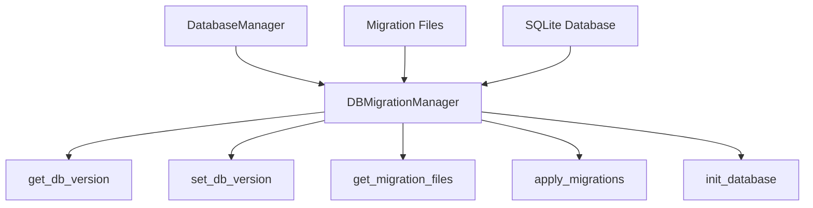
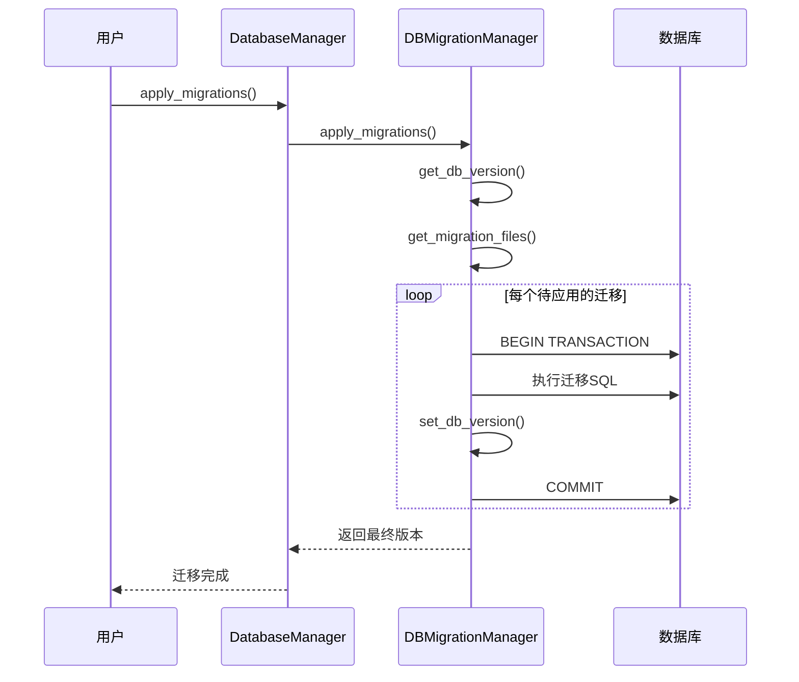

# 迁移管理

<cite>
**本文档中引用的文件**  
- [manager.py](file://vibe_surf/backend/database/manager.py)
- [models.py](file://vibe_surf/backend/database/models.py)
- [v001_initial_schema.sql](file://vibe_surf/backend/database/migrations/v001_initial_schema.sql)
- [v002_add_agent_mode.sql](file://vibe_surf/backend/database/migrations/v002_add_agent_mode.sql)
- [v003_fix_task_status_case.sql](file://vibe_surf/backend/database/migrations/v003_fix_task_status_case.sql)
- [v004_add_voice_profiles.sql](file://vibe_surf/backend/database/migrations/v004_add_voice_profiles.sql)
- [v005_add_composio_integration.sql](file://vibe_surf/backend/database/migrations/v005_add_composio_integration.sql)
- [v006_add_credentials_table.sql](file://vibe_surf/backend/database/migrations/v006_add_credentials_table.sql)
- [v007_add_schedule_table.sql](file://vibe_surf/backend/database/migrations/v007_add_schedule_table.sql)
- [alembic.ini](file://vibe_surf/langflow/alembic.ini)
- [env.py](file://vibe_surf/langflow/alembic/env.py)
</cite>

## 目录
1. [引言](#引言)
2. [迁移系统架构](#迁移系统架构)
3. [迁移流程](#迁移流程)
4. [迁移脚本结构](#迁移脚本结构)
5. [迁移最佳实践](#迁移最佳实践)
6. [常见迁移场景](#常见迁移场景)
7. [测试与部署策略](#测试与部署策略)
8. [结论](#结论)

## 引言
VibeSurf项目采用基于SQL的迁移系统来管理数据库模式变更。该系统专为SQLite数据库设计，使用自定义迁移管理器来跟踪和应用数据库变更。迁移系统通过`DBMigrationManager`类实现，该类负责管理从初始模式到最新模式的逐步升级。每个迁移脚本都是一个SQL文件，按照版本号顺序命名，确保数据库模式能够可靠地演进。本文档详细说明了迁移系统的各个方面，包括创建新迁移、应用迁移、回滚迁移的流程，以及迁移脚本的结构和编写规范。

## 迁移系统架构

VibeSurf的迁移系统由几个关键组件组成，它们协同工作以确保数据库模式变更的安全和可靠。核心是`DBMigrationManager`类，它负责管理迁移的整个生命周期。该系统使用SQLite的`user_version` pragma来跟踪当前数据库版本，并通过按版本号排序的SQL文件应用增量变更。



**图源**  
- [manager.py](file://vibe_surf/backend/database/manager.py#L27-L257)

**本节来源**  
- [manager.py](file://vibe_surf/backend/database/manager.py#L27-L257)

## 迁移流程

### 创建新迁移
创建新迁移涉及创建一个遵循特定命名约定的SQL文件。文件名格式为`v{版本号}_{描述}.sql`，其中版本号是三位数，描述是迁移的简短说明。例如，`v008_add_user_preferences.sql`。迁移文件应包含所有必要的SQL语句来修改数据库模式，包括创建表、添加列、修改约束等。

### 应用迁移
应用迁移是通过`DBMigrationManager`的`apply_migrations`方法完成的。该方法首先检查当前数据库版本，然后按顺序应用所有高于当前版本的迁移文件。每个迁移文件作为一个事务执行，确保如果任何语句失败，整个迁移将回滚。



**图源**  
- [manager.py](file://vibe_surf/backend/database/manager.py#L99-L145)

**本节来源**  
- [manager.py](file://vibe_surf/backend/database/manager.py#L99-L145)

### 回滚迁移
VibeSurf的迁移系统目前不支持自动回滚。由于迁移是单向的且可能涉及数据转换，回滚需要手动创建反向迁移。建议在应用迁移前备份数据库，以便在出现问题时可以恢复到先前状态。

## 迁移脚本结构

迁移脚本是纯SQL文件，包含创建、修改或删除数据库对象的语句。每个脚本应以注释开头，描述迁移的目的和版本信息。脚本应包含错误处理和条件检查，以确保在不同环境中都能安全执行。

### upgrade() 和 downgrade() 函数
与Alembic不同，VibeSurf的迁移系统不使用Python函数，而是直接使用SQL脚本。因此，没有`upgrade()`和`downgrade()`函数。相反，整个SQL文件被视为"升级"操作。对于回滚，需要创建一个新的迁移文件来撤销前一个迁移的更改。

### 脚本编写规范
- 使用`IF NOT EXISTS`和`IF EXISTS`子句来避免错误
- 为新表和索引使用`CREATE INDEX IF NOT EXISTS`
- 在修改表结构前检查列是否存在
- 使用事务确保原子性
- 包含详细的注释说明每个语句的目的

```sql
-- Migration: v008_add_user_preferences.sql
-- Description: Add user_preferences table for storing user settings
-- Version: 0.0.8

-- Enable foreign keys
PRAGMA foreign_keys = ON;

-- Create user_preferences table
CREATE TABLE IF NOT EXISTS user_preferences (
    id VARCHAR(36) PRIMARY KEY,
    user_id VARCHAR(36) NOT NULL,
    theme VARCHAR(20) DEFAULT 'light',
    language VARCHAR(10) DEFAULT 'en',
    created_at DATETIME NOT NULL DEFAULT CURRENT_TIMESTAMP,
    updated_at DATETIME NOT NULL DEFAULT CURRENT_TIMESTAMP
);

-- Create indexes for better performance
CREATE INDEX IF NOT EXISTS idx_user_preferences_user_id ON user_preferences(user_id);

-- Add a trigger to update the updated_at timestamp
CREATE TRIGGER IF NOT EXISTS update_user_preferences_updated_at
    AFTER UPDATE ON user_preferences
    FOR EACH ROW
    BEGIN
        UPDATE user_preferences SET updated_at = CURRENT_TIMESTAMP WHERE id = NEW.id;
    END;
```

**本节来源**  
- [v001_initial_schema.sql](file://vibe_surf/backend/database/migrations/v001_initial_schema.sql)
- [v007_add_schedule_table.sql](file://vibe_surf/backend/database/migrations/v007_add_schedule_table.sql)

## 迁移最佳实践

### 数据迁移
当迁移涉及数据转换时，应在同一事务中执行模式变更和数据迁移。使用`INSERT INTO ... SELECT`语句来转换现有数据。例如，当添加一个新字段并需要基于现有数据填充时：

```sql
-- Add new column
ALTER TABLE tasks ADD COLUMN priority VARCHAR(10) DEFAULT 'medium';

-- Update existing data based on some condition
UPDATE tasks SET priority = 'high' WHERE status = 'running';
```

### 模式变更
对于模式变更，始终使用条件语句来确保迁移的幂等性。这允许迁移在失败后重新运行而不会产生错误。例如：

```sql
-- Safe column addition
PRAGMA foreign_keys = off;
CREATE TABLE tasks_new (
    task_id VARCHAR(36) NOT NULL PRIMARY KEY,
    session_id VARCHAR(36) NOT NULL,
    task_description TEXT NOT NULL,
    status VARCHAR(9) NOT NULL DEFAULT 'pending',
    llm_profile_name VARCHAR(100) NOT NULL,
    upload_files_path VARCHAR(500),
    workspace_dir VARCHAR(500),
    mcp_server_config TEXT,
    task_result TEXT,
    error_message TEXT,
    report_path VARCHAR(500),
    created_at DATETIME NOT NULL DEFAULT CURRENT_TIMESTAMP,
    updated_at DATETIME NOT NULL DEFAULT CURRENT_TIMESTAMP,
    started_at DATETIME,
    completed_at DATETIME,
    task_metadata JSON,
    agent_mode VARCHAR(50) DEFAULT 'thinking',
    priority VARCHAR(10) DEFAULT 'medium'  -- New column
);
INSERT INTO tasks_new SELECT *, 'medium' FROM tasks;
DROP TABLE tasks;
ALTER TABLE tasks_new RENAME TO tasks;
PRAGMA foreign_keys = on;
```

### 向后兼容性
保持向后兼容性至关重要。避免删除或重命名现有列，而是添加新列并逐步迁移数据。使用默认值确保新列不会破坏现有代码。在API层面，保持旧字段的兼容性，直到所有客户端都升级。

**本节来源**  
- [v002_add_agent_mode.sql](file://vibe_surf/backend/database/migrations/v002_add_agent_mode.sql)
- [v003_fix_task_status_case.sql](file://vibe_surf/backend/database/migrations/v003_fix_task_status_case.sql)

## 常见迁移场景

### 添加新字段
添加新字段是最常见的迁移场景。使用`ALTER TABLE ... ADD COLUMN`语句，并提供默认值以确保现有行的有效性。

```sql
-- Add agent_mode column to tasks table with default value 'thinking'
ALTER TABLE tasks ADD COLUMN agent_mode VARCHAR(50) DEFAULT 'thinking';
```

### 修改字段类型
修改字段类型需要重建表，因为SQLite不支持`ALTER COLUMN`。使用临时表方法：

```sql
PRAGMA foreign_keys = off;
CREATE TABLE tasks_new (
    -- 定义新结构
);
INSERT INTO tasks_new SELECT * FROM tasks;
DROP TABLE tasks;
ALTER TABLE tasks_new RENAME TO tasks;
PRAGMA foreign_keys = on;
```

### 创建索引
创建索引可以显著提高查询性能。在经常查询的列上创建索引，但要权衡写入性能的影响。

```sql
CREATE INDEX IF NOT EXISTS idx_tasks_status ON tasks(status);
CREATE INDEX IF NOT EXISTS idx_tasks_session ON tasks(session_id);
```

### 重构表结构
重构表结构通常涉及拆分或合并表。这需要仔细规划数据迁移。例如，将`tasks`表中的LLM配置拆分为单独的`llm_profiles`表：

```sql
-- Create llm_profiles table
CREATE TABLE IF NOT EXISTS llm_profiles (
    profile_id VARCHAR(36) NOT NULL PRIMARY KEY,
    profile_name VARCHAR(100) NOT NULL UNIQUE,
    provider VARCHAR(50) NOT NULL,
    model VARCHAR(100) NOT NULL,
    -- 其他字段
);

-- Migrate data from tasks to llm_profiles
INSERT INTO llm_profiles (profile_id, profile_name, provider, model)
SELECT DISTINCT 
    LOWER(HEX(RANDOMBLOB(16))), 
    'default', 
    json_extract(task_metadata, '$.llm.provider'),
    json_extract(task_metadata, '$.llm.model')
FROM tasks 
WHERE task_metadata IS NOT NULL;
```

**本节来源**  
- [v001_initial_schema.sql](file://vibe_surf/backend/database/migrations/v001_initial_schema.sql)
- [v005_add_composio_integration.sql](file://vibe_surf/backend/database/migrations/v005_add_composio_integration.sql)

## 测试与部署策略

### 测试策略
在生产环境应用迁移前，必须在测试环境中进行全面测试。测试应包括：
- 验证迁移脚本的语法正确性
- 检查迁移后的数据库模式是否符合预期
- 验证数据完整性和一致性
- 测试应用程序在迁移后的数据库上是否正常工作

使用单元测试来验证迁移逻辑：

```python
async def test_migration_apply():
    # 创建测试数据库
    db_path = ":memory:"
    migration_manager = DBMigrationManager(db_path)
    
    # 应用迁移
    final_version = await migration_manager.apply_migrations()
    
    # 验证数据库版本
    assert final_version == expected_version
    
    # 验证表结构
    async with aiosqlite.connect(db_path) as db:
        cursor = await db.execute("PRAGMA table_info(tasks)")
        columns = await cursor.fetchall()
        column_names = [col[1] for col in columns]
        assert "agent_mode" in column_names
```

### 部署流程
生产环境的部署流程应遵循以下步骤：
1. 备份现有数据库
2. 在预生产环境中测试迁移
3. 在维护窗口期间应用迁移
4. 验证迁移结果
5. 监控应用程序性能

使用`DatabaseManager`的`apply_migrations`方法来应用迁移：

```python
# 在应用程序启动时应用迁移
async def init_database():
    from .. import shared_state
    if not shared_state.db_manager:
        shared_state.db_manager = DatabaseManager()
    
    await shared_state.db_manager.create_tables()
    logger.info("✅ Database tables created successfully")
```

**本节来源**  
- [manager.py](file://vibe_surf/backend/database/manager.py#L203-L222)
- [main.py](file://vibe_surf/backend/main.py#L288-L304)

## 结论
VibeSurf的数据库迁移系统提供了一种简单而有效的方式来管理SQLite数据库的模式变更。通过使用基于SQL的迁移脚本和版本控制，系统确保了数据库模式能够可靠地演进。虽然系统目前不支持自动回滚，但其简单性和透明性使其易于理解和维护。遵循本文档中描述的最佳实践，开发人员可以安全地进行数据库变更，确保应用程序的稳定性和数据的完整性。