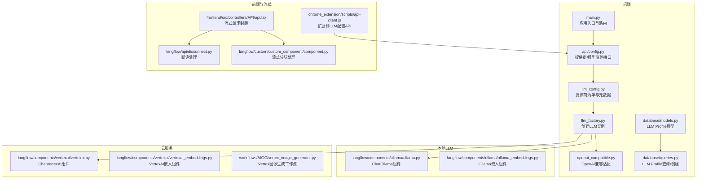
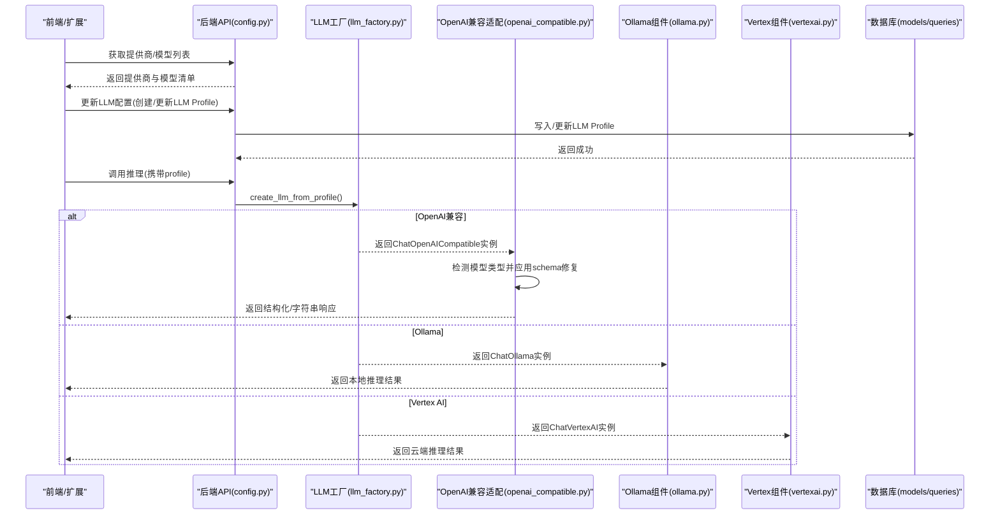
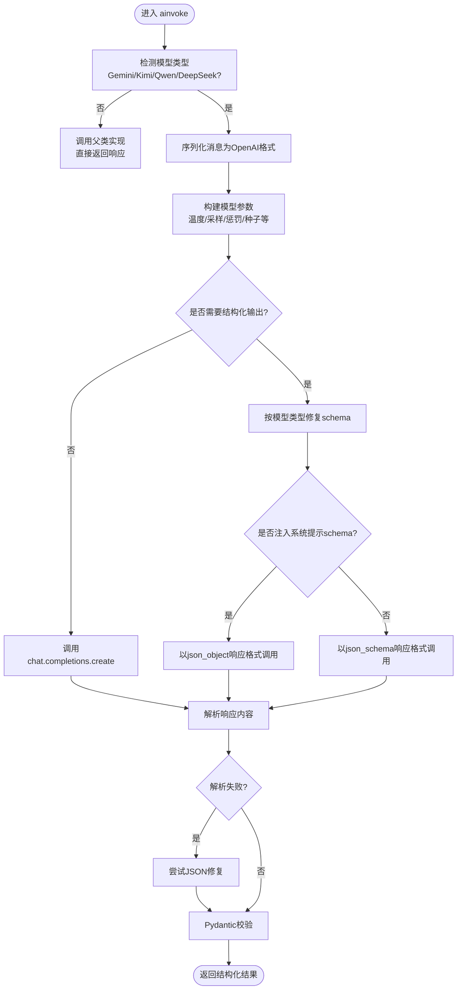
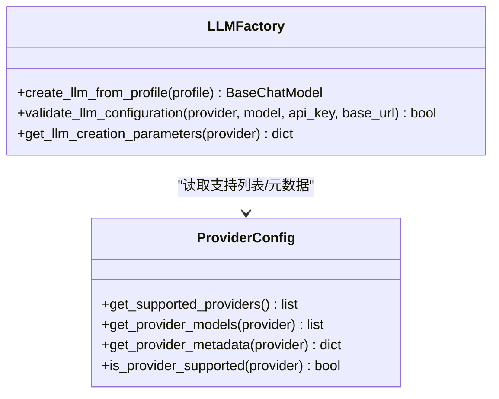
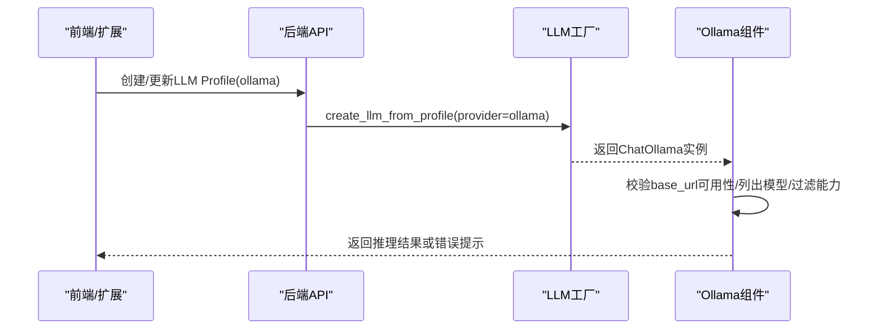
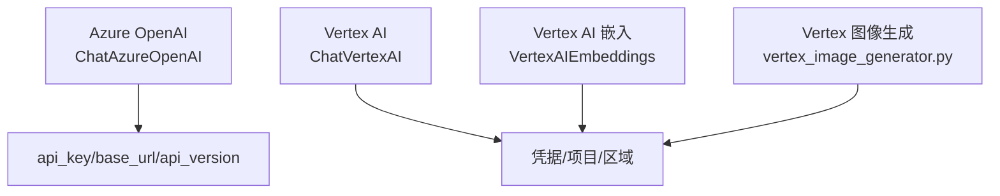
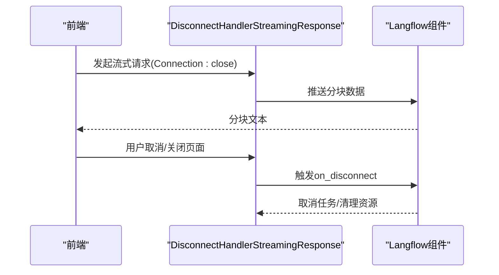
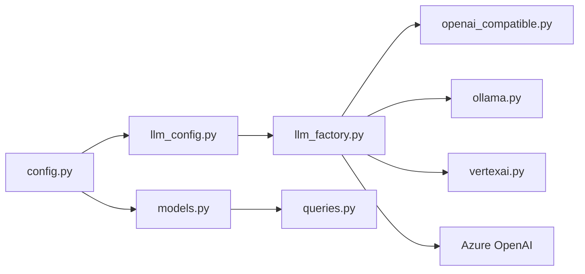

# LLM提供商适配

<cite>
**本文引用的文件**
- [openai_compatible.py](file://vibe_surf/llm/openai_compatible.py)
- [llm_factory.py](file://vibe_surf/backend/utils/llm_factory.py)
- [llm_config.py](file://vibe_surf/backend/llm_config.py)
- [config.py](file://vibe_surf/backend/api/config.py)
- [ollama.py](file://vibe_surf/langflow/components/ollama/ollama.py)
- [ollama_embeddings.py](file://vibe_surf/langflow/components/ollama/ollama_embeddings.py)
- [vertexai.py](file://vibe_surf/langflow/components/vertexai/vertexai.py)
- [vertexai_embeddings.py](file://vibe_surf/langflow/components/vertexai/vertexai_embeddings.py)
- [vertex_image_generator.py](file://vibe_surf/workflows/AIGC/vertex_image_generator.py)
- [models.py](file://vibe_surf/backend/database/models.py)
- [queries.py](file://vibe_surf/backend/database/queries.py)
- [api-client.js](file://vibe_surf/chrome_extension/scripts/api-client.js)
- [disconnect.py](file://vibe_surf/langflow/api/disconnect.py)
- [component.py](file://vibe_surf/langflow/custom/custom_component/component.py)
- [api.tsx](file://vibe_surf/frontend/src/controllers/API/api.tsx)
- [main.py](file://vibe_surf/backend/main.py)
</cite>

## 目录
1. [简介](#简介)
2. [项目结构](#项目结构)
3. [核心组件](#核心组件)
4. [架构总览](#架构总览)
5. [详细组件分析](#详细组件分析)
6. [依赖关系分析](#依赖关系分析)
7. [性能考量](#性能考量)
8. [故障排查指南](#故障排查指南)
9. [结论](#结论)
10. [附录](#附录)

## 简介
本文件系统性文档化VibeSurf对多类LLM提供商的适配机制，覆盖：
- OpenAI兼容API适配：请求格式转换、响应解析与错误映射
- 本地LLM（Ollama）支持：模型加载、推理执行与流式响应处理
- 云服务提供商（Azure OpenAI、Google Vertex AI）特殊处理：认证、区域选择与配额管理
- 适配器开发指南：如何为新提供商创建适配器
- 性能基准与选型策略：延迟、吞吐量与成本对比及决策框架

## 项目结构
围绕LLM适配的关键目录与文件：
- 后端工厂与配置：backend/utils/llm_factory.py、backend/llm_config.py、backend/api/config.py
- OpenAI兼容适配：vibe_surf/llm/openai_compatible.py
- 本地LLM（Ollama）：langflow/components/ollama/*
- 云服务（Vertex AI）：langflow/components/vertexai/*、workflows/AIGC/vertex_image_generator.py
- 数据模型与查询：backend/database/models.py、backend/database/queries.py
- 前端与流式断连：frontend/src/controllers/API/api.tsx、langflow/api/disconnect.py、langflow/custom/custom_component/component.py
- 扩展前端调用：chrome_extension/scripts/api-client.js
- 后端入口与路由：backend/main.py

图表来源
- [llm_factory.py](file://vibe_surf/backend/utils/llm_factory.py#L1-L275)
- [llm_config.py](file://vibe_surf/backend/llm_config.py#L1-L226)
- [openai_compatible.py](file://vibe_surf/llm/openai_compatible.py#L1-L373)
- [config.py](file://vibe_surf/backend/api/config.py#L621-L642)
- [models.py](file://vibe_surf/backend/database/models.py#L57-L93)
- [queries.py](file://vibe_surf/backend/database/queries.py#L62-L90)
- [ollama.py](file://vibe_surf/langflow/components/ollama/ollama.py#L1-L330)
- [ollama_embeddings.py](file://vibe_surf/langflow/components/ollama/ollama_embeddings.py#L41-L54)
- [vertexai.py](file://vibe_surf/langflow/components/vertexai/vertexai.py#L34-L71)
- [vertexai_embeddings.py](file://vibe_surf/langflow/components/vertexai/vertexai_embeddings.py#L35-L67)
- [vertex_image_generator.py](file://vibe_surf/workflows/AIGC/vertex_image_generator.py#L88-L125)
- [api.tsx](file://vibe_surf/frontend/src/controllers/API/api.tsx#L289-L313)
- [disconnect.py](file://vibe_surf/langflow/api/disconnect.py#L1-L31)
- [component.py](file://vibe_surf/langflow/custom/custom_component/component.py#L1587-L1610)
- [api-client.js](file://vibe_surf/chrome_extension/scripts/api-client.js#L365-L405)
- [main.py](file://vibe_surf/backend/main.py#L543-L731)

章节来源
- [llm_factory.py](file://vibe_surf/backend/utils/llm_factory.py#L1-L275)
- [llm_config.py](file://vibe_surf/backend/llm_config.py#L1-L226)
- [openai_compatible.py](file://vibe_surf/llm/openai_compatible.py#L1-L373)
- [config.py](file://vibe_surf/backend/api/config.py#L621-L642)
- [ollama.py](file://vibe_surf/langflow/components/ollama/ollama.py#L1-L330)
- [ollama_embeddings.py](file://vibe_surf/langflow/components/ollama/ollama_embeddings.py#L41-L54)
- [vertexai.py](file://vibe_surf/langflow/components/vertexai/vertexai.py#L34-L71)
- [vertexai_embeddings.py](file://vibe_surf/langflow/components/vertexai/vertexai_embeddings.py#L35-L67)
- [vertex_image_generator.py](file://vibe_surf/workflows/AIGC/vertex_image_generator.py#L88-L125)
- [models.py](file://vibe_surf/backend/database/models.py#L57-L93)
- [queries.py](file://vibe_surf/backend/database/queries.py#L62-L90)
- [api.tsx](file://vibe_surf/frontend/src/controllers/API/api.tsx#L289-L313)
- [disconnect.py](file://vibe_surf/langflow/api/disconnect.py#L1-L31)
- [component.py](file://vibe_surf/langflow/custom/custom_component/component.py#L1587-L1610)
- [api-client.js](file://vibe_surf/chrome_extension/scripts/api-client.js#L365-L405)
- [main.py](file://vibe_surf/backend/main.py#L543-L731)

## 核心组件
- LLM工厂：根据提供商类型与参数动态创建具体LLM实例，统一参数支持与校验
- OpenAI兼容适配：在OpenAI兼容API上自动修复特定模型的schema限制，支持结构化输出与错误映射
- 本地LLM适配：通过Ollama组件连接本地模型，支持模型列表拉取、能力过滤与异常提示
- 云服务适配：Vertex AI组件支持凭据注入、区域与项目配置；Azure OpenAI通过工厂直接创建
- 配置与模型查询：后端提供统一的提供商与模型查询接口，前端扩展可调用
- 流式响应：前端与Langflow层均提供断连处理与分块聚合逻辑

章节来源
- [llm_factory.py](file://vibe_surf/backend/utils/llm_factory.py#L23-L215)
- [openai_compatible.py](file://vibe_surf/llm/openai_compatible.py#L63-L373)
- [ollama.py](file://vibe_surf/langflow/components/ollama/ollama.py#L1-L330)
- [vertexai.py](file://vibe_surf/langflow/components/vertexai/vertexai.py#L34-L71)
- [config.py](file://vibe_surf/backend/api/config.py#L621-L642)

## 架构总览
下图展示从“前端配置”到“LLM推理”的端到端流程，以及本地与云端提供商的差异点。

图表来源
- [config.py](file://vibe_surf/backend/api/config.py#L621-L642)
- [llm_factory.py](file://vibe_surf/backend/utils/llm_factory.py#L23-L215)
- [openai_compatible.py](file://vibe_surf/llm/openai_compatible.py#L212-L373)
- [ollama.py](file://vibe_surf/langflow/components/ollama/ollama.py#L1-L330)
- [vertexai.py](file://vibe_surf/langflow/components/vertexai/vertexai.py#L34-L71)
- [models.py](file://vibe_surf/backend/database/models.py#L57-L93)
- [queries.py](file://vibe_surf/backend/database/queries.py#L62-L90)

## 详细组件分析

### OpenAI兼容适配（openai_compatible.py）
- 功能要点
  - 自动识别模型类型（Gemini、Kimi/Moonshot、DeepSeek、Qwen），针对不兼容schema进行修复
  - 支持结构化输出（Pydantic模型），自动注入JSON Schema或系统提示中的schema约束
  - 统一错误映射：RateLimitError、APIConnectionError、APIStatusError等映射为统一ModelProviderError
  - 参数透传：temperature、top_p、frequency_penalty、max_tokens、seed、service_tier、reasoning_effort等
- 请求格式转换
  - 将内部消息序列化为OpenAI格式，按需添加response_format或system提示中的schema
  - 对特定模型移除不被支持的字段（如title、default、additionalProperties等）
- 响应解析
  - 结构化输出：优先使用response_format json_schema，失败时尝试JSON修复再解析
  - 字符串输出：直接返回choices[0].message.content
- 错误映射
  - 将第三方错误体中的message提取并包装为统一错误，保留状态码与模型名

图表来源
- [openai_compatible.py](file://vibe_surf/llm/openai_compatible.py#L212-L373)

章节来源
- [openai_compatible.py](file://vibe_surf/llm/openai_compatible.py#L63-L373)

### LLM工厂与配置（llm_factory.py、llm_config.py）
- 工厂职责
  - 根据provider名称创建对应LLM实例（OpenAI、Anthropic、Google、Azure OpenAI、Groq、Ollama、OpenRouter、DeepSeek、AWS Bedrock、Anthropic Bedrock、Qwen、Kimi、LM Studio、OpenAI Compatible）
  - 统一参数支持矩阵：不同提供商支持的参数集合不同（如OpenRouter不支持max_tokens）
  - 提供配置校验与参数清单查询接口
- 配置与模型
  - 提供商清单与默认模型、是否需要API Key、是否需要base_url等元数据
  - 提供模型查询接口，前端扩展可调用

图表来源
- [llm_factory.py](file://vibe_surf/backend/utils/llm_factory.py#L23-L275)
- [llm_config.py](file://vibe_surf/backend/llm_config.py#L1-L226)

章节来源
- [llm_factory.py](file://vibe_surf/backend/utils/llm_factory.py#L23-L215)
- [llm_config.py](file://vibe_surf/backend/llm_config.py#L1-L226)
- [config.py](file://vibe_surf/backend/api/config.py#L621-L642)

### 本地LLM（Ollama）适配
- 组件能力
  - ChatOllama组件：基于langchain_ollama，支持参数透传与异常提示
  - Ollama嵌入组件：基于OllamaEmbeddings，提供连接性校验与错误提示
  - 模型能力探测：通过Ollama REST API列出模型并检查capabilities，过滤出支持“completion”的模型
- 运行流程
  - 前端/扩展调用后端接口创建/更新LLM Profile（可指定base_url）
  - 后端工厂根据provider=ollama创建ChatOllama实例
  - Langflow组件在运行时连接Ollama服务，必要时进行能力过滤与错误提示

图表来源
- [llm_factory.py](file://vibe_surf/backend/utils/llm_factory.py#L126-L135)
- [ollama.py](file://vibe_surf/langflow/components/ollama/ollama.py#L1-L330)
- [ollama_embeddings.py](file://vibe_surf/langflow/components/ollama/ollama_embeddings.py#L41-L54)

章节来源
- [llm_factory.py](file://vibe_surf/backend/utils/llm_factory.py#L126-L135)
- [ollama.py](file://vibe_surf/langflow/components/ollama/ollama.py#L1-L330)
- [ollama_embeddings.py](file://vibe_surf/langflow/components/ollama/ollama_embeddings.py#L41-L54)

### 云服务提供商（Azure OpenAI、Google Vertex AI）
- Azure OpenAI
  - 工厂直接创建ChatAzureOpenAI实例，要求base_url（即azure_endpoint），并设置api_version
- Google Vertex AI
  - ChatVertexAI组件：支持凭据注入（service_account_file）、项目与区域配置
  - VertexAIEmbeddings组件：支持凭据、位置、重试、温度、top_k/top_p等参数
  - 图像生成工作流：vertex_image_generator.py通过google.genai与凭据初始化，支持显式传入项目与位置

图表来源
- [llm_factory.py](file://vibe_surf/backend/utils/llm_factory.py#L108-L117)
- [vertexai.py](file://vibe_surf/langflow/components/vertexai/vertexai.py#L34-L71)
- [vertexai_embeddings.py](file://vibe_surf/langflow/components/vertexai/vertexai_embeddings.py#L35-L67)
- [vertex_image_generator.py](file://vibe_surf/workflows/AIGC/vertex_image_generator.py#L88-L125)

章节来源
- [llm_factory.py](file://vibe_surf/backend/utils/llm_factory.py#L108-L117)
- [vertexai.py](file://vibe_surf/langflow/components/vertexai/vertexai.py#L34-L71)
- [vertexai_embeddings.py](file://vibe_surf/langflow/components/vertexai/vertexai_embeddings.py#L35-L67)
- [vertex_image_generator.py](file://vibe_surf/workflows/AIGC/vertex_image_generator.py#L88-L125)

### 流式响应与断连处理
- 前端流式请求
  - api.tsx封装了流式请求，设置Connection: close并使用TextDecoder累积分块
- Langflow断连处理
  - DisconnectHandlerStreamingResponse监听http.disconnect事件，触发on_disconnect回调
- Langflow自定义组件
  - 对Iterator/AsyncIterator进行分块处理，聚合完整消息并抛出StreamingError
- 扩展前端调用
  - api-client.js提供LLM Profile CRUD与获取提供商列表的接口

图表来源
- [api.tsx](file://vibe_surf/frontend/src/controllers/API/api.tsx#L289-L313)
- [disconnect.py](file://vibe_surf/langflow/api/disconnect.py#L1-L31)
- [component.py](file://vibe_surf/langflow/custom/custom_component/component.py#L1587-L1610)
- [api-client.js](file://vibe_surf/chrome_extension/scripts/api-client.js#L365-L405)

章节来源
- [api.tsx](file://vibe_surf/frontend/src/controllers/API/api.tsx#L289-L313)
- [disconnect.py](file://vibe_surf/langflow/api/disconnect.py#L1-L31)
- [component.py](file://vibe_surf/langflow/custom/custom_component/component.py#L1587-L1610)
- [api-client.js](file://vibe_surf/chrome_extension/scripts/api-client.js#L365-L405)

## 依赖关系分析
- 低耦合高内聚
  - llm_factory.py仅依赖llm_config.py提供的支持列表与元数据，避免硬编码
  - openai_compatible.py继承自browser_use的ChatOpenAI，通过消息序列化与schema修复实现兼容
- 外部依赖
  - Ollama组件依赖langchain_ollama与httpx
  - Vertex组件依赖langchain_google_vertexai与google-auth
  - Azure OpenAI依赖browser_use的ChatAzureOpenAI
- 数据一致性
  - LLM Profile模型与查询封装在database层，确保配置持久化与安全存储（加密API Key）

图表来源
- [llm_config.py](file://vibe_surf/backend/llm_config.py#L1-L226)
- [llm_factory.py](file://vibe_surf/backend/utils/llm_factory.py#L23-L215)
- [openai_compatible.py](file://vibe_surf/llm/openai_compatible.py#L63-L373)
- [ollama.py](file://vibe_surf/langflow/components/ollama/ollama.py#L1-L330)
- [vertexai.py](file://vibe_surf/langflow/components/vertexai/vertexai.py#L34-L71)
- [models.py](file://vibe_surf/backend/database/models.py#L57-L93)
- [queries.py](file://vibe_surf/backend/database/queries.py#L62-L90)
- [config.py](file://vibe_surf/backend/api/config.py#L621-L642)

章节来源
- [llm_config.py](file://vibe_surf/backend/llm_config.py#L1-L226)
- [llm_factory.py](file://vibe_surf/backend/utils/llm_factory.py#L23-L215)
- [openai_compatible.py](file://vibe_surf/llm/openai_compatible.py#L63-L373)
- [ollama.py](file://vibe_surf/langflow/components/ollama/ollama.py#L1-L330)
- [vertexai.py](file://vibe_surf/langflow/components/vertexai/vertexai.py#L34-L71)
- [models.py](file://vibe_surf/backend/database/models.py#L57-L93)
- [queries.py](file://vibe_surf/backend/database/queries.py#L62-L90)
- [config.py](file://vibe_surf/backend/api/config.py#L621-L642)

## 性能考量
- 延迟与吞吐
  - 本地LLM（Ollama）通常具有较低网络延迟，适合快速迭代与隐私场景
  - 云端服务（Azure OpenAI、Vertex AI）在网络抖动与配额限制下可能产生波动
- 成本
  - 本地LLM无需外部计费，但需考虑硬件与模型占用
  - 云端服务按token计费，建议结合模型选择与上下文长度优化
- 配额与限流
  - Azure OpenAI与Vertex AI均支持凭据与区域配置，建议在工厂层统一注入
  - OpenAI兼容服务（如OpenRouter、DeepSeek）需关注其配额与速率限制策略
- 实践建议
  - 在开发阶段优先使用本地LLM（Ollama）进行原型验证
  - 生产环境根据SLA与合规要求选择Azure/Vertex等托管服务
  - 使用结构化输出时，先尝试response_format，失败再启用JSON修复路径

[本节为通用指导，不直接分析具体文件]

## 故障排查指南
- OpenAI兼容适配
  - 若结构化输出解析失败：检查response_format是否正确注入，或启用系统提示schema注入
  - 速率限制：统一捕获RateLimitError并映射为ModelProviderError，查看状态码与错误消息
- Ollama
  - 连接失败：确认base_url可达，模型已拉取，组件会给出明确错误提示
  - 模型能力：仅显示具备“completion”能力的模型
- Vertex AI
  - 凭据问题：确保service_account_file有效或环境变量已配置
  - 区域/项目：检查location与project参数是否匹配
- 流式断连
  - 前端设置Connection: close，Langflow断连处理器会在客户端断开时触发清理
  - 自定义组件需正确处理Iterator/AsyncIterator的分块与异常

章节来源
- [openai_compatible.py](file://vibe_surf/llm/openai_compatible.py#L341-L373)
- [ollama.py](file://vibe_surf/langflow/components/ollama/ollama.py#L188-L196)
- [ollama_embeddings.py](file://vibe_surf/langflow/components/ollama/ollama_embeddings.py#L41-L54)
- [vertexai.py](file://vibe_surf/langflow/components/vertexai/vertexai.py#L34-L71)
- [vertexai_embeddings.py](file://vibe_surf/langflow/components/vertexai/vertexai_embeddings.py#L35-L67)
- [disconnect.py](file://vibe_surf/langflow/api/disconnect.py#L1-L31)
- [component.py](file://vibe_surf/langflow/custom/custom_component/component.py#L1587-L1610)

## 结论
VibeSurf通过集中化的LLM工厂与配置管理，实现了对OpenAI兼容、本地Ollama与云端Vertex/Azure的统一适配。OpenAI兼容适配器在schema修复与错误映射方面提供了稳健的抽象；本地与云端组件分别满足隐私与弹性需求；流式断连与分块聚合保障了用户体验。建议在实际部署中结合性能、成本与合规要求制定提供商选择策略，并通过Profile管理与API接口实现灵活切换。

[本节为总结，不直接分析具体文件]

## 附录

### 适配器开发指南（新增提供商）
- 步骤
  - 在llm_config.py中注册提供商名称、默认模型、是否需要API Key/base_url、特性开关
  - 在llm_factory.py中增加elif分支，创建对应LLM实例并处理参数透传
  - 如需schema修复或特殊行为，在openai_compatible.py中扩展模型检测与修复逻辑
  - 在Langflow侧（如需要）新增组件以对接本地或云端SDK
  - 在后端API中提供该提供商的模型查询接口，前端扩展可调用
- 注意事项
  - 统一参数支持矩阵，避免在工厂中硬编码
  - 对于流式场景，确保断连处理与分块聚合逻辑完善
  - 对于云端服务，明确凭据、区域与配额策略

章节来源
- [llm_config.py](file://vibe_surf/backend/llm_config.py#L1-L226)
- [llm_factory.py](file://vibe_surf/backend/utils/llm_factory.py#L23-L215)
- [openai_compatible.py](file://vibe_surf/llm/openai_compatible.py#L63-L174)
- [config.py](file://vibe_surf/backend/api/config.py#L621-L642)