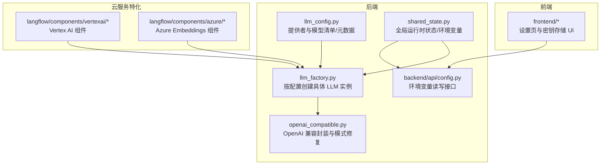
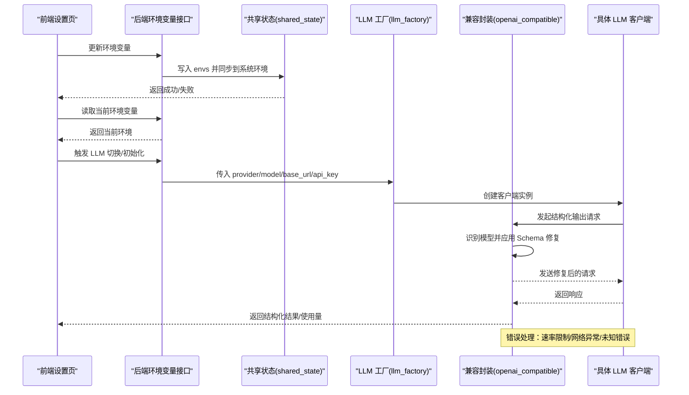
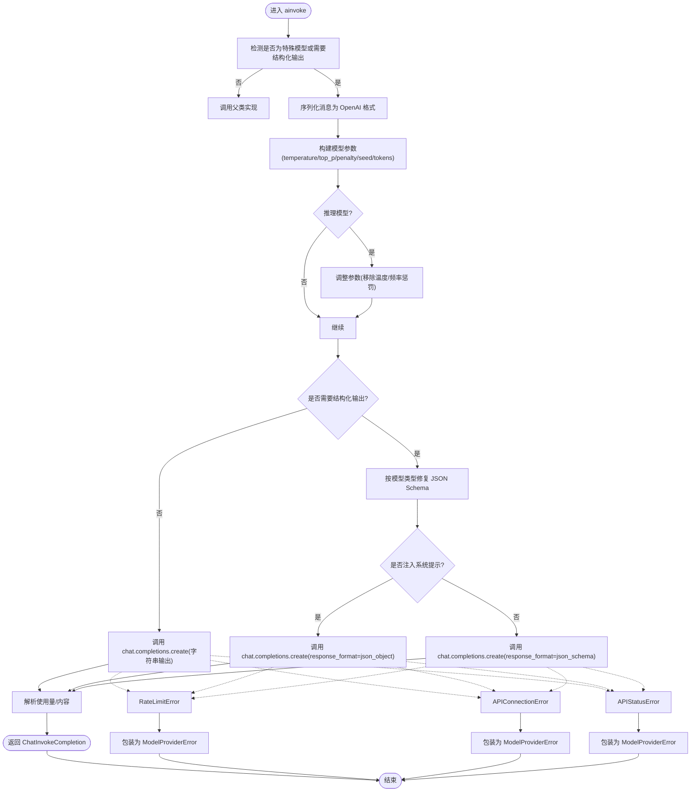
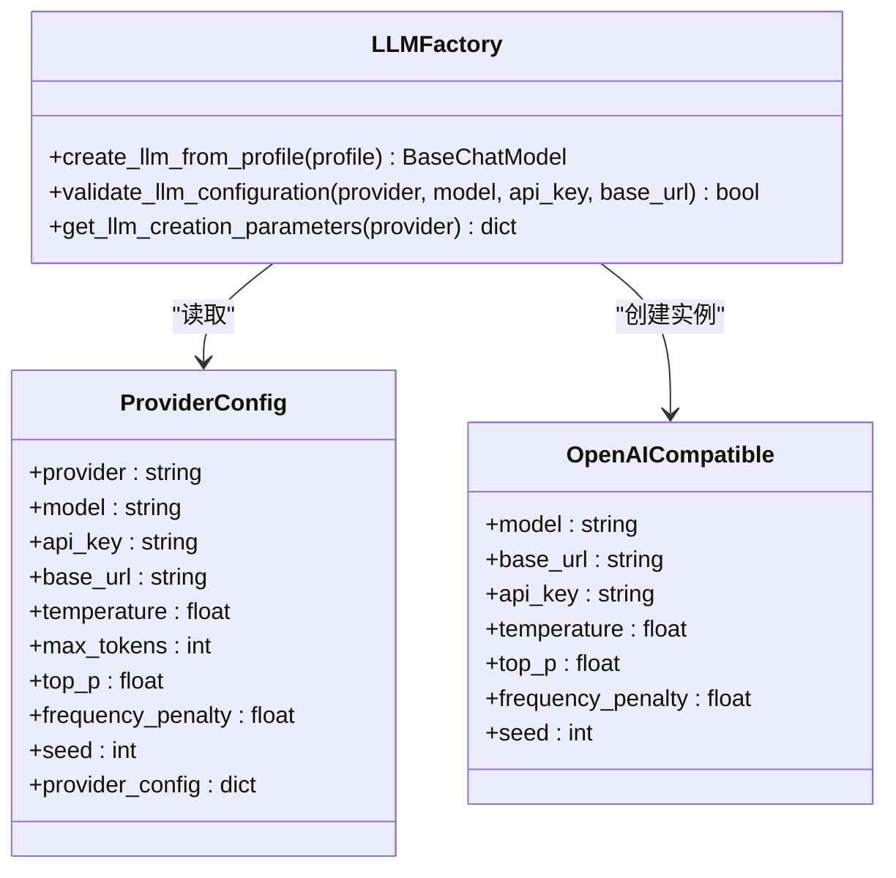
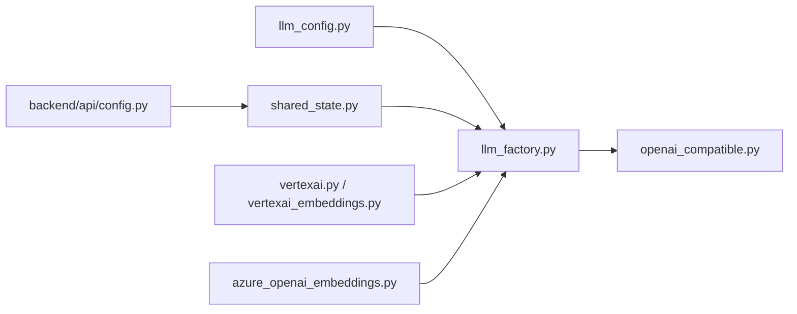

# 云服务LLM集成

<cite>
**本文引用的文件列表**
- [openai_compatible.py](file://vibe_surf/llm/openai_compatible.py)
- [llm_factory.py](file://vibe_surf/backend/utils/llm_factory.py)
- [llm_config.py](file://vibe_surf/backend/llm_config.py)
- [.env.example](file://.env.example)
- [shared_state.py](file://vibe_surf/backend/shared_state.py)
- [vertexai.py](file://vibe_surf/langflow/components/vertexai/vertexai.py)
- [vertexai_embeddings.py](file://vibe_surf/langflow/components/vertexai/vertexai_embeddings.py)
- [vertex_image_generator.py](file://vibe_surf/workflows/AIGC/vertex_image_generator.py)
- [azure_openai_embeddings.py](file://vibe_surf/langflow/components/azure/azure_openai_embeddings.py)
- [config.py](file://vibe_surf/backend/api/config.py)
- [service.py](file://vibe_surf/langflow/services/variable/service.py)
</cite>

## 目录
1. [简介](#简介)
2. [项目结构](#项目结构)
3. [核心组件](#核心组件)
4. [架构总览](#架构总览)
5. [详细组件分析](#详细组件分析)
6. [依赖关系分析](#依赖关系分析)
7. [性能考虑](#性能考虑)
8. [故障排查指南](#故障排查指南)
9. [结论](#结论)
10. [附录：配置示例与最佳实践](#附录配置示例与最佳实践)

## 简介
本文件系统性文档化 VibeSurf 对云服务 LLM 提供商（如 Azure OpenAI、Google Vertex AI、OpenRouter、DeepSeek、Qwen、Kimi 等）的集成机制，重点解释如何通过 openai_compatible.py 实现与云服务 API 的兼容性，覆盖以下主题：
- 身份验证机制（API 密钥、OAuth）
- 区域选择与端点配置
- 配额与计费集成（成本计算开关）
- 不同云服务提供商的特殊处理（Azure 的部署名称映射、Google 的项目 ID 和区域配置）
- 错误处理策略（模型提供商错误、速率限制、网络异常）
- 性能优化技巧（连接池、请求批处理、缓存策略）

## 项目结构
围绕 LLM 集成的关键模块分布如下：
- 后端工厂与配置：llm_factory.py、llm_config.py
- 兼容层实现：openai_compatible.py
- 环境变量与运行时状态：.env.example、shared_state.py
- 云服务特化组件：vertexai 组件、Azure Embeddings 组件
- 前端与后端 API：前端设置页与后端环境变量管理接口

图表来源
- [llm_config.py](file://vibe_surf/backend/llm_config.py#L1-L226)
- [llm_factory.py](file://vibe_surf/backend/utils/llm_factory.py#L1-L275)
- [openai_compatible.py](file://vibe_surf/llm/openai_compatible.py#L1-L373)
- [shared_state.py](file://vibe_surf/backend/shared_state.py#L1-L200)
- [config.py](file://vibe_surf/backend/api/config.py#L690-L730)
- [vertexai.py](file://vibe_surf/langflow/components/vertexai/vertexai.py#L1-L71)
- [azure_openai_embeddings.py](file://vibe_surf/langflow/components/azure/azure_openai_embeddings.py#L25-L67)

章节来源
- [llm_config.py](file://vibe_surf/backend/llm_config.py#L1-L226)
- [llm_factory.py](file://vibe_surf/backend/utils/llm_factory.py#L1-L275)
- [.env.example](file://.env.example#L1-L55)
- [shared_state.py](file://vibe_surf/backend/shared_state.py#L450-L712)
- [config.py](file://vibe_surf/backend/api/config.py#L690-L730)

## 核心组件
- 提供者与模型配置：集中定义支持的提供商、默认模型、是否需要 API Key/Base URL 等元数据，便于统一校验与参数生成。
- LLM 工厂：根据数据库或环境配置动态创建具体 LLM 客户端实例，处理各提供商的参数差异（如 Azure 的 endpoint、api_version；OpenRouter 的 base_url；Qwen/Kimi 的兼容端点等）。
- OpenAI 兼容封装：在调用 OpenAI 兼容 API 时自动识别模型类型，应用特定的 JSON Schema 修复逻辑，确保 Gemini/Kimi/Qwen/DeepSeek 等模型的响应格式符合预期。
- 运行时状态与环境变量：统一加载、更新与持久化环境变量，支持前端读取与修改，便于在不重启服务的情况下切换提供商与密钥。
- 云服务特化组件：Vertex AI 与 Azure Embeddings 组件分别演示了 OAuth 凭据注入、项目/区域配置以及部署名称等关键参数。

章节来源
- [llm_config.py](file://vibe_surf/backend/llm_config.py#L1-L226)
- [llm_factory.py](file://vibe_surf/backend/utils/llm_factory.py#L1-L275)
- [openai_compatible.py](file://vibe_surf/llm/openai_compatible.py#L1-L373)
- [shared_state.py](file://vibe_surf/backend/shared_state.py#L450-L712)

## 架构总览
下图展示了从“配置到调用”的整体流程，以及错误处理与环境变量交互路径。

图表来源
- [config.py](file://vibe_surf/backend/api/config.py#L690-L730)
- [shared_state.py](file://vibe_surf/backend/shared_state.py#L684-L712)
- [llm_factory.py](file://vibe_surf/backend/utils/llm_factory.py#L1-L275)
- [openai_compatible.py](file://vibe_surf/llm/openai_compatible.py#L212-L373)

## 详细组件分析

### OpenAI 兼容封装（openai_compatible.py）
该模块扩展了浏览器用例中的 ChatOpenAI，以适配多种 OpenAI 兼容 API，并针对特定模型执行 JSON Schema 修复，确保结构化输出稳定可靠。

- 模型识别与修复
  - Gemini：移除不受支持的字段（如 additionalProperties/title/default），解析 $ref 引用，必要时为空对象属性添加占位符。
  - Kimi/Moonshot：移除 min_items/minItems/default 等不受支持关键字，避免与 anyOf 冲突。
  - Qwen/DeepSeek：在系统提示中注入 JSON Schema，或使用 response_format 的 json_schema 类型。
- 结构化输出流程
  - 将 Pydantic 模型转换为 JSON Schema，按模型类型应用修复。
  - 通过 response_format 或系统提示注入 Schema，保证模型返回严格 JSON。
  - 失败时尝试 JSON 修复工具进行容错解析。
- 错误处理
  - 速率限制：捕获 RateLimitError，提取错误消息与状态码，抛出统一的 ModelProviderError。
  - 网络连接：捕获 APIConnectionError，抛出统一错误。
  - 状态错误：捕获 APIStatusError，解析 JSON 或文本错误体，抛出统一错误。
  - 其他异常：统一包装为 ModelProviderError。

图表来源
- [openai_compatible.py](file://vibe_surf/llm/openai_compatible.py#L212-L373)

章节来源
- [openai_compatible.py](file://vibe_surf/llm/openai_compatible.py#L1-L373)

### LLM 工厂（llm_factory.py）
该模块负责根据配置创建具体 LLM 实例，涵盖多提供商差异化参数与默认值。

- 支持的提供商与参数
  - OpenAI、Anthropic、Google、Groq、DeepSeek、Ollama、OpenRouter、AWS Bedrock、Anthropic Bedrock、Qwen、Kimi、LM Studio、OpenAI Compatible。
  - 参数支持表：不同提供商支持的参数不同（例如 OpenRouter 不支持 max_tokens）。
- 特殊处理
  - Azure OpenAI：强制要求 base_url（azure_endpoint），并设置 api_version。
  - OpenAI Compatible：要求 base_url，用于对接第三方兼容网关。
  - Qwen/Kimi：自动注入 DashScope/Moonshot 兼容端点。
  - DeepSeek：固定 base_url。
  - AWS Bedrock：使用 AWS 凭证参数（aws_access_key_id/secret_access_key/region）。
  - Ollama：支持 host 默认值与自定义 base_url。
  - LM Studio：本地端点与固定 API Key。
- 校验与参数提取
  - validate_llm_configuration：校验 provider/model/api_key/base_url 等必填项。
  - get_llm_creation_parameters：返回所需与可选参数清单及元数据。

图表来源
- [llm_factory.py](file://vibe_surf/backend/utils/llm_factory.py#L1-L275)

章节来源
- [llm_factory.py](file://vibe_surf/backend/utils/llm_factory.py#L1-L275)

### 提供者与模型配置（llm_config.py）
- 提供者清单与默认模型：集中维护支持的提供商及其默认模型，便于前端展示与后端回退。
- 提供者元数据：是否需要 API Key、是否支持 base_url、是否支持工具/视觉能力、默认 base_url 等。
- 查询接口：获取支持的提供商、模型、元数据、默认模型等。

章节来源
- [llm_config.py](file://vibe_surf/backend/llm_config.py#L1-L226)

### 运行时环境变量与状态（shared_state.py、config.py、service.py）
- 加载与持久化：启动时从 envs.json 加载环境变量并同步到系统环境；更新时写回 envs.json。
- 后端接口：提供 GET/PUT 接口读取与更新环境变量，过滤允许的键集合。
- 变量服务：从环境变量中读取指定变量并加密存储为用户变量，便于前端安全展示与编辑。

章节来源
- [shared_state.py](file://vibe_surf/backend/shared_state.py#L450-L712)
- [config.py](file://vibe_surf/backend/api/config.py#L690-L730)
- [service.py](file://vibe_surf/langflow/services/variable/service.py#L1-L143)

### 云服务特化组件

#### Google Vertex AI（langflow/components/vertexai/vertexai.py、vertexai_embeddings.py、workflows/AIGC/vertex_image_generator.py）
- 身份验证：支持凭据文件（service_account.Credentials.from_service_account_file）或环境变量/CLI 推断。
- 区域与项目：通过 project/location 参数配置，支持显式传入或从凭据推断。
- 组件行为：ChatVertexAI 组件与 Embeddings 组件均暴露 project/location 等参数，便于在工作流中灵活配置。

章节来源
- [vertexai.py](file://vibe_surf/langflow/components/vertexai/vertexai.py#L1-L71)
- [vertexai_embeddings.py](file://vibe_surf/langflow/components/vertexai/vertexai_embeddings.py#L35-L67)
- [vertex_image_generator.py](file://vibe_surf/workflows/AIGC/vertex_image_generator.py#L88-L125)

#### Azure OpenAI（langflow/components/azure/azure_openai_embeddings.py）
- 部署名称映射：输入字段包含 azure_deployment（部署名称），用于指向具体的模型部署。
- 端点与版本：azure_endpoint（资源级端点）与 api_version（API 版本）。
- 模型名称：通过模型下拉框选择，结合部署名称完成最终调用。

章节来源
- [azure_openai_embeddings.py](file://vibe_surf/langflow/components/azure/azure_openai_embeddings.py#L25-L67)

## 依赖关系分析
- LLM 工厂依赖提供者配置与元数据，决定参数支持与默认值。
- 兼容封装依赖浏览器用例的 ChatOpenAI，扩展结构化输出与错误处理。
- 运行时状态与后端 API 提供环境变量的读写能力，支撑前端可视化配置与动态切换。
- 云服务特化组件独立于工厂，但遵循相同的凭据与区域配置模式。

图表来源
- [llm_config.py](file://vibe_surf/backend/llm_config.py#L1-L226)
- [llm_factory.py](file://vibe_surf/backend/utils/llm_factory.py#L1-L275)
- [openai_compatible.py](file://vibe_surf/llm/openai_compatible.py#L1-L373)
- [shared_state.py](file://vibe_surf/backend/shared_state.py#L450-L712)
- [config.py](file://vibe_surf/backend/api/config.py#L690-L730)
- [vertexai.py](file://vibe_surf/langflow/components/vertexai/vertexai.py#L1-L71)
- [azure_openai_embeddings.py](file://vibe_surf/langflow/components/azure/azure_openai_embeddings.py#L25-L67)

## 性能考虑
- 连接池与重试
  - 数据库连接池：通过设置 pool_size/max_overflow/pool_timeout/pool_pre_ping/pool_recycle 控制连接复用与回收，降低连接抖动与超时风险。
  - 数据库引擎重试：对连接失败场景采用固定间隔与最大次数的重试策略，提升稳定性。
- 请求批处理
  - 在批量调用 LLM 时，建议合并消息与减少往返次数；对于结构化输出，优先使用 response_format 一次性约束输出格式，避免多次重试。
- 缓存策略
  - 使用外部缓存服务（如 Redis）进行热点查询与中间结果缓存；清理任务定期删除过期条目，避免无限增长。
- 代理与网络
  - 通过系统代理环境变量（HTTP_PROXY/HTTPS_PROXY/no_proxy）统一出口网络，减少跨地域访问延迟。
- 日志与可观测性
  - 开启调试日志级别（如 BROWSER_USE_LOGGING_LEVEL=debug）辅助定位性能瓶颈；同时开启成本计算（BROWSER_USE_CALCULATE_COST=true）评估消耗。

章节来源
- [service.py](file://vibe_surf/langflow/services/variable/service.py#L1-L143)
- [.env.example](file://.env.example#L1-L55)

## 故障排查指南
- 常见错误与处理
  - 速率限制：捕获 RateLimitError，解析错误体中的 message 与 status_code，统一包装为 ModelProviderError，便于上层重试或降级。
  - 网络连接：捕获 APIConnectionError，提示网络不可达或上游服务异常。
  - 状态错误：捕获 APIStatusError，尝试解析 JSON 错误体，若失败则回退到文本内容，统一包装为 ModelProviderError。
  - 其他异常：捕获通用异常，包装为 ModelProviderError 并保留原始错误信息。
- 环境变量问题
  - 未设置必需变量：检查 .env 中 OPENAI_API_KEY、AZURE_OPENAI_ENDPOINT、AZURE_OPENAI_API_KEY、DASHSCOPE_API_KEY、MOONSHOT_API_KEY 等。
  - 前端无法读取/保存：确认后端环境变量接口返回正常，且允许的键集合包含目标变量名。
- 云服务特化问题
  - Vertex AI：确认 GOOGLE_APPLICATION_CREDENTIALS 或凭据文件有效；project/location 必填；若使用 SDK 直连，确保凭据对象正确构造。
  - Azure OpenAI：确认 azure_endpoint、azure_deployment、api_version、api_key 正确；部署名称需与资源中的实际部署一致。

章节来源
- [openai_compatible.py](file://vibe_surf/llm/openai_compatible.py#L341-L373)
- [config.py](file://vibe_surf/backend/api/config.py#L690-L730)
- [vertexai.py](file://vibe_surf/langflow/components/vertexai/vertexai.py#L1-L71)
- [azure_openai_embeddings.py](file://vibe_surf/langflow/components/azure/azure_openai_embeddings.py#L25-L67)

## 结论
VibeSurf 通过“提供者配置 + 工厂 + 兼容封装 + 运行时状态”的分层设计，实现了对多家云服务 LLM 提供商的统一接入与差异化适配。openai_compatible.py 在结构化输出与错误处理方面提供了稳健保障；llm_factory.py 则将各提供商的参数差异抽象为可配置的工厂方法；shared_state 与后端 API 使环境变量的读写与持久化变得简单可控。配合 Vertex AI 与 Azure 的特化组件，系统能够灵活应对不同提供商的认证、区域与部署差异。

## 附录：配置示例与最佳实践

### 环境变量配置（.env.example）
- OpenAI：OPENAI_ENDPOINT、OPENAI_API_KEY
- Anthropic：ANTHROPIC_ENDPOINT、ANTHROPIC_API_KEY
- Google：GOOGLE_API_KEY
- Azure OpenAI：AZURE_OPENAI_ENDPOINT、AZURE_OPENAI_API_KEY、AZURE_OPENAI_API_VERSION
- DeepSeek：DEEPSEEK_ENDPOINT、DEEPSEEK_API_KEY
- Mistral：MISTRAL_ENDPOINT、MISTRAL_API_KEY
- Ollama：OLLAMA_ENDPOINT
- DashScope（Qwen）：DASHSCOPE_ENDPOINT、DASHSCOPE_API_KEY
- Moonshot（Kimi）：MOONSHOT_ENDPOINT、MOONSHOT_API_KEY
- 其他：ANONYMIZED_TELEMETRY、BROWSER_USE_LOGGING_LEVEL、BROWSER_USE_CALCULATE_COST、VIBESURF_* 等

章节来源
- [.env.example](file://.env.example#L1-L55)

### 前端设置与密钥存储
- 前端设置页提供“存储 API Key”功能，支持校验与保存，便于用户在界面中管理密钥。
- 后端变量服务会从环境变量中读取指定变量并加密存储，避免明文泄露。

章节来源
- [service.py](file://vibe_surf/langflow/services/variable/service.py#L1-L143)

### Azure OpenAI 部署名称映射
- 在组件输入中提供 azure_deployment 字段，用于映射到资源中的具体部署名称。
- 工厂创建 ChatAzureOpenAI 时，必须提供 base_url（azure_endpoint）与 api_version。

章节来源
- [azure_openai_embeddings.py](file://vibe_surf/langflow/components/azure/azure_openai_embeddings.py#L25-L67)
- [llm_factory.py](file://vibe_surf/backend/utils/llm_factory.py#L108-L117)

### Google Vertex AI 项目 ID 与区域配置
- 组件支持 project 与 location 参数；凭据可通过文件或环境变量注入。
- 工作流中可直接传入 credentials/project/location，SDK 将据此初始化客户端。

章节来源
- [vertexai.py](file://vibe_surf/langflow/components/vertexai/vertexai.py#L1-L71)
- [vertexai_embeddings.py](file://vibe_surf/langflow/components/vertexai/vertexai_embeddings.py#L35-L67)
- [vertex_image_generator.py](file://vibe_surf/workflows/AIGC/vertex_image_generator.py#L88-L125)

### 计费与配额
- 成本计算：通过 BROWSER_USE_CALCULATE_COST 开关启用，便于统计 token 消耗。
- 配额管理：建议在上游提供商侧配置配额与告警；在应用侧记录使用量并在 UI 展示，以便用户监控与控制成本。

章节来源
- [.env.example](file://.env.example#L1-L55)