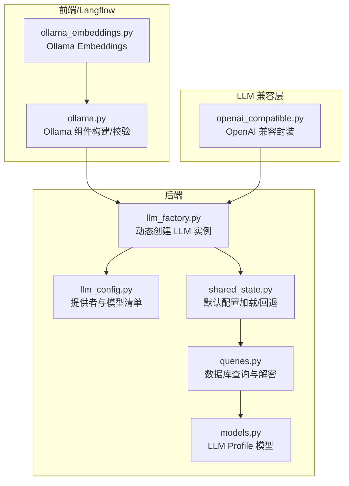
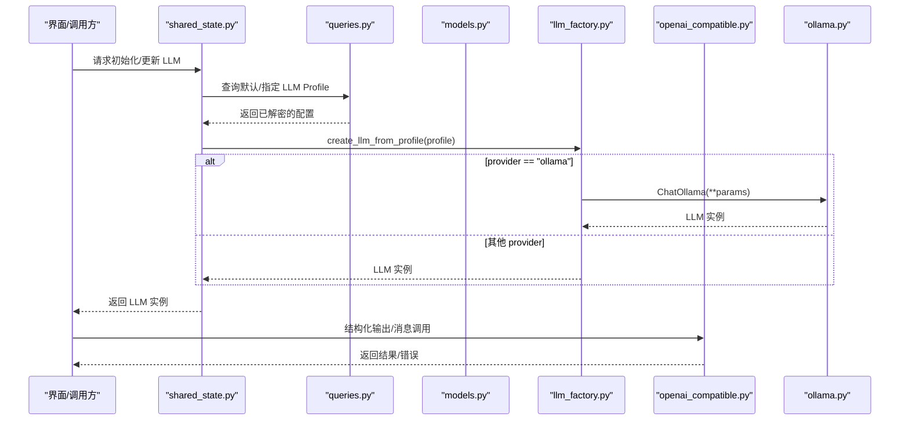
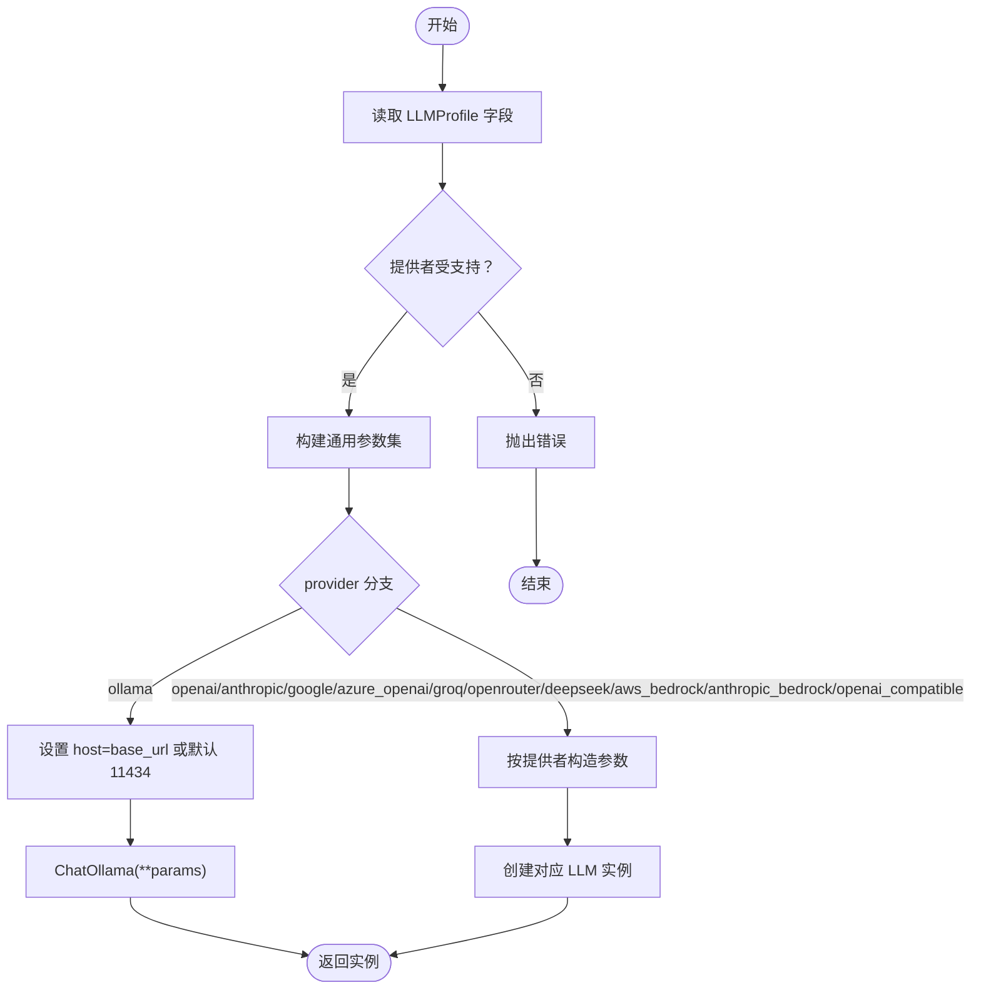
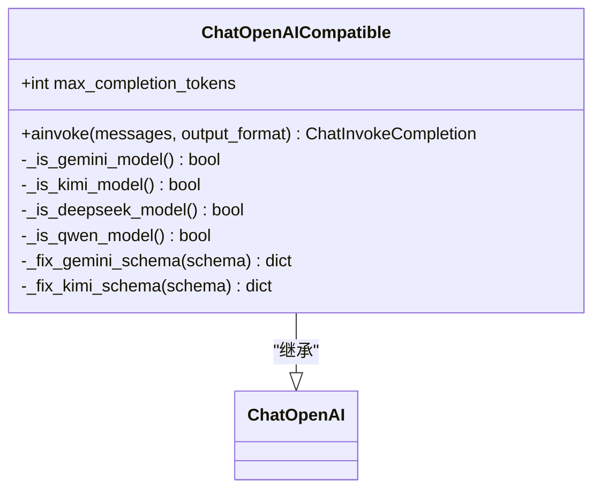
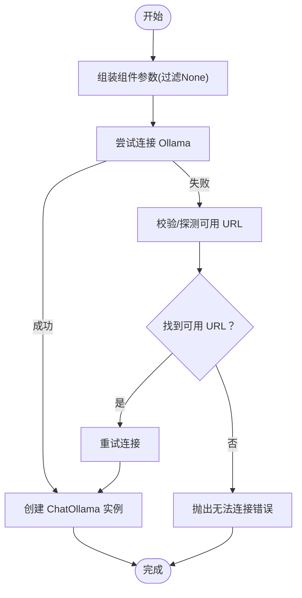
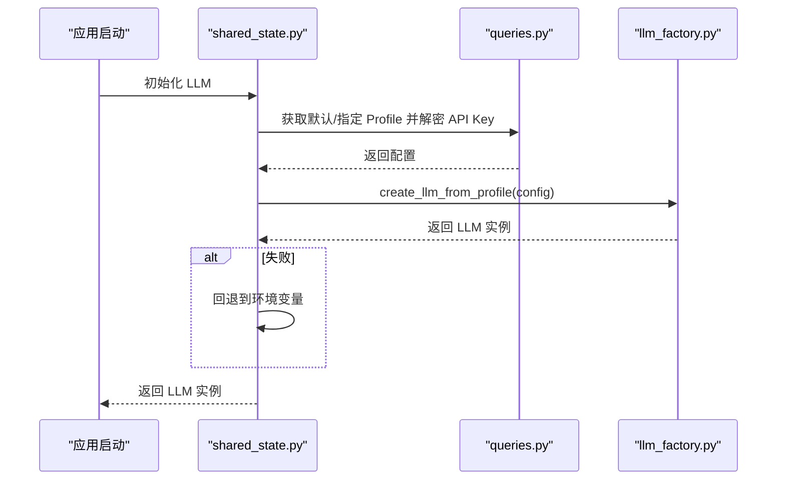
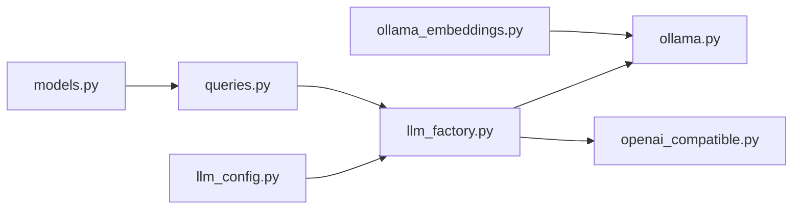

# 本地LLM支持

<cite>
**本文引用的文件**
- [llm_factory.py](file://vibe_surf/backend/utils/llm_factory.py)
- [openai_compatible.py](file://vibe_surf/llm/openai_compatible.py)
- [llm_config.py](file://vibe_surf/backend/llm_config.py)
- [shared_state.py](file://vibe_surf/backend/shared_state.py)
- [queries.py](file://vibe_surf/backend/database/queries.py)
- [models.py](file://vibe_surf/backend/database/models.py)
- [ollama.py](file://vibe_surf/langflow/components/ollama/ollama.py)
- [ollama_embeddings.py](file://vibe_surf/langflow/components/ollama/ollama_embeddings.py)
- [README.md](file://README.md)
</cite>

## 目录
1. [引言](#引言)
2. [项目结构](#项目结构)
3. [核心组件](#核心组件)
4. [架构总览](#架构总览)
5. [详细组件分析](#详细组件分析)
6. [依赖关系分析](#依赖关系分析)
7. [性能考虑](#性能考虑)
8. [故障排查指南](#故障排查指南)
9. [结论](#结论)
10. [附录：部署与配置指南](#附录部署与配置指南)

## 引言
本文件系统性文档化 VibeSurf 对本地 LLM 的支持机制，重点覆盖：
- 通过 llm_factory.py 动态加载本地 LLM 实例，包括模型发现、配置解析与运行时环境检测；
- 通过 openai_compatible.py 将本地 LLM 的 API 调用转换为 OpenAI 兼容格式，涵盖请求参数映射、流式响应处理与上下文长度管理；
- 提供跨平台部署指南，说明如何在不同操作系统上安装与配置本地 LLM 服务；
- 性能调优建议，包括 GPU 加速配置、量化模型选择与内存优化；
- 本地 LLM 的局限性，包括功能差异、性能瓶颈与维护成本。

## 项目结构
围绕本地 LLM 支持的关键目录与文件如下：
- 后端工厂与配置
  - vibe_surf/backend/utils/llm_factory.py：动态创建 LLM 实例，解析配置并校验参数
  - vibe_surf/backend/llm_config.py：集中式提供者与模型清单、元数据
  - vibe_surf/backend/shared_state.py：默认 LLM 配置加载与回退策略
  - vibe_surf/backend/database/queries.py：数据库查询与解密 API Key
  - vibe_surf/backend/database/models.py：LLM Profile 数据模型与索引
- 前端与 Langflow 组件
  - vibe_surf/langflow/components/ollama/ollama.py：Ollama 组件构建与 URL 校验
  - vibe_surf/langflow/components/ollama/ollama_embeddings.py：Ollama Embeddings 组件
- LLM 兼容层
  - vibe_surf/llm/openai_compatible.py：OpenAI 兼容封装，自动 schema 修复与结构化输出

图表来源
- [llm_factory.py](file://vibe_surf/backend/utils/llm_factory.py#L1-L275)
- [llm_config.py](file://vibe_surf/backend/llm_config.py#L1-L226)
- [shared_state.py](file://vibe_surf/backend/shared_state.py#L613-L664)
- [queries.py](file://vibe_surf/backend/database/queries.py#L117-L142)
- [models.py](file://vibe_surf/backend/database/models.py#L57-L93)
- [ollama.py](file://vibe_surf/langflow/components/ollama/ollama.py#L159-L216)
- [ollama_embeddings.py](file://vibe_surf/langflow/components/ollama/ollama_embeddings.py#L41-L83)
- [openai_compatible.py](file://vibe_surf/llm/openai_compatible.py#L1-L373)

章节来源
- [llm_factory.py](file://vibe_surf/backend/utils/llm_factory.py#L1-L275)
- [llm_config.py](file://vibe_surf/backend/llm_config.py#L1-L226)
- [shared_state.py](file://vibe_surf/backend/shared_state.py#L613-L664)
- [queries.py](file://vibe_surf/backend/database/queries.py#L117-L142)
- [models.py](file://vibe_surf/backend/database/models.py#L57-L93)
- [ollama.py](file://vibe_surf/langflow/components/ollama/ollama.py#L159-L216)
- [ollama_embeddings.py](file://vibe_surf/langflow/components/ollama/ollama_embeddings.py#L41-L83)
- [openai_compatible.py](file://vibe_surf/llm/openai_compatible.py#L1-L373)

## 核心组件
- LLM 工厂（动态加载）
  - 依据 LLMProfile 字段动态创建对应 LLM 实例，支持 openai、anthropic、google、azure_openai、groq、ollama、openrouter、deepseek、aws_bedrock、anthropic_bedrock、openai_compatible 等提供者
  - 参数支持按提供者差异化配置，统一温度、最大令牌数、top_p、频率惩罚、种子等
  - Ollama 默认 host 为本地 11434 端口，可从 base_url 覆盖
- OpenAI 兼容封装
  - 自动识别 Gemini/Kimi/Qwen/DeepSeek 等特殊模型并应用 schema 修复
  - 支持结构化输出（JSON Schema），自动注入系统提示或 response_format
  - 统一错误处理，将第三方异常映射为统一错误类型
- Ollama 组件
  - 构建 ChatOllama 与 OllamaEmbeddings，支持 num_gpu、num_ctx、temperature 等参数
  - 校验 base_url 可达性，自动探测可用 URL 列表
- 配置与回退
  - 默认 LLM 配置优先从数据库默认配置加载，失败则回退到环境变量

章节来源
- [llm_factory.py](file://vibe_surf/backend/utils/llm_factory.py#L23-L216)
- [openai_compatible.py](file://vibe_surf/llm/openai_compatible.py#L63-L373)
- [ollama.py](file://vibe_surf/langflow/components/ollama/ollama.py#L159-L216)
- [ollama_embeddings.py](file://vibe_surf/langflow/components/ollama/ollama_embeddings.py#L41-L83)
- [shared_state.py](file://vibe_surf/backend/shared_state.py#L613-L664)

## 架构总览
下图展示从“配置加载”到“LLM 调用”的端到端流程，以及本地 LLM（Ollama）与兼容层的交互。

图表来源
- [shared_state.py](file://vibe_surf/backend/shared_state.py#L613-L664)
- [queries.py](file://vibe_surf/backend/database/queries.py#L117-L142)
- [models.py](file://vibe_surf/backend/database/models.py#L57-L93)
- [llm_factory.py](file://vibe_surf/backend/utils/llm_factory.py#L126-L135)
- [ollama.py](file://vibe_surf/langflow/components/ollama/ollama.py#L185-L197)
- [openai_compatible.py](file://vibe_surf/llm/openai_compatible.py#L212-L373)

## 详细组件分析

### 组件A：LLM 工厂（动态加载与参数映射）
- 模型发现与配置解析
  - 从 LLMProfile 中读取 provider、model、api_key、base_url、temperature、max_tokens、top_p、frequency_penalty、seed、provider_config 等字段
  - 通过 is_provider_supported 与 get_provider_metadata 进行提供者合法性与元数据校验
- 参数支持矩阵
  - 不同提供者支持的参数不同，例如 ollama 不支持 max_tokens；openrouter 不支持 max_tokens；openai_compatible 支持 temperature 与 max_tokens
- Ollama 特例
  - 若未显式提供 base_url，则默认使用 http://localhost:11434
  - 将 base_url 映射为 ChatOllama 的 host 参数
- 错误处理
  - 创建失败记录日志并抛出运行时错误，便于上层捕获与提示

图表来源
- [llm_factory.py](file://vibe_surf/backend/utils/llm_factory.py#L23-L216)

章节来源
- [llm_factory.py](file://vibe_surf/backend/utils/llm_factory.py#L23-L216)

### 组件B：OpenAI 兼容封装（结构化输出与 schema 修复）
- 模型识别与 schema 修复
  - 自动识别 Gemini/Kimi/Qwen/DeepSeek 模型，并分别应用对应的 schema 修复逻辑
  - 修复内容包括移除不被支持的属性、$ref 解析、空对象属性处理、anyOf/default 冲突清理等
- 结构化输出
  - 当存在输出格式约束时，自动注入 response_format 或将 schema 注入系统提示
  - 使用 JSON Schema 校验与修复，提升稳定性
- 上下文长度管理
  - 支持 max_completion_tokens 与 max_tokens 的映射，必要时同时设置两者
  - 对推理模型（reasoning_models）自动切换推理模式并调整温度/惩罚参数
- 错误处理
  - 统一封装 RateLimitError、APIConnectionError、APIStatusError 等为统一错误类型，便于上层处理

图表来源
- [openai_compatible.py](file://vibe_surf/llm/openai_compatible.py#L63-L373)

章节来源
- [openai_compatible.py](file://vibe_surf/llm/openai_compatible.py#L63-L373)

### 组件C：Ollama 组件（模型发现与连接校验）
- 组件参数映射
  - 支持 base_url、model、temperature、top_p、num_ctx、num_gpu、num_thread、repeat_*、stop、system、template 等参数
  - 自动过滤 None 值，避免无效参数传入
- 连接校验
  - 通过访问 /api/tags 接口验证 Ollama 可达性
  - 自动探测可用 URL 列表，若未提供 base_url 则尝试内置列表
- 模型发现
  - 在有效 base_url 下拉取可用模型列表，用于前端选择与校验

图表来源
- [ollama.py](file://vibe_surf/langflow/components/ollama/ollama.py#L159-L216)
- [ollama_embeddings.py](file://vibe_surf/langflow/components/ollama/ollama_embeddings.py#L41-L83)

章节来源
- [ollama.py](file://vibe_surf/langflow/components/ollama/ollama.py#L159-L216)
- [ollama_embeddings.py](file://vibe_surf/langflow/components/ollama/ollama_embeddings.py#L41-L83)

### 组件D：配置加载与回退（数据库优先，环境变量回退）
- 默认配置加载
  - 从数据库获取默认 LLM Profile，解密 API Key 后交由工厂创建实例
- 回退策略
  - 数据库不可用或加载失败时，回退到环境变量（如 OPENAI_ENDPOINT、OPENAI_API_KEY、LLM_MODEL）

图表来源
- [shared_state.py](file://vibe_surf/backend/shared_state.py#L613-L664)
- [queries.py](file://vibe_surf/backend/database/queries.py#L117-L142)
- [llm_factory.py](file://vibe_surf/backend/utils/llm_factory.py#L23-L216)

章节来源
- [shared_state.py](file://vibe_surf/backend/shared_state.py#L613-L664)
- [queries.py](file://vibe_surf/backend/database/queries.py#L117-L142)
- [llm_factory.py](file://vibe_surf/backend/utils/llm_factory.py#L23-L216)

## 依赖关系分析
- 提供者与模型清单
  - llm_config.py 定义了各提供者的模型列表与元数据（是否需要 API Key、是否需要 base_url、默认模型等）
- 数据模型与查询
  - models.py 定义 LLMProfile 表结构与索引；queries.py 提供加密/解密 API Key 的查询能力
- 组件与工厂
  - ollama.py/ollama_embeddings.py 依赖浏览器用库的 ChatOllama/OllamaEmbeddings；llm_factory.py 依赖浏览器用库的 ChatOllama 与自定义 ChatOpenAICompatible
- 兼容层
  - openai_compatible.py 依赖浏览器用库的 ChatOpenAI 与消息序列化器、SchemaOptimizer

图表来源
- [llm_config.py](file://vibe_surf/backend/llm_config.py#L1-L226)
- [models.py](file://vibe_surf/backend/database/models.py#L57-L93)
- [queries.py](file://vibe_surf/backend/database/queries.py#L117-L142)
- [llm_factory.py](file://vibe_surf/backend/utils/llm_factory.py#L1-L275)
- [ollama.py](file://vibe_surf/langflow/components/ollama/ollama.py#L159-L216)
- [ollama_embeddings.py](file://vibe_surf/langflow/components/ollama/ollama_embeddings.py#L41-L83)
- [openai_compatible.py](file://vibe_surf/llm/openai_compatible.py#L1-L373)

章节来源
- [llm_config.py](file://vibe_surf/backend/llm_config.py#L1-L226)
- [models.py](file://vibe_surf/backend/database/models.py#L57-L93)
- [queries.py](file://vibe_surf/backend/database/queries.py#L117-L142)
- [llm_factory.py](file://vibe_surf/backend/utils/llm_factory.py#L1-L275)
- [ollama.py](file://vibe_surf/langflow/components/ollama/ollama.py#L159-L216)
- [ollama_embeddings.py](file://vibe_surf/langflow/components/ollama/ollama_embeddings.py#L41-L83)
- [openai_compatible.py](file://vibe_surf/llm/openai_compatible.py#L1-L373)

## 性能考虑
- GPU 加速与量化
  - Ollama 组件支持 num_gpu、num_ctx、temperature 等参数，可在组件层面控制资源分配与上下文长度
  - 量化模型选择建议结合硬件能力与任务需求，优先选择适配本地显存的模型尺寸
- 上下文长度与内存优化
  - openai_compatible.py 支持 max_completion_tokens 与 max_tokens 映射，合理设置可避免超长上下文导致的内存压力
  - 在 Langflow 组件中，可通过 num_ctx 控制上下文窗口大小
- 流式响应与并发
  - openai_compatible.py 的 ainvoke 支持异步调用，适合在高并发场景下进行批量处理
- I/O 与网络
  - Ollama 默认本地 11434 端口，避免网络抖动带来的延迟；若需远程部署，应确保网络稳定与带宽充足

[本节为通用指导，无需特定文件引用]

## 故障排查指南
- Ollama 连接失败
  - 现象：无法连接 Ollama API
  - 排查要点：确认 base_url 是否可达、模型是否已拉取、组件是否正确过滤 None 参数
  - 参考路径：[ollama.py](file://vibe_surf/langflow/components/ollama/ollama.py#L185-L197)、[ollama_embeddings.py](file://vibe_surf/langflow/components/ollama/ollama_embeddings.py#L41-L54)
- 结构化输出解析失败
  - 现象：返回 JSON 无法解析
  - 排查要点：启用 JSON 修复与 schema 注入，检查 response_format 设置
  - 参考路径：[openai_compatible.py](file://vibe_surf/llm/openai_compatible.py#L275-L339)
- 提供者参数不匹配
  - 现象：某些提供者不支持 max_tokens 或 temperature
  - 排查要点：根据 llm_config.py 的参数支持矩阵调整参数
  - 参考路径：[llm_factory.py](file://vibe_surf/backend/utils/llm_factory.py#L50-L62)、[llm_config.py](file://vibe_surf/backend/llm_config.py#L83-L199)
- 默认配置加载失败
  - 现象：数据库不可用或无默认配置
  - 排查要点：检查数据库连接、默认配置是否存在；回退到环境变量
  - 参考路径：[shared_state.py](file://vibe_surf/backend/shared_state.py#L613-L664)

章节来源
- [ollama.py](file://vibe_surf/langflow/components/ollama/ollama.py#L185-L197)
- [ollama_embeddings.py](file://vibe_surf/langflow/components/ollama/ollama_embeddings.py#L41-L54)
- [openai_compatible.py](file://vibe_surf/llm/openai_compatible.py#L275-L339)
- [llm_factory.py](file://vibe_surf/backend/utils/llm_factory.py#L50-L62)
- [llm_config.py](file://vibe_surf/backend/llm_config.py#L83-L199)
- [shared_state.py](file://vibe_surf/backend/shared_state.py#L613-L664)

## 结论
VibeSurf 通过“配置驱动 + 工厂模式 + 兼容层”的架构，实现了对本地 LLM（尤其是 Ollama）的无缝集成。工厂负责参数解析与实例创建，兼容层负责 schema 修复与结构化输出，组件层负责连接校验与模型发现。配合数据库持久化与环境变量回退，系统具备良好的可维护性与可移植性。性能方面，可通过 GPU/量化/上下文长度等参数进行调优；在实际部署中，建议结合硬件条件与业务场景选择合适的模型与参数组合。

[本节为总结性内容，无需特定文件引用]

## 附录：部署与配置指南

### 1. 安装与启动本地 LLM 服务（以 Ollama 为例）
- Windows/macOS/Linux
  - 官方安装指南请参考 Ollama 官网安装步骤
  - 启动后默认监听本地 11434 端口
- 拉取模型
  - 使用 Ollama 命令行或 Web UI 拉取所需模型
- 验证连通性
  - 访问 http://localhost:11434/api/tags，确认返回模型列表

[本节为通用部署说明，无需特定文件引用]

### 2. 在 VibeSurf 中配置本地 LLM
- 通过数据库配置
  - 在 LLMProfile 中填写 provider=ollama、model=你的模型名、base_url=http://localhost:11434
  - 如需默认配置，设置 is_default=true
- 通过环境变量回退
  - 若数据库不可用，系统会回退到环境变量（如 OPENAI_ENDPOINT、OPENAI_API_KEY、LLM_MODEL）
- 在 Langflow 组件中
  - 设置 base_url 为 Ollama 地址，选择已拉取的模型
  - 可选参数：num_gpu、num_ctx、temperature、top_p 等

章节来源
- [models.py](file://vibe_surf/backend/database/models.py#L57-L93)
- [queries.py](file://vibe_surf/backend/database/queries.py#L117-L142)
- [shared_state.py](file://vibe_surf/backend/shared_state.py#L613-L664)
- [ollama.py](file://vibe_surf/langflow/components/ollama/ollama.py#L159-L216)
- [README.md](file://README.md#L38-L81)

### 3. 跨平台注意事项
- Windows
  - Chrome 142 起不再支持自动加载扩展，需手动加载扩展
- macOS/Linux
  - 使用 uv 管理器安装与运行
- 前端构建
  - 如需前端调试，按 README 步骤构建并复制到后端目录

章节来源
- [README.md](file://README.md#L38-L81)