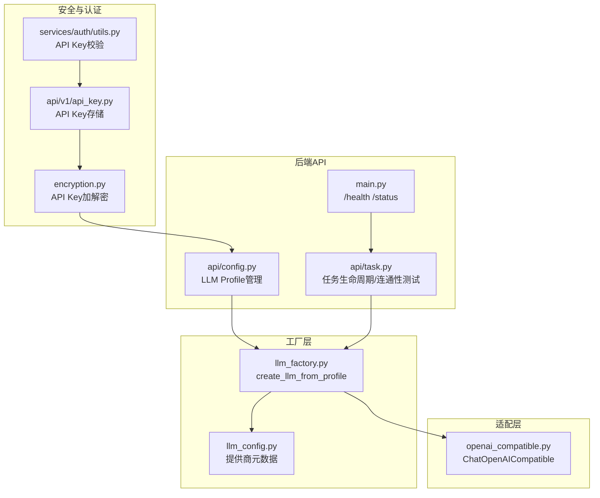
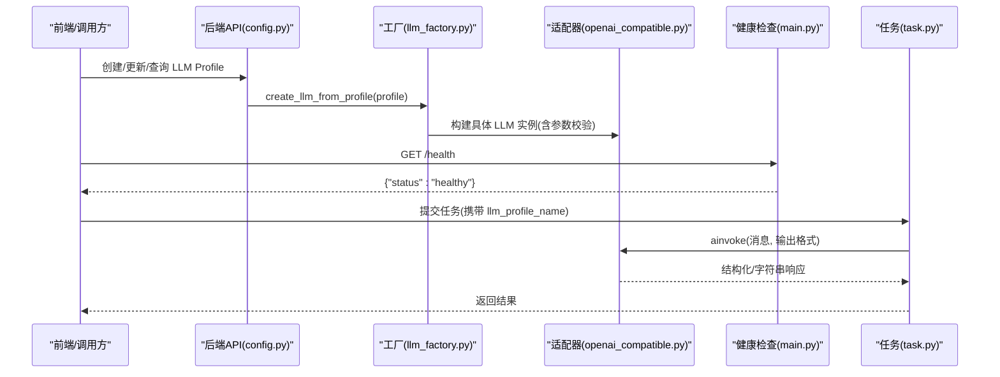
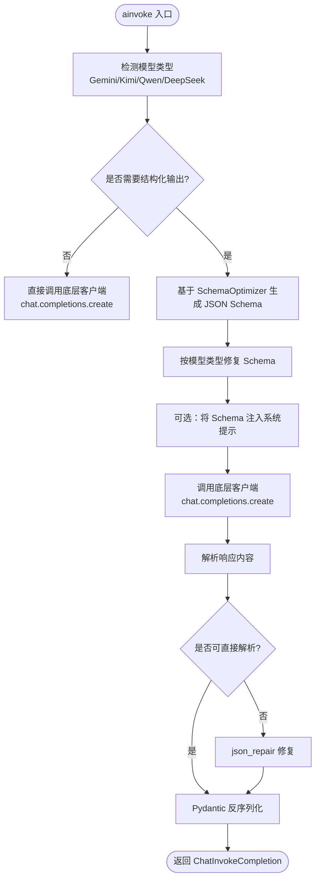
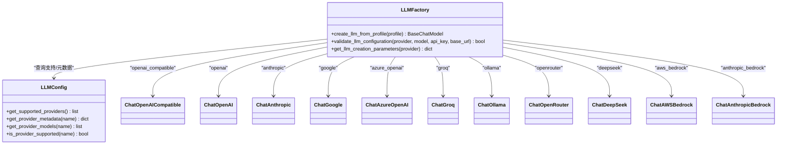
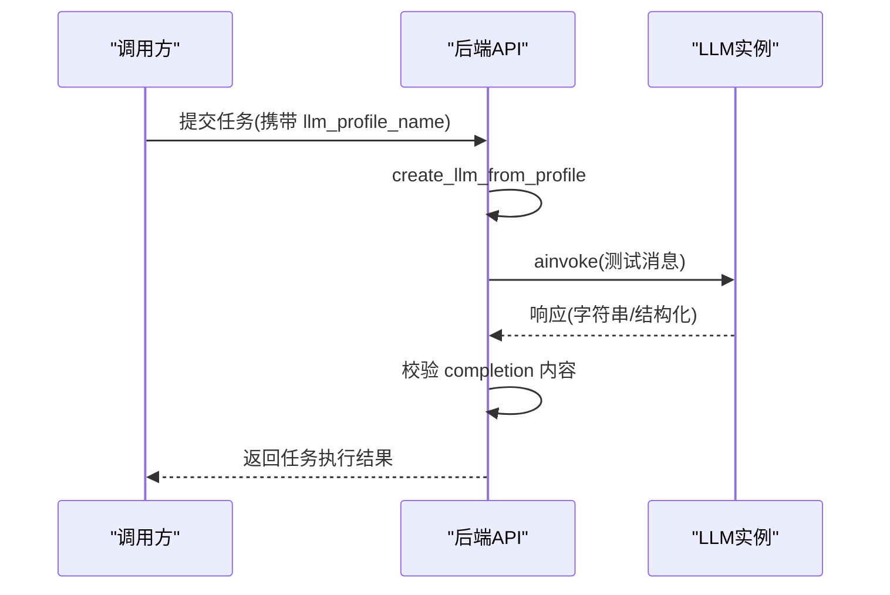
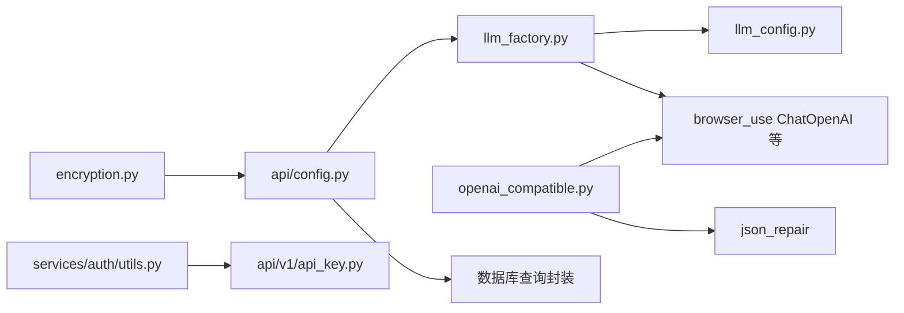

# 自定义API集成

<cite>
**本文引用的文件列表**
- [openai_compatible.py](file://vibe_surf/llm/openai_compatible.py)
- [llm_factory.py](file://vibe_surf/backend/utils/llm_factory.py)
- [llm_config.py](file://vibe_surf/backend/llm_config.py)
- [config.py](file://vibe_surf/backend/api/config.py)
- [task.py](file://vibe_surf/backend/api/task.py)
- [encryption.py](file://vibe_surf/backend/utils/encryption.py)
- [api-key.py](file://vibe_surf/langflow/api/v1/api_key.py)
- [utils.py](file://vibe_surf/langflow/services/auth/utils.py)
- [main.py](file://vibe_surf/backend/main.py)
- [test_backend_api.py](file://tests/test_backend_api.py)
</cite>

## 目录
1. [简介](#简介)
2. [项目结构与定位](#项目结构与定位)
3. [核心组件](#核心组件)
4. [架构总览](#架构总览)
5. [详细组件分析](#详细组件分析)
6. [依赖关系分析](#依赖关系分析)
7. [性能与稳定性考量](#性能与稳定性考量)
8. [故障排查指南](#故障排查指南)
9. [结论](#结论)
10. [附录：开发指南与最佳实践](#附录开发指南与最佳实践)

## 简介
本文件系统化文档化 VibeSurf 对“非标准 LLM API”的适配能力，重点围绕以下目标：
- 通过 openai_compatible.py 实现对非标准 LLM API 的适配，覆盖自定义端点配置、请求/响应格式转换与认证机制支持。
- 基于 llm_factory.py 的工厂扩展机制，说明如何为新的 LLM 提供商创建自定义适配器类。
- 提供完整开发指南，包含错误处理、超时配置与健康检查策略。
- 讨论 API 兼容性测试策略，确保自定义集成的稳定性和可靠性。
- 覆盖安全最佳实践，包括敏感信息加密、API 密钥轮换与访问控制。

## 项目结构与定位
- LLM 适配层位于 vibe_surf/llm/openai_compatible.py，提供 OpenAI 兼容接口的增强实现，自动处理特定模型（如 Gemini、Kimi、DeepSeek、Qwen）的 schema 差异与输出修复。
- LLM 工厂位于 vibe_surf/backend/utils/llm_factory.py，负责从数据库配置或用户输入中构建具体 LLM 实例，并统一参数校验与元数据管理。
- 配置与元数据位于 vibe_surf/backend/llm_config.py，集中维护支持的提供商、默认模型、是否需要 API Key、是否需要 base_url 等元信息。
- 后端 API 路由位于 vibe_surf/backend/api/config.py，提供 LLM Profile 的增删改查、可用提供商查询、配置状态等接口。
- 健康检查与任务生命周期在 vibe_surf/backend/main.py 与 vibe_surf/backend/api/task.py 中实现。
- 安全与认证涉及 vibe_surf/backend/utils/encryption.py（本地机密派生与加解密）、langflow/api/v1/api_key.py 与 langflow/services/auth/utils.py（API Key 存储与校验）。

图表来源
- [openai_compatible.py](file://vibe_surf/llm/openai_compatible.py#L1-L373)
- [llm_factory.py](file://vibe_surf/backend/utils/llm_factory.py#L1-L275)
- [llm_config.py](file://vibe_surf/backend/llm_config.py#L1-L226)
- [config.py](file://vibe_surf/backend/api/config.py#L1-L762)
- [task.py](file://vibe_surf/backend/api/task.py#L163-L182)
- [main.py](file://vibe_surf/backend/main.py#L649-L686)
- [encryption.py](file://vibe_surf/backend/utils/encryption.py#L1-L172)
- [api-key.py](file://vibe_surf/langflow/api/v1/api_key.py#L1-L88)
- [utils.py](file://vibe_surf/langflow/services/auth/utils.py#L51-L141)

章节来源
- [openai_compatible.py](file://vibe_surf/llm/openai_compatible.py#L1-L373)
- [llm_factory.py](file://vibe_surf/backend/utils/llm_factory.py#L1-L275)
- [llm_config.py](file://vibe_surf/backend/llm_config.py#L1-L226)
- [config.py](file://vibe_surf/backend/api/config.py#L1-L762)
- [task.py](file://vibe_surf/backend/api/task.py#L163-L182)
- [main.py](file://vibe_surf/backend/main.py#L649-L686)
- [encryption.py](file://vibe_surf/backend/utils/encryption.py#L1-L172)
- [api-key.py](file://vibe_surf/langflow/api/v1/api_key.py#L1-L88)
- [utils.py](file://vibe_surf/langflow/services/auth/utils.py#L51-L141)

## 核心组件
- ChatOpenAICompatible：在浏览器用例的 ChatOpenAI 基础上，针对 Gemini/Kimi/DeepSeek/Qwen 等模型自动应用 schema 修复与输出格式化，支持结构化输出与 JSON Schema 响应格式。
- LLM 工厂 create_llm_from_profile：根据 LLMProfile 配置动态创建 LLM 实例，内置参数支持矩阵与提供商校验，支持 openai_compatible 类型。
- LLM 配置与元数据：集中管理提供商列表、模型清单、是否需要 API Key/base_url、默认模型等。
- API 路由：提供 LLM Profile 的 CRUD、可用提供商查询、配置状态查询；配合健康检查与任务生命周期测试。
- 加密与认证：本地机密派生与 API Key 加解密；API Key 存储与校验中间件。

章节来源
- [openai_compatible.py](file://vibe_surf/llm/openai_compatible.py#L63-L373)
- [llm_factory.py](file://vibe_surf/backend/utils/llm_factory.py#L23-L216)
- [llm_config.py](file://vibe_surf/backend/llm_config.py#L1-L226)
- [config.py](file://vibe_surf/backend/api/config.py#L585-L762)

## 架构总览
下图展示了从配置到调用链路的关键交互：

图表来源
- [config.py](file://vibe_surf/backend/api/config.py#L77-L367)
- [llm_factory.py](file://vibe_surf/backend/utils/llm_factory.py#L23-L216)
- [openai_compatible.py](file://vibe_surf/llm/openai_compatible.py#L212-L373)
- [main.py](file://vibe_surf/backend/main.py#L649-L686)
- [task.py](file://vibe_surf/backend/api/task.py#L163-L182)

## 详细组件分析

### 组件A：ChatOpenAICompatible（非标准API适配）
- 模型识别与自动修复
  - 支持 Gemini：移除不支持字段、解析 $ref、处理空对象类型、必要时添加占位属性。
  - 支持 Kimi/Moonshot：移除 min_items/minItems/default 等限制，处理 anyOf 场景。
  - 支持 DeepSeek：按需启用系统提示中的 JSON Schema。
  - 支持 Qwen：在 response_format 下保证 json 关键词存在。
- 请求/响应格式转换
  - 使用 OpenAIMessageSerializer 将内部消息序列化为 OpenAI 兼容格式。
  - 支持结构化输出：通过 JSON Schema 或 json_object 响应格式返回。
  - 输出修复：当模型返回 JSON 不规范时，使用 json_repair 进行修复再反序列化。
- 错误处理
  - 捕获 RateLimitError、APIConnectionError、APIStatusError 并映射为统一 ModelProviderError，保留状态码与模型名。
- 参数传递
  - 温度、频率惩罚、最大补全 token、top_p、seed、service_tier、reasoning_effort 等参数透传至底层客户端。
- 调用流程

图表来源
- [openai_compatible.py](file://vibe_surf/llm/openai_compatible.py#L212-L373)

章节来源
- [openai_compatible.py](file://vibe_surf/llm/openai_compatible.py#L63-L373)

### 组件B：LLM 工厂 create_llm_from_profile（扩展机制）
- 参数支持矩阵
  - 不同提供商支持的参数不同，工厂内置支持矩阵，仅透传允许的参数（如 temperature、max_tokens、top_p、frequency_penalty、seed），避免不兼容参数导致失败。
- 提供商映射
  - openai、anthropic、google、azure_openai、groq、ollama、openrouter、deepseek、aws_bedrock、anthropic_bedrock、openai_compatible、qwen、kimi、lm_studio 等均有对应映射。
- 特殊处理
  - openai_compatible：要求 base_url，且可注入 provider_config。
  - azure_openai：强制 api_version。
  - aws_bedrock/anthropic_bedrock：使用 AWS 凭证字段。
  - qwen/kimi：预设 base_url。
- 参数校验与元数据
  - validate_llm_configuration：校验 provider、model、api_key、base_url 是否满足提供商要求。
  - get_llm_creation_parameters：返回所需/可选参数清单及提供商元数据。

图表来源
- [llm_factory.py](file://vibe_surf/backend/utils/llm_factory.py#L23-L216)
- [llm_config.py](file://vibe_surf/backend/llm_config.py#L1-L226)

章节来源
- [llm_factory.py](file://vibe_surf/backend/utils/llm_factory.py#L23-L275)
- [llm_config.py](file://vibe_surf/backend/llm_config.py#L1-L226)

### 组件C：健康检查与连通性测试
- 健康检查
  - /health：返回服务健康状态与版本信息。
  - /api/status：返回系统状态（Langflow 初始化、Agent、Browser 等）。
- 连通性测试
  - 在任务提交前，使用新创建的 LLM 实例发送简单问题，验证响应有效性；若响应为空则记录警告但不中断流程。

图表来源
- [main.py](file://vibe_surf/backend/main.py#L649-L686)
- [task.py](file://vibe_surf/backend/api/task.py#L163-L182)

章节来源
- [main.py](file://vibe_surf/backend/main.py#L649-L686)
- [task.py](file://vibe_surf/backend/api/task.py#L163-L182)

## 依赖关系分析
- 组件耦合
  - llm_factory 依赖 llm_config 获取提供商支持与元数据；依赖 browser_use 的 ChatOpenAI 等具体实现类。
  - openai_compatible 依赖 browser_use 的消息序列化与视图模型，以及外部 JSON 修复库。
  - API 层依赖数据库查询封装与工厂方法，提供 Profile 管理与状态查询。
- 外部依赖
  - httpx、openai SDK、pydantic、json_repair 等。
- 安全依赖
  - cryptography、getmac、uuid_extensions 用于加密与标识生成。

图表来源
- [llm_factory.py](file://vibe_surf/backend/utils/llm_factory.py#L1-L275)
- [llm_config.py](file://vibe_surf/backend/llm_config.py#L1-L226)
- [openai_compatible.py](file://vibe_surf/llm/openai_compatible.py#L1-L373)
- [config.py](file://vibe_surf/backend/api/config.py#L1-L762)
- [encryption.py](file://vibe_surf/backend/utils/encryption.py#L1-L172)
- [api-key.py](file://vibe_surf/langflow/api/v1/api_key.py#L1-L88)
- [utils.py](file://vibe_surf/langflow/services/auth/utils.py#L51-L141)

章节来源
- [llm_factory.py](file://vibe_surf/backend/utils/llm_factory.py#L1-L275)
- [llm_config.py](file://vibe_surf/backend/llm_config.py#L1-L226)
- [openai_compatible.py](file://vibe_surf/llm/openai_compatible.py#L1-L373)
- [config.py](file://vibe_surf/backend/api/config.py#L1-L762)
- [encryption.py](file://vibe_surf/backend/utils/encryption.py#L1-L172)
- [api-key.py](file://vibe_surf/langflow/api/v1/api_key.py#L1-L88)
- [utils.py](file://vibe_surf/langflow/services/auth/utils.py#L51-L141)

## 性能与稳定性考量
- 超时与重试
  - 建议在调用链路中为 HTTP 请求设置合理超时（例如 10-30 秒），并在客户端进行指数退避重试（避免对限流错误重复重试）。
  - 参考前端健康检查的指数回退策略，避免服务忙时雪崩。
- 连接池与并发
  - 对于本地 Ollama/LM Studio 等本地服务，注意 host/端口配置与连接池大小；对于云端服务，遵循提供商的速率限制。
- 输出修复成本
  - json_repair 会增加额外开销，建议仅在必要时启用（即模型返回 JSON 不规范时）。
- 健康检查
  - 使用 /health 与 /api/status 快速判断服务状态；在任务提交前进行轻量级连通性测试，降低失败率。

[本节为通用指导，无需列出具体文件来源]

## 故障排查指南
- 常见错误与定位
  - RateLimitError：统一映射为 ModelProviderError，包含状态码与模型名，便于日志追踪。
  - APIConnectionError/APIStatusError：捕获底层网络/HTTP 异常，提取错误消息与状态码。
  - 结构化输出解析失败：尝试 json_repair 修复后再反序列化。
- 数据库与配置
  - LLM Profile CRUD：确认 profile 名称唯一、默认 profile 设置逻辑、active_only 过滤。
  - 配置状态：/config/status 返回 LLM Profiles 数量、工具初始化、浏览器管理器、Agent 初始化状态。
- 健康检查
  - /health 返回 healthy 即表示服务就绪；若返回 503/429，前端已实现指数回退重试。
- 测试脚本
  - tests/test_backend_api.py 提供了健康检查、Profile CRUD、任务生命周期、活动日志等端到端测试思路，可作为集成测试参考。

章节来源
- [openai_compatible.py](file://vibe_surf/llm/openai_compatible.py#L341-L373)
- [config.py](file://vibe_surf/backend/api/config.py#L645-L762)
- [main.py](file://vibe_surf/backend/main.py#L649-L686)
- [test_backend_api.py](file://tests/test_backend_api.py#L98-L112)

## 结论
VibeSurf 通过 ChatOpenAICompatible 与 LLM 工厂实现了对“非标准 LLM API”的稳健适配：在保持 OpenAI 兼容语义的同时，针对特定模型的 schema 差异与输出格式进行自动修复；工厂层提供参数支持矩阵与提供商映射，确保配置正确性与可扩展性；结合健康检查与连通性测试，保障集成的稳定性与可靠性。配合本地机密派生与 API Key 存储/校验机制，形成从配置、调用到安全的闭环。

[本节为总结性内容，无需列出具体文件来源]

## 附录：开发指南与最佳实践

### 如何为新的 LLM 提供商创建适配器
- 步骤
  1) 在 llm_config.py 中注册提供商名称、默认模型、是否需要 API Key/base_url、是否支持工具/视觉等元数据。
  2) 在 llm_factory.py 的 create_llm_from_profile 中新增分支，映射到新的 LLM 类构造函数，并设置必要的参数支持矩阵。
  3) 若新提供商需要特殊的请求/响应格式转换或 schema 修复，可在 openai_compatible.py 中扩展或新建适配器类，复用其消息序列化与异常映射机制。
  4) 在 API 层提供 LLM Profile 的创建/更新接口，确保前端可配置 base_url、api_key、温度、最大 token 等参数。
- 示例路径
  - 提供商注册与元数据：[llm_config.py](file://vibe_surf/backend/llm_config.py#L83-L200)
  - 工厂映射与参数支持：[llm_factory.py](file://vibe_surf/backend/utils/llm_factory.py#L49-L216)
  - 适配器基类与修复逻辑：[openai_compatible.py](file://vibe_surf/llm/openai_compatible.py#L63-L373)
  - API Profile 管理：[config.py](file://vibe_surf/backend/api/config.py#L77-L367)

章节来源
- [llm_config.py](file://vibe_surf/backend/llm_config.py#L83-L200)
- [llm_factory.py](file://vibe_surf/backend/utils/llm_factory.py#L49-L216)
- [openai_compatible.py](file://vibe_surf/llm/openai_compatible.py#L63-L373)
- [config.py](file://vibe_surf/backend/api/config.py#L77-L367)

### 错误处理与超时配置
- 错误处理
  - 统一捕获 RateLimitError、APIConnectionError、APIStatusError，映射为 ModelProviderError，保留状态码与模型名，便于日志与监控。
  - 结构化输出解析失败时，先尝试 json_repair 修复再反序列化。
- 超时配置
  - 建议在客户端设置请求超时（如 10-30 秒），并针对 429/503 等服务忙状态采用指数回退重试。
- 参考实现
  - 错误映射与修复：[openai_compatible.py](file://vibe_surf/llm/openai_compatible.py#L341-L373)
  - 健康检查与指数回退：[main.py](file://vibe_surf/backend/main.py#L649-L686)、[test_backend_api.py](file://tests/test_backend_api.py#L98-L112)

章节来源
- [openai_compatible.py](file://vibe_surf/llm/openai_compatible.py#L341-L373)
- [main.py](file://vibe_surf/backend/main.py#L649-L686)
- [test_backend_api.py](file://tests/test_backend_api.py#L98-L112)

### 健康检查与连通性测试
- 健康检查
  - /health：服务健康状态。
  - /api/status：系统状态（Langflow 初始化、Agent、Browser 等）。
- 连通性测试
  - 在任务提交前，使用新创建的 LLM 实例发送简单问题，验证响应有效性。
- 参考实现
  - 健康检查与状态：[main.py](file://vibe_surf/backend/main.py#L649-L686)
  - 连通性测试：[task.py](file://vibe_surf/backend/api/task.py#L163-L182)

章节来源
- [main.py](file://vibe_surf/backend/main.py#L649-L686)
- [task.py](file://vibe_surf/backend/api/task.py#L163-L182)

### API 兼容性测试策略
- 端到端测试
  - 使用 tests/test_backend_api.py 的模式，覆盖健康检查、LLM Profile CRUD、任务生命周期、活动日志等场景。
- 参数覆盖
  - 验证不同提供商的参数支持矩阵（temperature、max_tokens、top_p、frequency_penalty、seed）是否正确透传。
- 错误场景
  - 模拟限流、网络异常、无效 API Key 等，验证错误映射与恢复行为。
- 参考实现
  - 端到端测试样例：[test_backend_api.py](file://tests/test_backend_api.py#L115-L206)

章节来源
- [test_backend_api.py](file://tests/test_backend_api.py#L115-L206)

### 安全最佳实践
- 敏感信息加密
  - 使用本地机密派生（基于 MAC 地址或本地用户 ID）对 API Key 进行加解密，避免明文存储。
- API Key 轮换
  - 通过 API 接口进行存储与删除，支持会话 Cookie 存储与过期控制。
- 访问控制
  - 通过 API Key 查询/头部校验中间件，拒绝未授权访问；支持自动登录与超级用户回退策略。
- 参考实现
  - 加密/解密：[encryption.py](file://vibe_surf/backend/utils/encryption.py#L1-L172)
  - API Key 存储与 Cookie 设置：[api-key.py](file://vibe_surf/langflow/api/v1/api_key.py#L1-L88)
  - API Key 校验与权限控制：[utils.py](file://vibe_surf/langflow/services/auth/utils.py#L51-L141)

章节来源
- [encryption.py](file://vibe_surf/backend/utils/encryption.py#L1-L172)
- [api-key.py](file://vibe_surf/langflow/api/v1/api_key.py#L1-L88)
- [utils.py](file://vibe_surf/langflow/services/auth/utils.py#L51-L141)