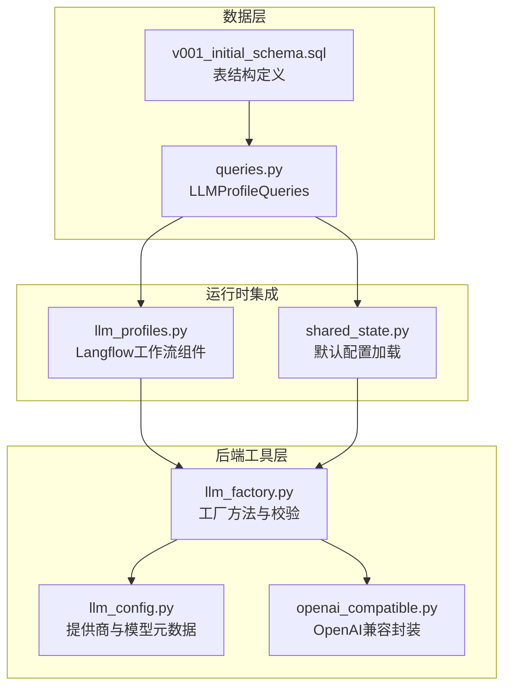
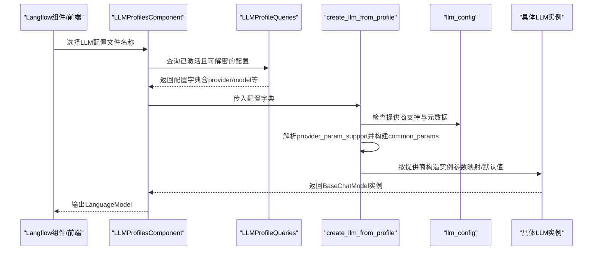
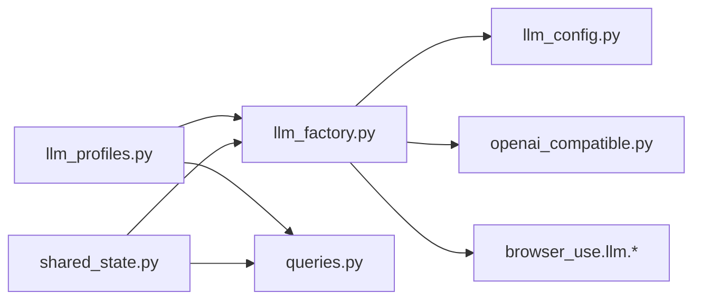

# LLM实例创建

<cite>
**本文引用的文件**
- [llm_factory.py](file://vibe_surf/backend/utils/llm_factory.py)
- [llm_config.py](file://vibe_surf/backend/llm_config.py)
- [openai_compatible.py](file://vibe_surf/llm/openai_compatible.py)
- [llm_profiles.py](file://vibe_surf/workflows/VibeSurf/llm_profiles.py)
- [queries.py](file://vibe_surf/backend/database/queries.py)
- [shared_state.py](file://vibe_surf/backend/shared_state.py)
- [v001_initial_schema.sql](file://vibe_surf/backend/database/migrations/v001_initial_schema.sql)
</cite>

## 目录
1. [简介](#简介)
2. [项目结构](#项目结构)
3. [核心组件](#核心组件)
4. [架构总览](#架构总览)
5. [详细组件分析](#详细组件分析)
6. [依赖关系分析](#依赖关系分析)
7. [性能考量](#性能考量)
8. [故障排查指南](#故障排查指南)
9. [结论](#结论)

## 简介
本文件系统化梳理 VibeSurf 中 LLM 实例创建机制，重点围绕后端工具模块中的工厂方法与配置体系，解释如何从“LLM 配置文件”（数据库记录）创建具体 LLM 实例。内容涵盖：
- create_llm_from_profile 的参数处理与兼容性设计
- provider_param_support 对不同提供商参数支持差异的抽象
- 各提供商（OpenAI、Anthropic、Ollama、AWS Bedrock 等）的实例化细节与参数映射
- validate_llm_configuration 的校验规则与错误处理
- 工厂模式在可维护性与扩展性上的优势
- 完整的流程图与调用序列图

## 项目结构
与 LLM 实例创建直接相关的模块分布如下：
- 后端工具层：负责从配置文件创建 LLM 实例
  - vibe_surf/backend/utils/llm_factory.py
  - vibe_surf/backend/llm_config.py
  - vibe_surf/llm/openai_compatible.py
- 数据层：LLM 配置文件的持久化与读取
  - vibe_surf/backend/database/queries.py
  - vibe_surf/backend/database/migrations/v001_initial_schema.sql
- 运行时集成：默认配置加载与工作流使用
  - vibe_surf/backend/shared_state.py
  - vibe_surf/workflows/VibeSurf/llm_profiles.py

图表来源
- [llm_factory.py](file://vibe_surf/backend/utils/llm_factory.py#L1-L275)
- [llm_config.py](file://vibe_surf/backend/llm_config.py#L1-L226)
- [openai_compatible.py](file://vibe_surf/llm/openai_compatible.py#L1-L373)
- [queries.py](file://vibe_surf/backend/database/queries.py#L1-L249)
- [v001_initial_schema.sql](file://vibe_surf/backend/database/migrations/v001_initial_schema.sql#L1-L28)
- [shared_state.py](file://vibe_surf/backend/shared_state.py#L613-L633)
- [llm_profiles.py](file://vibe_surf/workflows/VibeSurf/llm_profiles.py#L1-L104)

章节来源
- [llm_factory.py](file://vibe_surf/backend/utils/llm_factory.py#L1-L275)
- [llm_config.py](file://vibe_surf/backend/llm_config.py#L1-L226)
- [openai_compatible.py](file://vibe_surf/llm/openai_compatible.py#L1-L373)
- [queries.py](file://vibe_surf/backend/database/queries.py#L1-L249)
- [v001_initial_schema.sql](file://vibe_surf/backend/database/migrations/v001_initial_schema.sql#L1-L28)
- [shared_state.py](file://vibe_surf/backend/shared_state.py#L613-L633)
- [llm_profiles.py](file://vibe_surf/workflows/VibeSurf/llm_profiles.py#L1-L104)

## 核心组件
- 工厂方法 create_llm_from_profile
  - 输入：LLM 配置文件（字典或对象），包含 provider、model、api_key、base_url、temperature、max_tokens、top_p、frequency_penalty、seed、provider_config 等字段
  - 输出：对应提供商的 BaseChatModel 实例
  - 关键点：
    - 兼容字典与对象访问模式（通过内部 get_attr）
    - 基于 provider_param_support 的参数过滤与映射
    - 特定提供商的参数适配（如 Azure OpenAI 的 endpoint、Ollama 的 host、AWS Bedrock 的认证字段）
    - provider_config 的透传与覆盖
- 配置校验 validate_llm_configuration
  - 规则：provider/model 必填；按提供商元数据决定是否需要 api_key/base_url；不支持的提供商报错
- 参数获取 get_llm_creation_parameters
  - 返回指定提供商所需的必填项与可选项，以及元数据信息，便于前端/管理界面生成表单

章节来源
- [llm_factory.py](file://vibe_surf/backend/utils/llm_factory.py#L23-L216)
- [llm_factory.py](file://vibe_surf/backend/utils/llm_factory.py#L222-L275)
- [llm_config.py](file://vibe_surf/backend/llm_config.py#L202-L226)

## 架构总览
从“配置文件输入”到“具体 LLM 对象输出”的整体流程如下：

图表来源
- [llm_profiles.py](file://vibe_surf/workflows/VibeSurf/llm_profiles.py#L89-L104)
- [queries.py](file://vibe_surf/backend/database/queries.py#L110-L139)
- [llm_factory.py](file://vibe_surf/backend/utils/llm_factory.py#L23-L216)
- [llm_config.py](file://vibe_surf/backend/llm_config.py#L202-L226)

## 详细组件分析

### 工厂方法：create_llm_from_profile
- 参数处理与兼容性
  - 内部 get_attr 支持字典与对象两种访问方式，避免上层调用者关心数据形态差异
  - 默认值策略：temperature 缺省为 0.7；max_tokens/top_p/frequency_penalty/seed 可选
  - provider_config 作为额外参数透传，允许覆盖通用参数
- 参数支持矩阵 provider_param_support
  - 不同提供商对 temperature/max_tokens/top_p/frequency_penalty/seed 的支持不同
  - 例如：OpenAI/Anthropic/Google/Azure OpenAI/Groq/Ollama/OpenRouter/DeepSeek/AWS Bedrock 等均在该字典中声明支持项
- 实例化分支与参数映射
  - OpenAI：可选 base_url；temperature 等参数透传
  - Anthropic：常规参数透传
  - Google：常规参数透传
  - Azure OpenAI：强制要求 base_url（azure_endpoint），并设置固定 api_version
  - Groq：常规参数透传
  - Ollama：若未提供 base_url，默认 host 为本地 11434；否则使用 base_url 映射为 host
  - OpenRouter：常规参数透传
  - DeepSeek：通过 ChatOpenAICompatible 封装，base_url 固定
  - AWS Bedrock：认证使用 aws_access_key_id，支持 aws_secret_access_key、aws_region；若缺省 region 使用 us-east-1
  - Anthropic Bedrock：认证使用 aws_access_key_id，支持 aws_secret_access_key、region_name
  - Qwen/Kimi：通过 ChatOpenAICompatible 封装，base_url 固定
  - LM Studio：通过 ChatOpenAI 封装，base_url 固定
  - OpenAI Compatible：必须提供 base_url
- 错误处理
  - 不支持的提供商抛出异常
  - Azure OpenAI/Ollama/OpenAI Compatible 的必要参数缺失时报错
  - 异常统一记录日志并转换为 RuntimeError 抛出

章节来源
- [llm_factory.py](file://vibe_surf/backend/utils/llm_factory.py#L23-L216)

### 配置校验：validate_llm_configuration
- 校验规则
  - provider/model 必填
  - 通过 is_provider_supported 判断提供商是否受支持
  - 依据提供商元数据决定是否需要 api_key/base_url
- 返回值
  - 通过返回 True，失败抛出 ValueError

章节来源
- [llm_factory.py](file://vibe_surf/backend/utils/llm_factory.py#L222-L244)
- [llm_config.py](file://vibe_surf/backend/llm_config.py#L202-L226)

### 参数清单：get_llm_creation_parameters
- 功能
  - 返回指定提供商所需的必填参数列表与可选参数列表，并附带元数据
- 特殊处理
  - 若提供商要求 api_key/base_url，则加入必填项
  - 若支持 base_url，则加入可选项
  - AWS Bedrock 系列额外要求 aws_secret_access_key、region_name

章节来源
- [llm_factory.py](file://vibe_surf/backend/utils/llm_factory.py#L246-L275)
- [llm_config.py](file://vibe_surf/backend/llm_config.py#L202-L226)

### OpenAI 兼容封装：ChatOpenAICompatible
- 设计目的
  - 在 OpenAI 兼容接口上自动修复部分模型（如 Gemini/Qwen/Kimi/DeepSeek）的 JSON Schema 不兼容问题
- 关键能力
  - 自动识别模型类型并应用相应修复策略
  - 结构化输出时，支持将 schema 注入 system prompt 或使用 response_format
  - 统一处理速率限制、连接错误、状态错误等异常
- 适用场景
  - Qwen/Kimi/DeepSeek 通过 OpenAI 兼容接口调用时
  - 与 Azure OpenAI/OpenRouter 等平台对接 Gemini 模型时

章节来源
- [openai_compatible.py](file://vibe_surf/llm/openai_compatible.py#L1-L373)

### 数据层：LLM 配置文件结构
- 表结构要点
  - 字段：profile_name、provider、model、base_url、encrypted_api_key、temperature、max_tokens、top_p、frequency_penalty、seed、provider_config、is_active、is_default、created_at、updated_at、last_used_at
  - JSON 类型用于存储温度、最大令牌数等数值型参数，便于灵活扩展
- 查询与解密
  - get_profile_with_decrypted_key 返回包含解密后的 api_key 的字典，供工厂方法直接使用
- 默认配置加载
  - shared_state 在启动时尝试加载默认配置并创建 LLM 实例

章节来源
- [v001_initial_schema.sql](file://vibe_surf/backend/database/migrations/v001_initial_schema.sql#L1-L28)
- [queries.py](file://vibe_surf/backend/database/queries.py#L110-L139)
- [shared_state.py](file://vibe_surf/backend/shared_state.py#L613-L633)

### 工作流集成：LLMProfilesComponent
- 功能
  - 动态列出可用的 LLM 配置文件名称
  - 根据所选配置文件，查询并解密后交由工厂方法创建 LLM 实例
- 调用链
  - get_llm_profile_model -> LLMProfileQueries.get_profile_with_decrypted_key -> create_llm_from_profile

章节来源
- [llm_profiles.py](file://vibe_surf/workflows/VibeSurf/llm_profiles.py#L53-L104)
- [queries.py](file://vibe_surf/backend/database/queries.py#L110-L139)
- [llm_factory.py](file://vibe_surf/backend/utils/llm_factory.py#L23-L216)

## 依赖关系分析
- 模块耦合
  - llm_factory 依赖 llm_config 提供提供商支持与元数据
  - llm_factory 依赖 openai_compatible 提供 Qwen/Kimi/DeepSeek 的兼容封装
  - llm_profiles 与 queries 协作完成配置文件的读取与解密
  - shared_state 依赖 queries 与 llm_factory 完成默认配置加载
- 外部依赖
  - browser_use.llm 提供各类 Chat* 实例类（ChatOpenAI、ChatAnthropic、ChatGoogle、ChatAzureOpenAI、ChatGroq、ChatOllama、ChatOpenRouter、ChatDeepSeek、ChatAWSBedrock、ChatAnthropicBedrock）
  - vibe_surf.logger 提供日志记录

图表来源
- [llm_factory.py](file://vibe_surf/backend/utils/llm_factory.py#L1-L275)
- [llm_config.py](file://vibe_surf/backend/llm_config.py#L1-L226)
- [openai_compatible.py](file://vibe_surf/llm/openai_compatible.py#L1-L373)
- [llm_profiles.py](file://vibe_surf/workflows/VibeSurf/llm_profiles.py#L1-L104)
- [queries.py](file://vibe_surf/backend/database/queries.py#L1-L249)
- [shared_state.py](file://vibe_surf/backend/shared_state.py#L613-L633)

## 性能考量
- 参数构建与映射
  - provider_param_support 采用字典查找，时间复杂度 O(1)，参数过滤开销极低
- 日志与异常
  - 工厂方法捕获异常并记录日志，避免上游崩溃；建议在高并发场景下控制日志级别，减少 I/O 压力
- 默认值与透传
  - 仅在支持的参数上透传，避免无效参数导致的 SDK 层面开销
- Ollama 默认主机
  - 本地默认 host 仅在未提供 base_url 时生效，避免不必要的网络探测

[本节为通用指导，无需章节来源]

## 故障排查指南
- 常见错误与定位
  - “不支持的提供商”：检查 provider 是否在 llm_config 的支持列表中
  - “缺少必需参数”：Azure OpenAI 需要 base_url；OpenAI Compatible 需要 base_url；AWS Bedrock 需要 aws_secret_access_key 与 region_name
  - “API 密钥缺失”：根据提供商元数据，某些提供商要求 api_key
- 排查步骤
  - 使用 get_llm_creation_parameters 获取该提供商的参数清单，核对前端/管理界面是否正确填写
  - 在 shared_state 默认加载失败时，检查数据库连接与默认配置是否存在
  - 通过日志定位异常发生的具体分支（Azure OpenAI/Ollama/OpenAI Compatible）

章节来源
- [llm_factory.py](file://vibe_surf/backend/utils/llm_factory.py#L108-L117)
- [llm_factory.py](file://vibe_surf/backend/utils/llm_factory.py#L126-L135)
- [llm_factory.py](file://vibe_surf/backend/utils/llm_factory.py#L204-L212)
- [llm_factory.py](file://vibe_surf/backend/utils/llm_factory.py#L246-L275)
- [shared_state.py](file://vibe_surf/backend/shared_state.py#L613-L633)

## 结论
VibeSurf 的 LLM 实例创建机制通过工厂模式实现了高度的可扩展性与可维护性：
- 工厂方法统一入口，屏蔽不同提供商的参数差异与实例化细节
- provider_param_support 将参数支持差异抽象为配置，便于新增/调整提供商
- validate_llm_configuration 与 get_llm_creation_parameters 提供了清晰的校验与参数清单，提升用户体验与开发效率
- OpenAI 兼容封装解决了多厂商模型在 OpenAI 兼容接口下的 Schema 不一致问题
- 数据层以 JSON 字段承载参数，配合解密流程，兼顾灵活性与安全性