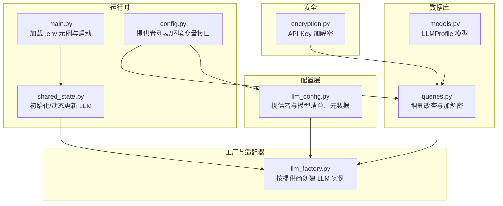
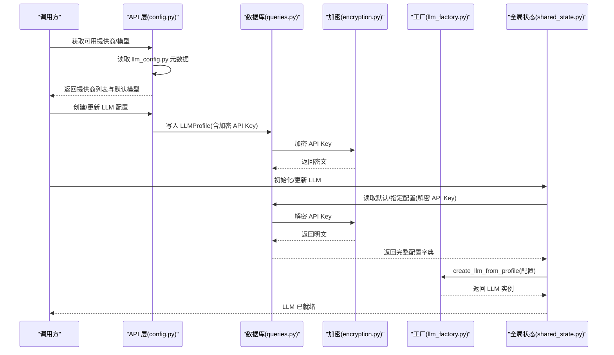
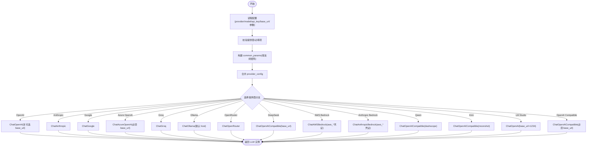
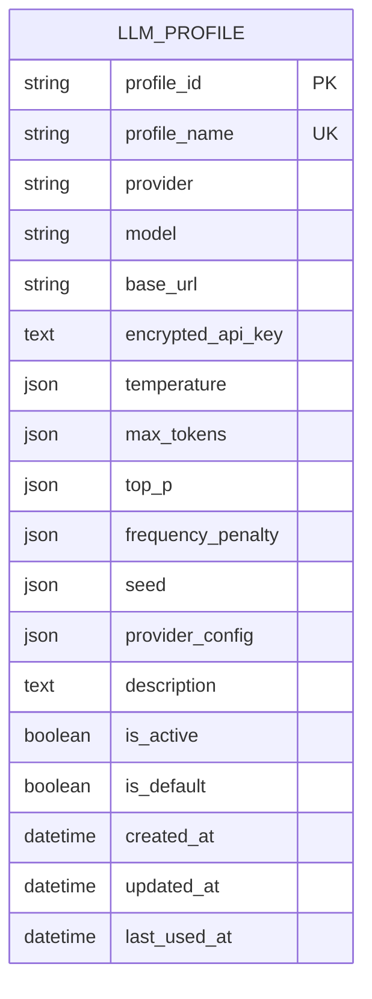
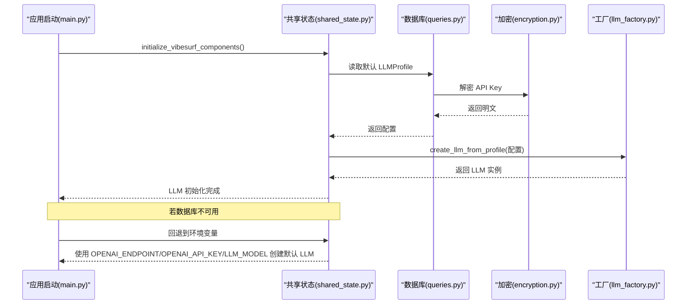
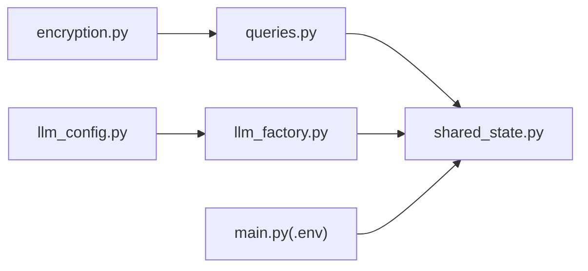

# LLM配置管理

<cite>
**本文引用的文件**
- [llm_config.py](file://vibe_surf/backend/llm_config.py)
- [llm_factory.py](file://vibe_surf/backend/utils/llm_factory.py)
- [.env.example](file://.env.example)
- [shared_state.py](file://vibe_surf/backend/shared_state.py)
- [queries.py](file://vibe_surf/backend/database/queries.py)
- [models.py](file://vibe_surf/backend/database/models.py)
- [config.py](file://vibe_surf/backend/api/config.py)
- [encryption.py](file://vibe_surf/backend/utils/encryption.py)
- [main.py](file://vibe_surf/backend/main.py)
</cite>

## 目录
1. [简介](#简介)
2. [项目结构](#项目结构)
3. [核心组件](#核心组件)
4. [架构总览](#架构总览)
5. [详细组件分析](#详细组件分析)
6. [依赖关系分析](#依赖关系分析)
7. [性能考量](#性能考量)
8. [故障排查指南](#故障排查指南)
9. [结论](#结论)
10. [附录：配置示例与最佳实践](#附录配置示例与最佳实践)

## 简介
本文件系统性文档化 VibeSurf 的 LLM 配置管理系统，覆盖以下要点：
- llm_config.py 中的配置结构与元数据定义，包括 API 密钥要求、模型列表、默认模型、是否支持工具/视觉等能力标识。
- llm_factory.py 中 LLM 实例创建流程，涵盖多提供商（OpenAI、Anthropic、Google、Azure OpenAI、Groq、Ollama、OpenRouter、DeepSeek、AWS Bedrock、LM Studio 等）的适配器实现与参数映射。
- 环境变量与配置文件的参数设置方式及优先级规则。
- 配置验证机制与错误处理策略，包括无效配置检测与默认值回退。
- 动态更新能力与运行时安全修改 LLM 设置的方法。

## 项目结构
围绕 LLM 配置管理的关键文件组织如下：
- 配置定义与查询：llm_config.py
- 工厂与适配器：llm_factory.py
- 数据库模型与查询：models.py、queries.py
- 环境变量与加载：.env.example、main.py
- 全局状态与动态更新：shared_state.py
- API 层（提供者列表、环境变量管理等）：config.py
- 加密工具（API Key 存储与解密）：encryption.py

图表来源
- [llm_config.py](file://vibe_surf/backend/llm_config.py#L1-L226)
- [llm_factory.py](file://vibe_surf/backend/utils/llm_factory.py#L1-L275)
- [models.py](file://vibe_surf/backend/database/models.py#L57-L92)
- [queries.py](file://vibe_surf/backend/database/queries.py#L92-L211)
- [shared_state.py](file://vibe_surf/backend/shared_state.py#L613-L670)
- [main.py](file://vibe_surf/backend/main.py#L10-L12)
- [config.py](file://vibe_surf/backend/api/config.py#L585-L619)
- [encryption.py](file://vibe_surf/backend/utils/encryption.py#L76-L127)

章节来源
- [llm_config.py](file://vibe_surf/backend/llm_config.py#L1-L226)
- [llm_factory.py](file://vibe_surf/backend/utils/llm_factory.py#L1-L275)
- [models.py](file://vibe_surf/backend/database/models.py#L57-L92)
- [queries.py](file://vibe_surf/backend/database/queries.py#L92-L211)
- [shared_state.py](file://vibe_surf/backend/shared_state.py#L613-L670)
- [.env.example](file://.env.example#L1-L55)
- [main.py](file://vibe_surf/backend/main.py#L10-L12)
- [config.py](file://vibe_surf/backend/api/config.py#L585-L619)
- [encryption.py](file://vibe_surf/backend/utils/encryption.py#L76-L127)

## 核心组件
- 提供者与模型清单：集中维护所有支持的提供商及其可用模型列表，便于统一管理与 API 查询。
- 提供者元数据：包含显示名、是否需要 API Key、是否需要 base_url、是否支持工具/视觉、默认模型等能力标识。
- LLM 工厂：根据配置动态创建对应提供商的 LLM 实例，自动处理参数映射与校验。
- 数据库模型与查询：以 LLMProfile 记录存储配置，API Key 使用机器 MAC 或本地用户 ID 衍生的对称密钥加密存储；查询时解密返回。
- 运行时状态：应用启动时优先从默认配置加载 LLM，若无数据库则回退到环境变量；支持通过 API 动态切换 LLM 配置。
- 环境变量：提供 .env.example 作为参考，main.py 启动时加载 .env；同时提供环境变量管理接口用于运行时更新。

章节来源
- [llm_config.py](file://vibe_surf/backend/llm_config.py#L1-L226)
- [llm_factory.py](file://vibe_surf/backend/utils/llm_factory.py#L1-L275)
- [models.py](file://vibe_surf/backend/database/models.py#L57-L92)
- [queries.py](file://vibe_surf/backend/database/queries.py#L92-L211)
- [shared_state.py](file://vibe_surf/backend/shared_state.py#L613-L670)
- [.env.example](file://.env.example#L1-L55)
- [main.py](file://vibe_surf/backend/main.py#L10-L12)

## 架构总览
下图展示了 LLM 配置管理在系统中的交互路径：配置定义、工厂创建、数据库持久化、运行时加载与动态更新、API 查询与环境变量管理。

图表来源
- [config.py](file://vibe_surf/backend/api/config.py#L585-L619)
- [queries.py](file://vibe_surf/backend/database/queries.py#L92-L211)
- [encryption.py](file://vibe_surf/backend/utils/encryption.py#L76-L127)
- [llm_factory.py](file://vibe_surf/backend/utils/llm_factory.py#L23-L216)
- [shared_state.py](file://vibe_surf/backend/shared_state.py#L613-L670)

## 详细组件分析

### 配置结构与元数据（llm_config.py）
- 提供者清单：集中列出各提供商及其模型列表，便于统一管理与 API 查询。
- 元数据字段：
  - 显示名 display_name
  - 是否需要 API Key requires_api_key
  - 是否需要 base_url requires_base_url
  - 是否支持工具 supports_tools
  - 是否支持视觉 supports_vision
  - 默认模型 default_model
  - 可选 default_base_url/base_url
- 辅助函数：
  - 获取支持的提供商列表
  - 获取指定提供商的模型列表
  - 获取指定提供商的元数据
  - 判断提供商是否受支持
  - 获取指定提供商的默认模型

章节来源
- [llm_config.py](file://vibe_surf/backend/llm_config.py#L1-L226)

### LLM 工厂与适配器（llm_factory.py）
- 输入：来自数据库记录或对象的配置（provider、model、api_key、base_url、temperature、max_tokens、top_p、frequency_penalty、seed、provider_config）。
- 参数支持矩阵：针对不同提供商定义可接受的参数集合，避免传入不支持的参数。
- 参数构建：基于支持矩阵筛选并组装 common_params，再合并 provider_config。
- 实例创建：
  - OpenAI/Azure OpenAI：支持 base_url 覆盖端点；Azure 必须提供 base_url（endpoint）。
  - Anthropic/Google：常规参数传递。
  - Groq/OpenRouter/DeepSeek/Qwen/Kimi/LM Studio：按各自 SDK 支持构造参数。
  - Ollama：默认 host 为本地端口，可通过 base_url 覆盖。
  - AWS Bedrock/Anthropic Bedrock：使用 AWS 凭证字段（secret_access_key、region），默认区域可设定。
  - OpenAI Compatible：必须提供 base_url。
- 错误处理：对不支持的提供商抛出异常；捕获异常并记录日志后上抛。

图表来源
- [llm_factory.py](file://vibe_surf/backend/utils/llm_factory.py#L23-L216)

章节来源
- [llm_factory.py](file://vibe_surf/backend/utils/llm_factory.py#L1-L275)

### 数据库模型与查询（models.py、queries.py）
- LLMProfile 模型字段：
  - 基础配置：provider、model、base_url、encrypted_api_key
  - 通用参数：temperature、max_tokens、top_p、frequency_penalty、seed（JSON 存储允许空值）
  - provider_config：提供商特定配置（JSON）
  - 元数据：description、is_active、is_default、时间戳
- 查询逻辑：
  - 创建/更新：若 api_key 非空则加密存入 encrypted_api_key；更新时同样处理。
  - 读取：get_profile_with_decrypted_key 在返回前解密 API Key。
  - 删除：按名称删除。
- 加密工具：
  - 采用基于机器 MAC 或本地用户 ID 的对称密钥派生，使用 Fernet 对 API Key 进行加解密。
  - 支持回退到本地用户 ID 作为密钥源，提升跨平台兼容性。

图表来源
- [models.py](file://vibe_surf/backend/database/models.py#L57-L92)

章节来源
- [models.py](file://vibe_surf/backend/database/models.py#L57-L92)
- [queries.py](file://vibe_surf/backend/database/queries.py#L92-L211)
- [encryption.py](file://vibe_surf/backend/utils/encryption.py#L76-L127)

### 运行时初始化与动态更新（shared_state.py、main.py）
- 启动初始化：
  - 优先尝试从数据库默认配置加载 LLM；若失败或数据库不可用，则回退到环境变量（例如 OPENAI_ENDPOINT、OPENAI_API_KEY、LLM_MODEL）。
- 动态更新：
  - 通过 API 获取指定配置并解密，调用工厂创建新实例，替换全局 LLM 并注册到成本统计服务（如存在）。
- 环境变量加载：
  - main.py 启动时加载 .env 文件，确保运行时可见。

图表来源
- [main.py](file://vibe_surf/backend/main.py#L10-L12)
- [shared_state.py](file://vibe_surf/backend/shared_state.py#L613-L670)
- [queries.py](file://vibe_surf/backend/database/queries.py#L92-L211)
- [encryption.py](file://vibe_surf/backend/utils/encryption.py#L76-L127)
- [llm_factory.py](file://vibe_surf/backend/utils/llm_factory.py#L23-L216)

章节来源
- [shared_state.py](file://vibe_surf/backend/shared_state.py#L613-L670)
- [main.py](file://vibe_surf/backend/main.py#L10-L12)

### API 层（提供者列表与环境变量管理）
- 提供者列表接口：返回每个提供商的显示名、模型列表、模型数量、能力标识、默认模型、可选默认 base_url/base_url。
- 环境变量接口：获取当前环境变量快照；允许更新部分受控键值并持久化到工作区 envs.json。

章节来源
- [config.py](file://vibe_surf/backend/api/config.py#L585-L619)
- [config.py](file://vibe_surf/backend/api/config.py#L690-L730)

## 依赖关系分析
- llm_config.py 为 llm_factory.py 的上游依赖，提供提供商清单与元数据。
- queries.py 依赖 encryption.py 完成 API Key 的加解密。
- shared_state.py 依赖 queries.py 与 llm_factory.py，负责运行时加载与动态更新。
- main.py 依赖 .env.example 并在启动时加载 .env。

图表来源
- [llm_config.py](file://vibe_surf/backend/llm_config.py#L1-L226)
- [llm_factory.py](file://vibe_surf/backend/utils/llm_factory.py#L1-L275)
- [encryption.py](file://vibe_surf/backend/utils/encryption.py#L76-L127)
- [queries.py](file://vibe_surf/backend/database/queries.py#L92-L211)
- [shared_state.py](file://vibe_surf/backend/shared_state.py#L613-L670)
- [main.py](file://vibe_surf/backend/main.py#L10-L12)

章节来源
- [llm_config.py](file://vibe_surf/backend/llm_config.py#L1-L226)
- [llm_factory.py](file://vibe_surf/backend/utils/llm_factory.py#L1-L275)
- [encryption.py](file://vibe_surf/backend/utils/encryption.py#L76-L127)
- [queries.py](file://vibe_surf/backend/database/queries.py#L92-L211)
- [shared_state.py](file://vibe_surf/backend/shared_state.py#L613-L670)
- [main.py](file://vibe_surf/backend/main.py#L10-L12)

## 性能考量
- 参数构建与映射：工厂按支持矩阵筛选参数，避免无效参数导致的 SDK 报错与重试开销。
- 数据库存取：API Key 仅在必要时解密（读取配置时），减少解密频次。
- 默认回退：启动阶段快速回退到环境变量，降低冷启动等待时间。
- 动态更新：仅在切换配置时重建实例，避免频繁实例化带来的资源浪费。

## 故障排查指南
- 提供商不受支持：检查 llm_config.py 中是否存在该提供商；工厂会抛出明确错误提示。
- 缺少必需参数：
  - Azure OpenAI：必须提供 base_url（endpoint）。
  - OpenAI Compatible：必须提供 base_url。
  - 需要 API Key 的提供商未提供 api_key。
- 参数不被支持：确认 llm_factory.py 的参数支持矩阵，避免传入不支持的参数。
- 环境变量问题：确认 .env.example 中相关键已正确设置，且 main.py 已加载 .env。
- 数据库不可用：检查数据库连接与迁移；系统会回退到环境变量。
- 动态更新失败：查看 shared_state 的日志输出，确认配置存在且可解密。

章节来源
- [llm_factory.py](file://vibe_surf/backend/utils/llm_factory.py#L108-L117)
- [llm_factory.py](file://vibe_surf/backend/utils/llm_factory.py#L204-L212)
- [llm_factory.py](file://vibe_surf/backend/utils/llm_factory.py#L222-L243)
- [shared_state.py](file://vibe_surf/backend/shared_state.py#L635-L641)
- [.env.example](file://.env.example#L1-L55)
- [main.py](file://vibe_surf/backend/main.py#L10-L12)

## 结论
VibeSurf 的 LLM 配置管理通过“集中配置 + 工厂适配 + 数据库持久化 + 运行时动态更新”的架构，实现了对多提供商 LLM 的统一接入与灵活管理。其优势在于：
- 统一的提供商与模型清单，便于扩展与维护。
- 严格的参数支持矩阵与校验，降低错误配置风险。
- API Key 的加密存储与按需解密，兼顾安全性与易用性。
- 启动回退与运行时更新机制，提升可用性与运维灵活性。

## 附录：配置示例与最佳实践

### 环境变量与配置文件
- 参考 .env.example 中的键值，如 OPENAI_ENDPOINT、OPENAI_API_KEY、AZURE_OPENAI_ENDPOINT、OLLAMA_ENDPOINT、DASHSCOPE_ENDPOINT 等。
- main.py 在启动时加载 .env，确保运行时可见。

章节来源
- [.env.example](file://.env.example#L1-L55)
- [main.py](file://vibe_surf/backend/main.py#L10-L12)

### 配置优先级规则
- 运行时优先使用数据库中的默认 LLMProfile；若数据库不可用或无默认配置，则回退到环境变量。
- 当通过 API 更新 LLM 配置时，系统会立即创建新实例并替换全局 LLM。

章节来源
- [shared_state.py](file://vibe_surf/backend/shared_state.py#L613-L670)
- [shared_state.py](file://vibe_surf/backend/shared_state.py#L635-L641)

### 不同场景的配置建议
- 开发环境
  - 使用本地推理服务（如 Ollama）或开源兼容端点，base_url 指向本地地址。
  - 温度与采样参数可适度提高以探索多样性。
- 生产环境
  - 使用官方或托管端点，确保 API Key 安全存储（数据库加密）。
  - 限制 max_tokens 与频率惩罚等参数，控制成本与稳定性。
- 测试环境
  - 使用小模型或兼容端点，缩短响应时间；必要时关闭工具/视觉能力以简化测试。

### 配置验证与默认值回退
- 工厂提供 validate_llm_configuration，校验提供商、模型、API Key、base_url 等。
- llm_config 提供默认模型与能力标识，便于在缺少显式配置时回退到合理默认值。

章节来源
- [llm_factory.py](file://vibe_surf/backend/utils/llm_factory.py#L222-L243)
- [llm_config.py](file://vibe_surf/backend/llm_config.py#L222-L226)

### 动态更新与安全修改
- 通过 API 更新 LLM 配置时，数据库会加密保存 API Key；读取时解密返回。
- 动态更新 LLM 时，系统会创建新实例并替换全局 LLM，同时保持成本统计服务的注册。

章节来源
- [queries.py](file://vibe_surf/backend/database/queries.py#L174-L211)
- [encryption.py](file://vibe_surf/backend/utils/encryption.py#L76-L127)
- [shared_state.py](file://vibe_surf/backend/shared_state.py#L644-L678)