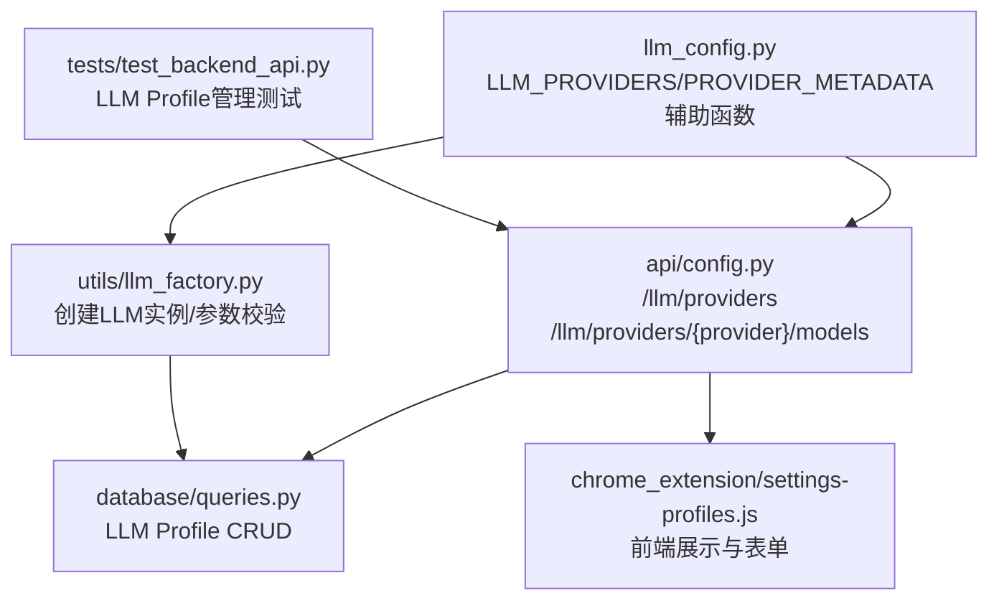
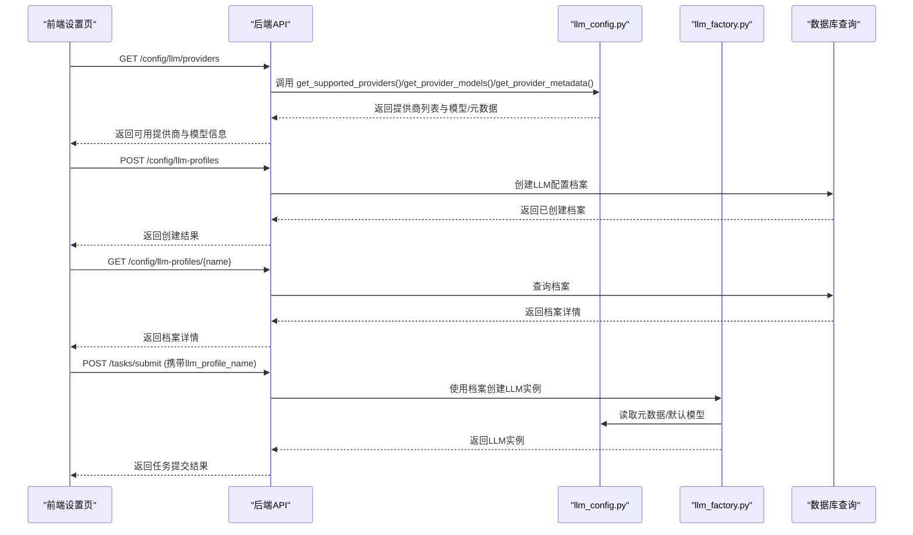
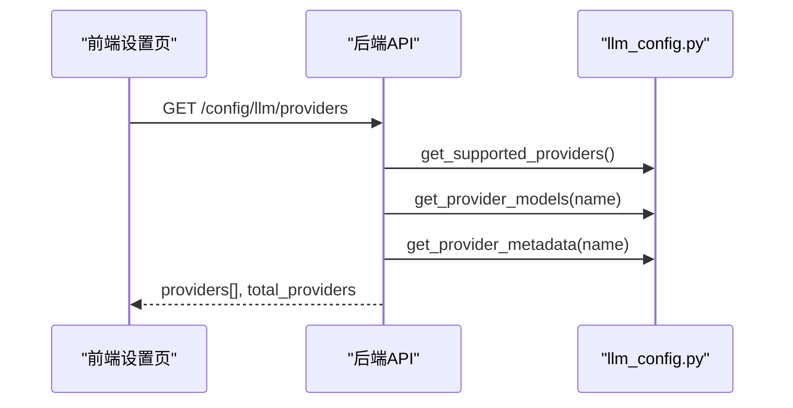
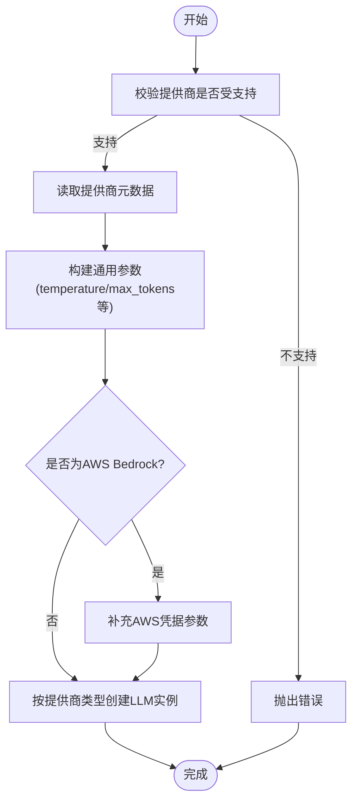
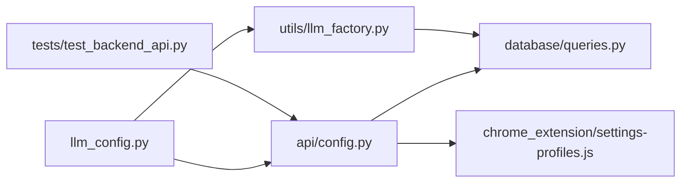

# LLM配置结构

<cite>
**本文引用的文件**
- [vibe_surf/backend/llm_config.py](file://vibe_surf/backend/llm_config.py)
- [vibe_surf/backend/api/config.py](file://vibe_surf/backend/api/config.py)
- [vibe_surf/backend/utils/llm_factory.py](file://vibe_surf/backend/utils/llm_factory.py)
- [vibe_surf/backend/database/queries.py](file://vibe_surf/backend/database/queries.py)
- [tests/test_backend_api.py](file://tests/test_backend_api.py)
- [vibe_surf/chrome_extension/scripts/settings-profiles.js](file://vibe_surf/chrome_extension/scripts/settings-profiles.js)
</cite>

## 目录
1. [简介](#简介)
2. [项目结构](#项目结构)
3. [核心组件](#核心组件)
4. [架构总览](#架构总览)
5. [详细组件分析](#详细组件分析)
6. [依赖关系分析](#依赖关系分析)
7. [性能与可扩展性考量](#性能与可扩展性考量)
8. [故障排查指南](#故障排查指南)
9. [结论](#结论)
10. [附录：新增提供商指南](#附录新增提供商指南)

## 简介
本文件系统化梳理VibeSurf后端的LLM配置结构，重点围绕以下目标展开：
- 深入解析llm_config.py中的LLM_PROVIDERS与PROVIDER_METADATA，逐项说明各提供商支持的模型、显示名、API密钥要求、基础URL支持、工具调用支持、视觉能力支持及默认模型等元数据。
- 解释get_supported_providers()、get_provider_models()、get_provider_metadata()、is_provider_supported()、get_default_model()等辅助函数的作用与实现。
- 展示配置结构在后端API与前端界面中的使用方式，包括查询支持的提供商与模型、创建/管理LLM配置档案等。
- 总结设计原则（可扩展性、维护性），并提供新增提供商的完整步骤与注意事项。

## 项目结构
LLM配置相关代码主要分布在以下模块：
- 配置定义：vibe_surf/backend/llm_config.py
- 后端API：vibe_surf/backend/api/config.py
- 工厂与参数校验：vibe_surf/backend/utils/llm_factory.py
- 数据库层（LLM配置档案）：vibe_surf/backend/database/queries.py
- 前端设置页：vibe_surf/chrome_extension/scripts/settings-profiles.js
- 测试用例：tests/test_backend_api.py

图表来源
- [vibe_surf/backend/llm_config.py](file://vibe_surf/backend/llm_config.py#L1-L226)
- [vibe_surf/backend/api/config.py](file://vibe_surf/backend/api/config.py#L585-L642)
- [vibe_surf/backend/utils/llm_factory.py](file://vibe_surf/backend/utils/llm_factory.py#L1-L275)
- [vibe_surf/backend/database/queries.py](file://vibe_surf/backend/database/queries.py#L46-L142)
- [vibe_surf/chrome_extension/scripts/settings-profiles.js](file://vibe_surf/chrome_extension/scripts/settings-profiles.js#L200-L958)
- [tests/test_backend_api.py](file://tests/test_backend_api.py#L115-L205)

章节来源
- [vibe_surf/backend/llm_config.py](file://vibe_surf/backend/llm_config.py#L1-L226)
- [vibe_surf/backend/api/config.py](file://vibe_surf/backend/api/config.py#L585-L642)
- [vibe_surf/backend/utils/llm_factory.py](file://vibe_surf/backend/utils/llm_factory.py#L1-L275)
- [vibe_surf/backend/database/queries.py](file://vibe_surf/backend/database/queries.py#L46-L142)
- [vibe_surf/chrome_extension/scripts/settings-profiles.js](file://vibe_surf/chrome_extension/scripts/settings-profiles.js#L200-L958)
- [tests/test_backend_api.py](file://tests/test_backend_api.py#L115-L205)

## 核心组件
- LLM_PROVIDERS：集中式提供商到模型列表的映射，用于声明支持的模型集合。
- PROVIDER_METADATA：集中式提供商元数据，描述显示名、API密钥要求、基础URL支持、工具调用支持、视觉能力支持、默认模型以及特殊默认基础URL或固定基础URL。
- 辅助函数：
  - get_supported_providers()：返回所有支持的提供商名称列表。
  - get_provider_models(provider_name)：返回指定提供商支持的模型列表。
  - get_provider_metadata(provider_name)：返回指定提供商的元数据字典。
  - is_provider_supported(provider_name)：判断提供商是否受支持。
  - get_default_model(provider_name)：根据元数据返回默认模型名。

章节来源
- [vibe_surf/backend/llm_config.py](file://vibe_surf/backend/llm_config.py#L1-L226)

## 架构总览
LLM配置结构通过“配置定义 + API暴露 + 工厂创建 + 数据持久化 + 前端展示”的链路协同工作：
- 配置定义：llm_config.py提供统一的提供商与模型清单、元数据与查询函数。
- API暴露：后端API将支持的提供商与模型以REST接口形式对外提供，便于前端与外部系统消费。
- 工厂创建：llm_factory.py基于LLM配置档案与元数据，动态构建对应LLM客户端实例，并进行参数校验与兼容处理。
- 数据持久化：数据库层负责LLM配置档案的增删改查，包含加密存储API密钥、温度、最大token等参数。
- 前端展示：Chrome扩展设置页从后端拉取提供商列表与模型，渲染表单供用户选择与保存。

图表来源
- [vibe_surf/backend/api/config.py](file://vibe_surf/backend/api/config.py#L585-L642)
- [vibe_surf/backend/llm_config.py](file://vibe_surf/backend/llm_config.py#L1-L226)
- [vibe_surf/backend/utils/llm_factory.py](file://vibe_surf/backend/utils/llm_factory.py#L1-L275)
- [vibe_surf/backend/database/queries.py](file://vibe_surf/backend/database/queries.py#L46-L142)
- [vibe_surf/chrome_extension/scripts/settings-profiles.js](file://vibe_surf/chrome_extension/scripts/settings-profiles.js#L200-L958)

## 详细组件分析

### LLM_PROVIDERS与PROVIDER_METADATA详解
- LLM_PROVIDERS：以字符串为键（提供商标识），值为该提供商支持的模型名称列表。例如：
  - openai：包含多个gpt系列模型。
  - anthropic：包含Claude系列模型。
  - google：包含Gemini系列模型。
  - azure_openai：包含部分Azure托管的GPT模型。
  - groq：包含多厂商混训模型。
  - ollama：本地推理模型。
  - openrouter：聚合多家模型的路由服务。
  - deepseek：深思系列模型。
  - aws_bedrock：通过AWS Bedrock访问Anthropic等模型。
  - anthropic_bedrock：通过Bedrock访问Anthropic模型。
  - openai_compatible：兼容OpenAI接口的服务。
  - qwen：通义千问系列模型。
  - kimi：月之暗面Kimi系列模型。
  - lm_studio：本地LM Studio服务。
- PROVIDER_METADATA：对每个提供商给出统一的元数据描述，关键字段包括：
  - display_name：用于UI展示的友好名称。
  - requires_api_key：是否必须提供API密钥。
  - requires_base_url：是否必须提供基础URL（严格要求）。
  - supports_base_url：是否支持传入基础URL（宽松支持）。
  - supports_tools：是否支持工具调用。
  - supports_vision：是否支持视觉能力。
  - default_model：默认模型名。
  - default_base_url/base_url：某些提供商的默认或固定基础URL。

章节来源
- [vibe_surf/backend/llm_config.py](file://vibe_surf/backend/llm_config.py#L1-L226)

### 辅助函数与用途
- get_supported_providers()：返回LLM_PROVIDERS的键列表，用于列出所有支持的提供商。
- get_provider_models(provider_name)：按提供商名返回其模型列表；若不存在则返回空列表。
- get_provider_metadata(provider_name)：按提供商名返回其元数据字典；若不存在则返回空字典。
- is_provider_supported(provider_name)：判断提供商是否存在于LLM_PROVIDERS中。
- get_default_model(provider_name)：从元数据中读取default_model，作为默认推荐模型。

章节来源
- [vibe_surf/backend/llm_config.py](file://vibe_surf/backend/llm_config.py#L202-L226)

### API集成与使用示例
- 列出所有支持的提供商与模型：
  - 后端路由：GET /config/llm/providers
  - 实现逻辑：遍历get_supported_providers()，结合get_provider_models()与get_provider_metadata()组装返回体，包含显示名、模型列表、模型数量、API密钥与基础URL要求、工具与视觉支持、默认模型，以及可能存在的默认基础URL。
- 获取特定提供商的模型与元数据：
  - 后端路由：GET /config/llm/providers/{provider_name}/models
  - 实现逻辑：先用is_provider_supported()校验，再返回该提供商的模型列表、显示名、默认模型与完整元数据。
- 前端展示：
  - Chrome扩展设置页会调用上述API，动态生成提供商下拉框与模型列表，供用户选择并保存为LLM配置档案。

图表来源
- [vibe_surf/backend/api/config.py](file://vibe_surf/backend/api/config.py#L585-L642)
- [vibe_surf/backend/llm_config.py](file://vibe_surf/backend/llm_config.py#L1-L226)
- [vibe_surf/chrome_extension/scripts/settings-profiles.js](file://vibe_surf/chrome_extension/scripts/settings-profiles.js#L200-L958)

章节来源
- [vibe_surf/backend/api/config.py](file://vibe_surf/backend/api/config.py#L585-L642)
- [vibe_surf/chrome_extension/scripts/settings-profiles.js](file://vibe_surf/chrome_extension/scripts/settings-profiles.js#L200-L958)

### 工厂与参数校验
- create_llm_from_profile：根据LLM配置档案创建具体LLM客户端实例。流程要点：
  - 校验提供商是否受支持。
  - 基于provider_param_support为不同提供商筛选支持的参数（如temperature、max_tokens等）。
  - 根据提供商类型拼装参数，必要时注入base_url或AWS凭据。
  - 返回对应的LLM客户端实例。
- validate_llm_configuration：对输入参数进行校验，确保：
  - 提供商存在且受支持。
  - 若元数据要求API密钥而未提供，则报错。
  - 若要求基础URL而未提供，则报错。
- get_llm_creation_parameters：根据提供商元数据推导创建所需参数（必填/可选），并处理AWS Bedrock等特殊场景。

图表来源
- [vibe_surf/backend/utils/llm_factory.py](file://vibe_surf/backend/utils/llm_factory.py#L1-L275)
- [vibe_surf/backend/llm_config.py](file://vibe_surf/backend/llm_config.py#L1-L226)

章节来源
- [vibe_surf/backend/utils/llm_factory.py](file://vibe_surf/backend/utils/llm_factory.py#L1-L275)

### 数据库与LLM配置档案
- 数据库层负责LLM配置档案的创建、查询与更新，包含字段如provider、model、base_url、temperature、max_tokens、top_p、frequency_penalty、seed、provider_config、description、is_default等。
- API层提供LLM配置档案的CRUD接口，前端通过这些接口进行管理。

章节来源
- [vibe_surf/backend/database/queries.py](file://vibe_surf/backend/database/queries.py#L46-L142)
- [vibe_surf/backend/api/config.py](file://vibe_surf/backend/api/config.py#L77-L110)

### 测试与使用示例
- 测试覆盖了LLM配置档案的CRUD流程，包括：
  - 列出可用提供商。
  - 创建LLM配置档案（含provider、model、api_key、base_url、temperature等）。
  - 列出、获取、更新、删除LLM配置档案。
  - 设置默认配置档案并进行后续任务提交验证。

章节来源
- [tests/test_backend_api.py](file://tests/test_backend_api.py#L115-L205)

## 依赖关系分析
- llm_config.py被API与工厂共同依赖，形成“配置中心”角色。
- API层依赖llm_config.py提供的查询函数，用于对外暴露提供商与模型信息。
- 工厂层依赖llm_config.py的元数据，用于参数校验与实例创建。
- 数据库层与API层协作，支撑LLM配置档案的持久化与检索。
- 前端设置页依赖API返回的提供商与模型信息，驱动表单渲染与交互。

图表来源
- [vibe_surf/backend/llm_config.py](file://vibe_surf/backend/llm_config.py#L1-L226)
- [vibe_surf/backend/api/config.py](file://vibe_surf/backend/api/config.py#L585-L642)
- [vibe_surf/backend/utils/llm_factory.py](file://vibe_surf/backend/utils/llm_factory.py#L1-L275)
- [vibe_surf/backend/database/queries.py](file://vibe_surf/backend/database/queries.py#L46-L142)
- [vibe_surf/chrome_extension/scripts/settings-profiles.js](file://vibe_surf/chrome_extension/scripts/settings-profiles.js#L200-L958)
- [tests/test_backend_api.py](file://tests/test_backend_api.py#L115-L205)

## 性能与可扩展性考量
- 性能特性
  - LLM_PROVIDERS与PROVIDER_METADATA均为内存常驻字典，查询复杂度为O(1)，适合高频调用。
  - API层对提供商列表与模型列表的组装逻辑简单，开销极低。
- 可扩展性
  - 新增提供商只需在LLM_PROVIDERS中追加键值对，在PROVIDER_METADATA中追加元数据，即可被API与工厂自动识别。
  - 元数据字段标准化，便于未来扩展更多能力（如多模态、流式输出等）。
- 维护性
  - 将“配置”与“业务逻辑”解耦，llm_config.py仅承担声明职责，其他模块通过函数接口访问，降低耦合。
  - 工厂层集中处理参数校验与实例创建，避免重复逻辑散落各处。

[本节为一般性指导，无需列出具体文件来源]

## 故障排查指南
- 常见问题
  - 404 Provider not found：当请求特定提供商模型时，若is_provider_supported()返回False，API会返回404。
  - 缺少API密钥或基础URL：validate_llm_configuration会在元数据要求相应凭据但未提供时抛错。
  - AWS Bedrock参数缺失：get_llm_creation_parameters对aws_bedrock/anthropic_bedrock要求额外凭据，需在provider_config中提供。
- 排查步骤
  - 确认提供商名称正确且存在于LLM_PROVIDERS。
  - 检查PROVIDER_METADATA中requires_api_key与requires_base_url的标记是否与实际环境一致。
  - 对于AWS Bedrock，确认provider_config包含必需的AWS凭据字段。
  - 通过GET /config/llm/providers与GET /config/llm/providers/{provider_name}/models核对提供商与模型列表。

章节来源
- [vibe_surf/backend/api/config.py](file://vibe_surf/backend/api/config.py#L585-L642)
- [vibe_surf/backend/utils/llm_factory.py](file://vibe_surf/backend/utils/llm_factory.py#L222-L275)
- [vibe_surf/backend/llm_config.py](file://vibe_surf/backend/llm_config.py#L1-L226)

## 结论
VibeSurf的LLM配置结构以集中式配置为核心，辅以标准化的元数据与简洁的查询函数，实现了对多提供商、多模型的统一管理。API层将其暴露给前端与外部系统，工厂层据此安全地创建LLM实例并进行参数校验，数据库层保障配置档案的持久化与默认策略。整体设计具备良好的可扩展性与维护性，便于持续引入新提供商与新能力。

[本节为总结性内容，无需列出具体文件来源]

## 附录：新增提供商指南
- 步骤一：在LLM_PROVIDERS中添加新提供商与模型列表
  - 键为提供商标识（小写英文），值为该提供商支持的模型名称列表。
- 步骤二：在PROVIDER_METADATA中添加对应元数据
  - 必填字段：display_name、requires_api_key、supports_base_url、supports_tools、supports_vision、default_model。
  - 可选字段：requires_base_url（严格要求）、default_base_url/base_url（默认或固定基础URL）。
- 步骤三：在工厂层适配实例创建逻辑
  - 在create_llm_from_profile中增加elif分支，按提供商类型拼装参数（如base_url、AWS凭据等）。
  - 在get_llm_creation_parameters中完善参数校验规则（如requires_base_url、特殊凭据）。
- 步骤四：在API层保持一致性
  - 由于API直接复用llm_config.py的查询函数，新增提供商无需修改API逻辑即可被暴露。
- 步骤五：前端适配
  - 前端设置页会自动从后端拉取新的提供商与模型，无需额外改动。
- 注意事项
  - 显示名与默认模型应与实际服务保持一致。
  - 若涉及AWS Bedrock等特殊场景，务必在provider_config中提供必要凭据。
  - 如需工具调用或视觉能力，请在元数据中标注supports_tools与supports_vision。

章节来源
- [vibe_surf/backend/llm_config.py](file://vibe_surf/backend/llm_config.py#L1-L226)
- [vibe_surf/backend/utils/llm_factory.py](file://vibe_surf/backend/utils/llm_factory.py#L1-L275)
- [vibe_surf/backend/api/config.py](file://vibe_surf/backend/api/config.py#L585-L642)
- [vibe_surf/chrome_extension/scripts/settings-profiles.js](file://vibe_surf/chrome_extension/scripts/settings-profiles.js#L200-L958)