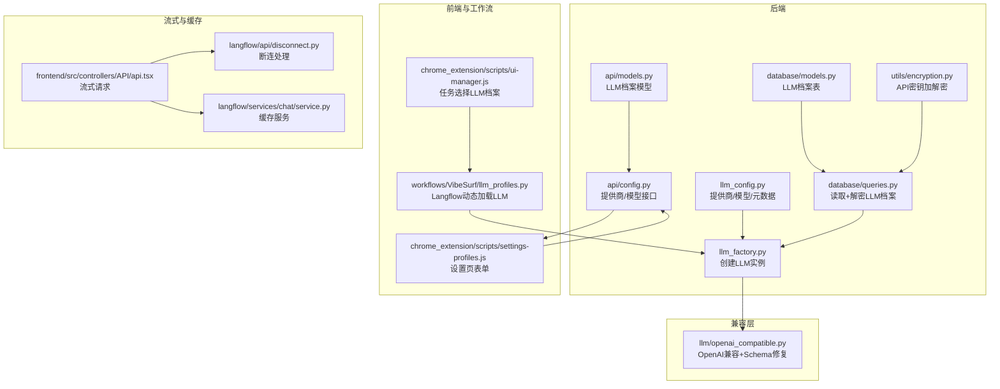
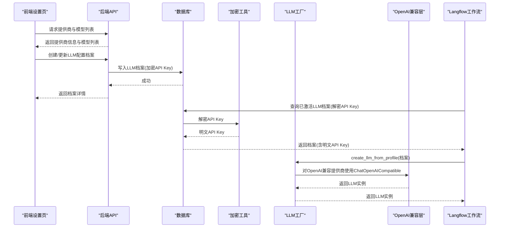
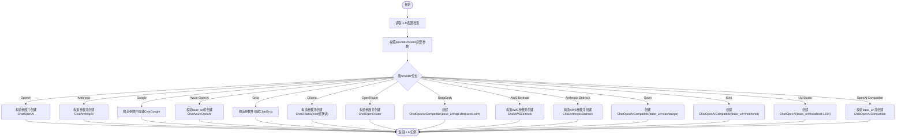
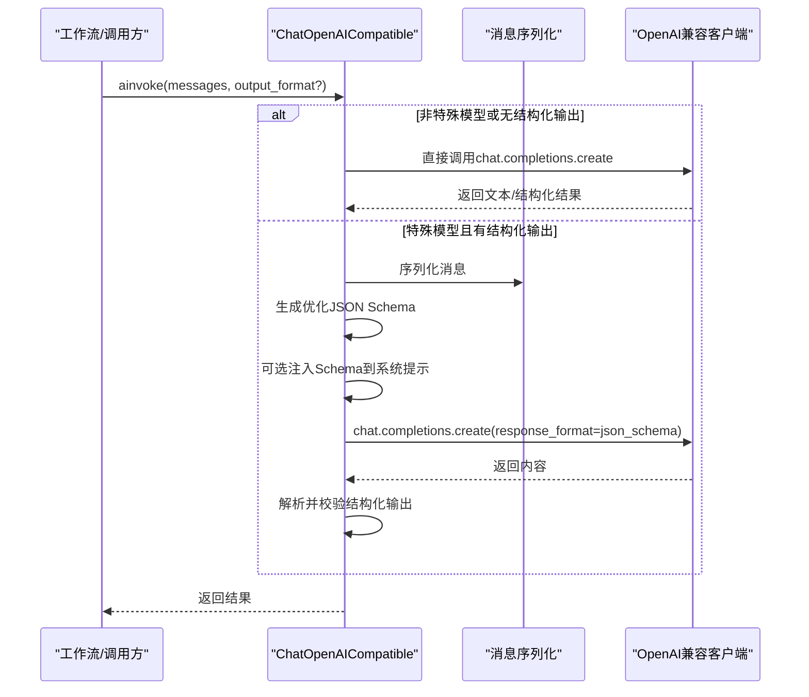
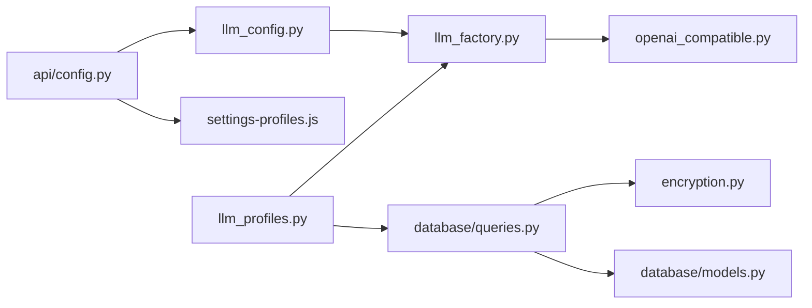

# LLM集成

<cite>
**本文引用的文件**
- [llm_config.py](file://vibe_surf/backend/llm_config.py)
- [llm_factory.py](file://vibe_surf/backend/utils/llm_factory.py)
- [openai_compatible.py](file://vibe_surf/llm/openai_compatible.py)
- [config.py](file://vibe_surf/backend/api/config.py)
- [models.py](file://vibe_surf/backend/api/models.py)
- [queries.py](file://vibe_surf/backend/database/queries.py)
- [models.py](file://vibe_surf/backend/database/models.py)
- [encryption.py](file://vibe_surf/backend/utils/encryption.py)
- [disconnect.py](file://vibe_surf/langflow/api/disconnect.py)
- [service.py](file://vibe_surf/langflow/services/chat/service.py)
- [api.tsx](file://vibe_surf/frontend/src/controllers/API/api.tsx)
- [llm_profiles.py](file://vibe_surf/workflows/VibeSurf/llm_profiles.py)
- [settings-profiles.js](file://vibe_surf/chrome_extension/scripts/settings-profiles.js)
- [ui-manager.js](file://vibe_surf/chrome_extension/scripts/ui-manager.js)
- [test_backend_api.py](file://tests/test_backend_api.py)
</cite>

## 目录
1. [简介](#简介)
2. [项目结构](#项目结构)
3. [核心组件](#核心组件)
4. [架构总览](#架构总览)
5. [详细组件分析](#详细组件分析)
6. [依赖关系分析](#依赖关系分析)
7. [性能考量](#性能考量)
8. [故障排查指南](#故障排查指南)
9. [结论](#结论)
10. [附录](#附录)

## 简介
本文件系统性文档化 VibeSurf 的 LLM 集成能力，覆盖以下方面：
- llm_config.py 中的配置结构与参数语义
- llm_factory.py 如何根据配置创建不同提供商的 LLM 实例
- openai_compatible.py 如何实现与多种 LLM 提供商的兼容（含本地 Ollama 与云服务）
- 配置示例：API 密钥、模型选择、生成参数
- 多提供商支持机制：负载均衡、故障转移、性能监控（概念性说明）
- 性能优化建议：流式响应、缓存策略、连接池管理
- 安全指南：API 密钥保护、输入校验、输出过滤
- 扩展性：如何新增 LLM 提供商

## 项目结构
围绕 LLM 的关键模块分布如下：
- 后端配置与工厂
  - vibe_surf/backend/llm_config.py：集中定义支持的提供商、模型清单与元数据
  - vibe_surf/backend/utils/llm_factory.py：从“LLM 配置档案”创建具体 LLM 实例
  - vibe_surf/backend/api/config.py：提供 LLM 提供商列表与模型查询接口
  - vibe_surf/backend/api/models.py：LLM 配置档案的请求/响应模型
  - vibe_surf/backend/database/queries.py：读取并解密 LLM 配置档案
  - vibe_surf/backend/database/models.py：LLM 配置档案的数据库模型
  - vibe_surf/backend/utils/encryption.py：API 密钥加解密工具
- 兼容层
  - vibe_surf/llm/openai_compatible.py：统一 OpenAI 兼容接口，自动修复部分模型的 JSON Schema
- 前端与工作流
  - vibe_surf/workflows/VibeSurf/llm_profiles.py：Langflow 工作流中动态加载 LLM 配置档案并创建 LLM
  - vibe_surf/chrome_extension/scripts/settings-profiles.js：前端设置页表单，拉取可用提供商与模型
  - vibe_surf/chrome_extension/scripts/ui-manager.js：任务执行时选择/回退 LLM 配置档案
- 流式与缓存
  - vibe_surf/langflow/api/disconnect.py：断开连接处理，配合流式响应
  - vibe_surf/langflow/services/chat/service.py：缓存服务封装
  - vibe_surf/frontend/src/controllers/API/api.tsx：前端流式请求控制

图表来源
- [llm_config.py](file://vibe_surf/backend/llm_config.py#L1-L226)
- [llm_factory.py](file://vibe_surf/backend/utils/llm_factory.py#L1-L275)
- [openai_compatible.py](file://vibe_surf/llm/openai_compatible.py#L1-L373)
- [config.py](file://vibe_surf/backend/api/config.py#L585-L642)
- [models.py](file://vibe_surf/backend/api/models.py#L30-L68)
- [queries.py](file://vibe_surf/backend/database/queries.py#L117-L142)
- [models.py](file://vibe_surf/backend/database/models.py#L57-L92)
- [encryption.py](file://vibe_surf/backend/utils/encryption.py#L65-L127)
- [llm_profiles.py](file://vibe_surf/workflows/VibeSurf/llm_profiles.py#L1-L104)
- [settings-profiles.js](file://vibe_surf/chrome_extension/scripts/settings-profiles.js#L200-L252)
- [ui-manager.js](file://vibe_surf/chrome_extension/scripts/ui-manager.js#L2395-L2424)
- [disconnect.py](file://vibe_surf/langflow/api/disconnect.py#L1-L31)
- [service.py](file://vibe_surf/langflow/services/chat/service.py#L29-L59)
- [api.tsx](file://vibe_surf/frontend/src/controllers/API/api.tsx#L289-L313)

章节来源
- [llm_config.py](file://vibe_surf/backend/llm_config.py#L1-L226)
- [llm_factory.py](file://vibe_surf/backend/utils/llm_factory.py#L1-L275)
- [openai_compatible.py](file://vibe_surf/llm/openai_compatible.py#L1-L373)
- [config.py](file://vibe_surf/backend/api/config.py#L585-L642)
- [models.py](file://vibe_surf/backend/api/models.py#L30-L68)
- [queries.py](file://vibe_surf/backend/database/queries.py#L117-L142)
- [models.py](file://vibe_surf/backend/database/models.py#L57-L92)
- [encryption.py](file://vibe_surf/backend/utils/encryption.py#L65-L127)
- [llm_profiles.py](file://vibe_surf/workflows/VibeSurf/llm_profiles.py#L1-L104)
- [settings-profiles.js](file://vibe_surf/chrome_extension/scripts/settings-profiles.js#L200-L252)
- [ui-manager.js](file://vibe_surf/chrome_extension/scripts/ui-manager.js#L2395-L2424)
- [disconnect.py](file://vibe_surf/langflow/api/disconnect.py#L1-L31)
- [service.py](file://vibe_surf/langflow/services/chat/service.py#L29-L59)
- [api.tsx](file://vibe_surf/frontend/src/controllers/API/api.tsx#L289-L313)

## 核心组件
- LLM 提供商与模型清单
  - llm_config.py 维护 PROVIDER_METADATA 与 LLM_PROVIDERS，提供“提供商名称 -> 模型列表”“提供商元数据（是否需要 API Key、默认模型、是否支持 base_url 等）”
  - 提供查询函数：get_supported_providers、get_provider_models、get_provider_metadata、is_provider_supported、get_default_model
- LLM 工厂
  - llm_factory.py 将“LLM 配置档案”映射为具体 LLM 实例，按提供商分支构造参数，支持温度、最大令牌数、top_p、频率惩罚、种子等参数；对 Azure OpenAI、Ollama、AWS Bedrock、OpenAI Compatible 等进行差异化处理
- OpenAI 兼容层
  - openai_compatible.py 在调用 OpenAI 兼容接口时，针对 Gemini/Kimi/Qwen/DeepSeek 等模型自动修复 JSON Schema，并在需要时将 Schema 注入系统提示，提升结构化输出成功率
- API 与前端
  - 后端提供 /config/llm/providers 与 /config/llm/providers/{provider_name}/models 接口，返回提供商信息与模型列表
  - 前端设置页通过 API 获取提供商与模型，动态渲染表单
- 数据库与安全
  - LLM 配置档案存储在数据库中，API Key 使用对称加密（Fernet）保存，读取时解密
- 工作流集成
  - Langflow 工作流通过 LLMProfilesComponent 动态加载已激活的 LLM 配置档案并创建 LLM 实例

章节来源
- [llm_config.py](file://vibe_surf/backend/llm_config.py#L1-L226)
- [llm_factory.py](file://vibe_surf/backend/utils/llm_factory.py#L1-L275)
- [openai_compatible.py](file://vibe_surf/llm/openai_compatible.py#L1-L373)
- [config.py](file://vibe_surf/backend/api/config.py#L585-L642)
- [models.py](file://vibe_surf/backend/api/models.py#L30-L68)
- [queries.py](file://vibe_surf/backend/database/queries.py#L117-L142)
- [models.py](file://vibe_surf/backend/database/models.py#L57-L92)
- [encryption.py](file://vibe_surf/backend/utils/encryption.py#L65-L127)
- [llm_profiles.py](file://vibe_surf/workflows/VibeSurf/llm_profiles.py#L1-L104)
- [settings-profiles.js](file://vibe_surf/chrome_extension/scripts/settings-profiles.js#L200-L252)

## 架构总览
下图展示了从“LLM 配置档案”到“具体 LLM 实例”的创建链路，以及与兼容层、API、前端与工作流的交互。

图表来源
- [config.py](file://vibe_surf/backend/api/config.py#L585-L642)
- [models.py](file://vibe_surf/backend/api/models.py#L30-L68)
- [queries.py](file://vibe_surf/backend/database/queries.py#L117-L142)
- [encryption.py](file://vibe_surf/backend/utils/encryption.py#L65-L127)
- [llm_factory.py](file://vibe_surf/backend/utils/llm_factory.py#L1-L275)
- [openai_compatible.py](file://vibe_surf/llm/openai_compatible.py#L1-L373)
- [llm_profiles.py](file://vibe_surf/workflows/VibeSurf/llm_profiles.py#L1-L104)

## 详细组件分析

### llm_config.py：配置结构与参数含义
- 结构要点
  - PROVIDER_METADATA：每个提供商的显示名、是否需要 API Key、是否需要 base_url、是否支持工具/视觉、默认模型、可选默认 base_url/base_url
  - LLM_PROVIDERS：提供商到模型列表的映射
  - 查询函数：支持的提供商、某提供商的模型、某提供商元数据、是否支持某提供商、默认模型
- 参数语义
  - requires_api_key：该提供商是否必须提供 API Key
  - requires_base_url：该提供商是否必须提供 base_url
  - supports_base_url：该提供商可选提供 base_url
  - supports_tools / supports_vision：是否支持工具调用与视觉
  - default_model / default_base_url / base_url：默认模型与默认 base_url
- 用途
  - API 层用于对外暴露提供商信息与模型列表
  - 工厂层用于参数校验与参数支持判定

章节来源
- [llm_config.py](file://vibe_surf/backend/llm_config.py#L1-L226)

### llm_factory.py：创建不同类型的 LLM 实例
- 输入
  - LLM 配置档案对象/字典，包含 provider、model、api_key、base_url、temperature、max_tokens、top_p、frequency_penalty、seed、provider_config 等
- 参数支持矩阵
  - 不同提供商支持的参数不同，例如 Azure OpenAI、OpenRouter 不支持 max_tokens，Ollama 不支持温度等
- 分支逻辑
  - OpenAI、Anthropic、Google、Groq：直接传入 model 与 api_key，可选 base_url
  - Azure OpenAI：要求 base_url（endpoint），固定 api_version
  - Ollama：优先使用 base_url 作为 host，否则使用默认本地地址
  - OpenRouter：传入 model 与 api_key
  - DeepSeek：使用 ChatOpenAICompatible 并指定 base_url
  - AWS Bedrock / Anthropic Bedrock：使用 AWS 认证参数（access key、secret key、region）
  - Qwen、Kimi：使用 ChatOpenAICompatible 并指定对应 base_url
  - LM Studio：使用 OpenAI 兼容接口，base_url 固定
  - OpenAI Compatible：要求 base_url，使用 ChatOpenAICompatible
- 校验与参数提取
  - validate_llm_configuration：校验 provider/model/必要参数
  - get_llm_creation_parameters：返回所需/可选参数与元数据

图表来源
- [llm_factory.py](file://vibe_surf/backend/utils/llm_factory.py#L1-L275)

章节来源
- [llm_factory.py](file://vibe_surf/backend/utils/llm_factory.py#L1-L275)

### openai_compatible.py：与多提供商的兼容性
- 设计目标
  - 统一 OpenAI 兼容接口，自动修复特定模型的 JSON Schema，提升结构化输出稳定性
- 支持的模型类型与修复策略
  - Gemini：移除不被支持的属性（如 additionalProperties、title、default），解析 $ref，必要时填充空对象属性
  - Kimi/Moonshot：移除不被支持的关键字（如 min_items/minItems/default 当存在 anyOf 时）
  - Qwen/DeepSeek：在需要时将 JSON Schema 注入系统提示，确保模型按 Schema 生成
- 调用流程
  - 若为特殊模型且请求结构化输出，则先生成优化后的 JSON Schema，再调用底层 OpenAI 兼容客户端
  - 对于错误处理，统一包装为 ModelProviderError，便于上层捕获与降级

图表来源
- [openai_compatible.py](file://vibe_surf/llm/openai_compatible.py#L1-L373)

章节来源
- [openai_compatible.py](file://vibe_surf/llm/openai_compatible.py#L1-L373)

### API 与前端：提供商与模型管理
- 后端接口
  - GET /config/llm/providers：返回所有提供商的名称、显示名、模型列表、是否需要 API Key/base_url、默认模型、可选默认 base_url/base_url
  - GET /config/llm/providers/{provider_name}/models：返回指定提供商的模型与元数据
- 前端设置页
  - 通过 API 获取提供商列表与模型，动态渲染表单，支持选择 provider、model、API Key、base_url、温度、最大令牌数等
- 工作流集成
  - Langflow 组件 LLMProfilesComponent 动态加载已激活的 LLM 配置档案，若未选择则回退到默认档案

章节来源
- [config.py](file://vibe_surf/backend/api/config.py#L585-L642)
- [settings-profiles.js](file://vibe_surf/chrome_extension/scripts/settings-profiles.js#L200-L252)
- [llm_profiles.py](file://vibe_surf/workflows/VibeSurf/llm_profiles.py#L1-L104)
- [ui-manager.js](file://vibe_surf/chrome_extension/scripts/ui-manager.js#L2395-L2424)

### 数据库与安全：API Key 加密与解密
- 数据模型
  - LLMProfile 表包含 provider、model、base_url、encrypted_api_key、温度、最大令牌数、top_p、频率惩罚、seed、provider_config、描述、是否激活/默认、时间戳等
- 加密与解密
  - 使用 Fernet 对称加密，密钥由机器 MAC 地址或本地用户 ID 派生，保证同一设备内一致
  - 读取时解密，仅在需要时暴露明文 API Key
- 安全实践
  - 响应模型不返回 API Key
  - 前端设置页支持“留空以保留现有密钥”，避免无意泄露

章节来源
- [models.py](file://vibe_surf/backend/database/models.py#L57-L92)
- [encryption.py](file://vibe_surf/backend/utils/encryption.py#L65-L127)
- [queries.py](file://vibe_surf/backend/database/queries.py#L117-L142)
- [models.py](file://vibe_surf/backend/api/models.py#L46-L68)

## 依赖关系分析
- 组件耦合
  - llm_factory.py 依赖 llm_config.py 进行提供商支持与参数支持判定
  - openai_compatible.py 依赖 browser_use 的 ChatOpenAI 与消息序列化器
  - API 层依赖 llm_config.py 提供提供商与模型信息
  - Langflow 工作流依赖数据库查询与 llm_factory 创建实例
- 外部依赖
  - browser_use：提供多种提供商的 Chat 类（ChatOpenAI、ChatAnthropic、ChatGoogle、ChatAzureOpenAI、ChatGroq、ChatOllama、ChatOpenRouter、ChatAWSBedrock、ChatAnthropicBedrock）
  - openai：用于错误类型识别与兼容层调用
  - httpx：网络请求（兼容层内部使用）

图表来源
- [llm_config.py](file://vibe_surf/backend/llm_config.py#L1-L226)
- [llm_factory.py](file://vibe_surf/backend/utils/llm_factory.py#L1-L275)
- [openai_compatible.py](file://vibe_surf/llm/openai_compatible.py#L1-L373)
- [config.py](file://vibe_surf/backend/api/config.py#L585-L642)
- [settings-profiles.js](file://vibe_surf/chrome_extension/scripts/settings-profiles.js#L200-L252)
- [llm_profiles.py](file://vibe_surf/workflows/VibeSurf/llm_profiles.py#L1-L104)
- [queries.py](file://vibe_surf/backend/database/queries.py#L117-L142)
- [models.py](file://vibe_surf/backend/database/models.py#L57-L92)
- [encryption.py](file://vibe_surf/backend/utils/encryption.py#L65-L127)

章节来源
- [llm_config.py](file://vibe_surf/backend/llm_config.py#L1-L226)
- [llm_factory.py](file://vibe_surf/backend/utils/llm_factory.py#L1-L275)
- [openai_compatible.py](file://vibe_surf/llm/openai_compatible.py#L1-L373)
- [config.py](file://vibe_surf/backend/api/config.py#L585-L642)
- [llm_profiles.py](file://vibe_surf/workflows/VibeSurf/llm_profiles.py#L1-L104)
- [queries.py](file://vibe_surf/backend/database/queries.py#L117-L142)
- [models.py](file://vibe_surf/backend/database/models.py#L57-L92)
- [encryption.py](file://vibe_surf/backend/utils/encryption.py#L65-L127)

## 性能考量
- 流式响应
  - 前端通过 Connection: close 与 AbortSignal 控制长连接，断开时触发后台任务清理
  - Langflow 提供 DisconnectHandlerStreamingResponse 监听断连事件，及时停止后端任务
- 缓存策略
  - Chat 服务封装了异步/同步缓存 upsert/get/clear，可用于缓存中间结果或结构化输出，减少重复调用
- 连接池管理
  - OpenAI 兼容层内部使用 httpx 客户端，建议在应用层复用客户端实例，避免频繁创建销毁
- 生成参数优化
  - 合理设置 temperature、max_tokens、top_p、seed，结合提供商差异（如 OpenRouter 不支持 max_tokens）进行参数裁剪
- 日志与可观测性
  - 兼容层在应用 Schema 修复时记录调试日志，便于定位问题

章节来源
- [disconnect.py](file://vibe_surf/langflow/api/disconnect.py#L1-L31)
- [service.py](file://vibe_surf/langflow/services/chat/service.py#L29-L59)
- [api.tsx](file://vibe_surf/frontend/src/controllers/API/api.tsx#L289-L313)
- [openai_compatible.py](file://vibe_surf/llm/openai_compatible.py#L1-L373)

## 故障排查指南
- 常见错误与处理
  - 不支持的提供商：检查 llm_config.py 中是否在 SUPPORTED_PROVIDERS 列表
  - 缺少 API Key 或 base_url：依据 PROVIDER_METADATA 的 requires_api_key/requires_base_url 字段核对
  - Azure OpenAI 缺少 base_url：需提供 azure_endpoint
  - OpenAI Compatible 缺少 base_url：必须显式提供
  - OpenRouter 不支持 max_tokens：请移除该参数
  - AWS Bedrock：需提供 aws_secret_access_key 与 region_name
- 错误类型映射
  - 兼容层将速率限制、连接失败、状态错误统一转换为 ModelProviderError，便于上层捕获与重试
- 前端提示
  - 任务执行前若未配置 LLM 配置档案，UI 会弹窗提示“请配置至少一个 LLM 配置档案”或“请选择 LLM 配置档案”

章节来源
- [llm_factory.py](file://vibe_surf/backend/utils/llm_factory.py#L222-L275)
- [openai_compatible.py](file://vibe_surf/llm/openai_compatible.py#L341-L373)
- [ui-manager.js](file://vibe_surf/chrome_extension/scripts/ui-manager.js#L2395-L2424)

## 结论
VibeSurf 的 LLM 集成以“集中配置 + 工厂模式 + 兼容层”为核心，实现了对多家提供商的统一接入与差异化适配。通过数据库加密存储 API Key、前端动态表单与工作流动态加载，形成从配置到使用的完整闭环。兼容层针对特定模型的 Schema 问题提供了自动化修复，显著提升了结构化输出的稳定性。结合流式响应、缓存与断连处理，整体具备良好的性能与用户体验。

## 附录

### 配置示例与最佳实践
- 设置 API 密钥
  - 在前端设置页填写 provider、model、api_key（可留空以保留现有密钥），必要时填写 base_url
  - 后端接口返回的响应模型不包含 API Key，避免泄露
- 选择模型与调整生成参数
  - 依据 PROVIDER_METADATA 的 supports_tools/supports_vision/default_model 选择合适提供商与模型
  - 根据提供商差异设置 temperature、max_tokens、top_p、frequency_penalty、seed
- 多提供商支持机制（概念性说明）
  - 负载均衡：可在应用层维护多个 LLM 配置档案，按权重轮询或基于延迟选择
  - 故障转移：当某个提供商出现速率限制或连接错误时，切换到备用提供商
  - 性能监控：记录调用耗时、Token 使用量、错误率，结合缓存命中率评估效果
- 安全指南
  - API Key 仅在数据库中加密存储，读取时解密，响应模型不返回密钥
  - 输入校验：对用户输入进行长度、格式与敏感词过滤
  - 输出过滤：对结构化输出进行二次校验与修复（兼容层已内置 JSON 修复）
- 扩展新提供商
  - 在 llm_config.py 中添加 PROVIDER_METADATA 与 LLM_PROVIDERS 条目
  - 在 llm_factory.py 的分支中增加新提供商的创建逻辑
  - 若为 OpenAI 兼容接口，优先复用 ChatOpenAICompatible 并在 ainvoke 中完善 Schema 修复逻辑
  - 更新前端设置页与 Langflow 工作流组件，使其支持新提供商

章节来源
- [llm_config.py](file://vibe_surf/backend/llm_config.py#L1-L226)
- [llm_factory.py](file://vibe_surf/backend/utils/llm_factory.py#L1-L275)
- [openai_compatible.py](file://vibe_surf/llm/openai_compatible.py#L1-L373)
- [config.py](file://vibe_surf/backend/api/config.py#L585-L642)
- [models.py](file://vibe_surf/backend/api/models.py#L30-L68)
- [queries.py](file://vibe_surf/backend/database/queries.py#L117-L142)
- [encryption.py](file://vibe_surf/backend/utils/encryption.py#L65-L127)
- [settings-profiles.js](file://vibe_surf/chrome_extension/scripts/settings-profiles.js#L200-L252)
- [llm_profiles.py](file://vibe_surf/workflows/VibeSurf/llm_profiles.py#L1-L104)