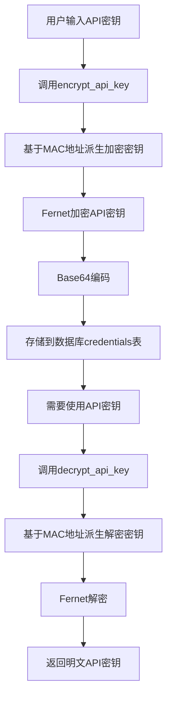
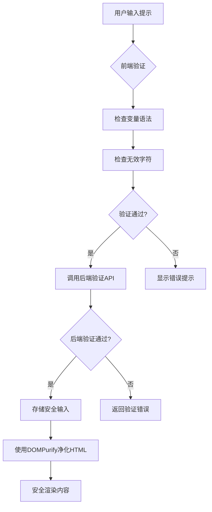
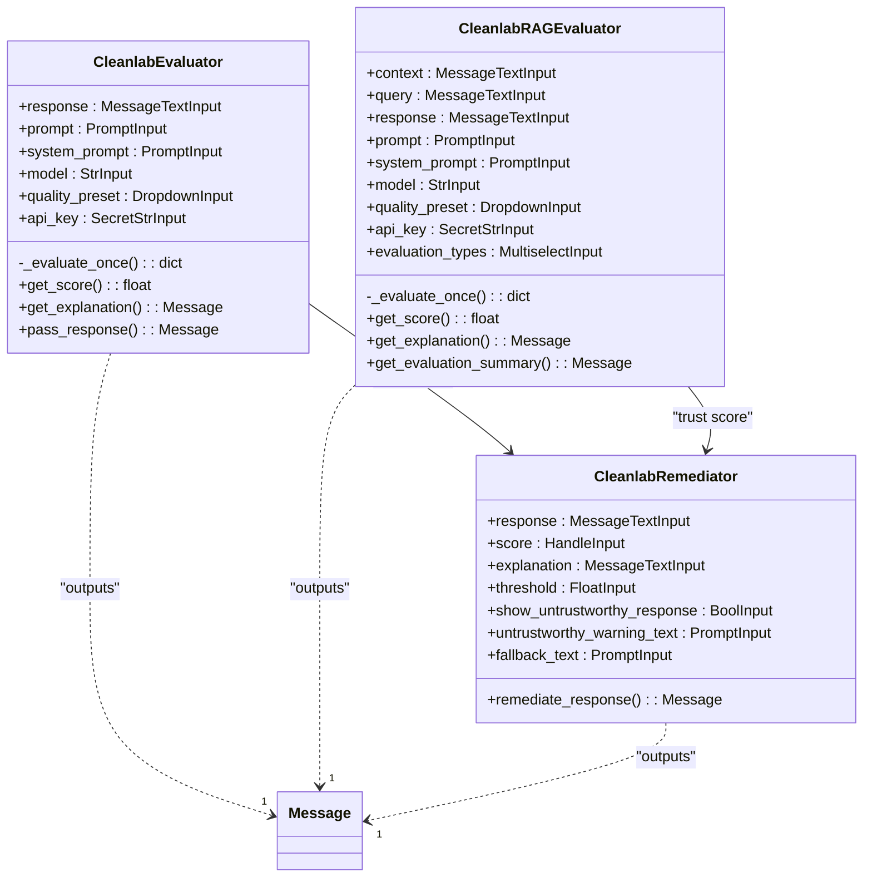
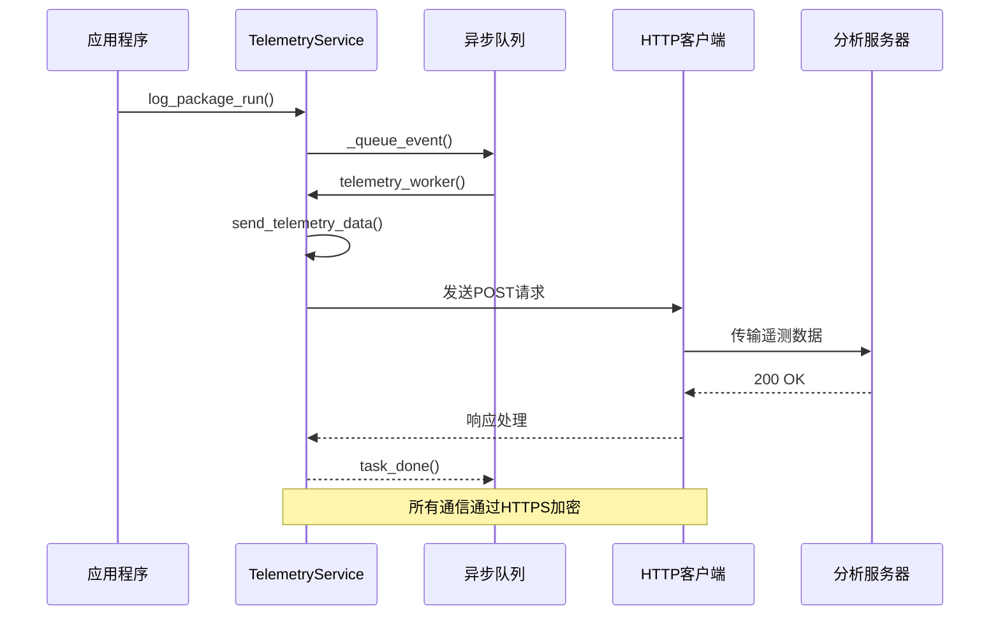
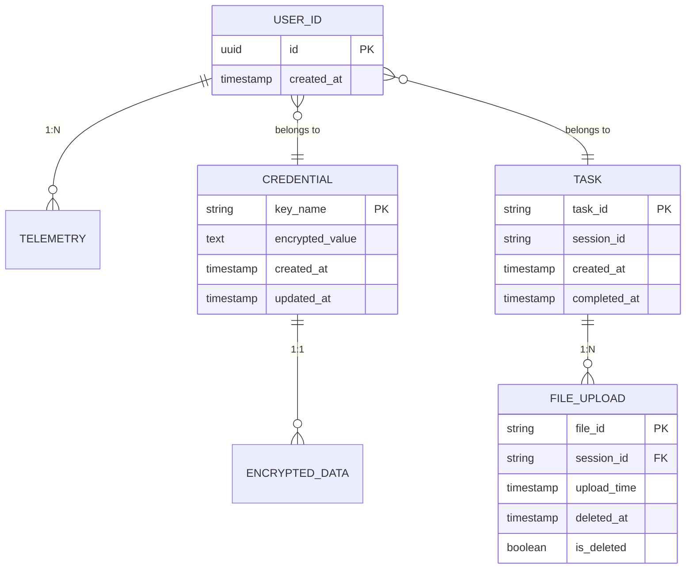
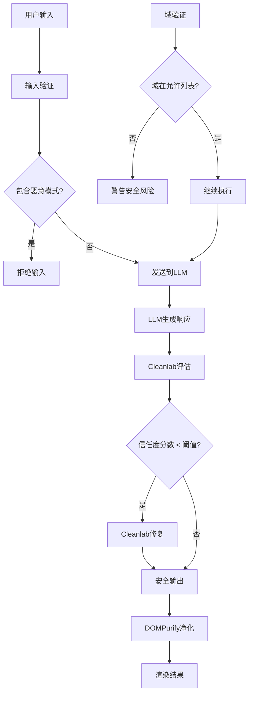

# 安全与合规

<cite>
**本文档引用的文件**   
- [encryption.py](file://vibe_surf/backend/utils/encryption.py)
- [models.py](file://vibe_surf/backend/database/models.py)
- [queries.py](file://vibe_surf/backend/database/queries.py)
- [mcp_encryption.py](file://vibe_surf/langflow/services/auth/mcp_encryption.py)
- [service.py](file://vibe_surf/langflow/services/telemetry/service.py)
- [sanitizedHTMLWrapper.tsx](file://vibe_surf/frontend/src/components/common/sanitizedHTMLWrapper/index.tsx)
- [promptModal.tsx](file://vibe_surf/frontend/src/modals/promptModal/index.tsx)
- [cleanlab_remediator.py](file://vibe_surf/langflow/components/cleanlab/cleanlab_remediator.py)
</cite>

## 目录
1. [API密钥安全存储与传输](#api密钥安全存储与传输)
2. [输入验证与净化](#输入验证与净化)
3. [输出过滤机制](#输出过滤机制)
4. [审计日志实现](#审计日志实现)
5. [数据隐私保护措施](#数据隐私保护措施)
6. [模型安全](#模型安全)
7. [安全配置最佳实践](#安全配置最佳实践)

## API密钥安全存储与传输

VibeSurf实现了多层次的API密钥安全存储与传输机制，确保敏感凭证在静态和传输过程中的安全性。

系统使用机器特定的加密密钥来保护API密钥。加密密钥基于设备的MAC地址派生，通过PBKDF2-HMAC-SHA256算法和固定盐值生成。这种机制确保了加密密钥与特定设备绑定，防止跨设备密钥泄露。当MAC地址不可用时，系统会回退到用户ID作为密钥派生的基础。

API密钥的加密和解密操作由`vibe_surf/backend/utils/encryption.py`中的`encrypt_api_key`和`decrypt_api_key`函数处理。这些函数使用Fernet对称加密方案，该方案基于AES-128-CBC加密和HMAC-SHA256签名，提供机密性和完整性保护。加密后的API密钥以Base64 URL安全编码格式存储，便于数据库存储和传输。

在数据库层面，所有敏感凭证都存储在专用的`credentials`表中，该表通过`encrypted_value`字段存储加密后的值。LLM配置文件和语音模型配置文件也包含`encrypted_api_key`字段，确保所有API密钥都经过加密处理。数据库迁移脚本`v006_add_credentials_table.sql`定义了凭证表的结构，包括唯一键名、加密值和时间戳。

系统实现了自动化的加密/解密流程。当创建或更新LLM配置文件时，`LLMProfileQueries.create_profile`和`LLMProfileQueries.update_profile`方法会自动调用加密函数处理API密钥。当需要使用API密钥时，`LLMProfileQueries.get_profile_with_decrypted_key`方法会安全地解密密钥，仅在必要时暴露明文密钥。

**图源**
- [encryption.py](file://vibe_surf/backend/utils/encryption.py#L76-L126)
- [models.py](file://vibe_surf/backend/database/models.py#L69-L70)
- [queries.py](file://vibe_surf/backend/database/queries.py#L44-L45)

**节源**
- [encryption.py](file://vibe_surf/backend/utils/encryption.py#L1-L172)
- [models.py](file://vibe_surf/backend/database/models.py#L1-L289)
- [queries.py](file://vibe_surf/backend/database/queries.py#L1-L800)

## 输入验证与净化

VibeSurf实施了严格的输入验证与净化流程，以防止提示注入攻击和恶意输入，确保系统安全性和稳定性。

前端界面通过`promptModal`组件实现输入验证。该组件在用户编辑提示时，实时检查变量语法的正确性。系统使用正则表达式`/(\{+)([^{}]+)(\}+)/g`来识别提示中的变量占位符，确保只有符合规范的变量语法被接受。该正则表达式匹配任何花括号包围的标识符，但只接受奇数个连续花括号的变量（如`{variable}`），拒绝偶数个花括号的输入，这有助于防止某些类型的注入攻击。

系统还验证输入中是否包含无效字符。`INVALID_CHARACTERS`常量定义了应被拒绝的字符集，防止特殊字符被用于恶意目的。当检测到无效字符时，系统会向用户显示错误提示，阻止不安全的输入被提交。

在后端，系统通过API端点验证进一步强化输入安全。`usePostValidatePrompt`钩子调用后端的验证端点，对提示模板进行服务器端验证。这种双重验证机制确保即使前端验证被绕过，后端仍能拦截恶意输入。

HTML内容的安全净化是输入处理的关键环节。系统使用DOMPurify库对所有用户生成的HTML内容进行净化，防止跨站脚本（XSS）攻击。`SanitizedHTMLWrapper`组件在渲染用户输入的HTML内容前，自动调用DOMPurify.sanitize()方法，移除所有潜在的恶意脚本和危险元素，只允许安全的HTML标签和属性通过。

**图源**
- [promptModal.tsx](file://vibe_surf/frontend/src/modals/promptModal/index.tsx#L55-L88)
- [sanitizedHTMLWrapper.tsx](file://vibe_surf/frontend/src/components/common/sanitizedHTMLWrapper/index.tsx#L10)
- [use-post-validate-prompt.ts](file://vibe_surf/frontend/src/controllers/API/queries/nodes/use-post-validate-prompt.ts#L29-L36)

**节源**
- [promptModal.tsx](file://vibe_surf/frontend/src/modals/promptModal/index.tsx#L1-L344)
- [sanitizedHTMLWrapper.tsx](file://vibe_surf/frontend/src/components/common/sanitizedHTMLWrapper/index.tsx#L1-L27)

## 输出过滤机制

VibeSurf实现了全面的输出过滤机制，包括内容安全过滤、敏感信息检测和合规性检查，确保LLM生成的内容安全、可靠且符合规范。

系统集成了Cleanlab评估器组件，提供先进的信任度评估和内容过滤功能。`CleanlabEvaluator`组件分析LLM生成的响应，计算0到1之间的信任度分数，分数越高表示响应越可靠。该组件还生成详细的解释，说明为什么响应获得特定分数，帮助用户理解评估结果。

`CleanlabRAGEvaluator`专门用于评估RAG（检索增强生成）管道的输出质量，检查上下文、查询和响应之间的相关性和准确性。这对于确保生成内容基于可靠信息源至关重要。

基于信任度评估，`CleanlabRemediator`组件实施动态内容过滤策略。该组件根据可配置的阈值决定如何处理低信任度的响应。如果响应的信任度分数低于阈值，系统可以采取多种措施：显示原始响应但附加警告、仅显示警告信息而不显示原始响应，或返回预定义的备用文本。这种灵活的策略允许用户根据具体应用场景调整安全级别。

**图源**
- [cleanlab_evaluator.py](file://vibe_surf/langflow/components/cleanlab/cleanlab_evaluator.py#L30-L157)
- [cleanlab_rag_evaluator.py](file://vibe_surf/langflow/components/cleanlab/cleanlab_rag_evaluator.py#L28-L44)
- [cleanlab_remediator.py](file://vibe_surf/langflow/components/cleanlab/cleanlab_remediator.py#L1-L131)

**节源**
- [cleanlab_remediator.py](file://vibe_surf/langflow/components/cleanlab/cleanlab_remediator.py#L1-L131)

## 审计日志实现

VibeSurf实现了全面的审计日志系统，记录所有LLM调用的详细信息，以满足合规要求并提供操作可追溯性。

系统的核心是`TelemetryService`，负责收集、处理和发送遥测数据。该服务在启动时生成或读取持久化的用户ID，存储在工作区目录的`telemetry/userid`文件中。这个用户ID用于匿名化跟踪，确保用户活动可以被关联，同时保护用户隐私。

遥测服务通过异步队列机制处理日志事件，确保日志记录不会阻塞主应用程序流程。`telemetry_worker`任务持续从队列中获取事件，并通过HTTP客户端发送到配置的遥测服务器。这种设计提高了系统的响应性和可靠性。

系统记录多种类型的事件，包括包运行、组件使用、游乐场交互、版本信息和异常。`log_package_run`方法记录LLM调用的详细信息，`log_package_component`记录组件使用情况，`log_exception`捕获未处理的异常并发送堆栈跟踪哈希以进行分组分析。

PostHog分析平台被用作遥测数据的后端，提供强大的事件跟踪和用户行为分析功能。系统配置了PostHog项目的API密钥和主机URL，确保数据发送到正确的分析实例。

用户可以通过环境变量`VIBESURF_ANONYMIZED_TELEMETRY`控制遥测功能的启用状态，提供对数据收集的完全控制权。

**图源**
- [service.py](file://vibe_surf/langflow/services/telemetry/service.py#L35-L282)
- [factory.py](file://vibe_surf/langflow/services/telemetry/factory.py#L1-L20)

**节源**
- [service.py](file://vibe_surf/langflow/services/telemetry/service.py#L1-L282)

## 数据隐私保护措施

VibeSurf实施了严格的数据隐私保护措施，包括数据最小化、匿名化和保留策略，确保用户数据的安全和合规。

系统遵循数据最小化原则，仅收集和存储实现功能所必需的数据。用户ID使用UUID7生成，确保唯一性和不可预测性。遥测数据中的用户身份通过持久化但匿名的用户ID处理，避免收集可直接识别个人身份的信息。

所有敏感数据在存储前都经过加密处理。API密钥、OAuth令牌等敏感字段使用基于设备MAC地址的加密密钥进行加密，确保即使数据库被泄露，攻击者也无法轻易解密敏感信息。`Credential`模型专门用于存储加密的凭证，与其他业务数据分离。

系统实现了数据保留策略，通过数据库模型中的时间戳字段跟踪数据的生命周期。`UploadedFile`模型包含`upload_time`和`deleted_at`字段，支持基于时间的数据清理策略。`Task`模型记录任务的创建、开始和完成时间，便于实施基于时间的数据归档和删除策略。

用户对数据有完全的控制权。系统提供API和界面，允许用户查看、更新和删除其数据。`store_credential`和`delete_profile`等数据库操作支持凭证的生命周期管理，确保用户可以随时撤销对第三方服务的访问权限。

**图源**
- [service.py](file://vibe_surf/langflow/services/telemetry/service.py#L54-L55)
- [models.py](file://vibe_surf/backend/database/models.py#L139-L153)
- [queries.py](file://vibe_surf/backend/database/queries.py#L759-L786)

**节源**
- [service.py](file://vibe_surf/langflow/services/telemetry/service.py#L1-L282)
- [models.py](file://vibe_surf/backend/database/models.py#L1-L289)

## 模型安全

VibeSurf通过多种机制确保模型安全，包括对抗性攻击防护和模型完整性验证，保护LLM功能免受恶意利用。

系统通过输入验证和净化层防止提示注入攻击，这是最常见的对抗性攻击形式。`promptModal`组件的语法检查和`SanitizedHTMLWrapper`的HTML净化共同构成了第一道防线，阻止恶意提示被提交到LLM。

Cleanlab集成提供了高级的模型安全功能。`CleanlabEvaluator`和`CleanlabRAGEvaluator`组件持续监控LLM输出的质量和可靠性，检测潜在的对抗性响应。这些评估器使用先进的机器学习技术分析响应的可信度，识别可能由对抗性提示生成的误导性或有害内容。

`CleanlabRemediator`组件作为响应过滤器，根据信任度分数动态调整输出。当检测到低信任度响应时，系统可以警告用户、隐藏响应或返回安全的备用内容，有效缓解对抗性攻击的影响。

系统还实施了访问控制和域限制策略。`browser_use_agent.py`中的代码显示，系统验证域模式是否包含在允许的域列表中，防止敏感凭证在未经授权的网站上使用。这种基于域的访问控制确保了凭证使用的安全上下文。

**图源**
- [cleanlab_remediator.py](file://vibe_surf/langflow/components/cleanlab/cleanlab_remediator.py#L111-L131)
- [browser_use_agent.py](file://vibe_surf/agents/browser_use_agent.py#L338-L374)
- [sanitizedHTMLWrapper.tsx](file://vibe_surf/frontend/src/components/common/sanitizedHTMLWrapper/index.tsx#L10)

**节源**
- [cleanlab_remediator.py](file://vibe_surf/langflow/components/cleanlab/cleanlab_remediator.py#L1-L131)
- [browser_use_agent.py](file://vibe_surf/agents/browser_use_agent.py#L1-L400)

## 安全配置最佳实践

为确保VibeSurf的安全部署和使用，遵循以下最佳实践：

1. **API密钥管理**：始终通过安全界面存储API密钥，避免在代码或配置文件中硬编码。系统会自动加密存储的密钥，确保其安全性。

2. **环境隔离**：在开发、测试和生产环境之间保持严格的隔离。使用不同的凭证和配置文件，防止敏感生产数据泄露到非生产环境。

3. **访问控制**：配置基于角色的访问控制（RBAC），限制用户对敏感功能和数据的访问。定期审查和更新权限设置。

4. **定期更新**：保持VibeSurf及其依赖项的最新状态，及时应用安全补丁和更新。

5. **监控和审计**：启用遥测和审计日志功能，定期审查日志以检测异常活动。设置警报以通知可疑行为。

6. **数据最小化**：仅收集和处理实现功能所必需的数据。定期清理不再需要的数据，减少数据泄露的风险。

7. **安全测试**：定期进行安全测试，包括渗透测试和代码审查，识别和修复潜在漏洞。

8. **用户教育**：培训用户识别和防范社会工程学攻击，如钓鱼邮件，保护其账户安全。

通过遵循这些最佳实践，可以最大限度地提高VibeSurf部署的安全性，保护用户数据和系统完整性。

**节源**
- [encryption.py](file://vibe_surf/backend/utils/encryption.py#L1-L172)
- [models.py](file://vibe_surf/backend/database/models.py#L1-L289)
- [queries.py](file://vibe_surf/backend/database/queries.py#L1-L800)