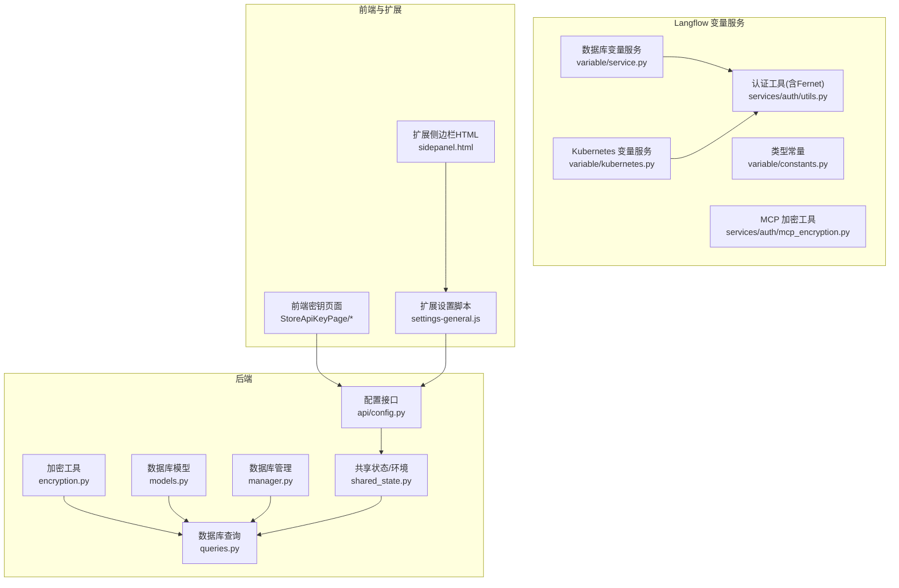
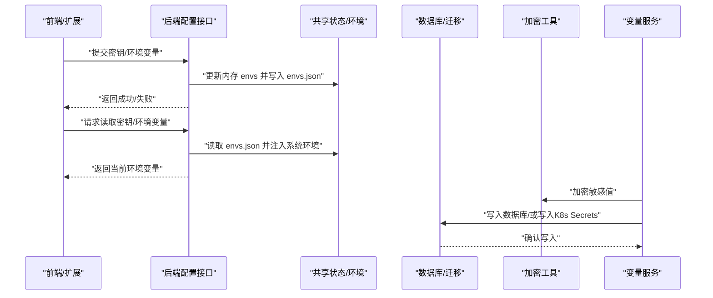
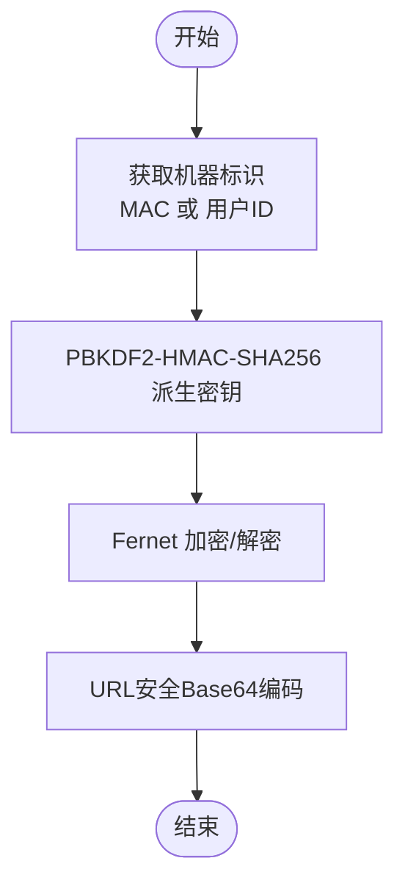
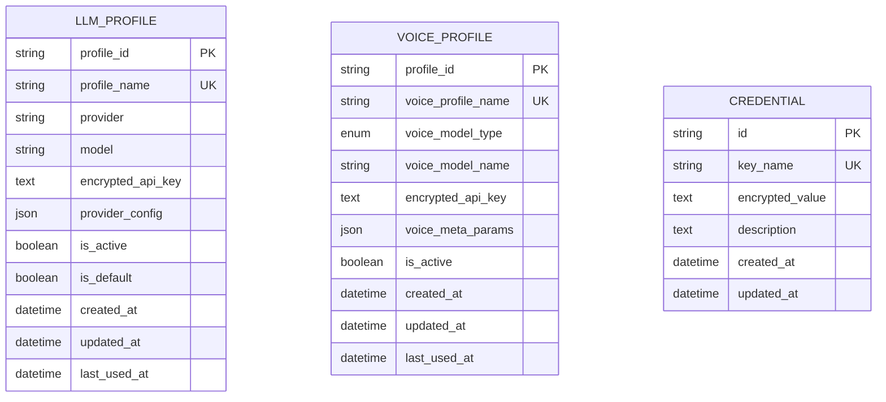
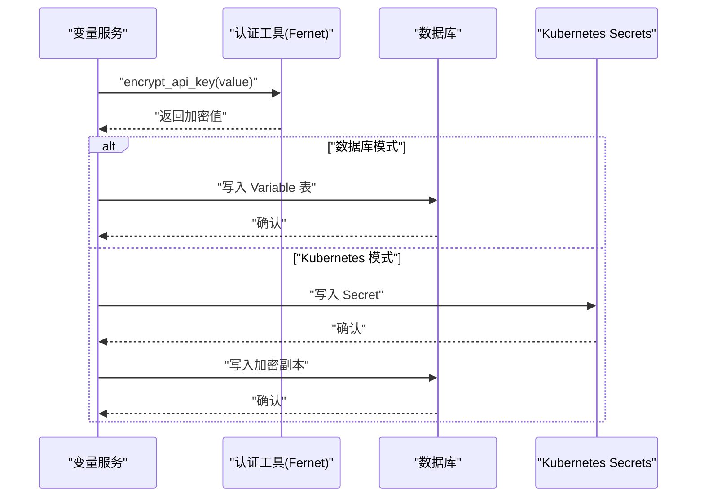
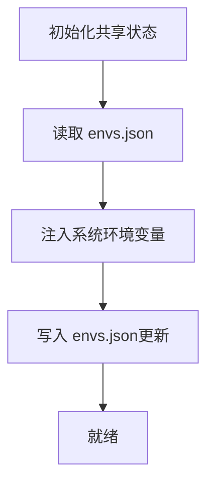
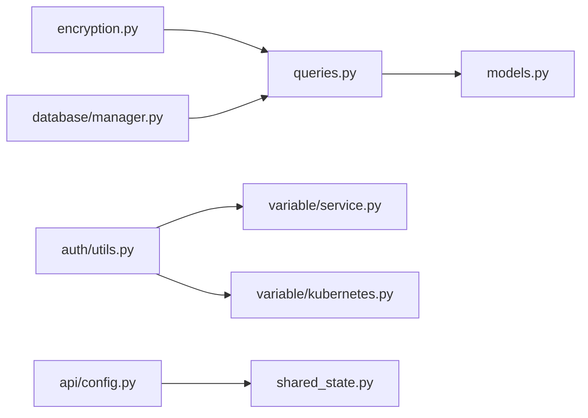

# 密钥管理

<cite>
**本文引用的文件**
- [vibe_surf/backend/utils/encryption.py](file://vibe_surf/backend/utils/encryption.py)
- [vibe_surf/backend/database/models.py](file://vibe_surf/backend/database/models.py)
- [vibe_surf/backend/database/queries.py](file://vibe_surf/backend/database/queries.py)
- [vibe_surf/backend/database/manager.py](file://vibe_surf/backend/database/manager.py)
- [vibe_surf/backend/api/config.py](file://vibe_surf/backend/api/config.py)
- [vibe_surf/backend/shared_state.py](file://vibe_surf/backend/shared_state.py)
- [vibe_surf/common.py](file://vibe_surf/common.py)
- [vibe_surf/langflow/services/auth/utils.py](file://vibe_surf/langflow/services/auth/utils.py)
- [vibe_surf/langflow/services/variable/service.py](file://vibe_surf/langflow/services/variable/service.py)
- [vibe_surf/langflow/services/variable/kubernetes.py](file://vibe_surf/langflow/services/variable/kubernetes.py)
- [vibe_surf/langflow/services/variable/constants.py](file://vibe_surf/langflow/services/variable/constants.py)
- [vibe_surf/langflow/services/auth/mcp_encryption.py](file://vibe_surf/langflow/services/auth/mcp_encryption.py)
- [vibe_surf/backend/database/migrations/v006_add_credentials_table.sql](file://vibe_surf/backend/database/migrations/v006_add_credentials_table.sql)
- [vibe_surf/frontend/src/pages/SettingsPage/pages/StoreApiKeyPage/index.tsx](file://vibe_surf/frontend/src/pages/SettingsPage/pages/StoreApiKeyPage/index.tsx)
- [vibe_surf/frontend/src/pages/SettingsPage/pages/StoreApiKeyPage/components/StoreApiKeyForm.tsx](file://vibe_surf/frontend/src/pages/SettingsPage/pages/StoreApiKeyPage/components/StoreApiKeyForm.tsx)
- [vibe_surf/frontend/src/controllers/API/queries/api-keys/index.ts](file://vibe_surf/frontend/src/controllers/API/queries/api-keys/index.ts)
- [vibe_surf/chrome_extension/scripts/settings-general.js](file://vibe_surf/chrome_extension/scripts/settings-general.js)
- [vibe_surf/chrome_extension/sidepanel.html](file://vibe_surf/chrome_extension/sidepanel.html)
- [pyproject.toml](file://pyproject.toml)
</cite>

## 目录
1. [简介](#简介)
2. [项目结构](#项目结构)
3. [核心组件](#核心组件)
4. [架构总览](#架构总览)
5. [详细组件分析](#详细组件分析)
6. [依赖关系分析](#依赖关系分析)
7. [性能与安全考量](#性能与安全考量)
8. [故障排查指南](#故障排查指南)
9. [结论](#结论)
10. [附录：最佳实践与示例路径](#附录最佳实践与示例路径)

## 简介
本文件系统性文档化 VibeSurf 的 LLM 密钥管理系统，覆盖以下方面：
- 加密存储机制：使用的加密算法、密钥派生函数、存储格式与序列化方式
- 生命周期管理：密钥的生成、轮换、撤销与过期策略
- 环境隔离：开发、测试、生产环境的密钥与变量隔离方案
- 访问控制：基于角色的权限管理与密钥使用审计
- 配置最佳实践：如何安全地设置与管理 LLM 提供商的 API 密钥
- 实际代码示例路径：展示密钥的加密存储与解密使用流程

## 项目结构
围绕密钥管理的关键模块分布如下：
- 后端通用加密工具：用于基于机器特征派生对称密钥与加解密
- 数据库模型与查询：LLM 配置档、语音配置档、凭证表等
- 变量服务与 Kubernetes 存储：数据库变量服务与 Kubernetes Secret 存储两种后端
- 前端与扩展：密钥录入界面、环境变量管理界面与 API 调用
- 共享状态与环境：工作空间、环境变量持久化与加载

图表来源
- [vibe_surf/backend/utils/encryption.py](file://vibe_surf/backend/utils/encryption.py#L1-L172)
- [vibe_surf/backend/database/models.py](file://vibe_surf/backend/database/models.py#L1-L289)
- [vibe_surf/backend/database/queries.py](file://vibe_surf/backend/database/queries.py#L1-L200)
- [vibe_surf/backend/database/manager.py](file://vibe_surf/backend/database/manager.py#L1-L200)
- [vibe_surf/backend/api/config.py](file://vibe_surf/backend/api/config.py#L690-L762)
- [vibe_surf/backend/shared_state.py](file://vibe_surf/backend/shared_state.py#L453-L704)
- [vibe_surf/langflow/services/variable/service.py](file://vibe_surf/langflow/services/variable/service.py#L1-L54)
- [vibe_surf/langflow/services/variable/kubernetes.py](file://vibe_surf/langflow/services/variable/kubernetes.py#L32-L59)
- [vibe_surf/langflow/services/auth/utils.py](file://vibe_surf/langflow/services/auth/utils.py#L472-L505)
- [vibe_surf/langflow/services/auth/mcp_encryption.py](file://vibe_surf/langflow/services/auth/mcp_encryption.py#L45-L120)
- [vibe_surf/frontend/src/pages/SettingsPage/pages/StoreApiKeyPage/index.tsx](file://vibe_surf/frontend/src/pages/SettingsPage/pages/StoreApiKeyPage/index.tsx#L56-L88)
- [vibe_surf/chrome_extension/scripts/settings-general.js](file://vibe_surf/chrome_extension/scripts/settings-general.js#L340-L419)
- [vibe_surf/chrome_extension/sidepanel.html](file://vibe_surf/chrome_extension/sidepanel.html#L404-L441)

章节来源
- [vibe_surf/backend/utils/encryption.py](file://vibe_surf/backend/utils/encryption.py#L1-L172)
- [vibe_surf/backend/database/models.py](file://vibe_surf/backend/database/models.py#L1-L289)
- [vibe_surf/backend/database/queries.py](file://vibe_surf/backend/database/queries.py#L1-L200)
- [vibe_surf/backend/database/manager.py](file://vibe_surf/backend/database/manager.py#L1-L200)
- [vibe_surf/backend/api/config.py](file://vibe_surf/backend/api/config.py#L690-L762)
- [vibe_surf/backend/shared_state.py](file://vibe_surf/backend/shared_state.py#L453-L704)
- [vibe_surf/langflow/services/variable/service.py](file://vibe_surf/langflow/services/variable/service.py#L1-L54)
- [vibe_surf/langflow/services/variable/kubernetes.py](file://vibe_surf/langflow/services/variable/kubernetes.py#L32-L59)
- [vibe_surf/langflow/services/auth/utils.py](file://vibe_surf/langflow/services/auth/utils.py#L472-L505)
- [vibe_surf/langflow/services/auth/mcp_encryption.py](file://vibe_surf/langflow/services/auth/mcp_encryption.py#L45-L120)
- [vibe_surf/frontend/src/pages/SettingsPage/pages/StoreApiKeyPage/index.tsx](file://vibe_surf/frontend/src/pages/SettingsPage/pages/StoreApiKeyPage/index.tsx#L56-L88)
- [vibe_surf/chrome_extension/scripts/settings-general.js](file://vibe_surf/chrome_extension/scripts/settings-general.js#L340-L419)
- [vibe_surf/chrome_extension/sidepanel.html](file://vibe_surf/chrome_extension/sidepanel.html#L404-L441)

## 核心组件
- 加密工具（encryption.py）
  - 使用 PBKDF2-HMAC-SHA256 派生密钥，基于机器 MAC 地址或本地用户 ID
  - 使用 Fernet 对称加密进行 API Key 的双向加解密
  - 支持检测值是否已加密
- 数据库模型与查询（models.py, queries.py）
  - LLMProfile/VoiceProfile/Credential 等模型均包含加密字段
  - 查询层在创建/更新时自动加密，在读取时可选择解密返回
- 变量服务（variable/service.py, variable/kubernetes.py）
  - 数据库存储：将敏感值通过认证工具加密后写入数据库
  - Kubernetes 存储：将敏感值写入 Kubernetes Secrets，并同时在数据库中保存加密副本
- 配置接口与共享状态（api/config.py, shared_state.py）
  - 提供环境变量的读取与更新接口，支持持久化到工作空间目录
  - 初始化时从 envs.json 加载环境变量并注入系统环境
- 前端与扩展（StoreApiKeyPage, settings-general.js, sidepanel.html）
  - 提供密钥录入界面与环境变量编辑界面，调用后端接口完成存储与更新

章节来源
- [vibe_surf/backend/utils/encryption.py](file://vibe_surf/backend/utils/encryption.py#L23-L127)
- [vibe_surf/backend/database/models.py](file://vibe_surf/backend/database/models.py#L57-L93)
- [vibe_surf/backend/database/queries.py](file://vibe_surf/backend/database/queries.py#L21-L140)
- [vibe_surf/langflow/services/variable/service.py](file://vibe_surf/langflow/services/variable/service.py#L175-L195)
- [vibe_surf/langflow/services/variable/kubernetes.py](file://vibe_surf/langflow/services/variable/kubernetes.py#L136-L172)
- [vibe_surf/backend/api/config.py](file://vibe_surf/backend/api/config.py#L690-L762)
- [vibe_surf/backend/shared_state.py](file://vibe_surf/backend/shared_state.py#L453-L704)
- [vibe_surf/frontend/src/pages/SettingsPage/pages/StoreApiKeyPage/index.tsx](file://vibe_surf/frontend/src/pages/SettingsPage/pages/StoreApiKeyPage/index.tsx#L56-L88)
- [vibe_surf/chrome_extension/scripts/settings-general.js](file://vibe_surf/chrome_extension/scripts/settings-general.js#L340-L419)
- [vibe_surf/chrome_extension/sidepanel.html](file://vibe_surf/chrome_extension/sidepanel.html#L404-L441)

## 架构总览
密钥管理贯穿“采集—加密—存储—检索—使用”的闭环，同时支持多后端存储与环境隔离。

图表来源
- [vibe_surf/backend/api/config.py](file://vibe_surf/backend/api/config.py#L690-L762)
- [vibe_surf/backend/shared_state.py](file://vibe_surf/backend/shared_state.py#L453-L704)
- [vibe_surf/backend/utils/encryption.py](file://vibe_surf/backend/utils/encryption.py#L76-L127)
- [vibe_surf/langflow/services/variable/service.py](file://vibe_surf/langflow/services/variable/service.py#L175-L195)
- [vibe_surf/langflow/services/variable/kubernetes.py](file://vibe_surf/langflow/services/variable/kubernetes.py#L136-L172)

## 详细组件分析

### 组件A：加密与密钥派生（encryption.py）
- 密钥派生
  - 优先使用机器 MAC 地址；若不可用则回退到本地用户 ID（UUID7 字符串）
  - 使用 PBKDF2-HMAC-SHA256，固定盐值与高迭代次数，保证跨会话一致性
- 对称加密
  - 使用 Fernet（基于 AES-CBC）进行双向加解密
  - 返回值为 URL 安全 Base64 编码字符串，便于存储与传输
- 辅助能力
  - is_encrypted：判断字符串是否为加密形态（基于 Base64 与长度特征）

图表来源
- [vibe_surf/backend/utils/encryption.py](file://vibe_surf/backend/utils/encryption.py#L23-L127)

章节来源
- [vibe_surf/backend/utils/encryption.py](file://vibe_surf/backend/utils/encryption.py#L23-L127)

### 组件B：数据库模型与查询（models.py, queries.py）
- 模型设计
  - LLMProfile/VoiceProfile：包含 encrypted_api_key 字段，用于存储加密后的 API Key
  - Credential：独立凭证表，存储 key_name 与 encrypted_value
- 查询操作
  - 创建/更新时自动加密 API Key
  - 读取时可选择返回解密后的明文（仅在需要时解密）
  - 提供默认配置与活跃状态索引，提升查询性能

图表来源
- [vibe_surf/backend/database/models.py](file://vibe_surf/backend/database/models.py#L57-L93)
- [vibe_surf/backend/database/models.py](file://vibe_surf/backend/database/models.py#L217-L235)

章节来源
- [vibe_surf/backend/database/models.py](file://vibe_surf/backend/database/models.py#L57-L93)
- [vibe_surf/backend/database/models.py](file://vibe_surf/backend/database/models.py#L217-L235)
- [vibe_surf/backend/database/queries.py](file://vibe_surf/backend/database/queries.py#L21-L140)
- [vibe_surf/backend/database/queries.py](file://vibe_surf/backend/database/queries.py#L934-L1028)
- [vibe_surf/backend/database/queries.py](file://vibe_surf/backend/database/queries.py#L1345-L1430)

### 组件C：变量服务与 Kubernetes 存储（variable/service.py, variable/kubernetes.py）
- 数据库存储
  - 将敏感值通过认证工具加密后写入数据库 Variable 表
  - 支持按用户维度隔离与类型区分（Credential/ Generic）
- Kubernetes 存储
  - 将敏感值写入 Kubernetes Secrets，同时在数据库中保存加密副本
  - 适合容器化部署与多节点一致性场景

图表来源
- [vibe_surf/langflow/services/variable/service.py](file://vibe_surf/langflow/services/variable/service.py#L175-L195)
- [vibe_surf/langflow/services/variable/kubernetes.py](file://vibe_surf/langflow/services/variable/kubernetes.py#L136-L172)
- [vibe_surf/langflow/services/auth/utils.py](file://vibe_surf/langflow/services/auth/utils.py#L472-L505)

章节来源
- [vibe_surf/langflow/services/variable/service.py](file://vibe_surf/langflow/services/variable/service.py#L1-L54)
- [vibe_surf/langflow/services/variable/kubernetes.py](file://vibe_surf/langflow/services/variable/kubernetes.py#L32-L59)
- [vibe_surf/langflow/services/variable/kubernetes.py](file://vibe_surf/langflow/services/variable/kubernetes.py#L136-L172)
- [vibe_surf/langflow/services/auth/utils.py](file://vibe_surf/langflow/services/auth/utils.py#L472-L505)
- [vibe_surf/langflow/services/variable/constants.py](file://vibe_surf/langflow/services/variable/constants.py#L1-L2)

### 组件D：环境变量与共享状态（api/config.py, shared_state.py, common.py）
- 环境变量接口
  - GET /environments：读取当前环境变量集合
  - PUT /environments：更新环境变量并持久化到 envs.json
- 共享状态初始化
  - 从 envs.json 加载环境变量并注入系统环境
  - 设置工作空间目录与浏览器相关路径
- 工作空间与默认路径
  - 根据平台设置默认工作空间目录，确保存在并可写

图表来源
- [vibe_surf/backend/api/config.py](file://vibe_surf/backend/api/config.py#L690-L762)
- [vibe_surf/backend/shared_state.py](file://vibe_surf/backend/shared_state.py#L453-L704)
- [vibe_surf/common.py](file://vibe_surf/common.py#L1-L35)

章节来源
- [vibe_surf/backend/api/config.py](file://vibe_surf/backend/api/config.py#L690-L762)
- [vibe_surf/backend/shared_state.py](file://vibe_surf/backend/shared_state.py#L453-L704)
- [vibe_surf/common.py](file://vibe_surf/common.py#L1-L35)

### 组件E：前端与扩展（StoreApiKeyPage, settings-general.js, sidepanel.html）
- 前端密钥页面
  - 提供密钥输入与保存按钮，调用后端接口完成存储
- 扩展设置
  - 侧边栏展示环境变量列表，支持编辑与保存
  - 通过 API 客户端拉取/更新环境变量

章节来源
- [vibe_surf/frontend/src/pages/SettingsPage/pages/StoreApiKeyPage/index.tsx](file://vibe_surf/frontend/src/pages/SettingsPage/pages/StoreApiKeyPage/index.tsx#L56-L88)
- [vibe_surf/frontend/src/pages/SettingsPage/pages/StoreApiKeyPage/components/StoreApiKeyForm.tsx](file://vibe_surf/frontend/src/pages/SettingsPage/pages/StoreApiKeyPage/components/StoreApiKeyForm.tsx#L19-L63)
- [vibe_surf/chrome_extension/scripts/settings-general.js](file://vibe_surf/chrome_extension/scripts/settings-general.js#L340-L419)
- [vibe_surf/chrome_extension/sidepanel.html](file://vibe_surf/chrome_extension/sidepanel.html#L404-L441)

## 依赖关系分析
- 外部依赖
  - cryptography：Fernet、PBKDF2
  - getmac：获取 MAC 地址
  - aiosqlite/sqlalchemy：异步数据库访问与迁移
  - fastapi：后端接口
- 内部耦合
  - queries.py 依赖 encryption.py 进行加解密
  - variable/service.py 与 variable/kubernetes.py 依赖 auth/utils.py 的 Fernet 加密
  - api/config.py 与 shared_state.py 协同管理环境变量

图表来源
- [vibe_surf/backend/utils/encryption.py](file://vibe_surf/backend/utils/encryption.py#L1-L172)
- [vibe_surf/backend/database/queries.py](file://vibe_surf/backend/database/queries.py#L1-L120)
- [vibe_surf/langflow/services/auth/utils.py](file://vibe_surf/langflow/services/auth/utils.py#L472-L505)
- [vibe_surf/langflow/services/variable/service.py](file://vibe_surf/langflow/services/variable/service.py#L175-L195)
- [vibe_surf/langflow/services/variable/kubernetes.py](file://vibe_surf/langflow/services/variable/kubernetes.py#L136-L172)
- [vibe_surf/backend/api/config.py](file://vibe_surf/backend/api/config.py#L690-L762)
- [vibe_surf/backend/shared_state.py](file://vibe_surf/backend/shared_state.py#L453-L704)
- [vibe_surf/backend/database/manager.py](file://vibe_surf/backend/database/manager.py#L1-L200)
- [vibe_surf/backend/database/models.py](file://vibe_surf/backend/database/models.py#L1-L120)

章节来源
- [pyproject.toml](file://pyproject.toml#L90-L120)

## 性能与安全考量
- 性能
  - PBKDF2 迭代次数较高，确保安全性但增加派生时间；建议在批量处理时合并操作
  - 数据库查询使用索引（如 profile_name、key_name），减少扫描
- 安全
  - 采用 Fernet 对称加密，密钥由机器特征派生，避免显式密钥管理
  - 前端与扩展仅传输加密值，明文不落盘
  - 环境变量持久化到工作空间目录，避免泄露至全局环境
- 可靠性
  - 数据库存储与 Kubernetes Secrets 双通道可选，满足不同部署需求
  - 查询层提供解密开关，避免不必要的明文暴露

[本节为通用指导，无需列出具体文件来源]

## 故障排查指南
- 加密/解密失败
  - 检查机器 MAC 是否可用，必要时启用本地用户 ID 回退路径
  - 确认 Base64 编码与长度特征匹配加密形态
- 数据库迁移问题
  - 确认 credentials 表已创建并具备索引
  - SQLite 迁移需启用迁移管理器
- 环境变量未生效
  - 检查 envs.json 是否存在且可写
  - 确认共享状态已将变量注入系统环境
- 前端/扩展无法保存密钥
  - 检查后端接口返回状态与错误信息
  - 确认前端已正确调用 API 并传入有效键值

章节来源
- [vibe_surf/backend/utils/encryption.py](file://vibe_surf/backend/utils/encryption.py#L98-L127)
- [vibe_surf/backend/database/migrations/v006_add_credentials_table.sql](file://vibe_surf/backend/database/migrations/v006_add_credentials_table.sql#L1-L26)
- [vibe_surf/backend/api/config.py](file://vibe_surf/backend/api/config.py#L690-L762)
- [vibe_surf/backend/shared_state.py](file://vibe_surf/backend/shared_state.py#L453-L704)

## 结论
VibeSurf 的密钥管理体系以“机器特征派生密钥 + Fernet 对称加密”为核心，结合数据库与 Kubernetes 双存储后端，实现了跨环境的安全密钥管理。通过严格的环境变量隔离、最小化明文暴露与完善的查询层加解密控制，系统在保障安全性的同时兼顾了易用性与可维护性。

[本节为总结性内容，无需列出具体文件来源]

## 附录：最佳实践与示例路径

### 最佳实践
- 密钥生成与轮换
  - 使用统一入口进行密钥加密与存储，避免明文散落
  - 轮换周期建议与供应商策略一致，到期前自动提示替换
- 环境隔离
  - 开发/测试/生产分别使用独立工作空间与环境变量集
  - 生产环境优先使用 Kubernetes Secrets 存储
- 访问控制
  - 限制密钥读取权限，仅授权服务与管理员账户
  - 审计密钥使用日志，追踪变更与访问
- 配置管理
  - 将敏感配置放入 envs.json 并受控访问
  - 前端与扩展仅负责调用后端接口，不直接处理明文

### 关键流程示例路径
- 加密存储（数据库）
  - 创建 LLM 配置档并加密 API Key：[LLMProfileQueries.create_profile](file://vibe_surf/backend/database/queries.py#L21-L91)
  - 创建语音配置档并加密 API Key：[VoiceProfileQueries.create_profile](file://vibe_surf/backend/database/queries.py#L938-L983)
  - 存储通用凭证并加密：[CredentialQueries.store_credential](file://vibe_surf/backend/database/queries.py#L1367-L1405)
- 解密使用（数据库）
  - 获取带解密 API Key 的 LLM 配置档：[LLMProfileQueries.get_profile_with_decrypted_key](file://vibe_surf/backend/database/queries.py#L110-L140)
  - 获取带解密 API Key 的语音配置档：[VoiceProfileQueries.get_profile_with_decrypted_key](file://vibe_surf/backend/database/queries.py#L1001-L1028)
  - 获取凭证值（解密）：[CredentialQueries.get_credential](file://vibe_surf/backend/database/queries.py#L1349-L1366)
- 加密存储（变量服务）
  - 数据库存储加密变量：[DatabaseVariableService.create_variable](file://vibe_surf/langflow/services/variable/service.py#L175-L195)
  - Kubernetes 存储加密变量：[KubernetesSecretService.create_variable](file://vibe_surf/langflow/services/variable/kubernetes.py#L136-L172)
- 环境变量管理
  - 读取环境变量：[GET /environments](file://vibe_surf/backend/api/config.py#L690-L712)
  - 更新环境变量并持久化：[PUT /environments](file://vibe_surf/backend/api/config.py#L713-L762)
  - 初始化共享状态并注入环境变量：[initialize_vibesurf_components](file://vibe_surf/backend/shared_state.py#L453-L704)
- 前端密钥录入
  - 密钥页面入口与表单组件：[StoreApiKeyPage](file://vibe_surf/frontend/src/pages/SettingsPage/pages/StoreApiKeyPage/index.tsx#L56-L88)、[StoreApiKeyForm](file://vibe_surf/frontend/src/pages/SettingsPage/pages/StoreApiKeyPage/components/StoreApiKeyForm.tsx#L19-L63)
  - 扩展侧边栏环境变量编辑与保存：[settings-general.js](file://vibe_surf/chrome_extension/scripts/settings-general.js#L340-L419)、[sidepanel.html](file://vibe_surf/chrome_extension/sidepanel.html#L404-L441)