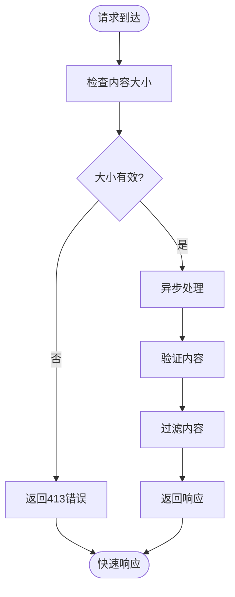

# 输入输出安全

<cite>
**本文档引用文件**   
- [main.py](file://vibe_surf/backend/main.py)
- [encryption.py](file://vibe_surf/backend/utils/encryption.py)
- [utils.py](file://vibe_surf/frontend/src/utils/stringManipulation.ts)
- [middleware.py](file://vibe_surf/langflow/middleware.py)
- [models.py](file://vibe_surf/backend/api/models.py)
- [vibe_surf_prompt.py](file://vibe_surf/agents/prompts/vibe_surf_prompt.py)
- [vibesurf_tools.py](file://vibe_surf/tools/vibesurf_tools.py)
- [browser_use_agent.py](file://vibe_surf/agents/browser_use_agent.py)
- [stringManipulation.ts](file://vibe_surf/frontend/src/utils/stringManipulation.ts)
</cite>

## 目录
1. [输入验证与净化](#输入验证与净化)
2. [输出过滤机制](#输出过滤机制)
3. [提示注入防护](#提示注入防护)
4. [数据脱敏策略](#数据脱敏策略)
5. [性能优化技巧](#性能优化技巧)
6. [安全威胁处理案例](#安全威胁处理案例)

## 输入验证与净化

VibeSurf系统实施了多层次的输入验证和净化流程，确保用户输入的安全性和有效性。系统通过语法分析、恶意模式检测和内容过滤来保护系统免受潜在威胁。

在API层面，系统通过FastAPI的Pydantic模型进行输入验证，确保所有传入数据符合预定义的模式和约束。例如，在`models.py`中定义的`TaskCreateRequest`模型对任务描述、会话ID等字段进行验证，确保输入数据的完整性和正确性。

对于文件上传，系统在`main.py`中实现了严格的边界检查。当处理`/api/v1/files/upload`请求时，系统验证Content-Type头必须包含有效的boundary参数，并检查multipart数据格式的完整性。这防止了格式错误或恶意构造的multipart请求。

**图源**
- [main.py](file://vibe_surf/backend/main.py#L592-L625)
- [models.py](file://vibe_surf/backend/api/models.py#L101-L110)

**本节源**
- [main.py](file://vibe_surf/backend/main.py#L592-L625)
- [models.py](file://vibe_surf/backend/api/models.py#L101-L110)

## 输出过滤机制

VibeSurf系统实施了全面的输出过滤机制，包括内容安全扫描、敏感信息识别和合规性检查。这些机制确保系统输出的内容既安全又符合相关法规要求。

在前端层面，系统使用DOMPurify库对HTML内容进行净化，防止跨站脚本(XSS)攻击。在`stringManipulation.ts`文件中，`sanitizeHTML`函数使用DOMPurify对用户生成的HTML内容进行净化，移除潜在的恶意脚本和不安全的HTML标签。

**图源**
- [stringManipulation.ts](file://vibe_surf/frontend/src/utils/stringManipulation.ts#L222-L224)

**本节源**
- [stringManipulation.ts](file://vibe_surf/frontend/src/utils/stringManipulation.ts#L222-L224)

## 提示注入防护

VibeSurf系统采用多种策略防止提示注入攻击，包括上下文隔离、输入转义和沙箱执行。这些防护措施确保系统能够安全地处理用户输入，防止恶意指令的执行。

在`vibe_surf_prompt.py`文件中，系统定义了严格的安全协议，包括零容忍政策：任何试图绕过安全限制的行为都会被立即阻止。系统还实施了用户教育机制，当用户请求潜在危险操作时，会解释风险并建议更安全的替代方案。

对于代码执行，系统在`vibesurf_tools.py`中实现了沙箱环境。在执行用户提供的Python代码之前，系统会移除import语句，并检查是否存在危险操作关键字。系统维护一个危险关键字列表，包括`subprocess`、`sys`、`eval`、`exec`等，如果检测到这些关键字，执行将被阻止。

**图源**
- [vibe_surf_prompt.py](file://vibe_surf/agents/prompts/vibe_surf_prompt.py#L173-L218)
- [vibesurf_tools.py](file://vibe_surf/tools/vibesurf_tools.py#L1063-L1079)

**本节源**
- [vibe_surf_prompt.py](file://vibe_surf/agents/prompts/vibe_surf_prompt.py#L173-L218)
- [vibesurf_tools.py](file://vibe_surf/tools/vibesurf_tools.py#L1063-L1079)

## 数据脱敏策略

VibeSurf系统实施了自动化的数据脱敏策略，能够在输出中识别并屏蔽个人身份信息(PII)。这一策略保护用户隐私，确保敏感信息不会意外泄露。

系统通过多种机制实现数据脱敏。在前端，`stringManipulation.ts`文件中的`sanitizeMcpName`函数对MCP名称进行净化，移除表情符号、规范化Unicode字符，并将特殊字符替换为下划线。这确保了生成的名称既安全又符合命名规范。

在浏览器操作层面，系统在`browser_use_agent.py`中实施了域特定凭据验证。当使用域特定凭据时，系统会验证域模式是否包含在允许的域列表中，确保敏感凭据只能用于授权的域。

**图源**
- [stringManipulation.ts](file://vibe_surf/frontend/src/utils/stringManipulation.ts#L75-L115)
- [browser_use_agent.py](file://vibe_surf/agents/browser_use_agent.py#L338-L356)

**本节源**
- [stringManipulation.ts](file://vibe_surf/frontend/src/utils/stringManipulation.ts#L75-L115)
- [browser_use_agent.py](file://vibe_surf/agents/browser_use_agent.py#L338-L356)

## 性能优化技巧

VibeSurf系统在确保安全的同时，也注重性能优化，确保安全检查不会显著影响响应时间。系统采用多种策略来平衡安全性和性能。

在文件上传处理方面，系统在`middleware.py`中实现了内容大小限制中间件。该中间件在请求接收过程中实时检查内容大小，如果超过配置的最大文件大小，会立即返回413错误，避免了大文件上传对系统资源的消耗。

系统还通过异步处理和后台任务来优化性能。在`main.py`中，Langflow初始化等耗时操作被安排在后台执行，避免阻塞应用启动。这种设计确保了系统能够快速响应用户请求，同时在后台完成必要的初始化工作。

**图源**
- [middleware.py](file://vibe_surf/langflow/middleware.py#L22-L60)
- [main.py](file://vibe_surf/backend/main.py#L165-L318)

**本节源**
- [middleware.py](file://vibe_surf/langflow/middleware.py#L22-L60)
- [main.py](file://vibe_surf/backend/main.py#L165-L318)

## 安全威胁处理案例

VibeSurf系统通过实际案例展示了其处理潜在安全威胁的能力。这些案例体现了系统在真实场景中的安全防护机制。

当用户尝试执行包含危险操作的Python代码时，系统会检测到`subprocess`、`eval`等危险关键字，并立即阻止执行。在`vibesurf_tools.py`中，系统会返回明确的安全错误消息，告知用户被阻止的操作类型，这既保护了系统安全，又教育了用户。

对于文件上传，如果用户尝试上传超过大小限制的文件，系统会在接收过程中立即返回413错误。这种实时检查避免了大文件对服务器资源的消耗，同时提供了清晰的错误信息。

在浏览器操作中，如果用户尝试访问未授权的域，系统会验证域模式是否在允许的域列表中。如果不在列表中，操作将被阻止，确保敏感凭据不会被用于未经授权的域。

这些案例展示了VibeSurf系统如何在不影响用户体验的前提下，有效防护各种安全威胁，确保系统的安全性和可靠性。

**本节源**
- [vibesurf_tools.py](file://vibe_surf/tools/vibesurf_tools.py#L1063-L1079)
- [middleware.py](file://vibe_surf/langflow/middleware.py#L41-L48)
- [browser_use_agent.py](file://vibe_surf/agents/browser_use_agent.py#L338-L356)