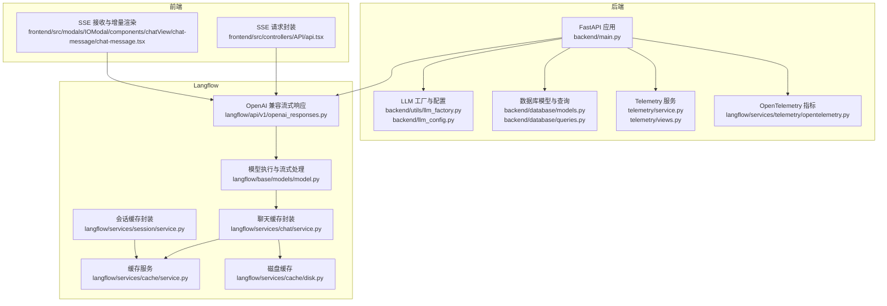
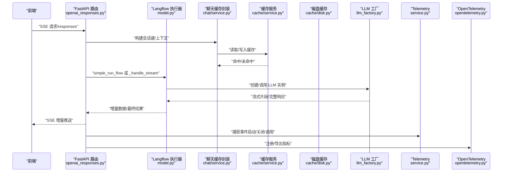
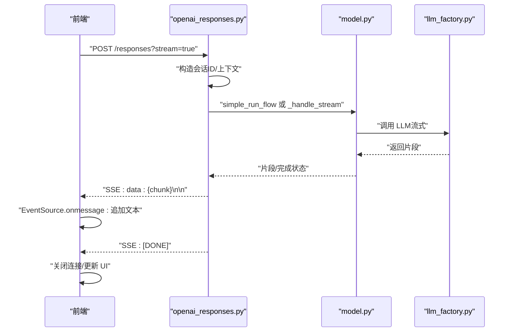
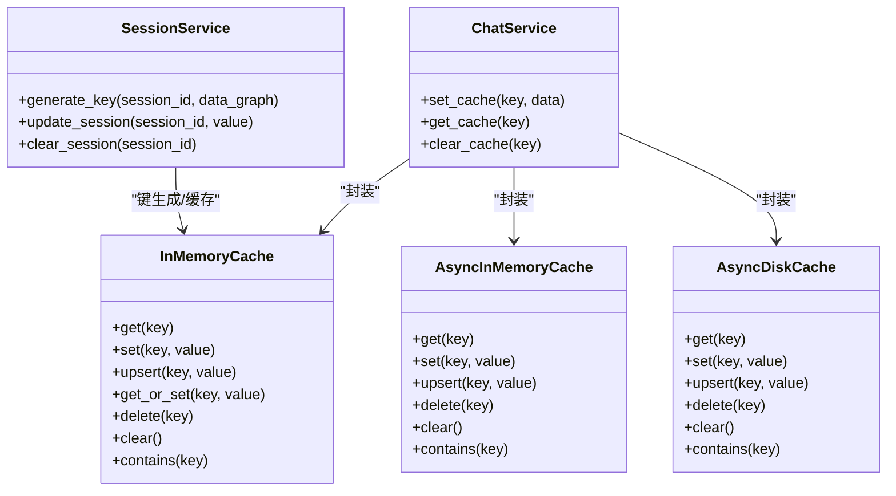
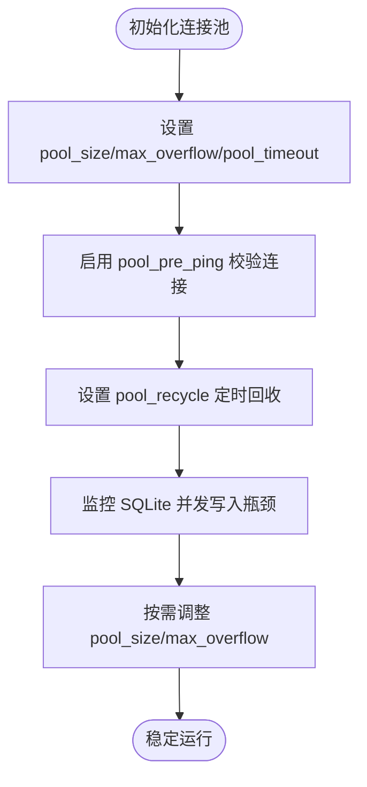
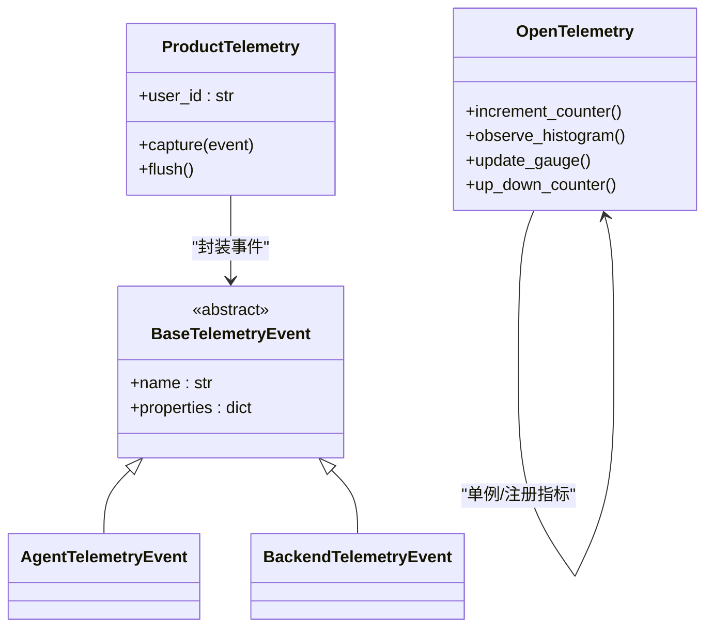
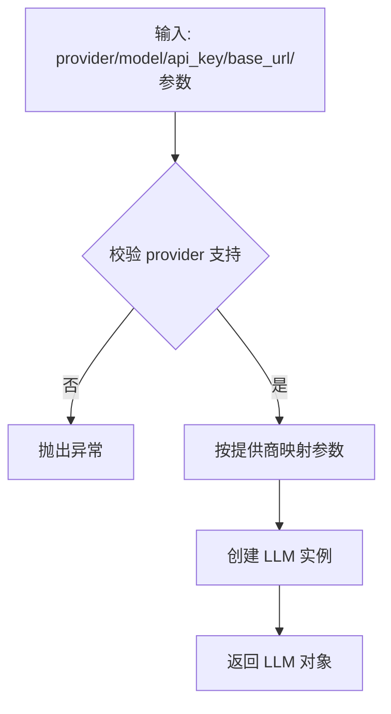
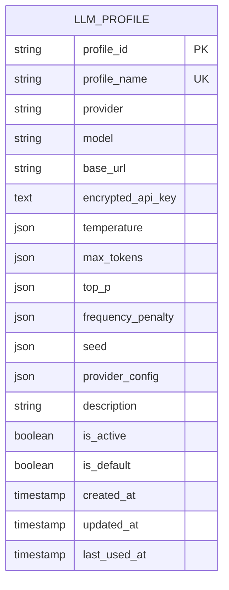
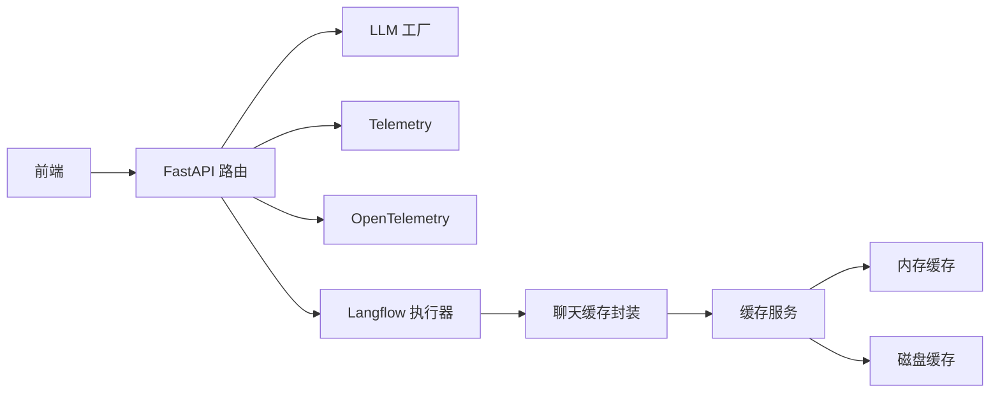

# 性能优化与监控

<cite>
**本文引用的文件**
- [vibe_surf/backend/utils/llm_factory.py](file://vibe_surf/backend/utils/llm_factory.py)
- [vibe_surf/backend/llm_config.py](file://vibe_surf/backend/llm_config.py)
- [vibe_surf/backend/main.py](file://vibe_surf/backend/main.py)
- [vibe_surf/telemetry/service.py](file://vibe_surf/telemetry/service.py)
- [vibe_surf/telemetry/views.py](file://vibe_surf/telemetry/views.py)
- [vibe_surf/langflow/services/cache/service.py](file://vibe_surf/langflow/services/cache/service.py)
- [vibe_surf/langflow/services/cache/disk.py](file://vibe_surf/langflow/services/cache/disk.py)
- [vibe_surf/langflow/services/chat/service.py](file://vibe_surf/langflow/services/chat/service.py)
- [vibe_surf/langflow/services/session/service.py](file://vibe_surf/langflow/services/session/service.py)
- [vibe_surf/langflow/services/settings/base.py](file://vibe_surf/langflow/services/settings/base.py)
- [vibe_surf/langflow/services/telemetry/opentelemetry.py](file://vibe_surf/langflow/services/telemetry/opentelemetry.py)
- [vibe_surf/langflow/api/v1/openai_responses.py](file://vibe_surf/langflow/api/v1/openai_responses.py)
- [vibe_surf/langflow/base/models/model.py](file://vibe_surf/langflow/base/models/model.py)
- [vibe_surf/frontend/src/controllers/API/api.tsx](file://vibe_surf/frontend/src/controllers/API/api.tsx)
- [vibe_surf/frontend/src/modals/IOModal/components/chatView/chat-message/chat-message.tsx](file://vibe_surf/frontend/src/modals/IOModal/components/chatView/chat-message/chat-message.tsx)
- [vibe_surf/backend/database/models.py](file://vibe_surf/backend/database/models.py)
- [vibe_surf/backend/database/queries.py](file://vibe_surf/backend/database/queries.py)
- [vibe_surf/backend/api/task.py](file://vibe_surf/backend/api/task.py)
- [vibe_surf/backend/api/config.py](file://vibe_surf/backend/api/config.py)
- [vibe_surf/langflow/components/processing/batch_run.py](file://vibe_surf/langflow/components/processing/batch_run.py)
- [vibe_surf/langflow/components/processing/llm_router.py](file://vibe_surf/langflow/components/processing/llm_router.py)
</cite>

## 目录
1. [简介](#简介)
2. [项目结构](#项目结构)
3. [核心组件](#核心组件)
4. [架构总览](#架构总览)
5. [详细组件分析](#详细组件分析)
6. [依赖关系分析](#依赖关系分析)
7. [性能考量](#性能考量)
8. [故障排查指南](#故障排查指南)
9. [结论](#结论)
10. [附录](#附录)

## 简介
本文件聚焦于 VibeSurf 的 LLM 性能优化与监控机制，围绕以下主题展开：
- 流式响应实现：如何处理部分生成结果并实时显示
- 缓存策略：输入缓存、输出缓存与会话上下文缓存的实现与适用场景
- 连接池管理：连接复用、超时设置与资源回收
- Telemetry 服务：如何采集 LLM 调用的性能指标（响应时间、令牌使用量、错误率）
- 性能监控仪表板设计：关键指标的可视化方案
- 性能调优指南：面向高并发、长上下文、流式输出的工作负载优化建议
- 成本优化策略：模型选择、请求批处理与缓存命中率提升

## 项目结构
VibeSurf 后端采用 FastAPI 提供统一 API，并通过 Langflow 执行工作流；LLM 配置与工厂在后端模块中集中管理；前端通过 SSE 实现流式渲染；Telemetry 服务负责匿名遥测与 OpenTelemetry 指标导出；缓存体系覆盖内存、磁盘与外部 Redis（实验性）。

图表来源
- [vibe_surf/backend/main.py](file://vibe_surf/backend/main.py#L543-L731)
- [vibe_surf/backend/utils/llm_factory.py](file://vibe_surf/backend/utils/llm_factory.py#L23-L216)
- [vibe_surf/backend/llm_config.py](file://vibe_surf/backend/llm_config.py#L1-L226)
- [vibe_surf/telemetry/service.py](file://vibe_surf/telemetry/service.py#L1-L114)
- [vibe_surf/telemetry/views.py](file://vibe_surf/telemetry/views.py#L1-L189)
- [vibe_surf/langflow/services/telemetry/opentelemetry.py](file://vibe_surf/langflow/services/telemetry/opentelemetry.py#L1-L254)
- [vibe_surf/langflow/services/cache/service.py](file://vibe_surf/langflow/services/cache/service.py#L1-L356)
- [vibe_surf/langflow/services/cache/disk.py](file://vibe_surf/langflow/services/cache/disk.py#L1-L95)
- [vibe_surf/langflow/services/chat/service.py](file://vibe_surf/langflow/services/chat/service.py#L1-L68)
- [vibe_surf/langflow/services/session/service.py](file://vibe_surf/langflow/services/session/service.py#L39-L63)
- [vibe_surf/langflow/api/v1/openai_responses.py](file://vibe_surf/langflow/api/v1/openai_responses.py#L68-L336)
- [vibe_surf/langflow/base/models/model.py](file://vibe_surf/langflow/base/models/model.py#L245-L276)
- [vibe_surf/frontend/src/controllers/API/api.tsx](file://vibe_surf/frontend/src/controllers/API/api.tsx#L289-L313)
- [vibe_surf/frontend/src/modals/IOModal/components/chatView/chat-message/chat-message.tsx](file://vibe_surf/frontend/src/modals/IOModal/components/chatView/chat-message/chat-message.tsx#L58-L91)

章节来源
- [vibe_surf/backend/main.py](file://vibe_surf/backend/main.py#L543-L731)

## 核心组件
- LLM 工厂与配置：按提供商动态创建 LLM 实例，支持温度、最大令牌数等参数映射与校验。
- 缓存体系：内存缓存、磁盘缓存与异步/同步封装，支持过期与 LRU/LFU 策略。
- 流式响应：基于 SSE 的增量数据推送，前端逐块渲染。
- Telemetry：匿名遥测事件采集与 PostHog 发送；OpenTelemetry 指标导出（Prometheus）。
- 连接池：数据库连接池参数与预检、回收策略；MCP 会话清理任务。
- 数据库模型：LLM 配置档案模型与加密存储。

章节来源
- [vibe_surf/backend/utils/llm_factory.py](file://vibe_surf/backend/utils/llm_factory.py#L23-L216)
- [vibe_surf/backend/llm_config.py](file://vibe_surf/backend/llm_config.py#L1-L226)
- [vibe_surf/langflow/services/cache/service.py](file://vibe_surf/langflow/services/cache/service.py#L1-L356)
- [vibe_surf/langflow/services/cache/disk.py](file://vibe_surf/langflow/services/cache/disk.py#L1-L95)
- [vibe_surf/langflow/api/v1/openai_responses.py](file://vibe_surf/langflow/api/v1/openai_responses.py#L68-L336)
- [vibe_surf/telemetry/service.py](file://vibe_surf/telemetry/service.py#L1-L114)
- [vibe_surf/langflow/services/telemetry/opentelemetry.py](file://vibe_surf/langflow/services/telemetry/opentelemetry.py#L1-L254)
- [vibe_surf/langflow/services/settings/base.py](file://vibe_surf/langflow/services/settings/base.py#L97-L141)
- [vibe_surf/backend/database/models.py](file://vibe_surf/backend/database/models.py#L57-L92)

## 架构总览
下图展示了从客户端到后端、Langflow、LLM 以及 Telemetry 的整体调用链路与数据流。

图表来源
- [vibe_surf/langflow/api/v1/openai_responses.py](file://vibe_surf/langflow/api/v1/openai_responses.py#L68-L336)
- [vibe_surf/langflow/base/models/model.py](file://vibe_surf/langflow/base/models/model.py#L245-L276)
- [vibe_surf/langflow/services/chat/service.py](file://vibe_surf/langflow/services/chat/service.py#L1-L68)
- [vibe_surf/langflow/services/cache/service.py](file://vibe_surf/langflow/services/cache/service.py#L1-L356)
- [vibe_surf/langflow/services/cache/disk.py](file://vibe_surf/langflow/services/cache/disk.py#L1-L95)
- [vibe_surf/backend/utils/llm_factory.py](file://vibe_surf/backend/utils/llm_factory.py#L23-L216)
- [vibe_surf/telemetry/service.py](file://vibe_surf/telemetry/service.py#L1-L114)
- [vibe_surf/langflow/services/telemetry/opentelemetry.py](file://vibe_surf/langflow/services/telemetry/opentelemetry.py#L1-L254)

## 详细组件分析

### 流式响应实现（SSE）
- 后端路由将请求转换为 Langflow 输入，支持流式与非流式两种路径。
- 流式路径通过队列与事件管理器，将 LLM 输出片段编码为 SSE 数据帧，逐块发送给客户端。
- 前端通过 EventSource 接收增量内容，逐块拼接到消息中，错误时关闭连接并上报。

图表来源
- [vibe_surf/langflow/api/v1/openai_responses.py](file://vibe_surf/langflow/api/v1/openai_responses.py#L68-L336)
- [vibe_surf/langflow/base/models/model.py](file://vibe_surf/langflow/base/models/model.py#L245-L276)
- [vibe_surf/frontend/src/modals/IOModal/components/chatView/chat-message/chat-message.tsx](file://vibe_surf/frontend/src/modals/IOModal/components/chatView/chat-message/chat-message.tsx#L58-L91)
- [vibe_surf/frontend/src/controllers/API/api.tsx](file://vibe_surf/frontend/src/controllers/API/api.tsx#L289-L313)

章节来源
- [vibe_surf/langflow/api/v1/openai_responses.py](file://vibe_surf/langflow/api/v1/openai_responses.py#L68-L336)
- [vibe_surf/langflow/base/models/model.py](file://vibe_surf/langflow/base/models/model.py#L245-L276)
- [vibe_surf/frontend/src/modals/IOModal/components/chatView/chat-message/chat-message.tsx](file://vibe_surf/frontend/src/modals/IOModal/components/chatView/chat-message/chat-message.tsx#L58-L91)
- [vibe_surf/frontend/src/controllers/API/api.tsx](file://vibe_surf/frontend/src/controllers/API/api.tsx#L289-L313)

### 缓存策略
- 内存缓存：支持最大容量与过期时间，LRU 淘汰；提供 upsert、get_or_set、contains 等操作。
- 磁盘缓存：基于 diskcache，初始化时清空以保持行为一致；适合持久化与跨进程共享。
- 异步/同步封装：聊天缓存服务对缓存进行类型包装（保存结果类型），并提供异步锁或线程锁保护。
- 会话缓存：根据 session_id 与图哈希生成唯一键，用于对话连续性与中间态缓存。
- 适用场景：
  - 输入缓存：将用户输入与上下文组合后的键作为缓存键，避免重复计算。
  - 输出缓存：将 LLM 输出片段或完整响应缓存，结合流式增量更新。
  - 上下文缓存：将工具调用、历史消息等中间态缓存，减少重复 IO。

图表来源
- [vibe_surf/langflow/services/cache/service.py](file://vibe_surf/langflow/services/cache/service.py#L1-L356)
- [vibe_surf/langflow/services/cache/disk.py](file://vibe_surf/langflow/services/cache/disk.py#L1-L95)
- [vibe_surf/langflow/services/chat/service.py](file://vibe_surf/langflow/services/chat/service.py#L1-L68)
- [vibe_surf/langflow/services/session/service.py](file://vibe_surf/langflow/services/session/service.py#L39-L63)

章节来源
- [vibe_surf/langflow/services/cache/service.py](file://vibe_surf/langflow/services/cache/service.py#L1-L356)
- [vibe_surf/langflow/services/cache/disk.py](file://vibe_surf/langflow/services/cache/disk.py#L1-L95)
- [vibe_surf/langflow/services/chat/service.py](file://vibe_surf/langflow/services/chat/service.py#L1-L68)
- [vibe_surf/langflow/services/session/service.py](file://vibe_surf/langflow/services/session/service.py#L39-L63)

### 连接池管理
- 数据库连接池：提供 pool_size、max_overflow、pool_timeout、pool_pre_ping、pool_recycle 等参数，适用于高并发场景；SQLite 下建议降低并发以缓解锁竞争。
- MCP 会话清理：周期性清理空闲会话，避免资源泄漏。
- LLM 连接测试：在创建实例后进行连通性验证，确保配置正确。

图表来源
- [vibe_surf/langflow/services/settings/base.py](file://vibe_surf/langflow/services/settings/base.py#L97-L141)
- [vibe_surf/backend/api/task.py](file://vibe_surf/backend/api/task.py#L163-L182)

章节来源
- [vibe_surf/langflow/services/settings/base.py](file://vibe_surf/langflow/services/settings/base.py#L97-L141)
- [vibe_surf/backend/api/task.py](file://vibe_surf/backend/api/task.py#L163-L182)

### Telemetry 服务与指标采集
- 匿名遥测：ProductTelemetry 使用 PostHog，支持禁用/调试日志、用户 ID 文件持久化、事件捕获与 flush。
- 事件定义：BaseTelemetryEvent 及多种具体事件（Agent、CLI、VibeSurf Agent、Report Writer、Backend 等）。
- OpenTelemetry：注册计数器、直方图、可观测量仪表（ObservableGauge）与 UpDownCounter，支持 Prometheus 导出。
- 后端生命周期：应用启动/关闭事件通过 ProductTelemetry 捕获；FastAPI 已接入 OpenTelemetry 仪表化。

图表来源
- [vibe_surf/telemetry/views.py](file://vibe_surf/telemetry/views.py#L1-L189)
- [vibe_surf/telemetry/service.py](file://vibe_surf/telemetry/service.py#L1-L114)
- [vibe_surf/langflow/services/telemetry/opentelemetry.py](file://vibe_surf/langflow/services/telemetry/opentelemetry.py#L1-L254)
- [vibe_surf/backend/main.py](file://vibe_surf/backend/main.py#L726-L731)

章节来源
- [vibe_surf/telemetry/views.py](file://vibe_surf/telemetry/views.py#L1-L189)
- [vibe_surf/telemetry/service.py](file://vibe_surf/telemetry/service.py#L1-L114)
- [vibe_surf/langflow/services/telemetry/opentelemetry.py](file://vibe_surf/langflow/services/telemetry/opentelemetry.py#L1-L254)
- [vibe_surf/backend/main.py](file://vibe_surf/backend/main.py#L726-L731)

### LLM 配置与工厂
- 支持多家提供商（OpenAI、Anthropic、Google、Azure OpenAI、Groq、Ollama、OpenRouter、DeepSeek、AWS Bedrock、Qwen、Kimi、LM Studio 等）。
- 参数映射：按提供商能力支持 temperature、max_tokens、top_p、frequency_penalty、seed 等。
- 校验与元数据：提供器支持列表、默认模型、是否需要 API Key/Base URL 等。

图表来源
- [vibe_surf/backend/utils/llm_factory.py](file://vibe_surf/backend/utils/llm_factory.py#L23-L216)
- [vibe_surf/backend/llm_config.py](file://vibe_surf/backend/llm_config.py#L1-L226)

章节来源
- [vibe_surf/backend/utils/llm_factory.py](file://vibe_surf/backend/utils/llm_factory.py#L23-L216)
- [vibe_surf/backend/llm_config.py](file://vibe_surf/backend/llm_config.py#L1-L226)

### 数据库模型与查询
- LLMProfile：存储提供商、模型、API Key（加密）、参数与元数据；提供按名称查询与解密 API Key 的查询方法。
- 查询层：安全提取字段，避免 greenlet 问题；支持分页与过滤。

图表来源
- [vibe_surf/backend/database/models.py](file://vibe_surf/backend/database/models.py#L57-L92)
- [vibe_surf/backend/database/queries.py](file://vibe_surf/backend/database/queries.py#L92-L118)

章节来源
- [vibe_surf/backend/database/models.py](file://vibe_surf/backend/database/models.py#L57-L92)
- [vibe_surf/backend/database/queries.py](file://vibe_surf/backend/database/queries.py#L92-L118)

## 依赖关系分析
- 组件耦合：
  - 后端 FastAPI 依赖 LLM 工厂与配置，同时集成 Telemetry 与 OpenTelemetry。
  - Langflow 的缓存服务被聊天与会话服务封装，形成清晰的抽象边界。
  - 前端通过 SSE 与后端交互，不直接依赖 Langflow。
- 外部依赖：
  - PostHog（遥测）、OpenTelemetry/Prometheus（指标导出）、diskcache/Redis（缓存）、httpx/sse（连接与 SSE）。

图表来源
- [vibe_surf/backend/main.py](file://vibe_surf/backend/main.py#L543-L731)
- [vibe_surf/langflow/services/cache/service.py](file://vibe_surf/langflow/services/cache/service.py#L1-L356)
- [vibe_surf/telemetry/service.py](file://vibe_surf/telemetry/service.py#L1-L114)
- [vibe_surf/langflow/services/telemetry/opentelemetry.py](file://vibe_surf/langflow/services/telemetry/opentelemetry.py#L1-L254)

章节来源
- [vibe_surf/backend/main.py](file://vibe_surf/backend/main.py#L543-L731)
- [vibe_surf/langflow/services/cache/service.py](file://vibe_surf/langflow/services/cache/service.py#L1-L356)
- [vibe_surf/telemetry/service.py](file://vibe_surf/telemetry/service.py#L1-L114)
- [vibe_surf/langflow/services/telemetry/opentelemetry.py](file://vibe_surf/langflow/services/telemetry/opentelemetry.py#L1-L254)

## 性能考量
- 流式输出
  - 后端使用 SSE 将增量片段推送到前端，前端逐块渲染，降低首字节延迟与感知延迟。
  - 建议：控制片段大小与频率，避免过度频繁的事件导致 UI 卡顿。
- 缓存命中率
  - 输入缓存键应包含上下文摘要（如哈希），避免误命中。
  - 输出缓存可结合流式增量更新，先返回缓存片段再回填完整结果。
- 连接池
  - 数据库连接池参数需与工作负载匹配；SQLite 写入受限，建议降低并发或采用 WAL。
  - LLM 连接测试可提前发现配置问题，减少运行时失败。
- 指标与监控
  - 使用 OpenTelemetry 记录请求耗时、吞吐量、错误率与直方图分布。
  - 匿名遥测用于产品健康度与使用模式分析，注意隐私与开关控制。

[本节为通用指导，无需列出具体文件来源]

## 故障排查指南
- 流式渲染异常
  - 检查后端 SSE 响应头与媒体类型；确认前端 EventSource 是否正确接收与解析。
  - 关注后端流式生成过程中的异常捕获与错误事件推送。
- 缓存相关问题
  - 确认缓存键生成逻辑（会话 ID + 图哈希）是否一致；检查 upsert 行为与过期策略。
  - 磁盘缓存初始化时会清空，注意重启后缓存缺失。
- 连接池问题
  - 观察 pool_timeout 与 pool_recycle 设置是否合理；SQLite 写入阻塞时适当降并发。
- Telemetry 与指标
  - 检查 PostHog 客户端初始化与 flush；OpenTelemetry 导出器是否启用 Prometheus。

章节来源
- [vibe_surf/langflow/api/v1/openai_responses.py](file://vibe_surf/langflow/api/v1/openai_responses.py#L68-L336)
- [vibe_surf/frontend/src/modals/IOModal/components/chatView/chat-message/chat-message.tsx](file://vibe_surf/frontend/src/modals/IOModal/components/chatView/chat-message/chat-message.tsx#L58-L91)
- [vibe_surf/langflow/services/cache/disk.py](file://vibe_surf/langflow/services/cache/disk.py#L1-L95)
- [vibe_surf/langflow/services/settings/base.py](file://vibe_surf/langflow/services/settings/base.py#L97-L141)
- [vibe_surf/telemetry/service.py](file://vibe_surf/telemetry/service.py#L1-L114)
- [vibe_surf/langflow/services/telemetry/opentelemetry.py](file://vibe_surf/langflow/services/telemetry/opentelemetry.py#L1-L254)

## 结论
VibeSurf 在 LLM 性能优化方面形成了较为完整的闭环：通过流式响应改善用户体验，借助多级缓存提升吞吐与稳定性，配合连接池与资源回收保障高并发下的可靠性；同时通过匿名遥测与 OpenTelemetry 指标实现可观测性与持续优化。后续可在以下方向深化：
- 增强缓存键一致性与命中率统计
- 引入更细粒度的 LLM 调用指标（如每步 token 使用、往返时延）
- 优化长上下文场景下的缓存与会话管理
- 建立统一的性能监控仪表板，聚合关键指标并支持告警

[本节为总结性内容，无需列出具体文件来源]

## 附录

### 性能监控仪表板设计（概念）
- 关键指标
  - 后端：请求 QPS、P95/P99 延迟、错误率、连接池利用率
  - LLM：平均响应时间、每请求 token 数、调用成功率
  - 缓存：命中率、平均回填时间、缓存条目数
  - Telemetry：事件数量、失败率、队列长度
- 可视化建议
  - 折线图：随时间变化的趋势
  - 热力图：按模型/提供商/路由维度的延迟热区
  - 柱状图：错误类型分布
  - 指标卡片：当前 QPS、错误率、命中率等实时值

[本节为概念性内容，无需列出具体文件来源]

### 性能调优建议（按工作负载）
- 高并发
  - 调整数据库连接池参数；限制前端并发请求；启用缓存与批量处理
- 长上下文
  - 优化缓存键与命中策略；拆分长上下文；使用流式增量渲染
- 流式输出
  - 控制片段大小与频率；前端按需渲染；后端异常时及时结束流

[本节为通用指导，无需列出具体文件来源]

### 成本优化策略
- 模型选择
  - 使用 LLM Router 根据查询长度与偏好自动选择合适模型；优先低成本模型满足日常需求
- 请求批处理
  - 利用批处理组件对相似任务进行批量处理，减少重复开销
- 缓存命中率提升
  - 规范缓存键生成；合并小请求；预热热点数据

章节来源
- [vibe_surf/langflow/components/processing/llm_router.py](file://vibe_surf/langflow/components/processing/llm_router.py#L332-L382)
- [vibe_surf/langflow/components/processing/batch_run.py](file://vibe_surf/langflow/components/processing/batch_run.py#L100-L135)