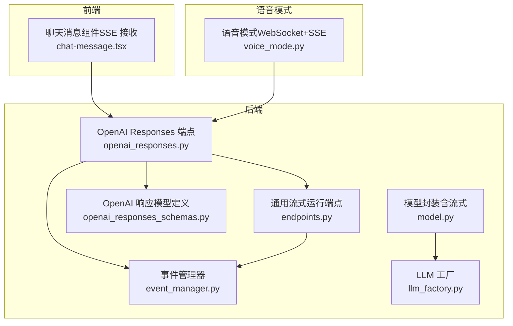
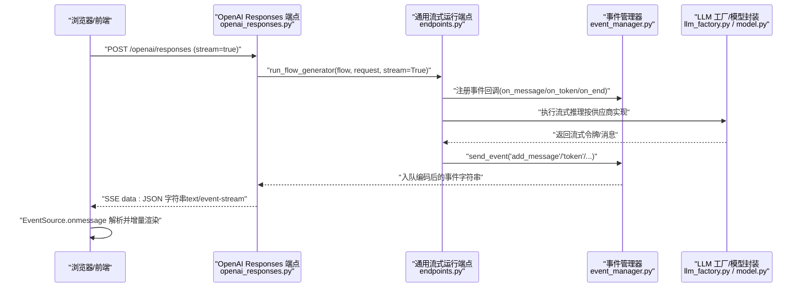
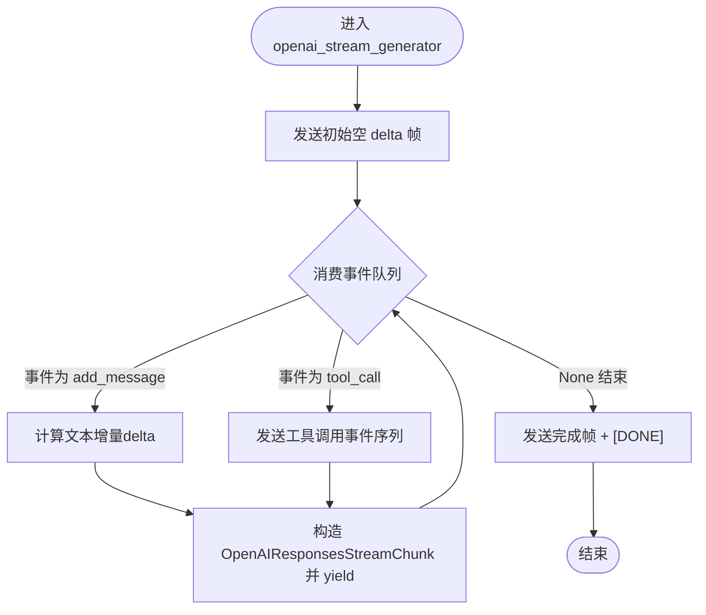
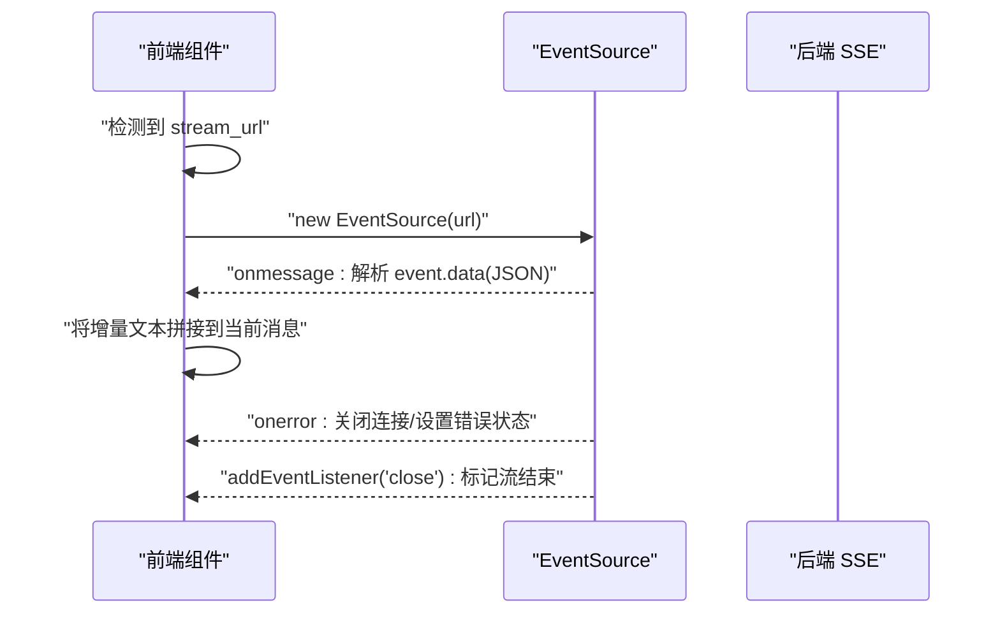
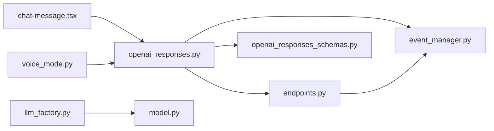

# 流式响应实现

<cite>
**本文引用的文件**
- [openai_responses.py](file://vibe_surf/langflow/api/v1/openai_responses.py)
- [endpoints.py](file://vibe_surf/langflow/api/v1/endpoints.py)
- [event_manager.py](file://vibe_surf/langflow/events/event_manager.py)
- [openai_responses_schemas.py](file://vibe_surf/langflow/schema/openai_responses_schemas.py)
- [chat-message.tsx](file://vibe_surf/frontend/src/modals/IOModal/components/chatView/chatMessage/chat-message.tsx)
- [voice_mode.py](file://vibe_surf/langflow/api/v1/voice_mode.py)
- [llm_factory.py](file://vibe_surf/backend/utils/llm_factory.py)
- [model.py](file://vibe_surf/langflow/base/models/model.py)
</cite>

## 目录
1. [简介](#简介)
2. [项目结构](#项目结构)
3. [核心组件](#核心组件)
4. [架构总览](#架构总览)
5. [详细组件分析](#详细组件分析)
6. [依赖关系分析](#依赖关系分析)
7. [性能考量](#性能考量)
8. [故障排查指南](#故障排查指南)
9. [结论](#结论)
10. [附录](#附录)

## 简介
本文件系统性文档化 VibeSurf 中 LLM 流式响应的实现机制，覆盖后端基于生成器与事件队列的实时分块输出、SSE 协议与消息格式规范、前端 EventSource 接收与渲染、错误处理与重试策略、以及性能优化建议。文档同时给出从后端 LLM 调用到前端显示的完整链路参考路径，帮助读者快速理解并扩展该能力。

## 项目结构
围绕“流式响应”的关键代码分布在以下模块：
- 后端 API 层：OpenAI 兼容响应端点、通用流式运行端点、事件管理与消费
- 前端：SSE 接收与增量渲染
- LLM 工厂与模型层：支持不同供应商的流式调用
- 语音模式：结合文本流与音频合成的实时语音输出

图表来源
- [openai_responses.py](file://vibe_surf/langflow/api/v1/openai_responses.py#L1-L120)
- [endpoints.py](file://vibe_surf/langflow/api/v1/endpoints.py#L193-L277)
- [event_manager.py](file://vibe_surf/langflow/events/event_manager.py#L1-L109)
- [openai_responses_schemas.py](file://vibe_surf/langflow/schema/openai_responses_schemas.py#L1-L75)
- [chat-message.tsx](file://vibe_surf/frontend/src/modals/IOModal/components/chatView/chatMessage/chat-message.tsx#L58-L91)
- [voice_mode.py](file://vibe_surf/langflow/api/v1/voice_mode.py#L698-L760)
- [llm_factory.py](file://vibe_surf/backend/utils/llm_factory.py#L1-L215)
- [model.py](file://vibe_surf/langflow/base/models/model.py#L245-L276)

章节来源
- [openai_responses.py](file://vibe_surf/langflow/api/v1/openai_responses.py#L1-L120)
- [endpoints.py](file://vibe_surf/langflow/api/v1/endpoints.py#L193-L277)
- [event_manager.py](file://vibe_surf/langflow/events/event_manager.py#L1-L109)
- [openai_responses_schemas.py](file://vibe_surf/langflow/schema/openai_responses_schemas.py#L1-L75)
- [chat-message.tsx](file://vibe_surf/frontend/src/modals/IOModal/components/chatView/chatMessage/chat-message.tsx#L58-L91)
- [voice_mode.py](file://vibe_surf/langflow/api/v1/voice_mode.py#L698-L760)
- [llm_factory.py](file://vibe_surf/backend/utils/llm_factory.py#L1-L215)
- [model.py](file://vibe_surf/langflow/base/models/model.py#L245-L276)

## 核心组件
- OpenAI 兼容流式响应端点：负责将 Langflow 事件转换为 OpenAI 风格的 SSE 数据帧，并以 text/event-stream 返回。
- 通用流式运行端点：提供基础的 SSE 流式输出，用于非 OpenAI 兼容场景或内部工具链。
- 事件管理器：统一将“消息”“令牌”“结束”等事件编码为标准 JSON 字符串并入队，供消费端按序拉取。
- 前端 SSE 接收：通过 EventSource 持续接收后端推送的数据帧，解析并增量更新聊天内容。
- LLM 工厂与模型封装：抽象不同供应商的流式调用，确保后端可按需切换与扩展。
- 语音模式：在文本流基础上，将文本片段切分为音频片段并以 SSE 或 WebSocket 推送，实现“边说边听”。

章节来源
- [openai_responses.py](file://vibe_surf/langflow/api/v1/openai_responses.py#L96-L123)
- [endpoints.py](file://vibe_surf/langflow/api/v1/endpoints.py#L325-L347)
- [event_manager.py](file://vibe_surf/langflow/events/event_manager.py#L68-L108)
- [chat-message.tsx](file://vibe_surf/frontend/src/modals/IOModal/components/chatView/chatMessage/chat-message.tsx#L58-L91)
- [llm_factory.py](file://vibe_surf/backend/utils/llm_factory.py#L23-L215)
- [model.py](file://vibe_surf/langflow/base/models/model.py#L245-L276)
- [voice_mode.py](file://vibe_surf/langflow/api/v1/voice_mode.py#L875-L924)

## 架构总览
下图展示了从客户端请求到后端事件生成再到前端渲染的整体流程。

图表来源
- [openai_responses.py](file://vibe_surf/langflow/api/v1/openai_responses.py#L96-L123)
- [endpoints.py](file://vibe_surf/langflow/api/v1/endpoints.py#L228-L277)
- [event_manager.py](file://vibe_surf/langflow/events/event_manager.py#L68-L108)
- [llm_factory.py](file://vibe_surf/backend/utils/llm_factory.py#L23-L215)
- [model.py](file://vibe_surf/langflow/base/models/model.py#L245-L276)

## 详细组件分析

### 后端：OpenAI 兼容流式响应端点
- 功能要点
  - 将 Langflow 的事件流转换为 OpenAI 风格的 SSE 数据帧，包含“工具调用”“文本增量”“完成标记”等。
  - 使用 asyncio 队列与事件管理器协作，保证事件顺序与客户端消费确认。
  - 在异常时返回 OpenAI 风格错误对象；在结束时发送 [DONE] 标记。
- 关键实现路径
  - 生成器与 SSE 输出：[openai_stream_generator](file://vibe_surf/langflow/api/v1/openai_responses.py#L102-L123)
  - 文本增量计算与 delta 发送：[文本增量逻辑](file://vibe_surf/langflow/api/v1/openai_responses.py#L264-L291)
  - 工具调用事件与完成事件：[工具事件序列](file://vibe_surf/langflow/api/v1/openai_responses.py#L173-L262)
  - 错误处理与最终完成帧：[错误与完成帧](file://vibe_surf/langflow/api/v1/openai_responses.py#L304-L314)
  - 返回 StreamingResponse 并设置 SSE 头：[SSE 响应头](file://vibe_surf/langflow/api/v1/openai_responses.py#L315-L323)

图表来源
- [openai_responses.py](file://vibe_surf/langflow/api/v1/openai_responses.py#L102-L123)
- [openai_responses.py](file://vibe_surf/langflow/api/v1/openai_responses.py#L264-L303)

章节来源
- [openai_responses.py](file://vibe_surf/langflow/api/v1/openai_responses.py#L96-L123)
- [openai_responses.py](file://vibe_surf/langflow/api/v1/openai_responses.py#L173-L262)
- [openai_responses.py](file://vibe_surf/langflow/api/v1/openai_responses.py#L264-L303)
- [openai_responses.py](file://vibe_surf/langflow/api/v1/openai_responses.py#L304-L314)

### 后端：通用流式运行端点
- 功能要点
  - 提供基础的 text/event-stream 流式输出，便于内部工具链复用。
  - 通过 consume_and_yield 将队列事件转为 SSE 数据帧，支持客户端断开时取消任务。
- 关键实现路径
  - 事件消费与 SSE 输出：[consume_and_yield](file://vibe_surf/langflow/api/v1/endpoints.py#L193-L226)
  - 运行流式任务与 SSE 返回：[run_flow_generator](file://vibe_surf/langflow/api/v1/endpoints.py#L228-L277)
  - SSE 响应创建与断连处理：[SSE 创建](file://vibe_surf/langflow/api/v1/endpoints.py#L325-L347)

章节来源
- [endpoints.py](file://vibe_surf/langflow/api/v1/endpoints.py#L193-L226)
- [endpoints.py](file://vibe_surf/langflow/api/v1/endpoints.py#L228-L277)
- [endpoints.py](file://vibe_surf/langflow/api/v1/endpoints.py#L325-L347)

### 事件管理器与事件消费
- 功能要点
  - 统一注册事件回调（如 on_message、on_token、on_end），并将事件编码为 JSON 字符串入队。
  - 提供 create_stream_tokens_event_manager 专用于流式令牌与消息的事件管理。
- 关键实现路径
  - 事件注册与发送：[send_event/register_event](file://vibe_surf/langflow/events/event_manager.py#L30-L108)
  - 事件消费与客户端确认：[consume_and_yield](file://vibe_surf/langflow/api/v1/endpoints.py#L193-L226)

章节来源
- [event_manager.py](file://vibe_surf/langflow/events/event_manager.py#L30-L108)
- [endpoints.py](file://vibe_surf/langflow/api/v1/endpoints.py#L193-L226)

### 前端：SSE 接收与增量渲染
- 功能要点
  - 通过 EventSource 订阅后端 SSE 流，解析每条消息的 JSON 数据，将增量文本拼接到当前消息。
  - 断流时关闭连接、清理状态，并可触发错误提示。
- 关键实现路径
  - SSE 接收与错误处理：[streamChunks](file://vibe_surf/frontend/src/modals/IOModal/components/chatView/chatMessage/chat-message.tsx#L58-L91)

图表来源
- [chat-message.tsx](file://vibe_surf/frontend/src/modals/IOModal/components/chatView/chatMessage/chat-message.tsx#L58-L91)

章节来源
- [chat-message.tsx](file://vibe_surf/frontend/src/modals/IOModal/components/chatView/chatMessage/chat-message.tsx#L58-L91)

### LLM 工厂与模型封装（流式）
- 功能要点
  - 支持多种供应商（OpenAI、Anthropic、Google、Azure OpenAI、Groq、Ollama、OpenRouter、DeepSeek、AWS Bedrock、OpenAI 兼容等）。
  - 在模型封装中根据是否启用流式参数选择不同的调用路径，确保后端能持续产出令牌。
- 关键实现路径
  - LLM 实例创建与参数映射：[create_llm_from_profile](file://vibe_surf/backend/utils/llm_factory.py#L23-L215)
  - 模型封装中的流式处理入口：[_handle_stream](file://vibe_surf/langflow/base/models/model.py#L271-L276)

章节来源
- [llm_factory.py](file://vibe_surf/backend/utils/llm_factory.py#L23-L215)
- [model.py](file://vibe_surf/langflow/base/models/model.py#L245-L276)

### 语音模式（文本流+音频合成）
- 功能要点
  - 将文本增量按标点切分为音频片段，使用 ElevenLabs 或 OpenAI TTS 生成音频流，并通过 SSE/WS 推送。
  - 支持实时打断与会话管理。
- 关键实现路径
  - 文本切片与音频生成循环：[get_chunks + audio_chunks](file://vibe_surf/langflow/api/v1/voice_mode.py#L875-L924)
  - WebSocket 会话与事件转发：[flow_as_tool_websocket](file://vibe_surf/langflow/api/v1/voice_mode.py#L698-L760)

章节来源
- [voice_mode.py](file://vibe_surf/langflow/api/v1/voice_mode.py#L875-L924)
- [voice_mode.py](file://vibe_surf/langflow/api/v1/voice_mode.py#L698-L760)

## 依赖关系分析
- 后端依赖
  - OpenAI 兼容端点依赖通用流式运行端点与事件管理器。
  - 通用流式运行端点依赖事件管理器与队列消费。
  - LLM 工厂与模型封装为推理层提供统一接口。
- 前端依赖
  - 前端组件依赖后端 SSE 端点提供的数据格式。
- 语音模式
  - 与 OpenAI 兼容端点共享事件模型，但通过 WebSocket 与音频服务集成。

图表来源
- [openai_responses.py](file://vibe_surf/langflow/api/v1/openai_responses.py#L1-L120)
- [endpoints.py](file://vibe_surf/langflow/api/v1/endpoints.py#L193-L277)
- [event_manager.py](file://vibe_surf/langflow/events/event_manager.py#L1-L109)
- [openai_responses_schemas.py](file://vibe_surf/langflow/schema/openai_responses_schemas.py#L1-L75)
- [chat-message.tsx](file://vibe_surf/frontend/src/modals/IOModal/components/chatView/chatMessage/chat-message.tsx#L58-L91)
- [voice_mode.py](file://vibe_surf/langflow/api/v1/voice_mode.py#L698-L760)
- [llm_factory.py](file://vibe_surf/backend/utils/llm_factory.py#L1-L215)
- [model.py](file://vibe_surf/langflow/base/models/model.py#L245-L276)

## 性能考量
- 网络延迟优化
  - SSE 保持长连接，减少握手开销；后端在首次发送空 delta 帧以尽快建立连接。
  - 前端使用 EventSource 自动重连，避免频繁重建连接。
- 缓冲策略
  - 后端通过 asyncio.Queue 缓存事件，消费端通过 consume_and_yield 及时确认，降低阻塞。
  - 语音模式对文本进行标点切分，控制音频生成粒度，平衡延迟与自然度。
- 内存管理
  - 事件以字符串形式入队，避免大对象长期驻留；异常与完成时及时取消任务。
  - 语音模式使用流式音频生成，避免一次性加载整段音频。
- 可观测性
  - 事件管理器记录事件入队时间与客户端消费耗时，便于定位瓶颈。

章节来源
- [openai_responses.py](file://vibe_surf/langflow/api/v1/openai_responses.py#L116-L123)
- [endpoints.py](file://vibe_surf/langflow/api/v1/endpoints.py#L193-L226)
- [voice_mode.py](file://vibe_surf/langflow/api/v1/voice_mode.py#L875-L924)

## 故障排查指南
- 常见问题
  - SSE 连接立即断开：检查后端是否正确返回 SSE 头与媒体类型；确认前端 EventSource 的 URL 与跨域配置。
  - 文本不显示或只显示首字符：确认后端是否正确计算 delta；前端是否解析了正确的字段。
  - 工具调用未显示：检查工具事件序列是否被发送与去重逻辑是否生效。
  - 语音模式无声：确认文本增量队列是否正常推进，音频生成是否成功。
- 定位方法
  - 查看后端日志与异常分支：[错误处理与异常分支](file://vibe_surf/langflow/api/v1/openai_responses.py#L304-L314)
  - 检查事件队列与消费确认：[consume_and_yield](file://vibe_surf/langflow/api/v1/endpoints.py#L193-L226)
  - 前端 onerror 回调与错误状态上报：[streamChunks](file://vibe_surf/frontend/src/modals/IOModal/components/chatView/chatMessage/chat-message.tsx#L58-L91)

章节来源
- [openai_responses.py](file://vibe_surf/langflow/api/v1/openai_responses.py#L304-L314)
- [endpoints.py](file://vibe_surf/langflow/api/v1/endpoints.py#L193-L226)
- [chat-message.tsx](file://vibe_surf/frontend/src/modals/IOModal/components/chatView/chatMessage/chat-message.tsx#L58-L91)

## 结论
VibeSurf 的流式响应通过“事件驱动 + SSE”的方式实现了从 LLM 到前端的低延迟、可扩展的实时渲染。后端以事件管理器为核心，将不同来源的输出统一编码为标准数据帧；前端以 EventSource 为基础，实现平滑的增量渲染。在语音模式下，进一步将文本流与音频流结合，提供更丰富的交互体验。整体架构具备良好的可扩展性与可观测性，便于后续接入更多供应商与增强功能。

## 附录

### 接口与消息格式规范（SSE）
- 端点
  - OpenAI 兼容流式响应：POST /openai/responses（stream=true）
  - 通用流式运行：POST /run/{flow_id_or_name}（stream=true）
- 媒体类型
  - text/event-stream
- 请求参数（OpenAI 兼容）
  - model: 流程 ID（替代 OpenAI model）
  - input: 输入文本
  - stream: 是否流式
  - background: 是否后台执行
  - tools: 当前不支持
  - previous_response_id: 上次响应 ID（会话延续）
  - include: 包含项（如 tool_call.results）
- 响应数据帧（SSE）
  - data: JSON 字符串，包含事件类型与数据
  - 事件类型
    - add_message：新增消息（含 sender、text、content_blocks 等）
    - token：单个令牌
    - end：执行结束（包含最终结果）
    - error：错误事件
    - response.output_item.added/done：工具调用事件（OpenAI 兼容）
    - response.function_call_arguments.delta/done：工具参数增量事件（OpenAI 兼容）
  - 结束帧
    - data: [DONE]
- 前端解析要点
  - 逐条 onmessage 解析 event.data 为 JSON
  - 对于 OpenAI 兼容端点，解析其中的 delta 或 chunk 字段并增量渲染

章节来源
- [openai_responses.py](file://vibe_surf/langflow/api/v1/openai_responses.py#L427-L562)
- [openai_responses_schemas.py](file://vibe_surf/langflow/schema/openai_responses_schemas.py#L1-L75)
- [endpoints.py](file://vibe_surf/langflow/api/v1/endpoints.py#L228-L277)
- [chat-message.tsx](file://vibe_surf/frontend/src/modals/IOModal/components/chatView/chatMessage/chat-message.tsx#L58-L91)