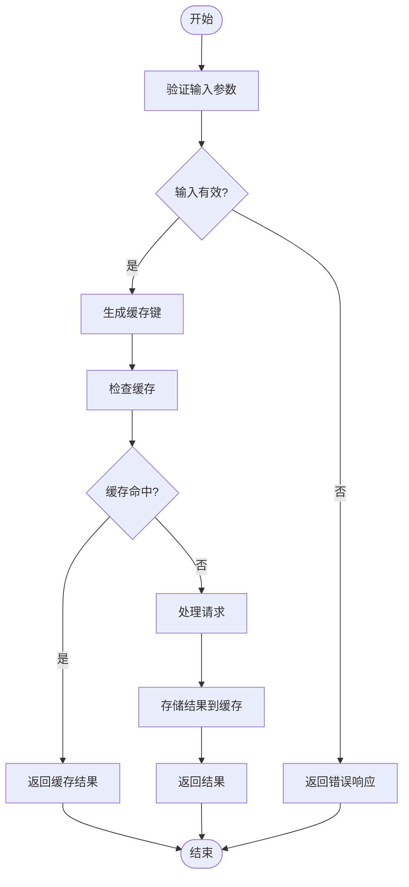
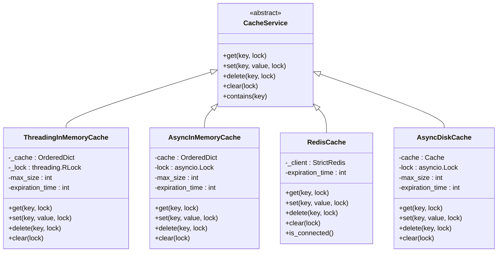
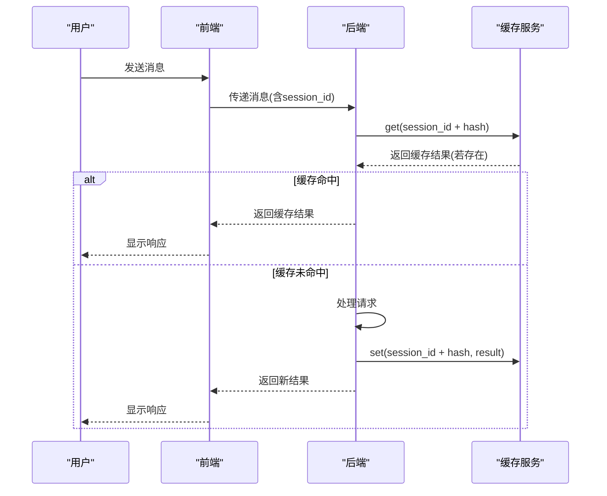
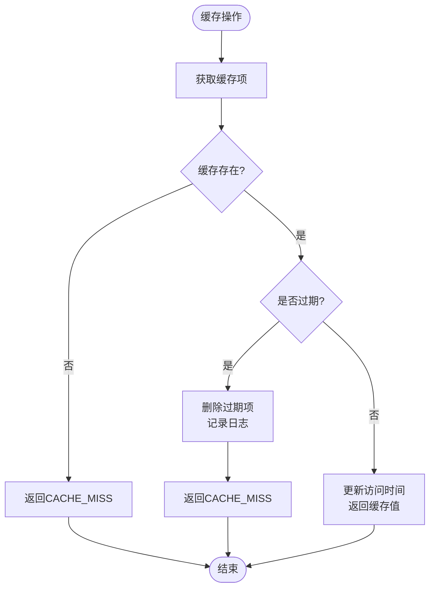
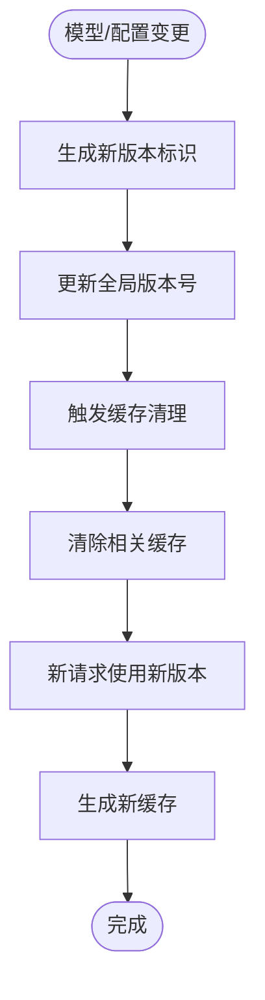

# 缓存策略

<cite>
**本文档引用的文件**   
- [session.py](file://vibe_surf/langflow/services/session/service.py)
- [cache.py](file://vibe_surf/langflow/services/cache/service.py)
- [factory.py](file://vibe_surf/langflow/services/cache/factory.py)
- [disk.py](file://vibe_surf/langflow/services/cache/disk.py)
- [base.py](file://vibe_surf/langflow/services/cache/base.py)
- [utils.py](file://vibe_surf/langflow/services/cache/utils.py)
- [settings.py](file://vibe_surf/langflow/services/settings/service.py)
</cite>

## 目录
1. [输入缓存机制](#输入缓存机制)
2. [输出缓存机制](#输出缓存机制)
3. [上下文缓存设计](#上下文缓存设计)
4. [缓存策略适用场景与性能收益](#缓存策略适用场景与性能收益)
5. [命中率监控与缓存清理](#命中率监控与缓存清理)
6. [配置指南](#配置指南)
7. [缓存一致性问题与解决方案](#缓存一致性问题与解决方案)

## 输入缓存机制

VibeSurf的输入缓存机制通过哈希算法识别重复查询并返回缓存结果。系统使用`compute_dict_hash`函数对输入数据进行哈希处理，生成唯一的缓存键。该函数首先过滤掉不需要缓存的字段（如viewport和chatHistory），然后对剩余数据进行排序并序列化，最后使用SHA256算法生成哈希值。

当接收到新的查询请求时，系统会根据会话ID和输入数据生成缓存键。如果会话ID为空，则会生成一个随机的会话ID。缓存键的格式为`{session_id}:{json_hash}`，确保了不同会话之间的缓存隔离。



**图示来源**
- [session.py](file://vibe_surf/langflow/services/session/service.py#L42-L51)
- [utils.py](file://vibe_surf/langflow/services/cache/utils.py#L13-L18)

## 输出缓存机制

VibeSurf提供了多种缓存存储后端选择，包括内存、Redis和磁盘缓存。缓存类型通过配置服务进行管理，允许在运行时动态切换。

### 缓存存储后端

**内存缓存**：系统提供了两种内存缓存实现：
- `ThreadingInMemoryCache`：基于线程锁的同步内存缓存，适用于多线程环境
- `AsyncInMemoryCache`：基于异步锁的异步内存缓存，适用于异步I/O密集型应用

**Redis缓存**：通过`RedisCache`类实现，支持连接字符串、主机/端口等多种连接方式。Redis缓存具有持久化和分布式特性，适合生产环境使用。

**磁盘缓存**：使用`AsyncDiskCache`实现，将缓存数据持久化到磁盘。磁盘缓存适合存储大量数据，但访问速度相对较慢。

### 过期策略

所有缓存实现都支持基于时间的过期策略。当缓存项的存活时间超过预设的过期时间（默认1小时）时，系统会在下次访问时自动删除该缓存项。过期检查在获取缓存值时进行，确保不会返回已过期的数据。



**图示来源**
- [cache.py](file://vibe_surf/langflow/services/cache/service.py#L22-L354)
- [disk.py](file://vibe_surf/langflow/services/cache/disk.py#L13-L95)
- [base.py](file://vibe_surf/langflow/services/cache/base.py#L12-L183)

## 上下文缓存设计

上下文缓存主要用于缓存对话历史，以减少重复计算。系统通过会话ID来组织和管理对话上下文，每个会话都有独立的上下文缓存空间。

当用户发起新的对话时，系统会为该会话创建一个唯一的会话ID。所有与该会话相关的上下文信息（包括用户输入、AI响应、工具调用结果等）都会与该会话ID关联并存储在缓存中。这种设计确保了不同用户之间的对话上下文完全隔离。

上下文缓存的更新策略采用写时更新模式。每当有新的对话内容产生时，系统会立即将其写入缓存。同时，系统会定期清理过期的会话缓存，以释放内存资源。



**图示来源**
- [session.py](file://vibe_surf/langflow/services/session/service.py#L53-L62)
- [cache.py](file://vibe_surf/langflow/services/cache/service.py#L302-L315)

## 缓存策略适用场景与性能收益

不同的缓存策略适用于不同的应用场景，具有各自的性能特点和收益。

### 适用场景分析

**内存缓存**：适用于单机部署、对延迟要求极高的场景。由于数据存储在内存中，访问速度最快，但容量受限于物理内存大小，且在服务重启后数据会丢失。

**Redis缓存**：适用于分布式部署、需要高可用性和数据持久化的生产环境。Redis作为独立的缓存服务器，可以被多个应用实例共享，支持数据持久化和集群部署。

**磁盘缓存**：适用于需要存储大量缓存数据且对访问速度要求不高的场景。磁盘缓存可以存储比内存更大的数据量，但访问延迟较高。

### 性能收益

通过缓存机制，VibeSurf能够显著提升系统性能：
- **降低响应延迟**：对于重复查询，可以直接从缓存返回结果，避免了复杂的计算过程
- **减少计算资源消耗**：避免了对相同输入的重复计算，节省了CPU和内存资源
- **提高系统吞吐量**：更快的响应速度使得系统能够处理更多的并发请求

## 命中率监控与缓存清理

系统提供了完善的缓存命中率监控和清理机制，确保缓存的有效性和资源的合理利用。

### 命中率监控

虽然当前代码中没有直接的命中率统计功能，但可以通过日志分析来间接监控缓存命中情况。系统在缓存项过期时会记录日志信息，这些日志可以用于分析缓存的使用效率。

### 缓存清理机制

系统实现了多种缓存清理策略：
- **自动过期清理**：基于时间的过期策略，自动删除超过设定时间的缓存项
- **容量限制清理**：当缓存达到最大容量时，采用LRU（最近最少使用）算法清理最久未访问的缓存项
- **手动清理**：提供API接口允许手动清除特定会话或全部缓存



**图示来源**
- [cache.py](file://vibe_surf/langflow/services/cache/service.py#L71-L79)
- [disk.py](file://vibe_surf/langflow/services/cache/disk.py#L33-L41)

## 配置指南

缓存系统的配置主要通过`SettingsService`进行管理。用户可以根据应用场景调整各种缓存参数。

### 配置参数

**通用缓存参数**：
- `cache_expire`：缓存过期时间（秒），默认3600秒（1小时）
- `max_size`：缓存最大容量，None表示无限制

**Redis特定参数**：
- `redis_host`：Redis服务器主机地址
- `redis_port`：Redis服务器端口
- `redis_db`：Redis数据库编号
- `redis_url`：Redis连接URL
- `redis_cache_expire`：Redis缓存过期时间

**磁盘缓存参数**：
- `cache_dir`：磁盘缓存目录
- `config_dir`：配置文件目录

### 配置示例

```python
# 创建缓存服务工厂
factory = CacheServiceFactory()

# 获取设置服务
settings_service = SettingsService.initialize()

# 根据配置创建相应的缓存服务
cache_service = factory.create(settings_service)
```

**代码来源**
- [factory.py](file://vibe_surf/langflow/services/cache/factory.py#L25-L44)
- [settings.py](file://vibe_surf/langflow/services/settings/service.py#L8-L33)

## 缓存一致性问题与解决方案

缓存一致性是缓存系统面临的重要挑战，特别是在模型更新或数据变更时。

### 一致性问题

主要的一致性问题包括：
- **模型更新**：当LLM模型更新后，基于旧模型生成的缓存结果可能不再准确
- **数据变更**：当底层数据发生变化时，相关的缓存结果可能已过时
- **配置变更**：当系统配置发生变化时，原有的缓存可能不再适用

### 解决方案

VibeSurf通过以下机制解决缓存一致性问题：

**版本化缓存键**：在缓存键中包含模型版本或配置哈希值，确保不同版本的模型使用独立的缓存空间。

**主动失效机制**：当检测到模型更新或重要配置变更时，主动清除相关缓存。系统提供了`clear_session`和`clear`方法用于清除特定会话或全局缓存。

**合理的过期策略**：通过设置适当的过期时间，确保缓存不会长期持有过时的数据。

**条件性缓存**：对于可能频繁变更的数据，采用更短的过期时间或不进行缓存。



**图示来源**
- [session.py](file://vibe_surf/langflow/services/session/service.py#L59-L62)
- [cache.py](file://vibe_surf/langflow/services/cache/service.py#L144-L147)