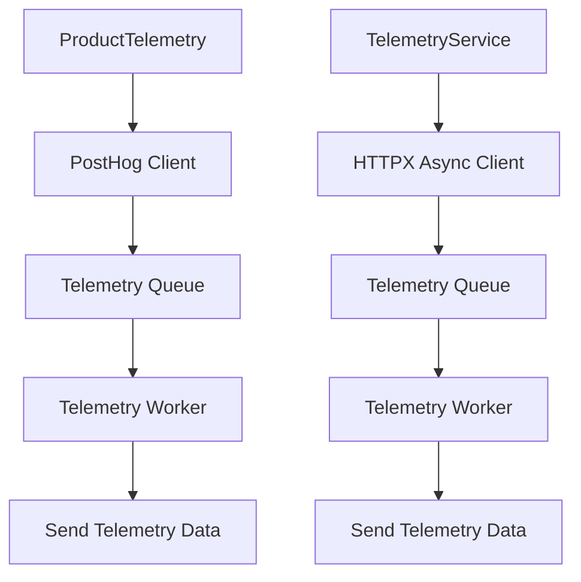
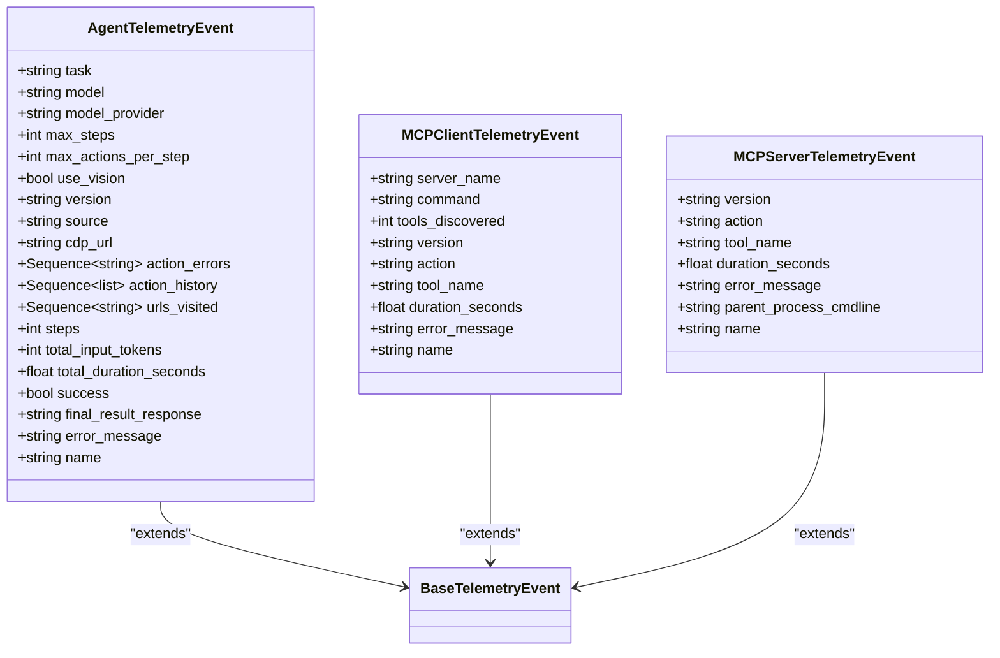
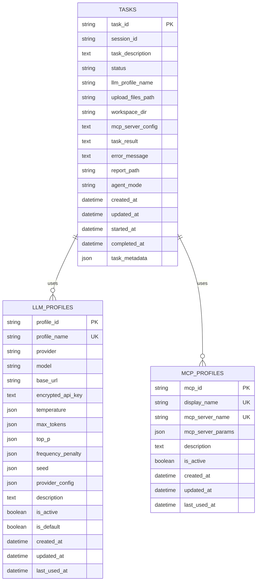
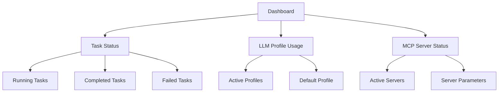
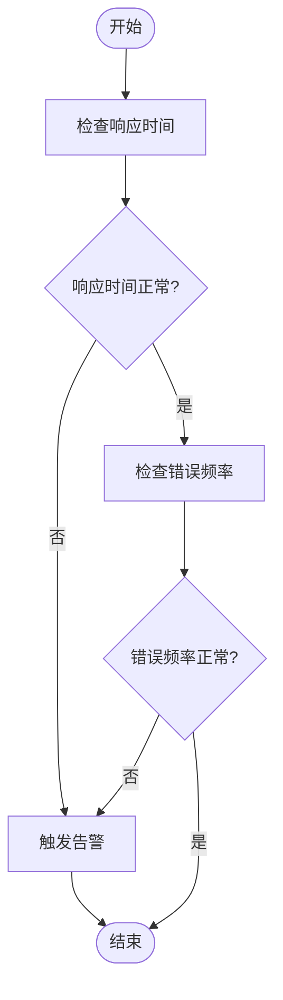
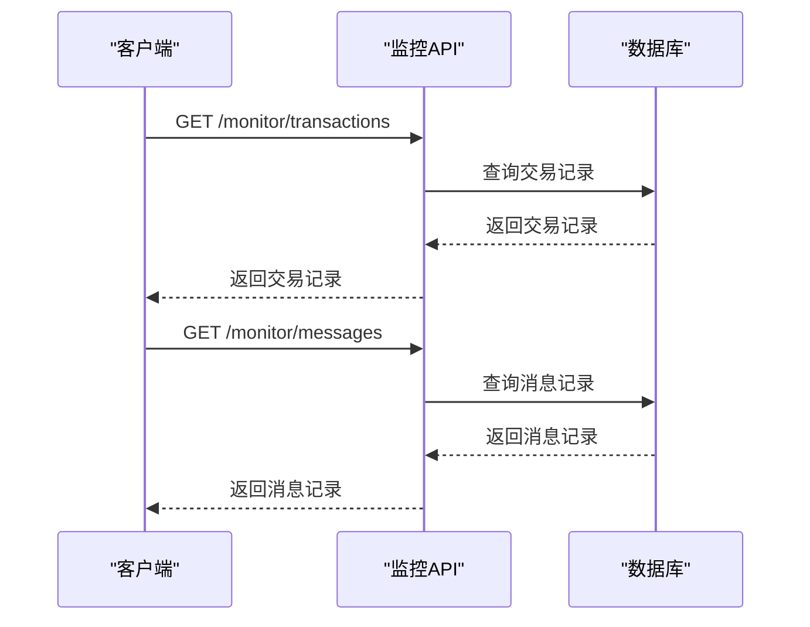

# 遥测与监控

<cite>
**本文档引用的文件**   
- [service.py](file://vibe_surf/telemetry/service.py)
- [views.py](file://vibe_surf/telemetry/views.py)
- [__init__.py](file://vibe_surf/telemetry/__init__.py)
- [service.py](file://vibe_surf/langflow/services/telemetry/service.py)
- [opentelemetry.py](file://vibe_surf/langflow/services/telemetry/opentelemetry.py)
- [models.py](file://vibe_surf/backend/database/models.py)
- [queries.py](file://vibe_surf/backend/database/queries.py)
- [main.py](file://vibe_surf/backend/main.py)
- [monitor.py](file://vibe_surf/langflow/api/v1/monitor.py)
</cite>

## 目录
1. [引言](#引言)
2. [遥测服务架构](#遥测服务架构)
3. [LLM调用指标收集](#llm调用指标收集)
4. [监控数据存储与查询](#监控数据存储与查询)
5. [实时监控仪表板](#实时监控仪表板)
6. [异常检测算法](#异常检测算法)
7. [监控API使用指南](#监控api使用指南)
8. [安全考虑](#安全考虑)
9. [结论](#结论)

## 引言
VibeSurf的遥测与监控系统旨在全面收集、存储和分析系统运行时的关键性能指标，特别是LLM（大语言模型）调用的相关数据。该系统通过集成PostHog和OpenTelemetry等技术，实现了对响应时间、令牌使用量、错误类型和频率等关键指标的精细化监控。系统不仅支持历史数据分析和趋势预测，还提供了实时监控仪表板，帮助用户直观地了解系统状态。此外，系统内置了异常检测算法，能够及时识别性能退化和潜在故障，确保系统的稳定运行。

## 遥测服务架构
VibeSurf的遥测服务架构基于`ProductTelemetry`类和`TelemetryService`类构建，分别位于`vibe_surf/telemetry/service.py`和`vibe_surf/langflow/services/telemetry/service.py`文件中。`ProductTelemetry`类负责捕获匿名化的遥测数据，通过环境变量`VIBESURF_ANONYMIZED_TELEMETRY`控制是否启用遥测功能。当遥测功能启用时，系统会初始化PostHog客户端，并生成或读取用户ID以确保数据的匿名性。`TelemetryService`类则进一步扩展了遥测功能，支持异步数据发送和队列管理，确保数据传输的高效性和可靠性。

**Diagram sources**
- [service.py](file://vibe_surf/telemetry/service.py#L23-L114)
- [service.py](file://vibe_surf/langflow/services/telemetry/service.py#L35-L282)

**Section sources**
- [service.py](file://vibe_surf/telemetry/service.py#L1-L114)
- [service.py](file://vibe_surf/langflow/services/telemetry/service.py#L1-L282)

## LLM调用指标收集
VibeSurf的遥测系统通过定义多种遥测事件来收集LLM调用的关键性能指标。这些事件包括`AgentTelemetryEvent`、`MCPClientTelemetryEvent`、`MCPServerTelemetryEvent`等，均在`vibe_surf/telemetry/views.py`文件中定义。每个事件都包含了详细的属性，如任务描述、模型名称、最大步数、最大动作数、是否使用视觉、版本、来源、CDP URL、动作错误、动作历史、访问的URL、步数、总输入令牌数、总持续时间、成功状态、最终结果响应和错误消息等。这些属性共同构成了LLM调用的完整上下文，为后续的分析提供了丰富的数据支持。

**Diagram sources**
- [views.py](file://vibe_surf/telemetry/views.py#L24-L80)

**Section sources**
- [views.py](file://vibe_surf/telemetry/views.py#L1-L189)

## 监控数据存储与查询
VibeSurf的监控数据存储在SQLite数据库中，数据库路径由环境变量`LANGFLOW_DATABASE_URL`指定。数据库中包含多个表，如`tasks`、`llm_profiles`、`mcp_profiles`等，用于存储任务、LLM配置、MCP服务器配置等信息。`vibe_surf/backend/database/models.py`文件定义了这些表的结构，而`vibe_surf/backend/database/queries.py`文件则提供了对这些表的查询操作。通过这些查询操作，可以方便地获取任务的执行状态、LLM配置的使用情况、MCP服务器的状态等信息。

**Diagram sources**
- [models.py](file://vibe_surf/backend/database/models.py#L1-L289)

**Section sources**
- [models.py](file://vibe_surf/backend/database/models.py#L1-L289)
- [queries.py](file://vibe_surf/backend/database/queries.py#L1-L800)

## 实时监控仪表板
VibeSurf的实时监控仪表板通过前端React应用实现，位于`vibe_surf/frontend/src`目录下。仪表板提供了多个视图，包括任务状态、LLM配置使用情况、MCP服务器状态等。用户可以通过仪表板直观地查看系统的运行状态，包括当前正在运行的任务、最近完成的任务、失败的任务等。此外，仪表板还支持自定义查询，用户可以根据需要筛选和过滤数据，以便更深入地分析系统性能。

**Diagram sources**
- [index.tsx](file://vibe_surf/frontend/src/pages/DashboardWrapperPage/index.tsx#L1-L16)

**Section sources**
- [index.tsx](file://vibe_surf/frontend/src/pages/DashboardWrapperPage/index.tsx#L1-L16)

## 异常检测算法
VibeSurf的异常检测算法通过分析LLM调用的响应时间和错误频率来识别性能退化和潜在故障。系统会定期检查每个任务的执行情况，如果发现某个任务的响应时间显著增加或错误频率异常升高，就会触发告警。此外，系统还支持自定义告警阈值，用户可以根据实际需求调整告警条件，以确保告警的准确性和及时性。

**Diagram sources**
- [anti_detection.py](file://vibe_surf/workflows/Recruitment/boss_zhipin/anti_detection.py#L273-L545)

**Section sources**
- [anti_detection.py](file://vibe_surf/workflows/Recruitment/boss_zhipin/anti_detection.py#L273-L545)

## 监控API使用指南
VibeSurf提供了丰富的监控API，支持外部系统集成。这些API位于`vibe_surf/langflow/api/v1/monitor.py`文件中，主要包括获取任务状态、查询LLM配置使用情况、获取MCP服务器状态等功能。用户可以通过HTTP请求调用这些API，获取所需的监控数据。例如，通过`GET /monitor/transactions`可以获取所有交易记录，通过`GET /monitor/messages`可以获取所有消息记录。

**Diagram sources**
- [monitor.py](file://vibe_surf/langflow/api/v1/monitor.py)

**Section sources**
- [monitor.py](file://vibe_surf/langflow/api/v1/monitor.py)

## 安全考虑
VibeSurf的遥测与监控系统在设计时充分考虑了安全因素。首先，所有遥测数据都是匿名化的，不会包含用户的敏感信息。其次，系统通过环境变量`VIBESURF_ANONYMIZED_TELEMETRY`控制是否启用遥测功能，用户可以根据需要选择是否开启。此外，系统还支持通过API密钥进行访问控制，确保只有授权的用户才能访问监控数据。最后，系统会定期清理过期的监控数据，以减少数据泄露的风险。

**Section sources**
- [service.py](file://vibe_surf/telemetry/service.py#L39-L42)
- [service.py](file://vibe_surf/langflow/services/telemetry/service.py#L60-L61)

## 结论
VibeSurf的遥测与监控系统通过集成PostHog和OpenTelemetry等技术，实现了对LLM调用关键性能指标的全面收集和分析。系统不仅支持历史数据分析和趋势预测，还提供了实时监控仪表板和异常检测算法，帮助用户及时发现和解决性能问题。此外，系统还提供了丰富的监控API，支持外部系统集成，确保了系统的灵活性和可扩展性。通过这些功能，VibeSurf能够为用户提供一个稳定、高效的LLM调用环境。