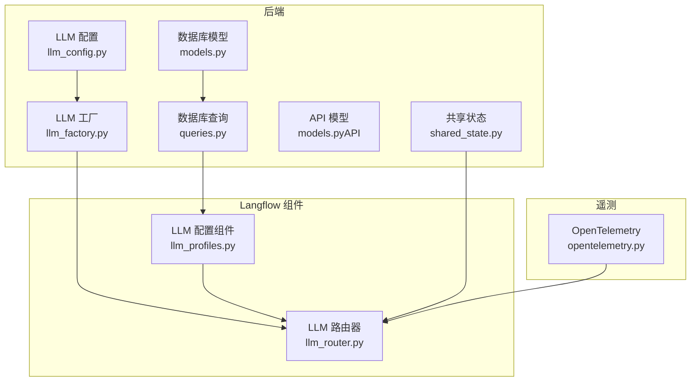
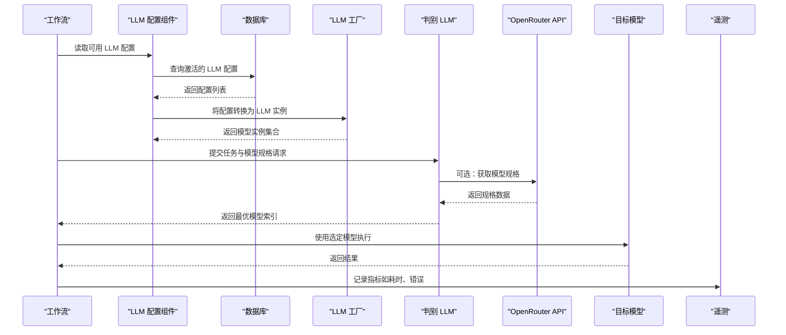
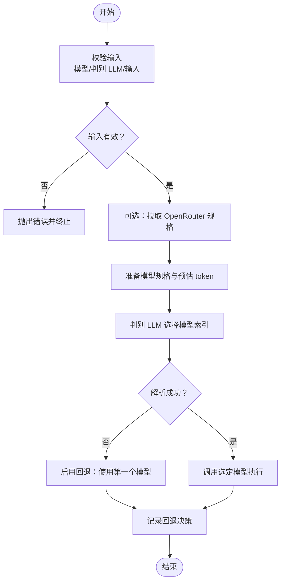
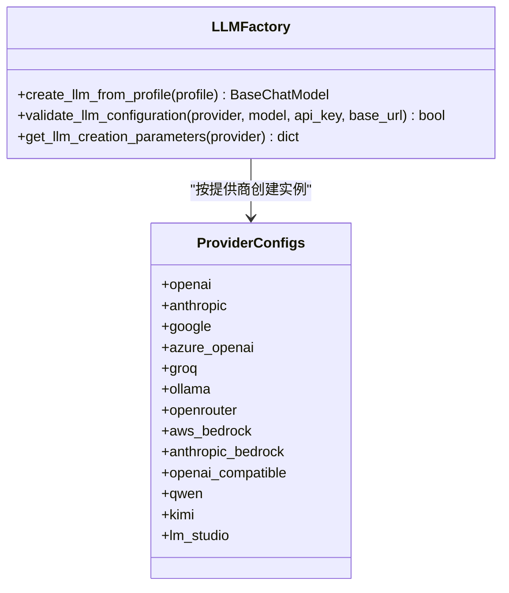
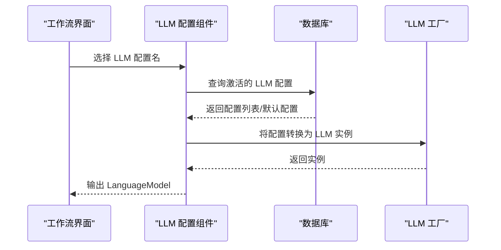
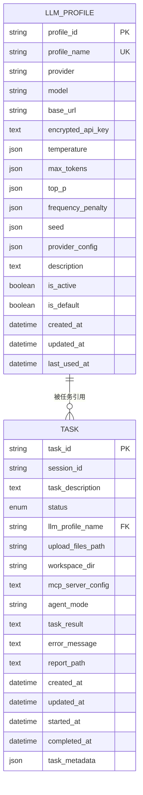
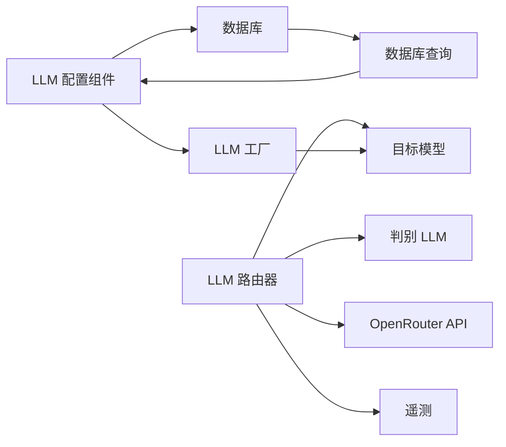

# 多模型编排

<cite>
**本文引用的文件列表**
- [llm_config.py](file://vibe_surf/backend/llm_config.py)
- [llm_factory.py](file://vibe_surf/backend/utils/llm_factory.py)
- [llm_profiles.py](file://vibe_surf/workflows/VibeSurf/llm_profiles.py)
- [llm_router.py](file://vibe_surf/langflow/components/processing/llm_router.py)
- [models.py](file://vibe_surf/backend/database/models.py)
- [queries.py](file://vibe_surf/backend/database/queries.py)
- [models.py（API）](file://vibe_surf/backend/api/models.py)
- [opentelemetry.py](file://vibe_surf/langflow/services/telemetry/opentelemetry.py)
- [shared_state.py](file://vibe_surf/backend/shared_state.py)
</cite>

## 目录
1. [简介](#简介)
2. [项目结构](#项目结构)
3. [核心组件](#核心组件)
4. [架构总览](#架构总览)
5. [详细组件分析](#详细组件分析)
6. [依赖关系分析](#依赖关系分析)
7. [性能考量](#性能考量)
8. [故障排查指南](#故障排查指南)
9. [结论](#结论)
10. [附录：配置示例](#附录配置示例)

## 简介
本文件系统性文档化 VibeSurf 的“多模型编排”能力，重点覆盖以下方面：
- 模型路由策略：基于 OpenRouter 规格与任务特征的智能路由，支持质量、速度、成本与平衡等偏好。
- 负载均衡：通过多模型并行评估与选择，避免单点瓶颈；结合失败回退保障可用性。
- 故障转移：在路由或执行阶段出现异常时，自动回退至首个模型，确保流程连续性。
- 模型组合模式：通过工作流将不同模型串联为复杂工作流，实现推理链式组合。
- 性能监控：基于 OpenTelemetry 的可观测性指标，辅助优化模型选择与资源使用。
- 配置示例：提供多场景下的策略配置思路与最佳实践。

## 项目结构
围绕多模型编排的关键代码分布在后端配置与工厂、前端工作流组件、数据库模型与查询、以及遥测服务中。下图给出与“多模型编排”直接相关的主要模块关系。

图表来源
- [llm_config.py](file://vibe_surf/backend/llm_config.py#L1-L226)
- [llm_factory.py](file://vibe_surf/backend/utils/llm_factory.py#L1-L275)
- [llm_router.py](file://vibe_surf/langflow/components/processing/llm_router.py#L1-L500)
- [llm_profiles.py](file://vibe_surf/workflows/VibeSurf/llm_profiles.py#L1-L104)
- [models.py](file://vibe_surf/backend/database/models.py#L57-L137)
- [queries.py](file://vibe_surf/backend/database/queries.py#L1-L264)
- [models.py（API）](file://vibe_surf/backend/api/models.py#L1-L120)
- [opentelemetry.py](file://vibe_surf/langflow/services/telemetry/opentelemetry.py#L1-L253)
- [shared_state.py](file://vibe_surf/backend/shared_state.py#L346-L381)

章节来源
- [llm_config.py](file://vibe_surf/backend/llm_config.py#L1-L226)
- [llm_factory.py](file://vibe_surf/backend/utils/llm_factory.py#L1-L275)
- [llm_router.py](file://vibe_surf/langflow/components/processing/llm_router.py#L1-L500)
- [llm_profiles.py](file://vibe_surf/workflows/VibeSurf/llm_profiles.py#L1-L104)
- [models.py](file://vibe_surf/backend/database/models.py#L57-L137)
- [queries.py](file://vibe_surf/backend/database/queries.py#L1-L264)
- [models.py（API）](file://vibe_surf/backend/api/models.py#L1-L120)
- [opentelemetry.py](file://vibe_surf/langflow/services/telemetry/opentelemetry.py#L1-L253)
- [shared_state.py](file://vibe_surf/backend/shared_state.py#L346-L381)

## 核心组件
- LLM 提供商与模型清单：集中定义支持的提供商与模型，便于统一管理与扩展。
- LLM 工厂：根据配置动态创建不同提供商的 LLM 实例，屏蔽参数差异。
- LLM 路由器：基于“判别 LLM + OpenRouter 规格”的决策机制，按偏好选择最优模型。
- LLM 配置组件：从数据库拉取可用的 LLM 配置，动态生成工作流中的模型输入。
- 数据库模型与查询：存储 LLM 配置、任务与会话信息，支撑运行期选择与追踪。
- 遥测服务：提供计数器、直方图、可观测仪表盘等指标，用于性能与成本分析。

章节来源
- [llm_config.py](file://vibe_surf/backend/llm_config.py#L1-L226)
- [llm_factory.py](file://vibe_surf/backend/utils/llm_factory.py#L1-L275)
- [llm_router.py](file://vibe_surf/langflow/components/processing/llm_router.py#L1-L500)
- [llm_profiles.py](file://vibe_surf/workflows/VibeSurf/llm_profiles.py#L1-L104)
- [models.py](file://vibe_surf/backend/database/models.py#L57-L137)
- [queries.py](file://vibe_surf/backend/database/queries.py#L1-L264)
- [opentelemetry.py](file://vibe_surf/langflow/services/telemetry/opentelemetry.py#L1-L253)

## 架构总览
下图展示“多模型编排”的端到端流程：从配置加载、模型选择、执行到结果输出，并在异常时进行回退。

图表来源
- [llm_profiles.py](file://vibe_surf/workflows/VibeSurf/llm_profiles.py#L53-L104)
- [queries.py](file://vibe_surf/backend/database/queries.py#L144-L173)
- [llm_factory.py](file://vibe_surf/backend/utils/llm_factory.py#L23-L216)
- [llm_router.py](file://vibe_surf/langflow/components/processing/llm_router.py#L298-L442)
- [opentelemetry.py](file://vibe_surf/langflow/services/telemetry/opentelemetry.py#L1-L253)

## 详细组件分析

### LLM 路由器（智能路由与回退）
- 能力概述
  - 输入：一组候选模型、判别 LLM、用户输入、优化偏好（质量/速度/成本/平衡）、是否启用 OpenRouter 规格、超时与回退开关。
  - 决策：可选从 OpenRouter API 获取模型规格，结合任务特征与偏好，由判别 LLM 输出最优模型索引。
  - 执行：调用选定模型生成结果；若路由过程出错且开启回退，则自动改用第一个模型。
  - 输出：最终输出、所选模型信息、路由决策日志。
- 关键流程
  - 准备阶段：构建模型规格字典（名称映射、上下文长度、定价、模态等），估算输入 token 数量。
  - 判别阶段：构造系统提示词与用户消息，提交给判别 LLM，解析其返回的索引。
  - 执行阶段：调用对应模型生成结果；记录路由决策与指标。
  - 回退阶段：捕获异常或解析失败时，自动回退至第一个模型并记录回退原因。
- 参数与行为
  - 优化偏好：影响判别 LLM 的权重与取舍。
  - OpenRouter 规格：提升路由精度，但需网络访问。
  - 超时控制：限制外部 API 请求时间。
  - 回退策略：可配置是否启用自动回退。

图表来源
- [llm_router.py](file://vibe_surf/langflow/components/processing/llm_router.py#L298-L442)

章节来源
- [llm_router.py](file://vibe_surf/langflow/components/processing/llm_router.py#L1-L500)

### LLM 工厂（模型实例化）
- 能力概述
  - 根据配置动态创建不同提供商的 LLM 实例，自动适配参数支持集（温度、最大 token、top_p、频率惩罚、种子等）。
  - 支持多种提供商（OpenAI、Anthropic、Google、Azure OpenAI、Groq、Ollama、OpenRouter、AWS Bedrock、DeepSeek、LM Studio 等）。
  - 对缺失关键参数（如 Azure 的 base_url 或 OpenAI 兼容的 base_url）进行显式校验。
- 关键点
  - 参数支持差异：不同提供商支持的参数不同，工厂按支持集注入。
  - AWS Bedrock 特殊认证：需要 region 等额外参数。
  - 异常日志：创建失败时记录错误并抛出运行时异常。

图表来源
- [llm_factory.py](file://vibe_surf/backend/utils/llm_factory.py#L23-L275)

章节来源
- [llm_factory.py](file://vibe_surf/backend/utils/llm_factory.py#L1-L275)

### LLM 配置组件（工作流中的模型选择）
- 能力概述
  - 动态列出可用的 LLM 配置（仅激活且默认优先），并在运行时根据所选配置创建实际模型实例。
  - 通过数据库查询接口获取配置，解密 API Key 后交由工厂创建实例。
- 关键点
  - 默认配置：支持默认配置优先级，便于快速选择。
  - 实时刷新：支持在构建期动态更新选项列表。

图表来源
- [llm_profiles.py](file://vibe_surf/workflows/VibeSurf/llm_profiles.py#L53-L104)
- [queries.py](file://vibe_surf/backend/database/queries.py#L144-L173)
- [llm_factory.py](file://vibe_surf/backend/utils/llm_factory.py#L23-L216)

章节来源
- [llm_profiles.py](file://vibe_surf/workflows/VibeSurf/llm_profiles.py#L1-L104)
- [queries.py](file://vibe_surf/backend/database/queries.py#L110-L143)
- [llm_factory.py](file://vibe_surf/backend/utils/llm_factory.py#L23-L216)

### 数据库模型与查询（配置与任务）
- LLMProfile：存储模型提供商、模型名、API Key（加密）、参数与元数据，支持默认配置与活跃状态。
- 查询操作：创建、查询、列表、更新、删除、设置默认、更新最后使用时间等。
- Task：关联 LLMProfile 名称，记录任务状态、结果与时间戳，便于追踪与审计。

图表来源
- [models.py](file://vibe_surf/backend/database/models.py#L57-L137)
- [models.py](file://vibe_surf/backend/database/models.py#L138-L170)

章节来源
- [models.py](file://vibe_surf/backend/database/models.py#L57-L137)
- [queries.py](file://vibe_surf/backend/database/queries.py#L21-L88)
- [queries.py](file://vibe_surf/backend/database/queries.py#L144-L173)
- [models.py（API）](file://vibe_surf/backend/api/models.py#L1-L120)

### 遥测与性能监控
- 指标体系
  - 计数器：如文件上传数量、任务完成次数等。
  - 直方图：如响应时间分布，便于识别慢请求。
  - 可观测仪表盘：Prometheus 导出，便于集成 Grafana 等可视化工具。
- 应用建议
  - 在路由与模型调用处埋点，记录模型选择、耗时、错误码等维度。
  - 结合任务状态与模型规格，建立成本与性能的关联分析。

章节来源
- [opentelemetry.py](file://vibe_surf/langflow/services/telemetry/opentelemetry.py#L1-L253)

## 依赖关系分析
- 组件耦合
  - LLM 路由器依赖判别 LLM 与 OpenRouter 规格；对异常具备回退保护。
  - LLM 工厂与配置组件共同决定模型实例化与参数注入。
  - 数据库层提供配置与任务追踪，API 层提供标准化请求/响应模型。
- 外部依赖
  - OpenRouter API：用于获取模型规格，提升路由准确性。
  - Prometheus/OpenTelemetry：用于指标采集与可视化。
- 潜在风险
  - OpenRouter 接口不可用时，可降级为仅使用模型名进行路由。
  - AWS Bedrock 需要正确配置 region 等参数，否则实例化失败。

图表来源
- [llm_router.py](file://vibe_surf/langflow/components/processing/llm_router.py#L1-L500)
- [llm_profiles.py](file://vibe_surf/workflows/VibeSurf/llm_profiles.py#L53-L104)
- [queries.py](file://vibe_surf/backend/database/queries.py#L144-L173)
- [llm_factory.py](file://vibe_surf/backend/utils/llm_factory.py#L23-L216)
- [opentelemetry.py](file://vibe_surf/langflow/services/telemetry/opentelemetry.py#L1-L253)

## 性能考量
- 路由开销
  - OpenRouter 规格拉取：可选启用，建议在高延迟网络或受限环境中关闭以减少额外延迟。
  - 判别 LLM 调用：建议复用判别 LLM 实例，避免重复创建。
- 执行效率
  - 通过参数支持集过滤注入参数，减少无效参数带来的初始化开销。
  - AWS Bedrock 需要正确设置 region，避免因认证失败导致重试。
- 成本控制
  - 基于 OpenRouter 规格中的定价字段进行成本估算，结合优化偏好（成本优先）指导路由。
  - 在遥测中记录每次调用的耗时与错误，辅助成本与性能权衡。

[本节为通用指导，不直接分析具体文件]

## 故障排查指南
- 路由失败
  - 现象：判别 LLM 返回非数字或越界索引。
  - 处理：启用回退到第一个模型；检查输入长度与规格拉取是否成功。
- 实例化失败
  - 现象：创建 LLM 实例时报错（如缺少 base_url 或认证参数）。
  - 处理：核对配置项与提供商要求；检查加密 API Key 是否正确解密。
- OpenRouter 不可用
  - 现象：规格拉取失败或超时。
  - 处理：关闭规格拉取，使用基础模型名进行路由；或在网络恢复后重试。
- AWS Bedrock 参数错误
  - 现象：实例化 AWS Bedrock 报错。
  - 处理：确认 aws_secret_access_key 与 region_name 是否提供。

章节来源
- [llm_router.py](file://vibe_surf/langflow/components/processing/llm_router.py#L408-L442)
- [llm_factory.py](file://vibe_surf/backend/utils/llm_factory.py#L144-L179)
- [llm_factory.py](file://vibe_surf/backend/utils/llm_factory.py#L204-L212)

## 结论
VibeSurf 的多模型编排以“判别 LLM + OpenRouter 规格 + 回退保护”为核心，结合 LLM 工厂与数据库配置，实现了灵活、可扩展且具备韧性的工作流编排。通过遥测指标与任务追踪，用户可以持续优化模型选择策略，兼顾质量、速度与成本。

[本节为总结性内容，不直接分析具体文件]

## 附录：配置示例
以下为不同场景下的策略配置思路与最佳实践（以路径引用代替具体代码片段）：
- 场景一：成本优先
  - 设置优化偏好为“成本”，启用 OpenRouter 规格以获取定价信息；在路由组件中关闭“使用 OpenRouter 规格”可降低延迟但牺牲精度。
  - 参考路径：[llm_router.py](file://vibe_surf/langflow/components/processing/llm_router.py#L50-L80)
- 场景二：高并发与稳定性
  - 使用多个模型并行评估，由判别 LLM 选择；开启回退到第一个模型，确保异常时仍能返回结果。
  - 参考路径：[llm_router.py](file://vibe_surf/langflow/components/processing/llm_router.py#L73-L79)
- 场景三：本地部署与低延迟
  - 使用 Ollama/LM Studio 等本地模型；在工厂中无需 API Key，但需提供 host/base_url。
  - 参考路径：[llm_factory.py](file://vibe_surf/backend/utils/llm_factory.py#L126-L135)
- 场景四：AWS Bedrock 集成
  - 提供 aws_secret_access_key 与 region_name；工厂会自动注入必要参数。
  - 参考路径：[llm_factory.py](file://vibe_surf/backend/utils/llm_factory.py#L152-L165)
- 场景五：默认配置与动态选择
  - 在数据库中设置默认 LLM 配置；工作流组件动态列出可用配置并优先选择默认项。
  - 参考路径：[queries.py](file://vibe_surf/backend/database/queries.py#L214-L249)，[llm_profiles.py](file://vibe_surf/workflows/VibeSurf/llm_profiles.py#L71-L87)

章节来源
- [llm_router.py](file://vibe_surf/langflow/components/processing/llm_router.py#L50-L80)
- [llm_router.py](file://vibe_surf/langflow/components/processing/llm_router.py#L73-L79)
- [llm_factory.py](file://vibe_surf/backend/utils/llm_factory.py#L126-L135)
- [llm_factory.py](file://vibe_surf/backend/utils/llm_factory.py#L152-L165)
- [queries.py](file://vibe_surf/backend/database/queries.py#L214-L249)
- [llm_profiles.py](file://vibe_surf/workflows/VibeSurf/llm_profiles.py#L71-L87)