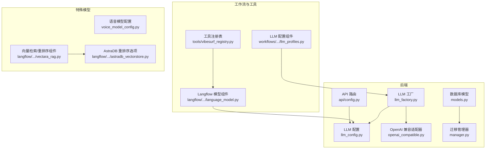
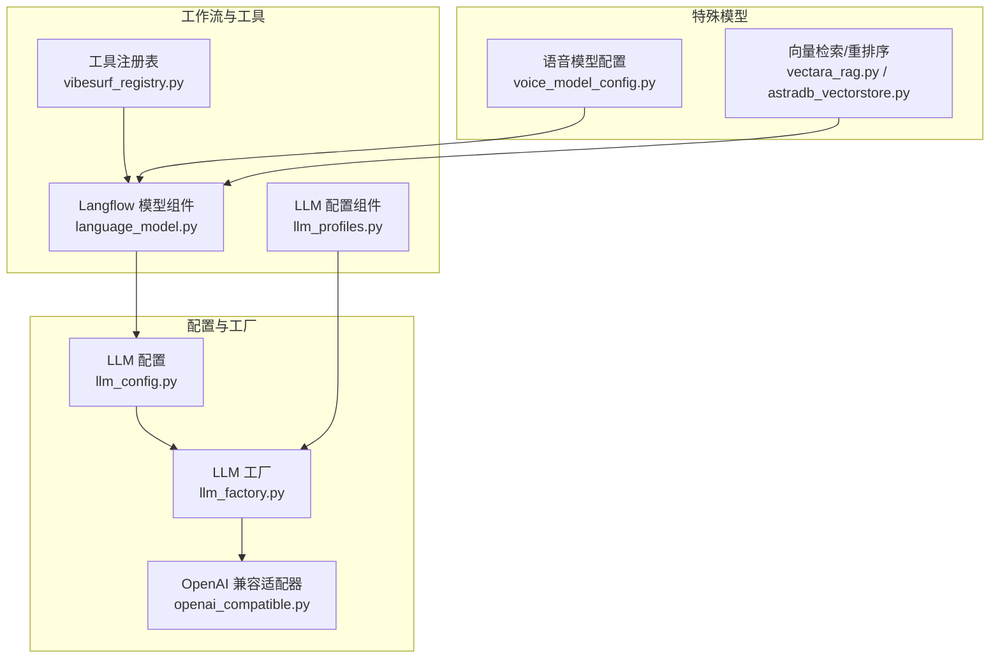
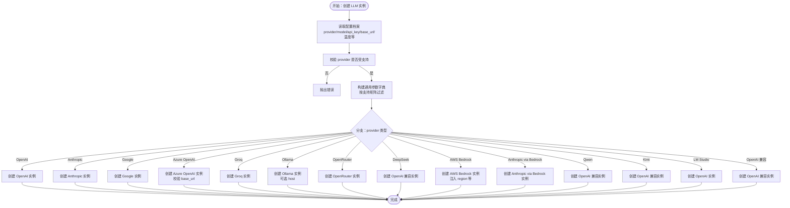
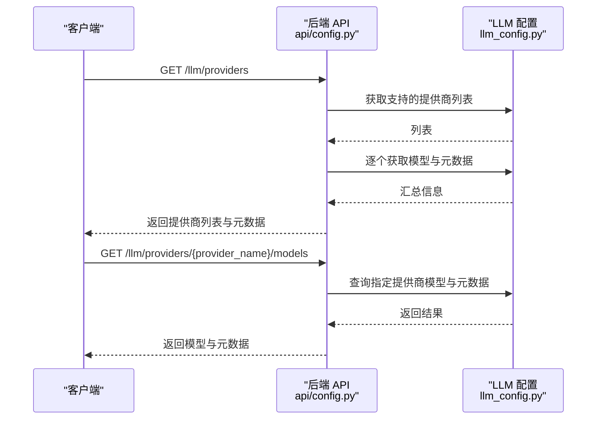
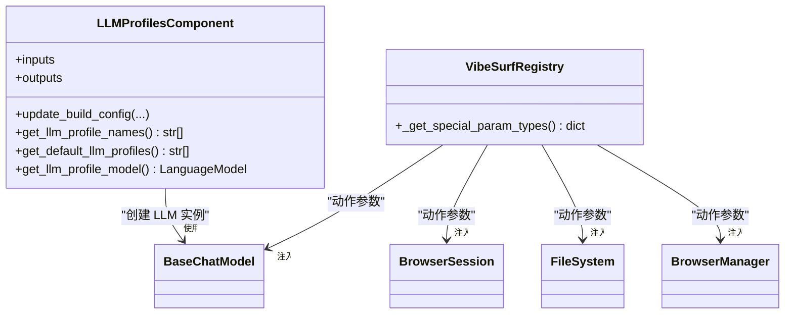
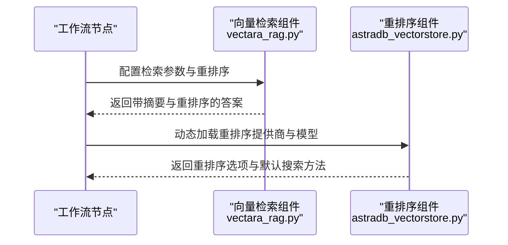
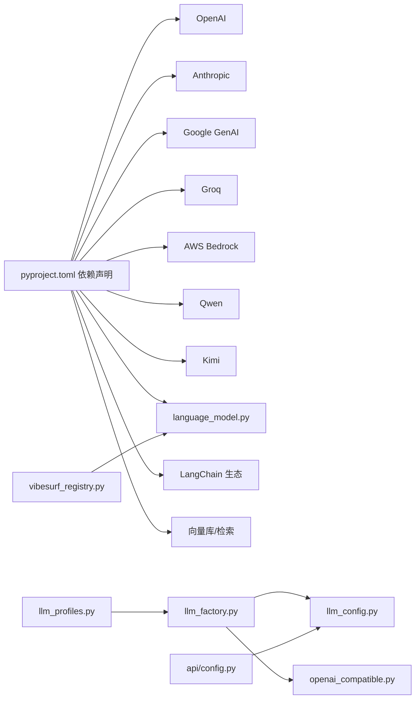

# 扩展与集成

<cite>
**本文引用的文件列表**
- [README.md](file://README.md)
- [pyproject.toml](file://pyproject.toml)
- [vibe_surf/backend/utils/llm_factory.py](file://vibe_surf/backend/utils/llm_factory.py)
- [vibe_surf/backend/llm_config.py](file://vibe_surf/backend/llm_config.py)
- [vibe_surf/llm/openai_compatible.py](file://vibe_surf/llm/openai_compatible.py)
- [vibe_surf/backend/voice_model_config.py](file://vibe_surf/backend/voice_model_config.py)
- [vibe_surf/backend/api/config.py](file://vibe_surf/backend/api/config.py)
- [vibe_surf/workflows/VibeSurf/llm_profiles.py](file://vibe_surf/workflows/VibeSurf/llm_profiles.py)
- [vibe_surf/backend/database/models.py](file://vibe_surf/backend/database/models.py)
- [vibe_surf/backend/database/manager.py](file://vibe_surf/backend/database/manager.py)
- [vibe_surf/tools/vibesurf_registry.py](file://vibe_surf/tools/vibesurf_registry.py)
- [vibe_surf/langflow/components/models/language_model.py](file://vibe_surf/langflow/components/models/language_model.py)
- [vibe_surf/langflow/components/datastax/astradb_vectorstore.py](file://vibe_surf/langflow/components/datastax/astradb_vectorstore.py)
- [vibe_surf/langflow/components/vectara/vectara_rag.py](file://vibe_surf/langflow/components/vectara/vectara_rag.py)
- [tests/test_backend_api.py](file://tests/test_backend_api.py)
</cite>

## 目录
1. [简介](#简介)
2. [项目结构](#项目结构)
3. [核心组件](#核心组件)
4. [架构总览](#架构总览)
5. [详细组件分析](#详细组件分析)
6. [依赖关系分析](#依赖关系分析)
7. [性能考量](#性能考量)
8. [故障排查指南](#故障排查指南)
9. [结论](#结论)
10. [附录](#附录)

## 简介
本文件面向希望在 VibeSurf 中扩展与集成 LLM 的开发者，系统化地梳理了现有 LLM 扩展点、适配器模式、插件与工作流集成、多模型编排、特殊模型（嵌入、重排序、语音）集成、性能基准与版本兼容策略，并提供社区贡献指南。内容以仓库实际代码为依据，避免臆测，便于不同技术背景的读者快速上手。

## 项目结构
围绕 LLM 扩展与集成的关键目录与文件：
- 后端工厂与配置：后端通过工厂统一创建 LLM 实例，集中管理提供商清单与元数据；前端 API 提供查询可用提供商与模型的能力。
- LLM 适配层：提供 OpenAI 兼容适配器，自动修复特定模型的 JSON Schema 限制，增强跨厂商兼容性。
- 数据模型与迁移：数据库模型支持 LLM 配置档案与任务关联，迁移管理器负责 SQLite 版本演进。
- 工作流与工具注册：Langflow 组件与自定义注册表支持将 LLM 配置注入到可视化工作流中，工具注册表提供统一的参数类型约束。
- 特殊模型集成：语音模型配置、向量检索与重排序组件示例展示了嵌入/重排序/语音等专用模型的接入方式。
- 测试与状态：后端 API 测试覆盖配置状态检查，便于验证新提供商集成后的健康度。

图表来源
- [vibe_surf/backend/utils/llm_factory.py](file://vibe_surf/backend/utils/llm_factory.py#L1-L275)
- [vibe_surf/backend/llm_config.py](file://vibe_surf/backend/llm_config.py#L1-L226)
- [vibe_surf/llm/openai_compatible.py](file://vibe_surf/llm/openai_compatible.py#L1-L373)
- [vibe_surf/backend/api/config.py](file://vibe_surf/backend/api/config.py#L585-L642)
- [vibe_surf/workflows/VibeSurf/llm_profiles.py](file://vibe_surf/workflows/VibeSurf/llm_profiles.py#L1-L104)
- [vibe_surf/langflow/components/models/language_model.py](file://vibe_surf/langflow/components/models/language_model.py#L95-L122)
- [vibe_surf/tools/vibesurf_registry.py](file://vibe_surf/tools/vibesurf_registry.py#L1-L53)
- [vibe_surf/backend/database/models.py](file://vibe_surf/backend/database/models.py#L1-L289)
- [vibe_surf/backend/database/manager.py](file://vibe_surf/backend/database/manager.py#L27-L127)
- [vibe_surf/backend/voice_model_config.py](file://vibe_surf/backend/voice_model_config.py#L1-L25)
- [vibe_surf/langflow/components/vectara/vectara_rag.py](file://vibe_surf/langflow/components/vectara/vectara_rag.py#L132-L164)
- [vibe_surf/langflow/components/datastax/astradb_vectorstore.py](file://vibe_surf/langflow/components/datastax/astradb_vectorstore.py#L814-L840)

章节来源
- [README.md](file://README.md#L1-L186)
- [pyproject.toml](file://pyproject.toml#L1-L282)

## 核心组件
- LLM 工厂：根据 LLM 配置档案动态创建具体提供商实例，统一参数校验与异常处理。
- LLM 配置：集中维护提供商清单、模型列表与元数据（是否需要 API Key、是否支持 base_url、默认模型等）。
- OpenAI 兼容适配器：对 Gemini/Kimi/Qwen/DeepSeek 等模型的 JSON Schema 进行自动修复，提升跨厂商兼容性。
- 数据模型与迁移：LLM 配置档案、任务与凭证等模型，SQLite 迁移管理器负责版本演进。
- 工作流与工具：Langflow 组件与自定义注册表，将 LLM 配置注入到可视化工作流中。
- 特殊模型：语音模型配置、向量检索与重排序组件示例。

章节来源
- [vibe_surf/backend/utils/llm_factory.py](file://vibe_surf/backend/utils/llm_factory.py#L1-L275)
- [vibe_surf/backend/llm_config.py](file://vibe_surf/backend/llm_config.py#L1-L226)
- [vibe_surf/llm/openai_compatible.py](file://vibe_surf/llm/openai_compatible.py#L1-L373)
- [vibe_surf/backend/database/models.py](file://vibe_surf/backend/database/models.py#L1-L289)
- [vibe_surf/backend/database/manager.py](file://vibe_surf/backend/database/manager.py#L27-L127)
- [vibe_surf/workflows/VibeSurf/llm_profiles.py](file://vibe_surf/workflows/VibeSurf/llm_profiles.py#L1-L104)
- [vibe_surf/langflow/components/models/language_model.py](file://vibe_surf/langflow/components/models/language_model.py#L95-L122)
- [vibe_surf/tools/vibesurf_registry.py](file://vibe_surf/tools/vibesurf_registry.py#L1-L53)
- [vibe_surf/backend/voice_model_config.py](file://vibe_surf/backend/voice_model_config.py#L1-L25)
- [vibe_surf/langflow/components/vectara/vectara_rag.py](file://vibe_surf/langflow/components/vectara/vectara_rag.py#L132-L164)
- [vibe_surf/langflow/components/datastax/astradb_vectorstore.py](file://vibe_surf/langflow/components/datastax/astradb_vectorstore.py#L814-L840)

## 架构总览
下图展示 LLM 扩展与集成的整体架构：从配置与工厂到适配器、再到工作流与工具注册，以及特殊模型的接入路径。

图表来源
- [vibe_surf/backend/llm_config.py](file://vibe_surf/backend/llm_config.py#L1-L226)
- [vibe_surf/backend/utils/llm_factory.py](file://vibe_surf/backend/utils/llm_factory.py#L1-L275)
- [vibe_surf/llm/openai_compatible.py](file://vibe_surf/llm/openai_compatible.py#L1-L373)
- [vibe_surf/workflows/VibeSurf/llm_profiles.py](file://vibe_surf/workflows/VibeSurf/llm_profiles.py#L1-L104)
- [vibe_surf/langflow/components/models/language_model.py](file://vibe_surf/langflow/components/models/language_model.py#L95-L122)
- [vibe_surf/tools/vibesurf_registry.py](file://vibe_surf/tools/vibesurf_registry.py#L1-L53)
- [vibe_surf/backend/voice_model_config.py](file://vibe_surf/backend/voice_model_config.py#L1-L25)
- [vibe_surf/langflow/components/vectara/vectara_rag.py](file://vibe_surf/langflow/components/vectara/vectara_rag.py#L132-L164)
- [vibe_surf/langflow/components/datastax/astradb_vectorstore.py](file://vibe_surf/langflow/components/datastax/astradb_vectorstore.py#L814-L840)

## 详细组件分析

### LLM 工厂与适配器
- 工厂职责
  - 从 LLM 配置档案读取 provider、model、api_key、base_url、温度等参数，按提供商支持情况构建通用参数字典。
  - 基于 provider 分支创建具体 LLM 实例（OpenAI、Anthropic、Google、Azure OpenAI、Groq、Ollama、OpenRouter、DeepSeek、AWS Bedrock、Anthropic via Bedrock、Qwen、Kimi、LM Studio、OpenAI 兼容）。
  - 对不支持 base_url 的提供商进行显式校验，对 AWS Bedrock 等特殊提供商注入 region 等参数。
  - 异常记录与统一错误抛出，便于上层捕获与提示。
- 参数支持矩阵
  - 不同提供商支持的参数不同，工厂内置支持矩阵，仅传递被支持的参数，避免无效或报错。
- OpenAI 兼容适配器
  - 自动识别 Gemini/Kimi/Moonshot/Qwen/DeepSeek 等模型，应用相应 Schema 修复逻辑。
  - 支持将 JSON Schema 注入系统提示，或使用 response_format JSON Schema 返回结构化输出。
  - 对速率限制、连接失败、状态错误等进行统一包装，抛出统一的 ModelProviderError，便于上层处理。

图表来源
- [vibe_surf/backend/utils/llm_factory.py](file://vibe_surf/backend/utils/llm_factory.py#L23-L216)

章节来源
- [vibe_surf/backend/utils/llm_factory.py](file://vibe_surf/backend/utils/llm_factory.py#L1-L275)
- [vibe_surf/llm/openai_compatible.py](file://vibe_surf/llm/openai_compatible.py#L1-L373)

### LLM 配置与 API
- 配置中心
  - 维护所有提供商及其模型列表、元数据（显示名、是否需要 API Key、是否需要 base_url、默认模型、是否支持工具/视觉等）。
  - 提供查询接口：获取支持的提供商、某提供商的模型列表、元数据、默认模型等。
- API 接口
  - 提供“获取所有提供商”和“获取指定提供商模型列表”的接口，返回包含显示名、模型数量、是否需要 API Key/base_url、默认模型、默认 base_url 等信息。

图表来源
- [vibe_surf/backend/api/config.py](file://vibe_surf/backend/api/config.py#L585-L642)
- [vibe_surf/backend/llm_config.py](file://vibe_surf/backend/llm_config.py#L1-L226)

章节来源
- [vibe_surf/backend/llm_config.py](file://vibe_surf/backend/llm_config.py#L1-L226)
- [vibe_surf/backend/api/config.py](file://vibe_surf/backend/api/config.py#L585-L642)

### 工作流与工具注册
- LLM 配置组件
  - 在 Langflow 中暴露“LLM 配置”组件，动态拉取数据库中的 LLM 配置档案名称，支持默认配置选择与实时刷新。
  - 将选中的配置档案转换为具体的 LanguageModel 实例，供工作流节点使用。
- 工具注册表
  - 继承自浏览器用工具注册表，定义特殊参数类型（如 BrowserSession、FileSystem、BrowserManager、BaseChatModel 等），统一注入到动作方法签名中，减少各动作的样板代码。

图表来源
- [vibe_surf/workflows/VibeSurf/llm_profiles.py](file://vibe_surf/workflows/VibeSurf/llm_profiles.py#L1-L104)
- [vibe_surf/tools/vibesurf_registry.py](file://vibe_surf/tools/vibesurf_registry.py#L1-L53)

章节来源
- [vibe_surf/workflows/VibeSurf/llm_profiles.py](file://vibe_surf/workflows/VibeSurf/llm_profiles.py#L1-L104)
- [vibe_surf/tools/vibesurf_registry.py](file://vibe_surf/tools/vibesurf_registry.py#L1-L53)

### 特殊模型集成：嵌入、重排序、语音
- 语音模型
  - 语音模型配置集中定义，包含模型类型（ASR）、是否需要 API Key、提供商等字段，便于统一管理与调用。
- 向量检索与重排序
  - Vectara 组件支持重排序配置与摘要生成，结合检索配置返回答案。
  - AstraDB 组件在可用时动态列出重排序提供商与模型，支持混合检索与向量检索切换。
- 嵌入模型
  - 项目中未直接出现独立“嵌入模型”组件，但 Langflow 侧提供了多种向量存储与检索组件，可配合嵌入模型实现 RAG 场景。

图表来源
- [vibe_surf/langflow/components/vectara/vectara_rag.py](file://vibe_surf/langflow/components/vectara/vectara_rag.py#L132-L164)
- [vibe_surf/langflow/components/datastax/astradb_vectorstore.py](file://vibe_surf/langflow/components/datastax/astradb_vectorstore.py#L814-L840)
- [vibe_surf/backend/voice_model_config.py](file://vibe_surf/backend/voice_model_config.py#L1-L25)

章节来源
- [vibe_surf/backend/voice_model_config.py](file://vibe_surf/backend/voice_model_config.py#L1-L25)
- [vibe_surf/langflow/components/vectara/vectara_rag.py](file://vibe_surf/langflow/components/vectara/vectara_rag.py#L132-L164)
- [vibe_surf/langflow/components/datastax/astradb_vectorstore.py](file://vibe_surf/langflow/components/datastax/astradb_vectorstore.py#L814-L840)

### 多模型编排与路由
- 编排入口
  - LLM 配置组件将数据库中的 LLM 配置档案映射为 LanguageModel，工作流节点可直接消费该模型实例。
- 路由与负载均衡
  - 当前仓库未提供内置的多模型路由/负载均衡/故障转移实现。建议在工厂层或工作流层增加策略：
    - 路由：基于 provider 或模型权重选择实例。
    - 负载均衡：轮询或哈希分片。
    - 故障转移：超时/错误计数阈值触发切换。
- 可扩展点
  - 在 LLM 工厂中增加“路由策略”参数，或在 Langflow 组件中引入“多模型集合”，通过策略选择实例。

章节来源
- [vibe_surf/workflows/VibeSurf/llm_profiles.py](file://vibe_surf/workflows/VibeSurf/llm_profiles.py#L1-L104)
- [vibe_surf/backend/utils/llm_factory.py](file://vibe_surf/backend/utils/llm_factory.py#L1-L275)

### 错误处理与测试策略
- 错误处理
  - 工厂在创建实例失败时记录日志并抛出统一错误；OpenAI 兼容适配器对速率限制、连接失败、状态错误进行统一包装。
  - 工具注册表定义了特殊参数类型，有助于在动作执行前进行参数校验，降低运行期异常概率。
- 测试策略
  - 后端 API 测试包含“配置状态”测试，用于验证 LLM 配置、工具初始化、浏览器管理器等状态。
  - 建议新增针对 LLM 工厂的单元测试：覆盖所有受支持提供商、参数校验、异常分支与兼容适配器行为。

章节来源
- [vibe_surf/backend/utils/llm_factory.py](file://vibe_surf/backend/utils/llm_factory.py#L217-L275)
- [vibe_surf/llm/openai_compatible.py](file://vibe_surf/llm/openai_compatible.py#L341-L373)
- [vibe_surf/tools/vibesurf_registry.py](file://vibe_surf/tools/vibesurf_registry.py#L1-L53)
- [tests/test_backend_api.py](file://tests/test_backend_api.py#L429-L462)

## 依赖关系分析
- 外部依赖
  - 项目通过 pyproject.toml 明确声明大量 LLM/向量化/检索/工具链相关依赖，涵盖 OpenAI、Anthropic、Google、Groq、AWS Bedrock、Qwen、Kimi、LM Studio、LangChain、Chroma、FAISS、Qdrant、Weaviate、Twelve Labs、ElevenLabs 等。
- 内部耦合
  - LLM 工厂依赖 LLM 配置模块与浏览器用 LLM 基类；OpenAI 兼容适配器继承浏览器用 OpenAI 实现；工作流组件依赖工厂与数据库查询；API 路由依赖配置模块。
- 潜在循环依赖
  - 当前结构清晰，未发现循环导入；若新增“路由/负载均衡”策略，需避免与工厂形成双向依赖。

图表来源
- [pyproject.toml](file://pyproject.toml#L1-L282)
- [vibe_surf/backend/utils/llm_factory.py](file://vibe_surf/backend/utils/llm_factory.py#L1-L275)
- [vibe_surf/backend/llm_config.py](file://vibe_surf/backend/llm_config.py#L1-L226)
- [vibe_surf/llm/openai_compatible.py](file://vibe_surf/llm/openai_compatible.py#L1-L373)
- [vibe_surf/workflows/VibeSurf/llm_profiles.py](file://vibe_surf/workflows/VibeSurf/llm_profiles.py#L1-L104)
- [vibe_surf/backend/api/config.py](file://vibe_surf/backend/api/config.py#L585-L642)
- [vibe_surf/tools/vibesurf_registry.py](file://vibe_surf/tools/vibesurf_registry.py#L1-L53)
- [vibe_surf/langflow/components/models/language_model.py](file://vibe_surf/langflow/components/models/language_model.py#L95-L122)

章节来源
- [pyproject.toml](file://pyproject.toml#L1-L282)

## 性能考量
- 结构化输出与 Schema 修复
  - OpenAI 兼容适配器在需要时对 Schema 进行修复并注入系统提示，可能增加消息长度与解析成本；建议在非必要场景关闭自动注入。
- 参数传递与支持矩阵
  - 工厂按支持矩阵传递参数，避免无效参数导致的额外开销；建议在新增提供商时同步完善支持矩阵。
- 迁移与数据库版本
  - SQLite 迁移管理器负责版本演进，确保数据库结构与应用版本一致；升级时注意迁移脚本顺序与幂等性。

章节来源
- [vibe_surf/llm/openai_compatible.py](file://vibe_surf/llm/openai_compatible.py#L212-L373)
- [vibe_surf/backend/utils/llm_factory.py](file://vibe_surf/backend/utils/llm_factory.py#L64-L120)
- [vibe_surf/backend/database/manager.py](file://vibe_surf/backend/database/manager.py#L27-L127)

## 故障排查指南
- 常见问题
  - “不受支持的提供商”：确认提供商名称是否在配置清单中，或在工厂分支中添加对应分支。
  - “缺少 API Key/Base URL”：根据提供商元数据要求补齐；Azure OpenAI 必须提供 base_url。
  - “速率限制/连接失败/状态错误”：OpenAI 兼容适配器会统一包装为 ModelProviderError，检查网络、配额与服务端状态。
- 验证步骤
  - 使用后端 API 获取提供商列表与模型信息，确认配置正确。
  - 在工作流中使用 LLM 配置组件，选择一个已配置的档案并运行节点，观察日志与错误信息。
  - 查看数据库迁移版本，确保与当前版本匹配。

章节来源
- [vibe_surf/backend/utils/llm_factory.py](file://vibe_surf/backend/utils/llm_factory.py#L222-L275)
- [vibe_surf/llm/openai_compatible.py](file://vibe_surf/llm/openai_compatible.py#L341-L373)
- [tests/test_backend_api.py](file://tests/test_backend_api.py#L429-L462)

## 结论
VibeSurf 已具备完善的 LLM 扩展基础：集中配置、统一工厂、兼容适配器、工作流集成与工具注册表。对于新增提供商，只需在配置清单与工厂分支中补充即可快速上线；对于多模型编排、负载均衡与故障转移，可在现有工厂与工作流层进行策略扩展。同时，项目提供了语音、向量检索与重排序等特殊模型的接入示例，便于构建更丰富的多模态与检索增强场景。

## 附录

### 新增 LLM 适配器开发指南
- 步骤
  - 在配置模块中添加提供商名称、默认模型、是否需要 API Key/base_url、是否支持工具/视觉等元数据。
  - 在工厂中添加对应分支，构造参数字典并创建具体 LLM 实例；如需特殊参数（如 AWS Bedrock 的 region），在此处注入。
  - 如需跨厂商兼容性修复，参考 OpenAI 兼容适配器的 Schema 修复与系统提示注入模式。
  - 在 Langflow 组件中暴露该提供商的输入项（如 API Key、Base URL、模型等），并在工作流中使用。
  - 补充参数支持矩阵，确保只传递被支持的参数。
- 错误处理
  - 在工厂与适配器中统一捕获异常并抛出 ModelProviderError，便于上层处理。
- 测试
  - 编写单元测试覆盖新增提供商的参数校验、实例创建、异常分支与兼容适配器行为。
  - 使用后端 API 验证提供商列表与模型信息返回正确。

章节来源
- [vibe_surf/backend/llm_config.py](file://vibe_surf/backend/llm_config.py#L1-L226)
- [vibe_surf/backend/utils/llm_factory.py](file://vibe_surf/backend/utils/llm_factory.py#L1-L275)
- [vibe_surf/llm/openai_compatible.py](file://vibe_surf/llm/openai_compatible.py#L1-L373)
- [vibe_surf/langflow/components/models/language_model.py](file://vibe_surf/langflow/components/models/language_model.py#L95-L122)

### 插件系统与工作流集成要点
- 工具注册表
  - 定义特殊参数类型，减少动作方法样板代码，统一上下文注入。
- LLM 配置组件
  - 动态拉取数据库中的 LLM 配置档案，支持默认配置与实时刷新。
- 工作流节点
  - 将 LanguageModel 作为节点输入，实现可视化编排与复用。

章节来源
- [vibe_surf/tools/vibesurf_registry.py](file://vibe_surf/tools/vibesurf_registry.py#L1-L53)
- [vibe_surf/workflows/VibeSurf/llm_profiles.py](file://vibe_surf/workflows/VibeSurf/llm_profiles.py#L1-L104)

### 版本兼容与迁移策略
- SQLite 迁移
  - 迁移管理器负责初始化数据库、读取版本、扫描迁移文件并按序应用；目标版本默认为最高版本。
  - 升级时确保迁移文件命名规范与顺序正确，避免回滚与重复应用。
- 依赖版本
  - 通过 pyproject.toml 统一声明依赖版本范围，避免破坏性更新；升级前先在隔离环境中验证。

章节来源
- [vibe_surf/backend/database/manager.py](file://vibe_surf/backend/database/manager.py#L27-L127)
- [pyproject.toml](file://pyproject.toml#L1-L282)

### 社区贡献指南
- 贡献流程
  - Fork 仓库，创建特性分支，提交变更并通过 PR 请求合并。
  - 在 README 中提及新增提供商或功能，保持文档与代码同步。
- 代码规范
  - 遵循现有模块组织与命名约定；新增工厂分支与配置项时，同步完善支持矩阵与元数据。
  - 为新增适配器补充错误处理与测试用例。
- 沟通渠道
  - 通过项目提供的社区渠道（如 Discord、微信群）进行讨论与反馈。

章节来源
- [README.md](file://README.md#L1-L186)