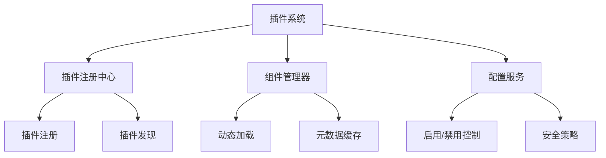
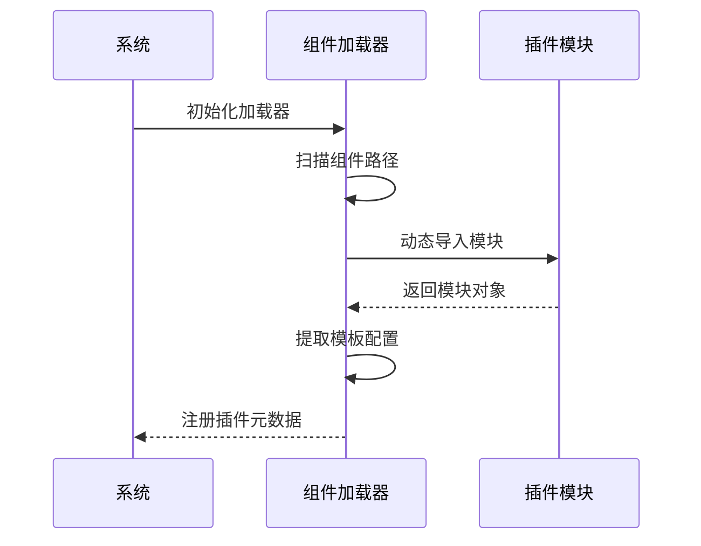
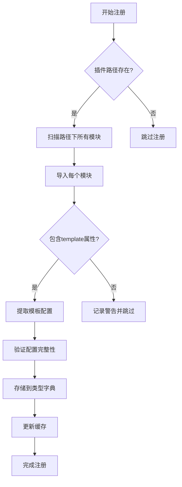
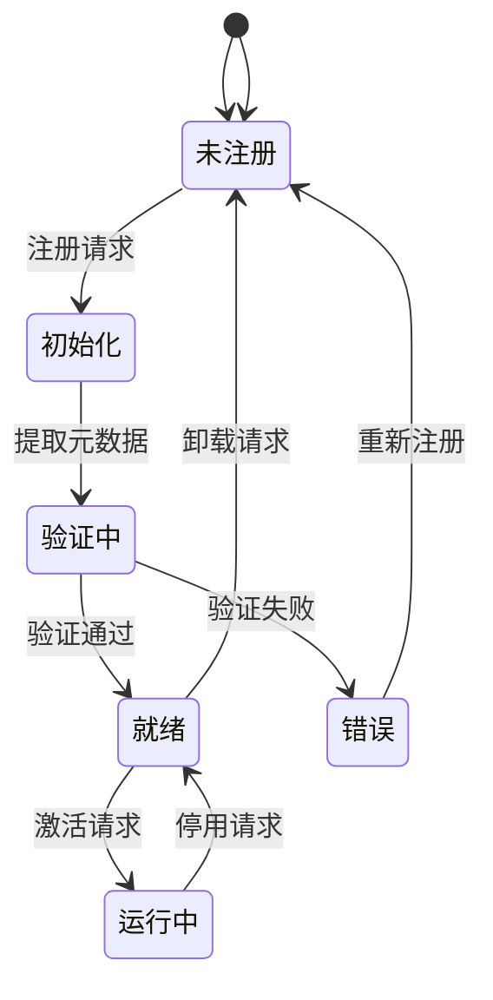
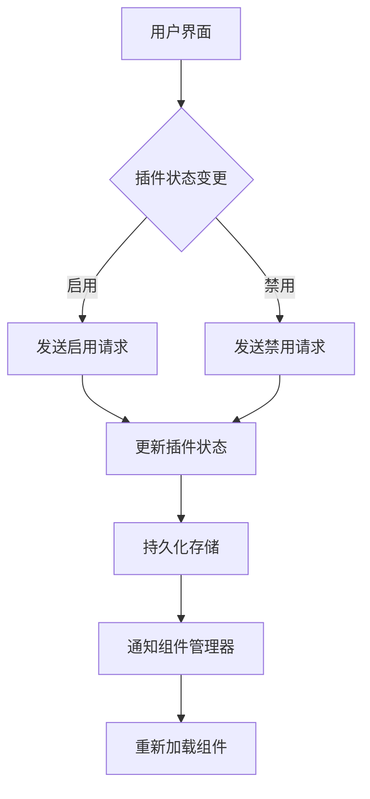

# 插件系统

<cite>
**本文档引用的文件**  
- [vibesurf_registry.py](file://vibe_surf/tools/vibesurf_registry.py)
- [components.py](file://vibe_surf/langflow/interface/components.py)
- [custom_component.py](file://vibe_surf/langflow/components/custom_component/custom_component.py)
- [utils.py](file://vibe_surf/langflow/custom/utils.py)
- [settings-integrations.js](file://vibe_surf/chrome_extension/scripts/settings-integrations.js)
- [main.py](file://vibe_surf/backend/main.py)
- [vibesurf_tools.py](file://vibe_surf/tools/vibesurf_tools.py)
</cite>

## 目录
1. [系统架构概述](#系统架构概述)
2. [插件加载机制](#插件加载机制)
3. [插件接口规范](#插件接口规范)
4. [插件生命周期管理](#插件生命周期管理)
5. [安全机制](#安全机制)
6. [配置管理](#配置管理)
7. [插件开发模板与最佳实践](#插件开发模板与最佳实践)

## 系统架构概述

VibeSurf的LLM插件系统采用模块化设计，通过动态加载和注册机制实现插件的灵活扩展。系统核心由插件注册中心、组件管理器和配置服务组成，支持第三方插件的安全集成和运行时管理。



**图示来源**
- [vibesurf_registry.py](file://vibe_surf/tools/vibesurf_registry.py#L34-L53)
- [components.py](file://vibe_surf/langflow/interface/components.py#L159-L177)

## 插件加载机制

### 动态导入流程

插件系统通过动态导入机制加载第三方插件。系统在启动时扫描指定的组件路径，使用importlib动态加载插件模块，并提取插件的元数据信息。



**图示来源**
- [components.py](file://vibe_surf/langflow/interface/components.py#L755-L776)
- [utils.py](file://vibe_surf/langflow/custom/utils.py#L779-L868)

### 注册流程

插件注册流程包括元数据提取、类型验证和缓存存储三个阶段。系统通过Registry模式管理所有已注册的插件，确保插件的唯一性和可追溯性。



**图示来源**
- [components.py](file://vibe_surf/langflow/interface/components.py#L159-L177)
- [vibesurf_registry.py](file://vibe_surf/tools/vibesurf_registry.py#L34-L53)

## 插件接口规范

### 必需功能

插件必须实现以下核心功能：

- **template属性**：定义插件的配置模板，包括输入字段、参数类型和默认值
- **build方法**：实现插件的核心业务逻辑
- **特殊参数支持**：支持浏览器会话、文件系统、LLM模型等上下文参数

```python
class CustomComponent:
    def __init__(self):
        self.template = {
            "type_name": "CustomComponent",
            "fields": [
                {
                    "name": "code",
                    "field_type": "code",
                    "required": True,
                    "value": "def build(self):\n    pass"
                }
            ]
        }
    
    def build(self, *args, **kwargs):
        raise NotImplementedError
```

**代码片段来源**
- [custom_component.py](file://vibe_surf/langflow/components/custom_component/custom_component.py#L83-L118)
- [custom_components.py](file://vibe_surf/langflow/template/frontend_node/custom_components.py#L45-L97)

### 回调方法

插件需要实现以下回调方法以支持系统集成：

- **on_load**：插件加载时的初始化回调
- **on_unload**：插件卸载时的清理回调
- **on_error**：错误处理回调
- **on_update**：配置更新回调

## 插件生命周期管理

### 初始化阶段

插件在注册时完成初始化，系统会验证插件的配置完整性并建立必要的依赖关系。



**图示来源**
- [components.py](file://vibe_surf/langflow/interface/components.py#L159-L177)
- [vibesurf_registry.py](file://vibe_surf/tools/vibesurf_registry.py#L34-L53)

### 运行时交互

插件在运行时通过预定义的接口与系统进行交互，包括参数传递、状态更新和结果返回。

### 清理过程

插件卸载时，系统会调用on_unload回调，释放所有占用的资源并清除缓存。

## 安全机制

### 代码安全检查

系统对插件代码进行严格的安全检查，防止恶意代码执行。

```python
def remove_import_statements(code: str) -> str:
    """移除代码中的import语句"""
    lines = code.split('\n')
    return '\n'.join(line for line in lines if not line.strip().startswith('import'))

def check_dangerous_operations(code: str) -> bool:
    """检查危险操作"""
    dangerous_keywords = [
        'subprocess', 'sys', 'importlib', 'eval', 'exec',
        'compile', 'open', 'file', 'input', 'raw_input'
    ]
    code_lower = code.lower()
    return any(keyword in code_lower for keyword in dangerous_keywords)
```

**代码片段来源**
- [vibesurf_tools.py](file://vibe_surf/tools/vibesurf_tools.py#L1060-L1077)
- [anti_detection.py](file://vibe_surf/workflows/Recruitment/boss_zhipin/anti_detection.py#L122-L158)

### 权限控制

系统通过OAuth和API密钥等方式控制插件的权限，确保插件只能访问授权的资源。

## 配置管理

### 启用/禁用控制

用户可以通过设置界面启用或禁用特定插件，系统会持久化存储用户的配置选择。



**图示来源**
- [settings-integrations.js](file://vibe_surf/chrome_extension/scripts/settings-integrations.js#L609-L655)
- [components.py](file://vibe_surf/langflow/interface/components.py#L159-L177)

### 配置持久化

插件配置通过本地存储和数据库双重机制进行持久化，确保配置的可靠性和一致性。

## 插件开发模板与最佳实践

### 开发模板

```python
from vibe_surf.tools.vibesurf_registry import VibeSurfRegistry
from pydantic import BaseModel

class MyPlugin(VibeSurfRegistry):
    def __init__(self):
        super().__init__()
        self.template = {
            "type_name": "MyPlugin",
            "fields": [
                {
                    "name": "api_key",
                    "field_type": "str",
                    "required": True,
                    "placeholder": "Enter your API key"
                }
            ]
        }
    
    def build(self, api_key: str, **kwargs):
        # 插件核心逻辑
        pass
```

**代码片段来源**
- [vibesurf_registry.py](file://vibe_surf/tools/vibesurf_registry.py#L34-L53)
- [custom_component.py](file://vibe_surf/langflow/components/custom_component/custom_component.py#L83-L118)

### 最佳实践

1. **最小权限原则**：插件只请求必要的权限
2. **错误处理**：实现完善的错误处理机制
3. **性能优化**：避免阻塞主线程
4. **文档完整**：提供清晰的使用说明
5. **版本兼容**：确保向后兼容性

**本节来源**
- [vibesurf_registry.py](file://vibe_surf/tools/vibesurf_registry.py#L34-L53)
- [components.py](file://vibe_surf/langflow/interface/components.py#L159-L177)
- [vibesurf_tools.py](file://vibe_surf/tools/vibesurf_tools.py#L1060-L1077)