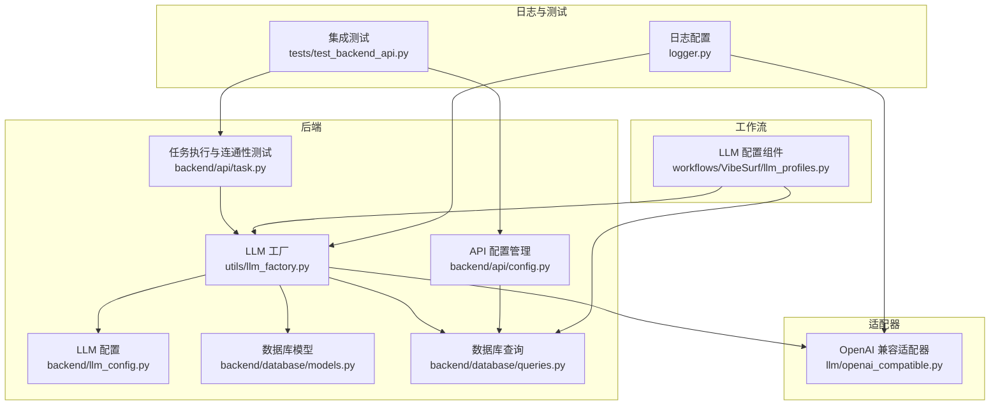
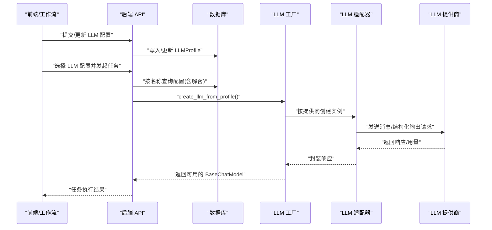
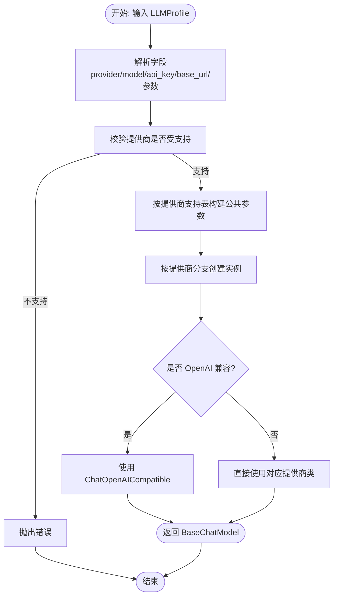
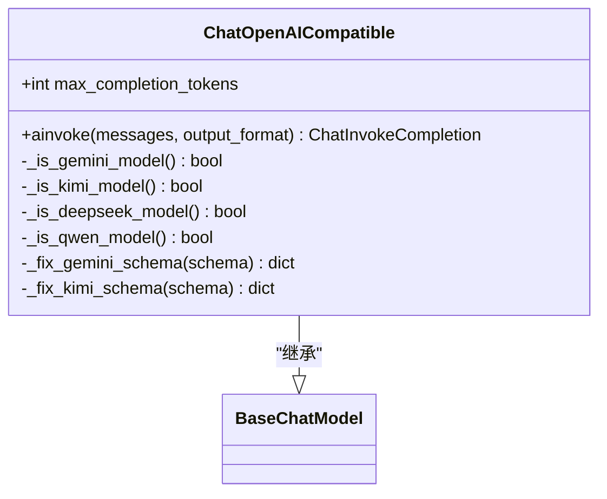
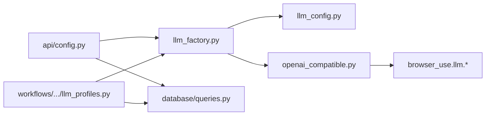

# 适配器开发

<cite>
**本文引用的文件列表**
- [llm_factory.py](file://vibe_surf/backend/utils/llm_factory.py)
- [llm_config.py](file://vibe_surf/backend/llm_config.py)
- [openai_compatible.py](file://vibe_surf/llm/openai_compatible.py)
- [models.py](file://vibe_surf/backend/database/models.py)
- [queries.py](file://vibe_surf/backend/database/queries.py)
- [config.py](file://vibe_surf/backend/api/config.py)
- [task.py](file://vibe_surf/backend/api/task.py)
- [llm_profiles.py](file://vibe_surf/workflows/VibeSurf/llm_profiles.py)
- [logger.py](file://vibe_surf/logger.py)
- [test_backend_api.py](file://tests/test_backend_api.py)
- [browser_use_agent.py](file://vibe_surf/agents/browser_use_agent.py)
- [views.py](file://vibe_surf/agents/views.py)
</cite>

## 目录
1. [引言](#引言)
2. [项目结构](#项目结构)
3. [核心组件](#核心组件)
4. [架构总览](#架构总览)
5. [详细组件分析](#详细组件分析)
6. [依赖关系分析](#依赖关系分析)
7. [性能考量](#性能考量)
8. [故障排查指南](#故障排查指南)
9. [结论](#结论)
10. [附录](#附录)

## 引言
本文件面向希望为 VibeSurf 新增 LLM 提供商适配器的开发者，系统性地说明从“如何创建适配器”到“如何注册并集成”的全流程，覆盖接口契约、配置参数、错误处理、测试策略、性能监控与日志规范，并提供调试指引，帮助快速、稳定地完成适配与上线。

## 项目结构
围绕 LLM 适配器的关键目录与文件：
- 后端工厂与配置：backend/utils/llm_factory.py、backend/llm_config.py
- 适配器实现：llm/openai_compatible.py（通用兼容适配器）
- 数据模型与查询：backend/database/models.py、backend/database/queries.py
- API 管理：backend/api/config.py、backend/api/task.py
- 工作流集成：workflows/VibeSurf/llm_profiles.py
- 日志与监控：logger.py
- 测试：tests/test_backend_api.py
- 使用示例：agents/browser_use_agent.py、agents/views.py

图表来源
- [llm_factory.py](file://vibe_surf/backend/utils/llm_factory.py#L1-L275)
- [llm_config.py](file://vibe_surf/backend/llm_config.py#L1-L226)
- [openai_compatible.py](file://vibe_surf/llm/openai_compatible.py#L1-L373)
- [models.py](file://vibe_surf/backend/database/models.py#L57-L93)
- [queries.py](file://vibe_surf/backend/database/queries.py#L1-L200)
- [config.py](file://vibe_surf/backend/api/config.py#L77-L191)
- [task.py](file://vibe_surf/backend/api/task.py#L53-L182)
- [llm_profiles.py](file://vibe_surf/workflows/VibeSurf/llm_profiles.py#L1-L104)
- [logger.py](file://vibe_surf/logger.py#L1-L99)
- [test_backend_api.py](file://tests/test_backend_api.py#L1-L777)

章节来源
- [llm_factory.py](file://vibe_surf/backend/utils/llm_factory.py#L1-L275)
- [llm_config.py](file://vibe_surf/backend/llm_config.py#L1-L226)

## 核心组件
- LLM 工厂：根据数据库配置动态创建不同提供商的 LLM 实例，统一参数映射与校验。
- LLM 配置：集中维护支持的提供商、默认模型、元数据（是否需要 API Key、是否需要 base_url 等）。
- OpenAI 兼容适配器：在 OpenAI 兼容 API 上自动修复特定模型的 schema 限制，增强结构化输出稳定性。
- 数据层：LLMProfile 模型与查询封装，包含加密存储 API Key、温度、最大 token 等参数。
- API 层：LLM 配置的增删改查、默认配置获取、任务提交时的连通性测试。
- 工作流层：LangFlow 组件从数据库读取配置并构建 LLM 实例。
- 日志与测试：统一日志配置与集成测试脚本。

章节来源
- [llm_factory.py](file://vibe_surf/backend/utils/llm_factory.py#L1-L275)
- [llm_config.py](file://vibe_surf/backend/llm_config.py#L1-L226)
- [openai_compatible.py](file://vibe_surf/llm/openai_compatible.py#L1-L373)
- [models.py](file://vibe_surf/backend/database/models.py#L57-L93)
- [queries.py](file://vibe_surf/backend/database/queries.py#L1-L200)
- [config.py](file://vibe_surf/backend/api/config.py#L77-L191)
- [task.py](file://vibe_surf/backend/api/task.py#L53-L182)
- [llm_profiles.py](file://vibe_surf/workflows/VibeSurf/llm_profiles.py#L1-L104)
- [logger.py](file://vibe_surf/logger.py#L1-L99)
- [test_backend_api.py](file://tests/test_backend_api.py#L1-L777)

## 架构总览
下图展示了从“配置管理”到“实例创建”再到“调用链路”的整体流程。

图表来源
- [llm_factory.py](file://vibe_surf/backend/utils/llm_factory.py#L23-L216)
- [queries.py](file://vibe_surf/backend/database/queries.py#L110-L139)
- [config.py](file://vibe_surf/backend/api/config.py#L77-L191)
- [task.py](file://vibe_surf/backend/api/task.py#L53-L182)
- [openai_compatible.py](file://vibe_surf/llm/openai_compatible.py#L212-L373)

## 详细组件分析

### LLM 工厂与适配器注册
- 职责
  - 将数据库中的 LLMProfile 映射为具体的 LLM 实例。
  - 基于提供商差异，统一注入温度、最大 token、top_p、频率惩罚、种子等参数。
  - 对不支持的参数进行过滤，避免传给不支持的提供商。
  - 支持 OpenAI 兼容适配器，用于修复特定模型的 schema 限制。
- 关键点
  - 参数支持表：不同提供商支持的参数不同，工厂会按表过滤。
  - OpenAI 兼容：当 provider 为 openai_compatible 或某些特殊模型时，使用适配器类。
  - 错误处理：捕获异常并转换为运行时错误，便于上层感知。

图表来源
- [llm_factory.py](file://vibe_surf/backend/utils/llm_factory.py#L23-L216)

章节来源
- [llm_factory.py](file://vibe_surf/backend/utils/llm_factory.py#L23-L216)

### OpenAI 兼容适配器（Schema 修复与结构化输出）
- 职责
  - 在 OpenAI 兼容 API 上自动识别模型类型（如 Gemini、Kimi/Moonshot、Qwen、DeepSeek），应用相应 schema 修复。
  - 当请求结构化输出时，自动注入 JSON Schema 或将 schema 写入系统提示，提升解析成功率。
  - 统一处理速率限制、连接失败、状态码错误等异常，转换为统一的 ModelProviderError。
- 关键点
  - 模型识别：通过模型名前缀判断。
  - Schema 修复：移除不被支持的属性、解析 $ref、必要时填充占位属性。
  - 结构化输出：优先尝试 response_format=json_schema；若提供商不支持，则将 schema 注入系统提示。
  - 异常映射：将第三方异常映射为统一错误类型，便于上层处理。

图表来源
- [openai_compatible.py](file://vibe_surf/llm/openai_compatible.py#L63-L373)

章节来源
- [openai_compatible.py](file://vibe_surf/llm/openai_compatible.py#L63-L373)

### LLM 配置与参数契约
- 支持的提供商与默认模型
  - 通过集中配置维护所有提供商及其模型清单、显示名、是否需要 API Key、是否需要 base_url、是否支持工具/视觉等元信息。
- 参数契约
  - 必填项：provider、model；根据提供商元数据决定是否需要 api_key、base_url。
  - 可选参数：temperature、max_tokens、top_p、frequency_penalty、seed；部分提供商不支持某些参数。
- 参数支持表
  - 工厂按表过滤参数，避免传递不支持的字段。

章节来源
- [llm_config.py](file://vibe_surf/backend/llm_config.py#L1-L226)
- [llm_factory.py](file://vibe_surf/backend/utils/llm_factory.py#L49-L82)

### 数据模型与查询（LLMProfile）
- 字段要点
  - provider、model、base_url、encrypted_api_key（加密存储）、temperature、max_tokens、top_p、frequency_penalty、seed、provider_config、is_default、is_active 等。
- 查询能力
  - 创建、查询、列表、更新（含加密 API Key 处理）、按名称获取并解密 API Key。
- 安全性
  - API Key 存储加密，仅在需要时解密；对外响应模型不包含敏感字段。

章节来源
- [models.py](file://vibe_surf/backend/database/models.py#L57-L93)
- [queries.py](file://vibe_surf/backend/database/queries.py#L21-L139)

### API 管理与任务连通性测试
- 配置管理
  - 创建/更新/删除/列表/按名称获取 LLM 配置；列表时可按活跃度筛选。
- 连通性测试
  - 任务提交前，使用配置创建 LLM 实例并发送简单消息，验证可用性；若失败，返回明确错误类型，前端可弹窗提示。

章节来源
- [config.py](file://vibe_surf/backend/api/config.py#L77-L191)
- [task.py](file://vibe_surf/backend/api/task.py#L53-L182)

### 工作流集成（LangFlow 组件）
- LLMProfilesComponent
  - 动态拉取 LLM 配置列表，支持默认配置优先；选择后从数据库读取并解密，再交由工厂创建实例。
- 使用场景
  - 在 LangFlow 图中作为输入，输出 LanguageModel，供下游 Agent 使用。

章节来源
- [llm_profiles.py](file://vibe_surf/workflows/VibeSurf/llm_profiles.py#L1-L104)

### 日志与监控
- 日志
  - 统一日志初始化，支持控制台与文件双通道，按日期轮转，支持 DEBUG/INFO 级别。
- 监控
  - 适配器内部对异常进行统一包装，便于上层捕获与上报。
  - 建议在关键路径增加埋点（如请求耗时、错误码分布、模型用量）。

章节来源
- [logger.py](file://vibe_surf/logger.py#L1-L99)
- [openai_compatible.py](file://vibe_surf/llm/openai_compatible.py#L341-L373)

## 依赖关系分析
- 组件耦合
  - 工厂依赖配置模块与适配器类；适配器依赖 browser_use 的 BaseChatModel 与消息序列化。
  - API 层依赖数据库查询；工作流组件依赖共享状态与数据库查询。
- 外部依赖
  - 第三方 LLM SDK（如 OpenAI、Anthropic、Google、Azure OpenAI 等）通过 browser_use 提供的类接入。
- 潜在循环
  - 未见直接循环导入；工厂与适配器通过字符串分支解耦。

图表来源
- [llm_factory.py](file://vibe_surf/backend/utils/llm_factory.py#L1-L275)
- [llm_config.py](file://vibe_surf/backend/llm_config.py#L1-L226)
- [openai_compatible.py](file://vibe_surf/llm/openai_compatible.py#L1-L373)
- [queries.py](file://vibe_surf/backend/database/queries.py#L1-L200)
- [config.py](file://vibe_surf/backend/api/config.py#L77-L191)
- [llm_profiles.py](file://vibe_surf/workflows/VibeSurf/llm_profiles.py#L1-L104)

## 性能考量
- 参数过滤与最小化请求体
  - 仅传递提供商支持的参数，减少无效字段导致的错误或降级。
- 连通性测试
  - 任务提交前进行轻量测试，避免无效配置导致长时间阻塞。
- 日志级别
  - 生产环境建议 INFO，避免过多 DEBUG 日志影响性能。
- 并发与重试
  - 适配器已内置对速率限制与连接错误的处理；建议在上层引入指数退避与熔断策略（视业务需要）。

[本节为通用指导，无需列出具体文件来源]

## 故障排查指南
- 常见错误类型
  - 不支持的提供商：检查 llm_config 中是否已登记该提供商。
  - 缺少必需参数：根据提供商元数据确认是否需要 api_key 或 base_url。
  - 连接失败/速率限制：适配器会将第三方异常映射为统一错误，可在日志中定位。
- 前端提示
  - 当任务提交返回 llm_connection_failed 时，前端应弹窗提示并引导用户检查配置。
- 排查步骤
  - 确认数据库中配置存在且 is_active=true。
  - 使用 API 列表/获取接口验证配置正确。
  - 手动触发一次连通性测试（参考任务提交逻辑）。
  - 查看后端日志，定位异常堆栈与错误码。

章节来源
- [llm_config.py](file://vibe_surf/backend/llm_config.py#L202-L226)
- [llm_factory.py](file://vibe_surf/backend/utils/llm_factory.py#L222-L275)
- [task.py](file://vibe_surf/backend/api/task.py#L53-L182)
- [logger.py](file://vibe_surf/logger.py#L1-L99)

## 结论
通过“配置中心 + 工厂 + 适配器 + 数据层 + API + 工作流”的分层设计，VibeSurf 已形成一套可扩展、可测试、可观测的 LLM 适配体系。新增提供商只需在配置中登记、在工厂中添加分支、并在需要时提供适配器即可快速上线；同时，完善的参数过滤、错误映射与日志监控保障了稳定性与可运维性。

[本节为总结性内容，无需列出具体文件来源]

## 附录

### 如何为新提供商创建适配器（步骤清单）
- 步骤 1：在配置中登记提供商
  - 在 llm_config.py 中添加提供商名称、默认模型、是否需要 API Key/base_url、是否支持工具/视觉等元信息。
  - 若有模型清单，补充到 PROVIDER_MODELS。
- 步骤 2：在工厂中添加分支
  - 在 llm_factory.py 的 create_llm_from_profile 分支中添加新提供商分支，按需设置 base_url、认证参数、默认参数。
  - 更新参数支持表，确保只传递该提供商支持的参数。
- 步骤 3：必要时提供适配器
  - 若新提供商需要 schema 修复或结构化输出增强，可复用或扩展 openai_compatible.py 的模式，继承 BaseChatModel 并实现统一的 ainvoke。
- 步骤 4：完善参数提取与校验
  - 在 llm_factory.py 的 get_llm_creation_parameters 中完善必填/可选参数清单，结合提供商元数据进行校验。
- 步骤 5：完善 API 与工作流
  - 确保 API 能创建/更新/列出配置；工作流组件能动态加载配置并构建实例。
- 步骤 6：测试与监控
  - 编写集成测试，覆盖配置 CRUD、连通性测试、错误场景。
  - 开启日志，观察关键路径耗时与错误分布。

章节来源
- [llm_config.py](file://vibe_surf/backend/llm_config.py#L1-L226)
- [llm_factory.py](file://vibe_surf/backend/utils/llm_factory.py#L23-L275)
- [openai_compatible.py](file://vibe_surf/llm/openai_compatible.py#L63-L373)
- [config.py](file://vibe_surf/backend/api/config.py#L77-L191)
- [llm_profiles.py](file://vibe_surf/workflows/VibeSurf/llm_profiles.py#L1-L104)
- [test_backend_api.py](file://tests/test_backend_api.py#L1-L777)

### 请求构造到响应解析的完整流程（代码路径）
- 配置管理
  - 创建/更新/删除/列表/按名称获取 LLM 配置。
- 实例创建
  - 从数据库读取配置并解密 API Key，工厂按提供商创建实例。
- 调用链路
  - 适配器统一处理消息序列化、参数映射、结构化输出、schema 修复与异常映射。
- 返回封装
  - 统一封装为 ChatInvokeCompletion，包含 completion 与 usage。

章节来源
- [config.py](file://vibe_surf/backend/api/config.py#L77-L191)
- [queries.py](file://vibe_surf/backend/database/queries.py#L110-L139)
- [llm_factory.py](file://vibe_surf/backend/utils/llm_factory.py#L23-L216)
- [openai_compatible.py](file://vibe_surf/llm/openai_compatible.py#L212-L373)

### 测试策略（单元与集成）
- 单元测试
  - 针对 llm_factory 的参数过滤、分支创建、错误处理。
  - 针对 openai_compatible 的 schema 修复与结构化输出。
- 集成测试
  - 使用 tests/test_backend_api.py 的模式，覆盖 LLM 配置 CRUD、默认配置、任务提交与连通性测试。
  - 建议新增针对新提供商的端到端场景，包括错误场景（如 API Key 错误、网络超时）。

章节来源
- [test_backend_api.py](file://tests/test_backend_api.py#L1-L777)
- [llm_factory.py](file://vibe_surf/backend/utils/llm_factory.py#L222-L275)
- [openai_compatible.py](file://vibe_surf/llm/openai_compatible.py#L341-L373)

### 性能监控与日志规范
- 日志
  - 使用 logger.py 初始化日志；生产环境建议 INFO；DEBUG 仅在排障时开启。
- 监控
  - 建议在关键路径埋点（请求耗时、错误码、用量统计），并与适配器的异常映射配合，便于快速定位问题。

章节来源
- [logger.py](file://vibe_surf/logger.py#L1-L99)
- [openai_compatible.py](file://vibe_surf/llm/openai_compatible.py#L341-L373)

### 使用示例（Agent 侧）
- 在 Agent 中直接注入 LLM 实例（BaseChatModel），即可使用统一的消息格式与结构化输出能力。
- 可参考 BrowserUseAgent 的初始化与运行方式，确保 token 成本统计与工作目录准备。

章节来源
- [browser_use_agent.py](file://vibe_surf/agents/browser_use_agent.py#L1-L286)
- [views.py](file://vibe_surf/agents/views.py#L1-L41)