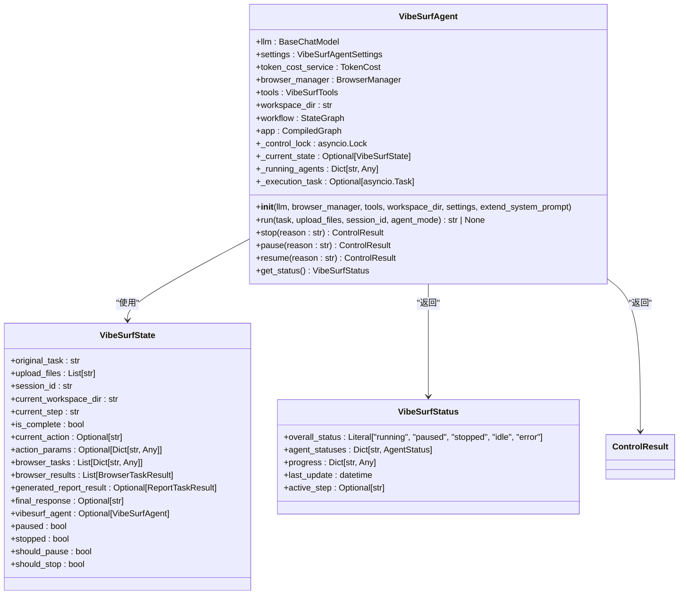
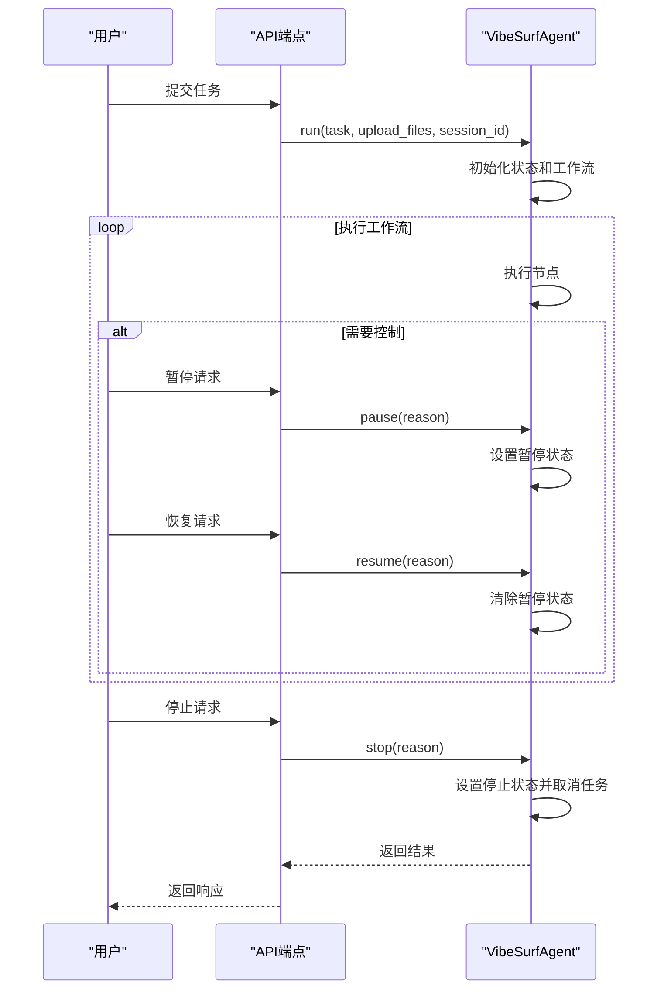
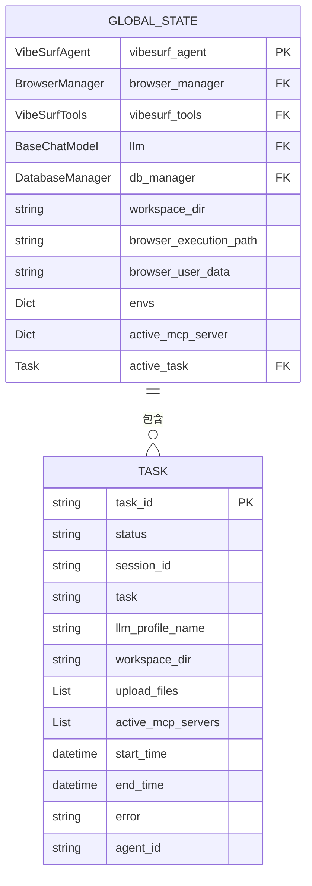
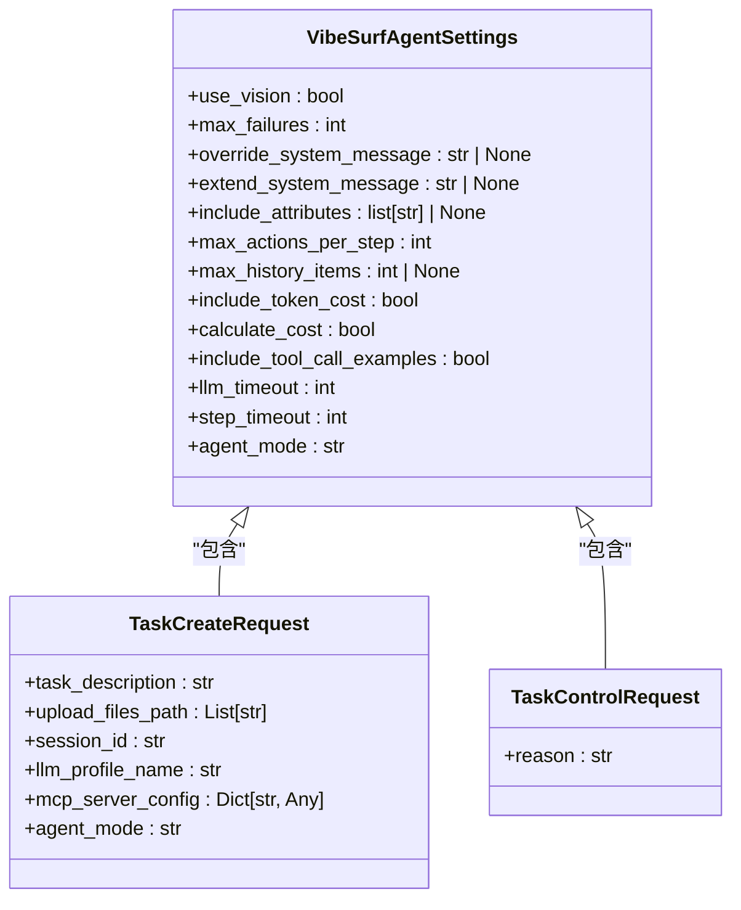
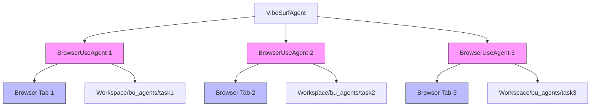

# 代理管理

<cite>
**本文档引用的文件**   
- [vibe_surf_agent.py](file://vibe_surf/agents/vibe_surf_agent.py)
- [agent.py](file://vibe_surf/backend/api/agent.py)
- [shared_state.py](file://vibe_surf/backend/shared_state.py)
- [task.py](file://vibe_surf/backend/api/task.py)
- [views.py](file://vibe_surf/agents/views.py)
</cite>

## 目录
1. [VibeSurf代理系统概述](#vibesurf代理系统概述)
2. [VibeSurfAgent类设计模式](#vibesurfagent类设计模式)
3. [代理生命周期管理](#代理生命周期管理)
4. [REST API端点](#rest-api端点)
5. [全局状态管理](#全局状态管理)
6. [代理配置选项](#代理配置选项)
7. [代理隔离机制](#代理隔离机制)
8. [健康检查与性能监控](#健康检查与性能监控)
9. [代码示例](#代码示例)

## VibeSurf代理系统概述

VibeSurf代理管理系统是一个基于LangGraph工作流的复杂代理框架，旨在实现多代理并行处理和智能浏览器工作流。系统通过VibeSurfAgent类作为核心控制器，协调多个子代理（如浏览器使用代理）的执行，支持深度研究和广泛探索。该系统采用模块化设计，将代理管理、状态跟踪、API暴露和全局状态管理分离，确保了系统的可扩展性和维护性。

系统架构采用单任务执行模型，通过FastAPI提供REST接口，支持任务提交、控制（暂停/恢复/停止）和状态监控。代理执行过程中，系统会记录详细的活动日志，包括思考过程、评估、记忆和下一步目标等信息，为用户提供透明的执行视图。此外，系统还集成了Telemetry服务，用于捕获代理执行的遥测数据，包括启动、完成和错误事件。

**Section sources**
- [vibe_surf_agent.py](file://vibe_surf/agents/vibe_surf_agent.py#L1041-L1835)
- [main.py](file://vibe_surf/backend/main.py#L1-L794)

## VibeSurfAgent类设计模式

VibeSurfAgent类是VibeSurf代理管理系统的核心，采用基于LangGraph的工作流模式实现。该类通过`__init__`方法初始化，接收LLM、浏览器管理器、工具集和工作空间目录等关键组件。其设计模式体现了控制反转和依赖注入原则，允许灵活配置和扩展。

类的核心是`run`方法，它启动代理的执行流程。执行流程由多个节点组成，包括`vibesurf_agent_node`、`browser_task_execution_node`和`report_task_execution_node`，这些节点通过`create_vibe_surf_workflow`函数构建。每个节点都实现了特定的功能，如任务路由、浏览器任务执行和报告生成。节点之间通过`route_after_vibesurf_agent`函数进行路由，根据代理的决策将控制流导向不同的执行路径。

VibeSurfAgent类还实现了控制状态管理，通过`_control_lock`确保线程安全，`_current_state`跟踪当前执行状态，`_running_agents`管理正在运行的子代理。这种设计模式支持复杂的控制操作，如暂停、恢复和停止，同时保持系统的稳定性和可靠性。



**Diagram sources **
- [vibe_surf_agent.py](file://vibe_surf/agents/vibe_surf_agent.py#L1041-L1835)
- [views.py](file://vibe_surf/agents/views.py#L75-L76)

**Section sources**
- [vibe_surf_agent.py](file://vibe_surf/agents/vibe_surf_agent.py#L1041-L1835)
- [views.py](file://vibe_surf/agents/views.py#L75-L76)

## 代理生命周期管理

VibeSurf代理的生命周期管理通过一系列控制方法实现，包括创建、初始化、执行、暂停、恢复和停止。代理的创建和初始化在`__init__`方法中完成，接收必要的组件和配置。执行通过`run`方法启动，该方法初始化状态并调用LangGraph工作流。

代理的控制操作通过`stop`、`pause`和`resume`方法实现。`stop`方法立即停止代理执行，设置`_current_state.stopped`为`True`，并取消执行任务。`pause`方法暂停代理执行，设置`_current_state.should_pause`为`True`，并暂停所有运行的子代理。`resume`方法恢复代理执行，清除暂停状态，并恢复所有暂停的子代理。

代理的生命周期还涉及状态跟踪和日志记录。`get_status`方法返回当前代理状态，包括整体状态、代理状态和进度信息。`add_new_task`方法允许在执行过程中添加新任务或指导，通过`_create_sub_agent_prompt`方法生成通用提示，并传播到所有运行的子代理。



**Diagram sources **
- [vibe_surf_agent.py](file://vibe_surf/agents/vibe_surf_agent.py#L1172-L1302)
- [task.py](file://vibe_surf/backend/api/task.py#L197-L302)

**Section sources**
- [vibe_surf_agent.py](file://vibe_surf/agents/vibe_surf_agent.py#L1172-L1302)
- [task.py](file://vibe_surf/backend/api/task.py#L197-L302)

## REST API端点

VibeSurf代理管理系统通过FastAPI暴露一系列REST API端点，用于创建、启动、停止和删除代理。这些端点位于`vibe_surf/backend/api`目录下，主要由`agent.py`和`task.py`文件定义。

`/api/tasks/submit`端点用于提交新任务，接收`TaskCreateRequest`对象，包含任务描述、上传文件、会话ID和LLM配置。`/api/tasks/pause`、`/api/tasks/resume`和`/api/tasks/stop`端点分别用于暂停、恢复和停止当前任务，接收`TaskControlRequest`对象，包含操作原因。`/api/tasks/status`端点用于检查任务状态，返回是否有活动任务和当前任务信息。

API端点的设计遵循REST原则，使用HTTP方法和状态码进行通信。例如，`POST /api/tasks/submit`使用POST方法提交任务，成功时返回200状态码，失败时返回500状态码。错误处理通过`HTTPException`实现，提供详细的错误信息。

```mermaid
flowchart TD
A[客户端] --> B[/api/tasks/submit]
A --> C[/api/tasks/pause]
A --> D[/api/tasks/resume]
A --> E[/api/tasks/stop]
A --> F[/api/tasks/status]
B --> G[验证任务]
G --> H[创建任务记录]
H --> I[添加后台任务]
I --> J[返回提交结果]
C --> K[验证代理]
K --> L[调用pause方法]
L --> M[更新任务状态]
M --> N[返回暂停结果]
D --> O[验证代理]
O --> P[调用resume方法]
P --> Q[更新任务状态]
Q --> R[返回恢复结果]
E --> S[验证代理]
S --> T[调用stop方法]
T --> U[清除任务]
U --> V[返回停止结果]
F --> W[调用is_task_running]
W --> X[返回任务状态]
```

**Diagram sources **
- [task.py](file://vibe_surf/backend/api/task.py#L34-L379)
- [agent.py](file://vibe_surf/backend/api/agent.py#L14-L38)

**Section sources**
- [task.py](file://vibe_surf/backend/api/task.py#L34-L379)
- [agent.py](file://vibe_surf/backend/api/agent.py#L14-L38)

## 全局状态管理

VibeSurf代理管理系统的全局状态管理通过`shared_state.py`文件实现。该文件定义了一系列全局变量，如`vibesurf_agent`、`browser_manager`、`vibesurf_tools`、`llm`和`db_manager`，用于在不同模块之间共享状态。

`get_all_components`函数返回所有组件的字典，`set_components`函数用于更新全局组件。`execute_task_background`函数在后台执行任务，更新`active_task`变量以跟踪当前活动任务。`is_task_running`函数检查是否有任务正在运行，`get_active_task_info`函数获取当前活动任务信息，`clear_active_task`函数清除活动任务。

全局状态管理还涉及环境变量和MCP服务器配置的管理。`envs`字典存储环境变量，`active_mcp_server`字典跟踪活动的MCP服务器。`_check_and_update_mcp_servers`和`_check_and_update_composio_tools`函数检查配置是否更改，并相应地更新工具。



**Diagram sources **
- [shared_state.py](file://vibe_surf/backend/shared_state.py#L37-L82)
- [task.py](file://vibe_surf/backend/api/task.py#L20-L25)

**Section sources**
- [shared_state.py](file://vibe_surf/backend/shared_state.py#L37-L82)
- [task.py](file://vibe_surf/backend/api/task.py#L20-L25)

## 代理配置选项

VibeSurf代理支持多种配置选项，包括LLM选择、工具集配置和执行策略。这些配置通过`VibeSurfAgentSettings`类定义，允许用户根据需求定制代理行为。

LLM选择通过`llm`参数实现，支持多种LLM模型，如GPT-4.1-mini。工具集配置通过`tools`参数实现，支持浏览器使用工具、文件系统工具和VibeSurf工具。执行策略通过`agent_mode`参数实现，支持"thinking"、"no-thinking"和"flash"模式。

代理还支持上传文件和会话ID的配置。`upload_files`参数指定用户上传的文件路径，`session_id`参数用于跟踪会话状态。`workspace_dir`参数指定工作空间目录，用于存储代理生成的文件。



**Diagram sources **
- [views.py](file://vibe_surf/agents/views.py#L58-L73)
- [task.py](file://vibe_surf/backend/api/task.py#L17-L18)

**Section sources**
- [views.py](file://vibe_surf/agents/views.py#L58-L73)
- [task.py](file://vibe_surf/backend/api/task.py#L17-L18)

## 代理隔离机制

VibeSurf代理管理系统通过多代理并行处理和资源隔离机制确保多代理并行执行时的资源独立性和安全性。系统在不同的浏览器标签页中同时运行多个AI代理，实现深度研究和广泛探索。

代理隔离通过`_running_agents`字典实现，每个代理都有唯一的ID，并在独立的浏览器会话中运行。`execute_parallel_browser_tasks`函数负责并行执行浏览器任务，为每个任务创建独立的`BrowserUseAgent`实例，并在独立的浏览器标签页中执行。

资源隔离通过工作空间目录和文件系统实现。每个代理都有独立的工作空间目录，用于存储生成的文件。`CustomFileSystem`类提供文件系统操作，确保代理之间的文件隔离。



**Diagram sources **
- [vibe_surf_agent.py](file://vibe_surf/agents/vibe_surf_agent.py#L607-L762)
- [browser_manager.py](file://vibe_surf/browser/browser_manager.py#L1-L100)

**Section sources**
- [vibe_surf_agent.py](file://vibe_surf/agents/vibe_surf_agent.py#L607-L762)
- [browser_manager.py](file://vibe_surf/browser/browser_manager.py#L1-L100)

## 健康检查与性能监控

VibeSurf代理管理系统提供健康检查和性能监控功能，确保代理的稳定运行和性能优化。健康检查通过`/health`端点实现，返回系统状态、时间戳和服务信息。

性能监控通过Telemetry服务实现，捕获代理执行的遥测数据，包括启动、完成和错误事件。`VibeSurfAgentTelemetryEvent`类定义遥测事件，包含版本、操作、任务描述、模型、提供者、持续时间和会话ID等信息。

系统还提供详细的活动日志，记录代理的思考过程、评估、记忆和下一步目标。`log_agent_activity`函数负责记录活动日志，`get_activity_logs`方法用于获取活动日志。

```mermaid
flowchart TD
A[健康检查] --> B[/health]
B --> C{系统状态}
C --> |健康| D[返回健康状态]
C --> |不健康| E[返回错误状态]
F[性能监控] --> G[Telemetry服务]
G --> H[VibeSurfAgentTelemetryEvent]
H --> I[启动事件]
H --> J[完成事件]
H --> K[错误事件]
L[活动日志] --> M[log_agent_activity]
M --> N[记录思考过程]
M --> O[记录评估]
M --> P[记录记忆]
M --> Q[记录下一步目标]
```

**Diagram sources **
- [main.py](file://vibe_surf/backend/main.py#L649-L658)
- [telemetry.py](file://vibe_surf/telemetry/service.py#L1-L100)
- [vibe_surf_agent.py](file://vibe_surf/agents/vibe_surf_agent.py#L193-L212)

**Section sources**
- [main.py](file://vibe_surf/backend/main.py#L649-L658)
- [telemetry.py](file://vibe_surf/telemetry/service.py#L1-L100)
- [vibe_surf_agent.py](file://vibe_surf/agents/vibe_surf_agent.py#L193-L212)

## 代码示例

以下代码示例展示了如何通过API创建具有特定配置的代理实例：

```python
import requests
import json

# 创建会话ID
response = requests.get('http://127.0.0.1:9335/generate-session-id')
session_id = response.json()['session_id']

# 提交任务
task_data = {
    "task_description": "搜索最新的AI技术新闻",
    "upload_files_path": [],
    "session_id": session_id,
    "llm_profile_name": "gpt-4.1-mini",
    "agent_mode": "thinking"
}

response = requests.post('http://127.0.0.1:9335/api/tasks/submit', json=task_data)
print(response.json())

# 检查任务状态
response = requests.get('http://127.0.0.1:9335/api/tasks/status')
print(response.json())

# 暂停任务
control_data = {"reason": "用户请求暂停"}
response = requests.post('http://127.0.0.1:9335/api/tasks/pause', json=control_data)
print(response.json())

# 恢复任务
response = requests.post('http://127.0.0.1:9335/api/tasks/resume', json=control_data)
print(response.json())

# 停止任务
response = requests.post('http://127.0.0.1:9335/api/tasks/stop', json=control_data)
print(response.json())
```

**Section sources**
- [task.py](file://vibe_surf/backend/api/task.py#L43-L146)
- [main.py](file://vibe_surf/backend/main.py#L661-L669)